# INDEX

- [INDEX](#index)
  - [Database](#database)
    - [Databases vs Spreadsheet](#databases-vs-spreadsheet)
    - [Types of Databases](#types-of-databases)
  - [Databases Oriented Approach](#databases-oriented-approach)
  - [Database Models](#database-models)
    - [Hierarchical Model](#hierarchical-model)
    - [Network Model](#network-model)
    - [Relational Model](#relational-model)
  - [Relational Databases](#relational-databases)
    - [Columns / Rows](#columns--rows)
    - [Relationships between tables](#relationships-between-tables)
    - [Keys](#keys)
    - [Data Consistency](#data-consistency)
  - [DBMS](#dbms)
    - [What DBMS do](#what-dbms-do)

---

## Database

Database is a collection of data, and is a method for accessing and manipulating that data, and a set of rules for ensuring that the data is accurate and consistent.

- Databases are just computers with computer programs that store data in a structured way. They are used to store and retrieve data in a consistent and efficient way.

  - as long as we have a computer with storage and memory, we can create a database.

- Database Acronyms:

  - **Database Management System:** It's a software that allows us to create and manage a database.
  - **Relational Database Management System:** It's a subset of DBMS that allows us to create and manage relational databases.
    - ex: MySQL, PostgreSQL, Oracle, Microsoft SQL Server, etc.
  - **Structured Query Language:** It's a language that allows us to interact with a relational database system.

- Types of Databases

  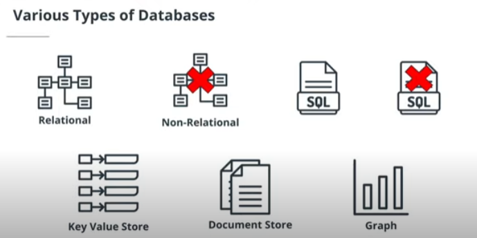

- `database schema` : The architecture or structure of a relational database, a statement of its tables and their columns.

---

### Databases vs Spreadsheet

There are several reasons why we use databases instead of Excel spreadsheets:

1. **Scalability:** Databases are designed to handle large amounts of data and are better suited for handling large datasets than Excel. Excel can become slow and unwieldy as the amount of data grows.
2. **Multiple users:** Databases allow multiple users to access and modify data simultaneously, whereas Excel files can only be accessed by one user at a time.
3. **Security:** Databases have built-in security features that allow for better control over who can access and modify data. Excel files, on the other hand, can be easily shared and modified by anyone who has access to them.
4. **Data integrity:** Databases provide mechanisms for ensuring the integrity of data, such as enforcing data constraints and validating data before it is stored. Excel does not have these built-in mechanisms and is more prone to errors and inconsistencies.
5. **Data organization:** Databases provide a structured way to organize data, making it easier to search, sort, and retrieve information. Excel, on the other hand, does not have a built-in structure for organizing data and is more prone to data entry errors.

> Overall, databases are better suited for handling large amounts of data, multiple users, and ensuring data security and integrity. Excel is still useful for small datasets or quick calculations, but for larger and more complex data management tasks, a database is often the better choice.

---

### Types of Databases

- `SQL/Relational Type Databases` : organize information in tables with connections(relationships) between these tables.
  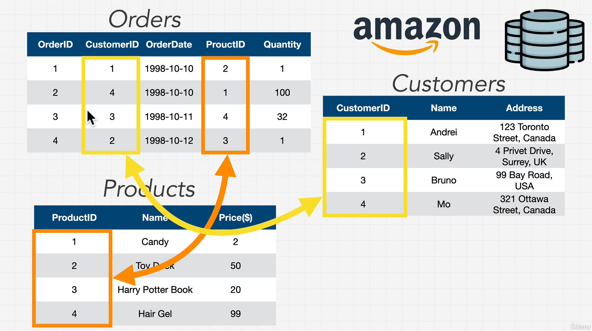
- `NoSQL (Document Model)` : can take a few different forms and are used for large sets of distributed data (like for use in micro service architectures).

  - MongoDB [Document store]
  - Elasticsearch [Document store]

- `Key-Value store`
  - Redis [Key Value store]
- `Graph` : It's for data that is connected in different ways.
- `Wide-column store (Column-oriented)` : it's for big tables with a lot of columns.
  - It's good for storing data that is not relational.
  - Apache Cassandra [Column oriented]

---

## Databases Oriented Approach

- `File Processing Systems` : It's a system that stores data in files. It's a way to store data in a computer.
  
  - it has a flaw, where if data changed in one file, other files won't be updated.
- To solve this we use **Relational Databases** which manages the data using **Models**.
  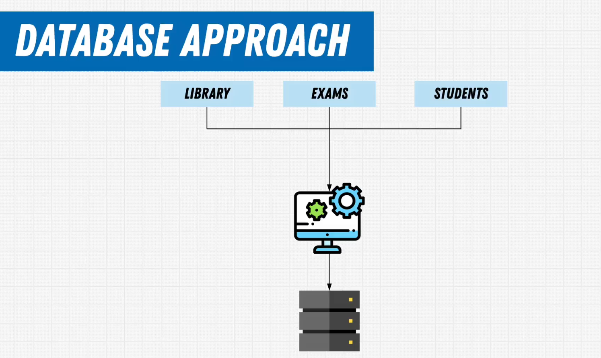

---

## Database Models

It's a way to organize dnd store data in a database.

There are 3 types of database models:

### Hierarchical Model

This model is based on a hierarchical structure where data is organized into a **tree-like structure**.
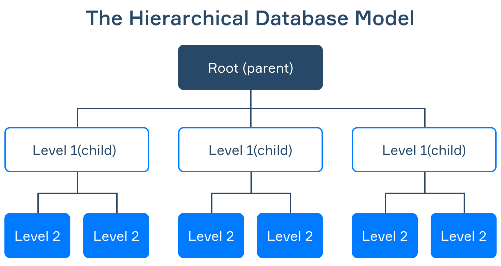

- Each record is connected to **one parent** record and can have multiple child records.
- This model is simple and easy to understand, but it can be inflexible and difficult to modify.

### Network Model

This model expands on the Hierarchical model and is based on a **graph structure** where data is organized into a network of records.
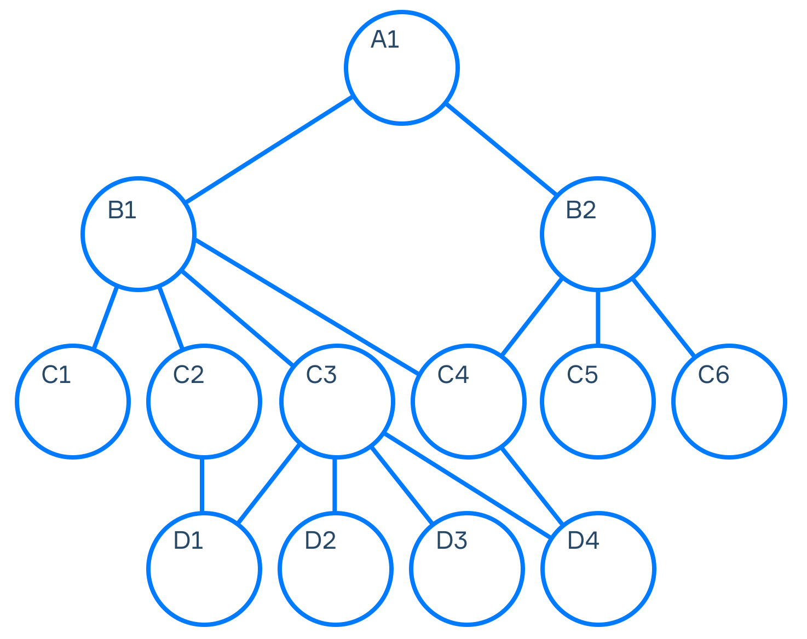

- Each record can have multiple parent records and multiple child records.
- This model is more flexible than the Hierarchical model, but it can be difficult to understand and modify as the relationships between records become more complex.

### Relational Model

This model is based on the **relational algebra** and is the most widely used database model today.
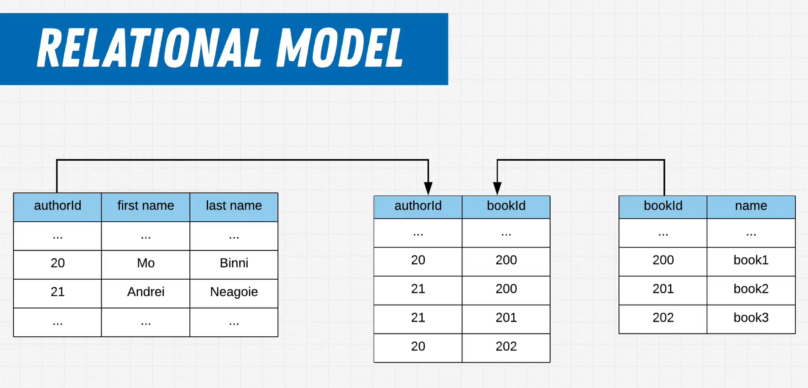

- It is based on the concept of **tables** where data is organized into rows and columns instead of a parent-child relationship.
- Each table represents a specific entity (e.g. a person, a place, or a thing) and each row represents a single instance of that entity.

---

## Relational Databases

### Columns / Rows

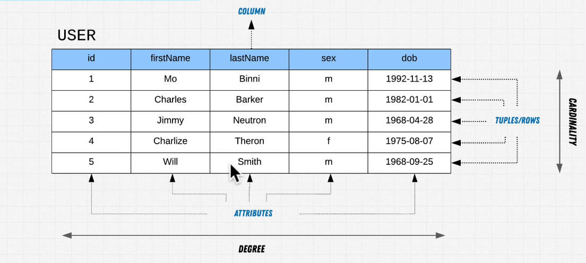

- **Columns**
  - **Degree** of relation: the number (collection) of columns that are used to identify a row.
  - columns can also be called **attributes**, and the columns headers are called **Domains / Constraint**.
- **Rows**
  - They are called **Tuples**. where a "tuple" is a single record of data in the table
  - **Cardinality:** the number of rows in a table.

---

### Relationships between tables

- **One to One:** It's a relationship between two tables where each record in one table is linked to one and only one record in another table.
  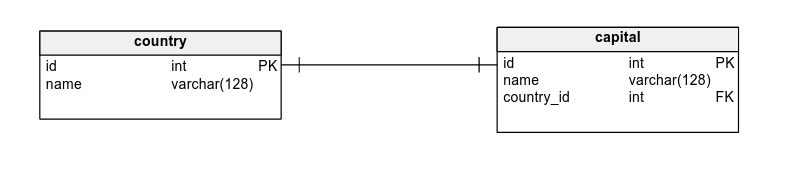
- **One to Many:** It's a relationship between two tables where each record in one table can be linked to one or more records in another table.
  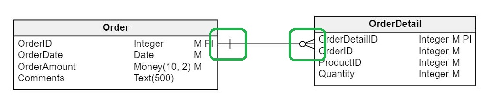

- **Many to Many:** It's a relationship between two tables where each record in one table can be linked to one or more records in another table and vice versa.
  

> **Note:** The **One to One** relationship is not common in relational databases, and it's usually better to combine the two tables into one table.

---

### Keys

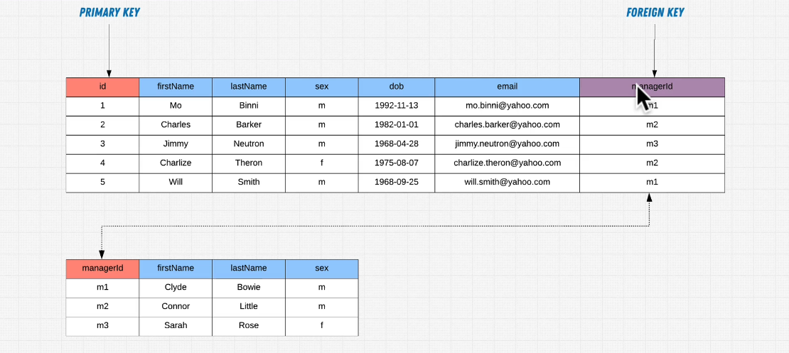

- **Primary Key:** It's a column or a set of columns that uniquely identifies a row in a table.
  - It's a column that has a unique value for each row of data.
  - It's a column that **can't** be `null`.
  - It's a column that **can't** be duplicated.
- **Foreign Key:** It's a terminology used in relational databases to refer to a column or a set of columns that is used to establish and enforce a **link (reference) between data in two tables**.
  - It's a column that has a value that matches the primary key of another table.
  - It's a column that **can** be `null`.
  - It's a column that **can** be duplicated.

> A **Foreign Key** is a key that will reference the **Primary Key** of another table. Therefore allowing a relationship between the two tables.
>
> - This is done by injecting the (foreign key column) into the table that will reference the primary key of another table.

---

### Data Consistency

It's a term used in relational databases to refer to the **validity and accuracy of data**.

- It's used when dealing with **Foreign Keys** to ensure that the data is valid and accurate.
- It's done by putting in place **constraints** on the data to ensure that the data is valid and accurate.
- **Constraints** are rules that are put in place to ensure that the data is valid and accurate.
  - `NOT NULL:` It's a constraint that ensures that a column can't have a null value.
  - `UNIQUE:` It's a constraint that ensures that all values in a column are unique.
  - `PRIMARY KEY:` It's a constraint that ensures that a column has a unique value for each row of data and that it can't be null.
  - `FOREIGN KEY:` It's a constraint that ensures that a column has a value that matches the primary key of another table.
  - `CHECK:` It's a constraint that ensures that all values in a column satisfy a specific condition.
  - `DEFAULT:` It's a constraint that assigns a default value for a column when no value is specified.
  - `INDEX:` It's a constraint that allows for faster retrieval of data from a table.

---

## DBMS

It's a software that allows us to create and manage a database by following a specific database **model** through enforcing **rules**.

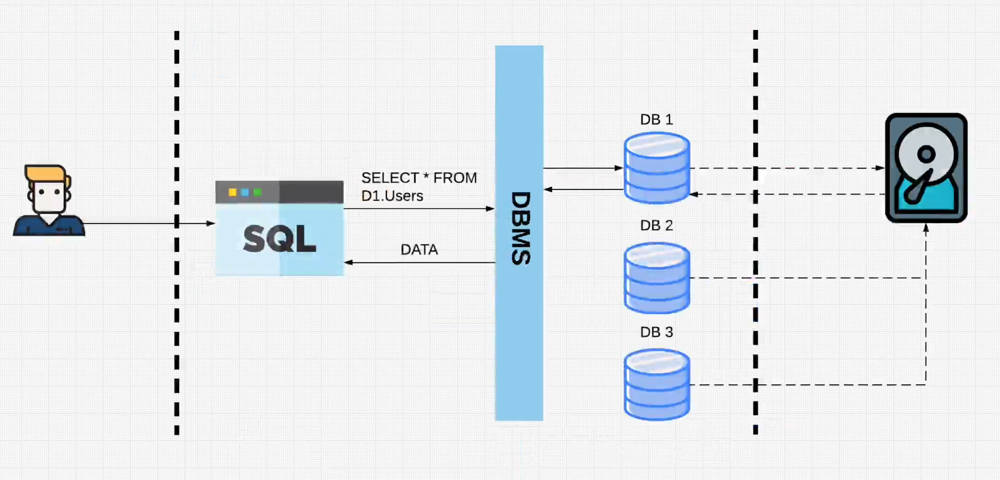

### What DBMS do

- The operation this software performs are called **queries** through CRUD operations.
  - **C**reate
  - **R**ead
  - **U**pdate
  - **D**elete
- It also manage your data with providing **security** and **integrity** to the data.
  - it put in place **constraints** to ensure the data is valid.
  - it put in place the right security policies and the right permissions to the users.
- It handles **Transactions Management**, which is a way to ensure that the data is consistent and that the data is not lost.
