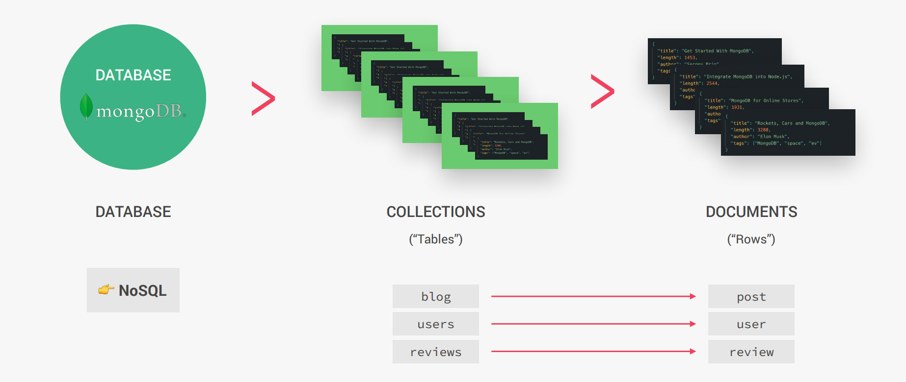
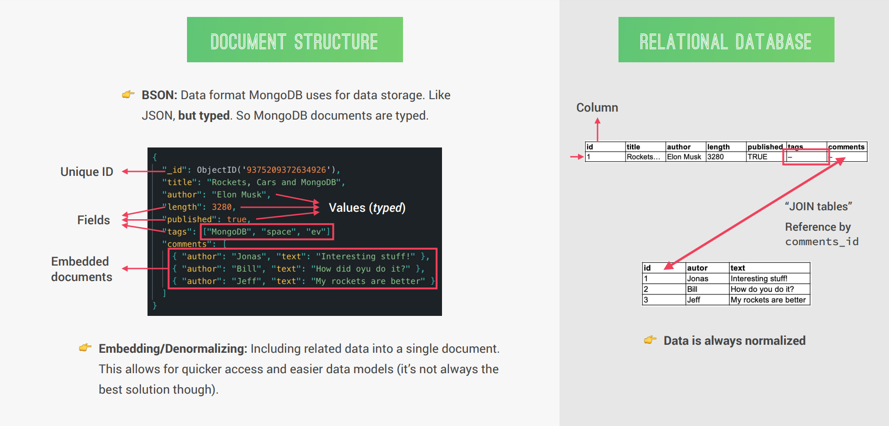
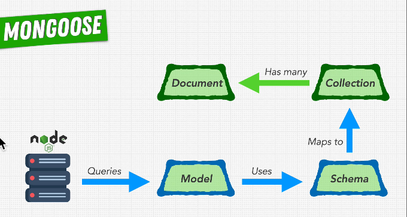

# INDEX

- [INDEX](#index)
  - [MongoDB](#mongodb)
    - [MongoDB Features](#mongodb-features)
    - [MongoDB Structure](#mongodb-structure)
  - [MongoDB local \& MongoDB Compass](#mongodb-local--mongodb-compass)
  - [MongoDB Atlas](#mongodb-atlas)
  - [Mongoose](#mongoose)
    - [Connecting to MongoDB using Mongoose](#connecting-to-mongodb-using-mongoose)
  - [Notes for interview](#notes-for-interview)

---

## MongoDB

It's a document database with the scalability and flexibility that you want with the querying and indexing that you need

- It's best used for `unstructured data` of where the structure will change often

---

### MongoDB Features

- **Document-based database:** stores data in documents (field-value pair data structure **NoSQL**)
- **Scalable:** It has built-in scalability, which makes it very easy to distribute data across multiple machines as your users and amount of data grows
- **Flexible:** No document data schema required, So each document can have **different number and type of fields**, and they can be changed at anytime
- **Performant:** It's very performant thanks to features like:
  - Embedded data models
  - indexing
  - sharding
  - flexible document
  - native duplication
- **Free and open-source database**

---

### MongoDB Structure



- Here, each database can contain one or more **collections**
  - > which is equivalent to **tables** in SQL
- Each collection can contain one or more data structures called **"documents"** which contains data for one single entity

  - > which is equivalent to **rows** in SQL

- MongoDB uses a data format similar to JSON for data-storage called: **"BSON"**, which looks the same as JSON, but typed

- Document Structure (BSON)

  

  - So MongoDB documents are typed
  - `BSON` documents have fields(keys) which are equivalent to columns in relational database
    - It has some features that are not in (columns in relational DB), like that one `field` can have multiple values
  - MongoDB can have **Embedded documents** which is not available in relational databases
    - It's documents inside of documents by including related data into a single document
    - This allows for quicker access and easier data models which allows us to read all the data at once (it's not always the best solution though)
      - the equivalent of this in relational-DB is **Normalizing and Joining tables**

---

## MongoDB local & MongoDB Compass

---

## MongoDB Atlas

- Each **cluster** is like an instance to the database

---

## Mongoose

### Connecting to MongoDB using Mongoose

[mongoose](https://www.npmjs.com/package/mongoose)



```js
await mongoose.connect(MONGO_URL);
```

---

## Notes for interview

- Interviewer : What is MongoDB?

- Me : it is a JSON database.

- Interviewer : Thanks(Rejected).

- Never do the same mistake I did!.

- Now, What exactly MongoDB is?
  It stores the data in BSON,
  So it's a BSON database.

- But, what exactly is BSON 🤔?
  Its simply Binary JSON.

- And, why exactly we use BSON instead of JSON?

  - In JSON, the text parsing is very slow

  - JSON file format is not space efficient.

  - JSON supports a limited number of basic data types.
