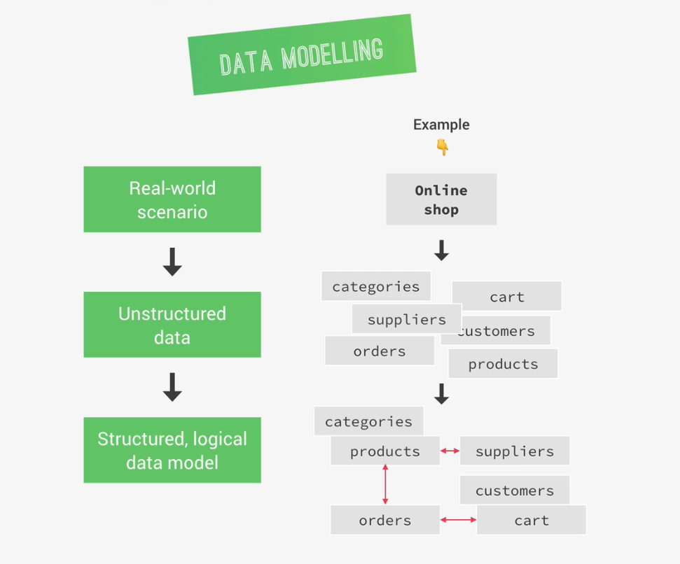
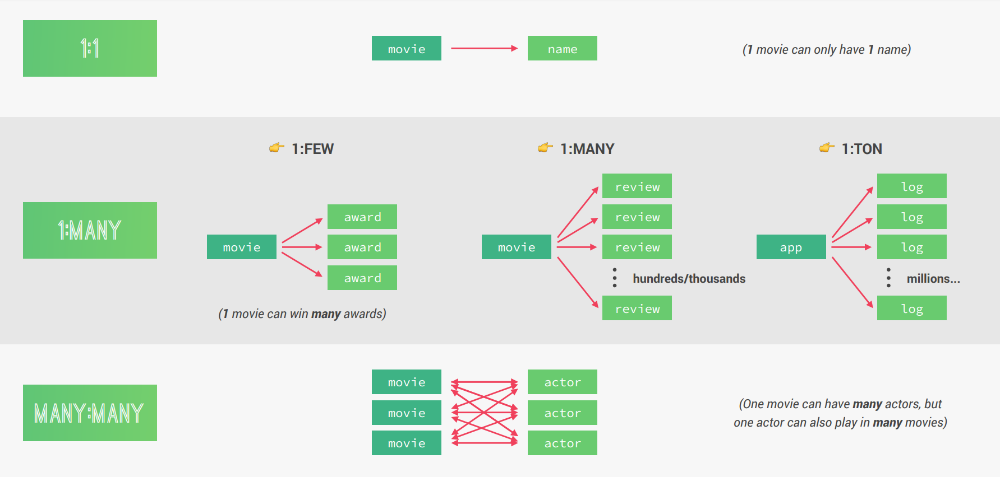
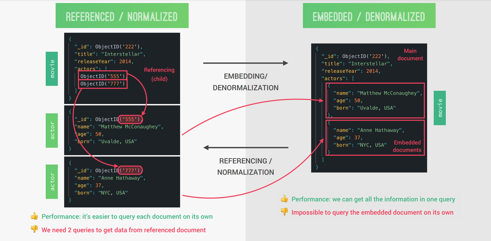
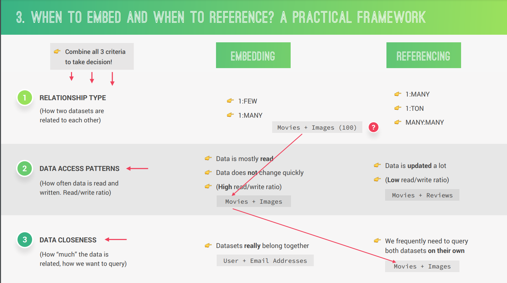
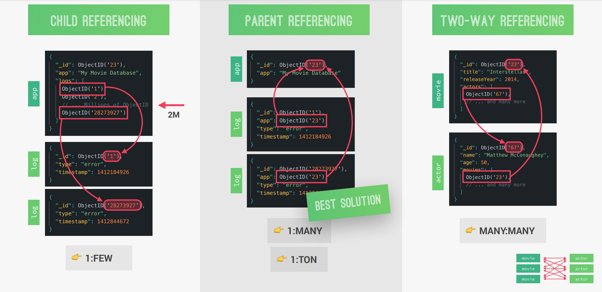

# INDEX

- [INDEX](#index)
  - [MongoDB](#mongodb)
    - [MongoDB Features](#mongodb-features)
    - [MongoDB Structure](#mongodb-structure)
  - [MongoDB Services](#mongodb-services)
    - [local DB](#local-db)
    - [Atlas](#atlas)
    - [MongoDB Atlas](#mongodb-atlas)
  - [MongoDB CRUD Operations](#mongodb-crud-operations)
  - [MongoDB Middlewares (Hooks)](#mongodb-middlewares-hooks)
  - [Aggregation Pipeline](#aggregation-pipeline)
  - [MongoDB Data Modelling](#mongodb-data-modelling)
    - [Types of data relationships](#types-of-data-relationships)
    - [Referencing vs Embedding](#referencing-vs-embedding)
      - [When to embed and when to reference?](#when-to-embed-and-when-to-reference)
      - [Types of Referencing](#types-of-referencing)
  - [Mongoose](#mongoose)
    - [Connecting to MongoDB using Mongoose](#connecting-to-mongodb-using-mongoose)
    - [Creating Collections and Documents with Mongoose](#creating-collections-and-documents-with-mongoose)
    - [Mongoose Modelling](#mongoose-modelling)
    - [Mongoose Query](#mongoose-query)
      - [Aliasing (Manually adding query params)](#aliasing-manually-adding-query-params)
  - [Notes for interview](#notes-for-interview)

---

## MongoDB

It's a document database with the scalability and flexibility that you want with the querying and indexing that you need

- It's best used for `unstructured data` or where the structure will change often, unlike `SQL` where the structure of data is known and well-defined

---

### MongoDB Features

- **Document-based database:** stores data in documents (field-value pair data structure **NoSQL**)
- **Scalable:** It has built-in scalability, which makes it very easy to distribute data across multiple machines as your users and amount of data grows
- **Flexible:** No document data schema required, So each document can have **different number and type of fields**, and they can be changed at anytime
- **Performant:** It's very performant thanks to features like:
  - Embedded data models
  - indexing
  - sharding
  - flexible document
  - native duplication
- **Free and open-source database**

---

### MongoDB Structure


- Here, each database can contain one or more **collections**
  - > which is equivalent to **tables** in SQL
- Each collection can contain one or more data structures called **"documents"** which contains data for one single entity

  - > which is equivalent to **rows** in SQL

- MongoDB uses a data format similar to JSON for data-storage called: **"BSON"**, which looks the same as JSON, but typed

  - this makes it easier to work with (NoSQL & javascript) together, without having an extra step in SQL like [object-relational impedance mismatch](https://www.quora.com/What-is-the-object-relational-impedance-mismatch)

- Document Structure (BSON)

  

  - So MongoDB documents are typed
  - `BSON` documents have fields(keys) which are equivalent to columns in relational database
    - It has some features that are not in (columns in relational DB), like that one `field` can have multiple values
  - MongoDB can have **Embedded documents** which is not available in relational databases
    - It's documents inside of documents by including related data into a single document
    - This allows for quicker access and easier data models which allows us to read all the data at once (it's not always the best solution though)
      - the equivalent of this in relational-DB is **Normalizing and Joining tables**

---

## MongoDB Services

### local DB

- **virtual properties:** are fields that we can define on our schema but will not be persisted (saved into the DB) in order to save space
  - They are useful for fields that can be derived from one another (ex: conversion miles to kilometers)
  - we cant use them in a query, as they aren't part of the DB

### Atlas

### MongoDB Atlas

- Each **cluster** is like an instance to the database

---

## MongoDB CRUD Operations

- delete:

  - It's a good practice not to send back to client a response message/data after delete request --> `null

    ```js
    res.status(204).json({
      status: 'success',
      data: null
    });
    ```

---

## MongoDB Middlewares (Hooks)

There's 4 types of middlewares in mongo: [`document`, `query`, `aggregate`, `model`]

- on each middleware-type, the `this` keyword point to the corresponding object
- we can do operations on data **before or after** it's saved in the DB
  - before -> `.pre`
    - this happens between receiving the data and persisting it to the database
  - after -> `.post`

---

## Aggregation Pipeline

- `$match` is for querying

---

## MongoDB Data Modelling

**Data modeling**: is the process of taking unstructured data generated by a real world scenario and then structure it into a logical data model in a database.

- The goal with data modeling is to then structure the data into a logical way. Reflecting the real-world relationships that exists between some of these data sets.
  
- Steps:

  1. identify different types of relationships between data.
  2. understand the difference between **referencing** or **normalization** and **embedding** or **denormalization**.
  3. deciding whether we should embed documents or reference to other documents based on a couple of different factors.
  4. choose the type of **referencing**

- **Data Modelling Notes:**
  - The most important principle is: Structure your data to match the ways that your application queries and updates data
    - In other words: Identify the questions that arise from your application’s use cases first, and then model your data so that the questions can get answered in the most efficient way
  - In general, always favor **embedding**, unless there is a good reason not to embed. Especially on `1:FEW` and `1:MANY` relationships
  - A `1:TON` or a `MANY:MANY` relationship is usually a good reason to reference instead of `embedding`
  - favor **referencing** when data is updated a lot and if you need to frequently access a dataset on its own
  - Use **embedding** when data is mostly read but rarely updated, and when two datasets belong intrinsically together
  - Don’t allow arrays to grow indefinitely. Therefore, if you need to normalize, use child referencing for 1:MANY relationships, and parent referencing for 1:TON relationships
  - Use **two-way referencing** for `MANY:MANY` relationships

---

### Types of data relationships



- **1:1** -> one field can only have one value
- **1:many** -> one document can relate to other documents
  - `1:few`
  - `1:many`
  - `1:ton`
- **many:many**

---

### Referencing vs Embedding

each time we have two related datasets we can either represent that related data in a reference or **normalized** form or in an embedded or **denormalized** form.



- in the referenced form we keep two related datasets and all the documents separated.

  - all the data is nicely separated, which is exactly what normalized means.
  - Here the `ID` is used to create references between documents
  - this is the go to way in SQL databases
  - this is the go to way in NOSQL databases like MongoDB
  - Here, there is an improvement in performance when we often need to query the related data **on it's own**, because we then can just query the data that we need
  - The downside here is that if we want to get all the data, then are gonna need many queries to the database.

- in the denormalized form we embed the related document right into the main document without the need for separate `documents`, `collections`, and `IDs`.
  - Here, we will have one main document containing all the main data as well as the related data.
  - The result of this is that our application will need to fewer queries to the database Because we can get all the data at the same time which will increase our performance.
  - The downside here is that we can't really query the embedded data on its own. And so if that's a requirement for the application you would have to choose a **normalized** design

---

#### When to embed and when to reference?



---

#### Types of Referencing



---

## Mongoose

It's an **Object-Data-Modeling (ODM)** library for MongoDB and Node.js, providing a higher level of abstraction.

- it's just a way for us to write javascript code that will interact with a database
- It's like a the relationship between Express and Node
  - Express -> is a layer of abstraction over regular Node
  - Mongoose -> is a layer of abstraction over the regular MongoDB driver

> We could just use a regular MongoDB-driver to access our database, and it would work, but instead we use `Mongoose` because it gives us a lot more functionality out of the box allowing for faster and simpler development

- **Features:**

  - Schemas to model data and relationships
  - Easy data validation
  - Simple query API
  - Middleware

- **Mongoose Schema:** is where we model our data, by describing the (structure of the data, default values and validation)
  - it's like **Classes** in JS
  - if added a document with fields that doesn't exist in the schema, the additional fields will be ignored
- **Mongoose Model:** is a wrapper for the schema providing an interface to the database for CRUD operation

---

### Connecting to MongoDB using Mongoose

[mongoose](https://www.npmjs.com/package/mongoose)


```js
await mongoose.connect(MONGO_URL);
```

---

### Creating Collections and Documents with Mongoose

1. First, we create a schema for a collection

   - for each field, we add the type or options-object

   ```js
   const tourSchema = new mongoose.Schema({
     name: {
       type: String,
       required: [true, 'A tour must have a name'],
       unique: true
     },
     rating: {
       type: Number,
       default: 4.5
     },
     price: {
       type: Number,
       required: [true, 'A tour must have a price']
     }
   });
   ```

2. We create a model with the schema for a document in the collection

   ```js
   const Tour = mongoose.model('Tour', tourSchema);

   // creating a document with the model (creating an instance)
   const testTour = new Tour({
     name: 'The Park Camper',
     price: 222,
     rating: 4.9
   });
   ```

3. save the document

   - if the collection wasn't in the DB, MongoDB will create one

   ```js
   testTour
     .save()
     .then(doc => {
       console.log(doc);
     })
     .catch(err => {
       console.log('ERROR xxx', err);
     }); // save document to DB

   // or
   Tour({
     name: 'The Park Camper',
     price: 222,
     rating: 4.9
   });
   ```

---

### Mongoose Modelling

- when using image field in the schema, we save it as a string, as it's recommended to save images in the DB as their names and then use the `fileSys` to get the actual images using that name
- we can also use custom validators for the fields in a model-collection using [validator library](https://www.npmjs.com/package/validator)

---

### Mongoose Query

We can filter by the native `.filter()` query method from MongoDB, or instead we can use the query methods from Mongoose

- when chaining queries, we should finish all querying, then `await` the result
  - first we build the query
  - then we execute the query
- when using filters like `gte`, we need to make it start with the `$` operator so that MongoDB can recognize it, we do this by adding `$` to the request-query items keys

  ```js
  let queryStr = JSON.stringify(queryObj);
  queryStr = queryStr.replace(/\b(gte|gt|lte|lt)\b/g, match => `$${match}`); // find on of these 4 words using regular expression and add "$" to it
  const query = Tour.find(JSON.parse(queryStr));
  ```

---

#### Aliasing (Manually adding query params)

Aliasing is when you have a route that do something, instead of writing the normal route with the req-params manually. This is done using a **middleware** before the route-controller

```js
// Middlewares
exports.aliasTopTours = (req, res, next) => {
  req.query.limit = '5';
  req.query.sort = '-ratingsAverage,price';
  req.query.fields = 'name,price,ratingsAverage,summary,difficulty';
  next();
};

// route
router.route('/top-5-cheap').get(tourController.aliasTopTours, tourController.getAllTours);
```

---

## Notes for interview

- Interviewer : What is MongoDB?

- Me : it is a JSON database.

- Interviewer : Thanks(Rejected).

- Never do the same mistake I did!.

- Now, What exactly MongoDB is?
  It stores the data in BSON,
  So it's a BSON database.

- But, what exactly is BSON 🤔?
  Its simply Binary JSON.

- And, why exactly we use BSON instead of JSON?

  - In JSON, the text parsing is very slow

  - JSON file format is not space efficient.

  - JSON supports a limited number of basic data types.
