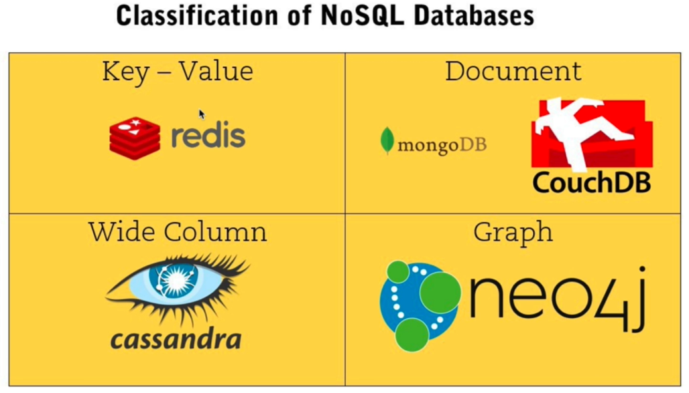

# INDEX

- [INDEX](#index)
  - [Redis](#redis)

---

## Redis

It's an open source, **in-memory** database, which makes it **really fast**

- usually used with cached data like sessions
  - **sessions**: have data for specified time then it expires
- when you have small data that you want to access
