# INDEX

- [INDEX](#index)
  - [SQL](#sql)
    - [Queries](#queries)
      - [SQL Commands](#sql-commands)
      - [CRUD](#crud)
    - [SQL Operations](#sql-operations)
    - [notes](#notes)
  - [Data Types](#data-types)
  - [Date](#date)
    - [date Operators](#date-operators)
  - [Filtering Queries](#filtering-queries)
    - [WHERE Clause](#where-clause)
    - [`NULL` values](#null-values)
      - [`Null` Coalescing](#null-coalescing)
      - [`NULLIF` function](#nullif-function)
    - [`BETWEEN`...`AND`](#betweenand)
    - [`IN` Keyword](#in-keyword)
    - [`ALL` - `ANY` - `SOME`](#all---any---some)
    - [`LIKE` Keyword](#like-keyword)
    - [`Distinct` Keyword](#distinct-keyword)
    - [`HAVING` Keyword](#having-keyword)
    - [`GREATEST` - `LEAST` functions](#greatest---least-functions)
    - [`CASE` Keyword (if-then-else)](#case-keyword-if-then-else)
  - [Grouping](#grouping)
    - [`GROUP BY`](#group-by)
    - [`UNION`](#union)
    - [`INTERSECT`](#intersect)
    - [`EXCEPT`](#except)
    - [`GROUPING SETS`](#grouping-sets)
  - [SQL Functions / Aggregations](#sql-functions--aggregations)
    - [Numbers Functions](#numbers-functions)
    - [String Functions](#string-functions)
    - [Window Function](#window-function)
      - [Frame Clause](#frame-clause)
  - [Sorting \& Limiting](#sorting--limiting)
    - [Sorting - `ORDER BY`](#sorting---order-by)
    - [Limiting - `LIMIT` \& `OFFSET`](#limiting---limit--offset)
  - [Tables](#tables)
    - [Multi Table Queries](#multi-table-queries)
      - [Handling keys](#handling-keys)
      - [Multi table `select`](#multi-table-select)
    - [Joining Tables (`JOIN`)](#joining-tables-join)
      - [`JOIN` statements types](#join-statements-types)
      - [`USING` Keyword](#using-keyword)
    - [Views](#views)
  - [Ensuring Data Consistency](#ensuring-data-consistency)
  - [Indexes](#indexes)
    - [Index Types](#index-types)
  - [Subqueries](#subqueries)
    - [SubQuery Types / Usecases](#subquery-types--usecases)
    - [SubQueries vs Joins](#subqueries-vs-joins)
  - [Validating Data](#validating-data)
    - [Row Level Validation](#row-level-validation)
    - [Where to apply the validation?](#where-to-apply-the-validation)
  - [Interviews Questions](#interviews-questions)

---

## SQL

SQL stands for Structured Query Language and it is the syntax that allows us to interact with a SQL type database.

It's a **declarative (communicative) language**, which means that we tell the database what we want to do, but not how to do it.

- SQL uses `tables` to store data. which is a collection of records (rows) and fields (columns).

---

### Queries

a "Query" is also called "SQL Statement" and it is a command that we send to the database to perform some action.


- **Order of Operations**

  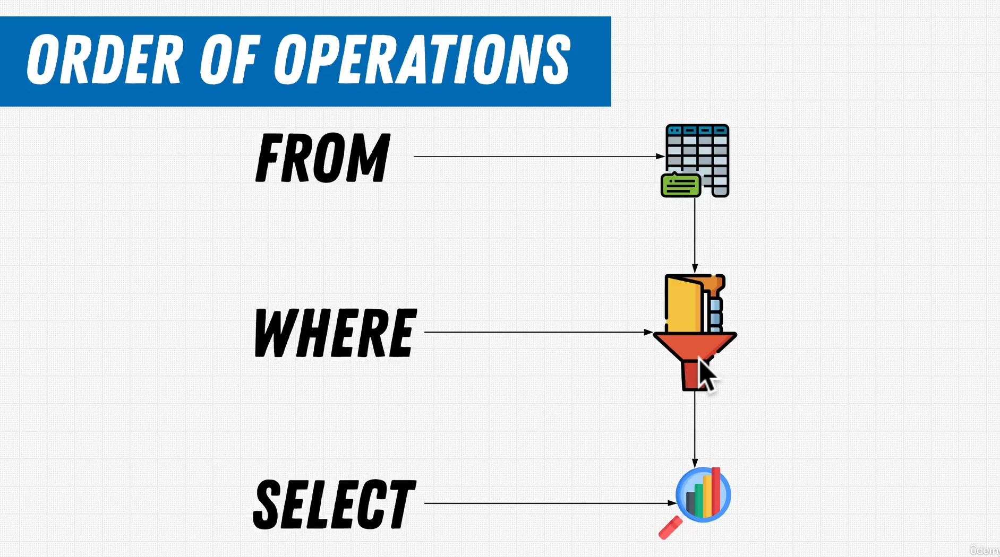

  1. `FROM` and `JOIN`
  2. `WHERE`
  3. `GROUP BY`
  4. `HAVING`
  5. `SELECT`
  6. `DISTINCT`
  7. `ORDER BY`
  8. `LIMIT`

#### SQL Commands


- **DDL:** Data Definition Language - used to define the database structure or schema. It includes the commands: `CREATE`, `ALTER`, `DROP`, `TRUNCATE`, `COMMENT`, `RENAME`.
- **DQL:** Data Query Language - used to query data from the database. It includes the commands: `SELECT`, `WHERE`, `GROUP BY`, `HAVING`, `UNION`, `INTERSECT`, `EXCEPT`.
- **DML:** Data Manipulation Language - used to manipulate the data in the database. It includes the commands: `INSERT`, `UPDATE`, `DELETE`.
- **DCL:** Data Control Language - used to define the database security. It includes the commands: `GRANT`, `REVOKE`.

A sql statement consists of 3 parts:

1. **Keyword:** is a reserved word that has a special meaning in SQL. It's not case sensitive.
   - They're `capitalized` to distinguish them from other words in the query.
2. **Identifier:** is a name given to a table or column. It's case sensitive.
   - They're `lowercase` to distinguish them from keywords.
3. **Clause:** is a part of the query that performs a specific task. It's not case sensitive.

---

#### CRUD

> table-name : "worlds"

- CREATE --> `INSERT INTO worlds (name) VALUES ('Asgard');`
- READ --> `SELECT * FROM worlds;`
- UPDATE --> `UPDATE worlds SET sighting_date = '2021-01-10' WHERE id='1';`
- DELETE --> `DELETE FROM worlds WHERE id='1';` -> delete `row` where `id=1`

---

### SQL Operations

- Create table

  ```sql
  CREATE TABLE <table_name> (
    <column_name> <data_type> <constraint>,
    <column_name> <data_type> <constraint>,
    <column_name> <data_type> <constraint>
  );
  ```

- Insert data

  ```sql
  -- Order is important
  INSERT INTO <table_name> (<column_name>, <column_name>, <column_name>)
  VALUES (<value>, <value>, <value>);
  ```

- Update data

  ```sql
  UPDATE <table_name>
  SET <column_name> = <value>
  WHERE <condition>;
  ```

- Delete data

  - Deleting records

    ```sql
    DELETE FROM <table_name>
    WHERE <condition>;
    ```

  - Deleting columns

    ```sql
    ALTER TABLE <table_name>
    DROP COLUMN <column_name>;
    ```

  - Deleting tables

    ```sql
    DROP TABLE <table_name>;
    ```

---

### notes

- Double quotes `""` instead of single quotes `''`

  - `double quotes` are always used to denote delimited identifiers ( `table name` - `column name` ).
  - `single quotes` used to indicate that a token is a string -> for text.

- Missing a `semicolon`
  - The semicolon at the end of a query is one of the most common mistakes to make. Thankfully its easy to fix by just adding a semi colon on the next line - but that fix only works if you notice it soon enough.
  - This is why its a good idea to keep an eye on the beginning of the terminal line, to make sure it ends with this `=#` and not something like this `-#`
- `AND` and `OR` order
  - `AND` has a higher precedence than `OR`
  - `AND` is evaluated first and then `OR`
  - or use parenthesis `()` to change the order
- `PRIMARY KEY` : it's used for indexing (to reach row fast instead of going through all rows before)
  

---

## Data Types

When creating a table, each `column` must be declared with a data type. The data type tells the database what type of data the `column` can hold.

- **Numeric Data Types**
  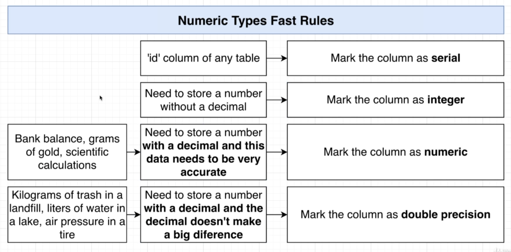

  - `INTEGER` : whole numbers
  - `DECIMAL` : decimal numbers
  - `SMALLINT` : small whole numbers
  - `BIGINT` : large whole numbers
  - `NUMERIC` : decimal numbers
  - `REAL` : decimal numbers
  - `DOUBLE PRECISION` : decimal numbers

- **Character Data Types**
  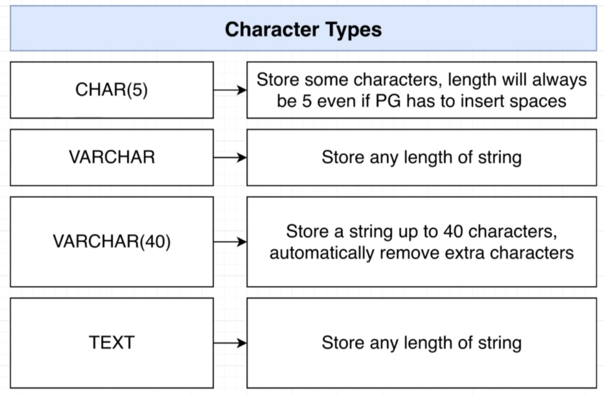

  - `CHARACTER(n)` : fixed-length character string
  - `VARCHAR(n)` : variable-length character string
  - `TEXT` : variable-length character string
  - `CHAR(n)` and `VARCHAR(n)` are the same, except that `CHAR` pads spaces at the end of the string to fill the specified length, while `VARCHAR` does not.

- **Boolean Data Type**
  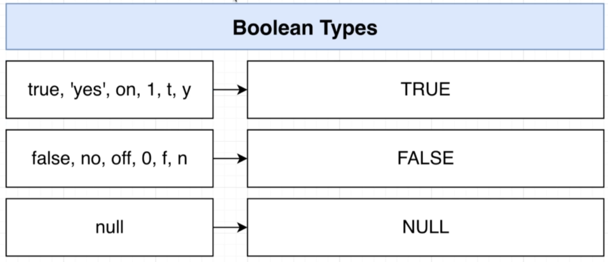

  - `BOOLEAN` : true or false

- **Date and Time Data Types**
  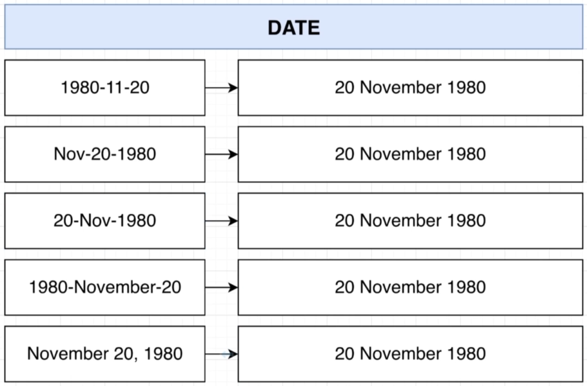
  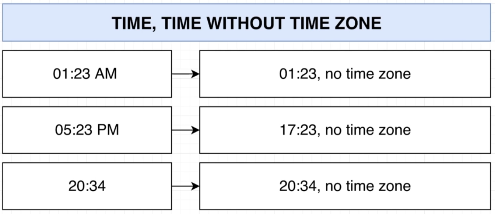
  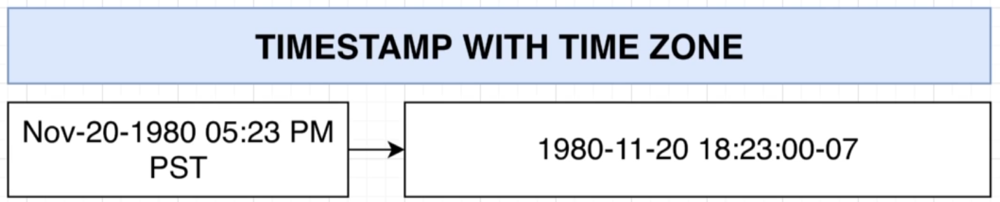
  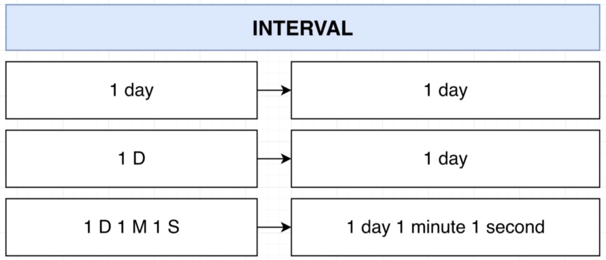

  - `DATE` : date
  - `TIME` : time of day
  - `TIMESTAMP` : date and time
  - `INTERVAL` : a period of time

- **UUID Data Type**
  - `UUID` : universally unique identifier

```sql
CREATE TABLE <table_name> (
  <column_name> <data_type> <constraint>,
  <column_name> <data_type> <constraint>,
  <column_name> <data_type> <constraint>
);

-- example
CREATE TABLE worlds (
  id SERIAL PRIMARY KEY,
  name VARCHAR(255) NOT NULL,
  sighting_date DATE,
  confirmed BOOLEAN DEFAULT false
);
```

- **Notes**:

  - `::` -> cast operator, is used to convert one data type to another.

    ```sql
     SELECT 99999999999999999::SMALLINT; -- 32767
    ```

    - Usually, it's used when you want to do operations on columns with different data types.

      ```sql
      SELECT 1 + 1::DECIMAL; -- 2.0

      SELECT 'abc' + 2; -- ERROR ❌
      SELECT 'abc' + 2::TEXT; -- abc2 ✅
      ```

  - We use `VARCHAR()` with character-limit, not for performance reasons, but to prevent users from entering too much data.
  - We don't usually store time/date as `INTERVAL` data type. We use `INTERVAL` when we want to do operations on time/date.

    ```sql
    SELECT NOW() + INTERVAL '1 day';

    SELECT NOW() - ('4 D'::INTERVAL + '3 H'::INTERVAL)
    ```

---

## Date

- Time zones are not stored in the database. They are only used when displaying the date and time. So the date and time stored in the database is always in **UTC**.

  ```sql
  SHOW TIMEZONE; -- UTC

  SET TIMEZONE = 'Asia/Tehran'; -- change timezone for current session

  -- To change the timezone for all sessions, you need to change the timezone in the postgresql.conf file.
  ALTER SYSTEM SET TIMEZONE TO 'Asia/Tehran';
  ```

- `DATE` : is a data type that stores a date (year, month, day) without a time zone.

  ```sql
  SELECT * FROM worlds WHERE sighting_date = '2021-01-10';
  ```

- Date format

  - `YYYY-MM-DD` : is the most common format for dates in SQL
  - `YYYY-MM-DD HH:MM:SS` : is the most common format for dates and times in SQL
  - `YYYY-MM-DD HH:MM:SS +-HH:MM` : is the most common format for dates and times with time zones in SQL

- When creating a date column, You can specify whether you will use time zones or not using **TIMESTAMP**.

  ```sql
  CREATE TABLE timezones (
    TS TIMESTAMP WITHOUT TIME ZONE
    tZ TIMESTAMP WITH TIME ZONE,
  );
  ```

---

### date Operators

- Get current date

  ```sql
  SELECT CURRENT_DATE; -- 2021-01-10
  -- or
  SELECT NOW()::DATE; -- 2021-01-10
  ```

- Format date

  ```sql
  SELECT TO_CHAR(NOW(), 'YYYY-MM-DD HH:MM:SS'); -- 2021-01-10 15:00:00
  ```

- Cast date

  ```sql
  SELECT CAST('2021/01/10' AS DATE); -- 2021-01-10
  -- or
  SELECT date '2021/01/10'; -- 2021-01-10
  ```

- Extract date

  ```sql
  SELECT EXTRACT(YEAR FROM NOW()); -- 2021
  ```

- Interval

  ```sql
  SELECT date '2021/01/10' + INTERVAL '1 day'; -- 2021-01-11 15:00:00
  ```

---

## Filtering Queries

Common filter words are `WHERE`, `BETWEEN`, `LIKE`, `IF NULL`, `IF NOT NULL`


- `LIKE 'Dan%'`
  - `%` : is a wildcard that means anything
  - here it means 'Dan' and anything that comes after the `n` ---> AKA: any word starts with "Dan"
- `NOT` : is used to exclude the results that match the condition

  ```sql
  SELECT * FROM worlds WHERE NOT name = 'Dan';
  ```

---

### WHERE Clause

`WHERE` : is used to filter records to individual rows using comparison operators.

```sql
SELECT * FROM worlds WHERE name = 'Dan';
```

- Comparison operators

  - `=` : equal
  - `<>` : not equal
  - `!=` : not equal
  - `>` : greater than
  - `>=` : greater than or equal
  - `<` : less than
  - `<=` : less than or equal
  - `BETWEEN` : between an inclusive range
  - `IN` : is used to specify multiple values in a `WHERE` clause.

- Data used in comparison operators
  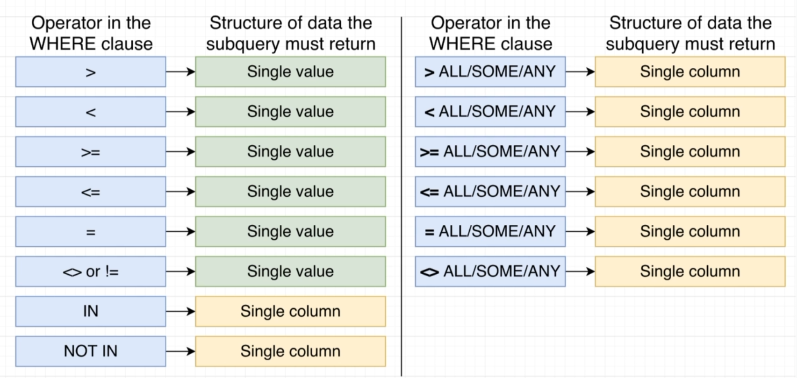

---

### `NULL` values

You should always be aware of the possibility of NULL values in your database. So it's a good idea to be defensive and to check for them in your queries.

- `IS NULL` : is used to test for NULL values (empty fields)
- with comparison/math operators -> **All roads lead to Null**
  - `null = null` -> false
  - `null <> null` -> false
- `IS NOT NULL` : is used to test for NOT NULL values

  ```sql
  SELECT * FROM worlds WHERE name = NULL; -- WRONG
  SELECT * FROM worlds WHERE name != NULL; -- WRONG

  SELECT * FROM worlds WHERE name IS NULL; -- CORRECT
  SELECT * FROM worlds WHERE name IS NOT NULL; -- CORRECT
  ```

#### `Null` Coalescing

- `COALESCE` : is a function used to return the first `non-NULL` value in a list

  ```sql
  SELECT COALESCE(NULL, 'Dan', 'John'); -- Dan
  ```

- It's used when you have columns that may contain `NULL` values and you want to replace them with a default value.

  ```sql
  SELECT COALESCE(name, 'Unknown') FROM worlds;
  ```

- It's also used for checking when inserting data into a table.

  ```sql
  INSERT INTO worlds (name, sighting_date)
  VALUES (COALESCE('Dan', 'Unknown'), '2021-01-10');
  ```

---

#### `NULLIF` function

- `NULLIF` : is a function used to return `NULL` if the two arguments are equal. Otherwise it returns the first argument.

  ```sql
  SELECT NULLIF('Dan', 'Dan'); -- NULL
  SELECT NULLIF('Dan', 'John'); -- Dan
  ```

---

### `BETWEEN`...`AND`

- `BETWEEN` : is used to filter the result set within a certain range. The values can be numbers, text, or dates.

  ```sql
  SELECT * FROM worlds WHERE id BETWEEN 1 AND 3;
  ```

- It's sensitive to the order of arguments. The first argument must be less than or equal to the second argument.

  ```sql
  SELECT * FROM worlds WHERE id BETWEEN 3 AND 1; -- WRONG
  ```

---

### `IN` Keyword

- `IN` : is used to specify multiple values in a `WHERE` clause.
- It needs a (list of values / column of data) to check against.

  ```sql
  SELECT * FROM worlds WHERE name IN ('Dan', 'John');
  -- It's instead of writing OR
  SELECT * FROM worlds WHERE name = 'Dan' OR name = 'John';
  ```

---

### `ALL` - `ANY` - `SOME`

- `ALL` : is used to compare a value to all values in another list of values or column of data.

  ```sql
  SELECT * FROM worlds WHERE id > ALL (1, 2, 3);
  ```

- `ANY` : is used to compare a value to any applicable value in the list of values or column of data.

  ```sql
  SELECT * FROM worlds WHERE id > ANY (1, 2, 3);
  ```

- `SOME` : is a synonym for `ANY`.

  ```sql
  SELECT * FROM worlds WHERE id > SOME (1, 2, 3);
  ```

They're usually used with `subqueries`.

```sql
SELECT * FROM worlds WHERE id > ALL (SELECT id FROM worlds WHERE name = 'Dan');
```

---

### `LIKE` Keyword

- `LIKE` : is used in a `WHERE` clause to search for a **specified pattern** in a column.

  - `%` : is a wildcard that represents zero, one, or multiple characters
  - `_` : is a wildcard that represents a single character
  - It's case sensitive by default. To perform case-insensitive comparisons, use `ILIKE` instead.

```sql
SELECT * FROM worlds WHERE name LIKE 'Dan%'; -- Dan and anything that comes after the n

SELECT * FROM numbers WHERE percentage LIKE '_00%'; -- 100, 200, 300, 400, 500, 600, 700, 800, 900 and 1000

SELECT * FROM numbers WHERE percentage LIKE '2_%_%'; -- values that start with 2 and are at least 3 characters in length
```

- **Note:** Postgres uses `LIKE` only with text comparison. It doesn't work with numbers. So we must cast the column to text.

  ```sql
  SELECT * FROM numbers WHERE CAST(percentage AS TEXT) LIKE '2_%_%';
  -- or
  SELECT * FROM numbers WHERE percentage::TEXT LIKE '2_%_%';
  ```

---

### `Distinct` Keyword

- `DISTINCT` : is used to return only distinct (different) values **(Remove Duplicates)**.

  ```sql
  SELECT DISTINCT name FROM worlds;
  ```

- Limitation: if it's used with multiple columns, it will return distinct combinations of the columns. so we won't be able to use aggregate functions on them.

  ```sql
  SELECT DISTINCT name, id FROM worlds;

  -- Here, we'll get an error because we can't use aggregate functions on multiple columns.
  SELECT COUNT(DISTINCT name, id) FROM worlds;
  ```

---

### `HAVING` Keyword

- `HAVING` : is used with aggregate functions to filter the result-set based on the aggregate values.

  ```sql
  SELECT name, COUNT(*) FROM worlds
  GROUP BY name
  HAVING COUNT(*) > 1;
  ```

- `WHERE` : is used to filter records to individual rows.
- `HAVING` : is used to filter records to groups of rows as a whole.

---

### `GREATEST` - `LEAST` functions

- `GREATEST` : is used to return the greatest value in a list of arguments.

  ```sql
  SELECT GREATEST(1, 2, 3); -- 3

  SELECT GREATEST(30, 2 * <table_column>) FROM <table_name>;
  ```

- `LEAST` : is used to return the smallest value in a list of arguments.

---

### `CASE` Keyword (if-then-else)

- `CASE` : is used to create different outputs (usually in the `SELECT` statement). It is SQL's way of handling **`if-then-else`** logic.

  - It creates a new column. So we should give it an alias.

  - `ELSE` : is used to return a value if none of the conditions are true.
    - if we don't use `ELSE`, it will return `NULL` if none of the conditions are true.
  - `END` : is used to end the `CASE` statement.

  ```sql
  SELECT name,
    CASE
      WHEN name = 'Dan' THEN 'Hello Dan'
      WHEN name = 'John' THEN 'Hello John'
      ELSE 'I don''t know you'
    END AS greeting
  FROM worlds;
  ```

  ```sql
  SELECT name,
  price,
  CASE
    WHEN price > 100 THEN 'Expensive'
    WHEN price > 50 THEN 'Moderate'
    ELSE 'Cheap'
  END AS price_category
  FROM products;
  ```

> Usually, It's not used in real-world applications. Instead this logic is handled in the application code before/after the query is sent to the database.

---

## Grouping

### `GROUP BY`

It's used to summarize data into groups. This is done by splitting data into groups and then applying `Aggregate` functions to each group rather than applying them to each row or the entire table.

- It reduces the number of rows in the result-set.
- It's done using `GROUP BY` clause + `Aggregate` functions.
- `GROUP BY` : is used in conjunction with the aggregate functions to group the result-set by one or more columns.
- How it works:

  1. The `GROUP BY` clause finds the unique values in the specified `column`.
     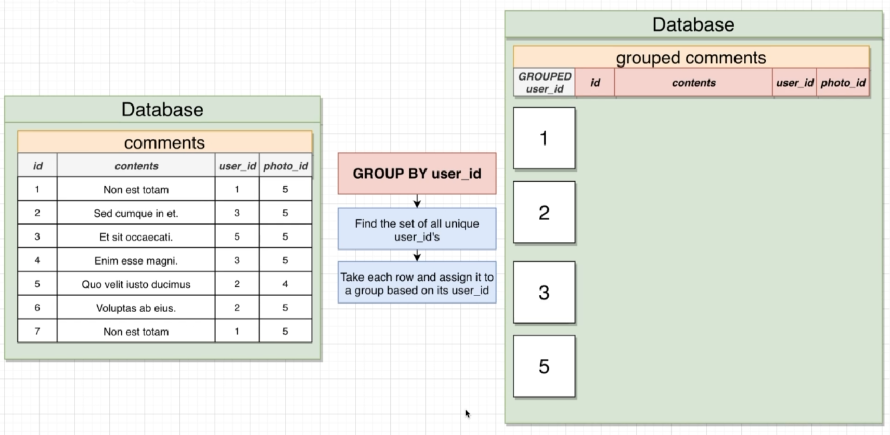
  2. Then, it creates a group for each unique value, by taking each row and assigning it to a group with the matching unique value.
     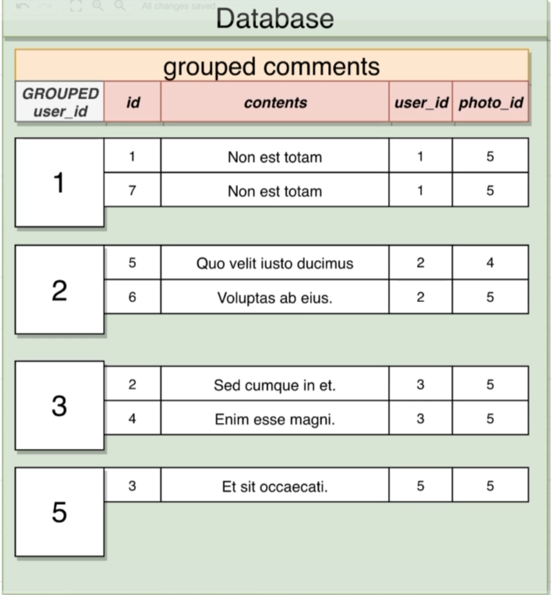
  3. Finally, it applies the `aggregate` function to each group.
     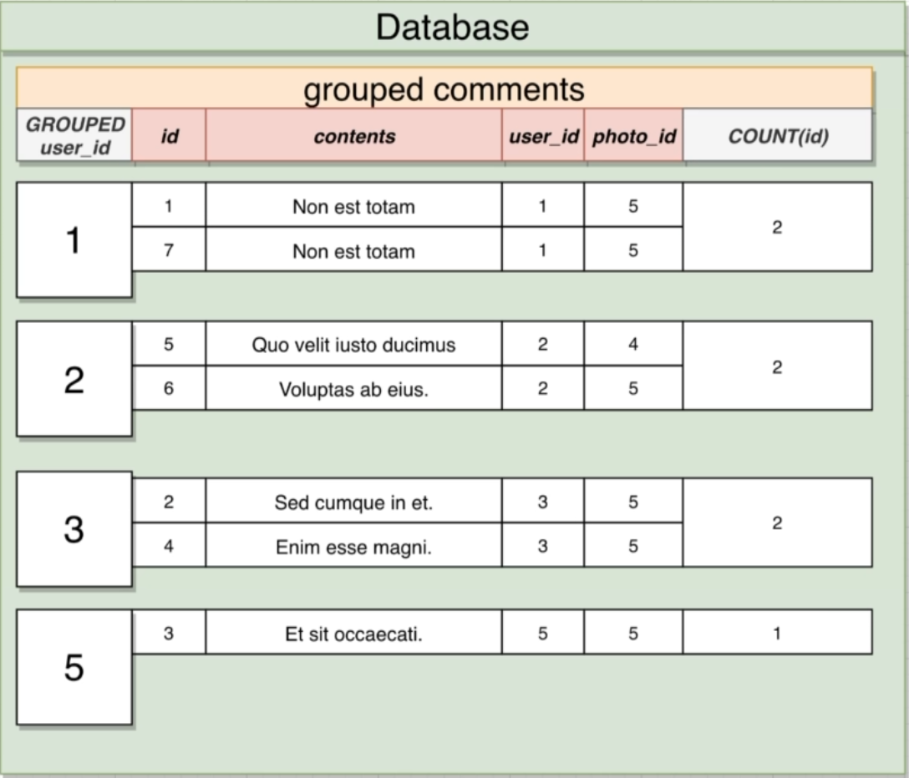

  - All these steps are done automatically by the database -> **Split-Apply-Combine**
    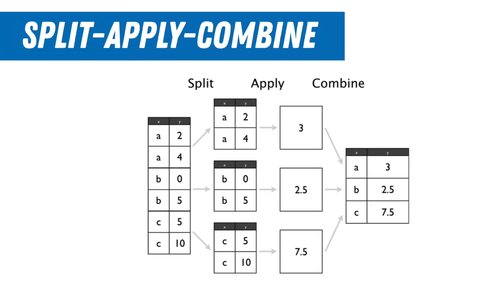
    - `Split:` The data is split into groups based on the column specified in the `GROUP BY` clause.
    - `Apply:` An aggregate function is applied to each group.
    - `Combine:` The results from each group are combined into a single result set.

- Ex:

  ```sql
  SELECT genre, AVG(price) AS avg_price
  FROM books
  GROUP BY genre;
  ```

  

- To filter by the `aggregate` values, we use ["`HAVING`" Keyword](#having-keyword) instead of `WHERE`.

- **Notes:**

  - We need to select the columns that we want to group by. If we don't select them, we'll get an error.

    ```sql
    SELECT COUNT(*) FROM worlds GROUP BY name; -- WRONG
    ```

  - Also we can't use `GROUP BY` without aggregate functions.

    ```sql
    SELECT name FROM worlds GROUP BY name; -- WRONG
    ```

    - That is because `GROUP BY` is used to reduce all records found for the matching group to a **single record**. So we need to use aggregate functions to summarize the data.

---

### `UNION`

- `UNION` : is used to combine the result-set of two or more `SELECT` statements (queries).

  ```sql
  SELECT name FROM worlds WHERE name LIKE 'Dan%'
  UNION
  SELECT name FROM worlds WHERE name LIKE 'John%';
  ```

  - Usually used to combine data from two or more tables that have the same structure.
  - It removes duplicate rows from the result-set

  - if the columns don't match, we'll get an error.

    ```sql
    SELECT name FROM worlds WHERE name LIKE 'Dan%'
    UNION
    SELECT id FROM worlds WHERE name LIKE 'John%'; -- ERROR (column names don't match)
    ```

- `UNION ALL` : doesn't remove duplicate rows from the result-set.

---

### `INTERSECT`

is Used to find the rows common in the results of two or more `SELECT` statements (queries).

- It returns rows that are common to both result-sets and removes duplicate rows.

  ```sql
  SELECT name FROM worlds WHERE name LIKE 'Dan%'
  INTERSECT
  SELECT name FROM worlds WHERE name LIKE 'John%';
  ```

- `INTERSECT ALL` : doesn't remove duplicate rows from the result-set.

---

### `EXCEPT`

Used to find the rows that are present in the first query but not in the second query. (it removes duplicate rows)

```sql
SELECT name FROM worlds WHERE name LIKE 'Dan%'
EXCEPT
SELECT name FROM worlds WHERE name LIKE 'John%';
```

- `EXCEPT ALL` : doesn't remove duplicate rows from the result-set.

---

### `GROUPING SETS`

`GROUPING SETS` : is used to group the result-set by one or more columns.

- It replaces the `UNION` keyword for multiple grouping.

  ```sql
  SELECT name, COUNT(*) FROM worlds
  GROUP BY GROUPING SETS (name, (name, id));

  -- this is instead of:

  SELECT name, COUNT(*) FROM worlds
  GROUP BY name
  UNION
  SELECT name, COUNT(*) FROM worlds
  GROUP BY name, id;
  ```

---

## SQL Functions / Aggregations

SQL functions are built-in functions that are available to use in SQL statements. They are used to perform specific tasks like formatting the output, performing calculations, and more.

It's a set of steps that creates a **single value**.

- Types of SQL Functions:

  - **Scalar Functions:** returns a single value for each row of data.
  - **Aggregate Functions:** returns a single value for a set of rows of data.
    - It produces a summary of the column-data in a table (reduces many values down to one value).

### Numbers Functions

- `COUNT` : counts the number of rows in a table
- `SUM` : adds up all the values in a column
- `AVG` : calculates the average of all the values in a column
- `MIN` : finds the smallest value in a column
- `MAX` : finds the largest value in a column

```sql
SELECT COUNT(*) FROM <table_name>;
SELECT SUM(<column_name>) FROM <table_name>;
SELECT AVG(<column_name>) FROM <table_name>;
SELECT MIN(<column_name>) FROM <table_name>;
SELECT MAX(<column_name>) FROM <table_name>;
```

---

### String Functions

- `CONCAT` : combines 2 strings from 2 columns
- `||` : is used to concatenate 2 strings (same as `CONCAT`)
- `UPPER` : converts a string to uppercase
- `LOWER` : converts a string to lowercase
- `LENGTH` : returns the number of characters in a string
- `SUBSTRING` : extracts a portion of a string

```sql
SELECT CONCAT(<column_name>, <column_name>) FROM <table_name>;
SELECT CONCAT(<column_name>, <column_name>) as "CustoConcatenation Column" FROM <table_name>;

SELECT <column_name> || <column_name> FROM <table_name>;
SELECT <column_name> || ' ' || <column_name> FROM <table_name>;

SELECT UPPER(<column_name>) FROM <table_name>;
SELECT LOWER(<column_name>) FROM <table_name>;
SELECT LENGTH(<column_name>) FROM <table_name>;
SELECT SUBSTRING(<column_name>, <start_index>, <length>) FRO<table_name>;
```

---

### Window Function

It creates a new column based on functions performed on a subset **(window)** of the rows in a table.

- `OVER`: is used to define the window.

- `PARTITION BY` : is used to partition the data into groups based on the specified column.

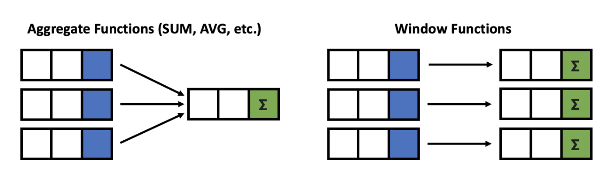

```sql
SELECT name, COUNT(*) OVER (PARTITION BY name) FROM worlds;
-- Here, we're:
-- partitioning the data into groups based on the `name` column.
-- Then, we apply the `COUNT` function to each group.
-- The result is a new column that contains the count of each group.
```

#### Frame Clause

- `ROWS` : is used to specify the number of rows before and after the current row to be included in the window.

  ```sql
  SELECT name, COUNT(*) OVER (PARTITION BY name ROWS BETWEEN 1 PRECEDING AND 1 FOLLOWING) FROM worlds;
  -- Here, we're:
  -- partitioning the data into groups based on the `name` column.
  -- Then, we apply the `COUNT` function to each group.
  -- The result is a new column that contains the count of each group.
  -- The `ROWS` clause specifies the number of rows before and after the current row to be included in the window. (1 row before and 1 row after)
  ```

- `Order By` : is used to sort the rows in the window.

  ```sql
  SELECT name, COUNT(*) OVER (PARTITION BY name ORDER BY id ROWS BETWEEN 1 PRECEDING AND 1 FOLLOWING) FROM worlds;
  ```

---

## Sorting & Limiting

### Sorting - `ORDER BY`

- `ORDER BY` : is used to sort the result-set in `ascending` or `descending` order.

  ```sql
  SELECT * FROM worlds ORDER BY name; -- ASC
  SELECT * FROM worlds ORDER BY name ASC; -- ASC
  SELECT * FROM worlds ORDER BY name DESC; -- DESC
  ```

- `ORDER BY` : can be used with multiple columns. The first column is used to sort the records first, then the second column, and so on.

  ```sql
  SELECT * FROM worlds ORDER BY name, id; -- order by name ASC and id ASC

  SELECT * FROM worlds ORDER BY name, id DESC; -- order by name ASC and id DESC
  ```

### Limiting - `LIMIT` & `OFFSET`

- `LIMIT` : is used to specify the number of records to return.

  ```sql
  SELECT * FROM worlds LIMIT 3; -- return the first 3 rows
  ```

- `OFFSET` : is used to specify the number of records to skip.

  ```sql
  SELECT * FROM worlds LIMIT 3 OFFSET 2; -- return 3 rows after skipping the first 2 rows
  ```

---

## Tables

Read [Relationships between tables](./Database.md#relationships-between-tables) section

### Multi Table Queries

#### Handling keys

- Creating table with `PRIMARY KEY`

  ```sql
  CREATE TABLE <table_name> (
    <column_name> <data_type> PRIMARY KEY,
    <column_name> <data_type>,
  );
  -- OR make SQL generate the key for us (POSTGRES)
  CREATE TABLE <table_name> (
    id SERIAL PRIMARY KEY, -- SERIAL is an auto-incrementing integer column
    <column_name> <data_type>,
  );
  ```

- Table with `Foreign Key`

  ```sql
  CREATE TABLE <table_name> (
    <column_name> <data_type> PRIMARY KEY,
    <column_name> <data_type> REFERENCES <table_name>(<column_name>),
  );
  ```

#### Multi table `select`

It is combining data from multiple tables in order to create a visual representation of the data relationships across the tables.

- It's done using **aliases**.

  - `AS` is used to give a table an alias.

    ```sql
    SELECT <column_name>, <column_name>
    FROM <table_name> AS <alias_name>
    ```

- Here, we use the `WHERE` clause to filter the 2 tables using primary and foreign keys

  ```sql
  SELECT a.emp_id, a.emp_name, b.emp_salary
  FROM employees as a, salaries as b
  WHERE a.emp_id = b.emp_id;
  ```

---

### Joining Tables (`JOIN`)

`JOIN` : is used to combine rows from two or more tables, based on a related column between them (`primary` key and `foreign` key)

- Joining 2 tables

  ```sql
  SELECT * FROM songs
  JOIN albums ON songs.album_id = albums.id;
  ```

#### `JOIN` statements types


- `INNER JOIN` : returns records that have matching values in both tables
  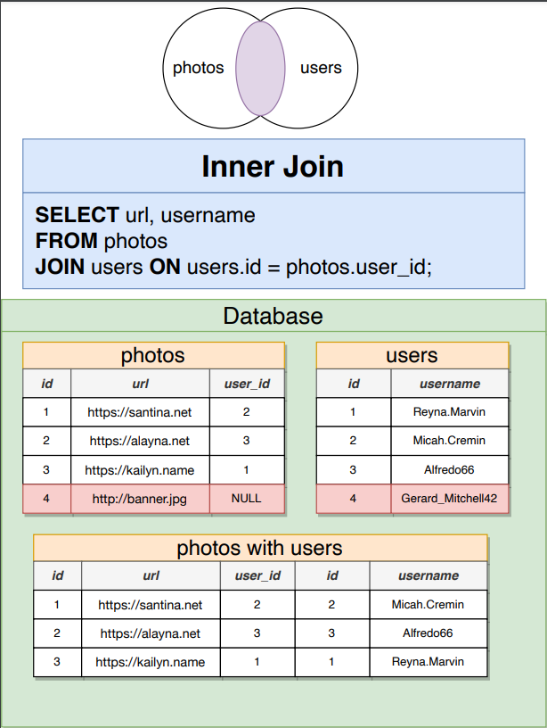

  - It's generally considered a best practice, It's more readable than using `WHERE` clause. It shows what's being joined.

    ```sql
    SELECT <column_name>, <column_name>
    FROM <table_name> AS <alias_name>
    INNER JOIN <table_name> AS <alias_name>
    ON <table_name>.<column_name> = <table_name>.<column_name>

    -- EX:
    SELECT a.emp_id, a.emp_name, b.emp_salary
    FROM employees as a
    INNER JOIN salaries as b
    ON a.emp_id = b.emp_id;
    ```

- `OUTER JOIN` : returns all records from one table, and the matched records from the other table

  - `LEFT OUTER JOIN` : returns all records from the left table, and the matched records from the right table
    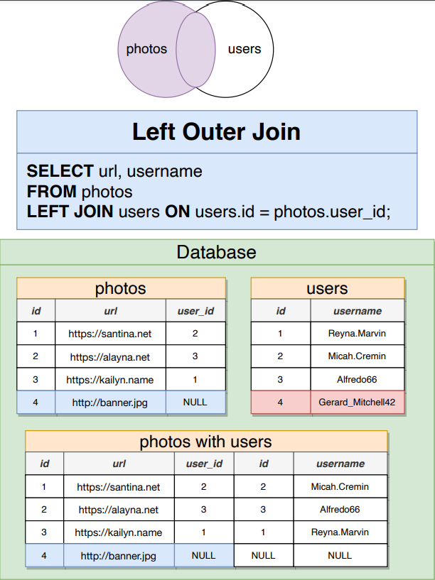
    - The unmatched records in the `right` table will be filled with `NULL` values.
  - `RIGHT OUTER JOIN` : returns all records from the right table, and the matched records from the left table
    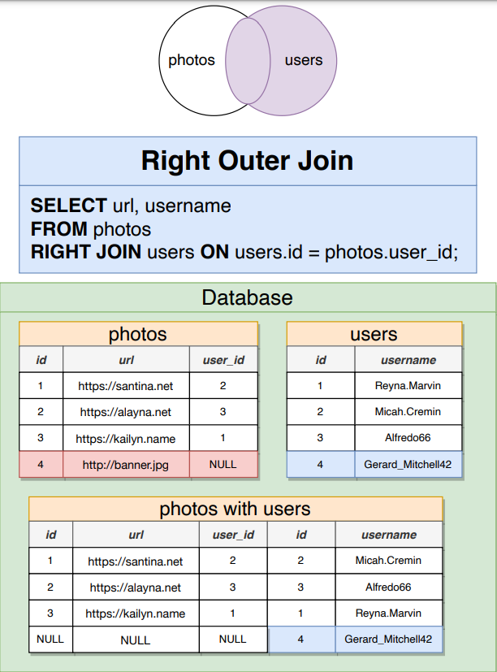
    - The unmatched records in the `left` table will be filled with `NULL` values.

- `FULL JOIN` : returns all records from both tables whether there is a match or not.
  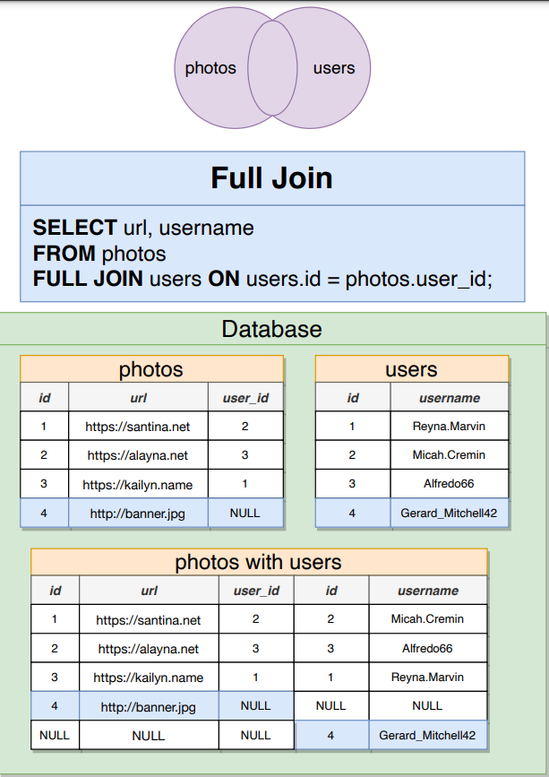

  - The unmatched records in both tables will be filled with `NULL` values.

- `CROSS JOIN` : create a combination of every row from the first table with every row from the second table

  - returns the **cartesian product** of the sets of records from the joined tables
  - It results in a very large number of records

- `SELF JOIN` : is a regular join, but the table is joined with itself, creating a temporary copy of the table to work with in the query

  - This can be done when a table has a foreign key that references its primary key -> (references itself)
  - not supported in Postgres

    ```sql
    SELECT a.emp_id, a.emp_name, b.emp_salary
    FROM employees as a
    INNER JOIN employees as b -- same table but different alias
    ON a.emp_id = b.emp_id;
    ```

- **Notes**
  - when we do a `join`, the results always come back **unsorted**
  - Table order between `FROM` and `JOIN` matters. The table that comes first in the `FROM` clause is the one that will be on the `left` side of the `JOIN`.
    - This is important when using `OUTER JOIN` because the table that comes first in the `FROM` clause is the one that will have all of its records returned, even if there is no match in the other table.
    - Also it may be important when table in the `FROM` clause contains `NULL` values in the column that we're joining on, which will cause the `JOIN` to fail or give unexpected results.

---

#### `USING` Keyword

- `USING` : is used to join tables on columns that have the same name.
- It's a shorthand for `ON <table_name>.<column_name> = <table_name>.<column_name>`

  ```sql
  SELECT <column_name>, <column_name>
  FROM <table_name> AS <alias_name>
  INNER JOIN <table_name> AS <alias_name>
  USING (<column_name>)
  ```

  - `USING` is a shorthand for `ON <table_name>.<column_name> = <table_name>.<column_name>`

---

### Views

**Views** : is a virtual table based on the result-set of an SQL statement. which allows you to store and query previously executed queries.

- It's a table that doesn't exist physically in the database. used to simplify the process of querying data.
- It's a way to store the result of a query for later use.
- Views take little space in the database. we only store the definition of a view and not all the data.
- Views can be used to restrict access to data.

```sql
CREATE VIEW <view_name> AS
SELECT <column_name>, <column_name>
FROM <table_name>
WHERE <condition>;
```

---

## Ensuring Data Consistency

See [Data Consistency](./Database.md#data-consistency) section

Using **Constraints** to handle consistency:
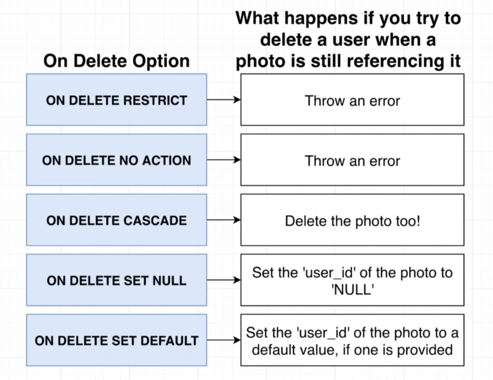

- Handling the deletion of a row in a table that has a foreign key in another table.

  ```sql
  CREATE TABLE <table_name> (
    <column_name> <data_type> PRIMARY KEY,
    <column_name> <data_type> REFERENCES <table_name>(<column_name>) ON DELETE CASCADE,
  );
  ```

  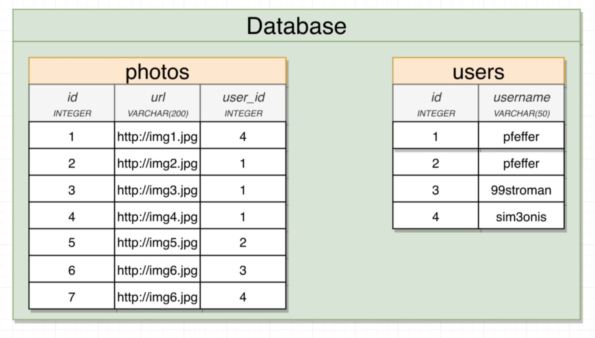
  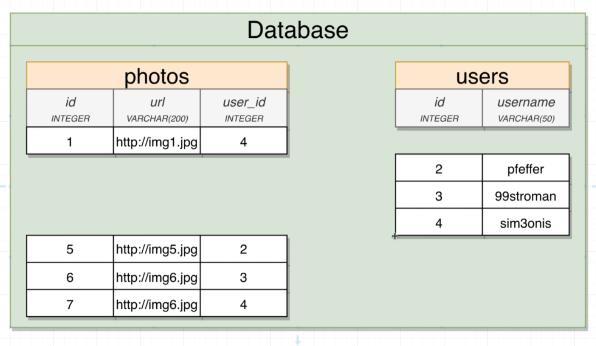

---

## Indexes

**Indexes** : is a data structure that improves the speed of data retrieval operations on a database table at the cost of additional writes and storage space to maintain the index data structure.

- It's a way to speed up queries.
- It's a pointer to data in a table.
  - It's like the (table of contents) in a book, as it helps you find the data you're looking for faster.
- It slows down the process of inserting, updating, and deleting data in the table. **(because we have to update the index as well)**

```sql
CREATE INDEX <index_name> ON <table_name> (<column_name>);
```

- When to use Indexes?

  - Primary keys, Foreign keys and Unique columns are indexed by default.
  - When you have a lot of data in a table.
  - When you have a lot of queries that use the same column.
  - When you have a lot of queries that use the same column in the `WHERE` clause.

- When not to use Indexes?
  - When you have a small amount of data in a table.
  - whey table is updated frequently.
  - when columns contain a lot of `NULL` values.
  - when columns have large values
  - When you have a lot of queries that use the same column but in the `SELECT` clause.
  - When you have a lot of queries that use the same column in the `WHERE` clause but with different values.

---

### Index Types

- Postgres supports different types of indexes:

  - **B-tree** : is the default index type in Postgres. It's the most common index type. It's the best choice for most situations.
    
  - **Hash** : is a good choice when you have a small number of rows in the table. It's faster than B-tree for small tables.
    
  - **Gin** : Generalized inverted index -- best used when multiple values are stored in a single field.
  - **GiST** : Generalized search tree -- useful in indexing geometry data types.

- Each index type uses a different **Algorithm** to store the data. Each index type has its own advantages and disadvantages.

---

## Subqueries

**SubQuery** : is a query within/inside another query used to restrict the data returned by the outer query to reduce the number of rows that the outer query has to process. (better performance)

- For example, instead of joining 2 tables, we can use a subquery to filter the data in the first table before joining it with the second table to reduce the number of rows that the `join` has to process.

- It must be enclosed in parentheses `()`.
- It's most often found in the `WHERE` clause of a query.

  ```sql
  SELECT <column_name>, <column_name>
  FROM <table_name>
  WHERE <column_name> = (SELECT <column_name> FROM <table_name> WHERE <condition>);
  ```

### SubQuery Types / Usecases

1. **Single Value SubQuery** : returns only one value from the inner query.

   - It's used as a column expression in the `SELECT` clause.

     ```sql
     SELECT <column_name>, <column_name>, (SELECT MAX(<column_name>) FROM <table_name>) AS max_value
     ```

2. **SubQuery in FROM** : returns a temporary table that can be used in the outer query.

   - It's used in the `FROM` clause and must be compatible with the outer query.
   - It can also return a single temporary value that can be used in the outer query. **(AS long as it's compatible with the outer query)**
   - It must have an alias.

     ```sql
     SELECT <column_name>, <column_name>
     FROM (SELECT <column_name>, <column_name> FROM <table_name>) AS <alias_name>
     ```

   - this type is not very common as it can be replaced with a `JOIN` or a normal query. But here's an example where we have to use it:

     ```sql
     -- Won't work ❌
     SELECT user_id, AVG(COUNT(*))
     FROM orders
     GROUP BY user_id;

      -- Will work ✅
      SELECT user_id, AVG(order_count)
      FROM (SELECT user_id, COUNT(*) AS order_count
            FROM orders
            GROUP BY user_id
           ) AS order_counts
      GROUP BY user_id;
     ```

3. **Single Row SubQuery** : returns only one row from the inner query.

   - It's called **"Correlated SubQuery"**
   - It's used with single row operators like `=`, `>`, `<`, `>=`, `<=`, `<>`, `!=`, `LIKE`, `NOT LIKE`, `BETWEEN`, `IN`, `IS`, `IS NOT`, `EXISTS`, `NOT EXISTS`.

     ```sql
     SELECT <column_name>, <column_name>
     FROM <table_name>
     WHERE <column_name> = (SELECT <column_name> FROM <table_name> WHERE <condition>);
     ```

4. **Multiple Row SubQuery** : returns multiple rows (a list of data) from the inner query.

   - It's used with multiple row operators like `IN`, `ANY`, `ALL`, this is because it returns a list of data.

     ```sql
     SELECT <column_name>, <column_name>
     FROM <table_name>
     WHERE <column_name> IN (SELECT <column_name> FROM <table_name> WHERE <condition>);
     ```

5. **Subquery in JOIN** : is used to filter the data in the first table before joining it with the second table to reduce the number of rows that the `join` has to process.

   - It's used in the `ON` clause of a `JOIN` statement.
   - The return data must be compatible with the `ON` clause.

     ```sql
     SELECT <column_name>, <column_name>
     FROM <table_name>
     JOIN (SELECT <column_name>, <column_name> FROM <table_name>) AS <alias_name>
     ON <table_name>.<column_name> = <alias_name>.<column_name>;
     ```

- When using `HAVING` with it, It must return a single value because `HAVING` is used to filter **groups of rows**.

---

### SubQueries vs Joins

- `SubQueries`

  - are used when you need to filter the data based on a condition that is not in the same table.
  - can be standalone queries.
  - can return a single result or row set (multiple rows) depending on the query location.
    - in `WHERE` clause, it must return a single result.
    - in `HAVING`/`SELECT` clause, it can return a single result or row set (multiple rows).
    - in `FROM` clause, it can return a single result or row set (multiple rows).

- `Joins`
  - are used when you need to filter the data based on a condition that is in the same table.
  - can only return a row set (multiple rows)

---

## Validating Data

It's important to validate the data before inserting it into the database to avoid errors and to make sure that the data is correct.

Validation can be done in 2 ways:

1. When creating the table (Constraints)
2. After creating the table (Trigger)

- **Constraints** : are used to validate the data **before** inserting it into the database. EX:
  - `NOT NULL`
  - `UNIQUE`
  - `PRIMARY KEY`
  - `FOREIGN KEY`
  - `CHECK`
  - `DEFAULT`
  - `INDEX`
  - `EXCLUSION`
  - `TRIGGER`
  - `RULE`
  - `CREATE ASSERTION`
  - `CREATE DOMAIN`
- **Triggers** : are used to validate the data **after** inserting it into the database. EX:

  - `ALTER TABLE`
  - `BEFORE INSERT`
  - `AFTER INSERT`
  - `BEFORE UPDATE`
  - `AFTER UPDATE`
  - `BEFORE DELETE`
  - `AFTER DELETE`

### Row Level Validation

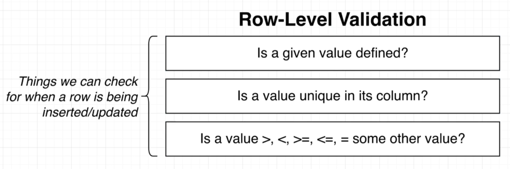

- Before inserting the data into the database:

  - we can validate it using `CHECK` constraint.

    ```sql
    CREATE TABLE <table_name> (
      <column_name> <data_type> <constraint> CHECK (<condition>),
      <column_name> <data_type> <constraint> CHECK (<condition>),
    )

    -- Example
    CREATE TABLE users (
      id SERIAL PRIMARY KEY,
      username VARCHAR(50) NOT NULL UNIQUE,
      -- check the length of the password
      password VARCHAR(255) NOT NULL CHECK (LENGTH(password) >= 8),
      -- checks between 2 columns
      start_date DATE NOT NULL,
      end_date DATE NOT NULL CHECK (end_date > start_date),
    );
    ```

  - We can validate it using a `Constraint Trigger` that will run before inserting the data into the database.

    ```sql
    CREATE TABLE <table_name> (
      <column_name> <data_type> <constraint>,
      <column_name> <data_type> <constraint>,
    )

    -- Example
    CREATE TABLE users (
      id SERIAL PRIMARY KEY,
      username VARCHAR(50) NOT NULL UNIQUE,
      email VARCHAR(255) NOT NULL UNIQUE
      SET Default 'user@mail.com',
      password VARCHAR(255) NOT NULL,

    );
    ```

- After inserting the data into the database, we can validate it using `TRIGGER`.

  ```sql
  ALTER TABLE <table_name>
  ADD CONSTRAINT <constraint_name> <constraint_type> (<column_name>);

  -- Example
  ALTER TABLE users
  ADD CONSTRAINT users_username_unique UNIQUE (username);
  -- or
  ADD UNIQUE (username);
  ```

---

### Where to apply the validation?

Where to apply the validation (`user-side` or `server-side` or `database-side`) depends on the type of validation.

- We should spread the validation between the 3 sides to make sure that the data is valid.
- Web-server vs Database validation
  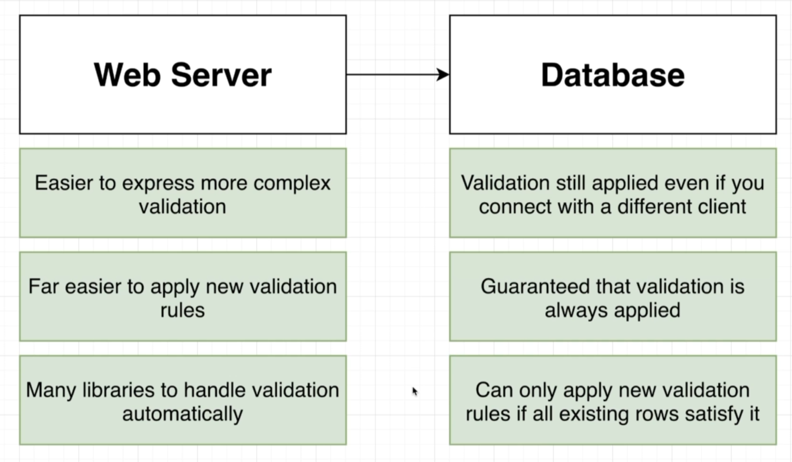

---

## Interviews Questions

- Can you use `SELECT` without `FROM`?

  - Yes, you can use `SELECT` without `FROM` to perform calculations. if you will return a single value

    ```sql
    SELECT 1 + 1;
    -- or
    SELECT (
      SELECT COUNT(*) FROM <table_name>
    )
    ```
