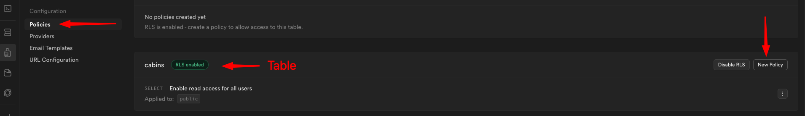

# INDEX

- [INDEX](#index)
  - [Supabase](#supabase)
  - [Table Editor](#table-editor)
    - [Users Table](#users-table)
    - [Row Level Security (RLS)](#row-level-security-rls)
  - [Storage](#storage)

## Supabase

Supabase is an open source **Firebase alternative**. It is a hosted platform to build applications with less time and cost.

- It's a service that provides a **PostgreSQL database** with a **RESTful API** and **realtime subscriptions**.

  - It allows developers to easily create a database with a RESTful API and realtime subscriptions without writing a single line of code.

- It automatically creates a `database` and `API` so that you can easily request and receive data from the server.
- It's not just an `API`, it also comes with easy to-use **user authentication** and **file storage**.

---

## Table Editor

- The `Table Editor` is a tool that allows you to create and edit tables in your database.

  - It's a simple way to create tables and columns, and add data to your database.

### Users Table

In supabase, we don't need to create a `users` table, it's already created for us. It has the following columns:

- `id` - a unique identifier for each user
- `email` - the user's email address
- `password` - the user's password
- `role` - the user's role (admin, user, etc.)
- `username` - the user's username
- ... other columns that are not important for now

---

### Row Level Security (RLS)

`Row Level Security` is a feature that allows you to restrict access to certain rows in a table based on the user's role.

- it prevents users from accessing data that they shouldn't have access to.
- For example, if you have a table with a column called `role`, you can use `RLS` to restrict access to certain rows based on the user's role.
- To add policies to a table, go to the `Table Editor` and click on the `Policies` tab.

  - You can add policies to a table by clicking on the `Add Policy` button.
    

- When we have the `RLS` enabled, it gives us extra security by preventing users from accessing data that they shouldn't have access to (not being able to `WRITE` or `DELETE` data)

---

## Storage

Supabase Storage is a service that allows you to store files in the cloud. It's a simple way to store files without having to worry about servers, databases, or anything else.

- we can create `Bucket` to store files.
- `RLS` also works with `Storage`, so we can restrict access to certain files based on the user's role.
  - for example, if we made the `bucket` public, anyone can read the files in the bucket, but only users with the `admin` role can write to the bucket.
