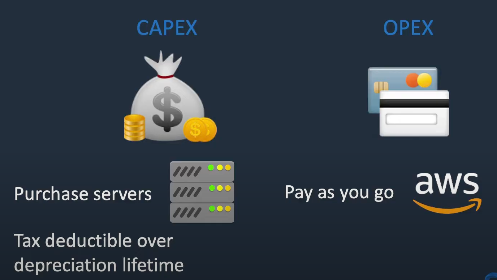
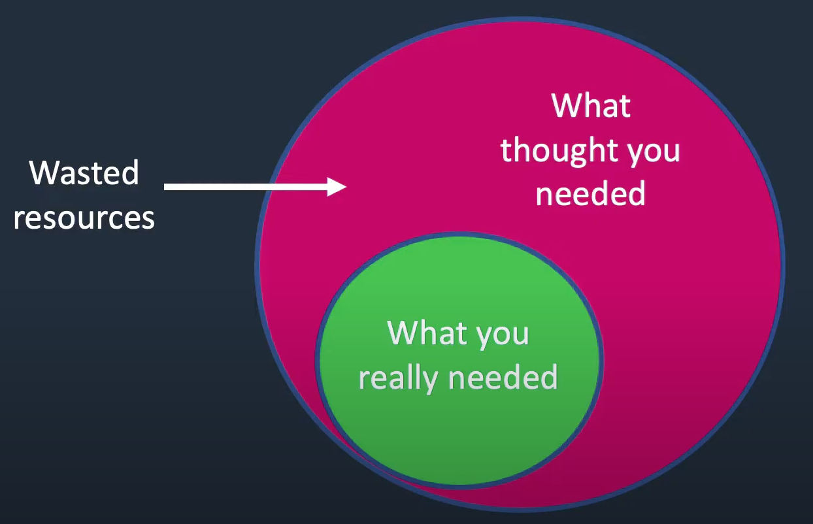
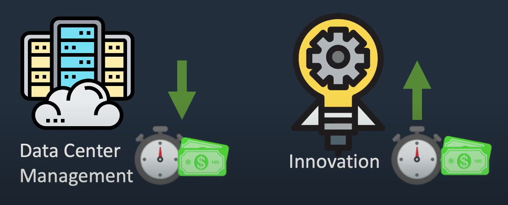
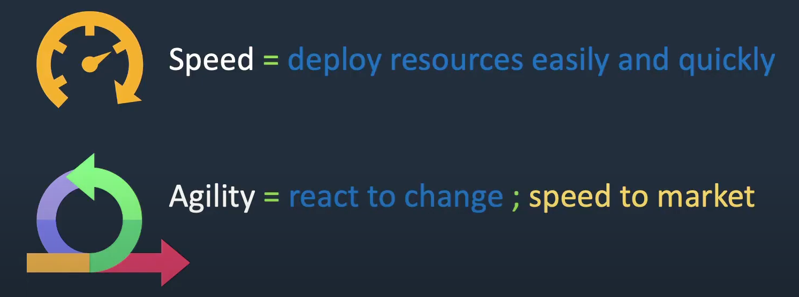
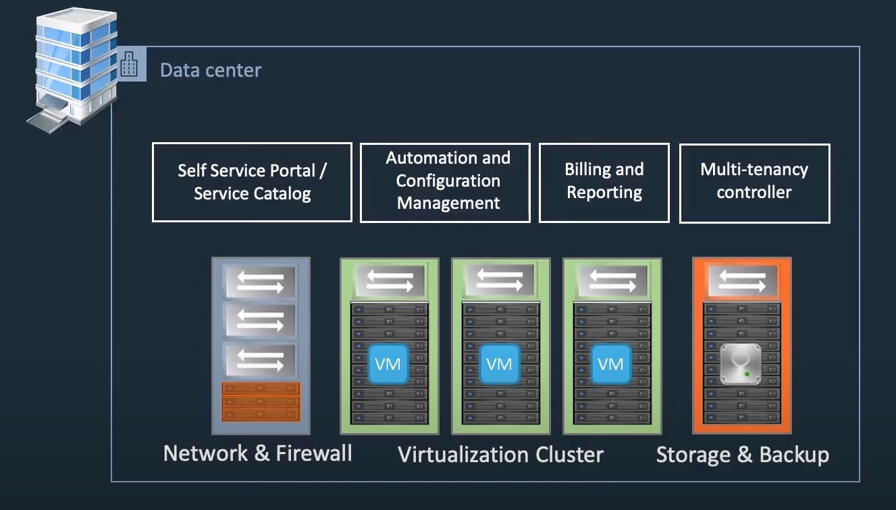
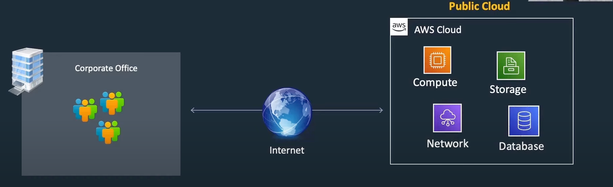
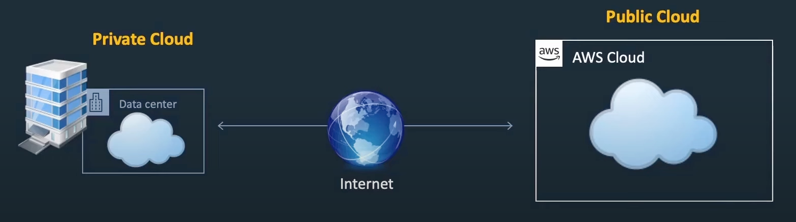
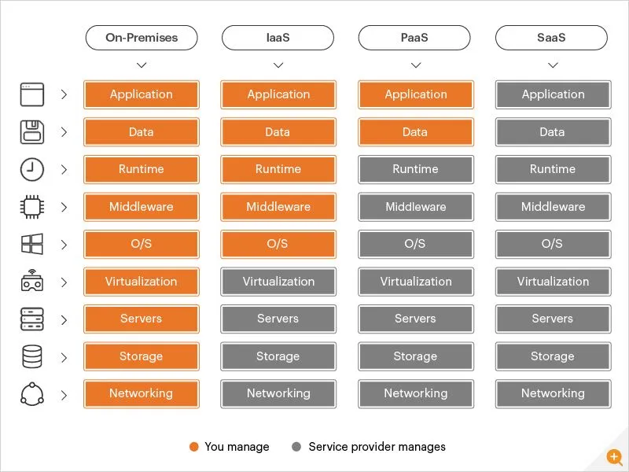
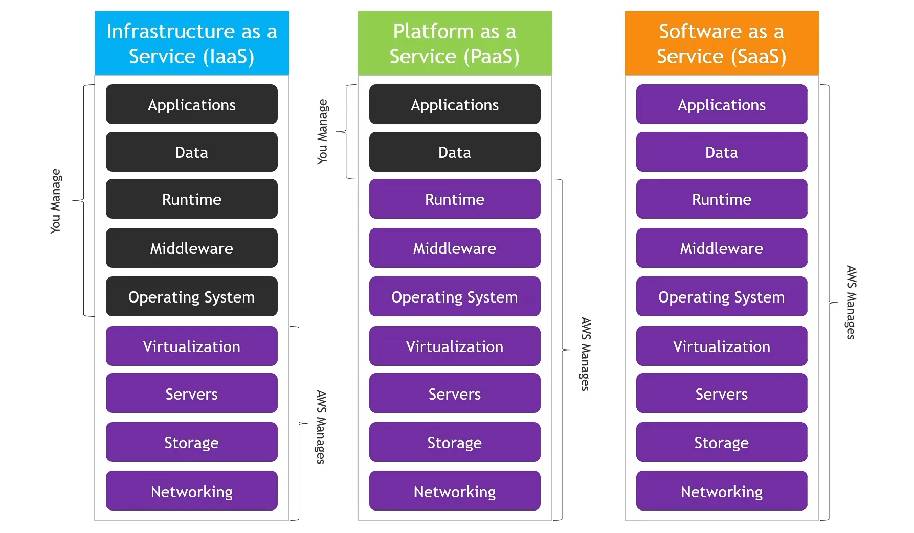

# INDEX

- [INDEX](#index)
  - [Cloud Computing](#cloud-computing)
    - [Why Cloud Computing?](#why-cloud-computing)
    - [Benefits of the Cloud](#benefits-of-the-cloud)
    - [Cloud Deployment Models](#cloud-deployment-models)
    - [Cloud Computing Models](#cloud-computing-models)

---

## Cloud Computing

Cloud computing is the delivery of computing services over the internet.

### Why Cloud Computing?

- There're many problems with the traditional IT approach:

  - Covering the costs of data center rental.
  - Covering expenses for power supply, cooling, and maintenance.
  - Time required for hardware additions and replacements.
  - Cannot scale as flexibly as you would like…
  - Employing a 24/7 team for infrastructure monitoring.
  - Addressing disaster preparedness concerns such as earthquakes, power shutdowns, and fires.
  - Overall, inflexible and inconvenient for our rapidly changing world.

- Cloud computing = on-demand delivery of compute power, database storage, applications, and other IT resources.
  - Pay as you go pricing
    
  - Provision computing resources precisely tailored to your needs (Stop guessing capacity)
    
  - Access virtually unlimited resources promptly.
  - Stop spending money running and maintaining data centers.
    
  - Convenient access to servers, storage, databases, and various application services.

---

### Benefits of the Cloud

- **Elasticity** : the ability to adapt to workload changes by provisioning and de-provisioning resources -> (short-term changes)
- **Scalability** : the ability to increase or decrease resources as needed -> (long-term changes)
  - Stop Guessing capacity (Scale up or down at will)
- **High Availability** : the ability to ensure your application is always available even when some components fail
  - Ex: when power goes out, data center goes down -> traffic is routed to another data center
- **Reliability** : the ability to function correctly and consistently when expected
- **Speed & Agility** : the ability to quickly change / develop / deploy applications to meet business needs
  
- **Global Reach** : the ability to deploy your application in multiple geographic regions around the world with a few clicks
- **pay as you go** : the ability to only pay for what you use
- **Economies of scale** : the ability to reduce costs due to size
  - AWS can charge less than you can do it yourself

> `Latency` : the time that passes between a user request and the resulting response.

---

### Cloud Deployment Models

- **Private Cloud**
  
  - exclusive cloud services utilized by a single organization, inaccessible to the public (company deploys their own infrastructure and applications into their own data center)
  - complete control over the infrastructure and resources.
  - Enhanced security and privacy
  - tailored to meet specific business requirements
  - ex: Banks, Microsoft, RedHat
- **Public Cloud**
  
  - cloud resources owned and operated by a third-party cloud service provider, accessible over the Internet.
  - `scalability`, `reliability`, and `cost-effectiveness`.
  - ex: AWS, Azure, Google Cloud
- **Hybrid Cloud**
  
  - a combination of private and public cloud services.
  - allows data and applications to be shared between them.
  - flexible and cost-efficient
- **Multi-Cloud**
  - the use of multiple cloud computing services in a single architecture (deploy some services on AWS and others on Azure)
  - reduces the risk of vendor lock-in.
  - more complex to manage
  - ex: AWS, Azure, Google Cloud

---

### Cloud Computing Models

- **Infrastructure as a Service (IaaS)**
  - provides virtualized computing resources over the internet.
  - Allow flexible provision and management of infrastructure
  - Eliminates the need for physical hardware ownership
  - ex: EC2, Google Compute Engine, Azure Virtual Machines
- **Platform as a Service (PaaS)**

  - provides a platform allowing customers to develop, run, and manage applications without the complexity of building and maintaining the infrastructure.
  - no need to manage deployment, scaling, or maintenance
  - ex: AWS Elastic Beanstalk, Google App Engine, Azure App Services

- **Software as a Service (SaaS)**
  - cloud-based product that is run and managed by the service provider.
  - this is currently most of the applications we use on the internet
  - ex: Gmail, Office 365, Salesforce

Each type provides different levels of control, flexibility, and management (from the cloud provider and the customer).

---
