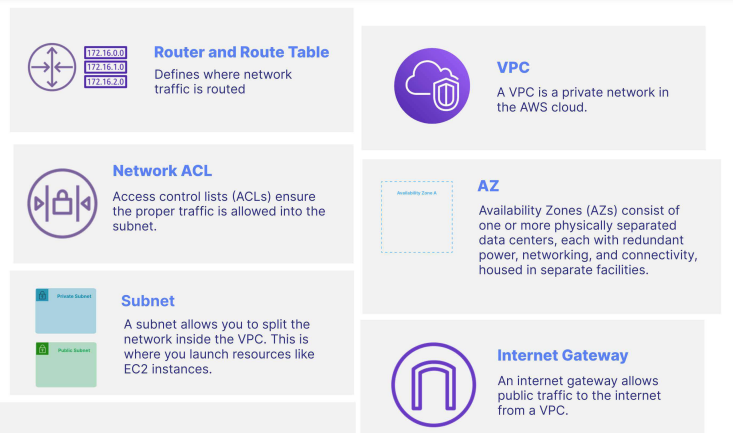
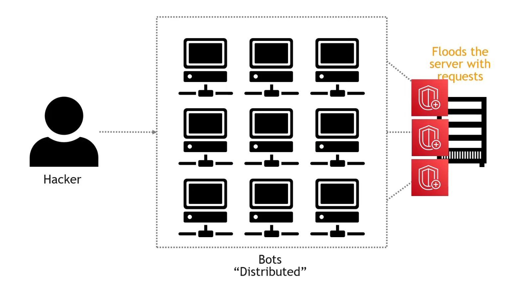

# INDEX

- [INDEX](#index)
  - [Source](#source)
  - [Amazon Web Services (AWS)](#amazon-web-services-aws)
    - [AWS Global Infrastructure](#aws-global-infrastructure)
    - [Shared Responsibility Model](#shared-responsibility-model)
    - [AWS Cloud Adoption Framework (CAF)](#aws-cloud-adoption-framework-caf)
    - [AWS Well Adopted Framework](#aws-well-adopted-framework)
    - [AWS Managed Services (AMS)](#aws-managed-services-ams)
  - [IAM](#iam)
    - [Identities vs Access](#identities-vs-access)
    - [Authentication ("Who") vs Authorization ("What")](#authentication-who-vs-authorization-what)
    - [Groups](#groups)
    - [Roles](#roles)
    - [IAM Policies and Statements](#iam-policies-and-statements)
  - [S3](#s3)
    - [S3 Storage Classes](#s3-storage-classes)
    - [Versioning](#versioning)
  - [Content Delivery Services](#content-delivery-services)
    - [content delivery network (CDN)](#content-delivery-network-cdn)
    - [Transfer Acceleration](#transfer-acceleration)
    - [CloudFront](#cloudfront)
  - [Elastic Compute Cloud (EC2)](#elastic-compute-cloud-ec2)
    - [EC2 Types, Sizing and Configurations](#ec2-types-sizing-and-configurations)
    - [EC2 Shared Responsibility Model](#ec2-shared-responsibility-model)
    - [EC2 Details](#ec2-details)
    - [Using The Command Line](#using-the-command-line)
    - [AWS Fargate](#aws-fargate)
  - [AWS Lambda](#aws-lambda)
    - [Features](#features)
  - [Elastic Load Balancing (ELB)](#elastic-load-balancing-elb)
    - [Load Balancers](#load-balancers)
    - [Auto Scaling Groups](#auto-scaling-groups)
      - [Scalability](#scalability)
      - [Scaling Strategies](#scaling-strategies)
    - [Auto Scaling](#auto-scaling)
  - [Networking Services](#networking-services)
    - [Virtual Private Cloud (VPC)](#virtual-private-cloud-vpc)
      - [VPC Connections](#vpc-connections)
      - [How do you monitor the network?](#how-do-you-monitor-the-network)
    - [Route 53](#route-53)
  - [Sequrity](#sequrity)
    - [Web Application Firewall (WAF)](#web-application-firewall-waf)
    - [Distributed Denial of Service (DDoS)](#distributed-denial-of-service-ddos)
    - [Macie](#macie)
    - [Config](#config)
    - [Data encryption](#data-encryption)
    - [Key Management Service (KMS)](#key-management-service-kms)
  - [Databases](#databases)
    - [types of databases](#types-of-databases)
    - [OLAP vs OLTP](#olap-vs-oltp)
  - [Deployment and Infrastructure Management Services](#deployment-and-infrastructure-management-services)
    - [Infrastructure as Code (IaC)](#infrastructure-as-code-iac)
    - [CloudFormation](#cloudformation)
    - [Elastic Beanstalk](#elastic-beanstalk)
  - [Pricing](#pricing)
    - [AWS Pricing Models](#aws-pricing-models)
    - [EC2 Pricing](#ec2-pricing)
    - [Lambda Pricing](#lambda-pricing)
    - [S3 Pricing](#s3-pricing)
    - [RDS Pricing](#rds-pricing)
    - [Total Cost of Ownership (TCO)](#total-cost-of-ownership-tco)
    - [Application Discovery Service](#application-discovery-service)
    - [Ways to reduce costs](#ways-to-reduce-costs)
  - [Billing](#billing)
    - [Budget Types](#budget-types)
    - [AWS Budgets](#aws-budgets)
    - [Cost and Usage Report](#cost-and-usage-report)
    - [Cost allocation tags](#cost-allocation-tags)
    - [AWS Cost and Usage Reports](#aws-cost-and-usage-reports)
  - [Governance \& Management](#governance--management)
    - [Organizations](#organizations)
      - [benefits](#benefits)
    - [Control Tower](#control-tower)
    - [AWS Managed Services](#aws-managed-services)
    - [AWS Systems Manager](#aws-systems-manager)
    - [The AWS Partner Network (APN)](#the-aws-partner-network-apn)
  - [Support Plans](#support-plans)
    - [Types of issues covered by AWS Support](#types-of-issues-covered-by-aws-support)
  - [Resources](#resources)

---

## Source

[Full content](https://acloudguru.visme.co/view/mxz10wwn-s01-l00-table-of-contents)

---

## Amazon Web Services (AWS)

It is a subsidiary of Amazon providing on-demand cloud computing platforms and APIs to individuals, companies, and governments, on a metered pay-as-you-go basis.

> It started in 2006 with simple-storage-service (S3), then elastic-computed-cloud (EC2) in 2008, and now it has over 200 services.

### AWS Global Infrastructure

- **Region**

  - It's a cluster of data centers (Geographical area)
  - Each region consists of 2 more **availability zones** connected to each other.
  - Fully Independent and Isolated
  - AWS has Regions all around the world. Names can be `us-east-1`, `eu-west-3`, etc.
  - Most AWS services are region-scoped.
  - Choosing an AWS Region depends on:
    - Compliance requirements (data stays in a specific country for legal reasons)
    - Proximity to customers (reduces latency)
    - Services available in a region
    - Pricing (some services are cheaper in certain regions)

- **Availability zone**

  - It's a physically place with a cluster of data centers with independent (power, cooling and networking)
  - Each region consists of multiple Availability Zones (usually 3, min is 3, max is 6) connected by low-latency links.
  - An availability zone can be a several **data centers**, but if they are close together, they are counted as 1 availability zone.
  - Allows for high Availability and fault tolerance
    - Applications deployed across multiple availability zones are resilient to failures in case of a disaster.

- **Data center**

  - It's managed by AWS staff, where access is restricted for security.
  - It's the physical building where the servers are located

- **Edge Locations (Points of Presence)**
  - They cache content for fast delivery (low-latency) to your users.
  - Edge locations consist of `CloudFront`, Amazon's Content Delivery Network (CDN).
  - Amazon has more than 400 edge locations around the world.

---

### Shared Responsibility Model

It's a model referring to protection of your cloud computing resources, whose responsibility is shared between you (the customer) and AWS.


- AWS responsibility : Security **of** the Cloud

  - AWS is responsible for protecting and securing their infrastructure (physical security, environmental controls, and maintaining core infrastructure services)
    

- Your responsibility : Security **in** the Cloud

  - You are responsible for how the services are implemented and managing your application data (securing data, managing access controls, and configuring security settings)
    
  - Your responsibility can vary depending on the AWS service you use (managed vs un-managed services)

- Collaboration between you and AWS is essential to ensure the security of your data and applications.

---

### AWS Cloud Adoption Framework (CAF)

It's a framework that helps organizations design execute a plan for transforming **(adopting)** their business in the cloud.

- The CAF is based on 6 perspectives:
  - Business
    - Aligning business outcomes with cloud adoption (CEO, CFO, ...)
  - People
    - Emphasize a culture of continuous learning and innovation (CIO, CTO, Cloud Director, ...)
  - Governance
    - Orchestrate and manage the cloud adoption process (CISO, CCO, ...)
  - Platform
    - Building a secure, scalable, and efficient cloud environment (CTO, Cloud Architect, ...)
    - Aid in modularizing existing workloads (new cloud-native solutions)
  - Security
    - Achieve confidentiality, integrity, and availability of data (CISO, CTO, ...)
  - Operations
    - Ensure that your cloud services are delivered at a level that meets the needs of your business (SRE, Cloud Operations, ...)

---

### AWS Well Adopted Framework

It's a set of strategies and guidelines designed to help organizations build secure, high-performing, resilient, and efficient infrastructure for their applications.


- Benefits of applying this framework:

  - Avoid common pitfalls
  - Decrease Risk
  - Making sure that your infrastructure is well-architected

- The 6 pillars of the Well-Architected Framework are:

  - **Security**
    - Protecting information, systems, and assets, by using (identity & access-management) and detecting security threats
  - **Cost Optimization**
    - Avoiding unnecessary costs and optimizing spending to meet business and technical requirements.
  - **Performance Efficiency**
    - Using computing resources efficiently to meet system requirements and maintain that efficiency as demand changes and technologies evolve.
  - **Sustainability**
    - Minimizing environmental impact of running cloud workloads.
  - **Reliability**
    - Ability of a system to recover from failures and continue to function.
    - Design principles:
      1. Automatically recover from failure (monitoring metrics and use automation to fix issues)
      2. Test recovery procedures
      3. Scale horizontally to increase aggregate system availability
      4. Stop guessing capacity (to avoid over-provisioning and only use what you need)
      5. Manage changes through automation
  - **Operational Excellence**
    - Focuses on running and monitoring systems to deliver business value and continually improving processes.
    - Steps:
      1. Perform operations as code
      2. Make frequent, small, reversible changes
      3. Refine operations procedures frequently (constant improvement)
      4. Anticipate failure
      5. Learn from all operational failures

---

### AWS Managed Services (AMS)

Provides infrastructure and application support on AWS through AMS (AWS Managed Services).

- AMS offers a team of AWS experts who manage and operate your infrastructure for security, reliability, and availability.
- It helps organizations offload routine management tasks and focus on their business objectives.
- It provides continuous support `24/7/365` and provides proactive monitoring and management of your AWS environment.

---

## IAM


- `IAM` is an AWS service for managing both authentication and authorization in determining who can access which resources in your AWS account.
- `IAM` allows you to control access to your AWS services and resources.
- Root User : has full adminstrator access & permission
- `principle of least privilege` : giving a user the **minimum** access required to get the job done.

---

### Identities vs Access


### Authentication ("Who") vs Authorization ("What")


---

### Groups

- A group is a collection of IAM users that helps you apply common access controls to all group members.

- Groups save you time by allowing you to apply the same access permissions to more than one user at once. When a user no longer needs access, they can be removed from the group.

> Do not confuse security groups for EC2 with IAM groups. EC2 security groups act as firewalls, while IAM groups are collections of users.

---

### Roles

Roles define access permissions and are temporarily assumed by an IAM user or service.


- You can attach a role to an instance that provides privileges (e.g., uploading files to S3) to applications running on the instance.
  
- Roles help you avoid sharing long-term credentials like `access keys` and protect your instances from unauthorized access.

---

### IAM Policies and Statements

You manage permissions for IAM users, groups, and roles by creating a policy document in `JSON` format and attaching it.


- There are three critical elements to an IAM statement. They are:
  - `Action` -- ex : `s3:GetObject: For reading an object on S3;`
  - `Resource` -- ex : `arn:aws:s3:::my_bucket`
  - `Effect` -- ex : `allow/deny` 

---

## S3

Simple Storage Service

- S3 is an `object storage service` for the cloud that is highly available.
- any thing you upload to s3 `isn't public`, so you have to manually make it so if you want


### S3 Storage Classes


### Versioning

Versioning helps you prevent accidentally overwriting or deleting a file. In a versioning enabled bucket if the
same object key is written multiple times, all of the writes will be recorded with the same object key but
having different version IDs.

---

## Content Delivery Services

### content delivery network (CDN)

A CDN is a mechanism to deliver content quickly and efficiently based on `geographic location`.

- `Latency` means the time it takes to respond to a request.

---

### Transfer Acceleration


---

### CloudFront

CloudFront is a CDN that delivers data and applications globally with low latency.

- it uses groups of `edge locations` to deliver your content so it's a `CDN`
- Makes content available globally or restricts it based on location


- every request is automatically routed to the nearest `edge location`

  

- objects are cashed for the `TTL` (time to live)
- `Geo-restriction` prevents users in certain countries from accessing content.

---

## Elastic Compute Cloud (EC2)

It's a web service that provides resizable compute capacity in the cloud, and allows you to rent and manage `virtual servers` in the cloud.

> EC2 = Elastic Compute Cloud = Infrastructure as a Service (IaaS)

- It's one of the most popular services in AWS
- It allows users to rent virtual servers (known as instances) on which they can run their own applications.
- Each instance type offers a different balance of compute, memory, network, and storage resources.
- It supports a variety of operating systems and software configurations, allowing users to customize their computing environment according to their requirements.
- It's widely used for hosting websites, running applications, performing data processing tasks, and more, making it a fundamental component of cloud computing.

- EC2 Capabilities:

  - Rent virtual machines (`EC2`)
  - Store data on virtual drives (`EBS`)
  - Distribute load across machines (`ELB`)
  - Scale services using auto-scaling-group (`ASG`)

- EC2 is `not serverless` as it uses servers in the cloud

- The most common way to connect to Linux EC2 instances is via Secure Shell (`SSH`).

  

### EC2 Types, Sizing and Configurations

The instance type determines the hardware available to your instance.


- **Configurations**

  - Operating System (OS) -> Linux or Windows
  - Compute Power & Cores (CPU)
  - RAM
  - Storage
    - Network-attached (EBS)
    - Hardware (Instance Store)
  - Network card
    - Speed
    - Public IP address
  - Firewall rules -> Security group settings
  - Bootstrap script

    - EC2 instances can be configured at launch using **User Data scripts**. It includes:
      - Installing (updates, software)
      - Downloading files from the internet
      - Any other tasks needed
    - This user data script creates a server and static web page when the EC2 instance is first created.

    > Bootstrapping = refers to executing commands upon a machine's startup.

- **Instance Types**

  - AWS offers a variety of EC2 instance types optimized for diverse use cases. and follows a naming convention, ex: `m5.2xlarge`
    - `m`: instance class
    - `5`: generation (AWS improves them over time)
    - `2xlarge`: size within the instance class
  - Types:
    - General Purpose
      - good for diverse workloads like web servers and code repositories
    - Compute Optimized
      - good for compute-intensive tasks demanding high-performance processors
    - Memory Optimized
      - Provides fast performance for workloads **processing large data sets in memory** -> cache
    - Storage Optimized
      - Ideal for **storage-intensive tasks with high, sequential read and write access to large data sets on local storage** -> DB
    - Accelerated Computing
    - HPC Optimized
    - Instance Features
    - Measuring Instance Performance

- Right sizing
  - Right sizing involves matching instance types and sizes to workload requirements for optimal performance and cost.
  - Scaling up is easy, so it's advisable to start with smaller instances.
  - Tools like `CloudWatch`, `Cost Explorer`, `Trusted Advisor`, and third-party tools can assist in right sizing.

---

### EC2 Shared Responsibility Model

| AWS                         | 👤                                                              |
| --------------------------- | --------------------------------------------------------------- |
| Infrastructure              | Security Group rules                                            |
| Isolation on physical hosts | Operating-system patches and updates, and software installation |
| Replacing faulty hardware   | IAM roles assigned to EC2                                       |
| Compliance validation       | Data security                                                   |

---

### EC2 Details

- Security

  - Security Groups are essential for network security in AWS. They manage **inbound and outbound traffic** for Ec2 instances.
  - It serves as **firewall** (Operates externally to the EC2 instance; blocked traffic does not reach the instance)
  - It consists of **rules** that can:
    - specify permissions by IP address or by referencing other Security Groups.
    - Access to specific ports
    - Authorized IP ranges for both `IPv4` and `IPv6`
    - Control of inbound traffic (from others to the instance) -> blocked by default
    - Control of outbound traffic (from the instance to others) -> Allowed by default
  - It can be attached to multiple instances.

- Elastic Block Store (EBS) Volumes

  - An EBS (Elastic Block Store) Volume is a network drive that can be attached to instances while they run. They can be thought of as a "network USB stick."

    - It is a network drive, meaning it's not a physical drive and uses the network to communicate with the instance, which may result in some latency.
    - It can be detached from one EC2 instance and attached to another quickly.

  - It can be attached to one instance at a time.
  - It can allows instances to persist data even after termination. if specified when the instance terminates
    - This is done by creating a snapshot of the volumes before deletion
  - They can only be mounted to one instance at a time, and are bound to a specific availability zone.

- Amazon Machine Images (AMI)

  - Provides the information required to launch an EC2 instance (ready templates)
  - Speedier boot / configuration time because all your software is pre-packaged
  - You can launch EC2 instances from:
    - A Public AMI: AWS provided
    - Your own AMI: you make and maintain them yourself
    - An AWS Marketplace AMI: an AMI someone else made (and potentially sells)

- EC2 Image Builder

  - It's a service that simplifies the creation, maintenance, and validation of secure OS images.
  - It's used to automate the creation of Virtual Machines or container images.
  - It's a **free** service, with charges only for the underlying resources used

- EC2 Instance Store

  - It's a temporary block storage for EC2 instances.
  - It's high-performance storage that is physically attached to the host computer.
  - There is a risk of data loss if the hardware fails (Managing backups and replication is your responsibility).

- EFS - Elastic File System

  - It's a **scalable** file storage for use with EC2 instances.
  - It's a network file system that can be shared across multiple EC2 instances.
  - `EFS Infrequent Access` is a storage class that reduces costs by moving files that are accessed less frequently to a lower-cost storage class.

- Amazon FSx
  - It's a fully managed file storage service that is compatible with Windows and Lustre file systems.
  - It's used to store and share files across Windows and Linux instances with high performance and low latency.

---

### Using The Command Line

- to be able to use it we have to `configure` it first, we have 2 ways :

  - give it the credentials for administrator-access

    ```bash
      aws configure

      # then write the data from the csv file
    ```

  - using `Roles`
    - create a role for EC2 + attach a `policy` to this role (what you want the EC2 to be able to do or deal with like `s3`)
    - then go to the `EC2 instance` and attach the role to it

---

### AWS Fargate

Fargate is a `serverless` compute engine for containers.

- `Serverless` means you don’t worry about provisioning, configuring, or scaling servers.
- Fargate allows you to manage containers, like Docker.
- Scales automatically

---

## AWS Lambda

Lambda is a `serverless compute service` that lets you run code without managing servers.


### Features

- Supports popular programming languages like Java, Go, PowerShell, Node.js, C#, Python, and Ruby.
- You author code using your favorite development environment or via the console.
- Lambda can execute your code in response to events.
- Lambda functions have a `15`-minute timeout.

---

## Elastic Load Balancing (ELB)

They're servers that forward internet traffic to multiple servers (EC2 instances)


### Load Balancers

- Why use a load balancer?

  - Spread load across multiple instances
  - Expose a single point of access (`DSN`) to your app
  - Seamlessly handle failures of downstream instances
  - Do regular health-checks to your instances
  - Provide `SSL` termination (`HTTPS`) for your websites
  - Enforce stickiness with cookies
  - High availability across zones

- ELB
  - It's a managed load balancer provided by AWS, which ensures its functionality, handling upgrades, maintenance, and high availability.
  - Configuration options are limited, but it reduces the effort and cost of setting up and maintaining your own load balancer.
  - Types:
    - Classic Load Balancer: Supports both Layer 4 and 7 traffic, **retired in 2023**
    - Application Load Balancer (`ALB`)
      - For (HTTP/HTTPS & Websocket) traffic, operates at Layer 7
      - For multiple applications on the same machine (ex: containers)
        
      - The application-servers don't see the `IP` of the client directly, as it will be inserted in the header `X-Forwarded-For`
    - Network Load Balancer (`NLB`)
      - For ultra-high performance, supports `TCP` traffic (low level), operates at Layer 4.
        
    - Gateway Load Balancer: Operates at Layer 3.

---

### Auto Scaling Groups

#### Scalability

- It refers to the ability of an application or system to handle increasing loads by adapting.
- `Vertical scaling` increases the capacity of a single server by adding more resources (CPU, RAM).
  - Commonly used for non-distributed systems, like databases.
  - There's typically a limit to how much you can vertically scale, determined by hardware limitations.
- `Horizontal scaling` increases the capacity of the system by adding more servers.
- Scalability is closely related but distinct from High Availability.
  - High Availability refers to the ability of a system to remain operational even when some of its components fail -> (horizontal scaling on at least 2 AZ)
- Scalability vs Elasticity (vs Agility)
  - `Scalability`: The ability to accommodate a larger load by either enhancing the hardware (scale up) or adding nodes (scale out).
  - `Elasticity`: In a scalable system, elasticity refers to the automatic scaling based on the load, enabling a pay-per-use model, demand matching, and cost optimization.
  - `Agility`: Unrelated to scalability, agility implies that new IT resources can be provisioned quickly, reducing the time to availability from weeks to minutes.

#### Scaling Strategies

- Manual scaling: Adjust the size of an Auto Scaling Group (ASG) manually as needed.
- Dynamic Scaling: Automatically respond to changing demand with different strategies:

---

### Auto Scaling

- Implement elasticity for applications across multiple AZs.
- Automatically scale EC2 instances based on demand and replace unhealthy instances.
- Integrated with ELB to ensure new instances are registered and traffic is balanced efficiently.

---

## Networking Services

### Virtual Private Cloud (VPC)

It's a logically isolated and private section of the AWS cloud **within a region**, where you can deploy your AWS resources.

- A VPC spans Availability Zones in a Region
- Each VPC is a separate network with its own IP address range. and consists of `subnets` and `security groups` connected via `route tables`
  

- **How VPC works?**
  
  - `Subnets` are a range of IP addresses in your VPC, they can be public or private.
  - `Route tables` are used to determine where network traffic is directed **within a VPC**.
    - private subnet: is not accessible from the internet
  - `Internet Gateway` it enables internet connectivity for instances in a VPC.
    - public subnet: is accessible from the internet, it's configured with a route to the internet gateway for external traffic.
  - So, **Any traffic that is going from the internet to the VPC and vice versa has to go through the internet gateway, and traffic between subnets in the VPC goes through the route tables.**
- VPC peering allows you to connect 2 VPCs together.
  

- **Network ACL & Security Groups**

  - Network ACLs

    - act as a firewall for controlling traffic in and out of one or more subnets. and attached at the subnet level.
    - support `allow` and `deny` rules. and rules are based on IP address

  - Security Groups
    - act as a firewall for controlling traffic to and from an EC2 instance.
    - only allow supported rules, and rules are based on `security group` and `port`

#### VPC Connections

- **VPC Peering**: Connects two VPCs together, allowing traffic to flow between them as if they were in the same network.
- **VPC Endpoints**: Allows you to privately connect your VPC to supported AWS services without requiring an internet gateway (S3, DynamoDB, etc).
- **AWS PrivateLink**: Allows you to privately access services hosted on AWS or by third parties.

  - It's the most secure and scalable way to expose a service to thousands of VPCs
  - It requires a Network Load Balancer (`NLB`) in the service VPC and an Elastic Network Interface (`ENI`) in the customer VPC.

- **Site to Site VPN**: Connects your on-premises network to your VPC using a VPN connection.
  - The connection is automatically encrypted and traffic goes over the public internet
- **Direct Connect**: Establishes a dedicated network connection between your network and AWS.
  - It's a private connection that bypasses the public internet and provides more consistent network performance.
  - Traffic goes over a private network connection between your network and AWS.
- **AWS Transit Gateway**: Allows you to connect multiple VPCs and on-premises networks together.
  - It acts as a hub that allows you to connect multiple VPCs and VPNs together.
  - It simplifies network architecture and reduces operational overhead.

---

#### How do you monitor the network?

**VPC Flow Logs**: Capture information about the **IP** traffic going to and from network interfaces in your VPC.

- It's a feature that enables you to capture information about the **IP** traffic going to and from network interfaces in your VPC

  - The flow logs data can be sent to S3, cloudwatch, or a third-party tool for analysis.

- It helps you monitor the traffic and troubleshoot connectivity issues, such as:
  - Subnets to the internet
  - Subnets to other subnets
  - Instances to Subnets

---

### Route 53

Route 53 is a `DNS service` that routes users to applications.

---

## Sequrity

### Web Application Firewall (WAF)

`WAF` helps protect your web applications against common web attacks.

- You can deploy a web application directly to an EC2 instance and protect it from cross-site scripting attacks using WAF. You can even deploy WAF on CloudFront as part of your `CDN` solution to block malicious traffic.

  

---

### Distributed Denial of Service (DDoS)

A `DDoS` attack causes a traffic jam on a website or web application in an attempt to flood the server with requests and cause it to crash.


This result in that a real user can't access the website **(Denied!)**

- In order to prevent this, you can use `AWS Shield` to protect your applications from `DDoS` attacks.
  

---

### Macie

Macie helps you discover and protect sensitive data.

- Macie is a data privacy service that helps you uncover and protect your sensitive data, such as personally identifiable information (PII) like credit card numbers, passport numbers, social security numbers, and more.

---

### Config

allows you to assess, audit, and evaluate the configurations of your resources.

- Config allows you to record configuration changes within your EC2 instances. You can view network, software, and operating system (OS) configuration changes, system-level updates, and more.

---

### Data encryption

Data encryption encodes data so it cannot be read by unauthorized users.


- Types of encryption
  - `In transit` : data is encrypted while it is moving between locations (e.g., from your `computer` to `S3` or from `S3` to `EC2`)
  - `At rest` : data is encrypted while it is stored on a device

---

### Key Management Service (KMS)

`KMS` allows you to generate and store `encryption` keys.

---

## Databases

Databases allow us to collect, store, retrieve, sort, graph, and manipulate data.

### types of databases

- `Relational`
  - RDS : service that makes it easy to launch and manage relational databases.
  - Aurora : a relational database compatible with `MySQL` and `PostgreSQL` that was created by AWS, 5 times faster, Supports MySQL and PostgreSQL database engines
- `No SQL`
  - DynamoDB : fully managed NoSQL key-value and document database, it's **serverless**
- `Document`
  - DocumentDB : supports MongoDB, Fully managed and serverless
- `In memory`
  - ElastiCache : in-memory datastore compatible with `Redis` or `Memcached`. Data can be lost
- `Graph`
  - Neptune : Supports highly connected datasets like social media networks

---

### OLAP vs OLTP

- `OLAP`

  - Online analytical processing
  - conducting complex data analysis for smarter decision-making

- `OLTP`
  - Online transactional processing
  - processing a massive number of transactions

---

## Deployment and Infrastructure Management Services

These services help you quickly stand up new applications, automate the management of infrastructure, and provide real-time visibility into system health.

### Infrastructure as Code (IaC)

allows you to write a `script` to provision AWS resources. The benefit is that you provision resources in a `reproducible` manner that saves time.

### CloudFormation

- turns your `Infrastructure` to a `code`
- allows you to `provision` AWS resources using Infrastructure as Code (IaC).
- You can use `CloudFormation` to automate the creation of EC2 instances in your AWS account.

### Elastic Beanstalk

- allows you to deploy your web applications and web services to AWS.
- `Orchestration` service that provisions resources
- Automatically handles the deployment
- Monitors application health via a health dashboard

---

## Pricing

There are 3 fundamental drivers of cost:


### AWS Pricing Models

- Pay as you go
  - You pay only for what you use, without the need for long-term contracts or upfront commitments.
- Save when you reserve
  - You can save up to 75% by committing to use a specific instance type in a specific region for a one- or three-year term.
  - `Reserved Instances` (RIs) provide a significant discount compared to On-Demand pricing.
- Pay less by using more
  - offering lower prices for higher volumes of resource consumption.
- Pay less as AWS grows
  - AWS lowers prices as it grows, passing savings back to customers.

### EC2 Pricing


- `On-Demand` :
  - pay for what you use, no discount or commitments
  - Ideal for apps with unpredictable workloads or short-term projects
  - can be used for temporary development and testing environments
- `Reserved`:
  - 1 or 3 years commitment, up to 72% discount, predictable workloads and reserved capacity
  - Capacity Planning: Enables organizations to secure reserved capacity in advance for anticipated workloads, ensuring resource availability when needed.
- `Spot Instance`:
  - Bid on unused EC2 capacity, allowing access to spare compute capacity at reduced rates (up to 90% discount)
  - Suitable for fault-tolerant applications, batch processing, or workloads with flexible start and end times.
  - "spot block": reserve capacity for a specific duration without interruptions
- `Dedicated Instances`:

  - Dedicated Instances provide physical servers exclusively dedicated to a single customer's use.
  - Ideal for applications with strict compliance or licensing requirements
  - Used for storing sensitive data that cannot be interrupted - banking institutions, for example!

- `Dedicated Hosts`:
  - Physical servers dedicated to a single customer's use, providing isolation and control over instance placement.
  - Offers compliance and regulatory requirements by ensuring instances run on dedicated infrastructure.
  - Used for organizations with **sensitive data**
- `Savings Plans`:
  - commit to a consistent amount of usage for a 1 or 3 year term
  - Provides significant discounts (up to 72%) compared to On-Demand rates, with the flexibility to choose between different commitment options.
  - pay per hour

---

### Lambda Pricing


---

### S3 Pricing


---

### RDS Pricing


---

### Total Cost of Ownership (TCO)

is a financial estimate that helps you understand both the **direct** and **indirect** costs of AWS.

---

### Application Discovery Service

helps you plan `migration` projects to the AWS Cloud.

---

### Ways to reduce costs

1. Right-sizing of the infrastructure (EC2 instances)
2. Automation of the infrastructure (CloudFormation)
3. Compliance with AWS best practices (Well-Architected Framework)
4. Use of cost-effective resources (EC2 Spot Instances)

---

## Billing

### Budget Types

- Cost Budgets
- Usage Budgets
- Reservation Budgets

### AWS Budgets

gives you the ability to be `alerted` when the actual or forecasted cost and usage exceeds your desired threshold

### Cost and Usage Report

It gives you the ability to do a deep dive into your AWS cost and usage data. Once set up, you can download the report using the Amazon S3 console.

### Cost allocation tags

allows you to track AWS costs by labeling resources using a `key and value pair`

- Tags are useful for tracking AWS costs on a detailed level

### AWS Cost and Usage Reports

provides the `most detailed and comprehensive` report for AWS cost and usage data.

---

## Governance & Management

Governance and management services help you maintain control over cost, compliance, and security across your AWS accounts.

### Organizations

allows you to centrally manage multiple AWS accounts under one umbrella.


- Group multiple accounts
- Single payment for all accounts
- Automate account creation
- Allocate resources and apply policies across accounts

#### benefits


---

### Control Tower

helps you ensure your accounts conform to company-wide policies.

- Control Tower allows you to govern your multi-account environment by enabling cross-account security audits or preventing or detecting security issues through mandatory or optional guardrails.

---

### AWS Managed Services

reduces the operational overhead of your IT organization

---

### AWS Systems Manager

gives you visibility and control over your AWS resources.

- Systems Manager allows you to auto-patch software running on EC2 instances according to a schedule.

---

### The AWS Partner Network (APN)

- a global community of partners that helps companies build successful solutions with AWS.

- `Professional Services` is a global team of experts that can help you realize your desired business outcomes with AWS.

---

## Support Plans


### Types of issues covered by AWS Support

- "How to" questions about AWS services and features
- Problems detected by `health checks`

---

## Resources

[A-Cloud-Guru AWS Cloud Practitioner](https://acloudguru.visme.co/view/mxz10wwn-s01-l00-table-of-contents)

---
