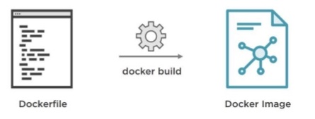
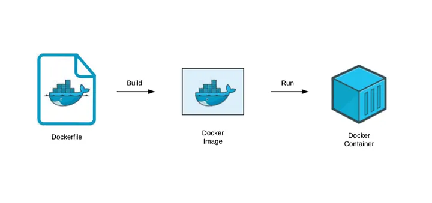
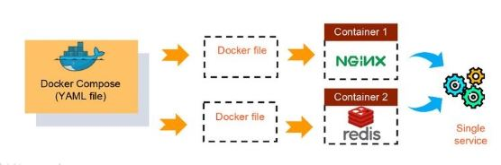

# INDEX

- [INDEX](#index)
  - [Containers](#containers)
    - [Virtual Machines vs Containers](#virtual-machines-vs-containers)
  - [Docker](#docker)
    - [Dockerfile](#dockerfile)
    - [Docker Commands](#docker-commands)
    - [Docker Notes](#docker-notes)
  - [Docker Compose](#docker-compose)
    - [Docker Compose YAML File](#docker-compose-yaml-file)
    - [Docker Compose Commands](#docker-compose-commands)
    - [Linking between containers](#linking-between-containers)
  - [Docker Volumes](#docker-volumes)
  - [Ports](#ports)
  - [Migrating Database to a container](#migrating-database-to-a-container)

---

## Containers

They are **lightweight** and **standalone** executable packages of software that includes everything needed to run an application: `code`, `runtime`, `system tools`, `system libraries` and `settings`.

- Containers are **isolated** from each other and **bundle** their own software, libraries and configuration files; they can communicate with each other through well-defined channels.
- They're used to create **microservices** and **deploy** them on **cloud**.
- We try to make each container **stateless** and **specialized**.
  - it's like pure functions in programming. where we try to make each function do one thing and do it well.

---

### Virtual Machines vs Containers

- Before containers, we used to use virtual machines to run multiple applications on the same server. But virtual machines are **heavy** and **slow**.
  
  - virtual machines have their own OS, libraries, etc. so they're heavy.
    - They're like a house with all the facilities. and also called **sandboxes**.
  - containers share the OS and libraries with the host machine, so they're lightweight.

---

## Docker

**Docker** is a container platform that packages your application and all its dependencies together in the form of containers so as to ensure that your application works seamlessly in any environment be it development or test or production.


- It ensures that your application works seamlessly in any environment be it development or test or production.
- Docker components:

  - Host -> where docker is installed and running.
  - Container -> where the application is running.
  - Image -> a standalone executable package of software that includes everything needed to run an application: `code`, `runtime`, `system tools`, `system libraries` and `settings`.
  - Registry -> a place where we can store images.

- Docker bundles your application into an `image` and then runs that `image` inside a `container`.
- The environment inside the `container` is completely isolated from the `host` machine.
- Within a docker image, we can have a file system (called `volume`) that is shared between the host and the container.
  - so we can share files between the host and the container.
  - we can also share files between containers.

---

### Dockerfile

It's a file that contains all the commands that we need to build a docker image.

- It's a text file that contains all the commands that we need to build a docker image. (like a recipe for building a docker image)
- **Content:**

  ```dockerfile
  FROM node:alpine
  WORKDIR /usr/app
  COPY ./ ./
  RUN npm install
  CMD ["npm", "start"]
  EXPOSE 3000
  ```

  - `FROM node:alpine` -> we're using a base image called `node:alpine` to build our image. So, `FROM` is used to specify the base (parent) image.
  - `WORKDIR /usr/app` -> we're setting the working directory to `/usr/app`. So, `WORKDIR` is used to set the working directory where we want to copy our files.
  - `COPY ./ ./` -> copying all the files from the current directory to the working directory.
    - because we want to copy all the files after installing dependencies. (because if we change the code, we don't want to install dependencies again)
  - `RUN npm install` -> installing dependencies.
  - `CMD ["npm", "start"]` -> running the application.
  - `EXPOSE 3000` -> exposing port `3000` to the outside world.
    - we can also use `docker run -p 3000:3000 <image_id>` to expose port 3000 to the outside world.

---

### Docker Commands

- **Building an image:**
  

  - `docker build .` -> to build an image from the current directory.
    - it will create an image with a random `id`.
  - `docker build -t <image_name> .` -> to build an image with a specific name.

- **Running an image:**
  

  - `docker run <image_id>` -> to run an image.
    - it will create a container with a random `id`.
  - `docker run -p 3000:3000 <image_id>` -> to run an image and expose port 3000 to the outside world.
  - `docker run -it <image_id>` -> to run an image in interactive mode.
    - it will run the docker image and also open a terminal inside the container. **(useful when running a container in an `EC2` instance)**.
  - `docker run -it -d <image_id>` -> to run an image in interactive mode and detach it from the terminal **(run it in the background)**.

- **Listing images:**

  - `docker images` -> to list all the images.

- **Listing containers:**

  - `docker ps` -> to list all the running containers.

    ```sh
    # Result
    CONTAINER ID   IMAGE          COMMAND                  CREATED          STATUS          PORTS                    NAMES
    0b3b2b0b3b2b   0b3b2b0b3b2b   "docker-entrypoint.s…"   10 minutes ago   Up 10 minutes
    ```

  - `docker ps --all` -> to list all the containers.
  - `docker exec -it <container_id> <command>` -> to run a command inside a container. after listing the containers.
    - `docker exec -it 0b3b2b0b3b2b sh` -> to run `sh` inside the container.
      - `sh` is a command line interpreter.
      - it's like `bash` in linux.
      - it's like `cmd` in windows.
      - it's like `powershell` in windows.
    - `docker exec -it 0b3b2b0b3b2b npm install` -> to run `npm install` inside the container.
  - `docker stop <container_id>` -> to stop a container.

---

### Docker Notes

- when running an app on a docker container, we can't access it from the outside world. because it's running inside a container.

  - For example if the app is running on `localhost:3000`, we can't access it by going to `localhost:3000` in the browser.
  - This is because the app is running inside a container, which is different from the host machine.
  - To access the app, we need to **expose the port `3000`** to the outside world. and then we can access it by going to `localhost:3000` in the browser.
  - This is called **port mapping**. where we tell the container to what to expose to the outside world.

- What if we have a database running on the host machine, and we want to access it from the container?
  - We can't access it from the container because the container is isolated from the host machine.
  - To access it, we now need to have multiple images running on the same container.
    - one image for the app.
    - one image for the database.
  - This is called **multi-container architecture**. which is done using [Docker Compose](#docker-compose).

---

## Docker Compose

It's a tool for defining and running multi-container Docker applications.

- It **orchestrates** the containers. (it runs multiple containers at the same time)
- With Compose, we use a `YAML` file to configure our application's services. Then, with a single command, we create and start all the services from our configuration.
- It allows us to compose multiple containers (services) together into a single application (service).
  

### Docker Compose YAML File

It's a file that contains all the commands that we need to build a docker image.

```yaml
version: '3'
services:
  redis-server:
    container_name: redis
    image: 'redis'
  node-app:
    build: .
    ports:
      - '4001:8081'
    environment:
      - REDIS_HOST=redis # it will use the redis port, instead of manually specifying it.
```

- `version: '3'` -> the version of the docker compose file.
- `services:` -> the services that we want to run. (the containers)
- `redis-server:` -> the name of the service.
- `container_name: redis` -> Giving the container a name (optional). so that we can use it to run commands on the container easily.
- `image: 'redis'` -> the image that we want to use for this service.
- `build: .` -> the path to the `Dockerfile` that we want to use to build the image. instead of using an image.
- `ports:` -> the ports that we want to expose to the outside world.
  - `4001:8081` -> exposing port `8081` to the outside world as port `4001`.
- `environment:` -> the environment variables that we want to set.
  - `REDIS_HOST=redis` -> setting the environment variable `REDIS_HOST` to `redis`.
    - this is useful when we want to connect to the redis server from the node app.
    - because the node app is running inside a container, and the redis server is running inside another container.
    - so we need to tell the node app to connect to the redis server using the name of the container `redis`.

---

### Docker Compose Commands

- **Building an image:**

  - `docker-compose build` -> to build a docker compose file.
    - it will create an image for each service.

- **Running a docker compose file:**

  - **Running one service:**
    - `docker-compose run <service_name>` -> to run a docker compose file.
      - It only runs the service that we specify and not the other services.
      - it will create a container for the service.
      - it will also create a network for the container.
        - so that the container can communicate with other containers.
      - it will also create a volume for the container.
        - so that we can share files between the host and the container.
  - **Running multiple services:**
    - `docker-compose up` -> to run a docker compose file.
      - it will create a container for each service.
      - it will also create a network for the containers.
        - so that the containers can communicate with each other.
      - it will also create a volume for each service.
        - so that we can share files between the host and the container.
    - `docker-compose up --build` -> to run a docker compose file and rebuild the images.
      - useful when we change the code and want to rebuild the images.
    - `docker-compose up -d` -> to run a docker compose file in the background.
    - `docker-compose up --build -d` -> to run a docker compose file in the background and rebuild the images.

- **Shutting down a docker compose file:**
  - `docker-compose down` -> to shut down a docker compose file.
    - it will stop all the containers.
    - it will also remove all the (`containers`, `networks`, `volumes`). (but not the images)
  - `docker-compose down --volumes` -> it only removes the (`containers`, `networks`, `volumes`).
    - it will not stop the containers.
    - it will not remove the images.

---

### Linking between containers

It's a way to connect two containers together by sharing the environment variables between them.

- for example, if we have a node app running on a container, and we want to connect to a postgres database running on another container.

  - so we need to pass `environment variables` to the node app to tell it to connect to the postgres database. (like the `host`, `port`, `username`, `password`, etc.)
  - we can do it like this:

    ```yaml
    version: '3'
    services:
      redis-server:
        container_name: redis
        image: 'redis'
      postgres:
        container_name: postgres
        image: 'postgres'
        environment:
          - POSTGRES_HOST_AUTH_METHOD=trust
      node-app:
        build: .
        ports:
          - '4001:8081'
        volumes:
          - /app/node_modules
          - .:/app
        environment:
          - REDIS_HOST=redis
          - POSTGRES_HOST=postgres # referring to the postgres container by its name. which is the host name. so that we can connect to it from the node app.
          - POSTGRES_USER=postgres
          - POSTGRES_PASSWORD=postgres_password
          - POSTGRES_DB=postgres_db
    ```

    - Here, we're passing the database host and port to the node app via `environment variables`.
    - But, what if we want to pass the database host and port to the node app via `environment variables` and also access them from the outside world?
    - We can do it like this:

    ```yaml
    version: '3'
    services:
      redis-server:
        container_name: redis
        image: 'redis'
      postgres:
        container_name: postgres # important for referencing the container in the node app.
        image: 'postgres'
        environment:
          - POSTGRES_HOST_AUTH_METHOD=trust
      node-app:
        build: .
        ports:
          - '4001:8081'
        volumes:
          - /app/node_modules
          - .:/app
        environment:
          - REDIS_HOST=redis
          - POSTGRES_HOST=postgres # referring to the postgres container by its name. which is the host name.
          - POSTGRES_PORT=5432
          - POSTGRES_USER=postgres
          - POSTGRES_PASSWORD=postgres_password
          - POSTGRES_DB=postgres_db
        ports:
          - '4000:3000'
    ```

    - Here, we're passing the database host and port to the node app via `environment variables`.
    - And we're also exposing port `4000` to the outside world.
    - So, we can access the node app from the outside world by going to `localhost:4000`.
    - And we can also access the node app from the container by going to `localhost:3000`.
    - So, we can access the node app from the outside world and also from the container.

---

## Docker Volumes

It's a directory that is shared between the host and the container.

- It's used to share files between the host and the container. like the folder where the code is located on the host machine. so that we can change the code and see the changes immediately.
- This is used instead of having to rebuild the image every time we change the code.
- It's also used to share files between containers.

  - For example, if we have a database running on the host machine, and we want to access it from the container.
  - We can't access it from the container because the container is isolated from the host machine.
  - To access it, we now need to have multiple images running on the same container.
    - one image for the app.
    - one image for the database.
  - So, we need to share the database files between the host and the container.
  - This is done using volumes.

- Example

  ```yaml
  version: '3'
  services:
    redis-server:
      container_name: redis
      image: 'redis'
    node-app:
      build: .
      ports:
        - '4001:8081'
      volumes:
        - /app/node_modules
        - .:/app
      environment:
        - REDIS_HOST=redis
  ```

  - Here, we're sharing the `/app/node_modules` directory between the host and the container.
    - so that we don't have to install dependencies every time we change the code.
  - `.` -> the current directory.
  - `:/app` -> the path where we want to share the files.
    - so, we're sharing the current directory between the host and the container.

- Example with a `working directory in the image`

  ```yaml
  version: '3'
  services:
    redis-server:
      container_name: redis
      image: 'redis'
    node-app:
      build:
        context: .
        dockerfile: Dockerfile.dev
      working_dir: /usr/src/myapp
      volumes:
        - /app/node_modules
        - .:/usr/src/myapp
      environment:
        - REDIS_HOST=redis
  ```

---

## Ports

**Port** -> a communication endpoint.

- It's used to communicate between the host and the container.
- It's used to communicate between containers in case of multi-container architecture.
- It's used to communicate between containers and the outside world.

- **Port Mapping** -> exposing a port to the outside world.

  - It's used to expose a port to the outside world.

- **Port Forwarding** -> forwarding a port to another port.

  - It's used to forward a port to another port.
  - For example, if we have a database running on port `3000` on the host machine, and we want to access it from the container. we can't access it from the container because the container is isolated from the host machine. So, we need to forward port `3000` to another port `4000` on the host machine. and then we can access it from the container by going to `localhost:4000`.

    ```yaml
    version: '3'
    services:
      redis-server:
        container_name: redis
        image: 'redis'
      node-app:
        build: .
        ports:
          - '4001:8081'
        volumes:
          - /app/node_modules
          - .:/app
        environment:
          - REDIS_HOST=redis
        ports:
          - '4000:3000'
    ```

- Accessing ports on a compose file:

  - For example, if we want to pass the database host and port to the node app via `environment variables`, we can do it like this:

    ```yaml
    version: '3'
    services:
      redis-server:
        container_name: redis
        image: 'redis'
      node-app:
        build: .
        ports:
          - '4001:8081'
        volumes:
          - /app/node_modules
          - .:/app
        environment:
          - REDIS_HOST=redis # it will be
          - REDIS_PORT=6379
    ```

    - Here, we're passing the database host and port to the node app via `environment variables`.
    - But, what if we want to pass the database host and port to the node app via `environment variables` and also access them from the outside world?
    - We can do it like this:

    ```yaml
    version: '3'
    services:
      redis-server:
        container_name: redis
        image: 'redis'
      node-app:
        build: .
        ports:
          - '4001:8081'
        volumes:
          - /app/node_modules
          - .:/app
        environment:
          - REDIS_HOST=redis
          - REDIS_PORT=6379
        ports:
          - '4000:3000'
    ```

    - Here, we're passing the database host and port to the node app via `environment variables`.
    - And we're also exposing port `4000` to the outside world.
    - So, we can access the node app from the outside world by going to `localhost:4000`.
    - And we can also access the node app from the container by going to `localhost:3000`.
    - So, we can access the node app from the outside world and also from the container.

---

## Migrating Database to a container

When we have a database service running on a container, we need to migrate the database to the container by **(creating the database, creating the tables, inserting data into the tables, etc.)**.

- We can do this by running a script inside the container.

  - the script will create the database, create the tables, insert data into the tables, etc.

  - compose file containing the DB service:

    ```yaml
    version: '3'
    services:
      postgres:
        container_name: postgres
        build: ./postgres # the path to the directory that contains the Dockerfile.
    ```

  - Dockerfile:

    ```dockerfile
    # in ./postgres/Dockerfile
    FROM postgres:latest
    ADD ./init.sql /docker-entrypoint-initdb.d/ # the path to the script that we want to run inside the container.
    ```

  - DB scripts:

    ```sql
    -- in ./postgres/init.sql
    CREATE DATABASE mydb;
    \c mydb;
    CREATE TABLE users (
      id SERIAL PRIMARY KEY,
      name VARCHAR(255) NOT NULL
    );
    INSERT INTO users (name) VALUES ('John');
    INSERT INTO users (name) VALUES ('Jane');
    ```

  - Running the compose file:

    ```sh
    docker-compose up
    ```
