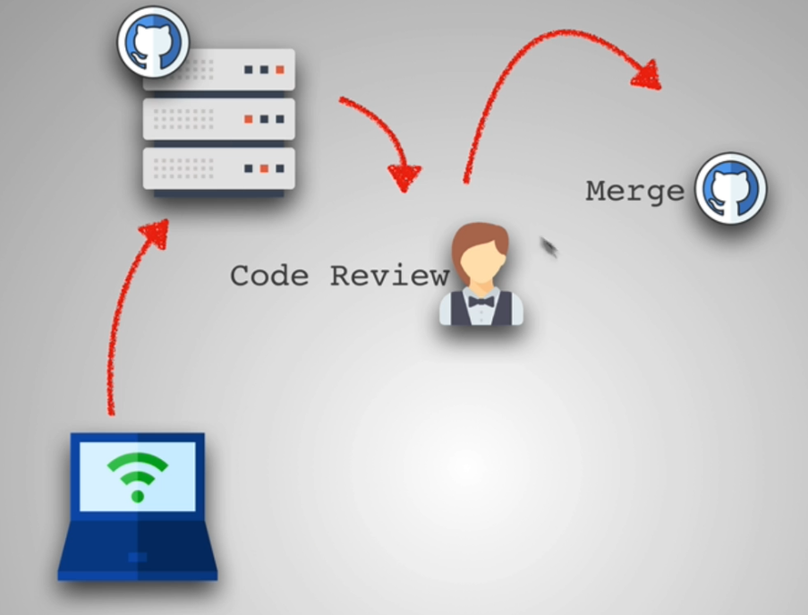
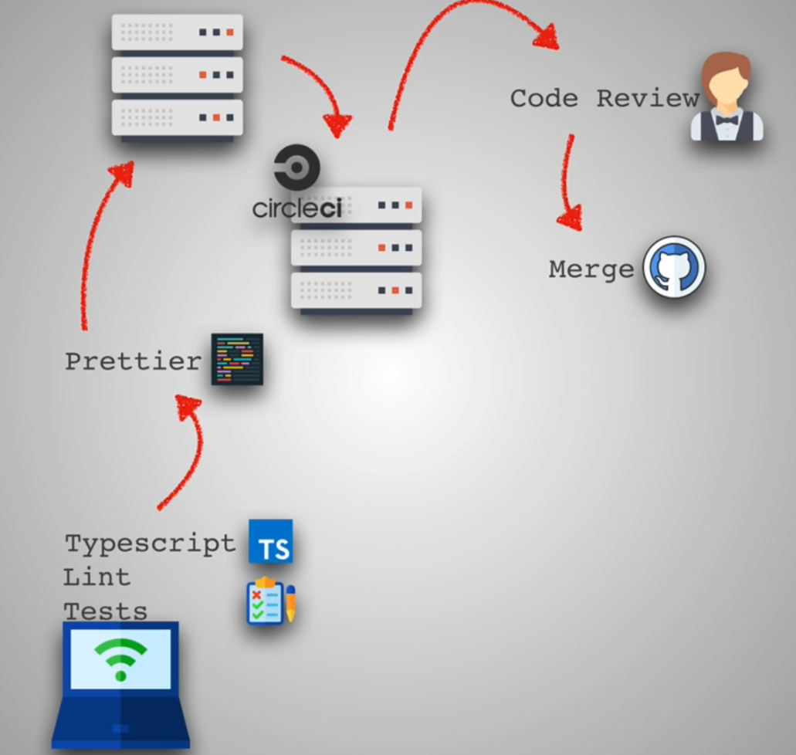
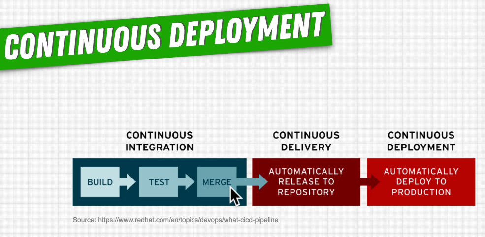

# INDEX

- [INDEX](#index)
  - [CI/CD](#cicd)
    - [Continuous Integration](#continuous-integration)
    - [Continuous Delivery](#continuous-delivery)
    - [Continuous Deployment](#continuous-deployment)
  - [Pipeline](#pipeline)
  - [Github Actions](#github-actions)

---

## CI/CD

CI/CD is the backbone of all modern software developments allowing organizations to develop and deploy software quickly and efficiently. It offers a unified platform to integrate all aspects of the SDLC, including separate tools and platforms from source control, testing tools to infrastructure modification, and monitoring tools.

A properly configured CI/CD pipeline allows organizations to adapt to changing consumer needs and technological innovations easily. In a traditional development strategy, fulfilling changes requested by clients or adapting new technology will be a long-winded process. Moreover, the consumer need may also have shifted when the organization tries to adapt to the change. Approaches like DevOps with CI/CD solve this issue as CI/CD pipelines are much more flexible.

- Without CI/CD
  
- With CI/CD
  

- Tools for CI/CD are just _Software as a Service_ (SaaS) tools that provide us with servers to run our tests and deploy our code based on the configuration we provide them. They are not a part of our codebase.
  - `Jenkins` (most popular)
  - `Travis CI`
  - `Circle CI`
  - `Gitlab CI`

---

### Continuous Integration

`Continuous Integration (CI)` is a development **practice** that requires developers to integrate code into a **shared repository** several times a day. Each check-in is then verified by an **automated build**, allowing teams to detect problems early.

> It’s important to note that `CI` is a **practice** and not a tool or a specific technology. It’s a set of practices that you can apply to your development process to make it more efficient.

- By integrating regularly, you can detect errors quickly, and locate them more easily.

- The integration happens after a `git push` usually to a `master branch`. Then, in a dedicated `server`, an automated process builds the application and runs a set of tests to confirm that the newest code integrates with what’s currently in the master branch.

- If you’re doing `CI` and for some reason the integration fails, that means the broken build becomes the highest priority to fix before continuing to add more features.

---

### Continuous Delivery

`Continuous Delivery` is a step beyond Continuous Integration. Not only is your application built and tested each time a code change is pushed to the codebase, the application is also deployed continuously. However, **with continuous delivery, you trigger the deployments manually**.

- It depends on the steps in the `Continuous Integration` pass and adds on the deployment step. So that we keep things ready to be deployed at any time.
- when everything is ready, the **deployment is triggered manually** after running some other tests.
- Continuous Delivery checks the code automatically, but it requires human intervention to manually and strategically trigger the deployment of the changes.
- It's suitable when you start doing small release batches and want to keep things ready to be deployed at any time. **(small incremental changes to the app which is easy to fix if anything goes wrong)**

---

### Continuous Deployment

`Continuous Deployment` is another step beyond Continuous Integration, similar to Continuous Delivery.

The difference is that instead of deploying your application manually, you set it to be **deployed automatically**. Human intervention is not required.

---

## Pipeline

`Pipeline`: A series of automated steps (Command-Line Interface commands) that simplify the testing, building, and deployment of code.

---

## Github Actions

- `ci.yml` file : contains configuration for the workflow
  - contains steps to be performed by the `Continuous Integration Server`

---
