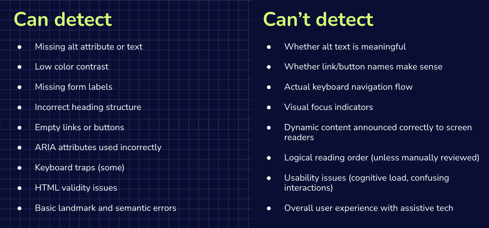
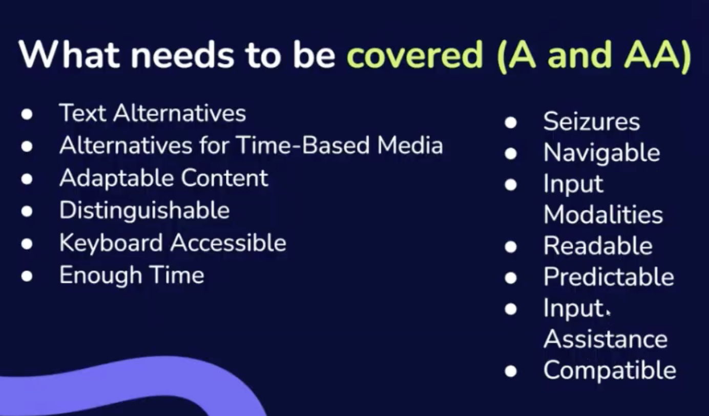
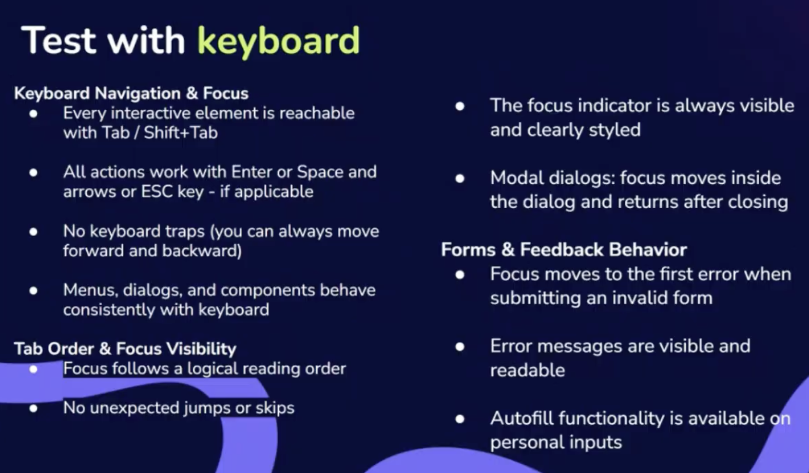
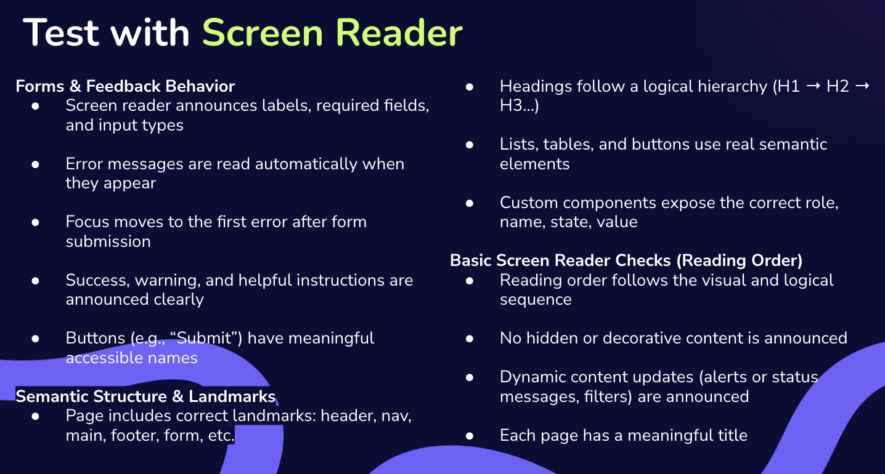

# INDEX

- [INDEX](#index)
  - [Accessibility Testing](#accessibility-testing)
    - [What should be tested in Accessibility Testing?](#what-should-be-tested-in-accessibility-testing)
    - [When do we test for accessibility?](#when-do-we-test-for-accessibility)
    - [How to test accessibility? (Types of Accessibility Testing)](#how-to-test-accessibility-types-of-accessibility-testing)
  - [Automated Accessibility Testing](#automated-accessibility-testing)
    - [How to read automated testing results?](#how-to-read-automated-testing-results)
  - [Manual Accessibility Testing](#manual-accessibility-testing)

---

## Accessibility Testing

Accessibility testing is a type of software testing that ensures that applications are usable by people with disabilities. This includes testing for compliance with accessibility standards such as the Web Content Accessibility Guidelines (WCAG) and the Americans with Disabilities Act (ADA).

---

### What should be tested in Accessibility Testing?

1. Evaluate digital products to ensure they are accessible to people with disabilities.
2. Use assistive technologies such as screen readers, keyboard navigation, and voice recognition software to test the accessibility of the application.
3. Check for compliance with accessibility standards such as WCAG and ADA.
4. Identify and fix any accessibility issues that may arise during testing.

---

### When do we test for accessibility?

Accessibility testing should be conducted throughout the development lifecycle of an application. It is important to test for accessibility early in the development process to identify and fix any issues before they become more difficult and costly to address later on. Accessibility testing should also be conducted regularly as the application evolves and new features are added to ensure that it remains accessible to all users.

- So after the design phase, we can start testing for accessibility. This allows us to identify any potential issues early on and make necessary adjustments before development begins. Additionally, it is important to continue testing for accessibility throughout the development process and after the application is released to ensure that it remains accessible to all users.
- **But keep in find the following:**
  - the compliance level required for the project (A, AA, AAA)
  - Who are the target users and their specific needs (all users? keyboard users? screen reader users? etc.)
  - Platforms requested (which OS? which devices? which browsers? etc.)
  - the resources available for testing (time, budget, tools, etc.)
  - Deadlines
    - Usually accessibility might be related to a lawsuit, so the deadline is the date of the lawsuit. But if there is no lawsuit, then the deadline can be set based on the project timeline and the resources available for testing.

---

### How to test accessibility? (Types of Accessibility Testing)

1. **Manual Testing**: This involves human testers who evaluate the application for accessibility issues. This can include testing with assistive technologies such as screen readers, keyboard navigation, and voice recognition software.
   - Needed for **100%** WCAG compliance, as some issues can only be detected through manual testing.
2. **Automated Testing**: This involves using tools to automatically check for accessibility issues in the code. Examples of automated testing tools include Axe, Lighthouse, and WAVE.
   - Tools capture up to **30%** of accessibility issues, so they should be used in conjunction with manual testing for comprehensive coverage.
3. **Hybrid Testing**: This combines both manual and automated testing to ensure comprehensive coverage of accessibility issues. Usually using **Browser extensions**.
4. **User Testing**: This involves testing the application with real users who have disabilities to gather feedback on the usability and accessibility of the application.

By conducting thorough accessibility testing, developers can ensure that their applications are inclusive and usable by all users, regardless of their abilities.

---

## Automated Accessibility Testing

- When doing automated accessibility testing, there are several ways to approach it:
  1. **Browser Extensions**: These are tools that can be added to web browsers to automatically check for accessibility issues on web pages. Examples include Axe, Lighthouse, and WAVE.
  2. **Command Line Tools**: These are tools that can be run from the command line to check for accessibility issues in code. Examples include **Pa11y** and **aXe CLI**.
  3. **Continuous Integration (CI) Tools**: These are tools that can be integrated into the development process to automatically check for accessibility issues during the build and deployment process. Examples include **Jenkins** and **CircleCI**.

By using automated accessibility testing tools, developers can quickly identify and fix accessibility issues in their applications, ensuring that they are inclusive and usable by all users. However, it is important to remember that automated testing should be used in conjunction with manual testing for comprehensive coverage of accessibility issues.

- common tools for automated accessibility testing:
  - [Axe DevTools](https://www.deque.com/axe/) ✅
    - **Recommended**
    - it works by scanning the web page for accessibility issues and provides detailed reports with suggestions for fixing them.
    - It reports 2 types of issues, automatic issues, and needs review.
    - 💡 Turn on the 'highlight' feature to visually see the issues on the page.
    - If you found that you have a lot of issues, try to toggle the "Best Practices: Off" button as it may help reduce noise in the report. and only show the critical issues.
    - Also you can control the WCAG standards that the tool checks against. (e.g., `WCAG 2.1`, `WCAG 2.0`)
  - [aXe CLI](https://www.npmjs.com/package/axe-cli)
  - [WebAIM - WAVE evaluation tool](https://wave.webaim.org/) ✅
    - **Recommended**
    - It provides visual feedback about the accessibility of your web content by overlaying icons and indicators directly on the page.
  - [Lighthouse](https://developers.google.com/web/tools/lighthouse)
  - [IBM Equal Access Accessibility Checker](https://www.ibm.com/able/toolkit/)
  - [Siteimprove Accessibility Checker](https://siteimprove.com/en-us/accessibility-checker/)
  - [ARC Toolkit](https://www.levelaccess.com/arc-toolkit/)
  - [Accessibility insights for web - Microsoft](https://accessibilityinsights.io/)
  - [Accessibility Scanner - Android](https://play.google.com/store/apps/details?id=com.google.android.apps.accessibility.auditor&hl=en&gl=US)
  - Color contrast tools:
    - [Contrast Checker - WebAIM](https://webaim.org/resources/contrastchecker/)
    - [Color Contrast Analyzer - TPGi](https://www.tpgi.com/color-contrast-checker/)
    - [Accessible Colors](https://accessible-colors.com/)
  - [Pa11y](https://pa11y.org/)

- Why automated testing is not enough?
  
  - Automated testing tools can only detect a limited percentage of accessibility issues, and they may not be able to identify issues that require human judgment or context. Therefore, it is important to use automated testing as a supplement to manual testing rather than relying on it exclusively for accessibility testing.

### How to read automated testing results?

- The report may include information about the severity of each issue, the location of the issue in the code, and recommendations for how to fix the issue.
- Look for error categories (e.g. contrast issues, missing alt text, etc.) and prioritize fixing the most critical issues first.
- **How to prioritize results**
  1. Critical blockers first:
     - keyboard traps, missing labels, empty buttons/links, low contrast, etc.
  2. High impact issues:
     - incorrect semantics that break screen readers, like using a `div` instead of a `button` for an interactive element, or using a `h1` tag for styling purposes instead of for its semantic meaning.
  3. Medium/low impact issues:
     - missing alt text for decorative images, or using color alone to convey information.
  4. Flag false-positives:
     - some issues may be flagged as errors by the automated testing tool, but upon review, they may not actually be accessibility issues. (common with ARIA attributes).
- Check affected elements to understand the context of the issue and how it may impact users with disabilities.
- Use the recommendations provided in the report to guide your efforts in fixing the identified accessibility issues. This may involve making changes to the code, adding alternative text for images, improving color contrast, or implementing keyboard navigation, among other adjustments to enhance accessibility.
- Not all errors will be valid issues, so it's important to review the results carefully and use your judgment to determine which issues need to be addressed based on the specific context of your application and its users.

---

## Manual Accessibility Testing

Manual accessibility testing involves evaluating a web application or website by manually interacting with it to identify accessibility issues that automated tools may not catch. This type of testing is essential for ensuring that all users, including those with disabilities, can effectively use the application.

> It's used because as discussed before: Automated testing tools don't catch all accessibility issues, especially those that require human judgment or context.

- Best practices:
  - Use a screen reader to navigate your application and ensure that all content is accessible.
  - Test keyboard navigation to ensure that all interactive elements can be accessed and operated using only the keyboard.
  - Check for sufficient color contrast to ensure that text is readable for users with visual impairments.
  - Ensure that all interactive elements have accessible names and roles, and that dynamic content updates are announced to screen readers.
  - Test with different assistive technologies to ensure compatibility and accessibility across various tools.

  

- Instructions:
  - **Make it easy to users to see the content separating foreground from background**
    - Text
      - Text should be easily resizable, test up to 200% for no loss of content
      - Ensure usage of actual text instead of images of text
    - Colors
      - Contrast ratio of text to background should be at least `4.5:1` for normal text and `3:1` for large text, preferable `7:1` for enhanced accessibility
        - Use tools like **WebAIM contrast checker**, **TPGI color contrast checker**
      - Don't use color alone to convey meaning (example: using red text to indicate an error, or background color to indicate selection) as it may not be perceivable by users with color vision deficiencies
        - Try to use both color indication and text labels or patterns to convey information
  - **Testing with keyboard**
    

  - **Testing with screen reader**
    
