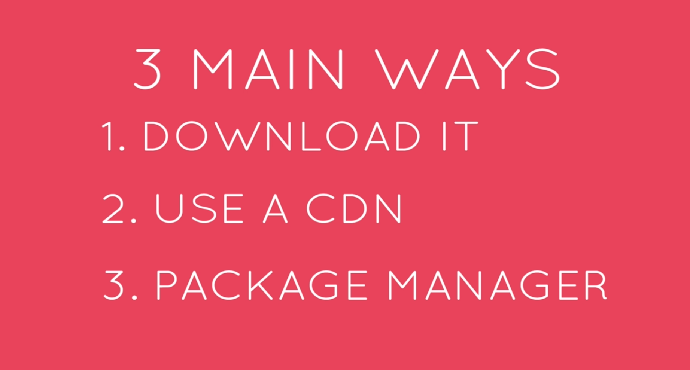
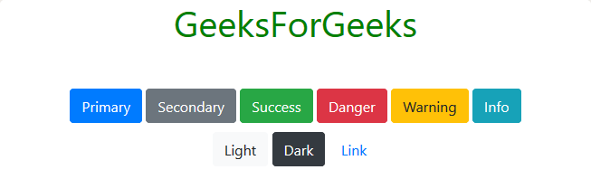

# INDEX

- [INDEX](#index)
  - [CSS Framework](#css-framework)
  - [Bootstrap](#bootstrap)
  - [Examples](#examples)
  - [Installation](#installation)
    - [Download Files](#download-files)
  - [Colors](#colors)
    - [Font Color](#font-color)
    - [Background Color](#background-color)
  - [Buttons](#buttons)
    - [Button size](#button-size)
  - [Typography](#typography)
    - [Headings](#headings)
    - [Text Alignment](#text-alignment)
  - [Jumbotron](#jumbotron)
  - [Layouts](#layouts)
    - [Breakpoints](#breakpoints)
      - [Display Utility](#display-utility)
    - [Container](#container)
    - [FlexBox](#flexbox)
    - [Grid System](#grid-system)
    - [Columns](#columns)
    - [Gutters (gaps)](#gutters-gaps)
  - [Box Model](#box-model)
    - [Borders](#borders)
    - [Margin \& Padding](#margin--padding)
  - [Forms](#forms)
  - [Navbar](#navbar)
  - [Javascript Components](#javascript-components)
    - [Alerts](#alerts)
    - [Other JS Components](#other-js-components)
  - [Customizing Bootstrap](#customizing-bootstrap)
    - [File structure](#file-structure)
    - [Importing](#importing)
  - [Notes](#notes)

---

## CSS Framework

A CSS framework is a library allowing for easier, more standards-compliant web design using the Cascading Style Sheets language. Most of these frameworks contain at least a grid. More functional frameworks also come with more features and additional JavaScript based functions, but are mostly design oriented and focused around interactive UI patterns. This detail differentiates CSS frameworks from other JavaScript frameworks.

- CSS frameworks offer different modules and tools:

  - reset style sheet
  - grid especially for responsive web design
  - web typography
  - set of icons in sprites or icon fonts
  - styling for tooltips, buttons, elements of forms
  - parts of graphical user interfaces like accordion, tabs, slideshow - or modal windows (Lightbox)
  - equalizer to create equal height content
  - often used CSS helper classes (left, hide)

---

## Bootstrap

- **The Good:**
  - Fast Development -> They provide code that you just don’t need to write from scratch every time, like `resets`.
  - Browser Compatibility -> They relieve cross-browser concerns.
  - It helps you build good habits.
    - Like including a print stylesheet in your projects.
  - Responsive Layouts -> They encourage grid based design.
    - Which is a good thing. Grids don’t mean boring! They just help you achieve better readability, scalability, balance visual weight, flexibility, expandability, and just overall page page cohesiveness.
  - They come with documentation.
- **The Bad:**
  - They can be bloat.
    - There may be CSS styles set up in a framework to accommodate tons of different layouts that you’ll never use. If you are concerned about every byte of a web page, you are going to end up doing a lot of stripping away of unused code, which ruins the point of the framework.
- Bootstrap 4 vs 3
  

---

## Examples

[Bootstrap 5 Interactive CheatSheet](https://bootstrap-cheatsheet.themeselection.com/)
[Bootstrap 5 Learning Kit](./Bootstrap-Learning%20Kit/index.html)

---

## Installation



### Download Files

- Compiled CSS and JS

  - ready-to-use compiled code to easily drop into the project.
  - usually use:
    - `bootstrap.min.css`
    - `bootstrap.bundle.min.js`

- Source files

  - Compiling Bootstrap with your own asset pipeline by downloading our source Sass, JavaScript, and documentation files. This option requires some additional tooling
  - here, we will need to manually select the files we want to copy to our project directory:
    - css folder has different `.css` files to choose from
    - js folder has different `.js` files to choose from
    - sass folder has different `.scss` files to choose from
  - ex:

    ```sh
    bootstrap/
    ├── dist/
    │   ├── css/
    │   └── js/
    ├── docs/
    │   └── examples/
    ├── js/
    └── scss/

    # ------------------------------------------------------------ #

    bootstrap/
    ├── css/
    │   ├── bootstrap.css
    │   ├── bootstrap.css.map
    │   ├── bootstrap.min.css
    │   ├── bootstrap.min.css.map
    │   ├── bootstrap-grid.css
    │   ├── bootstrap-grid.css.map
    │   ├── bootstrap-grid.min.css
    │   ├── bootstrap-grid.min.css.map
    │   ├── bootstrap-reboot.css
    │   ├── bootstrap-reboot.css.map
    │   ├── bootstrap-reboot.min.css
    │   └── bootstrap-reboot.min.css.map
    └── js/
        ├── bootstrap.bundle.js
        ├── bootstrap.bundle.min.js
        ├── bootstrap.js
        └── bootstrap.min.js
    ```

---

## Colors

### Font Color

- here colors-classes don't explicitly mention the color, but they mention the state, which then we can modify color for each state with utilities
  
- Ex:

  ```html
  <h1 class="text-primary"></h1>
  ```

---

### Background Color


---

## Buttons


Bootstrap includes several predefined styles, each serving its own semantic purpose, with a few extras thrown in for more control.

- these classes also work with `<a>` tags
- Ex:

  ```html
  <button class="btn btn-primary"></button>
  ```

### Button size

Add `.btn-lg` or `.btn-sm` for additional sizes.

```html
<button type="button" class="btn btn-primary btn-lg">Large button</button>
```

---

## Typography

### Headings

- Normal headings -> `h1` to `h6`

  ```html
  <h1>h1. Bootstrap heading</h1>
  <!-- Or -->
  <p class="h1">h1. Bootstrap heading</p>
  ```

- Display headings

  - Traditional heading elements are designed to work best in the meat of your page content. When you need a heading to stand out, consider using a display heading—a larger, slightly more opinionated heading style.

  ```html
  <h1 class="display-1">Display 1</h1>
  ```

### Text Alignment

Use text utilities as needed to change the alignment of your text.

```html
<p class="text-center">content</p>
```

---

## Jumbotron

Lightweight, flexible component for showcasing **hero** section unit style content.

```html
<div class="jumbotron">
  <h1 class="display-4">Hello, world!</h1>
  <p class="lead">
    This is a simple hero unit, a simple jumbotron-style component for calling extra attention to
    featured content or information.
  </p>
  <hr class="my-4" />
  <p>
    It uses utility classes for typography and spacing to space content out within the larger
    container.
  </p>
  <p class="lead">
    <a class="btn btn-primary btn-lg" href="#" role="button">Learn more</a>
  </p>
</div>
```

- To make the jumbotron full width, and without rounded corners, add the `.jumbotron-fluid` modifier class and add a `.container` or `.container-fluid` within.

---

## Layouts

### Breakpoints

Breakpoints are customizable widths that determine how your responsive layout behaves across device or viewport sizes in Bootstrap.

- Breakpoints are the building blocks of responsive design. Use them to control when your layout can be adapted at a particular viewport or device size.
- Use **media queries** to architect your CSS by breakpoint.
  - Media queries are a feature of CSS that allow you to conditionally apply styles based on a set of browser and operating system parameters.
  - We most commonly use `min-width` in our media queries.
- **Mobile first**, responsive design is the goal. Bootstrap’s CSS aims to apply the bare minimum of styles to make a layout work at the smallest breakpoint, and then layers on styles to adjust that design for larger devices.

  - This optimizes your CSS, improves rendering time, and provides a great experience for your visitors.

- Bootstrap is broken into 6 different breakpoints sometimes referred to as **"grid tiers"**, for building responsively.

  - These breakpoints can be customized if you’re using our source `Sass` files.

  
  

#### Display Utility

responsively toggle the display-value of components by changing the value of the `display` property with our responsive display utility classes

- `d-{value}` for `xs`
  - as the default value applies for all breakdown from `xa` and up
- `d-{breakpoint}-{value}` for `sm`:`xl`
- value is one of:
  - `none`
  - `inline`
  - `inline-block`
  - `block`
  - `table`
  - `table-cell`
  - `table-row`
  - `flex`
  - `inline-flex`
- EX:

  ```html
  <!-- sets "display: none;" on both lg and xl screens -->
  <div class="d-lg-none"></div>

  <!-- sets the display to `inline` for all screens -->
  <div class="d-inline"></div>
  <!-- same as: -->
  <div class="d-xs-inline"></div>
  ```

---

### Container

inside it you determine the `max-width`

- **fluid**: no max width -> will take `100%` of the width
  - ex: `class="container-fluid"`

### FlexBox

- to make something a add FlexBox to something, we use `d-flex`
- we can use variants of flex-directions, like: `flex-column`, `flex-row`, `flex-lg-row`

---

### Grid System

Bootstrap’s grid system uses a series of containers, rows, and columns to layout and align content. It’s built with **flexbox** and is fully responsive

- **Rules:**

  - the grid must be inside a component with `.container` class
  - any element with a `col` class must be in a element with `row` class

- There're 12 Columns in the grid-row
  - **One Row = 12 Units of space**
- 6 grid tiers based on minimum width
- You can use the number on the **row itself** and it will apply to all columns inside it
- You can nest a grid inside of a grid (row inside a row)

```html
<div class="container">
  <div class="row">
    <div class="col-sm">One of three columns</div>
    <div class="col-sm">One of three columns</div>
    <div class="col-sm">One of three columns</div>
  </div>
</div>
```

---

### Columns

- to make all columns have equal width, give them all the class `"col"`
- You can specify column's width by how many cols you want it to occupy out of the 12 columns

  - ex: `class="col-6"`

- you can **offset** the column by how many cols you want
  - ex: `class="col-3 offset-4"`
- `col` classes with device-infixes and numbers -> **Breakpoint & with of column**

  - if not specified the col takes `1fr` **(entire row)**
  - `"col-lg-3 col-md-6"`:
    - means that the column will take 3 spans on **large screens** and 6 spans on **medium screens** and entire row on screens lower than `md`

- Alignment, justify, wrapping, order, ...

  - you can use flexBox utilities on a (row as a flex-container) or a (col as a flex-item)

    ```html
    <div class="container">
      <div class="row align-items-start">
        <div class="col">One of three columns</div>
        <div class="col">One of three columns</div>
        <div class="col">One of three columns</div>
      </div>
    </div>
    <!--  OR -->
    <div class="container">
      <div class="row">
        <div class="col align-self-start">One of three columns</div>
        <div class="col align-self-center">One of three columns</div>
        <div class="col align-self-end">One of three columns</div>
      </div>
    </div>
    ```

### Gutters (gaps)

it goes from **1** (smallest) to **5** (biggest)

- `g`: for gap in both axises
- `gx`: column-gap (x-axis) -> ex; `class="gx-4"`
- `gy`: row-gap (y-axis)

---

## Box Model

### Borders

```html
<div class="border"></div>
<div class="border border-danger"></div>

<!-- correct -->
<div class="border border-bottom"></div>
<!-- wrong -->
<div class="border-bottom"></div>
```

### Margin & Padding

The classes are named using the format `{property}{sides}-{size}` for `xs` and `{property}{sides}-{breakpoint}-{size}` for `sm`, `md`, `lg`, `xl`, and `xxl`.

- Where property is one of:

  - `m` - for classes that set margin
  - `p` - for classes that set padding
    Where sides is one of:

  - `t` - for classes that set margin-top or padding-top
  - `b` - for classes that set margin-bottom or padding-bottom
  - `s` - (start) for classes that set margin-left or padding-left in LTR, margin-right or padding-right in RTL
  - `e` - (end) for classes that set margin-right or padding-right in LTR, margin-left or padding-left in RTL
  - `x` - for classes that set both `*-left` and `*-right`
  - `y` - for classes that set both `*-top` and `*-bottom`
  - `blank` - for classes that set a margin or padding on all 4 sides of the element

- Where size is one of:

  - > `$spacer` is **1 rem**
  - `0` - for classes that eliminate the margin or padding by setting it to `0`
  - `1` - (by default) for classes that set the margin or padding to `$spacer \* .25`
  - `2` - (by default) for classes that set the margin or padding to `$spacer \* .5`
  - `3` - (by default) for classes that set the margin or padding to `$spacer`
  - `4` - (by default) for classes that set the margin or padding to `$spacer \* 1.5`
  - `5` - (by default) for classes that set the margin or padding to `$spacer \* 3`
  - `auto` - for classes that set the margin to `auto`

```html
<div class="m-5"></div>
<div class="m-lg-5"></div>
<div class="p-5"></div>
```

---

## Forms

- form groups

  - it's used to group label with an input with proper margin, padding,...
  - it's applied to the main `<form>` element or in a `<div>` that contains input and label to group them together

- Form controls

  - Textual form controls—like `<input>`s, `<select>`s, and `<textarea>`s—are styled with the `.form-control` class. Included are styles for general appearance, focus state, sizing, and more.

```html
<form>
  <div class="form-group">
    <label for="exampleFormControlInput1">Email address</label>
    <input
      type="email"
      class="form-control"
      id="exampleFormControlInput1"
      placeholder="name@example.com"
    />
  </div>
  <div class="form-group">
    <label for="exampleFormControlSelect1">Example select</label>
    <select class="form-control" id="exampleFormControlSelect1">
      <option>1</option>
      <option>2</option>
    </select>
  </div>
  <div class="form-group">
    <label for="exampleFormControlTextarea1">Example textarea</label>
    <textarea class="form-control" id="exampleFormControlTextarea1" rows="3"></textarea>
  </div>
</form>
```

---

## Navbar

It's one of the most used components in Bootstrap, but note that its markup is cluttered and you may copy & paste it from the [Docs](https://getbootstrap.com/docs/4.0/components/navbar/) then modify it as you want

- for toggler button, you have to provide these attributes: `data-toggle="collapse" data-target="#navbarSupportedContent"`, specially the `data-target` that needs to match the **id** of the collapsible component with contains the `nav`
- navbar-sticky vs navbar-fixed
  - sticky: has offset, that when it reach the specified position, then it stays fixed
  - fixed: is fixed from the beginning regarding the position

---

## Javascript Components

The idea here, is to interact with components like an `alert` component

- we usually assign a `role` attribute to the element that will be interacted by using bootstrap

### Alerts

Provide contextual feedback messages for typical user actions with the handful of available and flexible alert messages.

- **Normal (fixed) Alerts**

  ```html
  <div class="alert alert-success" role="alert">
    <h4 class="alert-heading">Well done!</h4>
    <p>
      Aww yeah, you successfully read this important alert message. This example text is going to
      run a bit longer so that you can see how spacing within an alert works with this kind of
      content.
    </p>
    <hr />
    <p class="mb-0">
      Whenever you need to, be sure to use margin utilities to keep things nice and tidy.
    </p>
  </div>
  ```

- **Dismissing Alerts**

  - Add a dismiss button and the `.alert-dismissible` class, which adds extra padding to the right of the alert and positions the `.close` button.
  - On the dismiss button, add the `data-dismiss="alert"` attribute, which triggers the JavaScript functionality. Be sure to use the `<button>` element with it for proper behavior across all devices.
  - To animate alerts when dismissing them, be sure to add the `.fade` and `.show` classes.

  ```html
  <div class="alert alert-warning alert-dismissible fade show" role="alert">
    <strong>Holy guacamole!</strong>
    You should check in on some of those fields below.
    <button type="button" class="close" data-dismiss="alert" aria-label="Close">
      <span aria-hidden="true">&times;</span>
    </button>
  </div>
  ```

---

### Other JS Components

- Usually in old versions, these components require activation using Jquery in the `<script></script>` tags:

  ```html
  <script>
    // Example: Enable popovers everywhere
    // initialize all popovers on a page would be to select them by their data-toggle attribute:
    $(function () {
      $('[data-toggle="popover"]').popover();
    });
  </script>
  ```

- [Tooltips](https://getbootstrap.com/docs/4.0/components/tooltips/)
- [Popovers](https://getbootstrap.com/docs/4.0/components/popovers/)
- [Dropdown](https://getbootstrap.com/docs/4.0/components/dropdowns/)
- [Collapse & Accordion](https://getbootstrap.com/docs/4.0/components/collapse/)
- [Modal](https://getbootstrap.com/docs/4.0/components/modal/)
- [Carousel](https://getbootstrap.com/docs/4.0/components/carousel/)

---

## Customizing Bootstrap

### File structure

Whenever possible, avoid modifying Bootstrap’s core files (in `node_modules` or downloaded manually). For Sass, that means creating your own stylesheet that imports Bootstrap so you can modify and extend it. Assuming you’re using a package manager like npm, you’ll have a file structure that looks like this:

```sh
# with a package manager
your-project/
├── scss
│   └── custom.scss
└── node_modules/
    └── bootstrap
        ├── js
        └── scss

# with downloaded source files
your-project/
├── scss
│   └── custom.scss
└── bootstrap/
    ├── js
    └── scss
```

### Importing

- In your `custom.scss` file, you’ll import Bootstrap’s source Sass files. You have two options:
  - include all of Bootstrap,
  - or pick the parts you need.
  - It's encouraged to use the latter, though be aware there are some requirements and dependencies across our components. You also will need to include some JavaScript for our plugins.

```scss
// Custom.scss

// Option A: Include all of Bootstrap
@import '../node_modules/bootstrap/scss/bootstrap';
// Then add additional custom code here

//--------------------------------------------------------//
// Option B: Include parts of Bootstrap
// 1. Include functions first (so you can manipulate colors, SVGs, calc, etc)
@import '../node_modules/bootstrap/scss/functions';
// 2. Include any default variable overrides here
// 3. Include remainder of required Bootstrap stylesheets
@import '../node_modules/bootstrap/scss/variables';
// 4. Include any optional Bootstrap components as you like
@import '../node_modules/bootstrap/scss/root';
@import '../node_modules/bootstrap/scss/images';
@import '../node_modules/bootstrap/scss/containers';
@import '../node_modules/bootstrap/scss/grid';
// 5. Add additional custom code here
```

You can find more Here: [Bootstrap-customize-sass](https://getbootstrap.com/docs/5.0/customize/sass/)

---

## Notes

- remember that whenever you want to use a utility-modifier to a class, we need to use the class in combination with the modifier

  ```html
  <!-- Wrong -->
  <div class="container-fluid"></div>

  <!-- correct -->
  <div class="container container-fluid"></div>
  ```
