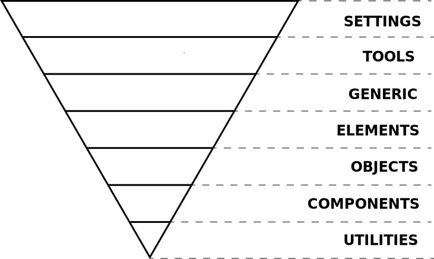

# INDEX

- [INDEX](#index)
  - [CSS Methodologies](#css-methodologies)
  - [Object-Oriented CSS (OOCSS)](#object-oriented-css-oocss)
    - [OOCSS Example](#oocss-example)
  - [Block Element Modifier (BEM)](#block-element-modifier-bem)
    - [Block](#block)
    - [Element](#element)
    - [Modifier](#modifier)
    - [BEM file structure](#bem-file-structure)
    - [BEM Notes](#bem-notes)
  - [Scalable and Modular Architecture for CSS (SMACSS)](#scalable-and-modular-architecture-for-css-smacss)
    - [SMACSS Categories](#smacss-categories)
      - [Base](#base)
      - [Layout](#layout)
      - [Modules](#modules)
        - [module variations](#module-variations)
      - [State](#state)
      - [Themes](#themes)
    - [SMACSS Notes](#smacss-notes)
  - [Naming convention](#naming-convention)
    - [ITCSS](#itcss)
    - [BEMIT](#bemit)
      - [Responsive Suffixes](#responsive-suffixes)

---

## CSS Methodologies

CSS is notoriously difficult to manage in large, complex, rapidly-iterated systems. One reason is **CSS lacks a built-in scoping mechanism**. Everything in CSS is global.

- That means any change you make has the potential to cascade and alter the presentation of unrelated bits of the UI. Extended CSS languages, a.k.a. **CSS preprocessors**, such as `Sass`, `Less` and `Stylus` make things a little easier by offering up features that make writing CSS easier.

- But even these extended CSS languages, don’t truly fix the scalability issue. Until CSS gets its own native scoping mechanism, we need to devise our own system for locking down styles to specific sections of an HTML document. **CSS methodologies** are the solution

> **CSS methodologies** are formal, documented systems for authoring CSS in a way that allows us to develop, maintain and scale the front-end as a set of small, isolated modules. Rather than as one massive lump of indivisible code.

- A CSS methodology will often define guidelines for:

  - `CSS and HTML best practices`
  - `Class- and ID-naming conventions`
  - `Ordering and grouping of CSS style rules`
  - `Code formatting`

- There is no “best” CSS methodology. Different approaches work better for different individuals/teams/projects.
- All CSS methodologies tackle the scalability and maintainability problem in CSS by providing a class-based system for breaking up big web designs into lots of small, modular, discrete units. Each UI module can be reused over and over throughout a design, and even ported from one project to another if two projects share the same CSS methodology.

CSS Methodologies:

[Object-Oriented CSS (OOCSS)](#object-oriented-css-oocss)
[Block, Element, Modifier (BEM)](#block-element-modifier-bem)
[Scalable and Modular Architecture for CSS (SMACSS)](#scalable-and-modular-architecture-for-css-smacss)

---

## Object-Oriented CSS (OOCSS)

One goal of the OOCSS methodology is to reduce duplication of the same properties throughout your various style rules. In other words, OOCSS can help us maintain **DRY** stylesheets. The methodology attempts to achieve this goal by using lots of small, modular, specialist CSS classes.

> The great thing about the OOCSS methodology is it urges authors to make the most of CSS’s cascading behavior, rather than trying to lock it up with high-specificity selectors.


- OOCSS advocates the separation of structure from skin.
  
  - **structure**: instructions for element size and position (how things are laid out) (`margin`, `padding`, `width`, `height`)
  - **skin**: the visual properties elements (what layout look like) (`color`, `font`, `shadows`, `gradient`)
- The methodology makes a clear distinction between **content** and its **containers**.
  - it states that no matter where you put your element with the class it's going to look the same
  - The use of descendant selectors is discouraged.
    - This way, the presentation of your HTML elements is never dependent upon them being used in a specific context or DOM structure.
- A css **"object"** refers to a repeating visual pattern that can be abstracted into an independent object
- In OOCSS, style rules are written exclusively using CSS **class selectors**.
  - Very few style properties are applied via type selectors (e.g. `h1`, `div` and `body`).
- **Pros**: (reusable, readable, maintainable)
- The main **downside** of OOCSS is that you can end up with an awful lot of classes. Which can be difficult to maintain and manage.

---

### OOCSS Example

- to give the first list item of an unordered list element a different color:

  - instead of this:

    ```html
    <ul class="to-do">
      <li>Combine my CSS files</li>
      <li>Run CSS Lint</li>
      <li>Minify my stylesheet</li>
    </ul>
    ```

    ```css
    .to-do {
      color: #fff;
      background-color: #000;
    }
    .to-do li:first-child {
      color: #ff0000;
    }
    ```

  - we do this:

    ```html
    <!-- OOCSS -->
    <ul class="to-do">
      <li class="first-to-do-item">Combine my CSS files</li>
      <li>Run CSS Lint</li>
      <li>Minify my stylesheet</li>
    </ul>
    ```

    ```css
    /* OOCSS */
    .to-do {
      color: #fff;
      background-color: #000;
    }
    .first-to-do-item {
      color: #ff0000;
    }
    ```

---

## Block Element Modifier (BEM)

**BEM** stands for **"Block Element Modifier"**. It is a naming convention (**CSS class-naming system**) for classes in HTML and CSS.

The idea behind it is to divide the user interface into independent blocks. This is done by differentiating CSS classes that fulfill different roles. This is done by naming CSS classes in a way that indicates their role. It provides a rather strict way to arrange your CSS classes into independent modules.

> BEM complements **OOCSS** because OOCSS doesn’t impose any particular class-naming convention.


```css
.block {
}

.block__element {
}

.block--modifier {
}

.block__element--modifier {
}
```


### Block

- Describes its purpose ("What is it?" — `menu` or `button`), not its state ("What does it look like?" — `red` or `big`).

  ```html
  <!-- Correct. The `error` block is semantically meaningful -->
  <div class="error"></div>

  <!-- Incorrect. It describes the appearance -->
  <div class="red-text"></div>
  ```

- It is an independent (stand alone entity and meaningful on its own), modular UI component.
- A block may be composed of multiple HTML elements, or even multiple blocks.
  - Blocks can be nested in each other.
- You also shouldn't use CSS `tag` or `ID` selectors when using BEM.

---

### Element

- is a component within the block that performs a particular function. and it has no standalone meaning and is semantically tied to its block. It should only make sense in the context of its block.

  ```html
  <!-- `search-form` block -->
  <form class="search-form">
    <!-- `input` element in the `search-form` block -->
    <input class="search-form__input" />

    <!-- `button` element in the `search-form` block -->
    <button class="search-form__button">Search</button>
  </form>
  ```

- **Nesting:** Elements can be nested inside each other. An element is always part of a block, not another element. This means that element names can't define a hierarchy such as `block__elem1__elem2`

  ```html
  <!-- Correct ✅ -->
  <form class="search-form">
    <div class="search-form__content">
      <input class="search-form__input" />

      <button class="search-form__button">Search</button>
    </div>
  </form>

  <!-- Incorrect ❌ -->
  <form class="search-form">
    <div class="search-form__content">
      <!-- Recommended: `search-form__input` or `search-form__content-input` -->
      <input class="search-form__content__input" />

      <!-- Recommended: `search-form__button` or `search-form__content-button` -->
      <button class="search-form__content__button">Search</button>
    </div>
  </form>
  ```

- **Membership:** An element is always part of a block, and you shouldn't use it separately from the block.

  ```html
  <!-- Correct ✅ -->
  <form class="search-form">
    <input class="search-form__input" />
  </form>

  <!-- Incorrect ❌ -->
  <form class="search-form"></form>
  <input class="search-form__input" />
  ```

- **Optionality:** An element is an optional block component. Not all blocks have elements.

---

### Modifier

- It's an entity that defines the appearance, state, or behavior of a block or element.

  - appearance -> (what size? or which theme)
  - state -> (How does it look in a particular state? Is it hidden? Is it expanded? Is it marked as important?)
  - behavior -> (How does it behave? Is it interactive? Is it draggable? Is it droppable?)

- Types of modifiers:

  - **Boolean:** used when only the presence or absence of a feature is important, and the value is irrelevant. if a boolean modifier is present, its value is assumed to be `true`.

    ```html
    <!-- Correct ✅ -->
    <button class="button button--disabled">...</button>
    <!-- Incorrect ❌ -->
    <button class="button button--disabled-true">...</button>
    ```

  - **Key-value:** used when the modifier value is important. The value can be anything: a number, a string, a color, a boolean, etc.

    - Structure:
      - `block-name--modifier-name_modifier-value`
      - `block-name__element-name--modifier-name_modifier-value`

    ```html
    <!-- Correct ✅ -->
    <button class="button button--size_large">...</button>
    <!-- Incorrect ❌ -->
    <button class="button button--large">...</button>
    ```

- A modifier can't be used alone

  - It can't be used in isolation from the block or element that it modifies. It should change the appearance, state, or behavior of the block or element, not replace it.

---

### BEM file structure

- **BEM** is a naming convention, not a file structure. You can use it with any file structure you like. but if you want to adopt the **component-approach** also in the file structure, you can apply it like this:

  - A single block corresponds to a single file/directory, and named like the block. (e.g. `header/`).
  - Names of element directories/files are prefixed with double underscore (`__`) (e.g. `header/__logo/`).
  - Names of modifier directories/files are prefixed with single underscore (`_`) (e.g. `header/_color/`).

- EX:

  ```sh
  # File structure
  ├── header/
  │   ├── header.css
  │   ├── __logo/
  │   │   ├── header__logo.css
  │   │   ├── header__logo.png
  │   │   └──
  │   └── _color/
  │       ├── header_color_red.css
  │       ├── header_color_green.css
  │
  └──
  ```

---

### BEM Notes

- `BEM` is great for making code maintainable and modular, this is because it depends on selecting an element using one class selector only, which means:

  - lower specificity -> easier to override & maintain

- `BEM` helps us avoid **nesting**

  - in BEM, **everything is a class and nothing is nested**. That makes CSS specificity very flat and low
  - BEM is a good way to build UI. The descriptive, sometimes long, class names are good for understanding straight away where this class/selector sits within your UI architecture. It also means you rarely need to nest selectors, a common downfall with Sass codebases. Usually when I’m nesting with BEM is when I want to target an element via HTML tag name, or to win a specificity battle when components styling overlaps.
  - also it proviedes more code-readability than nesting

  ```css
  /* instead of this */
  .loginform .username .error {
    color: red;
  }

  /* Do this (with a single class selector) */
  .loginform__username--error {
    color: red;
  }
  ```

- **Should I create a block or an element?**

  - Create a block if a section of code might be reused and works on its own.
  - Create an element if a section of code is tied to a parent block and can’t be used on its own.

- **Sass and BEM**: For those of you writing Sass and enjoy nesting as a way of scoping styles, you can still author in a nested format, but get CSS that isn’t nested, with `@at-root`

  ```scss
  .block {
    @at-root #{&}__element {
    }
    @at-root #{&}--modifier {
    }
  }

  // gets you:
  .block {
  }
  .block__element {
  }
  .block--modifier {
  }
  ```

- A couple of subjective criticisms against BEM are:
  - The class names can end up being long and ugly
  - The naming convention is not intuitive to inexperienced developers
- this is a great cheat-sheet if you are not sure what class name you should use using BEM -> [bem-cheat-sheet](https://9elements.com/bem-cheat-sheet/)

---

## Scalable and Modular Architecture for CSS (SMACSS)

> it's pronounced: **smacks**

**SMACSS** is a CSS framework. it is more like a “**style guide**” than a rigid CSS framework. It focuses on five categories for its rules

- SMACSS is about:
  - categorization ->
    - [SMACSS Categories](#smacss-categories)
      - every style we write serves one of these purposes whether we're aware of it or not
    - isolating code allow for easier `reuse`, `testing` and `debugging`
  - naming convention
    - `modules` & `sub-modules`
  - decoupling `css` from `html`
    - only apply the styles you want to specific elements and not keeping it generalized to avoid cleaning up later and trying to undo the style effect for an element to apply new styles
    - this is done as the `html` code usually isn't predictable (we aren't sure that the content won't change)
    - **reduce the depth (depth applicability)** to only affect things that we want them to and to understand what html-elements will be affected by the class:
      - use fewer selectors, preferably one
      - use child selectors to limit depth or use `direct-descendent selector`
  - state-based design
    - things that indicate presentation
    - `classes`, `pseudo-classes -> (hover)` , `attribute selectors`
    - `media queries`

---

### SMACSS Categories

#### Base

Style rules that sets the default CSS properties of individual HTML elements. These are typically **CSS type selectors** like `html`, `body`, `a`, a`:hover`. This includes your CSS resets and would often be in its own base CSS file or at the start of your main CSS.

- Element selectors
- Css resets
- Normalize

#### Layout

Style rules that are related to the structural layout of web pages. it divides a page into sections with elements like `header`, `footer`, and `article` and also `Containers`, the `grid`, etc.

- They are prefixed with `layout-` or `l-`
  

- Major containing elements
- Grid systems
- summary -> it's how do you group your content?

  ```css
  .layout-constrained {
    width: 760px;
  }
  .layout-highlight {
    background-color: #ccc;
  }
  .layout-sidebar {
    width: 320px;
  }
  .l-comments {
    width: 640px;
  }
  ```

#### Modules

Modular, reusable components in the design, **the majority of your elements** and thus doesn't require that you prefix them but you could do so if you choose.

- it's everything else other than the first 2 categories
- Modules are given their own unique class names. Sub-components and variations are prefixed with the name of their parent module.
- Contained content (isolated modules from each other)
  - prevent styles from coming in or out
- majority of your site

  ```css
  .call-to-action-button {
    text-transform: uppercase;
    color: #fff200;
  }
  .search-form {
    display: inline-block;
    background-color: E1E1E1;
  }
  ```

- elements that you might think that they should be categorized as `base` but they should be `modules`:
  - `<button>`
  - `<table>`
  - `<input>`
  - the reason why is that we want `base` styles to be lightweight and not crowded with properties like in `modules`, which these elements usually require

##### module variations


- they're **Child elements** (sub-modules) in SMACSS (like what an “element” is to a “block” in BEM) have the parent item prefixed with a **dash**. e.g. `menu` and `menu-item`.
- always when seeing `sub-module` class, you will know that there's a `root-module` up there in the DOM. so we then have more code-readability

  ```css
  /* examples */

  /* root-module */
  .btn {
  }
  /* sub-module (module variations) */
  .btn-large {
  }
  /* sub-module (module variations) */
  .btn-search {
  }
  ```

- You can use other alternatives like **BEM**
  

#### State

Style rules that specify the current state of something in the interface. It is used for the variations possible for each element (e.g. `active`, `inactive`, `expanded`, `hidden`).

- These are **prefixed** with `is-`, e.g. `is-active`, `is-inactive`, `is-expanded`, `is-hidden` or are via pseudo-classes such as `:hover` and `:focus` or `media queries`.

- `is-` prefix indicates:

  - likelihood of **javascript dependency**
  - a togglable state

  ```css
  .is-hidden {
    display: none;
  }
  ```

#### Themes

is similar to state but defines **how modules and layouts will look**.

- They are style rules that affect layout and modules, triggered by user preferences/actions/viewing contexts.
- They are more applicable for larger sites with shared elements that look different throughout. You would add theme variations on a per page or per section basis.
- ex: `fonts`, `color`

  ```css
  .theme-header {
    /* not ".theme-red" */
    color: red;
  }
  .theme-border {
  }
  .theme-background {
  }

  .text-xl {
    font-size: 140%;
  }
  .text-s {
    font-size: 90%;
  }
  ```

- only for on-the-fly changes (like displaying chinese language)
- usually aren't needed

---

### SMACSS Notes

- you may find a file called `shame.css`:
  - which says: "here we have some **custom-classes** this doesn't belong here and we need to clean this once we finish and put these custom classes where they belong"
  - it should be **Temporary**

---

## Naming convention

### ITCSS

TCSS stands for **Inverted Triangle CSS**. It helps you organize your project CSS files/folders in such a way that you can better deal with CSS specifics like global namespace, cascade and selectors specificity.

The main idea of ITCSS is that it separates your CSS codebase into several sections (called layers), which can be represented as sections of an inverted triangle:




- **Settings** – used with general preprocessors and contain `font`, `colors` definitions, etc.
- **Tools** – globally used `mixins`, `functions`, `grids`, `display`.
- **Generic** – `reset` and/or `normalize styles`, `box-sizing` definition, etc. This is the first layer which generates actual CSS.
  - this can be also for **base**
- **Elements** – styling for `bare HTML elements` (like H1, A, etc.).
- **Objects** – `class-based selectors` which define undecorated design patterns
  - for example the media object (**Media Query**) known from `OOCSS`
  - it's for things like `circle`, `border-wrapper`, `date`, `cursor`, `icons`, `pop-up window`, and other things that aren't components
  - here we use `o` in the beginning of class-name
- **Components** – specific `UI components`. This is where most of our work takes place. We often compose UI components of Objects and Components
  - EX: analytic-chart component
  - here we use `c` in the beginning of class-name
- **Utilities or trumps** – utilities and helper classes with ability to **override** anything which goes before in the triangle, `e.g. hide helper class`
  - here we use `u` in the beginning of class-name
  - they use `!important` to override

---

### BEMIT

> The one thing missing from BEM is that it only tells us what classes to in relative terms, as in, how classes are related to each other. They don't really give us any idea of how things behave, act, or should be implemented in a global and non-relative sense.

Use the **BEMIT** naming convention, especially its Namespaces (`.c-user`, `.o-media`, etc.). This will allow you to focus on solving front-end challenges rather than thinking up style names and their location.

The most common types of namespace are

- `c-` for Components
- `o-` for Objects
- `u-` for Utilities
- `is-` / `has-` for States

```html
<!-------------------------- Example -------------------------->
<div class="o-media  c-user  c-user--premium">
  
  <p class="o-media__body  c-user__bio">...</p>
</div>
```

---

#### Responsive Suffixes

The next thing **BEMIT** adds to traditional BEM naming is responsive suffixes. These suffixes take the format ( `@<breakpoint>` ), and tell us this class when at this size:

```html
<!-------------------------- Example -------------------------->
<div class="o-media@md  c-user  c-user--premium">
  
  <p class="o-media__body@md  c-user__bio">...</p>
</div>
```

- Examples
  - `u-hidden@print` – a utility class to hide things when in print context.
  - `u-1/4@lg` – a utility to make something a quarter width in the large breakpoint.
  - `o-layout@md` – a layout object in the medium breakpoint.

> **NOTE**:
>
> - You have to escape the `@` symbol in your CSS file, like so:
>
> ```css
> @media print {
>   .u-hidden\@print {
>     display: none;
>   }
> }
> ```

---
