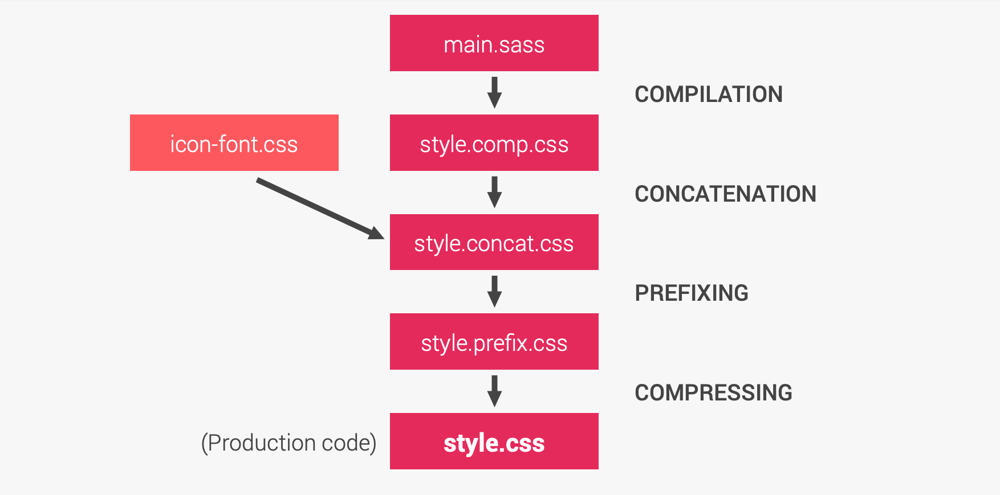

# INDEX

- [INDEX](#index)
  - [CSS Preprocessors](#css-preprocessors)
    - [Reasons to use a CSS Preprocessor](#reasons-to-use-a-css-preprocessor)
    - [The Value and Limitations of Preprocessors](#the-value-and-limitations-of-preprocessors)
  - [SASS vs Less vs Stylus](#sass-vs-less-vs-stylus)
  - [CSS Build Process](#css-build-process)
    - [Compilation](#compilation)
    - [Concatenation](#concatenation)
    - [Prefixing](#prefixing)
    - [Compressing / Minification](#compressing--minification)
    - [Full build process example](#full-build-process-example)

---

## CSS Preprocessors

A CSS preprocessor is a scripting language that extends CSS and **compile** the code which is written using a special compiler. They then use that to create a CSS file, which can then be referenced by the main HTML document

> It's called "pre"-processor because it does its work **before** the CSS is actually used on a website.

- It means whatever you write in the preprocessor language will be compiled into normal CSS.
  

- When using any CSS Preprocessor, you will be able to program in normal CSS just as you would if the preprocessor were not in place. The good thing is you also have more options available to you.
  - Some, such as `SASS`, has specific style standards which are meant make the writing of the document even easier, and using some useful features like:
    - Variables
    - Loops
    - If/Else Statements
    - mixins
    - nesting
    - importing
    - use logic and write less code
- There are three main preprocessors – `Sass`, `LESS` and `Stylus`

---

### Reasons to use a CSS Preprocessor

- It will make your code **faster to build** and **easier to maintain**
  - `variables`, `mixins` and `functions` that are declared at the beginning of the document which will make simple changes, like a color, easier to maintain.
- It will make your CSS **DRY**
- It will make your CSS more organized
  - nested definitions. This is an excellent feature and keeps things organized
- It will add stuff that should have been there. Like **variables** and **mixins**.

---

### The Value and Limitations of Preprocessors

Most CSS developers are familiar with preprocessors. Tools including `Sass`, `Less`, and `Stylus` introduced concepts such as file partials, nesting, variables, and mixins. Some features are gradually appearing in native CSS, but a preprocessor is still useful for managing large codebases and maintaining style and coding consistency.

- It may be difficult to imagine life without a CSS preprocessor, but there are downsides:
  - **Preprocessors are not extendable or limitable**.
    - Most preprocessors are a black box which provide you a specific set of supported features. It may be possible to write custom functions, but functionality beyond the scope of that tool is remains impossible — such as inlining an SVG as a background image.
    - Similarly, you can’t stop developers using options you’d rather avoid such as @extend or deep nesting. Linting can help, but it won’t stop the preprocessor compiling a valid file.
  - **Preprocessors provide their own syntax**
    - Preprocessor code may resemble CSS, but no browser can parse the file natively. The syntax is different and, if your tool changes or is unavailable, your code will require updates to make it usable.

---

## SASS vs Less vs Stylus

- **Sass**

  - It was built on `Ruby` and has frameworks like `Gumby` and Foundation. Sass also has great mixin libraries

- **Less**

  - It runs inside `Node.js`, in the browser.
  - The main difference between `LESS` and other CSS preprocessors is that `LESS` allows **real-time compilation** via `less.js` in the browser.

- Stylus
  - It is built on `node.js`, `Stylus` really strips down all of the extra characters that clog up your CSS. `Stylus` allows freedom in terms of syntax – you can omit braces, semicolons and even colons. Stylus incorporates powerful in-language functions and conditionals.

---

## CSS Build Process

**CSS Build Process** is a process of transforming the source code of a CSS preprocessor into a final CSS file that a browser can understand.


- It's a sequence of tasks that are performed to convert the source code of a CSS preprocessor into a final CSS file that a browser can understand.

### Compilation

It's the process of converting the source code of a CSS preprocessor into a final CSS file that a browser can understand.

- ex: `main.sass` -> `main.css`
- Compilation can be done in two ways:

  - **Server-side compilation**

    - The compilation is done on the server-side before the final CSS file is sent to the browser.
    - It's the most common way of compiling CSS preprocessors.
    - It's done using a build tool like `Gulp`, `Grunt`, or `Webpack`, or `node-sass` package.

    ```json
    {
      "scripts": {
        // using node-sass package
        "build:css": "node-sass --output-style compressed -o dist src",
        // using webpack
        "build:css": "webpack --config webpack.config.js"
      }
    }
    ```

    ```js
    // webpack.config.js
    module.exports = {
      module: {
        rules: [
          {
            test: /\.s[ac]ss$/i,
            use: ['style-loader', 'css-loader', 'sass-loader']
          }
        ]
      }
    };
    ```

  - **Client-side compilation**
    - The compilation is done on the client-side by the browser.
    - It's not recommended for production because it can slow down the page load time.

---

### Concatenation

It's the process of combining multiple CSS files into a single CSS file.

- It's done to reduce the number of HTTP requests made by the browser to fetch CSS files.

- It can be done using a package like `merge-css` or `concat`:

  ```json
  {
    "scripts": {
      // using merge-css package
      "build:css": "merge-css -o dist/main.css src/main.scss src/variables.scss",
      // using concat package
      "build:css": "concat -o dist/main.css src/main.scss src/variables.scss"
    }
  }
  ```

- Or by using a build tool like `Webpack`.

  ```json
  {
    "scripts": {
      // using webpack
      "build:css": "webpack --config webpack.config.js"
    }
  }
  ```

  ```js
  // webpack.config.js
  module.exports = {
    module: {
      rules: [
        {
          test: /\.s[ac]ss$/i,
          // concatenate multiple CSS files into a single CSS file
          use: [MergePlugin.loader, 'css-loader', 'sass-loader']
        }
      ]
    },
    plugins: [
      new MergePlugin({
        files: {
          'main.css': ['./src/main.scss', './src/variables.scss'] // concatenate main.scss and variables.scss into main.css
        }
      })
    ]
  };
  ```

---

### Prefixing

It's the process of adding vendor prefixes to CSS properties to ensure that the CSS code works across different browsers.

- It's done using a build tool like `Autoprefixer`.

  ```json
  {
    "scripts": {
      // using autoprefixer
      "build:css": "autoprefixer -b 'last 2 versions' dist/main.css -o dist/main.css"
    }
  }
  ```

- Or it can be done using a build tool like `Webpack`.

  ```js
  // webpack.config.js
  module.exports = {
    module: {
      rules: [
        {
          test: /\.s[ac]ss$/i,
          use: ['style-loader', 'css-loader', 'sass-loader']
        }
      ]
    },
    plugins: [
      new AutoprefixerPlugin({
        browsers: ['last 2 versions']
      })
    ]
  };
  ```

---

### Compressing / Minification

It's the process of removing unnecessary characters from the CSS code to reduce the file size.

- It's done using a package like `cssnano`.

  ```json
  {
    "scripts": {
      // using cssnano package
      "build:css": "cssnano dist/main.css dist/main.min.css"
    }
  }
  ```

- Or it can be done using a build tool like `Webpack`.

  ```js
  // webpack.config.js
  module.exports = {
    module: {
      rules: [
        {
          test: /\.s[ac]ss$/i,
          use: ['style-loader', 'css-loader', 'sass-loader']
        }
      ]
    },
    plugins: [new MinifyPlugin()]
  };
  ```

---

### Full build process example

- Using packages and NPM scripts

  ```json
  {
    "scripts": {
      // 1. Compilation
      "build:css": "node-sass sass/main.scss css/style.comp.css",
      // 2. Concatenation
      "build:css:concat": "concat -o css/style.concat.css css/icon-font.css css/style.comp.css",
      // 3. Prefixing
      "build:css:autoprefix": "autoprefixer -b 'last 2 versions' css/style.concat.css -o css/style.prefix.css",
      // 4. Compressing / Minification
      "build:css:minify": "cssnano css/style.prefix.css css/style.min.css",
      // Full build process
      "build": "npm-run-all build:css build:css:concat build:css:autoprefix build:css:minify"
    }
  }
  ```

- Using Webpack

  ```js
  // webpack.config.js
  module.exports = {
    module: {
      rules: [
        {
          test: /\.s[ac]ss$/i,
          use: ['style-loader', 'css-loader', 'sass-loader']
        }
      ]
    },
    plugins: [
      new MergePlugin({
        files: {
          'main.css': ['./src/main.scss', './src/variables.scss'] // concatenate main.scss and variables.scss into main.css
        }
      }),
      new AutoprefixerPlugin({
        browsers: ['last 2 versions']
      }),
      new MinifyPlugin()
    ]
  };
  ```

---

**[⬆ back to top](#index)**
