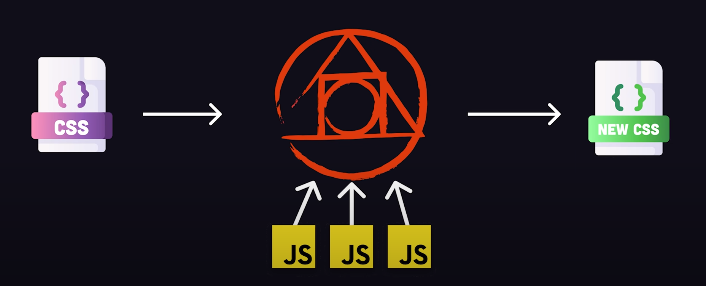

# INDEX

- [INDEX](#index)
  - [PostCss](#postcss)
    - [Why PostCSS ?](#why-postcss-)
    - [How PostCSS is used in projects](#how-postcss-is-used-in-projects)
  - [Installation](#installation)
    - [Enabling and Disabling Source Maps](#enabling-and-disabling-source-maps)
    - [Automatically Build when Source Files Change](#automatically-build-when-source-files-change)
  - [PostCSS Configuration File](#postcss-configuration-file)
  - [PostCSS plugins](#postcss-plugins)
  - [Using PostCSS](#using-postcss)
    - [Example of using PostCSS to add features to CSS](#example-of-using-postcss-to-add-features-to-css)
    - [Example of using PostCSS to optimize CSS after pre-processing](#example-of-using-postcss-to-optimize-css-after-pre-processing)

---

## PostCss

It's a **tool for transforming CSS with JavaScript** (tool that you can configure with plugins to transform the output of your CSS)



Despite what its name seems to imply, it is not a post-processor (nor is it a pre-processor), but rather it is a transpiler to turn PostCSS-specific (or PostCSS plugin-specific, to be more precise) syntax into vanilla CSS so that it can be understood by the browser.

**PostCSS**: PostCSS is **not a preprocessor** (although it can behave like one). It’s a Node.js tool which takes valid CSS and enhances it. Even those using Sass, Less, or Stylus often run a PostCSS step after the initial CSS compilation. You may have encountered the PostCSS `Autoprefixer plugin` which automatically prepends `-webkit`, `-moz`, and `-ms` vendor prefixes to CSS properties which require them.

- On its own, PostCSS does nothing. It’s a parser which tokenizes CSS code to create an abstract syntax tree. A plugin can process this tree and update properties accordingly. Once all plugins have completed their work, PostCSS reformats everything back into a string and outputs to a CSS file.

- PostCSS is all about **plugins**.
  - It allows you to choose the plugins you will use, ditching unneeded dependencies, and giving you both a quick and lightweight setup to work with, with the basic characteristics of other preprocessors. Also, it allows you to create a more heavily customized structure for your workflow while keeping it efficient.
- PostCSS moves all of the code needed to create functions, utilities and mixins out of our production style sheets and wraps them as plugins. Now, for each project, we can pick and choose the tools needed by including plugins in our task runner.

---

### Why PostCSS ?

- Your css is supported in older browsers
  - **PostCSS is to CSS what Babel is to JavaScript**. It can take a standard stylesheet which works in recent browsers and output CSS which works everywhere
    - for example, **transpiling** the newer `inset` property back into `top`, `bottom`, `left`, and `right` properties.
      - Over time, you could drop this process as more browsers support inset.
- Use the plugins and features you need.
  - PostCSS is configurable, and you can adopt the plugins you require. For example, you could support partials and nesting but not permit `variables`, `loops`, `mixins`, `maps`, and other features available in Sass.
- Provide a custom configuration for every project.
  - A individual project configuration can enhance or reduce the set of plugins used elsewhere. The options are far more varied than any preprocessor.
- it's modular
- plugins for everything
- available everywhere (with most build tools)

---

### How PostCSS is used in projects

- It can be applied by a `npm` or `yarn` script

  ```json
  "scripts": {
    "postcss": "postcss src/style.css --dir public"
  }
  ```

- It can be used with a task runner like `Gulp` or `Grunt`

  ```js
  // Gulpfile.js
  const gulp = require('gulp');
  const postcss = require('gulp-postcss');

  gulp.task('css', function () {
    return gulp.src('./src/*.css').pipe(postcss()).pipe(gulp.dest('./dest'));
  });
  ```

- It can be used in the **build** step of a bundler like `Webpack` or `Rollup`

  ```js
  // webpack.config.js
  module.exports = {
    module: {
      rules: [
        {
          // Apply PostCSS plugins to CSS files in production with other loaders
          test: /\.css$/i,
          use: ['style-loader', 'css-loader', 'postcss-loader']
        }
      ]
    }
  };
  ```

- It can be built-in in a framework like `tailwindcss`

  ```js
  // tailwind.config.js
  module.exports = {
    purge: ['./src/**/*.html', './src/**/*.js'],
    darkMode: false, // or 'media' or 'class'
    theme: {
      extend: {}
    },
    variants: {
      extend: {}
    },
    plugins: []
  };
  ```

It's common to use it with per-processor like `Sass`, and not as a replacement for it. by making `Sass` handles the pre-processing and `PostCSS` handles the optimization and post-processing.

---

## Installation

PostCSS requires `Node.js`, but here we demonstrate how to install and run PostCSS from any folder — even those that aren’t Node.js projects. You can also use PostCSS from webpack, Parcel, Gulp.js, and other tools, but we’ll stick to the command line.

```sh
npm install postcss # Install PostCSS itself

npm install postcss-cli # PostCSS CLI tool is used to run PostCSS from the command line

npm install postcss-import # PostCSS plugin to inline @import rules content
```

- To test this plugin, open or create a new project folder, then create a `src` subfolder for your source files. Create a `main.css` file to load all partials:

  ```css
  /* src/main.css */
  @import '_reset'; /* file with reset css styles */
  @import '_elements'; /* file with elements css styles */
  ```

- Run PostCSS from the project’s root folder by passing the input CSS file, a list of plugins to `--use`, and an `--output` filename:

  ```sh
  postcss ./src/main.css --use postcss-import --output ./styles.css
  ```

  - this will make us use `@import` feature from **PostCSS** and not the one from CSS

- If you don’t have any errors, the following code will be output to a new `styles.css` file in the project root.

  - Note that PostCSS can output CSS files anywhere, but the output folder must exist; it will not create the folder structure for you.

- Install and Use the `AutoPrefixer` Plugin

  ```sh
  npm install -g autoprefixer

  postcss ./src/main.css --use postcss-import --use autoprefixer --output ./styles.css
  ```

  - `AutoPrefixer` uses the browserlist module to determine which browser prefixes to add. It will result in the following code being added to `styles.css`:

    ```css
    body {
      display: flex;
      -webkit-box-pack: center;
      justify-content: center;
      -webkit-box-align: center;
      align-items: center;
    }
    ```

---

### Enabling and Disabling Source Maps

An inline source map is output by default. When the compiled CSS file is used in an HTML page, examining it in the browser’s developer tools will show the original src file and line. For example, viewing `<body>` styles will highlight `src/_elements.css` line 2 rather than `styles.css` line 8.

- You can create an external source map by adding a `--map` (or `-m`) switch to the postcss command. There’s little benefit other than the CSS file is cleaner and the browser doesn’t need to load the source map unless the developer tools are open.
- You can remove the source map with `--no-map`.
  - Always use this option when outputting CSS files for production deployment.

---

### Automatically Build when Source Files Change

The PostCSS `--watch` option automatically builds your CSS file when any of the source files change. You may also want to add the `--verbose` switch which reports when a build occurs:

```sh
postcss ./src/main.css --use postcss-import --use autoprefixer --use cssnano --no-map --output ./styles.css --watch --verbose
```

---

## PostCSS Configuration File

The `postcss` command will become long and cumbersome as you add further plugins and options. You can create a JavaScript configuration file which defines all the options and can logically determine whether it’s running in a development or production environment.

- Create a configuration file named `postcss.config.cjs` in the root of your project folder. Aso note the following:
  - you can use `postcss.config.js` as the file name, but PostCSS may fail in Node.js projects which have "type": "module" set in package.json
  - you can put the file in another folder, but you’ll need to specify `--config <dir>` when running postcss
- Add the following code to `postcss.config.cjs`:

  ```js
  // PostCSS configuration for the plugins we have
  module.exports = cfg => {
    const devMode = cfg.env === 'development';

    return {
      map: devMode ? 'inline' : null,
      plugins: [
        require('postcss-import')(),
        require('autoprefixer')(),
        devMode ? null : require('cssnano')() // "cssnano" plugin is for minifying the css file
      ]
    };
  };
  ```

- PostCSS passes a `cfg` object which contains the command line options. For example:

  ```js
  {
    cwd: '/home/cssproject',
    env: undefined,
    options: {
      map: { inline: true }, // the source map setting
      parser: undefined, // whether to use a non-CSS syntax parser (such as the scss plugin)
      syntax: undefined,
      stringifier: undefined
    },
    file: {
      dirname: '/home/cssproject/src',
      basename: 'main.css',
      extname: '.css'
    }
  }
  ```

- in `package.json` file we can write this script:

```json
"scripts": {
  "postcss:watch": "postcss src/style.css --dir public"
}
```

---

## PostCSS plugins

They are a lot of plugins for PostCSS, which help us to do a lot of things, like: `minify`, `autoprefix`, `nesting`, `variables`, `mixins`, `functions`, `import`, `extend`.

You can find plugins here [postcss.parts](https://www.postcss.parts/)

- Ex: adding `nesting` ability:

  ```js
  // postcss.config.js
  module.exports = {
    plugins: [require('postcss-nesting')]
  };

  // ------------------------------OR------------------------------

  // if using Vite or Webpack (uses ES6 modules instead of CommonJS)
  import nesting from 'postcss-nesting';
  export default {
    plugins: [nesting()]
  };
  ```

---

## Using PostCSS

### Example of using PostCSS to add features to CSS

- Configuring postcss to have the following plugins: `postcss-import`, `autoprefixer`, `postcss-nested`, `postcss-custom-properties`

  ```js
  // postcss.config.js
  module.exports = {
    plugins: [
      require('postcss-import'),
      require('autoprefixer'),
      require('postcss-nested'),
      require('postcss-custom-properties')
    ]
  };
  ```

- Using `@import` feature

  ```scss
  // src/main.css
  @import 'base';
  @import 'components';
  @import 'utilities';
  ```

- Adding `build:css` script to `package.json` file, which will apply `postcss` to `main.css` file and output the result to `public/build/styles.css` file

  ```json
  // package.json
  {
    "scripts": {
      "build:css": "postcss src/main.css -o public/build/styles.css"
    }
  }
  ```

- Using the final built css file in `index.html` file

  ```html
  <!-- public/index.html -->
  <link rel="stylesheet" href="build/styles.css" />
  ```

---

### Example of using PostCSS to optimize CSS after pre-processing

- installing `cssnano` and `purgecss` plugins

  - `cssnano` -> which is used to minify the css file
  - `purgecss` -> which is used to remove unused css styles

  ```sh
  npm install cssnano @fullhuman/postcss-purgecss
  ```

- Configuring postcss to have the plugins

  ```js
  // postcss.config.js
  module.exports = {
    plugins: [
      require('cssnano'),
      require('@fullhuman/postcss-purgecss')({
        content: ['./public/**/*.html', './src/**/*.vue', './src/**/*.jsx'],
        defaultExtractor: content => content.match(/[\w-/:]+(?<!:)/g) || []
      })
    ]
  };
  ```

- Adding `build:css` script to `package.json` file, which will apply `postcss` to `main.css` file and output the result to `public/build/styles.css` file

  ```json
  // package.json
  {
    "scripts": {
      "build:css": "postcss src/main.css -o public/build/styles.css"
    }
  }
  ```

- Using the final built css file in `index.html` file

  ```html
  <!-- public/index.html -->
  <link rel="stylesheet" href="build/styles.css" />
  ```
