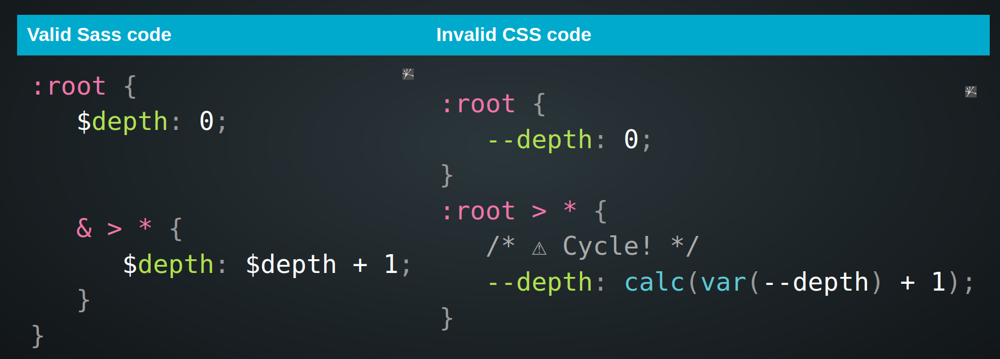

# INDEX

- [INDEX](#index)
  - [Sass](#sass)
    - [Why using Sass?](#why-using-sass)
    - [When to use Sass over CSS](#when-to-use-sass-over-css)
    - [Sass compilers](#sass-compilers)
  - [Installation](#installation)
    - [1. Using Extension](#1-using-extension)
    - [2. Using Task Runner: NPM (preferred way ✅)](#2-using-task-runner-npm-preferred-way-)
      - [Using `npm` scripts](#using-npm-scripts)
      - [Using task runner like `gulp` or `grunt`](#using-task-runner-like-gulp-or-grunt)
      - [Using bundler like `webpack`](#using-bundler-like-webpack)
    - [SASS starter project (if needed)](#sass-starter-project-if-needed)
  - [7-1 pattern (Folder Structure)](#7-1-pattern-folder-structure)
  - [Partials](#partials)
    - [@import](#import)
    - [@use](#use)
    - [@forward](#forward)
  - [Nesting selectors](#nesting-selectors)
  - [Variables](#variables)
    - [Variables data types](#variables-data-types)
    - [Interpolation](#interpolation)
    - [css variables vs sass variables](#css-variables-vs-sass-variables)
  - [Control-flow](#control-flow)
  - [Loops and Iteration](#loops-and-iteration)
  - [Mixin - Extending - Placeholder](#mixin---extending---placeholder)
    - [Mixin](#mixin)
      - [Mixins `null` values](#mixins-null-values)
      - [Passing declaration block to mixins](#passing-declaration-block-to-mixins)
    - [Placeholder](#placeholder)
    - [Mixin vs Placeholder](#mixin-vs-placeholder)
  - [Functions](#functions)
    - [Color Functions](#color-functions)
  - [Operators](#operators)
  - [Comments](#comments)
    - [String interpolation in comments](#string-interpolation-in-comments)
  - [Sass in BEM](#sass-in-bem)

---

## Sass

Sass is a CSS preprocessor, an extension of CSS that adds power and elegance to the basic language.

- Once Sass is installed, you can compile your Sass code to CSS code using the `sass` command. You'll need to tell Sass which file to build from, and where to output CSS to.

  ```sh
  sass --watch input.scss output.css
  ```

---

### Why using Sass?

- Sass has features that don't exist in CSS yet like:
  - [variables](#variables) -> for reusing values
  - [nesting](#nesting-selectors) -> for nesting selectors inside one another, allowing us to write less code
  - [mixins](#mixin) -> for reusing style rules
  - [inheritance](#placeholder)
  - [modules - partials](#partials) -> for organizing code in multiple files
  - [importing](#import) -> for importing other files
  - [math operators](#operators) -> for doing math in your CSS
  - [color functions](#color-functions) -> for manipulating colors
  - [loops](#loops-and-iteration) -> for creating multiple styles with less code
  - [conditionals](#control-flow) -> for writing complex logic in your styles
  - [built-in functions](#functions) -> for manipulating values
  - [custom functions](#functions)
  - [and more](https://sass-lang.com/documentation)

---

### When to use Sass over CSS

Sass supports 2 syntaxes: `SCSS` (Sassy CSS) and `Sass` (indented syntax). The difference is that `SCSS` is a **CSS-like syntax** and is **indentation-based** like CSS, while the `Sass` syntax is more **compact** and **flexible**.

- in general, it depends on many factors like:

  - team preference
  - browser support

- **SCSS vs SASS**
  
  - `SCSS` is like `Sass`, but is closer to regular CSS. **SCSS is fully CSS compliant**, meaning you can import regular CSS into a SCSS file, and it will work immediately.

---

### Sass compilers

There are many ways to compile Sass code to CSS code:

- **Dart Sass** (the primary implementation of Sass)
  - It's the **official** Sass compiler, and it's written in Dart
  - It's the **recommended** compiler to use
  - It's **faster** and **more up-to-date** than Ruby Sass
- **Ruby Sass**
  - It's the **original** Sass compiler, and it's written in Ruby
  - It's **slower** and **no longer maintained**
- **Node Sass**
  - It's a **library** that provides binding for Node.js to LibSass, the C version of the popular stylesheet preprocessor, Sass
  - It's **deprecated** and **no longer maintained** ❌

---

## Installation

### 1. Using Extension

> use the updated and maintained version of `live sass compiler` extension as it supports new css syntax

when using `live sass compiler` extension, use these settings in your `settings.json` file in `VS.Code`:

```json
"liveSassCompile.settings.formats": [
  {
   "format": "expanded", // or "compressed" if you want to minify the CSS file
   "extensionName": ".css",
   "savePath": "/dist", // place of the generated CSS file instead of the same location of your sass file
   "savePathReplacementPairs": null
  }
 ],
```

---

### 2. Using Task Runner: NPM (preferred way ✅)

#### Using `npm` scripts

You can use `npm` to compile your sass files, and it's the preferred way as it's more flexible and you can use it with any editor.

- First install `sass` package

  ```sh
  npm install sass --save-dev
  ```

- The write a script in `package.json` file to compile your sass files

  ```json
  "scripts": {
    // "script-name": "sass --watch input.scss output.css"
    "compile:sass": "sass --watch src/main.scss public/css/style.css"
  }
  ```

---

#### Using task runner like `gulp` or `grunt`

- First install `gulp` package using `npm install gulp --save-dev`
- Then install `gulp-sass` package using `npm install gulp-sass --save-dev`
- Then write a task in `gulpfile.js` file to compile your sass files

  ```js
  const gulp = require('gulp');
  const sass = require('gulp-sass');

  gulp.task('sass', function () {
    return gulp
      .src('src/sass/**/*.scss')
      .pipe(sass()) // Converts Sass to CSS with gulp-sass
      .pipe(gulp.dest('public/css'));
  });
  ```

- Then run the task using `gulp sass`
- You can also use `gulp watch` to watch for changes in your sass files and compile them automatically

---

#### Using bundler like `webpack`

- First install `sass-loader` package using `npm install sass-loader --save-dev`
- Then install `node-sass` package using `npm install node-sass --save-dev`
- Then write a task in `webpack.config.js` file to compile your sass files

  ```js
  module.exports = {
    module: {
      rules: [
        {
          test: /\.s[ac]ss$/i,
          use: [
            // Creates `style` nodes from JS strings
            'style-loader',
            // Translates CSS into CommonJS
            'css-loader',
            // Compiles Sass to CSS
            'sass-loader'
          ]
        }
      ]
    }
  };
  ```

- Then run the task using `webpack`

  ```sh
  webpack --watch
  ```

---

### SASS starter project (if needed)

use this as the contents of a fresh `package.json`:

```json
{
  "name": "project",
  "version": "0.1.0",
  "description": "SASS compile|autoprefix|minimize and live-reload dev server using Browsersync for static HTML",
  "main": "public/index.html",
  "author": "5t3ph",
  "scripts": {
    "build:sass": "sass  --no-source-map src/sass:public/css",
    "copy:assets": "copyfiles -u 1 ./src/*assets/**/* public", // "**/*" means every file and every nested files
    "copy:html": "copyfiles -u 1 ./src/*.html public",
    "copy": "npm-run-all --parallel copy:*",
    "watch:assets": "onchange '/src/*assets/**/*' -- npm run copy:html",
    "watch:html": "onchange 'src/*.html' -- npm run copy:html",
    "watch:sass": "sass  --no-source-map --watch src/sass:public/css",
    "watch": "npm-run-all --parallel watch:*",
    "serve": "browser-sync start --server public --files public",
    "start": "npm-run-all copy --parallel watch serve",
    "build": "npm-run-all copy:html build:*",
    "postbuild": "postcss public/css/*.css -u autoprefixer cssnano -r --no-map"
  },
  "dependencies": {
    "autoprefixer": "^10.4.2",
    "browser-sync": "^2.27.7",
    "copyfiles": "^2.4.1",
    "cssnano": "^5.0.17",
    "npm-run-all": "^4.1.5",
    "onchange": "^7.1.0",
    "postcss-cli": "^9.1.0",
    "sass": "^1.49.8"
  }
}
```

- **Note**: You may encounter this message when running `npm install`: **"browser-sync had an unresolved issue with an old dependency"**
  - but since you will not deploy browser-sync as a production dependency, it is low impact.
- **Scripts**:
  - `npm start` - copies src files to public and starts Browsersync server at localhost:3000
  - `npm run build` - copies files to public and autoprefixes/minifies css

---

## 7-1 pattern (Folder Structure)

It's a way to organize your `scss` files in a more structured way, where you have 7 different folders for different types of files, and 1 file for the main `scss` file that imports all the other files, which will be compiled into a single `css` file.

- Usually, when using [partials](#partials) to organize your code, you will have a `main.scss` file that imports all of the other partials to be compiled into a single CSS file. So for organization, we can use the **7-1 pattern**:

  ```sh
  scss/
  |
  |– abstracts/
  |   |– _variables.scss    # Sass Variables
  |   |– _functions.scss    # Sass Functions
  |   |– _mixins.scss       # Sass Mixins
  |
  |– base/
  |   |– _reset.scss        # Reset/normalize
  |   |– _base.scss         # Base styles (e.g. body tag)
  |   |– _typography.scss   # Typography rules
  |   |- _utilities.scss    # Utility classes
  |   …                     # Etc.
  |
  |– components/
  |   |– _buttons.scss      # Buttons
  |   |– _carousel.scss     # Carousel
  |   …                     # Etc.
  |
  |– layout/
  |   |– _navigation.scss   # Navigation
  |   |– _grid.scss         # Grid system
  |   |– _header.scss       # Header
  |   |– _footer.scss       # Footer
  |   |– _sidebar.scss      # Sidebar
  |   …                     # Etc.
  |
  |– pages/
  |   |– _home.scss         # Home specific styles
  |   |– _contact.scss      # Contact specific styles
  |   …                     # Etc.
  |
  |– themes/
  |   |– _theme.scss        # Default theme
  |   |– _admin.scss        # Admin theme
  |   …                     # Etc.
  |
  |– vendors/
  |   |– _bootstrap.scss    # Bootstrap
  |   |– _jquery-ui.scss    # jQuery UI
  |   …                     # Etc.
  |
  |– main.scss              # Main Sass file
  ```

  ```scss
  // main.scss
  @use 'abstracts/variables';
  @use 'abstracts/functions';
  @use 'abstracts/mixins';

  @use 'base/reset';
  @use 'base/base';
  @use 'base/typography';
  @use 'base/utilities';

  @use 'components/buttons';
  @use 'components/carousel';

  @use 'layout/navigation';
  @use 'layout/grid';
  @use 'layout/header';
  @use 'layout/footer';
  @use 'layout/sidebar';

  @use 'pages/home';
  @use 'pages/contact';

  @use 'themes/theme';
  @use 'themes/admin';

  @use 'vendors/bootstrap';
  @use 'vendors/jquery-ui';
  ```

---

## Partials

These're `scss` files that starts with `_`, ex: `_layout.scss`

- it's for instead of working with one long `css` file, you can actually **split up** your styles into multiple files and be more organized with sub-folders
  - also it can lower the chance of **code-conflict** between developers working on the same project as they won't be working in the same file
- `sass` will ignore any file that starts with `_`, and will not compile it to `css` file.
  - The underscore lets Sass know that the file is only a partial file and that it should not be generated into a CSS file.
- `Sass` partials are used with the `@use` rule or the `@import` rule.

  - `@import` is the old way of importing partials, and it's not recommended to use it anymore
  - `@use` is the new way of importing partials, and it's recommended to use it

  ```scss
  // _layout.scss
  .container {
    // code
  }
  // now you can import it in another file
  @use 'layout';
  ```

---

### @import

- using an `@import` in **CSS** results in a new round-trip HTTP request, this is a concern
- It's commonly used to import **partials** (modules) in `sass` files

  ```scss
  @import 'partials/_layout.scss';
  ```

- It's not limited to `partials`, it can import other `sass` files and libraries too

  ```scss
  @import 'bootstrap';
  ```

- **Notes:**
  - `@import` is the old way of importing partials, and it's not recommended to use it anymore, instead use `@use`
  - Thing imported will be accessible only in the scope it was imported in

---

### @use

The `@use` rule loads `mixins`, `functions`, and `variables` from other Sass stylesheets, and combines CSS from multiple stylesheets together. Stylesheets loaded by @use are called "modules". Sass also provides built-in modules full of useful functions.

- Different from `@import`, `@use`:

  - It loads a Sass **module** rather than a **stylesheet**.
  - You shouldn't have dependencies between modules when using `@use`.

    - If you need to use a variable, mixin, or function from another module, you can **explicitly** refer to it using the module’s namespace.
    - This is because `@use` loads the module at **compile-time**, rather than **load-time**.

    - This won't work and will reduce error ❌

      ```scss
      // _variables.scss
      $color: red;
      ```

      ```scss
      // _buttons.scss
      .btn {
        color: $color; // error because $color is not defined
      }
      ```

      ```scss
      // style.scss
      @use 'variables';
      @use 'buttons';
      ```

    - This will work ✅

      ```scss
      // _variables.scss
      $color: red;
      ```

      ```scss
      // _buttons.scss
      @use 'variables';

      .btn {
        color: variables.$color; // must use the namespace to access the variable
      }
      ```

      ```scss
      // style.scss
      @use 'variables';
      @use 'buttons';
      ```

    - So, when using `@use`, don't import `variables` file in the `main.scss` file, instead import it in the file where you need to use it

  - It's the new way of importing partials, and it's recommended to use it

    ```scss
    @use 'partials/layout';
    ```

  - It enables **namespacing** by default, so you can refer to members of the module by their own name without worrying about name **conflicts**.

    ```scss
    @use 'partials/layout' as layout;
    ```

- **Choosing a Namespace**

  - By default, a module’s namespace is just the last component of its URL without a file extension. However, sometimes you might want to choose a different namespace—you might want to use a shorter name for a module you refer to a lot, or you might be loading multiple modules with the same filename. You can do this by writing `@use "<url>" as <namespace>`:

  ```scss
  // style.scss
  @use 'src/corners' as c;

  .button {
    @include c.rounded;
    padding: 5px + c.$radius;
  }

  // OR
  @use 'src/corners'; // default namespace will be 'corners'

  .button {
    @include corners.rounded;
    padding: 5px + corners.$radius;
  }
  ```

  - You can even load a module without a **namespace** by writing `@use "<url>" as *`.

    ```scss
    // style.scss
    @use 'src/corners' as *;

    .button {
      @include rounded;
      padding: 5px + $radius;
    }
    ```

    - It's recommended that you only do this for stylesheets written by you, though; otherwise, they may introduce new members that cause name **conflicts**!

---

### @forward

it's used to **take all** style rules in the `partials`, and **forward them out** as a singular thing to get loaded on the file it's called in all together without worrying about namespacing like in [@use](#use)

- no need to write the full partial-file name, you can omit the `_` and the file extension
- usually we use it in file with name `_index.scss` in the folder

  ```scss
  // _index.scss
  @forward 'boilerplate'; // instead of '_boilerplate.scss'
  @forward 'typography';
  ```

- you can use it to forward file named `_index.scss` in a folder by calling the folder's name

  ```scss
  // styles.scss
  @forward 'folder_name`
  ```

- used to get the abstract styles and partials unlike in `@use` where we may depend on namespacing.

---

## Nesting selectors

- `&` -> Parent selector -> is for no space between nested selectors (class and class)
- `>` direct selectors
- in **Sass**, you can put (nest) the `media-query` code inside the selector's block, unlike in **Css** where it needs to be separated

  ```scss
  // Sass
  .smth {
    color: red;

    &.smth-else {
      color: blue;
    }

    @media (min-width: 768px) {
      color: yellow;
    }
  }
  ```

  ```css
  /* Result CSS */
  .smth {
    color: red;
  }

  .smth.smth-else {
    color: blue;
  }

  @media (min-width: 768px) {
    .smth {
      color: yellow;
    }
  }
  ```

---

## Variables


- starts with `$`
- there's global and local variables
  - you can **convert local** variables to **global variables** with `!global` flag
  - `!default` -> means that it will be used if the variable isn't declared in the file with different value
- usually variables are gathered in a `partial` file and imported where needed.

```scss
$primary-color: #eee !global;
```

---

### Variables data types

- **numbers** -> `1`, `1.2`, `1px`, `1em`, `1%`
- **strings** -> `"foo"`, `'bar'`, `Baz`
- **booleans** -> `true`, `false`
- **list** -> `1px 1px 2px black, 2px 2px 4px red`

  ```scss
  $font-stack: Helvetica, sans-serif;
  ```

- **maps** -> `('key1': 'value1', 'key2': 'value2')`

  - one use of `maps` is mapping names for each breakpoint like:
  - to get value from a **Map**, we use: `map-get()` method:

    ```scss
    $breakpoints-up: (
      'medium': 700px,
      'large': 900px,
      'xlarge': 1440px
    );

    @mixin breakpoint($size) {
      @media (min-width: map-get($breakpoints-up, $size)) {
        @content;
      }
    }
    ```

---

### Interpolation

It's used to insert a variable value inside a string.

- It's done using `#{}`
- It's commonly used with:

  - [loops and iteration](#loops-and-iteration)

    ```scss
    $company == "google";

    .ad #{$company}{
      // code
      background-image:url('img/#{$company}.png');
      // code
    }
    ```

  - `calc()` function

    ```scss
    $width: 100px;

    .box {
      width: calc(#{$width} * 2);
    }
    ```

---

### css variables vs sass variables

- use sass for global values that don't typically change: `color`, `font-family`, etc
- use **custom properties** for values that will change in the media queries: `font-size`, `margin`, `padding`, `widths`, `flex-basis`, etc




---

## Control-flow


```scss
.main {
  @if $theme == 'light' {
    // code
  } @else {
    // else is not mandatory
    // code
  }
}
```

- one useful example is when you have different background and you want to decide using (black or white) font color:

  ```scss
  @if lightness($color) < 70% {
    color: white;
  }
  ```

---

## Loops and Iteration

- usually useful when you want to create multiple **utility classes** for multiple spaces
- can be used with sass modules (data-structures) like **Lists** and **Maps (like object)**

```scss
@for $i from 1 through 10 {
  .class-#{$i} {
    font-size: #{$i + 10px};
  }
}
```

We can also iterate using `@each` keyword

```scss
// Looping over a list
$colors: red, green, blue;

@each $color in $colors {
  .#{$color}-text {
    color: $color;
  }
}

// ---------------------------------------------------- //

// Looping over a map
$colors: (
  'primary': red,
  'secondary': green,
  'tertiary': blue
);

@each $key, $value in $colors {
  .#{$key}-text {
    color: $value;
  }
}
```

---

## Mixin - Extending - Placeholder

### Mixin

It's like a reusable block of code that can be used in multiple places in your stylesheets.

- It's like a variable with a block of code
- A mixin lets you make groups of CSS declarations that you want to reuse throughout your site. It helps keep your Sass very **DRY**.
- mixins are used using `@include`
- You can even pass in values (**arguments**) to make your mixin more flexible.

  - this is one of the main purposes of mixin
  - you can use **Default Argument Values** in mixins to define default values for arguments
    - arguments can be provided **in order** or **by name**
    - when keyword `args` is used, order is ignored
  - if you want to re-use a block of style without **arguments**, you should use [Placeholder](#placeholder)

- Examples:

  - **Simple mixin**

    ```scss
    @mixin transform-to-center {
      position: absolute;
      top: 50%;
      left: 50%;
      transform: translate(-50%, -50%);
    }

    .box {
      @include transform-to-center;
    }
    ```

  - **Mixin with arguments**

    ```scss
    @mixin transform($property, $value) {
      -webkit-transform: $property($value);
      -ms-transform: $property($value);
      transform: $property($value);
    }

    .box {
      @include transform(scale, 1.5);
    }
    ```

  - **Mixin with default values**

    ```scss
    @mixin transform($property: scale, $value: 1.5) {
      -webkit-transform: $property($value);
      -ms-transform: $property($value);
      transform: $property($value);
    }

    .box {
      @include transform();
    }
    ```

---

#### Mixins `null` values

if mixin has a property that doesn't apply to a specific element, the element will only take what is possible and ignore the `null` values

- so you don't need to worry about inheritance if no argument is provided


---

#### Passing declaration block to mixins

- it's like **slots** in components

- You can pass declaration block inside the mixin when invoking it using `@content`
  
- It's commonly used with `@media` queries, to avoid writing the `max-width` value every time
- Example:

  ```scss
  @mixin media-phone {
    @media (max-width: 600px) {
      @content;
    }
  }

  .box {
    // without the need to write the max-width: 600px
    @include media-phone {
      width: 100%;
      height: 100%;
    }
  }
  ```

- Generic example for `@content`:

  ```scss
  @mixin media($breakpoint) {
    @if $breakpoint == 'phone' {
      @media (max-width: 600px) {
        @content;
      }
    } @else if $breakpoint == 'tablet' {
      @media (max-width: 900px) {
        @content;
      }
    } @else if $breakpoint == 'desktop' {
      @media (max-width: 1200px) {
        @content;
      }
    }
  }

  .box {
    @include media('phone') {
      width: 100%;
      height: 100%;
    }
  }
  ```

---

### Placeholder

- it's like [Mixin](#mixin) but without parameters
- it starts with `%` prefix
- it's applied using `@extend` keyword

  - `@extend` in Sass that allows for sharing of CSS properties from one selector to another without rewrite repeated code.
    
    
  - it's the safer way to use `@extend` without blowing in size with selectors in your `.css` file

- Examples

  - extending a placeholder

    ```scss
    %main-box {
      position: absolute;
      top: 50%;
      left: 50%;
      transform: translate(-50%, -50%);
    }

    .article {
      @extend %main-box;
      // rest of code
    }
    ```

  - extending selector

    ```scss
    .main-box {
      position: absolute;
      top: 50%;
      left: 50%;
      transform: translate(-50%, -50%);
    }

    .article {
      @extend .main-box;
      // rest of code
    }
    ```

---

### Mixin vs Placeholder

| Mixin                                                                              | Placeholder                                                                              |
| ---------------------------------------------------------------------------------- | ---------------------------------------------------------------------------------------- |
| Mixins are used to define reusable styles that can be included in other selectors. | Placeholders are used to define reusable styles that can be extended by other selectors. |
| Mixins are used with `@include` to include the styles in the selector.             | Placeholders are used with `@extend` to extend the styles in the selector.               |
| Mixins can take arguments to make them more flexible.                              | Placeholders cannot take arguments.                                                      |
| Mixins are compiled to CSS.                                                        | Placeholders are not compiled to CSS. **(so you can't use them in the same file)**       |
| Mixins are used when you want to reuse a block of style with arguments.            | Placeholders are used when you want to reuse a block of style without arguments.         |

---

## Functions

Sass provides many built-in modules which contain useful functions (and the occasional mixin). These modules can be loaded with the `@use` rule like any user-defined stylesheet, and their functions can be called like any other module member.

- sass functions return a **value** for a css property unlike mixins which return a block of css-code

- There're 2 types of functions in Sass:

  - **Built-in functions** -> like `math.div()`, `color.red()`, etc

    ```scss
    // function example
    @use 'sass:math';

    .container {
      width: math.div(600px, 960px) * 100%; // 62.5%
    }

    .box {
      width: calc((100% - 40px) / 2);
    }
    ```

    - All built-in module URLs begin with sass: to indicate that they're part of Sass itself.
    - some of the predefined functions available in Sass, specifically the color functions: [Built-In Modules](https://sass-lang.com/documentation/modules)

  - **Custom functions** -> like `add-10()`, `add-px()`, etc

    ```scss
    @function divide($a, $b) {
      @return $a / $b;
    }

    .container {
      width: divide(600px, 960px) * 100%; // 62.5%
    }
    ```

- You can use `@if` to check for errors in the code or usually in **Sass functions**:

  ```scss
  @function divide($a, $b) {
    @if $b == 0 {
      @error "Cannot divide by zero";
    }
    @return $a / $b;
  }
  ```

---

### Color Functions

Usually they're very useful when you have a primary-color or a brand-color and want to create color-themes from this color

- `adjust-hue`
  
- `darken` / `lighten`
  - the percentage is the subtracted percent of the brightness, so if it was `100%`, you will get **black**
    
- `saturate` / `desaturate`
  

---

## Operators

It's for doing math in your CSS, as some normal operators don't work here like forward-slash `/` for division, which conflict with importing modules using `@forward` rule, so instead we use functions in the [math()](https://sass-lang.com/documentation/modules/math) module.

- it's a **Sass Built-in Module** so it needs to be imported

```scss
@use 'sass:math'; // load built-in sass-module

.container {
  display: flex;
}

article[role='main'] {
  width: math.div(600px, 960px) * 100%;
}

aside[role='complementary'] {
  width: math.div(300px, 960px) * 100%;
  margin-left: auto;
}
```

---

## Comments

- `//` -> won't remain in css file
- `/* */` -> will remain in css file

### String interpolation in comments

```scss
/**
Hue is #{hue(green)}
*/

// will be in CSS file:
/**
Hue is 120deg
*/
```

---

## Sass in BEM


