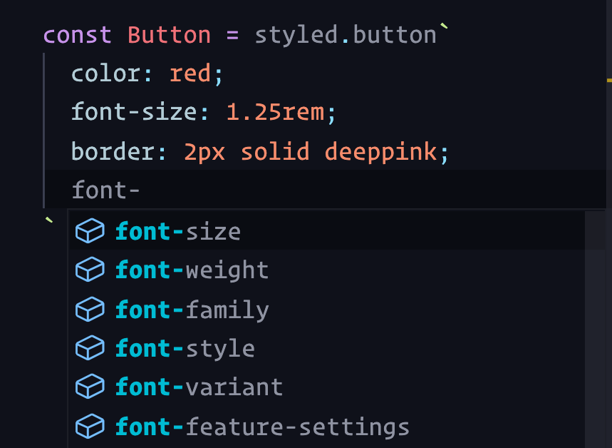

# INDEX

- [INDEX](#index)
  - [Styled Components](#styled-components)
    - [Why Styled Components?](#why-styled-components)
    - [Installation](#installation)
    - [Syntax and Usage](#syntax-and-usage)
    - [How it works?](#how-it-works)
  - [Extending Styles (Composition)](#extending-styles-composition)
  - [Props](#props)
  - [Dynamic Tags (`"as"` prop)](#dynamic-tags-as-prop)
  - [Attributes in Styled Components](#attributes-in-styled-components)
  - [Themes](#themes)
  - [Animation](#animation)
  - [Global Styling](#global-styling)
  - [Other cases](#other-cases)
  - [Debugging](#debugging)
  - [Styled Components with Server-side Rendering](#styled-components-with-server-side-rendering)

---

## Styled Components

[styled-components](https://styled-components.com/) package

It's a library built for React and React Native developers. It allows you to use component-level styles in your applications. Styled-components leverage a mixture of JavaScript and CSS using a technique called `CSS-in-JS`.

> In React’s own words, styled components are “visual primitives for components”, and their goal is to give us a flexible way to style components. The result is a tight coupling between components and their styles.

- `Styled-components` are based on **tagged template literals**, meaning actual CSS code is written between backticks when styling your components.
- They runs at **Runtime** (not at build time), This is different from `SASS` or `LESS` which are pre-processed at build time (compiled to CSS before the app runs).

  - So it's not a performance issue.

- With styled-components, there is no need to map your created components to external CSS styles.

> [more info](https://www.section.io/engineering-education/working-with-styled-components-in-react/#what-are-Styled-components)

### Why Styled Components?

Apart from helping you to scope styles, styled components include the following features:

- **Automatic vendor prefixing** (Browser Support)
  - You can use standard CSS properties, and styled components will add vendor prefixes should they be needed.
  - write your CSS to the current standard and let styled-components handle the rest.
- **Preprocessing capabilities**
  - Styled components uses Sass-like preprocessor behind the scenes called `stylis`. This means you can use Sass-like features such as nesting and mixins.
- **Unique class names**
  - Styled components are independent of each other, and you do not have to worry about their names because the library handles that for you.
- **Elimination of dead styles**
  - Styled components remove unused styles, even if they’re declared in your code.

---

### Installation

- **Installation**

  ```sh
  npm install --save styled-components
  # Or
  yarn add styled-components
  ```

- Babel Plugin (optional)

  - This plugin helps display styled-component names in DevTools for easier debugging.
  - It assigns meaningful class names in development, instead of random ones like `.a5gsgpzvq`. This behavior is for development only and does not affect production.
    
    
  - Class names will be structured in the following format: `Filename_componentName_hash`. So if the HTML is `<header class="ShoeIndex__Header-sc-123">`, you can look for the `const Header` inside `ShoeIndex.js`.
  - How to install:

    ```sh
    npm install --save-dev babel-plugin-styled-components
    # Or
    yarn add --dev babel-plugin-styled-components
    ```

  - Then add the plugin to your `.babelrc` file:

    ```json
    {
      "plugins": ["babel-plugin-styled-components"]
    }
    ```

  - **Babel Macros** (optional)

    - In your React application, change all imports to match the following:

      ```js
      // From this:
      import styled from 'styled-components';

      // ...to this:
      import styled from 'styled-components/macro';
      ```

    - By importing from the macro, you get the benefits of the Babel plugin without needing to eject, or fuss with the build configuration.

- **Editor Integration**

  - For better syntax highlighting, install the `vscode-styled-components` extension in Visual Studio Code.
    
  - It isn't just syntax-highlighting, either: you also get proper auto-complete, and all the other niceties of working in a modern editor:

    

---

### Syntax and Usage

- It uses **Tagged Template Literals** to style components. It's a way to style components with template strings in JavaScript.

  ```js
  const Title = styled.h1`
    font-size: 1.5em;
    color: palevioletred;
  `;
  ```

- for pseudo elements/classes, we can use **"nesting"** using `&` like in `sass`

  - One other reason for using `&` is that as styled-components do its magic by hashing the class names, it needs to know what the parent class name is. So, when you use `&`, it knows that the parent class name is the current class name. As we won't know the parent class name, we can't use `&` in a normal CSS file.

- Example:

  ```jsx
  // in file.styles.jsx

  import styled from 'styled-components';

  // Create a Title component that'll render an <h1> tag with some styles
  export const Title = styled.h1`
    font-size: 1.5em;
    text-align: center;
    color: palevioletred;
  `;

  // Create a Wrapper component that'll render a <section> tag with some styles
  export const Wrapper = styled.section`
    padding: 4em;
    background: papayawhip;
  `;

  //-------------------------------------------------------------//

  // in file.component.jsx

  // import {Title, Wrapper} from ..

  // Use Title and Wrapper like any other React component – except they're styled!
  render(
    <Wrapper>
      <Title>Hello World!</Title>
    </Wrapper>
  );
  ```

---

### How it works?

When you create a styled component, you’re creating a React component that has styles attached to it, then:

- 1️⃣ It finds the targeted element in the DOM.

  ```js
  const Title = styled.h1`
    font-size: 1.5em;
    text-align: center;
    color: red;
  `;
  ```

  - The library uses javascript feature called **tagged template literals** to style the component. Here `sstyled.h1` is a function that takes a template string as an argument and returns a styled component.

- 2️⃣ It attaches the styles to the element via a unique class name.
  - When generating the class, it picks a unique hash every time, even for components with the same name.
  - When inspecting the DOM, you’ll see that the styled component is rendered as a `div` with a **Hashed** class name that is unique to the styled component, e.g., `wIbYXb` class name.
- 3️⃣ It injects the styles into the `head` of the document.

  - It uses the generated unique class name for each styled component and add these styles as **internal styles** in the `head` of the document.

    ```html
    <style data-styled="active" data-styled-version="5.3.0">
      /* sc-component-id: wIbYXb */
      .wIbYXb {
        font-size: 1.5em;
        text-align: center;
        color: red;
      }
    </style>
    ```

- 4️⃣ It renders the styled component in the DOM.

> **Note**: this doesn't happen at build time, it happens at runtime only when the component is rendered. meaning that the styles are injected into the `head` of the document when the component is rendered.

---

## Extending Styles (Composition)

It's a way to reuse styles in styled-components. We can extend styles from one styled component to another styled component. This is done by passing the styled component as an argument to the `styled` function.

- We can reuse and inherit and override styles. It’s more or less like how the spread operator works
- If we need multiple variants of a component, we can choose one component to serve as the base for another. For example:

  ```jsx
  const Base = styled.button`
    font-size: 21px;
  `;

  const PrimaryButton = styled(Base)`
    background: blue;
    color: white;
  `;

  render(<PrimaryButton>Button</PrimaryButton>);
  ```

- If you inspect that element in the devtools, you'll notice that it's applying both styles:

  ```css
  /* Base */
  .cIKpxU {
    font-size: 21px;
  }
  /* PrimaryButton: */
  .bhdLno {
    background: #00f;
    color: #fff;
  }
  ```

---

## Props

> Styled components are **functional**, so we can easily style elements dynamically

It's done by passing props to the styled component as an argument in a function. This way, we can change the styles of the component based on the props passed to it.

- Example

  ```js
  const Button = styled.button`
    background-color: ${props => (props.primary ? 'red' : 'white')};
  `;
  ```

  - We can use any name for the argument not just `props`, like `p`.

- Using props to determine the css property value instead of (using inline styles to use the props)

  ```jsx
  // Adapting the colors based on primary prop
  const Button = styled.button`
    background-color: ${props => (props.primary ? 'red' : 'white')};
    font-size: 1em;
    margin: 1em;
    padding: 0.25em 1em;
    border: 2px solid palevioletred;
    border-radius: 3px;
  `;

  render(
    <div>
      <Button>Normal Color</Button>
      <Button primary>Primary Color</Button>
    </div>
  );
  ```

- Using props to declare css code block

  ```jsx
  // we must import the "css" module to let it know that we're inserting a css-code-block
  import styled, { css } from 'styled-components';

  const Button = styled.button`
    background-color: ${props => (props.primary ? 'red' : 'white')};

    font-size: 1em;
    margin: 1em;
    padding: 0.25em 1em;
    border: 2px solid palevioletred;
    border-radius: 3px;

    // This is considered a Mixin
    ${props () => css`
      ${() => type === primary && `background-color: red;`}
      ${() => type === secondary && `background-color: blue;`}
    `}
  `;

  render(
    <div>
      <Button>Normal Color</Button>
      <Button type="primary">red Color</Button>
      <Button type="secondary">blue Color</Button>
    </div>
  );
  ```

- Pass color as a prop

  ```jsx
  const Button = styled.button`
    background-color: ${props => props.color || 'white'};
    font-size: 1em;
    margin: 1em;
    padding: 0.25em 1em;
    border: 2px solid palevioletred;
    border-radius: 3px;
  `;

  render(
    <div>
      <Button>Normal Color</Button>
      <Button color='red'>Red Color</Button>
    </div>
  );
  ```

- Another trick like props to have dynamic styles is to use CSS variables

  ```jsx
  const Button = styled.button`
    background-color: var(--button-color);
    font-size: 1em;
    margin: 1em;
    padding: 0.25em 1em;
    border: 2px solid palevioletred;
    border-radius: 3px;
  `;

  render(
    <div>
      <Button>Normal Color</Button>
      <Button style={{ '--button-color': 'red' }}>Red Color</Button>
    </div>
  );
  ```

---

## Dynamic Tags (`"as"` prop)

Sometimes, we want to use a styled component with a different tag than the one it was created with. For example, we might want to use a `<a>` tag instead of a `<button>` tag (but with the same styles). This is where the `as` prop comes in.

- With the `as` prop, you can swap the end element that gets rendered. One use case is (when you inherit styles), for example, you’d prefer a `div` to a `section` for a reusable styled-component, you can pass the as prop to your styled component with the value of your preferred element, like so:

  ```jsx
  function Button({ href, children }) {
    return (
      <Wrapper href={href} as={href ? 'a' : 'button'}>
        {children}
      </Wrapper>
    );
  }

  const Wrapper = styled.button`
    /* styles */
  `;

  render(<Button href='/'>Hello</Button>);
  ```

- You could even have a custom component (like React Router’s `Link` component) as the `as` prop:

  ```jsx
  import { Link } from 'react-router-dom';

  function Button({ href, children }) {
    return (
      <Wrapper to={href} as={href ? Link : 'button'}>
        {children}
      </Wrapper>
    );
  }
  const Wrapper = styled.button`
    /* styles */
  `;
  render(<Button href='/'>Hello</Button>);
  ```

---

## Attributes in Styled Components

An extended syntax lets us manage props using the `attrs` constructor.

- to mimic `<a target="_blank"></a>`

  ```js
  const styledAlink = styled.a.attrs(() => ({ target: '_blank' }))`
  ... css code
  `;
  ```

- to get attribute-value dynamically from props:

  ```js
  const StyledContainer = styled.section.attrs(props => ({
    width: props.width || '100%',
    hasPadding: props.hasPadding || false
  }))`
    --container-padding: 20px;
    width: ${props => props.width}; // Falls back to 100%
    padding: ${props => (props.hasPadding && 'var(--container-padding)') || 'none'};
  `;
  ```

---

## Themes

- We can use the `ThemeProvider` component to pass down the theme to all styled components anywhere in the component tree.

- It's used to provide css-variable-like values to styled-components

  ```js
  import { ThemeProvider } from 'styled-components';

  const theme = {
    main: 'mediumseagreen',
    secondary: 'palevioletred'
  };

  function App() {
    return (
      <ThemeProvider theme={theme}>
        <Routes />
      </ThemeProvider>
    );
  }
  ```

- It's not used anymore because we can use the native css variables (custom properties) instead
  - To do so, we define the variables in the `:root` selector in the [global styles](#global-styling)

---

## Animation

Styled components have a **keyframes** helper that assists with constructing (reusable) animation keyframes. The advantage here is that the keyframes will be detached from the styled components and can be exported and reused wherever needed.

```js
import styled, { keyframes } from 'styled-components';

const slideIn = keyframes`
  from {
    opacity: 0;
  }

  to {
    opacity: 1;
  }
`;

const Toast = styled.div`
  animation: ${slideIn} 0.5s cubic-bezier(0.4, 0, 0.2, 1) both;
  border-radius: 5px;
  padding: 20px;
  position: fixed;
`;
```

---

## Global Styling

With styled-components, the styles we write are indelibly bound to the elements created. In a component-driven framework like React, this is exactly what you want, most of the time.

But what about global styles? Things like CSS resets, and some baseline styles for native HTML elements?

styled-components has a specific API for creating global styles: `createGlobalStyle`.

- One thing we can use `createGlobalStyle` for is to **normalize the CSS**:

- How it works

  - We add it to the root of our application, and it will be available to all components in the application.

    ```js
    // 📄 GlobalStyles.js
    import { createGlobalStyle } from 'styled-components';
    const GlobalStyles = createGlobalStyle`
      *, *::before, *::after {
        box-sizing: border-box;
      }
      html {
        font-size: 1.125rem;
      }
      body {
        background-color: hsl(0deg 0% 95%);
      }
    `;
    export default GlobalStyles;

    // ------------------------------------------------------------- //

    // 📄 App.js
    import GlobalStyles from './GlobalStyles';
    function App() {
      return (
        <div>
          <GlobalStyles />
          <Routes />
        </div>
      );
    }
    ```

  - **It's not a wrapper component, it's a component that injects styles into the DOM.**

    - When the GlobalStyles component is rendered, it will inject all of its CSS into the `<head>` of the document, applying those styles.

  - It doesn't really matter where you render this component; there is no significant advantage to putting it above or below the rest of your app's content. It's common to include it in the top-level `App` component, so that we know it's always being rendered, and put it below the rest of the JSX in that component so that it's out of the way.
    - ⚠️⚠️⚠️ `App` component is the root of the application, and it will always be rendered which means that the global styles will always be injected into the `head` of the document. But if you put it in a component that is conditionally rendered, the global styles will only be injected when that component is rendered.

- Styles created with `createGlobalStyle` do not accept any children.
- It enables us to use props in our global styles. This is a feature that is not available in CSS.
- `createGlobalStyle` injects styles but does not render any actual elements. If you look at the last example closely, you’ll notice we didn’t specify any `HTML` element to render. This is cool because we might not actually need the element. After all, we’re concerned with global styles. We are targeting selectors at large, not specific elements.

---

## Other cases

- react-router

  ```js
  import { Link } from 'react-router-dom';

  const NavLink = styled(Link)`
    /* style for Link Component */
  `;
  ```

- Sass `Mixins`

  ```js
  import { css } from "react-router-dom";

  const shlabel = css`
    /* style for the mixin */
  `;

  // in other component
  @include shlabel
  ```

---

## Debugging

- When debugging, you will notice that it's difficult to differentiate the styled-component in the `Dev-tools`, EX:

  - By default, styled components render `LoginButton` as `<button class="LoginButton-xxxx xxxx">Login</button>` in the `DOM`, and as LoginButton in React Developer Tools, which makes debugging easier. We can toggle the displayName boolean if we don’t want this behavior. This requires a Babel configuration.
  - that's in fact a drawback of Styled-components

- There's a workaround; by configuring **Babel**, In the documentation, the package `babel-plugin-styled-components` is specified, as well as a .babelrc configuration file. The issue with this is that, because we’re using **create-react-app**, we can’t configure a lot of things unless we eject.
  - This is where **Babel macros** come in.
- We’ll need to install `babel-plugin-macros` with `npm` or `Yarn`, and then create a `babel-plugin-macros.config.js` at the root of our application, with the content:

  ```js
  module.exports = {
    styledComponents: {
      displayName: true,
      fileName: false
    }
  };
  ```

  - With the fileName value inverted, the displayName will be prefixed with the file name for even more unique precision.
  - We also now need to import from the macro:

    ```js
    // Before
    import styled from 'styled-components';

    // After
    import styled from 'styled-components/macro';
    ```

You can find more [Here](https://styled-components.com/docs/tooling)

---

## Styled Components with Server-side Rendering

- Styled-components can be used with server-side rendering (SSR) by using the `ServerStyleSheet` class.
- More info here:
  - [Here 1](https://medium.com/swlh/server-side-rendering-styled-components-with-nextjs-1db1353e915e)
  - [Here 2](https://styled-components.com/docs/advanced#server-side-rendering)
