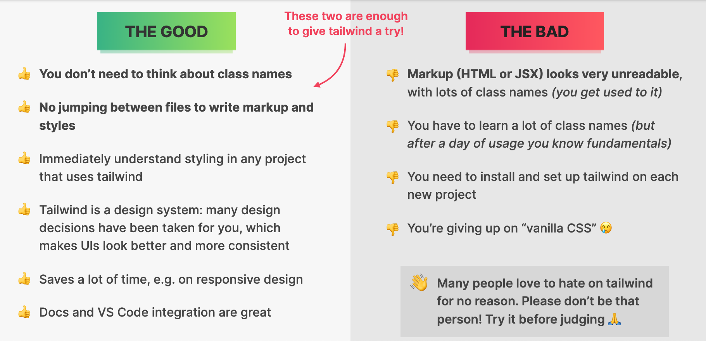
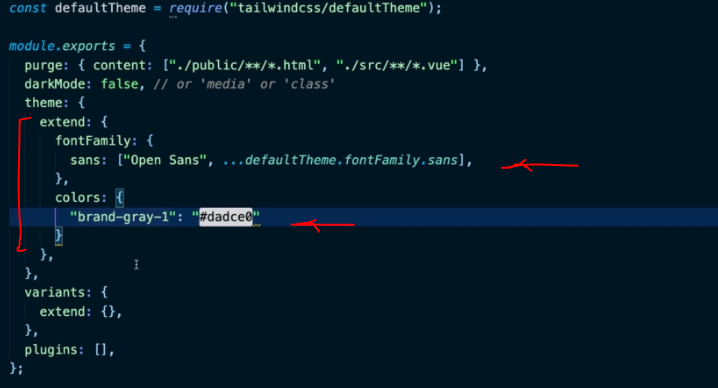
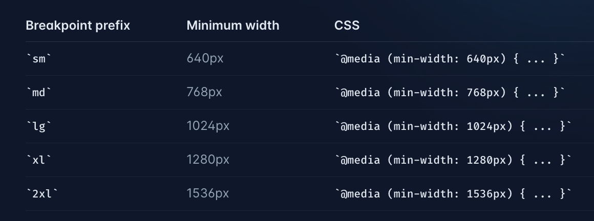

# INDEX

- [INDEX](#index)
  - [Tailwind](#tailwind)
    - [TailwindCSS vs. Bootstrap](#tailwindcss-vs-bootstrap)
  - [PurgeCSS](#purgecss)
    - [Configuring PurgeCSS in the Tailwind configuration file to remove unused CSS](#configuring-purgecss-in-the-tailwind-configuration-file-to-remove-unused-css)
  - [Configuration](#configuration)
    - [Installation](#installation)
    - [Adding custom colors/fonts](#adding-custom-colorsfonts)
    - [Configuring Variants](#configuring-variants)
  - [Custom values](#custom-values)
  - [Functions and Directives](#functions-and-directives)
    - [`@apply`](#apply)
  - [Responsive Design](#responsive-design)
    - [Customize breakpoints](#customize-breakpoints)
  - [Element states and transitions](#element-states-and-transitions)
  - [Usefull Tailwind classes](#usefull-tailwind-classes)

---

## Tailwind

Tailwind CSS is a **utility-first CSS framework** for rapidly building custom user interfaces directly in your markup (`HTML` or `JSX`).

- `utility-first` -> writing tiny classes with one single purpose and then composing them together to build complex designs (layouts).
  - This approach is also called: **"Atomic CSS"**
- Tailwind CSS is a collection of utility classes to set certain values of margins, paddings, font sizes, font weights and many more using classes directly.
  - Instead of adding extra padding to a button using a class such as `.button`, you only need to add the class `.p-3` or `p-4` and you’ll add padding directly to the element.



---

### TailwindCSS vs. Bootstrap

- TailwindCSS is not a UI kit. Unlike **UI kits such as Bootstrap**, Bulma, and Foundation, Tailwind CSS doesn’t have a default theme or built-in UI components. Instead, it comes with pre-designed widgets you can use to build your site from scratch.
- Bootstrap is known for its **responsiveness**, whereas proponents of Tailwind CSS typically value the framework’s **customizability**.
- Another problem with Bootstrap, sites is that they almost always look alike, so this inhibits our ability to incorporate creativity into the dev environment. This is one of the advantages of Tailwind CSS: its ability to easily build complex user interfaces without encouraging any two sites to look the same.

- Tailwind CSS is a **utility-first library**, which means that, unlike Bootstrap, Tailwind doesn’t provide automatically **pre-styled UI-components**. Rather, it provides **utility classes** that help us style our components in certain ways (class for each separate property: width,margin-left,..) and allow us to build our own classes.

---

## PurgeCSS

By default, the uncompressed file size of Tailwind CSS is big, and when compressed it’s 46.2kB. In comparison, the uncompressed file size of Bootstrap CSS is only 143kB. So you might ask, why is it so large? Can I reduce the size of it? The answer is yes, definitely!

The downside is that there are thousands of these utility classes in Tailwind CSS and most of them are not used in the project and the default size of Tailwind CSS is fairly huge compared to other CSS frameworks.

- there is a pretty easy solution to all of this.
- All you need to do to reduce the file size of Tailwind CSS is to remove all of the unused utility classes from the main CSS file -> there is an awesome tool called **PurgeCSS** that goes through your HTML templates and decides which CSS classes are used and unused and based on that remove the unused ones from Tailwind CSS.

### Configuring PurgeCSS in the Tailwind configuration file to remove unused CSS

```js
// in tailwind.config.js
purge: {
    enabled: true,
    content: [
        './**/*.html'
    ]
}
```

---

## Configuration

### Installation

[Guide](https://tailwindcss.com/docs/installation)

> when installing tailwind, you will find that a `tailwind.css` file is added to the `assets` directory, and then imported into the `main.js` file to register all the tailwind classes in the app

- configure the template path in the `tailwind.config.js` file

  ```js
  // tailwind.config.js
  /** @type {import('tailwindcss').Config} */
  export default {
    content: ['./src/**/*.html', './src/**/*.vue', './src/**/*.jsx'], // here we configure the template path to be used by purgecss to remove unused css
    theme: {
      extend: {}
    },
    plugins: []
  };
  ```

- Add tailwind directives to the main css file

  ```css
  /* src/index.css */
  @tailwind base;
  @tailwind components;
  @tailwind utilities;
  ```

- [Optional] -> install [tailwind-prettier extension](https://github.com/tailwindlabs/prettier-plugin-tailwindcss) to format the tailwind classes

---

### Adding custom colors/fonts

you can do that inside the `tailwind.config.js` file

- Here is all the things that we can override in the `tailwind.config.js` file -> [here](https://github.com/tailwindlabs/tailwindcss/blob/master/stubs/config.full.js)



- Adding new custom font-families

  ```js
  // tailwind.config.js
  module.exports = {
    theme: {
      // override the default font-families
      fontFamily: {
        main: ['Roboto', 'sans-serif'],
        secondary: ['Open Sans', 'sans-serif']
      }
    }
  };
  ```

  ```html
  <div class="font-main">...</div>
  <div class="font-secondary">...</div>
  ```

- in order to keep the current classes and add new ones, we use the `extend` property ✅

  ```js
  // tailwind.config.js
  module.exports = {
    theme: {
      extend: {
        // extend the default font-families
        fontFamily: {
          main: ['Roboto', 'sans-serif'],
          secondary: ['Open Sans', 'sans-serif']
        }
      }
    }
  };
  ```

---

### Configuring Variants

The `variants` section of your `tailwind.config.js` file is where you control which variants should be enabled for each core plugin:

- Each property is a core plugin name pointing to an array of variants to generate for that plugin.
- it's only used if it's not supported by default, So check first as it may work out of the box

```js
// tailwind.config.js
module.exports = {
  variants: {
    extend: {
      margin: ['first'], // enables us to apply a different margin class to the first elements in a group (element with first pseudo class),
      backgroundColor: ['active'], // enables us to apply a different background class to the element with active pseudo class,
      borderColor: ['focus-visible', 'first'],
      textColor: ['visited']
    }
  }
};
```

---

## Custom values

- If you want to use specific value for a property like `height` and it's not in the default values, use this method:

  ```html
  <div class="h-[400px]">...</div>
  ```

- It's useful in `css grid`:

  ```html
  <div class="grid grid-rows-[auto_1fr_auto]">...</div>
  <!-- we replace whiteSpace with "_" -->
  ```

---

## Functions and Directives

### `@apply`

It's used to inline any existing utility classes into your own custom CSS.

- it creates a new CSS class that contains all of the styles from the utility classes you passed in, so that it can be reusable

  ```css
  .btn {
    @apply px-4 py-2 rounded-md bg-blue-500 text-white;
  }
  ```

  ```html
  <button class="btn">Button</button>
  ```

- It's used in the main css file that you defined the tailwind directives in

  ```css
  /* src/index.css */
  @tailwind base;
  @tailwind components;
  @tailwind utilities;

  @tailwind components {
    .btn {
      @apply px-4 py-2 rounded-md bg-blue-500 text-white;
    }
  }
  ```

- **Note**

  - By grouping multiple the tailwind utilities into a single class, we're doing the opposite of what Tailwind recommends.
  - an alternative way if you're using components, is to create a reusable component and apply the tailwind classes to it directly

    ```jsx
    // Button.jsx
    export default function Button({ children }) {
      return <button className='px-4 py-2 rounded-md bg-blue-500 text-white'>{children}</button>;
    }
    ```

    ```jsx
    // App.jsx
    import Button from './Button';

    export default function App() {
      return (
        <div className='App'>
          <Button>Button</Button>
        </div>
      );
    }
    ```

---

## Responsive Design

- Tailwind CSS comes with a set of responsive utility classes that can be used to control the appearance of an element on different screen sizes.
- The responsive classes are named using the format: `{{screen}}:{{property}}-{{value}}`

  - `property` is the CSS property you want to apply.
  - `screen` is the breakpoint where the property will take effect.
  - `value` is the value for the property.

  ```html
  <div class="text-center sm:text-left">...</div>

  <div class="mb-4 sm:mb-0">...</div>
  ```

- In tailwind, it uses **Mobile First** approach, which means that the default styles are applied to mobile devices and then the styles are overridden for larger screens.

  - it uses `min-width` media queries to apply the styles for larger screens.
    

  - for example, if you want to apply a margin of `4rem` on mobile devices and `8rem` on larger screens, you can use the following classes:

  ```html
  <!-- Here, we apply 'mb-16' on screens lower than 640px and 'mb-32' on screens larger than 640px -->
  <div class="m-16 sm:m-32">...</div>
  ```

---

### Customize breakpoints

- You can customize the breakpoints in the `tailwind.config.js` file:

  ```js
  // tailwind.config.js
  module.exports = {
    theme: {
      screens: {
        sm: '640px',
        md: '768px',
        lg: '1024px',
        xl: '1280px'
      }
    }
  };
  ```

- more [here](https://tailwindcss.com/docs/screens)

---

## Element states and transitions

- Tailwind CSS comes with a set of utility classes that can be used to style elements based on their state. (`hover`, `focus`, `active`, `disabled`, ...)

  ```html
  <button class="bg-blue-500 hover:bg-blue-700">Button</button>
  ```

- To add transitions to the element, you can use the `transition` utility class:

  - format -> `transition-{{property}}-{{duration}}`
    - only transition `color` -> `transition-colors`
    - only transition `transform` -> `transition-transform`

  ```html
  <button class="bg-blue-500 hover:bg-blue-700 transition-colors duration-500">Button</button>

  <button class="bg-blue-500 hover:bg-blue-700 transition-colors duration-500 ease-in-out">
    Button
  </button>
  ```

---

## Usefull Tailwind classes

- `container` -> to center the content and add a `max-width` to it
- `mx-auto` -> to center the content
