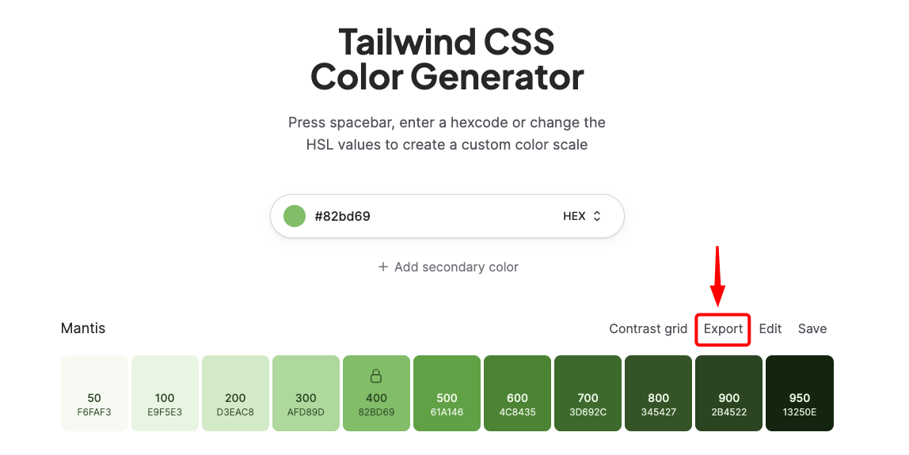
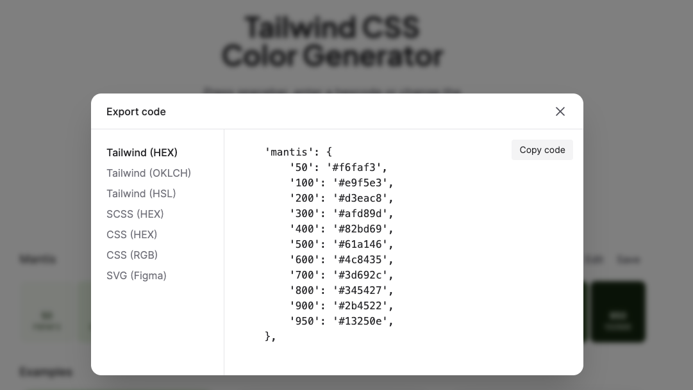
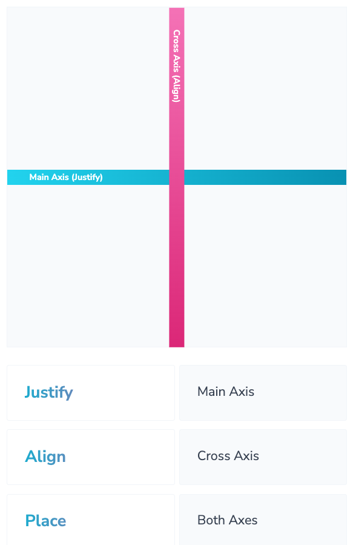
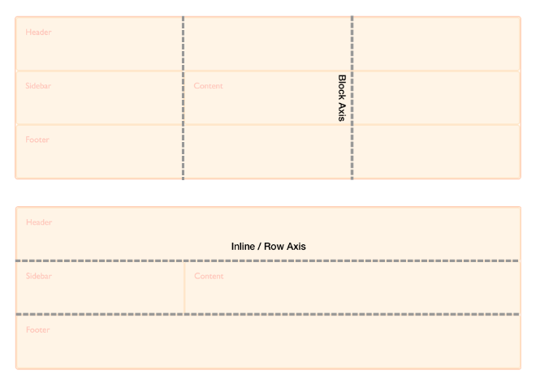
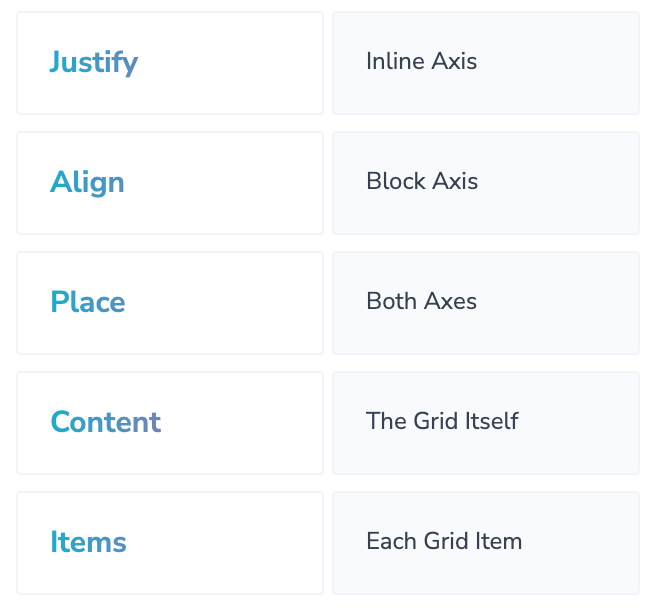

# INDEX

- [INDEX](#index)
  - [Tailwind](#tailwind)
    - [Tailwind Layers](#tailwind-layers)
    - [TailwindCSS vs. Bootstrap](#tailwindcss-vs-bootstrap)
  - [PurgeCSS](#purgecss)
    - [Configuring PurgeCSS in the Tailwind configuration file to remove unused CSS](#configuring-purgecss-in-the-tailwind-configuration-file-to-remove-unused-css)
  - [Configuration](#configuration)
    - [Installation](#installation)
    - [Adding custom colors/fonts](#adding-custom-colorsfonts)
    - [Configuring Variants](#configuring-variants)
  - [Basic Styling](#basic-styling)
    - [Sizing and spacing](#sizing-and-spacing)
    - [Text Sizing](#text-sizing)
    - [Colors](#colors)
    - [Custom values](#custom-values)
  - [Variants](#variants)
    - [Pseudo Classes](#pseudo-classes)
    - [Form Elements Variants](#form-elements-variants)
    - [Peer Modifiers](#peer-modifiers)
    - [Group Modifier](#group-modifier)
    - [Before and After](#before-and-after)
    - [Dark Mode](#dark-mode)
  - [Layout Styles](#layout-styles)
    - [Columns](#columns)
    - [Flexbox](#flexbox)
    - [Grid](#grid)
  - [Functions and Directives](#functions-and-directives)
    - [`@apply`](#apply)
  - [Responsive Design](#responsive-design)
    - [Customize breakpoints](#customize-breakpoints)
  - [Animations and transitions](#animations-and-transitions)
    - [Animation](#animation)
    - [Transition](#transition)
  - [Useful Tailwind classes](#useful-tailwind-classes)
  - [Performance](#performance)

---

## Tailwind

Tailwind CSS is a **utility-first CSS framework** for rapidly building custom user interfaces directly in your markup (`HTML` or `JSX`).

- `utility-first` -> writing tiny classes with one single purpose and then composing them together to build complex designs (layouts).

  - This approach is also called: **"Atomic CSS"**
  - Instead of adding extra padding to a button using a class such as `.button`, you only need to add the class `.p-3` or `p-4` and you’ll add padding directly to the element.

- Bros and cons
  
- Why use it?
  - optimize for the smallest css bundle size possible
  - have all data in one place (markup, styles)
  - easy responsive design implementation
  - easy to customize and extend any part of the framework (unlike `bootstrap` 🥲)
- Resources:
  - [TailwindCSS](https://tailwindcss.com/)
  - [Playground](https://play.tailwindcss.com/)

---

### Tailwind Layers

Tailwind ships with 3 layers:

- `base`

  - Basic styles for raw HTML elements like `h1`, `p`, `a`, `button`, etc.
  - It's like a CSS reset, but it's not a reset -> Default styles for all the elements

    ```css
    @layer base {
      h1 {
        @apply text-2xl font-bold;
      }
      p {
        @apply text-base;
      }
    }
    ```

- `components`

  - Styles for reusable components like `.btn`, `.cards`, `.forms`, etc.

    ```css
    @layer components {
      .btn {
        @apply px-4 py-2 rounded-md bg-blue-500 text-white;
      }
    }
    ```

- `utilities`
  - Super specific one-off utility classes that can be applied to any element. Ex: setting `margin`, `padding`, `width`, `height`, `color`, `font-size`, etc.

---

### TailwindCSS vs. Bootstrap

- TailwindCSS is not a UI kit. Unlike **UI kits such as Bootstrap**, **Bulma**, and **Foundation**, Tailwind CSS doesn’t have a default **theme** or built-in UI components. Instead, it comes with pre-designed widgets you can use to build your site from scratch.
- Bootstrap is known for its **responsiveness**, whereas proponents of Tailwind CSS typically value the framework’s **customizability**.
- Another problem with Bootstrap, sites is that they almost always look alike, so this inhibits our ability to incorporate creativity into the dev environment. This is one of the advantages of Tailwind CSS: its ability to easily build complex user interfaces without encouraging any two sites to look the same.

- Tailwind CSS is a **utility-first library**, which means that, unlike Bootstrap, Tailwind doesn’t provide automatically **pre-styled UI-components**. Rather, it provides **utility classes** that help us style our components in certain ways (class for each separate property: width,margin-left,..) and allow us to build our own classes.

---

## PurgeCSS

It's a tool that removes unused CSS from your stylesheets **(at build time)**, which can dramatically reduce the size of your CSS files and speed up your website.

> By default, the uncompressed file size of Tailwind CSS is big, and when compressed it’s `46.2kB`. In comparison, the uncompressed file size of Bootstrap CSS is only `143kB`. So you might ask, why is it so large? Can I reduce the size of it? The answer is yes, definitely!
>
> The downside is that there are thousands of these utility classes in Tailwind CSS and most of them are not used in the project and the default size of Tailwind CSS is fairly huge compared to other CSS frameworks.

- there is a pretty easy solution to all of this.
- All you need to do to reduce the file size of Tailwind CSS is to remove all of the unused utility classes from the main CSS file -> there is an awesome tool called **PurgeCSS** that goes through your HTML templates and decides which CSS classes are used and unused and based on that remove the unused ones from Tailwind CSS.

### Configuring PurgeCSS in the Tailwind configuration file to remove unused CSS

```js
// in tailwind.config.js
purge: {
    enabled: true,
    content: [
        './**/*.html'
    ]
}
```

---

## Configuration

### Installation

[Guide](https://tailwindcss.com/docs/installation)

> - when installing tailwind, you will find that a `tailwind.css` file is added to the `assets` directory, and then imported into the `main.js` file to register all the tailwind classes in the app
>
> - Don't use the CDN installation in production, as it's designed for development only

- configure the template path in the `tailwind.config.js` file

  ```js
  // tailwind.config.js
  /** @type {import('tailwindcss').Config} */
  export default {
    content: ['./src/**/*.html', './src/**/*.vue', './src/**/*.jsx'], // here we configure the template path to be used by purgecss to remove unused css
    theme: {
      extend: {}
    },
    plugins: []
  };
  ```

- Add tailwind directives to the main css file

  ```css
  /* src/index.css */
  @tailwind base;
  @tailwind components;
  @tailwind utilities;
  ```

- [Optional] -> install [tailwind-prettier extension](https://github.com/tailwindlabs/prettier-plugin-tailwindcss) to format the tailwind classes

---

### Adding custom colors/fonts

you can do that inside the `tailwind.config.js` file

- Here is all the things that we can override in the `tailwind.config.js` file -> [here](https://github.com/tailwindlabs/tailwindcss/blob/master/stubs/config.full.js)
  

- Adding new custom font-families & colors

  ```js
  // tailwind.config.js
  module.exports = {
    theme: {
      // override the default font-families
      fontFamily: {
        main: ['Roboto', 'sans-serif'],
        secondary: ['Open Sans', 'sans-serif']
      },
      // add new custom colors
      colors: {
        primary: '#3490dc',
        secondary: '#ffed4a',
        danger: '#e3342f'
      }
    }
  };
  ```

  ```html
  <div class="font-main">...</div>
  <div class="font-secondary text-primary">...</div>
  ```

- in order to keep the current classes and add new ones, we use the `extend` property ✅

  ```js
  // tailwind.config.js
  module.exports = {
    theme: {
      extend: {
        // extend the default font-families
        fontFamily: {
          main: ['Roboto', 'sans-serif'],
          secondary: ['Open Sans', 'sans-serif']
        }
      }
    }
  };
  ```

---

### Configuring Variants

The `variants` section of your `tailwind.config.js` file is where you control which variants should be enabled for each core plugin:

- Each property is a core plugin name pointing to an array of variants to generate for that plugin.
- it's only used if it's not supported by default, So check first as it may work out of the box

```js
// tailwind.config.js
module.exports = {
  variants: {
    extend: {
      margin: ['first'], // enables us to apply a different margin class to the first elements in a group (element with first pseudo class),
      backgroundColor: ['active'], // enables us to apply a different background class to the element with active pseudo class,
      borderColor: ['focus-visible', 'first'],
      textColor: ['visited']
    }
  }
};
```

---

## Basic Styling

### Sizing and spacing

- Tailwind CSS comes with a set of utility classes that can be used to control the size and spacing of elements.

  - `m` -> margin
  - `p` -> padding
  - `w` -> width
  - `h` -> height

  ```html
  <div class="m-4 p-4 w-64 h-64">...</div>
  ```

- The classes are named using the format: `{{property}}-{{value}}` where `property` is the CSS property you want to apply and `value` is the value for the property.

  - `m-4` -> margin of `1rem`
  - `m-8` -> margin of `2rem`
  - `m-12` -> margin of `3rem`
  - `m-16` -> margin of `4rem`
  - `m-20` -> margin of `5rem`
  - `m-24` -> margin of `6rem`
  - `m-auto` -> margin of `auto`

- To control the margin and padding on the different sides of an element, you can use the following classes:

  - `m-{{side}}-{{value}}` -> to control the margin on the different sides of an element

    - `m-t-4` -> margin-top of `1rem`
    - `m-r-8` -> margin-right of `2rem`
    - `m-b-12` -> margin-bottom of `3rem`
    - `m-l-16` -> margin-left of `4rem`
    - `mx-4` -> X-Axis -> margin-left and margin-right of `1rem`
    - `my-8` -> Y-Axis -> margin-top and margin-bottom of `2rem`

- We can also use the `negative` values:

  - `m-[-4rem]` -> margin of `-4rem`
  - `m-[-8rem]` -> margin of `-8rem`
  - `m-[-12rem]` -> margin of `-12rem`
  - `m-[-16rem]` -> margin of `-16rem`
  - `m-[-20rem]` -> margin of `-20rem`
  - `m-[-24rem]` -> margin of `-24rem`

- `space-x` and `space-y` -> to control the space between the elements in a container (without the need to use flexbox)

  ```html
  <div class="space-x-4">
    <button>Button 1</button>
    <button>Button 2</button>
    <button>Button 3</button>
  </div>
  ```

  - It works by adding a margin to the right of each element except the last one.

---

### Text Sizing

- Tailwind CSS comes with a set of utility classes that can be used to control the size of text.

  | Utility class | Font size | Line height |
  | ------------- | --------- | ----------- |
  | `text-xs`     | 0.75rem   | 1rem        |
  | `text-sm`     | 0.875rem  | 1.25rem     |
  | `text-base`   | 1rem      | 1.5rem      |
  | `text-lg`     | 1.125rem  | 1.75rem     |
  | `text-xl`     | 1.25rem   | 1.75rem     |
  | `text-2xl`    | 1.5rem    | 2rem        |
  | ...           | ...       | ...         |

  ```html
  <div class="text-2xl">...</div>
  ```

---

### Colors

- Tailwind CSS comes with a set of utility classes that can be used to control the color of text and background.

  - `text-{{color}}` -> to set the text color
  - `bg-{{color}}` -> to set the background color

  ```html
  <div class="text-blue-500 bg-gray-200">...</div>
  ```

- The colors are named using the format: `{{color}}-{{value}}` where `color` is the color name and `value` is the value for the color.

  - `gray-100` -> `#f7fafc`
  - `gray-200` -> `#edf2f7`
  - `gray-300` -> `#e2e8f0`
  - `gray-400` -> `#cbd5e0`
  - `gray-500` -> `#a0aec0`
  - `gray-600` -> `#718096`
  - `gray-700` -> `#4a5568`
  - `gray-800` -> `#2d3748`
  - `gray-900` -> `#1a202c`

- Linear Gradients

  - You have to use 3 classes to create a linear gradient:

    - `bg-gradient-to-{{direction}}` -> to set the direction of the gradient
    - `from-{{color}}` -> to set the start color of the gradient
    - `to-{{color}}` -> to set the end color of the gradient

    ```html
    <div class="bg-gradient-to-r from-blue-500 to-green-500">...</div>
    ```

- To add a custom color, you can use the `colors` property in the `tailwind.config.js` file:

  ```js
  // tailwind.config.js
  module.exports = {
    theme: {
      extend: {
        colors: {
          primary: '#3490dc',
          secondary: '#ffed4a',
          danger: '#e3342f'
          mandy: {
            50: '#fef2f2',
            100: '#fee2e2',
            200: '#fecaca',
            300: '#fca5a5',
            400: '#f87171',
            500: '#ef4444',
            600: '#dc2626',
            700: '#b91c1c',
            800: '#991b1b',
            900: '#7f1d1d'
          }
        }
      }
    }
  };
  ```

  ```html
  <div class="text-primary bg-secondary">...</div>

  <div class="text-mandy-500 bg-mandy-200">...</div>
  ```

- Notes:
  - When adding a new color, you can use a **generator website** like [UI Colors](https://uicolors.app/) to generate the shades of the color
    
    

---

### Custom values

- If you want to use specific value for a property like `height` and it's not in the default values, use this escape hatch: `h-[400px]`

  ```html
  <div class="h-[400px]">...</div>
  ```

- It's useful in `css grid`:

  ```html
  <div class="grid grid-rows-[auto_1fr_auto]">...</div>
  <!-- we replace whiteSpace with "_" -->
  ```

---

## Variants

In Tailwind, **variants** are utility classes that apply their styles conditionally based on the state of an element.

### Pseudo Classes

- Tailwind CSS comes with a set of utility classes that can be used to style elements based on their state.
- It uses this syntax: `{{property}}:{{value}}`

  - `hover:{{property}}-{{value}}` -> to apply styles when the element is hovered

    ```html
    <button class="bg-blue-500 hover:bg-blue-700">Button</button>
    ```

- There're also some other classes that are useful for each state of an element:

  - `empty` -> to apply styles when the element is empty

    - it's similar to conditional classes in React (like add this class when the array is empty)

    ```jsx
    <!-- react -->
    <div className={`bg-blue-500 ${items.length === 0 && 'bg-gray-200'}`}>...</div>

    <!-- tailwind -->
    <div class="bg-blue-500 empty:bg-gray-200">...</div>
    ```

---

### Form Elements Variants

- Placeholder

  - `placeholder-{{color}}` -> to set the color of the placeholder text
  - `placeholder-opacity-{{value}}` -> to set the opacity of the placeholder text
  - `placeholder-{{color}}-{{value}}` -> to set the color and opacity of the placeholder text

    ```html
    <input type="text" class="placeholder-gray-500" placeholder="Enter your name" />
    ```

- Outline

  ```html
  <input type="text" class="outline-none" />
  ```

  - `ring-{{color}}` -> to set the color of the outline
  - `ring-{{value}}` -> to set the width of the outline

- Accent

  - `accent-{{color}}` -> to set the color of the accent

  ```html
  <input type="checkbox" class="accent-blue-500" />
  <input type="radio" class="accent-blue-500" />
  ```

- Valid / Invalid

  - `valid:{{property}}-{{value}}` -> to apply styles when the element is valid
  - `invalid:{{property}}-{{value}}` -> to apply styles when the element is invalid

  ```html
  <input type="email" class="valid:border-green-500" />

  <input type="email" class="invalid:border-red-500" />
  ```

---

### Peer Modifiers

In Tailwind CSS, the `peer` modifier is designed to style an element based on the state of a **“sibling” element**. This makes it particularly useful for creating user interfaces where the appearance of an element should change based on user interactions with another element on the same DOM level.

> It's like **Combinators** in CSS, or **conditional classes** in React

- **Peering**: You apply the peer class to an element that you want to “watch” for state changes like `focus`, `hover`, etc.
- **Conditional Styling**: On the sibling element you wish to style, you can use classes like `peer-hover:`, `peer-focus:`, etc., to apply styles when the “peer” element has a particular state.

- Example

  ```html
  <div class="space-y-1">
    <label for="input" class="block text-sm font-semibold">Email Address</label>
    <input
      id="input"
      type="email"
      class="peer block invalid:border-red-500 focus:border-purple-500 focus:ring-4 disabled:bg-purple-50"
      placeholder="Input Field" />

    <p class="invisible text-red-600 peer-invalid:visible peer-focus:invisible">
      Must be a valid email address.
    </p>
  </div>
  ```

  - Here, the paragraph will be visible when the input is invalid and invisible when the input is focused

---

### Group Modifier

The `group` modifier in Tailwind CSS is a powerful feature that allows you to conditionally style elements based on their **parent’s** hover, focus, or other states. This is particularly useful for creating more interactive and dynamic components where you want to affect multiple elements within a parent container based on some interaction.

- **Grouping**: You can add the `group` class to a parent container to indicate that it will control the state for its children.
- **Conditional Styling**: Within the children, you can then use classes like `group-hover:`, `group-focus:`, etc., to apply styles when the parent has that particular state.

- Example

  ```html
  <div class="group">
    <button class="bg-blue-500 text-white">Button</button>
    <p class="hidden group-hover:block">This is a paragraph</p>
  </div>
  ```

  - Here, the paragraph will be visible when the parent element with `group` class is hovered

---

### Before and After

Tailwind also provides variants for adding content before and after an element. Unsurprisingly, these map to the `:before` and `:after` pseudo-classes.

- You can also use the content of an attribute to populate the content of a `before:` or `after:` variant.

  ```html
  <div class="relative">
    <button class="before:bg-blue-500 before:content-[attr(data-text)]">Button</button>
  </div>
  ```

  - Here, the button will have a blue background and the content of the `data-text` attribute will be displayed before the button

---

### Dark Mode

To enable dark mode in Tailwind CSS, you can use the `dark:` variant. This variant is designed to apply styles when the user has enabled dark mode in their operating system or browser.

**Steps**:

1. Add the `dark` class to the configuration file

   ```js
   // tailwind.config.js
   module.exports = {
     darkMode: 'class' // means that the dark mode will be enabled when the `dark` class is added to the `html` element, and will cascade down to all the child elements
   };
   ```

2. Add the `dark` class to the `html` element, or the container element

   ```html
   <html class="dark">
     ...
   </html>
   ```

3. Use the `dark:` variant to apply styles in dark mode

   ```html
   <button class="bg-blue-500 dark:bg-blue-900">Button</button>
   ```

   - Here, the button will have a blue background in light mode and a dark blue background in dark mode

4. Now you can toggle the dark mode by adding the `dark` class to the `html` element

   ```js
   // Enable dark mode
   document.documentElement.classList.toggle('dark');

   // Disable dark mode
   document.documentElement.classList.remove('dark');
   ```

---

## Layout Styles

### Columns

The `columns` CSS shorthand property—and the associated Tailwind class, make it easy to masonry-like layouts.

- Example having 3 columns with a width of `33.33%` each

  ```html
  <div class="columns-3">
    <div>1</div>
    <div>2</div>
    <div>3</div>
    <div>4</div>
    <div>5</div>
    <div>6</div>
  </div>
  ```

  - Here, the elements inside the container will be displayed in 3 columns

- We can also specify the desired width of the columns and then let CSS figure out the rest.

  ```html
  <div class="columns-3xs">
    <div>1</div>
    <div>2</div>
    <div>3</div>
    <div>4</div>
    <div>5</div>
    <div>6</div>
  </div>
  ```

  - Here, the elements inside the container will have a width of `3xs` each and will be displayed in whatever number of columns that fit the container

---

### Flexbox



- To enable flexbox on an element, you can use the `flex` utility class. Then you can use the following classes to control the flexbox properties:

  - `flex-row` -> to set the flex direction to row
  - `flex-col` -> to set the flex direction to column
  - `flex-wrap` -> to allow the elements to wrap
  - `justify-center` -> to center the elements along the main axis
  - `items-center` -> to center the elements along the cross axis
  - `self-center` -> to center the element along the cross axis
  - `space-x-4` -> to add space between the elements along the main axis
  - `space-y-4` -> to add space between the elements along the cross axis
  - `gap-{size}` -> to add space between the elements along the main and cross axis
  - `order-{{value}}` -> to change the order of the element
  - ...

- Example

  ```html
  <div class="flex flex-row flex-wrap justify-center items-center gap-4">
    <div class="order-3">1</div>
    <div class="order-2">2</div>
    <div class="order-1">3</div>
  </div>
  ```

- You can use this [Playground website](https://tailwind-workshop.vercel.app/playgrounds/flex?boxes=3&height=600&width=w-20) to test the flexbox classes in Tailwind

---

### Grid




- To enable CSS grid on an element, you can use the `grid` utility class. Then you can use the following classes to control the grid properties:

  - `grid-cols-{{value}}` -> to set the number of columns in the grid

    ```html
    <div class="grid grid-cols-3">...</div>

    <!-- or with custom values -->

    <div class="grid grid-cols-[100px_1fr_2fr]">...</div>
    ```

  - `grid-rows-{{value}}` -> to set the number of rows in the grid
  - `col-span-{{value}}` -> to set the number of columns an element should span
  - `row-span-{{value}}` -> to set the number of rows an element should span
  - `col-start-{{value}}` -> to set the start position of the element along the column axis
  - `row-start-{{value}}` -> to set the start position of the element along the row axis
  - `gap-{size}` -> to add space between the elements along the main and cross axis
  - ...

- Example

  ```html
  <div class="grid grid-cols-3 grid-rows-2 gap-4">
    <div class="col-span-2 row-span-2">1</div>
    <div>2</div>
    <div>3</div>
    <div>4</div>
    <div>5</div>
    <div>6</div>
  </div>
  ```

- You can use this [Playground website](https://tailwind-workshop.vercel.app/playgrounds/grid?boxes=6&height=600&width=w-20) to test the grid classes in Tailwind

---

## Functions and Directives

### `@apply`

It's used to inline any existing utility classes into your own custom CSS.

- it creates a new CSS class that contains all of the styles from the utility classes you passed in, so that it can be reusable

  ```css
  .btn {
    @apply px-4 py-2 rounded-md bg-blue-500 text-white;
  }
  ```

  ```html
  <button class="btn">Button</button>
  ```

- It's used in the main css file that you defined the tailwind directives in

  ```css
  /* src/index.css */
  @tailwind base;
  @tailwind components;
  @tailwind utilities;

  @tailwind components {
    .btn {
      @apply px-4 py-2 rounded-md bg-blue-500 text-white;
    }
  }
  ```

- **Note**

  - By grouping multiple the tailwind utilities into a single class, we're doing the opposite of what Tailwind recommends.
  - an alternative way if you're using components, is to create a reusable component and apply the tailwind classes to it directly

    ```jsx
    // Button.jsx
    export default function Button({ children }) {
      return <button className='px-4 py-2 rounded-md bg-blue-500 text-white'>{children}</button>;
    }
    ```

    ```jsx
    // App.jsx
    import Button from './Button';

    export default function App() {
      return (
        <div className='App'>
          <Button>Button</Button>
        </div>
      );
    }
    ```

---

## Responsive Design

- Tailwind CSS comes with a set of responsive utility classes that can be used to control the appearance of an element on different screen sizes.
- The responsive classes are named using the format: `{{screen}}:{{property}}-{{value}}`

  - `property` is the CSS property you want to apply.
  - `screen` is the breakpoint where the property will take effect.
  - `value` is the value for the property.

  ```html
  <div class="text-center sm:text-left">...</div>

  <div class="mb-4 sm:mb-0">...</div>
  ```

- In tailwind, it uses **Mobile First** approach, which means that the default styles are applied to mobile devices and then the styles are overridden for larger screens.

  - it uses `min-width` media queries to apply the styles for larger screens.
    

  - for example, if you want to apply a margin of `4rem` on mobile devices and `8rem` on larger screens, you can use the following classes:

  ```html
  <!-- Here, we apply 'mb-16' on screens lower than 640px and 'mb-32' on screens larger than 640px -->
  <div class="m-16 sm:m-32">...</div>
  ```

---

### Customize breakpoints

- You can customize the breakpoints in the `tailwind.config.js` file:

  ```js
  // tailwind.config.js
  module.exports = {
    theme: {
      screens: {
        sm: '640px',
        md: '768px',
        lg: '1024px',
        xl: '1280px'
      }
    }
  };
  ```

- more [here](https://tailwindcss.com/docs/screens)

---

## Animations and transitions

### Animation

Tailwind comes with a few built-in animations that you can use.

> You will find them [here](https://tailwindcss.com/docs/animation)

- `pulse` -> to create a pulsing animation
- `spin` -> to create a spinning animation
- `bounce` -> to create a bouncing animation

```html
<div class="w-16 h-16 bg-blue-500 animate-pulse">...</div>

<div class="w-16 h-16 bg-blue-500 animate-spin">...</div>

<div class="w-16 h-16 bg-blue-500 animate-bounce">...</div>
```

---

### Transition

- Tailwind CSS comes with a set of utility classes that can be used to style elements based on their state. (`hover`, `focus`, `active`, `disabled`, ...)

  ```html
  <button class="bg-blue-500 hover:bg-blue-700">Button</button>
  ```

- To add transitions to the element, you can use the `transition` utility class:

  - format -> `transition-{{property}}-{{duration}}`
    - only transition `color` -> `transition-colors`
    - only transition `transform` -> `transition-transform`

  ```html
  <button class="bg-blue-500 hover:bg-blue-700 transition-colors duration-500">Button</button>

  <button class="bg-blue-500 hover:bg-blue-700 transition-colors duration-500 ease-in-out">
    Button
  </button>
  ```

---

## Useful Tailwind classes

- `container` -> to center the content and add a `max-width` to it
- `mx-auto` -> to center the content
- `sr-only` -> to hide the element visually but keep it accessible to screen readers

---

## Performance

- File size

  - **purge unused styles**

    - One of the most important features Tailwind offers is the ability to purge unused styles. This can drastically reduce the size of your production CSS file. Make sure you configure the purge option correctly in your `tailwind.config.js` file.

      ```js
      // tailwind.config.js
      module.exports = {
        purge: {
          enabled: true,
          content: ['./src/**/*.html', './src/**/*.vue', './src/**/*.jsx']
        }
      };
      ```

  - **JIT mode**

    - Just-In-Time (JIT) mode is a new feature in Tailwind CSS that compiles your utility classes on-demand, ensuring that only the styles you use are included in your build, offering a great performance benefit.

      ```js
      // tailwind.config.js
      module.exports = {
        mode: 'jit'
      };
      ```

- Best practices
  - Avoid `@apply` overuse
    - it can result in a lot of duplicated styles in your CSS file
  - Mobile-first
    - Tailwind uses a mobile-first approach, so make sure you're using the responsive classes correctly
  - Tree-shaking
    - Make sure you're using the purge option in your `tailwind.config.js` file to remove unused styles