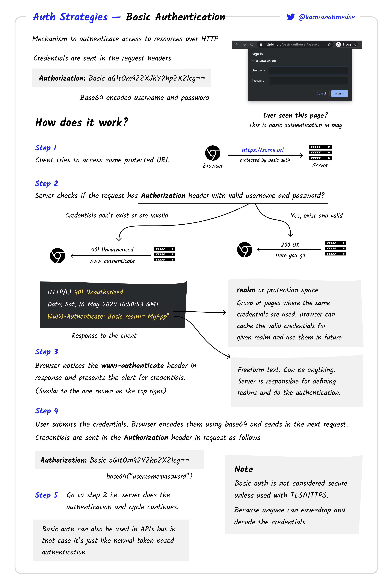
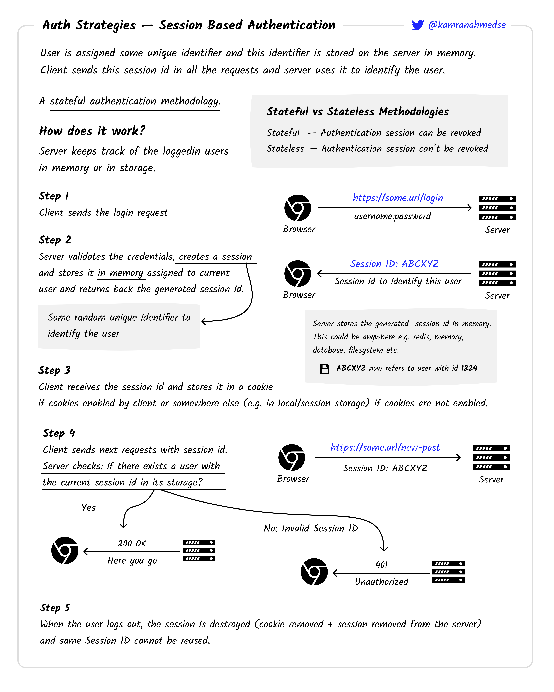
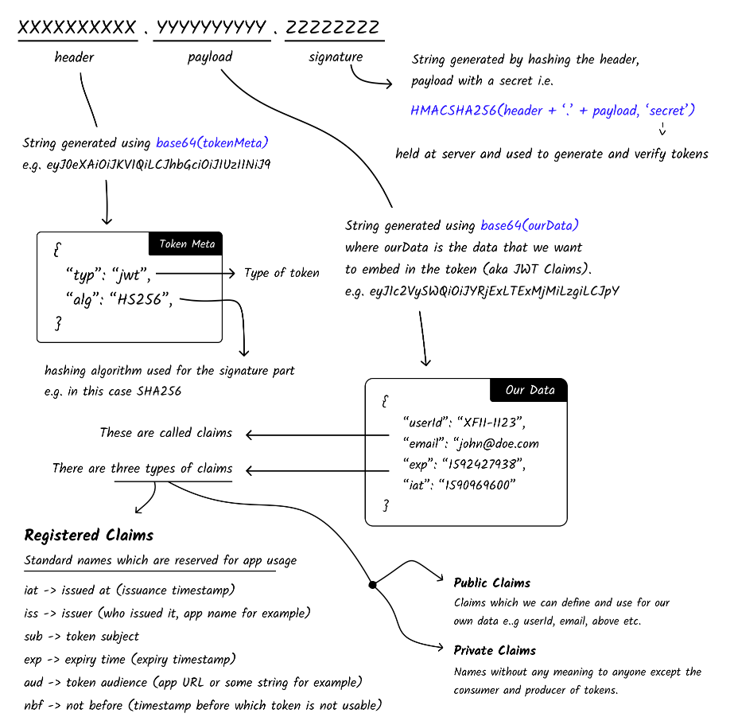

# INDEX

- [INDEX](#index)
  - [Authentication](#authentication)
  - [Basic Authentication](#basic-authentication)
    - [Example of Basic Authentication](#example-of-basic-authentication)
  - [Session Based Authentication](#session-based-authentication)
    - [Example of Session Based Authentication](#example-of-session-based-authentication)
  - [Token Based Authentication](#token-based-authentication)
    - [Example of Token Based Authentication](#example-of-token-based-authentication)
  - [JWT Authentication](#jwt-authentication)
    - [Example of JWT Authentication](#example-of-jwt-authentication)
  - [OAuth](#oauth)
    - [Example of OAuth](#example-of-oauth)
  - [SSO (Single Sign-On)](#sso-single-sign-on)

---

## Authentication

**Authentication strategies** are methods or techniques used to verify the identity of a user or system in order to grant access to a protected resource.

- There are several different authentication strategies that can be used, including:
  - Basic Authentication
  - Session Based Authentication
  - Token Based Authentication
  - JWT Authentication
  - OAuth
  - SSO

---

## Basic Authentication

It's a simple authentication scheme built into the `HTTP` protocol. The client sends `HTTP` requests with the `Authorization` `header` that contains the word Basic word followed by a space and a base64-encoded string `username:password`.

- Credentials are sent in the `Authorization` header of the `HTTP` request **in each request (BAD)**.
- Username and password are combined into a string `"username:password"`, and then `base64` encoded.

**Steps**:


### Example of Basic Authentication

- Client

  ```js
  const username = 'john';
  const password = 'myPassword';
  const encodedCredentials = btoa(`${username}:${password}`);

  const options = {
    headers: {
      Authorization: `Basic ${encodedCredentials}`
    }
  };

  fetch('https://api.example.com/user', options)
    .then(response => response.json())
    .then(data => console.log(data));
  ```

- Server

  ```js
  const express = require('express');
  const app = express();

  const users = [{ id: 1, username: 'john', password: 'myPassword', email: 'john@example' }];

  app.get('/user', (req, res) => {
    const authHeader = req.headers.authorization;
    if (authHeader) {
      const token = authHeader.split(' ')[1];
      const credentials = Buffer.from(token, 'base64').toString('ascii');
      const [username, password] = credentials.split(':');
      const user = users.find(user => user.username === username && user.password === password);
      if (user) {
        res.json(user);
      } else {
        res.status(401).json({ message: 'Invalid credentials' });
      }
    } else {
      res.status(401).json({ message: 'Not authenticated' });
    }
  });

  app.listen(5000, () => console.log('Server running on port 5000'));
  ```

---

## Session Based Authentication

The server will create a session for the user after the user logs in, typically by generating a unique session identifier (a long, random string of characters, like: `xZ3a5c`) and sending it to the client as a `cookie`.

- The `cookie` is usually stored in the browser and sent with every request made to the same server.
- The server verifies the `session` and sends a response with the requested data only if the `session` is valid.
- The `session` is stored on the server (in memory, or more typically in a database).
  - so if the server restarts, the `session` is lost.

**Steps**:


### Example of Session Based Authentication

- Client

  ```js
  const username = 'john';
  const password = 'myPassword';

  const options = {
    method: 'POST',
    headers: {
      'Content-Type': 'application/json'
    },
    body: JSON.stringify({ username, password })
  };

  fetch('https://api.example.com/login', options)
    .then(response => response.json())
    .then(data => {
      // data: { message: 'Login successful', sessionId: 'xZ3a5c' }
      const sessionId = data.sessionId;
      const options = {
        headers: {
          Cookie: `sessionId=${sessionId}`
        }
      }; // use options for every future request

      fetch('https://api.example.com/user', options)
        .then(response => response.json())
        .then(data => console.log(data));
    });
  ```

- Server

  ```js
  const express = require('express');
  const app = express();

  const users = [{ id: 1, username: 'john', password: 'myPassword', email: 'john@example' }];

  app.use(express.json());

  app.post('/login', (req, res) => {
    const { username, password } = req.body;
    const user = users.find(user => user.username === username && user.password === password);
    if (user) {
      const sessionId = generateId();
      sessions[sessionId] = { userId: user.id }; // store the session on the server
      res.json({ message: 'Login successful', sessionId });
    } else {
      res.status(401).json({ message: 'Invalid credentials' });
    }
  });

  app.get('/user', (req, res) => {
    const sessionId = req.headers.cookie.split('=')[1]; // get the sessionId from the cookie
    const session = sessions[sessionId]; // get the session from the server
    if (session) {
      const user = users.find(user => user.id === session.userId);
      if (user) {
        res.json(user);
      } else {
        res.status(404).json({ message: 'User not found' });
      }
    } else {
      res.status(401).json({ message: 'Not authenticated' });
    }
  });

  app.listen(5000, () => console.log('Server running on port 5000'));
  ```

---

## Token Based Authentication

The server creates a `token` and sends it to the client in response to a successful login request. The client then sends the `token` back to the server for every subsequent request, so the server knows the request comes from a particular identity.

- Unlike basic authentication, the token is sent in the `Authorization` header of `HTTP` requests instead of the `username` and `password`.
- The `token` is a string generated by the server and then signed using a secret key.

  - It has an expiry date, so it's not valid forever.
  - It's sent in the `Authorization` header of `HTTP` requests.
  - It has data that can be decoded and used in the application.
  - Server doesn't need to store the `token` on the server **(Stateless)**. Because the `token` is signed, the server can verify its authenticity without storing it.

- Examples of Token Based Authentication:
  - `SWT` (Simple Web Token)
  - `JWT` (JSON Web Token)
  - `OAuth` (Open Authorization)
  - `SAML` (Security Assertion Markup Language)

**Steps**:


### Example of Token Based Authentication

- Client

  ```js
  const username = 'john';
  const password = 'myPassword';

  const options = {
    method: 'POST',
    headers: {
      'Content-Type': 'application/json'
    },
    body: JSON.stringify({ username, password })
  };

  fetch('https://api.example.com/login', options)
    .then(response => response.json())
    .then(data => {
      // data: { message: 'Login successful', token: 'eyJhbGciOiJIUzI1NiIsInR5cCI6IkpXVCJ9...' }
      const token = data.token;
      const options = {
        headers: {
          Authorization: `Bearer ${token}` // 'Bearer' is a convention
        }
      }; // use options for every future request

      fetch('https://api.example.com/user', options)
        .then(response => response.json())
        .then(data => console.log(data));
    });
  ```

- Server

  ```js
  const express = require('express');
  const app = express();

  const users = [{ id: 1, username: 'john', password: 'myPassword', email: 'john@example' }];

  app.use(express.json());

  app.post('/login', (req, res) => {
    const { username, password } = req.body;
    const user = users.find(user => user.username === username && user.password === password);
    if (user) {
      const token = generateToken(user.id); // generate a token using the secret key
      res.json({ message: 'Login successful', token });
    } else {
      res.status(401).json({ message: 'Invalid credentials' });
    }
  });

  app.get('/user', (req, res) => {
    const authHeader = req.headers.authorization;
    if (authHeader) {
      const token = authHeader.split(' ')[1];
      const userId = verifyToken(token); // verify the token using the secret key
      if (userId) {
        const user = users.find(user => user.id === userId);
        if (user) {
          res.json(user);
        } else {
          res.status(404).json({ message: 'User not found' });
        }
      } else {
        res.status(401).json({ message: 'Invalid token' });
      }
    } else {
      res.status(401).json({ message: 'Not authenticated' });
    }
  });

  app.listen(5000, () => console.log('Server running on port 5000'));
  ```

---

## JWT Authentication

`JWT` is a standard for representing claims securely between two parties. It's a self-contained token that contains information about a user or system.

- It's a string that has three parts separated by dots. Each part is a `base64` encoded string of the **header**, **payload**, and **signature**.
  

  - **header** contains information about the type of the token and the hashing algorithm used to sign it.
  - **payload** contains the claims (data).
  - **signature** is used to verify that the sender of the JWT is who it says it is and to ensure that the message wasn't changed along the way.

- How it works:
  - Same as any other token based authentication. the only difference is how the token is generated and verified.
    

### Example of JWT Authentication

- Client

  - Same as token based authentication.

- Server

  ```js
  const express = require('express');
  const jwt = require('jsonwebtoken');
  const app = express();

  const users = [{ id: 1, username: 'john', password: 'myPassword', email: 'john@example' }];

  app.use(express.json());

  app.post('/login', (req, res) => {
    const { username, password } = req.body;
    const user = users.find(user => user.username === username && user.password === password);
    if (user) {
      const token = jwt.sign({ userId: user.id }, 'secretKey'); // generate a token using the secret key
      res.json({ message: 'Login successful', token });
    } else {
      res.status(401).json({ message: 'Invalid credentials' });
    }
  });

  app.get('/user', (req, res) => {
    const authHeader = req.headers.authorization;
    if (authHeader) {
      const token = authHeader.split(' ')[1];
      jwt.verify(token, 'secretKey', (err, data) => {
        if (err) {
          res.status(401).json({ message: 'Invalid token' });
        } else {
          const user = users.find(user => user.id === data.userId);
          if (user) {
            res.json(user);
          } else {
            res.status(404).json({ message: 'User not found' });
          }
        }
      });
    } else {
      res.status(401).json({ message: 'Not authenticated' });
    }
  });

  app.listen(5000, () => console.log('Server running on port 5000'));
  ```

---

## OAuth

`OAuth` is an open standard for access delegation. It allows users to grant **third-party** applications access to their data without sharing their passwords.

- It's a protocol that allows a user to grant limited access to their resources on one site, to another site, without having to expose their credentials.
  - For example, you can use your `Google` account to log in to `Twitter` without having to create a new account specifically for `Twitter`.
  - This exposes your `Google` account to `Twitter` without sharing your `Google` credentials with `Twitter`.
- There're two versions of `OAuth`:
  - `OAuth 1.0` (older version)
  - `OAuth 2.0` (newer version) ✅
- How it works:
  1. Authorization code grant
     
  2. Implicit grant
     - Similar to the authorization code grant, but the access token is returned immediately after the user gives consent.
  3. Client credentials grant
     - Used when the client is the resource owner.
     - No user interaction is needed.
     - For example, a server-to-server interaction.
  4. Password grant
     - Used when the client has the user's username and password.
     - No user interaction is needed.
     - For example, a mobile app that has the user's username and password.
  5. Device grant

### Example of OAuth

- Client

  ```js
  const clientId = '1234567890';
  const redirectUri = 'https://example.com/oauth/callback';

  const url = `https://api.example.com/oauth/authorize?client_id=${clientId}&redirect_uri=${redirectUri}&response_type=code`;

  window.location.replace(url);
  ```

- Server

  ```js
  const express = require('express');
  const app = express();

  const users = [{ id: 1, username: 'john', password: 'myPassword', email: 'john@example' }];

  app.use(express.json());

  app.get('/oauth/callback', (req, res) => {
    const { code } = req.query;
    const token = generateToken(code); // generate a token using the secret key
    res.json({ message: 'Login successful', token });
  });

  app.get('/user', (req, res) => {
    const authHeader = req.headers.authorization;
    if (authHeader) {
      const token = authHeader.split(' ')[1];
      const userId = verifyToken(token); // verify the token using the secret key
      if (userId) {
        const user = users.find(user => user.id === userId);
        if (user) {
          res.json(user);
        } else {
          res.status(404).json({ message: 'User not found' });
        }
      } else {
        res.status(401).json({ message: 'Invalid token' });
      }
    } else {
      res.status(401).json({ message: 'Not authenticated' });
    }
  });

  app.listen(5000, () => console.log('Server running on port 5000'));
  ```

---

## SSO (Single Sign-On)

`SSO` is an authentication strategy that allows a user to login with a single username and password to several related, but independent services.

- It's a property of access control of multiple related, yet independent, software systems.
- for example, you can use your `Google` account to log in to `YouTube`, `Gmail`, `Google Drive`, etc. without having to create a new account specifically for each service.
  
- More, here [SSO](https://roadmap.sh/guides/sso)

---

[⬆ back to top](#index)
