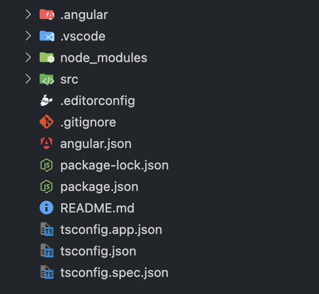

# INDEX

- [INDEX](#index)
  - [Configuration Files](#configuration-files)

---

## Configuration Files

They're files that are used inside the project to store configuration settings, such as:

- `.gitignore`: a file that tells `Git` which files or folders to ignore in a project.
- `.editorconfig`: a file that defines coding styles and editor settings for a project.
- `.eslintrc`: a file that defines rules for `ESLint` (a tool for identifying and reporting on patterns found in `ECMAScript`/`JavaScript` code).
- `.prettierrc`: a file that defines rules for `Prettier` (a code formatter).
- `.babelrc`: a file that defines rules for `Babel` (a tool that helps you write code in the latest version of `JavaScript`).
- `.gitignore`: a file that tells `Git` which files or folders to ignore in a project.
- `package.json`: a file that contains metadata about the project and its dependencies.
- `webpack.config.js`: a file that defines the configuration settings for `Webpack` (a module bundler).
- `tsconfig.json`: a file that defines the configuration settings for `TypeScript` (a superset of `JavaScript` that adds static types to the language).
- `jest.config.js`: a file that defines the configuration settings for `Jest` (a testing framework).
- `cypress.json`: a file that defines the configuration settings for `Cypress` (an end-to-end testing framework).
- `docker-compose.yml`: a file that defines the configuration settings for `Docker` (a platform for developing, shipping, and running applications).
- `nginx.conf`: a file that defines the configuration settings for `Nginx` (a web server).

---

[⬆ back to top](#index)
