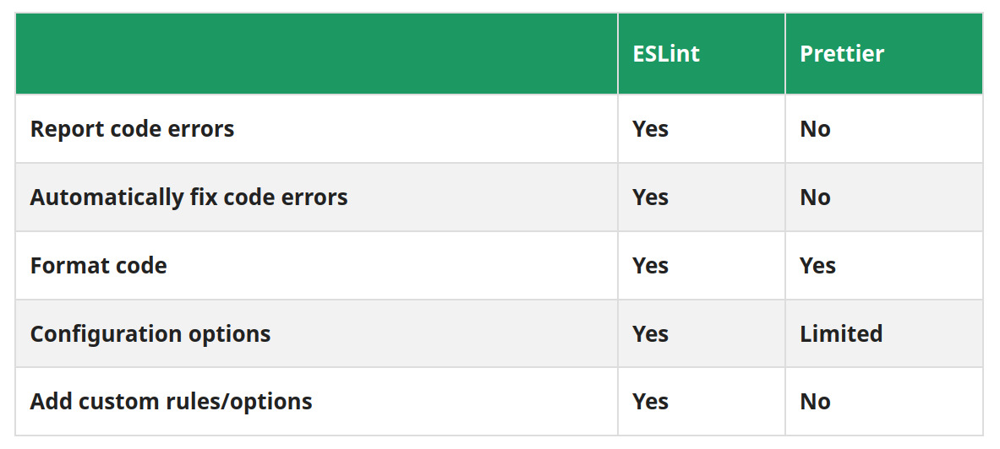

# INDEX

- [INDEX](#index)
  - [Linter](#linter)
    - [Types of Checks Linters Provide](#types-of-checks-linters-provide)
    - [Advantages of Linting](#advantages-of-linting)
    - [Examples of Linters](#examples-of-linters)
  - [Prettier](#prettier)
    - [Using Prettier Extension](#using-prettier-extension)
    - [Using command Line](#using-command-line)
    - [Configuration File and Prettier Rules (options)](#configuration-file-and-prettier-rules-options)
      - [Prettier Configuration File](#prettier-configuration-file)
      - [Prettier Rules (options)](#prettier-rules-options)
    - [Configuring Prettier to work with ESLint](#configuring-prettier-to-work-with-eslint)
      - [Using Prettier and ESling in the command Line](#using-prettier-and-esling-in-the-command-line)
  - [ESLint](#eslint)
    - [Installing and Configuring ESLint](#installing-and-configuring-eslint)
  - [Differences between ESLint and Prettier](#differences-between-eslint-and-prettier)
    - [Managing ESLint’s rules to avoid conflict with Prettier](#managing-eslints-rules-to-avoid-conflict-with-prettier)
  - [Methods for linting and pretty-printing your code](#methods-for-linting-and-pretty-printing-your-code)
    - [Remove conflicting rules and run serially](#remove-conflicting-rules-and-run-serially)
    - [Run Prettier followed by ESLint programmatically](#run-prettier-followed-by-eslint-programmatically)
    - [Run Prettier as an ESLint rule](#run-prettier-as-an-eslint-rule)
  - [Enforcing linting with Husky Pre-commit Hooks](#enforcing-linting-with-husky-pre-commit-hooks)
    - [Husky](#husky)
      - [Installing and Configuring Husky](#installing-and-configuring-husky)

---

## Linter

a linter is a tool to help you improve your code by analyzing your source code looking for problems.

Linting is a type of static analysis that finds problematic patterns and code that doesn’t adhere to certain style guidelines.

The term linter comes from a tool originally called `“lint”` that analyzed C source code.

> The concept of linter isn’t exclusive to JavaScript.

- linters are way more valuable for **interpreted languages** since there’s no compiler to detect errors during development time.

### Types of Checks Linters Provide

- **Syntax Errors**
- **Code Standards Adherence**
  - A codebase that has a consistent code style will be easier to understand, and the developers that use it will be less likely to introduce bugs.
- **Potential Problems (Code Smells)**
  - Code smells are signs that something might be wrong with your code. It’s amazingly useful to have a tool to detect those signs automatically, so you can investigate them further, if necessary.
  - For instance, many people consider long functions to be a code smell. So, you could configure your linter to detect functions that are longer than a given number of lines.
- **Security Checks**

### Advantages of Linting

- **Fewer errors in production**.
  - The use of linters helps to diagnose and fix technical issues—e.g. **code smells—in the code**. As a result, fewer defects make their way to production.
- **Readable, maintainable, and more consistent code.**
  - Linters can help teams achieve a more readable and consistent style, through the enforcement of its **rules**.
- **Fewer discussions about code style and aesthetic choices during code reviews.**
- **More secure and performant code.**

### Examples of Linters

- for Static Analysis -> [StandardJS](https://standardjs.com/) for JavaScript
- for Security -> [LGTM](https://lgtm.com/help/lgtm/about-lgtm) for several languages, including JavaScript, Python, and C#
- for Coding Conventions / Coding Formatting -> [prettier](https://prettier.io/) for JavaScript

---

## Prettier

Prettier is an **opinionated** code formatter for JavaScript and other popular languages. Prettier enforces a consistent format by parsing code and reprinting it with its own rules that take the maximum line length into account, wrapping code when necessary.

- The primary reason Prettier was created was to eliminate debates over code styles.
- The bottom line is that the development team intends to never add more options from now on; you can read more about this in Prettier’s [Option Philosophy](https://prettier.io/docs/en/option-philosophy.html).

### Using Prettier Extension

- Format document:
  - To open the command palette, you can use `CTRL + SHIFT + P` on Windows.
  - In the command palette, search for `format` and then choose `Format Document`.
  - > Note: If you do not see a prompt for selecting a default format, you can manually change this in your **Settings**. Set **Editor: Default Formatter** to `esbenp.prettier-vscode`.
- Formatting Code on Save:
  - press `CTRL + ,` on Windows to open the Settings menu. Once the menu is open, search for **Editor: Format On Save** and make sure that option is checked:
- Changing the Prettier Configuration Settings:

  - Here are a few of the most common settings:

    - **Single Quote** - Choose between single and double-quotes.
    - **Semi** - Choose whether or not to include semicolons at the end of lines.
    - **Tab Width** - Specify how many spaces you want a tab to insert.

  - > The downside to using the built-in settings menu in VS Code is that it doesn’t ensure consistency across developers on your team.

- Creating a Prettier Configuration File:
  - If you change settings in your VS Code, someone else could have an entirely different configuration on their machine. You can establish consistent formatting across your team by creating a configuration file for your project.
  - Create a new file called `.prettierrc.extension` with one of the following extensions:
    - `yml`
    - `yaml`
    - `json`
    - `js`
    - `toml`
- You can also add these rules globally for your vs-code in the **JSON settings file**

---

### Using command Line

- Installing:

  ```sh
  npm install --save-dev prettier
  ```

- Configuring Prettier

  - A basic `.prettierrc` setting is the following:

  ```json
  {
    "semi": true,
    "trailingComma": "none",
    "singleQuote": true,
    "printWidth": 80
  }
  ```

- Add the following script to your `package.json`:

  ```json
  {
    "scripts": {
      ...
      "prettier-format": "prettier --config .prettierrc 'src/**/*.ts' --write"
    }
  }
  ```

- And then run it.

  ```sh
  npm run prettier-format
  ```

- Formatting using an filesystem **watcher**

  ```sh
  # Install "onchange"
  npm install --save-dev onchange
  ```

  ```json
  "scripts": {
  "prettier-watch": "onchange 'src/**/*.ts' -- prettier --write {{changed}}"
  }
  ```

---

### Configuration File and Prettier Rules (options)

#### Prettier Configuration File

Prettier uses `cosmiconfig` for configuration file support. This means you can configure Prettier via (in order of precedence):

1. A `"prettier"` key in your `package.json` file.

2. A `.prettierrc` file written in `JSON` or `YAML`.

   ```yaml
   # .prettierrc or .prettierrc.yaml
   trailingComma: 'es5'
   tabWidth: 4
   semi: false
   singleQuote: true
   ```

3. A `.prettierrc.json`, `.prettierrc.yml`, `.prettierrc.yaml`, or `.prettierrc.json5` file.

   ```json
   {
     "trailingComma": "es5",
     "tabWidth": 4,
     "semi": false,
     "singleQuote": true
   }
   ```

4. A `.prettierrc.js`, `.prettierrc.cjs`, `prettier.config.js`, or `prettier.config.cjs` file that exports an object using `module.exports`.

   ```js
   {
     "trailingComma": "es5",
     "tabWidth": 4,
     "semi": false,
     "singleQuote": true
   }
   ```

5. A `.prettierrc.toml` file.

   ```toml
    # .prettierrc.toml
    trailingComma = "es5"
    tabWidth = 4
    semi = false
    singleQuote = true
   ```

- **Configuration Overrides**

  - Overrides let you have different configuration for certain **file extensions**, folders and specific files.
  - it's using key `overrides` with an array value that has the objects elements with options for each file-extension group
  - `files` is required for each override, and may be a string or array of strings. excludeFiles may be optionally provided to exclude files for a given rule, and may also be a string or array of strings.

  ```json
  {
    "semi": false,
    "overrides": [
      {
        "files": "*.test.js",
        "options": {
          "semi": true
        }
      },
      {
        "files": ["*.html", "legacy/**/*.js"],
        "options": {
          "tabWidth": 4
        }
      }
    ]
  }
  ```

#### Prettier Rules (options)

If you change any options, it’s recommended to do it via a configuration file. This way the Prettier CLI, editor integrations (prettier extension) and other tooling knows what options you use.

- normal (general) rules

  ```json
  // Default (format when you paste)
  "editor.formatOnPaste": true,
  // Default (format when you save)
  "editor.formatOnSave": true,
  ```

- You can also override the default settings by **specifying the language** as shown:

  ```json
  "[typescript]": {
    "editor.formatOnPaste": false,
    "editor.formatOnSave": false,
  },
  // normal rules that are not language-specific
  "editor.formatOnPaste": true,
  "editor.formatOnSave": true,
  ```

> You can find more options [Here](https://prettier.io/docs/en/options.html)

---

### Configuring Prettier to work with ESLint

#### Using Prettier and ESling in the command Line

- With `ESLint` and `Prettier` already installed, install these two packages as well.

  ```sh
  npm install --save-dev eslint-config-prettier eslint-plugin-prettier
  ```

  - **eslint-config-prettier**: Turns off all ESLint rules that have the potential to interfere with Prettier rules.
  - **eslint-plugin-prettier**: Turns Prettier rules into ESLint rules.

- make an adjustment to the `.eslintrc`:

  ```json
  {
    "root": true,
    "parser": "@typescript-eslint/parser",
    "plugins": ["@typescript-eslint", "prettier"], // here we add prettier plugin
    "extends": [
      "eslint:recommended",
      "plugin:@typescript-eslint/eslint-recommended",
      "plugin:@typescript-eslint/recommended",
      "prettier" // we add it here as well
    ],
    "rules": {
      "no-console": 1, // Means warning
      "prettier/prettier": 2 // Means error
    }
  }
  ```

---

## ESLint

ESLint is a JavaScript linting utility that was first released in June 2013 and now is by far the number one linting utility.

- Since JavaScript is a **dynamic and loosely-typed language**, it is especially prone to developer errors. Without the benefit of a **compilation process**, JavaScript code typically executes to find syntax or other errors.
- ESLint enables developers to discover problems with their code without actually executing their code.
- The primary reason ESLint was created was to allow developers to create their own linting rules. ESLint has built-in rules that make it useful from the start, but you can add rules specific to your project and whatever flavor of JavaScript you use.
  - The main reason for imposing those guide is because every developer has her style of writing (like naming conventions/tabs/single or double quotes for a string). And, with different styling techniques, your codebase may look weird, more error-prone and vulnerable.
- Many people have done the heavy lifting for you by creating shareable configs, which have rulesets for popular JavaScript frameworks and common style guides/coding standards such as [Google’s JavaScript Style Guide](https://google.github.io/styleguide/jsguide.html).
  - You can find some of these shared configs on [npmjs.com by searching for “eslint-config”](https://www.npmjs.com/search?q=eslint%20config) (the naming convention for shared configs).
- ESLint has a pluggable architecture that enables creating [plugins](https://eslint.org/docs/developer-guide/working-with-plugins), which can add extra capabilities to ESLint, and gives a new baseline to add your own custom rules.
  - An example of this is [eslint-plugin-vue](https://github.com/vuejs/eslint-plugin-vue/), which is the official plugin for Vue.js. This plugin allows us to lint the `<template>` and `<script>` sections of `.vue` files, as well as Vue code contained in `.js` files.

### Installing and Configuring ESLint

> This is a great video for [installation and configuration of ESlint](https://www.youtube.com/watch?v=ZXW6Jn6or1w)

- You shouldn't install it globally, as this isn’t the approach recommended in their documentation. Instead, you should probably install ESLint on a per-project basis.

  ```sh
  npm install eslint --save-dev
  # or
  yarn add eslint --dev
  ```

- Initializing and Setting up ESLint

  - ESLint starts as a blank slate. It won’t do anything until you create a configuration with some rules. You must put the configuration file, `.eslintrc.{js,yml,json}`, into the project directory and you’ll be ready to lint.

  ```sh
  # ESLint will ask you for what do you want to use it for
  npx eslint --init
  # or
  yarn run eslint --init
  ```

  - **Note**: — init assumes you have a `package.json` file already. If you don’t, make sure to run npm init or yarn init beforehand.

- **Configure** it

  - The moment you’re done with the installation and initialization you’ll have a `.eslintrc.{js,yml,json}` file in your directory. In it, you’ll see some **rules** configured like below
  - usually **rules** are arrays with **["type of action", "when to use it"]**

  ```json
  {
    "rules": {
      "semi": ["error", "always"],
      "quotes": ["error", "double"]
    }
  }
  ```

- Using ESLint to Check a File or directory

  ```sh
  npx eslint <your file>.js
  # or
  yarn run eslint <your file>.js

  # or on a folder
  npx eslint <folder containing js files>
  # ex:
  npx eslint src --ext .js # to check all `js` files in src folder
  ```

---

## Differences between ESLint and Prettier



In a nutshell, you will use **Prettier to simplify the formatting of your code** and **ESLint for catching bugs**.

A typical package.json will look something like what is below. Here, we target the files in the folders src and test for the npm scripts.

```json
{
  "name": "basic-project",
  "version": "1.0.0",
  "main": "index.js",
  "scripts": {
    "lint": "npx eslint src test",
    "lint:fix": "npm run lint -- --fix",
    "prettier": "npx prettier src test --check",
    "prettier:fix": "npm run prettier -- --write"
  },
  "author": "rob o'leary",
  "license": "ISC",
  "devDependencies": {
    "eslint": "^7.25.0",
    "prettier": "^2.2.1"
  }
}
```

---

### Managing ESLint’s rules to avoid conflict with Prettier


- Generally, we want Prettier to handle the first category and ESLint to handle the second. There are rules that may be difficult to categorize as one or the other; we don’t need to be pedantic about which category they fit into.
- As for the order to run them in, it is generally **best to run Prettier before ESLint** because Prettier reprints your entire program from scratch. So, if you want to let ESLint in on the formatting act, you should run it after Prettier to prevent the changes from being overwritten.

---

## Methods for linting and pretty-printing your code

### Remove conflicting rules and run serially

> This method is the cleanest and most efficient, and the best recommended to use.

- It’s easy to turn off rules that conflict with Prettier in ESLint by using the following configs:
  - `eslint-config-prettier` for **JavaScript**
  - `tslint-config-prettier` for **TypeScript**
- install it for Javascript:

  ```sh
  npm install --save-dev eslint-config-prettier
  ```

- Then, append that config name to the `extends` array in your local .`stylelintrc.*` ESLint config file. Make sure to put the Prettier config last so it overrides the settings from other configs.

  ```json
  // .eslintrc.json
  {
    // ...
    "extends": [
      // ...
      "eslint:recommended",
      "prettier" // Make sure this is the last
    ]
    // ...
  }
  ```

- Now, you can run Prettier and ESLint together without any side effects. You can also run Prettier and ESLint one after another like on the command line by defining them as npm scripts. Here is how that looks in a `package.json`:

  ```json
  {
    "name": "no-worries-setup",
    "version": "1.0.0",
    "scripts": {
      "lint": "npx eslint src test",
      "lint:fix": "npm run lint -- --fix",
      "prettier": "npx prettier src test --check",
      "prettier:fix": "npm run prettier -- --write",
      "format": "npm run prettier:fix && npm run lint:fix" // here
    }
    // ...
  }
  ```

- To use with **VS code**, install the extensions:

  - `ESLint` (shows the errors inline within its place without needing to look in the terminal)
  - `Prettier`
  - `Format Code Action`
  - and update your user settings (`settings.json`), as shown below:

    - If we install the `Format Code Action` extension, we can make formatting available as a code action.

    ```json
    {
      //...
      "editor.defaultFormatter": "esbenp.prettier-vscode",
      "eslint.probe": ["javascript", "javascriptreact", "vue"],
      // you need to disable the editor formatting on save (editor.formatOnSave); we want to handle everything through code actions.
      "editor.formatOnSave": false,
      // Runs Prettier, then ESLint
      "editor.codeActionsOnSave": ["source.formatDocument", "source.fixAll.eslint"],
      "vetur.validation.template": false
      // ...
    }
    ```

---

### Run Prettier followed by ESLint programmatically

The following applications offer a unified way to run `prettier` followed immediately by `eslint --fix` on files:

- `prettier-eslint` for **JavaScript**
- `prettier-tslint` for **TypeScript**

write your own implementation to target your files and run the formatting:

```js
const format = require('prettier-eslint');

// notice, no semicolon in the original text
const sourceCode = 'const {foo} = bar';

const options = {
  text: sourceCode,
  eslintConfig: {
    parserOptions: {
      ecmaVersion: 7
    },
    rules: {
      semi: ['error', 'never']
    }
  },
  prettierOptions: {
    bracketSpacing: true
  },
  fallbackPrettierOptions: {
    singleQuote: false
  }
};

const formatted = format(options);

// notice no semicolon in the formatted text
formatted; // const { foo } = bar
```

> To use in **VS Code**, you can install and use the **Prettier ESLint extension**.

---

### Run Prettier as an ESLint rule

> This is generally not recommended because:
>
> - Formatting issues reported as problems by ESLint
> - It is a bit slower than running Prettier directly
> - You have another layer where bugs can be introduced

- You can use ESLint plugins that let you run Prettier as if it is a linter rule:

  - `eslint-plugin-prettier` for **JavaScript**
  - `tslint-plugin-prettier` for **TypeScript**

- First, install the plugin. This is just for JavaScript:

  ```sh
  npm install --save-dev eslint-plugin-prettier
  ```

- Then, append the plugin(s) to the `plugins` array in your `.stylelintrc.*` file, for example in `.eslintrc.json`:

  - there's an advice to make `"prettier"` plugin at the end of `plugins` array, so that it overrides other plugins before it like `"react"`, `"typescript"`,..

  ```json
  {
    "plugins": ["prettier"],
    "rules": {
      "prettier/prettier": "error"
    }
  }
  ```

---

## Enforcing linting with Husky Pre-commit Hooks

> On most projects, someone takes the role of the code cleanliness champion. their role involves reviewing PRs and making sure love and care is put into the quality of the code.
>
> - **Quality** includes both the chosen coding conventions in addition to the formatting of the code.

### Husky

Husky is an npm package that **"makes Git hooks easy"**.

- When you initialize **Git** on a project, it automatically comes with a feature called **hooks**.

  - If you go to the root of a project initialized with Git and type:

    ```sh
    ls .git/hooks
    ```

  - You'll see a list of sample hooks like `pre-push`, `pre-rebase`, `pre-commit`, and so on. This is a way for us to write plugin code to execute some logic before we perform the action.

- If we wanted to ensure before someone creates a commit using the `git commit` command, that their code was properly linted and formatted, we could write a **pre-commit Git hook**.
- **Hooks**
  - Hooks get created locally
  - Hooks are run when the Git command is called
  - Policy that defines how someone can contribute to a project is enforced.

#### Installing and Configuring Husky

```sh
npm install husky --save-dev
```

- To configure Husky, in the root of our project's `package.json`, add the following `husky` key:

  ```json
  "husky": {
    "hooks": {
      "pre-commit": "",       // Command goes here
      "pre-push": "",         // Command goes here
      "...": "..."
    }
  }
  ```

  - When we execute the `git commit` or `git push` command, the respective hook will run the script we supply in our package.json.

- with prettier:

  ```json
  {
    "scripts": {
      "prettier-format": "prettier --config .prettierrc 'src/**/*.ts' --write",
      "lint": "eslint . --ext .ts",
      ...
    },
    "husky": {
      "hooks": {
        "pre-commit": "npm run prettier-format && npm run lint"
      }
    }
  }
  ```

You can also see the [video](https://www.youtube.com/watch?v=ZXW6Jn6or1w) for more automatic npx configuration
