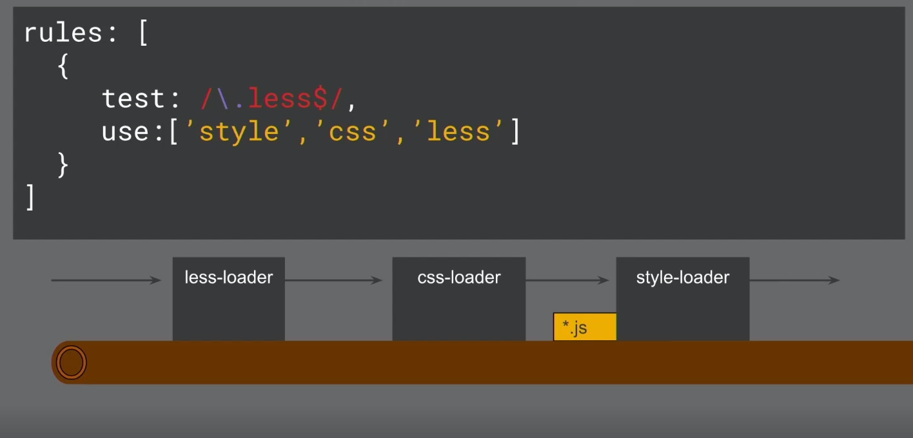
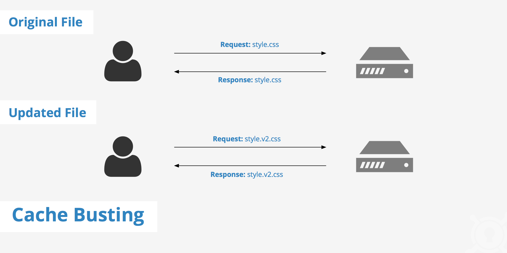

# INDEX

- [INDEX](#index)
  - [Webpack](#webpack)
    - [Why Webpack](#why-webpack)
    - [How webpack works](#how-webpack-works)
    - [Configuring Webpack](#configuring-webpack)
  - [Core Concepts](#core-concepts)
    - [Entry and Output](#entry-and-output)
    - [Loaders](#loaders)
      - [How loaders work](#how-loaders-work)
      - [Loaders examples](#loaders-examples)
    - [Plugins](#plugins)
  - [Hot Module Replacement (HMR)](#hot-module-replacement-hmr)
  - [Code Splitting with Webpack](#code-splitting-with-webpack)
    - [Code Splitting with Multiple Entry Points](#code-splitting-with-multiple-entry-points)
    - [Code Splitting with SplitChunks optimization](#code-splitting-with-splitchunks-optimization)
    - [Code Splitting with Dynamic Imports](#code-splitting-with-dynamic-imports)
  - [Preloading and Prefetching](#preloading-and-prefetching)
    - [Preloading](#preloading)
    - [Prefetching](#prefetching)
  - [Caching](#caching)
    - [Cache Busting](#cache-busting)
  - [Webpack Bundle Analyzer](#webpack-bundle-analyzer)
  - [Webpack different modes (Common, Development, Production, Test)](#webpack-different-modes-common-development-production-test)
    - [For Common Configuration](#for-common-configuration)
    - [For Development](#for-development)
    - [For Production](#for-production)
  - [Working with Webpack](#working-with-webpack)
    - [webpack development server](#webpack-development-server)
    - [Working with HTML](#working-with-html)
    - [Working with CSS](#working-with-css)
    - [Working with SASS](#working-with-sass)
    - [Working with modern Javascript (Babel)](#working-with-modern-javascript-babel)
  - [Environment Variables in Webpack](#environment-variables-in-webpack)
  - [Monitoring Webpack Build Performance speed](#monitoring-webpack-build-performance-speed)
  - [Webpack Notes](#webpack-notes)

---

## Webpack

It's a **module bundler** that lets you write any module format (mixed bunch of different assets/files **of different types**), compiles them for working in the **browser**.

- Webpack has a broader definition of what a module is, and it can handle a lot more than just Javascript files. It can handle:

  - CommonJS modules
  - AMD modules
  - ES6 modules
  - Images (URLs)
  - CSS imports
  - and more...

  > webpack is able to ingest dependencies from any of these sources and output a single Javascript file that can be loaded in the browser.

- The ultimate goal of webpack is to **unify** different sources and module-types in a way that is possible to use them in the browser by importing them in a single Javascript file


> When we want to bundle files, we have to balance 2 concerns
>
> - Each script requires new `HTTP` request. this can lead to bottleneck (very slow website) if number of requests is a lot
> - Writing code in one single massive Javascript file is a nightmare!
>
> So, We want as few files as possible in the browser that have to load, but we also want as many files as we want when we're actually developing apps. And what is where **webpack** comes in

There're 2 main things webpack does:

1. it bundles our code/assets together
2. it manages dependencies (modules)

- supports static Async bundling
- The most performant way to ship Javascript

> some people say that the problem of webpack is "that there isn't one way to do things" , and that is exactly why we have webpack in the web where everything is different as if every web application was created the same way, we wouldn't even need webpack but this is not the case

---

### Why Webpack

- **Scaling**

  - when you use different Javascript files that depend on each other, before we used to add multiple `<script>` tags to our `index.html` file with the correct order; Ex:

  ```html
  <body>
    <!-- code -->
    <script src="./src/app/alert.service.js"></script>
    <script src="./src/app/utils/inputs-are-valid.js"></script>
    <script src="./src/app/utils/parse-inputs.js"></script>
    <!-- app.js must be the last one so that the other files are loaded already -->
    <script src="./src/app/app.js"></script>
  </body>
  ```

- **Maintainability**

  - when we have a lot of files, we need to make sure that we're loading them in the correct order, and this is a nightmare to maintain
  - This will become tedious with managing more and more files and dependencies. (e.g. working on a 10000+ line file is not fun).

- **Scoping & Encapsulation**

  - we used to use **IIFE's** to avoid polluting the global scope, but this is not enough as we still have to worry about **naming collisions** and **global variables**.
  - So, by using webpack, we can use `import`/`export` to avoid polluting the global scope

- **Removing unused code**

  - When using multiple `<script>` tags, we can't remove unused code as we don't know what code is used and what is not
  - This is where **Tree Shaking** comes in, as it's a technique that **removes unused code** from the final bundle. This is done by **statically analyzing** the code and **only including** the things that are **actually used**.

- **Dynamic loading & Code Splitting**

  - we used to use **dynamic imports** to load modules on demand, but this is not enough as we still have to worry about **naming collisions** and **global variables**.

- **Access to NPM ecosystem**

  - we used to use **CDN's** to load libraries, Instead of using a CDN, we can use `npm` to install libraries and then import them into our code to work on the browser the same way we do in `node.js` (server-side)

- **Performance**

  - we used to use **CDN's** to load libraries, but this is not enough as we still have to worry about **naming collisions** and **global variables**.

  > Webpack is the most performant way to ship javascript due to its ecosystem of plugins and loaders that can be used to optimize the code and assets that are being shipped to the browser. It also has a very active community that is constantly improving the tooling and ecosystem around it.

so we import files using `ES6` imports/exports and then import the top level into an **entry file** that runs our code and webpack uses this file to create the **main javascript file** in the `dist` folder to be used in the `<script>` tag in the `index.html` file

- so we tell webpack how files are dependent on each other using `imports`/`exports`, and Webpack takes care of the rest making sure that everything is **loaded** in a valid order

---

### How webpack works

- By default, `ESM (EcmaScript Modules)` are slow and not supported in all browsers, so we use `webpack` to bundle them into a single file that is supported in all browsers

- Webpack lets you write **any module format** (not just `ESM`), and compiles them for working in the browser

  - It takes a bunch of files and bundles them together into a single file
  - It also manages dependencies (modules)
  - It uses `loaders` to process files that are not Javascript (ex: `sass` to `css`)

- It uses `loaders` to process files that are not Javascript (ex: `sass` to `css`).

- It handles different modules and scopes by using `IIFE`

  - if you saw the final bundled `.js` file, you would find that modules are treated as **IIFE** or **Array of IIFE's** to control scope.

    ```js
    // main.js
    /*****/ (function (modules) {
      // webpackBootstrap
      /******/ // The module cache
      /******/ var installedModules = {};
      // ....
    })(
      /************************************************************************/
      /******/ {
        /***/ './src/alert.js': /***/ function (module, __webpack_exports__, __webpack_require__) {
          // ...
        },
        /***/ './src/app.js': /***/ function (module, __webpack_exports__, __webpack_require__) {
          // ...
        },
        /***/ './src/utils.js': /***/ function (module, __webpack_exports__, __webpack_require__) {
          // ...
        }
        /******/
      }
      /******/
    );
    ```

  - this is sometimes called -> **"webpackBootstrap"**

- Webpack creates an `id` for each module and calls it using `__webpack_require__` function by passing the `id` of the module you want to call

  ```js
  // main.js
  // ...
  /* harmony import */ var _button__WEBPACK_IMPORTED_MODULE_0__ = __webpack_require__(1); // 1 is the id of the module
  ```

- usually objects (modules) in resulted file are frozen (to prevent modifying it), so they use `getters` to get data

> Note: webpack can be used in the backend too (ex: `node.js`), but it's mostly used in the frontend

---

### Configuring Webpack

```bash
# installation
npm install webpack webpack-cli webpack-dev-server --save-dev
```

How to use it ? -> three ways to use Webpack: `Webpack config`, `Webpack CLI`, and `Node API`

- **webpack.config.js**

  - It's a file with an exported object; yes, it's a module too! (it overrides the default configuration)
  - it needs **entry(input)**, and **output**
  - without it, it will use default **vendors**(entry-file) (`.src/index.js`)
    - and if we have both it will load both -> (**Multiple Entrypoints**)

  ```js
  // webpack.config.js
  const path = require('path');

  module.exports = {
    entry: {
      main: './src/main.browser.ts'
      vendor: './src/vendors.ts',
    },
    output: {
      filename: 'main.js',
      path: 'dist/'
      // or
      path: path.resolve(__dirname, 'dist') // to get the absolute path
    }
  };
  ```

  - Try to use `commonJS` imports and exports(default & named)

    - Here, the config object is exporting using `commonJS` exports

      ```js
      module.exports = {
        // configs
      };
      ```

  - now when you run webpack, you pass to it the config parameter:

    ```sh
    webpack --config webpack.config.js
    ```

- **Webpack CLI**

  ```sh
  webpack <entry.js> <result.js> --colors --progress

  webpack-dev-server --port=9000
  ```

  - Without a config file, webpack will default to `webpack.config.js` in the current directory.
  - Without entry and output specified, webpack will default to:
    - `src/index.js` as the entry point.
    - `dist/main.js` as the output.

- **Node API**

  ```js
  var webpack = require('webpack');

  // returns a Compiler instance
  webpack(
    {
      // configuration object here!
    },
    function (err, stats) {
      // …
      // compilerCallback
      console.error(err);
    }
  );
  ```

---

## Core Concepts

### Entry and Output

- **Entry**: the first Javascript file to load to "kick-off" your app (starting point from which all the dependencies of your application are calculated)

  - Thees dependencies form a **dependency-graph** (a tree of all the files that are needed to run your app)

  

- **Output**: the final bundled Javascript file that webpack creates in the build process
  

---

### Loaders

> webpack by default bundles Javascript files, so when we want to bundle **non-javascript-files**, we use **loaders**

**Loaders**: Third party extensions that help webpack to bundle files by telling webpack how to modify **(interpret and translate)** files (on a per-file basis) before its added to the dependency graph.

- Loaders are also javascript `modules` (`functions`) that takes the `source file` and return it in a `modifies state`
- They use `REGEX` pattern to match files and apply transformations to them
- They are the transformations that are applied on the source code of a module.
  - They allow you to **pre-process** files as you `import` or `load` them. Thus, loaders are kind of like (**tasks** in other build tools) and provide a powerful way to handle frontend build steps, or like (allowing you to `import` css files directly from your Javascript modules).
  - Once the file becomes a module, webpack can use it as a dependency in the dependency graph.

> Loaders can transform files from a different language like:
>
> - Typescript to Javascript
> - inline images to data URLs

- To use it, we define **rules** on how we want to transform files using loaders:

  ```js
  module.exports = {
    module: {
      rules: [
        {
          test: /\.filename$/,
          use: ['loader-name']
        }
      ]
    }
  };
  ```

  - `test` to match the files based on a `regex` expression -> files we want to **treat as modules**
  - `use` to apply(use) the specified loader to the matching files
    - we can add loaders to the `use` key as an `array` with loaders name
    - or we can use an `object` to add options to the loader

> You can find [built-in loaders here](https://webpack.js.org/loaders/)

- The order of the loaders is important, as they execute from **right to left** (or from **bottom to top**)

  ```js
  module.exports = {
    module: {
      rules: [
        {
          test: /\.css$/,
          use: ['style-loader', 'css-loader']
        }
      ]
    }
  };
  ```

  - Here, `css-loader` will be executed first, then `style-loader`

---

#### How loaders work

- if webpack comes across something that matches one of the regular-expressions in the rule sets, then it applies (uses) the corresponding `node-module` to transform files while creating the `dependency-graph`
- This is a **per file process** and it doesn't happen in bulks

  

- There're different kinds of features that help you `filter`/`include`/`exclude`/`ignore`/.. when you want to transform files
  
  

- **Chaining Loaders**:

  - loaders execute from **right to left**
    
    
    
    

    ```js
    // it's like calling multiple functions:
    style(css(less()));
    ```

---

#### Loaders examples

- Example for using loaders for images files and **"src" attributes** in the `` tags in html files
  - it uses the [html-loader](https://webpack.js.org/loaders/html-loader/)
- Example of using loaders for importing files like `images` files

  ```js
  // webpack.config.js
  module.exports = {
    module: {
      rules: [
        {
          test: /\.(png|jpe?g|gif)$/i,
          use: ['file-loader']
        }
      ]
    }
  };
  ```

  ```js
  // now we can do this
  import myImage from './my-image.png';

  const myImageElement = document.createElement('img');
  myImageElement.src = myImage;
  ```

- Example for using loaders with `options` key:

  - This is done by using an `object` instead of an `array` in the `use` key

  ```js
  module.exports = {
    module: {
      rules: [
        {
          test: /\.(png|jpe?g|gif)$/i,
          loader: 'file-loader',
          options: {
            name: '[name].[hash].[ext]', // change the output image file name as you like
            outputPath: 'imgs',
            limit: 8192 // if the image size is less than 8KB, it will be converted to base64 and inlined in the bundle.js file
          }
        }
      ]
    }
  };
  ```

  - The result imported image
    

---

### Plugins

They're third-party extensions that change the way webpack works and gives you the ability to **tap into** the entire **lifecycle** of a webpack build.

- They add additional functionality to Compilations(optimized bundled modules). More powerful w/ more access to CompilerAPI. Does everything else you’d ever want to in webpack.
- They're instances of **Objects** with `apply` property (collection of rules)

> - They work on a **bundle-level** and not file-level
>
> - A plugin is an ES5 ‘class’ which implements an apply function.
> - any built-it plugin begins with `webpack.` -> `new webpack.pluginName()`

- **How to use Plugins**:

  1. install the plugin
  2. `require()` plugin from `node_modules` into config.
  3. add **new instance** of plugin to plugins key in config object.
  4. provide additional info (data) for arguments

  ```js
  // require() from node_modules or webpack or local file
  var BellOnBundlerErrorPlugin = require('bell-on-error');
  var webpack = require('webpack');

  module.exports = {
    //...
    plugins: [
      // "new" keyword is important to create a new instance of the plugin
      new BellOnBundlerErrorPlugin(),
      new webpack.optimize.CommonsChunkPlugin('vendors'),
      new webpack.optimize.UglifyJsPlugin()
    ]
    //...
  };
  ```

---

## Hot Module Replacement (HMR)

It's a way of exchanging modules in a running application (and adding/removing modules) without needing a full page reload (refresh).

- **How does it work?**
  - Requesting Updates: App code prompts HMR runtime to check for updates asynchronously.
  - Downloading Updates: HMR runtime fetches updates and notifies the app code of their availability.
  - Applying Updates: App code asks HMR runtime to apply updates synchronously, which may or may not involve user interaction.
- **Use cases**

  - Development: Functions as a LiveReload substitute;`webpack-dev-server` supports HMR for live updates without page reload.

    - This is done by adding `webpack/hot/dev-server` entry point and use `--hot` flag.

      ```json
      "scripts": {
        "start": "webpack-dev-server --hot"
      }
      ```

    - or by adding `hot` key to the `devServer` object in the `webpack.config.js` file

      ```js
      // webpack.config.js
      module.exports = {
        // ...
        devServer: {
          // ...
          hot: true
        }
      };
      ```

  - Production: Enables update mechanisms; requires custom management code integrating HMR with the app.

---

## Code Splitting with Webpack

- Code splitting refers to an optimization technique aiming at:

  - Avoid big bundles
  - Avoid loading code that is not needed
  - Avoid dependencies duplication

- There is a limit that the webpack community considers the maximum size for the initial bundle of an application: `200KB`

  - To understand why keeping bundles small is paramount, search fo [The Cost of JavaScript" on Google](https://medium.com/@addyosmani/the-cost-of-javascript-in-2018-7d8950fbb5d4)

- There are three main ways to activate code splitting in webpack:

  - **Multiple Entry Points**: Manually split code using entry configuration.
  - **SplitChunks optimization**: Use the `SplitChunks optimization` to split chunks.
  - **Dynamic Imports**: Split code via inline function calls within modules.

### Code Splitting with Multiple Entry Points

- We can use multiple entry points to split our code into multiple bundles, but **this is not a good solution** as it will create multiple bundles that will be loaded in the browser in multiple `<script>` tags

  ```js
  // webpack.config.js
  module.exports = {
    entry: {
      pageOne: './src/pageOne/index.js',
      pageTwo: './src/pageTwo/index.js',
      pageThree: './src/pageThree/index.js'
    },
    output: {
      filename: '[name].bundle.js',
      path: __dirname + '/dist'
    }
  };
  ```

- This will create 3 bundles: `pageOne.bundle.js`, `pageTwo.bundle.js`, `pageThree.bundle.js`
- This is not a good solution as it will create multiple bundles that will be loaded in the browser in multiple `<script>` tags

  ```html
  <script src="pageOne.bundle.js"></script>
  <script src="pageTwo.bundle.js"></script>
  <script src="pageThree.bundle.js"></script>
  ```

### Code Splitting with SplitChunks optimization

Consider using `Moment.js` in a few of your application’s routes.

- By splitting this library into a separate chunk:

  - users will only have to download it once, and your other routes will load faster because they’re now smaller.
  - It won't be bundled with the main bundle, so it will be loaded in a separate `<script>` tag which will reduce the size of the main bundle and make it load faster

- EX: without using `SplitChunksPlugin`:

  - when running `npm run build`, the output will be:

    ```bash
    main.js    350 KiB       0  [emitted]  [big]  main
    ```

- EX: using `SplitChunksPlugin`:

  ```js
  // webpack.config.js
  module.exports = {
    module: {
      // ...
    },
    optimization: {
      splitChunks: {
        chunks: 'all' // split all chunks (including node_modules)
      }
    }
  };
  ```

  - when running `npm run build`, the output will be:

    ```bash
    main.js    5.05 KiB       0  [emitted]  main
    vendors~main.js    346 KiB       1  [emitted]  [big]  vendors~main
    ```

> **Note:** even with code splitting moment.js remains a gigantic library. There are better alternatives like [luxon](https://github.com/moment/luxon/) or [date-fns](https://github.com/date-fns/date-fns).

### Code Splitting with Dynamic Imports

It's a technique for loading parts of the application on demand **(conditionally)**, instead of loading everything up front.

> Es modules are **static** by nature, meaning we can't change imports at runtime. so we can't use them to load modules dynamically. This is where `dynamic imports` come in
>
> With dynamic imports, we can load modules conditionally at runtime. This is done by using the `import()` function

- Dynamic imports can be used:

  - at the `module` level
  - at the `function` / `class` level
  - at the `route` level

- It's done by loading conditionally some javascript module in response to a user interaction (ex: clicking a button), or in response to a route change (ex: loading a new page)

  ```js
  const getUserModule = () => import('./user.js');
  ```

  - The lazy "chunk" is `0.js`
    

- To control the name of the generated chunk, we can use a `comment` inside the `import()` function

  ```js
  const getUserModule = () => import(/* webpackChunkName: "userAPI" */ './user.js');
  ```

  - The lazy "chunk" is `userAPI.js`
    

---

## Preloading and Prefetching


### Preloading

**Preloading** is when a `resource` is needed for the `current` navigation, and it's needed as soon as possible. So, we can load it in the background while the current page is still loading.

- It's a way to tell the browser to load a resource as soon as possible, regardless of where it is on the page. This is done by adding the `preload` attribute to the `<link>` tag in the `<head>` tag of the `index.html` file

  ```html
  <link rel="preload" href="myModule.js" as="script" />
  ```

  - This will tell the browser to load the `myModule.js` file as soon as possible, regardless of where it is on the page
  - To use it with webpack, we need to use the `webpackPrefetch` comment in the `import()` function

    ```js
    const getUserModule = () => import(/* webpackPrefetch: true */ './user.js');
    ```

    - This will tell webpack to add the `preload` attribute to the `<link>` tag in the `<head>` tag of the `index.html` file

### Prefetching

**prefetching** is when a `resource` is needed for some `future` navigation, but it's not needed for the current page. So, we can load it in the background when the current page is idle.

- It's a way to tell the browser to load a resource when it's likely to be needed, but not immediately. This is done by adding the `prefetch` attribute to the `<link>` tag in the `<head>` tag of the `index.html` file

  ```html
  <link rel="prefetch" href="myModule.js" as="script" />
  ```

  - This will tell the browser to load the `myModule.js` file when it's likely to be needed, but not immediately
  - To use it with webpack, we need to use the `webpackPrefetch` comment in the `import()` function

    ```js
    const getUserModule = () => import(/* webpackPrefetch: true */ './user.js');
    ```

    - This will tell webpack to add the `prefetch` attribute to the `<link>` tag in the `<head>` tag of the `index.html` file

---

## Caching

When webpack bundles our application and outputs it to the `dist` folder which is deployed in the **server**, clients(browser) will hit the server and download the bundle. This bundle will be cached in the browser for a certain amount of time to prevent downloading it again and again.

- Webpack generates a **unique hash** for every file so that the browser knows when a file has changed.

  - It's called `substitution hashing` as it's based on the file content

  ```js
  // webpack.config.js
  module.exports = {
    output: {
      path: '/dist',
      filename: 'bundle.[contentHash].js' // will be called like bundle.e883ce503b831d4dde09.js
    }
  };
  ```

- This hash is used to **invalidate** the cache when the file changes (when the hash changes)

### Cache Busting



- When a static file (like `main-output.js` file) gets cached it can be stored for very long periods of time before it ends up expiring. This can be an annoyance in the event that you make an update to a site (use new output js file that contains new or updated logic)
  - however, since the cached version of the file is **stored in your visitors' browsers**, they may be unable to see the changes made.
  - This is due to the fact that a visitor's browser will locally store a cached copy of your static assets given that your website is configured to leverage browser caching.
    
- Cache busting solves the browser caching issue by using a **unique file version identifier** to tell the browser that a new version of the file is available. Therefore the browser doesn't retrieve the old file from cache but rather makes a request to the origin server for the new file.
- Cache busting is useful because it **allows your visitors to receive the most recently updated files without having to perform a hard refresh or clear their browser cache**. From a developer's point of view, using cache busting is beneficial so that the latest changes can be pushed out and become available to everyone immediately.
- > So to summaries: **we bust outdated caches**
- How to do it in webpack:

  ```js
  // webpack.config.js

  module.exports = {
    output: {
      path: '/dist',
      filename: 'bundle.[contentHash].js' // will be called like bundle.e883ce503b831d4dde09.js
    }
  };
  ```

- You may think that this will cause another problem: **"How the html file is going to know what js file name it needs to use in the `<script>` tag ?"**
  - the answer is that now we won't be adding the `<script>` tag in the `html` file manually like we did; instead we will make Webpack build our `HTML` file and put it in the `dist` folder using [Plugins](#plugins) -> [HtmlWebpackPlugin](https://webpack.js.org/plugins/html-webpack-plugin/)

---

## Webpack Bundle Analyzer

- It's a tool that gives you a visual representation of your bundle(s) and helps you:

  - Analyze what's inside your bundle(s)
  - Find out what modules make up the most of its size
  - Find modules that got there by mistake
  - Optimize it!

- It's a great tool to optimize your bundle size
- it gives us a **Tree Map** that shows us the size of each module in the bundle (what is in the bundle)
  
- Usually it's used as:

  - a plugin in the `webpack.config.js` file

    ```js
    // webpack.config.js
    const BundleAnalyzerPlugin = require('webpack-bundle-analyzer').BundleAnalyzerPlugin;

    module.exports = {
      // ...
      plugins: [new BundleAnalyzerPlugin()]
    };
    ```

  - or, a preset in the `webpack.config.js` file

    ```js
    // webpack.config.js
    module.exports = {
      // ...
      plugins: ['webpack-bundle-analyzer']
    };
    ```

  - or, a separate config file and script:

    ```json
    // package.json
    "scripts": {
      "analyze": "webpack-bundle-analyzer dist/stats.json"
      // or
      "analyze": "webpack run prod -- --env.presets analyze"
    }
    ```

    ```js
    // webpack.analyze.js
    const { BundleAnalyzerPlugin } = require('webpack-bundle-analyzer');

    module.exports = {
      plugins: [new BundleAnalyzerPlugin()]
    };
    ```

> More on bundle analyzer:
>
> - [Everything you need to know about Webpack's Bundle-Analyzer](https://dev.to/mbarzeev/everything-you-need-to-know-about-webpacks-bundle-analyzer-g0l)
> - [How to use the webpack bundle analyzer](https://blog.jakoblind.no/webpack-bundle-analyzer/)

---

## Webpack different modes (Common, Development, Production, Test)


- **Approach 1:** Usually we have 2 modes (`development`, `production`), so we usually have 3 files:

  - `webpack.common.js`
    - this will have the common configuration between `dev` and `prod` which have all the common plugins before building both development and production
  - `webpack.dev.js`
    - this will have the development configuration, it merges the common webpack as a first step then it make some configurations related to the dev and the development server.
  - `webpack.prod.js`
    - this will have the production configurations, it merges the common webpack as a first step then it make some configurations related to the prod like:
      - minimizing the code
      - removing the source maps
      - adding a hash for the bundle every time it changes
      - adding plugins used in production only

- **Approach 2:** pass the `env` variable to webpack and use it to determine which file to use

  ```js
  // webpack.config.js
  module.exports = env => {
    if (env.production) {
      return require('./webpack.prod.js'); // or directly write the configurations here
    } else {
      return require('./webpack.dev.js');
    }
  };
  ```

- **Approach 3:** create a `modeConfig` variable

  ```js
  // webpack.config.js
  const modeConfig = env => require(`./build-utils/webpack.${env}`)(env);

  // using 'production' mode as default
  module.exports = ({ mode, presets } = { mode: 'production', presets: [] }) => {
    return webpackMerge(
      {
        mode
        // ...
      },
      modeConfig(mode)
    );
  };
  ```

  - `webpackMerge` is a function that merges the common configuration with the mode configuration, it requires installing `webpack-merge` package

- Each mode is used for a reason, for example:

  - the `dev` mode have **source maps** to make debugging easier, while the `prod` mode doesn't have `source-maps` to make the file smaller and faster

    ```js
    // webpack.dev.js
    module.exports = {
      devtool: 'source-map'
      // ...
    };
    ```

    

    > **Note:** Source maps are files that map from the transformed source to the original source, enabling the browser to reconstruct the original source and present the reconstructed original in the debugger. **So, this will expose our source code to the browser and might be a security issue for some companies**

  - `dev` mode usually use **watch mode** to watch for changes and rebuild the project, while `prod` mode doesn't use it as it's not needed in production

- We use `NPM scripts` to create a webpack script for each mode

  ```json
  {
    "scripts": {
      "dev": "npm run webpack -- --config webpack.dev.js --watch",
      "prod": "npm run webpack -- --config webpack.prod.js"
    }
  }
  ```

- To merge all these files; we will `require` a merge function from `webpack-merge`. This merge function will allow us to merge configurations from different files

  ```js
  const { merge } = require('webpack-merge');
  ```

- Now, to merge both files (`dev + common` or `prod + common`), we add the following syntax to the end of the file:

  ```js
  module.exports = merge(commonConfig, devConfig);
  ```

> You can find more here: [Webpack for Common, Development, and Production](https://www.linkedin.com/pulse/webpack-common-development-production-rany-elhousieny-phd%25E1%25B4%25AC%25E1%25B4%25AE%25E1%25B4%25B0/) and here: [Webpack Documentation](https://webpack.js.org/guides/production/)

---

### For Common Configuration

Main webpack configuration file, it includes all rules and plugins that are being processed in the bundling in each environment.

- It includes plugins like:

  - `CleanWebpackPlugin`: to clean the `dist` folder before each build
  - `HtmlWebpackPlugin`: to generate the `index.html` file in the `dist` folder, and handle html options.
  - `StyleLintPlugin`: to lint the css files
  - `SvgStore`: to bundle all svg files into a single file (**svg sprites**), and handle reading and referencing in the html file
  - `CopyWebpackPlugin`: to copy files from one location to another (`dist` folder)
  - `ProvidePlugin`: to provide global variables to all modules (ex: `jQuery`)

- It includes rules / loaders like:
  - `babel-loader`: to transpile the `ES6` code to `ES5`
  - `html-loader`: to load html files and pass some options to it
  - `htmlhint-loader`: to lint the html files
  - `imports-loader`: to reference the imported modules in the global scope
  - `css-loader`: to load css files
  - `sass-loader`: to load sass files
  - `file-loader`: to load files (images, fonts,..) to be output in the `dist` folder
  - `eslint-loader`: to lint the javascript files
  - `style-loader`: to inject the css into the html file
  - `postcss-loader`: to add vendor prefixes to the css file
  - `url-loader`: to load files as `base64` strings
  - `exports-loader`: to export a module/library to the path using the loader to be used

---

### For Development

when you are in development mode, webpack does this:

- run the webpack tool that was installed in the `node_modules` folder, start with the `index.js` file, find any `require()` statements, and replace them with the appropriate code to create a single output file (which by default is **dist/main.js**).

  - The `--mode=development` argument is to keep the JavaScript readable for developers, as opposed to a minified output with the argument `--mode=production`.

  ```sh
  ./node_modules/.bin/webpack index.js --mode=development
  ```

- Note that we’ll need to run the webpack command each time we change `index.js`. This is tedious, Webpack can read options from a config file in the root directory of the project named webpack.`config.js`

  - create `webpack.config.js` file that contains this :

  ```js
  // webpack.config.js
  const path = require('path');

  module.exports = {
    mode: 'development', // here we specify the mode
    entry: './index.js',
    output: {
      filename: 'main.js',
      publicPath: 'dist'
    }
  };
  ```

  - Now each time we change `index.js`, we can run webpack with the command:

    ```sh
    ./node_modules/.bin/webpack
    ```

- and to use it with a task-runner, in `package.json` add this script :

  ```json
  // (--progress) option to show the percent progress
  "scripts": {
    "build": "webpack --progress --mode=production",
    "watch": "webpack --progress --watch"
    },
  ```

---

### For Production

In development mode, webpack takes all the javascript code we write and bundles it into a single file, and loads it in the browser without any optimizations like (minimalizing, uglifying,..). This is great for development, but not for production.

- In production mode, webpack applies a number of optimizations:

  - it **minimizes** the size of the javascript bundle
  - it **uglifies** the javascript code (removes unnecessary code)
  - it **minimizes** the size of the images
  - it **minimizes** the size of the css files
  - it handles scope hoisting (reduces the number of closures that are created) -> `module concatenation plugin`
  - it also sets the `NODE_ENV` environmental variable to `production` so that libraries like `React` can use it to optimize their code
    - This environmental variable is useful for doing things conditionally in production or development mode

- in `package.json` add this script :

  ```json
  "scripts": {
    "start": "webpack-dev-server",
    "build": "webpack --config webpack.config.prod.js"
    },
  ```

- install `clean-webpack-plugin` package to clean the `dist` folder whenever we **rebuild** the project

  ```bash
  npm i --save-dev clean-webpack-plugin
  ```

- For `Production` --> create `webpack.config.prod.js` file that contains this :

  ```js
  const path = require('path');
  const CleanPlugin = require('clean-webpack-plugin');

  module.exports = {
    mode: 'production',
    entry: './src/app.ts',
    output: {
      filename: 'bundle.js',
      path: path.resolve(__dirname, 'dist')
    },
    devtool: 'none',
    plugins: [new CleanPlugin.CleanWebpackPlugin()]
  };
  ```

- try to only import what you're using instead of general imports or importing the entire file/library; as webpack bundles leverages this information to only bundle these information

  - This is called **Tree Shaking**
    - Tree shaking: is to only use the things that we're accessing and get rid of anything else, which can prune out individual blocks of code (e.g. `class`, `functions`) that aren’t actually ever referenced.
    - [tree shaking video](https://media.slid.es/videos/75854/SElQtz0d/cleanshot_2020-09-17_at_07.mp4)
  - it removes unused things

- in `production mode`, output files will be minified unlike in `development mode`

---

## Working with Webpack

### webpack development server

You can also use `webpack-dev-server` tool, which provides a simple web server (based on `Express.js`) with **live reloading**.

```sh
npm install webpack-dev-server --save-dev
```

```json
// package.json
"scripts": {
  "start": "webpack-dev-server --open" // starts the server + Opens the web page for us
  },
```

- How it works:

  - it creates a live server based on (`webpack-dev-middleware` + `Express`), and **saves the bundle in memory**
    - instead of creating a bundle in the `dist` folder, it creates it in memory and serves it from there using `Express.js` and `webSocket`
  - it creates a `webSocket` to compare the bundle in memory and send a notification if the bundle changed
  - It uses `watch` mode to watch for changes and rebuild the project
  - read more online...

- **Note:** Each time you make changes to `.config` file, you need to restart the server

---

### Working with HTML

To work with `HTML` files, we need to install `html-webpack-plugin` package

```bash
npm i --save-dev html-webpack-plugin
```

- Then, we add it to the `webpack.config.js` file

  ```js
  // webpack.config.js
  const HtmlWebpackPlugin = require('html-webpack-plugin');

  module.exports = {
    // ...
    plugins: [
      new HtmlWebpackPlugin({
        template: './src/index.html'
      })
    ]
  };
  ```

- This plugin will load the `index.html` file and inject the `bundle.js` file in the `<script>` tag in the `index.html` file

---

### Working with CSS

To work with `CSS` files, we need to install at least 2 packages: `css-loader` and `style-loader`

```bash
npm i --save-dev css-loader style-loader
```

- Example for using loaders for `css` files

  ```js
  // webpack.config.js
  module.exports = {
    // as we said; It's a module
    module: {
      rules: [
        {
          test: /\.css$/i, // REGEX expression: if we used a file ends with ".css" in a javascript file
          use: ['style-loader', 'css-loader'] // use these loaders
        }
      ]
    }
  };
  ```

  - Here, we need these 2 loaders (with the correct order) to work together, as:
    - `css-loader` : translate CSS to Javascript (be able to load `css` files in `js` files using `import`/`require`)
    - `style-loader` : take the translated Javascript and injects it to the DOM (loading stylesheet in the DOM)

---

### Working with SASS

To work with `SASS` files, we need to help webpack understand how to work with `SASS` files using `sass-loader` package

```bash
npm i --save-dev sass-loader
```

- Example for using loaders for `sass` files

  ```js
  // webpack.config.js
  module.exports = {
    module: {
      rules: [
        {
          test: /\.scss$/i, // REGEX expression: if we used a file ends with ".scss" in a javascript file
          use: ['style-loader', 'css-loader', 'sass-loader'] // use these loaders
        }
      ]
    }
  };
  ```

  - `sass-loader` : translate `SASS` to `CSS` (be able to load `sass` files in `js` files using `import`/`require`)

---

### Working with modern Javascript (Babel)

Webpack doesn't know on its own how to transform javascript code. This task is outsourced to a third-party loader, specifically `babel-loader`

> [Babel](../JavaScript/7-JS-Bundlers.md#babel-transpiling--polyfilling) is a javascript compiler and transpiler that (given modern JavaScript syntax as input, babel is able to transform it to compatible code that can run in (almost) any browser)

- To work with `babel` files, we need to install at least these packages:

  ```sh
  npm i @babel/core babel-loader @babel/preset-env --save-dev
  ```

  - `babel core` : the core of babel (actual engine)
  - `babel loader` : the loader that webpack uses to work with babel
  - `babel preset env` : the preset that tells babel how to transform modern javascript `ES5` code to older javascript code

- Then configure babel by creating a `.babelrc` or `babel.config.json` file in the root directory of the project

  ```json
  {
    "presets": ["@babel/preset-env"]
  }
  ```

- Finally configure webpack to use the loader for transforming javascript files

  ```js
  // webpack.config.js
  module.exports = {
    module: {
      rules: [
        {
          test: /\.js$/i, // REGEX expression: if we used a file ends with ".js" in a javascript file
          exclude: /node_modules/, // exclude node_modules folder
          use: ['babel-loader'] // use these loaders
        }
      ]
    }
  };
  ```

- **Bonus:** To work with React, It's very similar, but we need to install additional packages:

  ```sh
  npm i react react-dom --save-dev
  npm i @babel/preset-react --save-dev
  ```

  - `react` : the react library
  - `react-dom` : the react library for the DOM
  - `babel preset react` : the preset that tells babel how to transform react code

  ```json
  // .babelrc
  {
    "presets": ["@babel/preset-env", "@babel/preset-react"] // add the react preset
  }
  ```

  ```js
  // webpack.config.js -> No changes here as we're still using babel
  module.exports = {
    module: {
      rules: [
        {
          test: /\.js$/i, // REGEX expression: if we used a file ends with ".js" in a javascript file
          exclude: /node_modules/, // exclude node_modules folder
          use: ['babel-loader'] // use these loaders
        }
      ]
    }
  };
  ```

---

## Environment Variables in Webpack

- Webpack sets our environmental variables depend on the `BUILD_ENV` passed to the build scripts.

  - if no `BUILD_ENV` value is passed in the script, it will be set to `development` and will load the `.env` file by default

  ```js
  const targetEnv = process.env.BUILD_ENV || 'dev';

  let dotenvFileName = `.env.${targetEnv}`;
  if (targetEnv === 'dev') {
    dotenvFileName = '.env';
  }
  ```

- We can use `environment variables` in webpack to do things conditionally in production or development mode

  - This is done by using the `DefinePlugin` plugin

    ```js
    // webpack.config.js
    const webpack = require('webpack');

    module.exports = {
      plugins: [
        new webpack.DefinePlugin({
          'process.env.BUILD_ENV': JSON.stringify('production')
        })
      ]
    };
    ```

    - This will replace `process.env.BUILD_ENV` with the string `production` in the code

---

## Monitoring Webpack Build Performance speed

To monitor the performance of the webpack build, we can use the `speed-measure-webpack-plugin` package, which will give us a report of the time taken by each plugin and loader to process the files


- How to use it

  - 1 - install the package

  ```sh
  npm i speed-measure-webpack-plugin --save-dev
  ```

  - 2 - add it to the `webpack.config.js` file

    ```js
    // webpack.config.js
    const SpeedMeasurePlugin = require('speed-measure-webpack-plugin');
    const smp = new SpeedMeasurePlugin();

    module.exports = smp.wrap({
      // ...
    });
    ```

  - 3 - run the build script

    ```sh
    npm run build
    ```

---

## Webpack Notes

- **Loaders**: process files that aren't Javascript (ex: `sass` to `css`) using rules
  - loaders are combined in the `use` array in the `rules`
- **Plugins**: tap into the entire compilation of the bundler lifecycle

- **Extract CSS & Minify HTML/CSS/JS**

  - In **production**, with the use of normal loaders for css like ['style-loader'](https://webpack.js.org/loaders/style-loader/), we find that the css is loaded(injected) into the internal `<styles>` tag in the `html` file (DOM) **(After it's loaded)**, which may cause (**flash of content**) due to the loading of the html file and displaying it before we inject the css in it which will display the page at first without styles
  - to avoid this behavior, we use a plugin called ["mini-css-extract-plugin"](https://www.npmjs.com/package/mini-css-extract-plugin), which will create external `css` file and add it to the `<link>` tag in our `html` file during the compilation process
  - > note that it's normal to use the `"style-loader"` in development mede, so we add it to the `webpack.dev.js` file and remove it from `webpack.prod.js`

- We don't minify in development mode, we do it only in production
- Difference with `Parcel`:
  - `Parcel` is good for teaching and small examples as it doesn't require configuration
  - `Webpack` is better for large production
- Webpack support both `ESM` and `common.js` but the rule is that they shouldn't be in the same file

---
