# INDEX

- [INDEX](#index)
  - [Figma](#figma)
  - [Build Blocks of Figma](#build-blocks-of-figma)
    - [Layers](#layers)
    - [Frames](#frames)
    - [Groups](#groups)
    - [Layout Grids](#layout-grids)
    - [Auto Layout](#auto-layout)
      - [Responsive Auto Layout](#responsive-auto-layout)
    - [Components](#components)
  - [Styles and Typography](#styles-and-typography)
  - [Variables](#variables)
    - [Modes for variables](#modes-for-variables)
  - [Prototyping](#prototyping)
  - [Useful Shortcuts and tips](#useful-shortcuts-and-tips)

---

## Figma

Figma is a web-based design tool used for interface design, prototyping, and collaboration. It allows designers to create user interfaces, wireframes, and prototypes directly in the browser, making it easy to share and collaborate with team members in real-time.

- Why Figma for Developers?

  - to inspect designs, measure distances, and extract CSS code for implementation.
  - to collaborate with designers and provide feedback on designs in handoffs.

- Key Features:
  - Vector Networks: Figma uses a unique vector network system that allows for more flexible and intuitive design creation.
  - Prototyping: Figma allows designers to create interactive prototypes with transitions and animations.
  - Collaboration: Multiple users can work on the same design file simultaneously, making it easy to collaborate and share feedback.
  - Plugins: Figma supports a wide range of plugins that can extend its functionality, including tools for design systems, accessibility, and more.
  - Version Control: Figma automatically saves versions of your design files, allowing you to revert to previous versions if needed.

[References](https://stevekinney.com/courses/figma)

---

## Build Blocks of Figma

### Layers

- In Figma, layers are individual elements that make up a design. They can be shapes, text, images, or groups of elements. Layers can be organized in a hierarchy, allowing designers to manage complex designs more easily.

### Frames

- Frames are a special type of layer in Figma that can contain other layers. They are used to create groups of elements and can be resized and manipulated as a single unit. Frames are often used to define the layout of a design and can be nested within each other to create complex structures.
  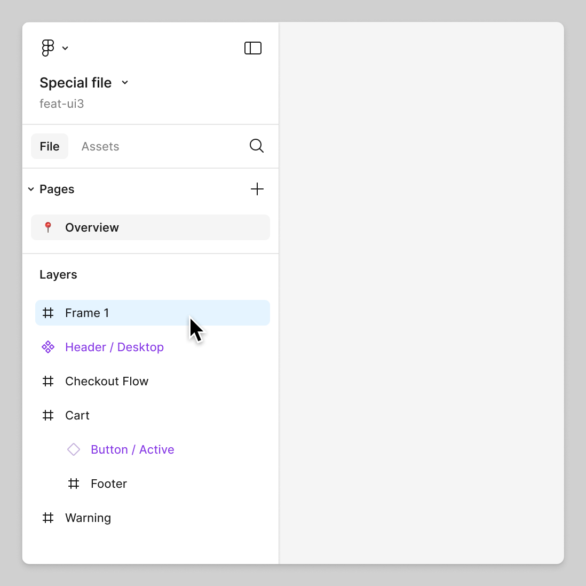
  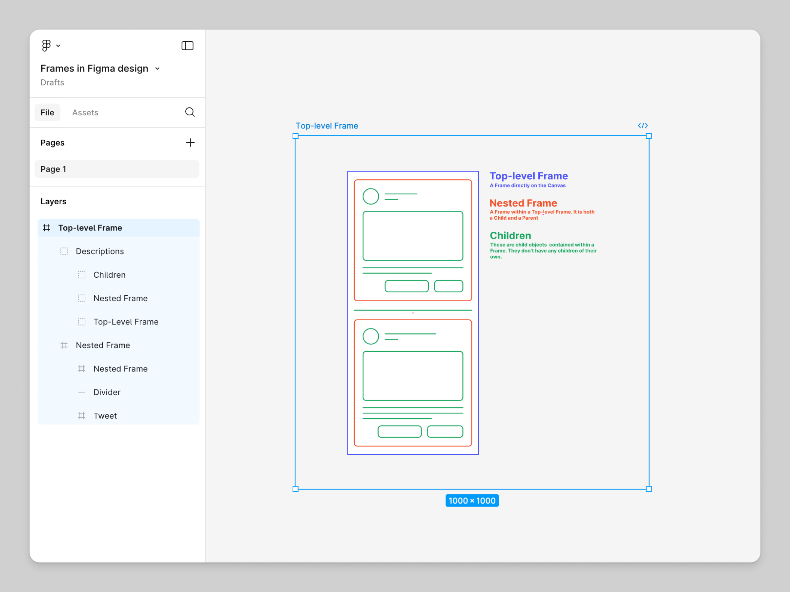
- A frame can have min and max size, and we can set constraints for child elements inside the frame to control how they behave when the frame is resized.

### Groups

- Groups are another way to organize layers in Figma. They allow designers to combine multiple layers into a single unit, making it easier to move and manipulate them together. Groups can be nested within frames or other groups, providing additional flexibility in organizing designs.
  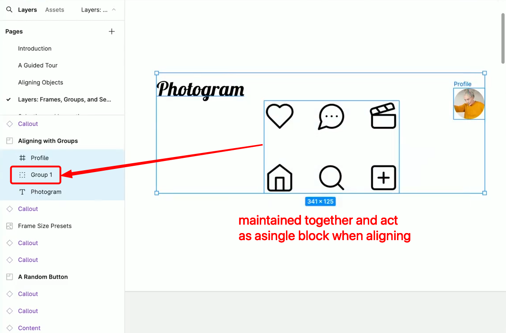

### Layout Grids

- Layout grids are a powerful tool in Figma that help designers create consistent and organized layouts. They can be applied to frames and provide a visual guide for aligning elements within the design. Layout grids can be customized with different column counts, gutter sizes, and margins to suit the needs of the design.
  
  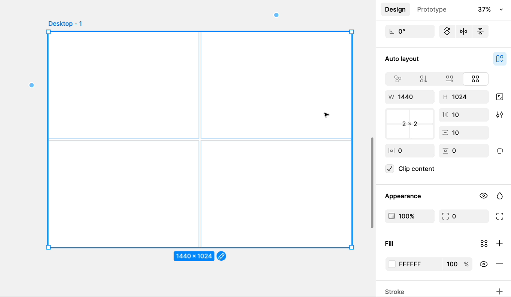
- We can save custom grid styles to reuse them across different frames and projects.

### Auto Layout

- Auto Layout is a feature in Figma that allows designers to create responsive designs that adapt to different screen sizes and content changes. With Auto Layout, designers can define how elements should behave when the size of the frame changes, such as resizing, spacing, and alignment.
  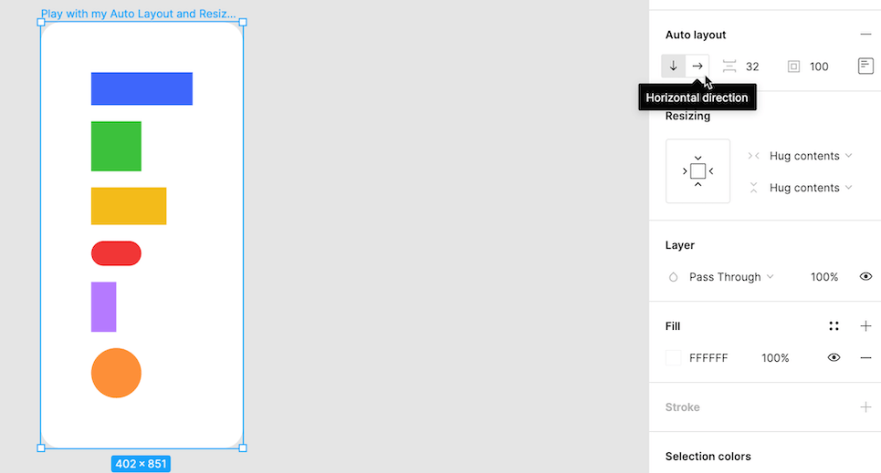

- More here in this article:
  - [Ultimate Guide to Mastering Auto Layout in Figma](https://www.uiprep.com/blog/ultimate-guide-to-mastering-auto-layout-in-figma)
- It's similar to using **Flexbox in CSS**, where you can set properties like direction, spacing, and alignment to control how elements are arranged within a container.
  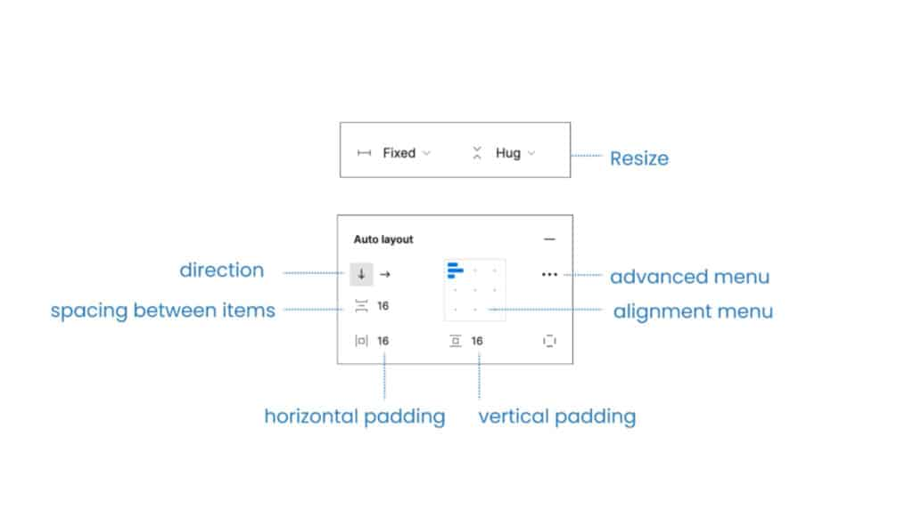
  - We can have nested auto layout frames to create more complex layouts.
- It's used for creating buttons, cards, lists, and other UI components that need to adapt to different content sizes and screen dimensions and need to be aligned consistently.
- It's used heavily by `Shift + A` shortcut to wrap selected elements in an auto layout frame.

#### Responsive Auto Layout

- Responsive Auto Layout is an advanced feature in Figma that allows designers to create designs that adapt to different screen sizes and orientations. With Responsive Auto Layout, designers can define how elements should behave when the size of the frame changes, such as resizing, spacing, and alignment.

---

### Components

Components are reusable design elements in Figma that can be used across multiple frames and projects. They allow designers to create a single source of truth for design elements, making it easier to maintain consistency and update designs.

- To create a component, select the elements you want to include and then use the `Create Component` option from the right-click menu or press `Ctrl + Alt + K` (or `Cmd + Option + K` on Mac).
- To use a component, simply drag and drop it from the `Assets` panel onto your design canvas.
  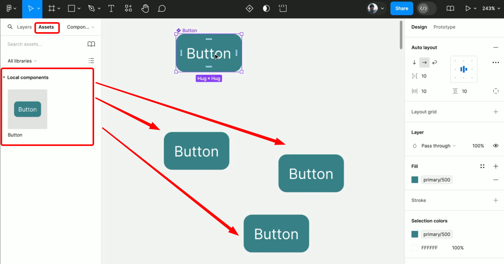
- It's like "Prototype Inheritance in JS", where you can create a base component and then create variations of that component by overriding specific properties.
- When you update the master component, all instances of that component will automatically update to reflect the changes.
- **Component Properties (props)**

  - They allow you to create variations of a component by exposing certain properties that can be modified in each instance. This is similar to how props work in React components.
    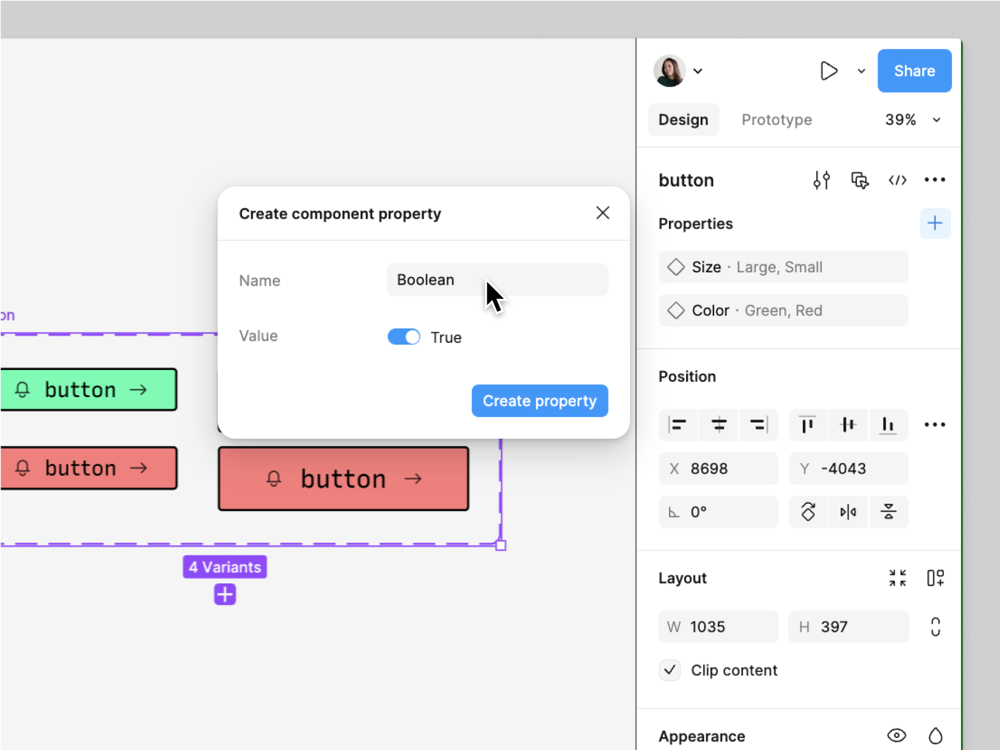
    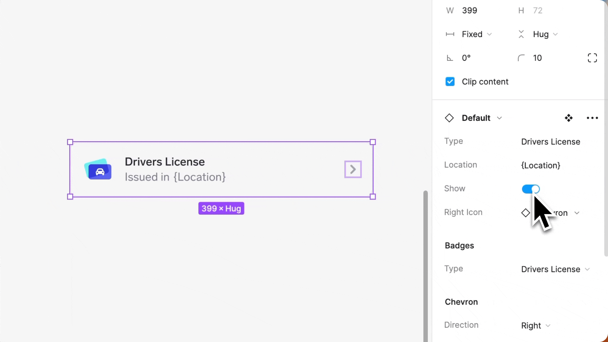

- **Component Variants**
  - Variants allow you to create multiple versions of a component within a single component set. This is useful for creating design systems where you have different states or styles for a component, such as buttons with different colors or sizes.

---

## Styles and Typography

- Styles in Figma are reusable design elements that can be applied to multiple layers or components. They can include colors, typography, effects, and grids. By using styles, designers can maintain consistency across their designs and make it easier to update and manage design elements.

- Shared styles allow you to store information about the color, text properties, shadows, or layouts into reusable styles. This is cool because if you update that style, then anything that points to that style will also update accordingly.
  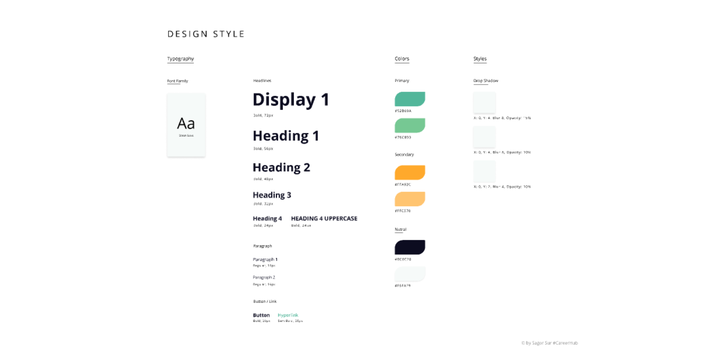

- You can create shared styles for any of the following:

  - Colors
    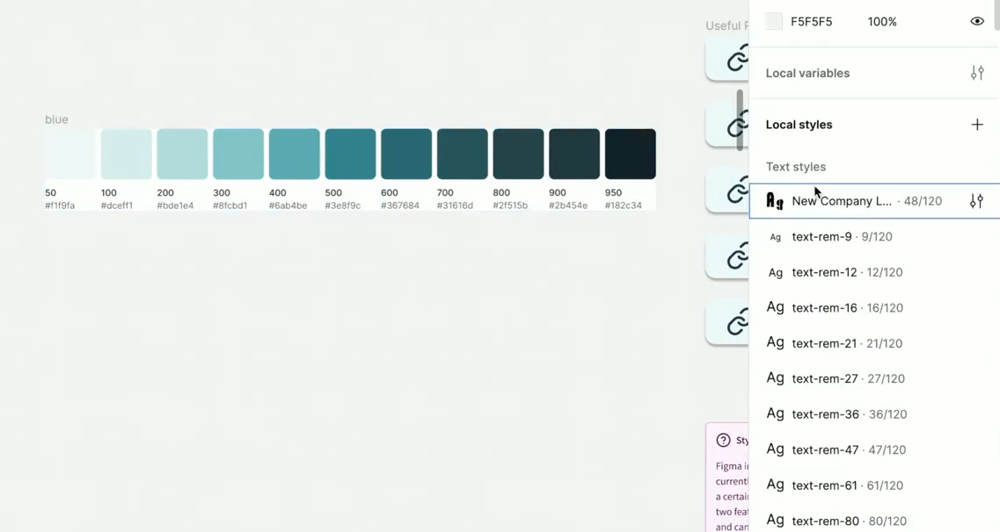
  - Text
    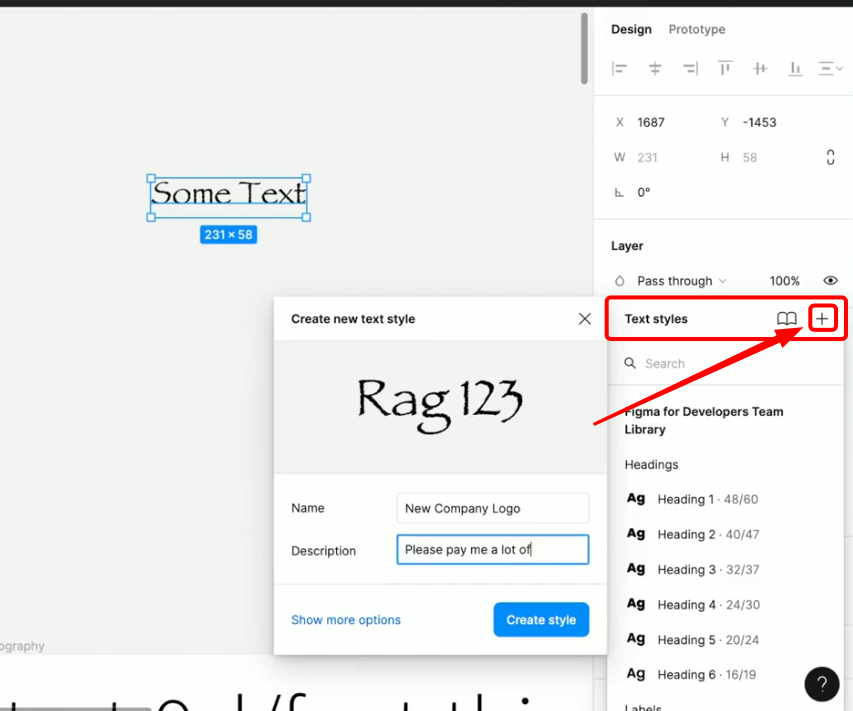
    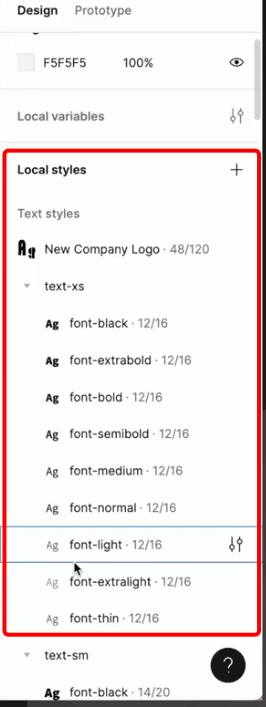
  - Effects (e.g. shadows and blurs)
  - Layout Grids

- We can use a plugin like:

  - [Styler](https://www.figma.com/community/plugin/820660579767995949/styler)

    - To create a style guide from the existing styles in a Figma file.
    - it bulk-applies styles to selected elements.
    - it lists all the styles in a file and shows where they are used.
    - Note that it generate names and group styles **based on their properties and layer-names**.

  - [Themer](https://www.figma.com/community/plugin/731176732337510831/themer)
    - To manage and apply themes to your designs.
  - [Typescales](https://www.figma.com/community/plugin/739825414752646970/typescales)
    - To create and manage typographic scales in your designs.
  - [Tailwind CSS Color Generator](https://www.figma.com/community/plugin/1242548152689430610/tailwind-css-color-generator)
    - To generate Tailwind CSS color palettes and styles.
  - [Variables to CSS](https://www.figma.com/community/plugin/1256552240995753259/variables-to-css)
    - To export Figma variables as CSS custom properties.

---

## Variables

Variables in Figma are a way to store and reuse values across your designs. They can be used for colors, text styles, effects, and other design properties. By using variables, designers can maintain consistency and make it easier to update and manage design elements.

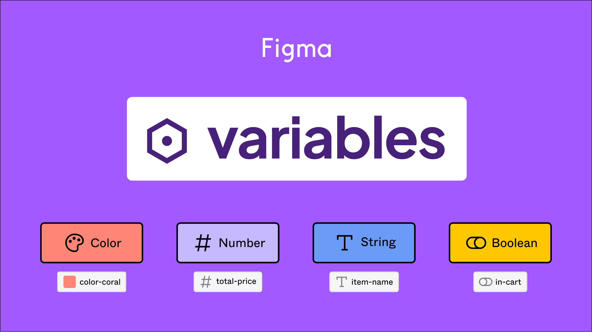

- We can access/create variables from the "Local variables" tab in the right sidebar when no elements are selected.
  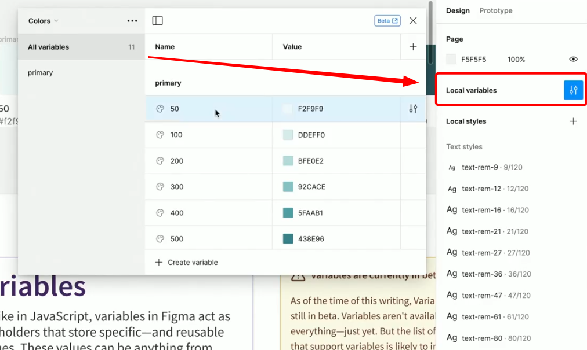

- To use a variable, select an element and then in the properties panel, click on the property you want to set (e.g., fill color, text color, etc.) and then click on the variable icon to choose a variable.
  
  - or right-click on the element and choose "Apply variable" from the context menu.

### Modes for variables

- Variables can have different modes, such as **light and dark mode**. This allows designers to create designs that adapt to different themes and contexts.
  
  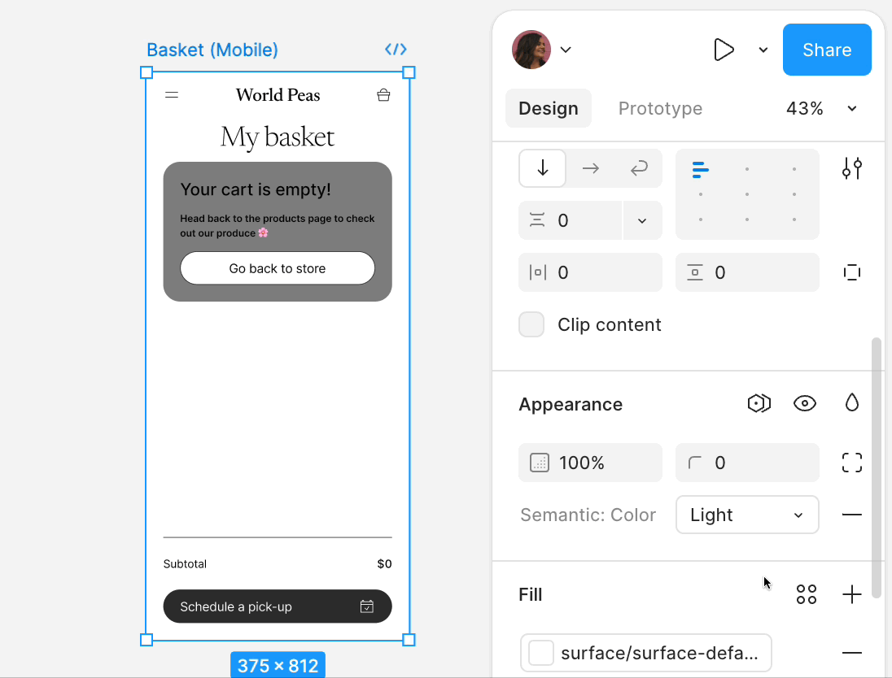

- Common use cases for modes include:

  - Light and dark themes for user interfaces.
  - Different color schemes for different brands or products.
  - Viewport-specific styles for responsive designs (e.g., mobile vs. tablet vs. desktop).
    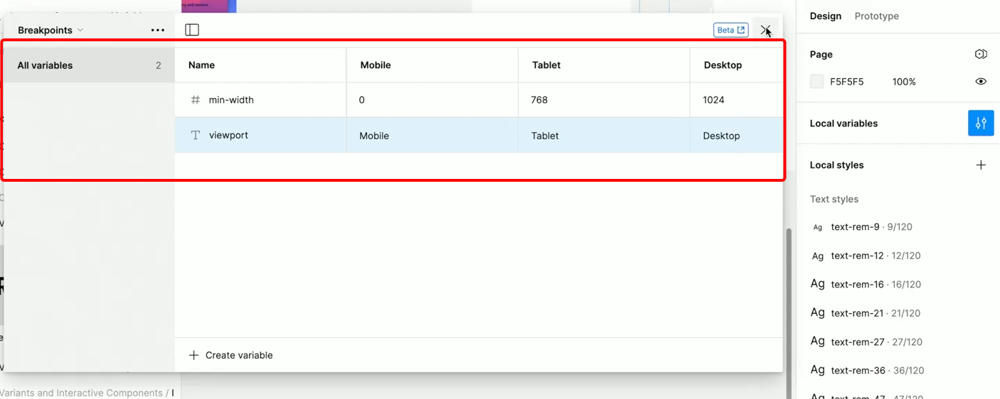
  - State-specific styles for interactive elements (e.g., hover, active, disabled).

---

## Prototyping

Prototyping in Figma allows designers to create interactive and animated designs that simulate the user experience of a website or application. With Figma's prototyping features, designers can create clickable prototypes that can be shared with stakeholders and tested with users.

- To create a prototype, select an element and then click on the `Prototype` tab in the right sidebar. From there, you can create interactions by dragging the blue circle from the selected element to another frame or element.
  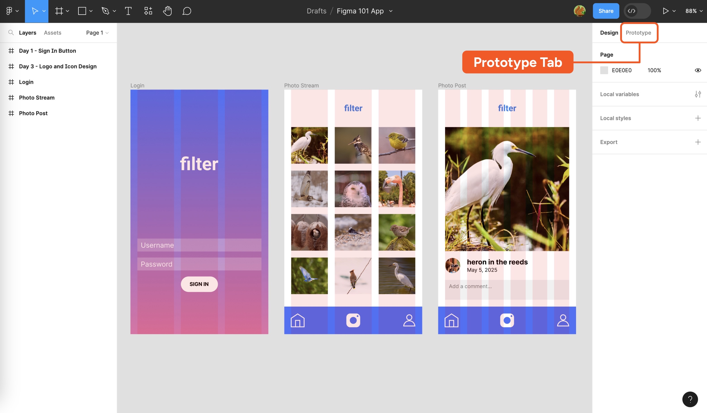
  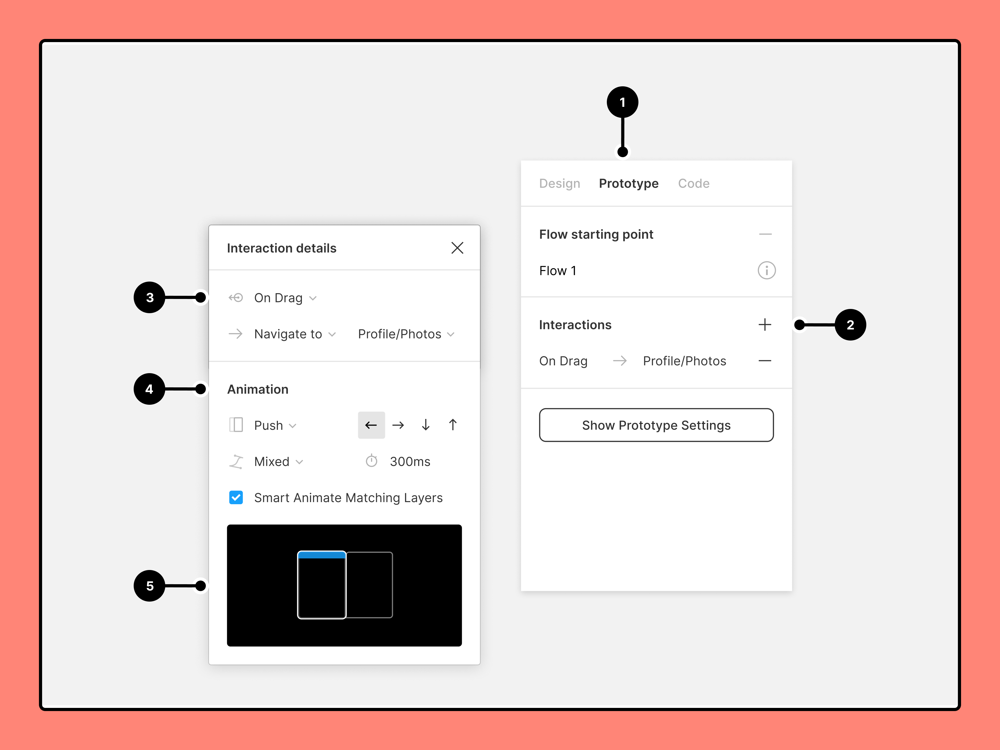

- You can set different types of interactions, such as `On Click`, `While Hovering`, `After Delay`, etc., and choose different transition effects, such as `Instant`, `Dissolve`, `Move In`, `Push`, etc.
  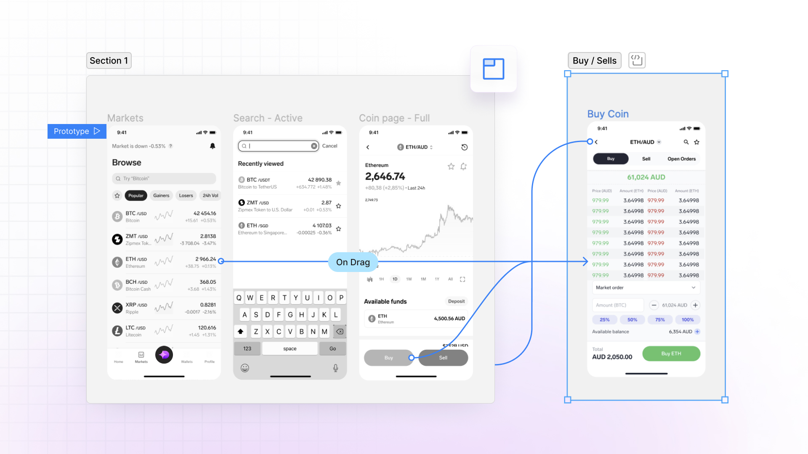
- You can also create overlays, which are elements that appear on top of the current frame, such as modals or dropdowns.

---

## Useful Shortcuts and tips

- To measure distances between elements: hold `Alt` (or `Option` on Mac) and hover over an element to see the distance to other elements.
  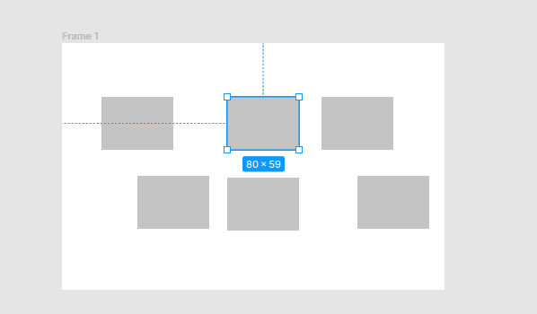

- To align elements: select multiple elements and use the alignment options in the toolbar or right-click menu.
  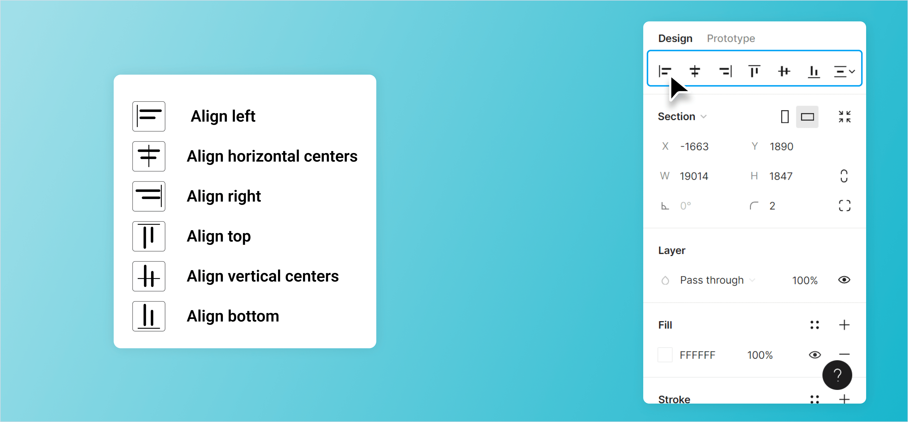
  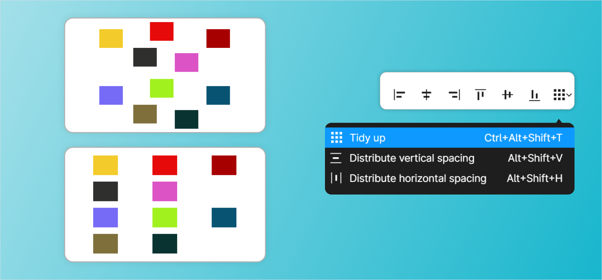

- To modify the space evenly between multiple elements: select the elements, then use the distribute spacing options in the toolbar or right-click menu.

- To smartly select similar elements: select an element, then from the `edit` menu, choose `Select all with same...` and pick the attribute you want to match (e.g., fill color, stroke color, etc.).
  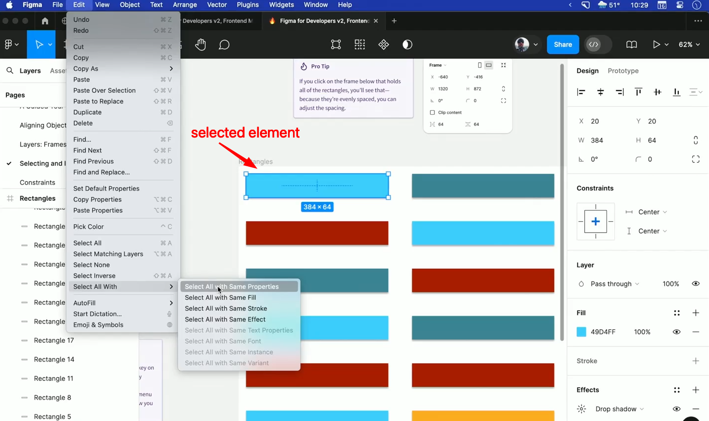

- We can lock scaling of a child element while resizing a frame in the **"constraints"** section of the right sidebar.
  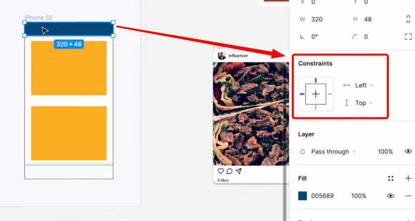

- To quickly create a auto layout frame: select the elements you want to include, then press `Shift + A` to wrap them in an auto layout frame.
