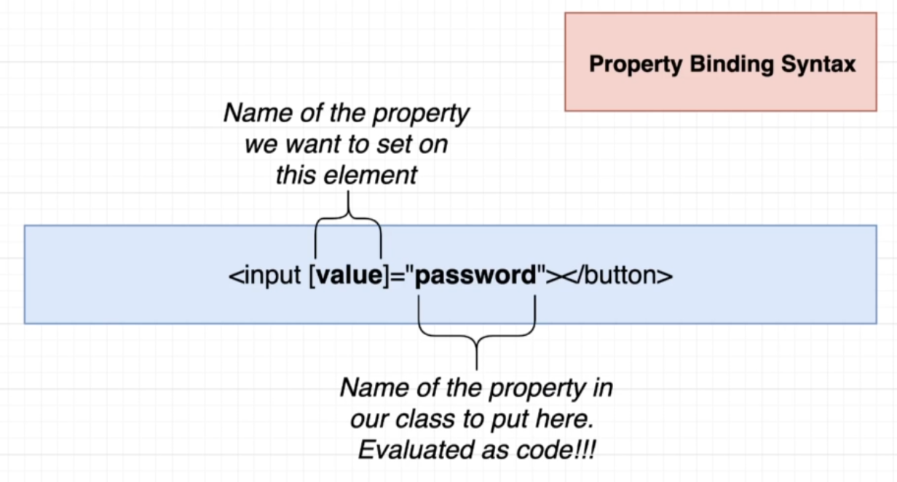

# INDEX

- [INDEX](#index)
  - [Angular](#angular)
    - [Angular History](#angular-history)
    - [How Angular works (Compilation)](#how-angular-works-compilation)
    - [Folders and files Structure](#folders-and-files-structure)
  - [Installation \& Updating (Angular CLI)](#installation--updating-angular-cli)
    - [Installation](#installation)
    - [Updating from old version to a new version](#updating-from-old-version-to-a-new-version)
  - [Components](#components)
  - [Styling and CSS](#styling-and-css)
    - [Inline style](#inline-style)
    - [External styles](#external-styles)
    - [Dynamic classes](#dynamic-classes)
    - [Encapsulated styles](#encapsulated-styles)
  - [Data-Binding](#data-binding)
    - [String Interpolation](#string-interpolation)
    - [Property Binding](#property-binding)
    - [Event Binding](#event-binding)
    - [2-way-binding](#2-way-binding)
      - [Custom 2-way binding](#custom-2-way-binding)
    - [Data Binding Notes](#data-binding-notes)
  - [Directives](#directives)
    - [Attribute Directives](#attribute-directives)
    - [Structural Directives](#structural-directives)
    - [Multiple Directives](#multiple-directives)
    - [Custom Directives](#custom-directives)
      - [Custom Attribute Directive](#custom-attribute-directive)
      - [Custom Structural Directive](#custom-structural-directive)
  - [Data flow between components](#data-flow-between-components)
    - [Parent to Child (Passing data / Input / Props)](#parent-to-child-passing-data--input--props)
    - [Child to Parent (Emitting events / Output)](#child-to-parent-emitting-events--output)
    - [Template variable (Refs)](#template-variable-refs)
    - [Content projection (Slots)](#content-projection-slots)
      - [Single-slot content projection](#single-slot-content-projection)
      - [Multi-slot content projection](#multi-slot-content-projection)
      - [Handling projected content](#handling-projected-content)
  - [Pipes](#pipes)
    - [How to use Pipes](#how-to-use-pipes)
    - [Built-in pipes](#built-in-pipes)
    - [Custom Pipes](#custom-pipes)
    - [Chaining pipes](#chaining-pipes)
  - [Modals (Portals and Overlays)](#modals-portals-and-overlays)
    - [Angular CDK (Component Dev Kit)](#angular-cdk-component-dev-kit)
  - [Angular Service Worker](#angular-service-worker)
  - [Notes](#notes)
    - [Expressions vs String Interpolation](#expressions-vs-string-interpolation)
    - [Angular HTML Escaper (Sanitization / Security)](#angular-html-escaper-sanitization--security)

---

## Angular

Angular is a `framework` for building **reactive** web applications.

> "reactive" means that the app responds to user input and changes in the environment in real-time (by manipulating the **DOM**)

- It's a **framework** because it provides a lot of things out of the box like `routing`, `forms`, `http` libraries, etc.
- It's also a **collection of tools** that help you build web applications, like `Angular CLI`, `Debugger`, `DevTools`, `IDE Plugins`, etc.
- Code is written in `Typescript`, and Templates are written in Angular template syntax (which is a superset of `HTML` with Angular-specific syntax).

---

### Angular History


1. Angular was created by Google in 2010 as a JavaScript framework called `AngularJS` (or Angular 1)
2. In 2016, Google released a complete rewrite of AngularJS called `Angular` (or Angular 2+), which is a TypeScript-based framework

   - Angular 2+ is a complete rewrite of AngularJS, and it's not backward compatible with AngularJS
   - It's based on **Modules** and **Components** architecture, which makes it more modular and easier to maintain

3. Angular has been continuously updated since then, with new versions released every 6 months
   - But note that any new version of Angular is backward compatible with the previous version, so you can upgrade your app to the latest version without breaking it
4. The latest version of Angular is `Angular 20` (May 2025), which is the latest stable version at the time of writing this document
   - Since Angular 16, Angular moved

---

### How Angular works (Compilation)

- **This is how Angular works under the hood (App bootstrap process)**

  1. When you run the `ng serve` command, Angular CLI starts a development server that serves the app, and compiles the app code into JavaScript code that the browser can understand
     

  2. The server sends the `index.html` file to the browser **(Angular injects a `<script>` tag into the `index.html` file that loads the `main.ts` file)**
     

     - The `main.ts` file bootstraps the `AppModule` and starts the app (or if using standalone components, it bootstraps the main component directly)

       ```ts
       // main.ts 📄
       import { bootstrapApplication } from '@angular/platform-browser';
       import { AppModule } from './app/app.module'; // or import the main component directly

       // bootstrap the AppModule and start the app
       bootstrapApplication(AppModule).catch(err => console.error(err));
       ```

  3. The `AppModule` is the main module of the app, and it imports all the other modules and components that are needed for the app to work

     ```ts
     // app.module.ts 📄
     // import the necessary modules and components and services

     @NgModule({
       declarations: [AppComponent], // declare the components that are used in the app
       imports: [BrowserModule, AppRoutingModule, FormsModule], // import the modules that are needed for the app
       providers: [AppService], // provide the services that are used in the app
       bootstrap: [AppComponent] // bootstrap the main component of the app
     })
     export class AppModule {}
     ```

  4. The `<app-root>` component is the main component of the app, and it is defined in the `app.component.ts` file. It serves as the entry point for the application and contains the HTML template for the app.

     - Angular creates an **instance** of the `AppComponent` class and inserts it into the DOM at the location of the `<app-root>` tag.
     - Then it turns the instance's template into HTML and inserts it into the DOM (into the `host` element)

  5. Angular inspects the main `app-component` for any sub-components that need to be rendered and creates instances of those components as well.
     - It continues this process recursively until all components in the app have been instantiated and rendered.

> **Compilation** is the process of converting the Angular code into `Javascript` code that the browser can understand

- **There are 2 types of compilation strategies in Angular:**

- Just-in-time compilation
  

  - Here, the server compiles typescript code into javascript code
  - Then, the browser downloads the javascript code (including the Angular framework) and runs & compiles it
  - This is the default compilation strategy in Angular
  - It's good for development because it's faster to compile and run the app, but it's slower for the browser to load and run the app
  - It's good for small to medium-sized apps
  - It's not used in production because it's slower for the browser to load and run the app

- Ahead-of-time compilation
  

  - Here, the server compiles typescript code into javascript code (same as JIT)
  - Then, the server compiles the javascript code into a bundle that the browser can understand
  - The browser downloads the bundle and runs it immediately (no need to compile it)
  - It's good for production because it's faster for the browser to load and run the app

  - It's faster and more efficient ✅
    

- selecting platform to run the app (`Compilation Strategy`)


- **Note:** Starting from Angular 18, the default compilation strategy is `AOT` (Ahead-of-time compilation), and no need to specify it in the `angular.json` file

- **Incremental DOM**
- it's a technique used by Angular to update the DOM efficiently
- Angular keeps a copy of the DOM in memory, and when the data changes, Angular compares the new DOM with the old DOM and only updates the parts that have changed
- It's similar to `Virtual DOM` in `React` but more efficient
- Read this [article](https://medium.com/@mubeennaeem247/angular-incremental-dom-bcae3db06108) for more information

---

### Folders and files Structure

In Angular, the `src` folder is the main folder that contains all the files of the app.

- **File structure**

- `app` folder : contains all the components, services, and modules
  - `app/app.component.html` : the html file for the main component
  - `app/app.component.ts` :
    - the main component of the app
    - it has the content that would be in the `app-root` tags in `index.html`
      - target can be html-code or `templateUrl` containing path for html file
  - `app/app-routing.module.ts` : the routing module of the app
  - `app/app.service.ts` : the main service of the app
    - it's a class that can be injected into components and contains code that (fetches/stores/update) data
  - `app/app.module.ts` : the main module of the app
    - It's a gate to import the main app components and services
      
- `assets` : contains all the static files like images, fonts, etc.
- `environments` : contains the environment files for the app
- `styles.css` : contains the global styles for the app
- `index.html` : the main html file for the app
- `main.ts` : the main typescript file that starts the app
  - it contains the `bootstrapModule` function that bootstraps the `AppModule` -> starts up `app.module.ts`, So we need to register the main module here.
- `polyfills.ts` : contains the polyfills for the app (features that are not supported in all browsers)
- `tsconfig.json` : contains the typescript configuration for the app
- `angular.json` : contains the configuration for the app (like build settings, etc.)

  - The most important part in this file is the `"architect"` object, which contains the build configurations for the app
    

- Example
  

- **Images**

  - external images (hosted on different server) -> just need `url` in the `src` attribute

    ```html
    
    ```

  - local images

    - **(assets folder)** -> need to use `src` attribute with the path of the image in the `assets` folder

      ```html
      
      ```

      - **⚠️ Note:** If you don't see the image, make sure that the path is added in `angular.json` file in the `assets` array

        ```json
        "assets": [
          "src/favicon.ico",
          "src/assets"
        ]
        ```

    - **(public folder)** -> need to use `src` attribute with the path of the image in the `public` folder without any prefix (because the `public` folder is the root folder for static files)

      ```html
      
      ```

      - **⚠️ Note:** If you don't see the image, make sure that the path is added in `angular.json` file in the `assets` array

        ```json
        "assets": [
          "src/favicon.ico",
          "src/assets",
          "src/public" // add this line ✅
        ]
        ```

---

## Installation & Updating (Angular CLI)

**Angular CLI** is a command-line interface tool that helps you to create, develop, and maintain Angular applications.

### Installation

it's a utility tool for managing projects and tools (like `webpack`, `Babel`, `Typescript`, etc.) that are needed for Angular development.


- Installing `Angular CLI` globally to use it in the terminal

```bash
npm install -g @angular/cli
```

- ng-commands

  ```sh
  # Creating new project
  ng new <project_name>

  # Create new project with flags (routing, style, strict)
  ng new <project_name> --routing --style=scss --no-strict

  # Starting development server
  npm start # or ng serve

  # Generating new component
  ng generate component <name of component>
  # Generating new module
  ng generate module <name of module>

  # To skip creating test files for the component/module
  ng generate component <name of component> --skip-tests
  ```

- modules generated with `cli` are not registered in the app so you need import the module into the `app.module`
- now, we can use `Vite` instead of `Angular CLI` for faster development

---

### Updating from old version to a new version

[Update Guide](https://angular.dev/update-guide)

---

## Components

Content here in the [2-Angular-Components.md](2-Angular-Components.md) file.

---

## Styling and CSS

There're many ways to style Angular components:

1. Inline styles -> `style="color: red"`
2. External styles -> `styles.css`

- `styles.css`
  - is a global stylesheet that will be applied to all components in the app
- `app.component.css`
  - is a stylesheet that will be applied only to the `app.component` **(Scoped)**

### Inline style

The `style` attribute can be used to add inline styles to an element

```html
<button style="color: red">Click me</button>
```

- You can also use `ngStyle` directive to add styles dynamically

  ```html
  <button [ngStyle]="{color: isRed ? 'red' : 'blue'}">Click me</button>
  ```

- or you can use the `style` binding to add styles dynamically

  ```html
  <button [style.color]="currentColor">Click me</button>
  <!-- Here, `currentColor` is a property in the component class, and we want to add its value as a style to the button element -->
  ```

---

### External styles

- You can add styles to the `styles.css` file to apply them **globally to the app**

  ```css
  /* in styles.css */
  button {
    color: red;
  }
  ```

- You can also add styles to the `app.component.css` file to apply them only to the `app.component` **(scoped styles)**

  ```ts
  // in app.component.ts
  @Component({
    selector: 'app-root',
    templateUrl: './app.component.html',
    styleUrls: ['./app.component.css'] // add the css file here ✅
    // or
    // styles: [`h1 { color: red; }`] // add the styles directly here ✅
  })
  export class AppComponent {}
  ```

  ```css
  /* in app.component.css */
  button {
    color: red;
  }
  ```

  - How does Angular scope styles for each component?
    - Angular uses a technique called **View Encapsulation** to scope styles for each component. This means that styles defined in a component's CSS file will only apply to that component and its children, not to other components in the application.

- **Host Element**
  

  - Every component has a **host element** that is the root element of the component in the DOM
  - The host element is the element that is used to render the component in the DOM, and it can be selected using the `:host` pseudo-class in the CSS file of the component

  ```html
  <!-- in app.component.html -->
  <h1>My App</h1>
  <button>Click me</button>
  ```

  ```css
  /* in app.component.css */
  :host {
    display: block; /* This will apply to the host element */
    border: 1px solid black; /* This will apply to the host element */
  }
  ```

- **Styling `<app-root>` component/element**
  - The only way to use the `app-root` element-selector inside a css file is by using it inside the `styles.css` main file.
  - If you tried to use it inside the `app.component.css` file, it wouldn't work because of Angular's view encapsulation.
  - Another way to style the `app-root` element is by using the `:host` pseudo-class in the `app.component.css` file.

---

### Dynamic classes

- To add fixed classes to an element, you can use the `class` attribute

  ```html
  <button class="btn">Click me</button>
  ```

- To add class names in a JS string, you can use the `class` binding

  ```html
  <button [class]="classNames">Click me</button>
  <!-- Here, `classNames` is a property in the component class, and we want to add its string value as a class to the button element -->
  ```

- To add classes dynamically, you can use the `ngClass` or `class` binding

  ```html
  <button [ngClass]="{btn-error: isError}">Error Button</button>
  <!-- or -->
  <button [class]="{'btn-error': isError}">Error Button</button>
  ```

  - It's a common pattern to use a method in the component class to return the classes

    ```html
    <button [ngClass]="getClasses()">Click me</button>
    ```

    ```ts
    // in the component class
    getClasses() {
      return {
        btn: true,
        error: this.isError
      };

      // or
      if (this.isError) {
        return 'btn error';
      } else {
        return 'btn';
      }
    }
    ```

- ✅ Or to dynamically add classes based on a condition, you can use the `class.<class-name>` syntax

  ```html
  <button [class.btn-error]="isError">Error Button</button>
  <!-- conditionaly adding the class btn-error if isError is true -->
  ```

---

### Encapsulated styles

Sometimes you want to apply styles to a component, but you don't want those styles to affect other components. In Angular, you can use **encapsulated styles** to achieve this.

- **Encapsulated styles** are styles that are applied only to the component and its children, and they don't affect other components
- This is done by using the `ViewEncapsulation` property in the `@Component` decorator

  ```ts
  import { Component, ViewEncapsulation } from '@angular/core';
  @Component({
    selector: 'app-root',
    templateUrl: './app.component.html',
    styleUrls: ['./app.component.css'],
    encapsulation: ViewEncapsulation.Emulated // default value 👈
  })
  export class AppComponent {}
  ```

- It has 3 possible values:
  - `ViewEncapsulation.Emulated` (default): styles are encapsulated and don't affect other components
  - `ViewEncapsulation.None`: styles are applied **globally** and affect all components
  - `ViewEncapsulation.ShadowDom`: styles are encapsulated using Shadow DOM, which is a web standard that allows you to create a separate DOM tree for the component

---

## Data-Binding

**Data-binding** is a way to pass data from the component class to the component template and vice versa (Communication between the component class and the template)


### String Interpolation

It's a way to display data in the template using `{{}}` syntax

- It's a one-way data binding from the component to the template

```html
<p>{{ property_x }}</p>
```

- Here, we are binding the `property_x` from the component class to the template, so that when the value of `property_x` changes, the template will be updated automatically

---

### Property Binding

It's a way to bind the properties of an HTML element to the properties of the component class

- It's a one-way data binding from the component to the template using **square brackets `[]`** around the property name

- It's like `Attribute Directives` as if the value is true you will add the attribute/class to the html element
  

- Here, we **bind** the property of an element to a property in the component class
- Example

  ```html
  <!-- in component.ts file: the propery_x:true or false -->
  <button [disable]="propery_x"></button>

  <input [value]="password" />

  <p>{{ property_x }}</p>

  <p [innerText]="property_x"></p>
  ```

  - `disable` is a property of the button element, and we are binding it to the property `propery_x` in the component class
  - `value` is a property of the input element, and we are binding it to the property `password` in the component class

- It's also used to pass data from the parent component to the child component **(props)**

  ```html
  <!-- in parent component -->
  <app-child [childProperty]="parentProperty"></app-child>

  <!-- in child component -->
  <p>{{ childProperty }}</p>
  ```

---

### Event Binding

It's a way to bind an event of an HTML element to a method in the component class by setting up an event handler on the element using **parentheses `()`** around the event name

- Here we write events-attribute in the html element and call a method from the class
  

- Here we usually call a method from the class **(binding a method to an event)**

  ```html
  <button (click)="sayHi()"></button>
  ```

- In order to access the `event` object in the method, we can pass it as an argument using `$event` reserved word

  ```html
  <input (input)="onInput($event)" />
  ```

  ```ts
  onInput(event: Event) {
    console.log(event.target.value);
  }
  ```

- We don't need to write the class name in the method because Angular knows that it's a method from the class
  - `myComponent.sayHi()` ❌ (in the template)
  - `this.sayHi()` ❌ (in the template)
  - `sayHi()` ✅ (in the template)
- `$event` : it's a reserved word used with event binding so that you can use the event as an argument of the method
- Comparison of form-handling in Angular and Vanilla JS
  

---

### 2-way-binding

- it's the ability to being able to listen to events and update a property simultaneously
- It's usually used with form elements like `input`, `select`, and `textarea`
- It's a combination of property binding and event binding, and it's done using the `ngModel` directive

  ```html
  <input [(ngModel)]="name" />
  <p>{{ name }}</p>

  <!-- Instead of -->
  <input [value]="name" (input)="name = $event.target.value" />
  <p>{{ name }}</p>
  ```

  - here the `ngModel` directive is doing 2 tasks:
    - set value of the attribute with property-binding
    - **Emit an event** when the property changes in the template

- **⚠️ Note:** In order to use `ngModel`, you need to import the `FormsModule` in the `app.module.ts` file

  ```ts
  import { FormsModule } from '@angular/forms';

  @NgModule({
    declarations: [AppComponent],
    imports: [BrowserModule, FormsModule], // import the FormsModule here 👈
    providers: [],
    bootstrap: [AppComponent]
  })
  export class AppModule {}
  ```

#### Custom 2-way binding

- You can create a custom 2-way binding using the `@Input()` and `@Output()` decorators in the component class

  - The trick here is the naming of the `@Output()` property, which should be named with the `Change` suffix to indicate that it is a 2-way binding -> **(e.g. `value` and `valueChange`)**

    ```ts
    import { Component, Input, Output, EventEmitter } from '@angular/core';

    @Component({
      selector: 'app-custom-input',
      template: `
        <input [value]="value" (input)="onInput($event)" />
      `
    })
    export class CustomInputComponent {
      @Input() value: string = '';
      @Output() valueChange = new EventEmitter<string>();

      onInput(event: Event) {
        const inputValue = (event.target as HTMLInputElement).value;
        this.valueChange.emit(inputValue);
      }
    }
    ```

  - And then you can use it in the parent component like this:

    ```html
    <app-custom-input [(value)]="name"></app-custom-input>
    ```

- **Newer and easier way** to do custom 2-way binding is to use **Signals** (`model` directive) in the component class, which is a shorthand for `[(ngModel)]`

  ```ts
  import { Component, model } from '@angular/core';

  @Component({
    selector: 'app-custom-input',
    template: `
      <input [value]="value()" (input)="onInput($event)" />
    `
  })
  export class CustomInputComponent {
   value = model<string>(''); // create a model signal with initial value
   // ⚠️ No need for @Input() and @Output() decorators

    onInput(event: Event) {
      const inputValue = (event.target as HTMLInputElement).value;
      this.value.set(inputValue); // update the model signal value
    }
  ```

  - And then you can use it in the parent component like this:

    ```html
    <app-custom-input [(value)]="name"></app-custom-input>
    ```

---

### Data Binding Notes

- It's a good practice to make binded values in the template as simple as possible, so that the template is easy to read and understand, So if you have a complex expression, it's better to move it to a method in the component class and call that method in the template

  ```html
  <!---------------------------- ❌ ---------------------------->
  <!-- in template -->
  <p>{{ firstName + ' ' + lastName }}</p>

  <!---------------------------- ✅ ---------------------------->
  <!-- in template -->
  <p>{{ getFullName() }}</p>

  <!-- in component class -->
  getFullName() { return `${this.firstName} ${this.lastName}`; }
  ```

  - Also you can make the method a `getter` so that it can be used as a property in the template

    ```ts
    get fullName() {
      return `${this.firstName} ${this.lastName}`;
    }
    ```

    ```html
    <!-- in template -->
    <p>{{ fullName }}</p>
    ```

---

## Directives

It's a way to extend the HTML with custom behavior and functionality **(Enhancements to HTML)**, allowing you to create reusable components and manipulate the DOM in a declarative way.

- **Angular directives** are extended `HTML attributes` with the prefix `"ng-"` (or `[]`, `*` syntax).
  

> [Directives Resource](https://angular.io/api?type=directive)

- They're **instructions** in the DOM that tell Angular to do something to a DOM element
- **Directives Types**
  
  

- Angular has built-in directives:
  - [Structural directives](#structural-directives): Change the DOM structure by adding/removing elements.
    - `*ngIf`: Conditionally remove/recreate DOM.
    - `*ngFor`: Repeat DOM for each list item.
    - `*ngSwitch`: Swap DOM based on expression.
  - [Attribute directives](#attribute-directives): Change the appearance or behavior of an element.
    - `ngStyle`: Set inline styles.
    - `ngClass`: Add/remove CSS classes.
    - `ngModel`: Two-way data binding.
  - [Multiple directives](#multiple-directives): Combine multiple directives for complex behavior.
    - `<ng-container>`: Grouping element, no style/layout impact.
    - `<ng-template>`: Grouping element, no style/layout impact.

---

### Attribute Directives

- attribute directive changes the appearance or behavior of a DOM element
- used to add styles,classes (modify appearance through attributes)

- look here for full types and documentation [Attribute Directives](https://angular.io/guide/attribute-directives)

- `ngStyle` : it sets inline styles on an HTML element

  ```html
  <button [ngStyle]="{color: 'red', 'font-size': '20px'}">Click me</button>
  ```

  - Here, we are setting the color and font-size of the button element using the `ngStyle` directive

  ```html
  <button [ngStyle]="{color: isRed ? 'red' : 'blue', 'font-size': isBig ? '20px' : '10px'}">
    Click me
  </button>
  ```

  - Here, we are setting the color and font-size of the button element dynamically using the `isRed` and `isBig` properties from the component class

- `ngClass` : it adds and removes CSS classes on an HTML element

  ```html
  <!-- in css-file we have class ".error" -->
  <button [ngClass]="{error: isError}">Error Button</button>
  ```

  - Here, we are adding the `error` class to the button element if the `isError` property is `true`
  - `[class]` is also a way to add/remove classes dynamically but it requires more boilerplate code

    ```html
    <button [class]="isError ? 'error' : ''">Error Button</button>
    ```

- `ngModel` : it creates a two-way data binding on form elements

  ```html
  <input [(ngModel)]="name" />
  ```

  - Here, we are creating a **two-way data binding** on the input element, so that the `name` property in the component class is updated when the input value changes, and the input value is updated when the `name` property changes

---

### Structural Directives

- it can add or remove elements from the DOM
- it starts with `*` and it's a `directive` that changes the structure of the DOM
- Angular makes the content inside of `<ng-template>` become hidden but Angular will be aware of it so that it can be used based on condition
- **⚠️ You can only apply one structural directive per element**

  - To do so, you can wrap the element with a `<ng-container>` or `<ng-template>` -> [see more here](#multiple-directives)

- **Angular <= 16**

  - `*ngIf`

    ```html
    <!-- this element "<p>" will only show if the property "blueClass=True" -->
    <p *ngIf="blueClass">the button is blue</p>
    ```

  - `*ngFor`

    ```html
    <ul>
      <li *ngFor="let item of items">{{ item }}</li>
      <!-- Or, to access the index -->
      <li *ngFor="let item of items; let i = index">{{ i }} - {{ item }}</li>
    </ul>

    <!-- OR, passing props -->

    <app-card *ngFor="let card of cards" [title]="card.title" [content]="card.content"></app-card>
    ```

  - `*ngSwitch`

    ```html
    <div [ngSwitch]="color">
      <!-- It checks the value of the "color" variable and displays the corresponding paragraph -->
      <p *ngSwitchCase="'red'">Red color</p>
      <p *ngSwitchCase="'blue'">Blue color</p>
      <p *ngSwitchDefault>Invalid color</p>
    </div>
    ```

  > **Note:** You need to import `CommonModule` in your component to use structural directives.

- **Angular >= 17**

  - with the new syntax, we can use structural directives without the `*ng` prefix, and we can use them with the `@` prefix
  - It's better because it makes the code cleaner and easier to read, and it allows us to use structural directives in a more consistent way, also it has better TypeScript support.

  - `@if`

    ```html
    @if (condition) {
    <p>The condition is true</p>
    }

    <!-- Or, with an else block -->
    @if (condition) {
    <p>The condition is true</p>
    } @else {
    <p>The condition is false</p>
    }
    ```

  - `@for`

    ```html
    <ul>
      @for (item of items; track $index) {
      <li>{{ item }}</li>
      }
    </ul>

    <!-- Or, to access the index with tracking -->
    <ul>
      @for (item of items; track i) {
      <li>{{ i }} - {{ item }}</li>
      }
    </ul>
    ```

  - `@switch`

    ```html
    <div @switch (color) { @case 'red':
    <p>Red color</p>
    @case 'blue':
    <p>Blue color</p>
    @default:
    <p>Invalid color</p>
    }
    ```

- [Shorthand examples](https://angular.io/guide/structural-directives#shorthand-examples)

---

### Multiple Directives

- `ng-container`

  - it's a grouping element that doesn't add any extra element to the DOM, and it can be used to group multiple elements together and apply a structural directive to them
  - It's like an **invisible element**

    ```html
    <ng-container *ngIf="condition">
      <p>Item 1</p>
      <p>Item 2</p>
      <p>Item 3</p>
    </ng-container>
    ```

  - We can't use both `*ngIf` and `*ngFor` on the same element, so we use `<ng-container>` to group them together, and use them on the `<ng-container>` element

    ```html
    <!-- ❌ -->
    <p *ngIf="condition" *ngFor="let item of items">{{ item }}</p>

    <!-- ✅ -->
    <ng-container *ngIf="condition">
      <p *ngFor="let item of items">{{ item }}</p>
    </ng-container>
    ```

  - It's similar to:
    - `<template>` in **Vue.js**
    - `<Fragment>` in **React**

- `ng-template`

  - it's a grouping element that doesn't add any extra element to the DOM, and it can be used to group multiple elements together and apply a structural directive to them
  - It allows us to **define a template that can be used later** in the component, and it can be used with structural directives like `*ngIf` and `*ngFor`
  - It can be used to be a placeholder for content that will be rendered later **(lazy loaded)**

    ```html
    <button (click)="openModal()">Open Modal</button>

    <ng-template #modalContainer></ng-template>
    ```

    ```ts
    //in component.ts
    import { Component, ViewChild, TemplateRef } from '@angular/core';

    export class ModalComponent {
      @ViewChild('modalContainer', { static: true }) modalContainer!: TemplateRef<any>;

      openModal() {
        // Here we can use the modalContainer template to render the modal content

        // 1. Open modal
        this.isModalOpen = true;
        // 2. Load FavoritesModalComponent dynamically
        const { ModalComponent } = await import('./modal.component');
        // 3. Create component and insert it in the modal container ref
        this.modalRef = this.modalContainer.createComponent(ModalComponent);
      }
    }
    ```

---

### Custom Directives

- To create a custom directive, you can use the `Angular CLI` to generate a new directive

  ```bash
  ng generate directive <directive-name>
  ```

  - this will create a file in the `app` folder with the name `<directive-name>.directive.ts` and add the directive to the `declarations` array in the `app.module.ts` file
  - the file will contain a class with the name `<DirectiveName>Directive`
  - the class will have a `constructor` method that takes an `ElementRef` and a `Renderer2` as arguments

- We can also use `standalone: true` to make the directive standalone, so that it can be used without importing it in the `app.module.ts` file

  ```ts
  @Directive({
    selector: '[appHighlight]',
    standalone: true // makes the directive standalone
  })
  export class HighlightDirective {
    constructor(private el: ElementRef, private renderer: Renderer2) {}
  }
  ```

#### Custom Attribute Directive

Here, we use `ElementRef` and `Renderer2` to create an attribute directive and **manipulate the DOM**.

- **Example: creating a custom directive to highlight an element**

  ```sh
  ng generate directive highlight
  ```

  ```ts
  // in app/highlight.directive.ts
  import { Directive, ElementRef, Renderer2 } from '@angular/core';

  @Directive({
    selector: '[appHighlight]'
  })
  export class HighlightDirective {
    constructor(private el: ElementRef, private renderer: Renderer2) {
      this.renderer.setStyle(this.el.nativeElement, 'backgroundColor', 'yellow'); // recommended ✅
      // or
      this.el.nativeElement.style.backgroundColor = 'yellow'; // it's not recommended ❌
    }
  }
  ```

  ```html
  <p appHighlight>Highlight me!</p>
  ```

  - `el` -> is a reference to the element that the directive is applied to
  - `renderer` -> is a service that can be used to modify the element in a way that is safe from XSS attacks

- **Example: setting background color dynamically**

  ```ts
  // in app/highlight.directive.ts
  import { Directive, ElementRef, Renderer2, Input } from '@angular/core';

  @Directive({
    selector: '[appHighlight]'
  })
  export class HighlightDirective {
    @Input() color = 'yellow'; // we can pass the color as a property to the directive

    constructor(private el: ElementRef, private renderer: Renderer2) {
      this.renderer.setStyle(this.el.nativeElement, 'backgroundColor', this.color);
      // or
      this.el.nativeElement.style.backgroundColor = this.color;
    }
  }
  ```

  ```html
  <p [appHighlight]="'red'">Highlight me!</p>
  ```

- **Example: Adding query params to a link `href`**

  ```ts
  // query-params.directive.ts 📄
  import { Directive, ElementRef, Input, Renderer2 } from '@angular/core';

  @Directive({
    selector: '[appQueryParams]'
  })
  export class QueryParams Directive {
   // Access the `href` in the <a> element and add `+ '?from=myapp'` to it
    @Input() set appQueryParams(params: string) {
      const href = (this.el.nativeElement as HTMLAnchorElement).href; // get the href attribute of the <a> element
      this.renderer.setAttribute(this.el.nativeElement, 'href', `${href}?${params}`);
    }

    constructor(private el: ElementRef, private renderer: Renderer2) {}
  }
  ```

  ```html
  <a appQueryParams="'from=myapp'" href="https://example.com">Link</a>
  ```

- **Example: recreating the `ngClass` directive**

  ```html
  <div [appNgClass]="{ 'class1': condition1, 'class2': condition2 }">Hello World</div>
  ```

  ```ts
  import { Directive, Input, TemplateRef, ViewContainerRef } from '@angular/core';

  @Directive({
    selector: '[appNgClass]'
  })
  export class NgClassDirective {
    @Input() set appNgClass(classes: { [key: string]: boolean }) {
      const classList = Object.keys(classes).filter(key => classes[key]);
      this.renderer.setAttribute(this.el.nativeElement, 'class', classList.join(' '));
    }

    constructor(private el: ElementRef, private renderer: Renderer2) {}
  }
  ```

---

#### Custom Structural Directive

Here, we use `TemplateRef` and `ViewContainerRef` to create a structural directive and **manipulate the DOM**.

- Example: creating a custom directive to repeat an element multiple times

  ```sh
  ng generate directive repeat
  ```

  ```ts
  // in app/repeat.directive.ts
  import { Directive, Input, TemplateRef, ViewContainerRef } from '@angular/core';

  @Directive({
    selector: '[appRepeat]'
  })
  export class RepeatDirective {
    @Input() set appRepeat(times: number) {
      for (let i = 0; i < times; i++) {
        // Create an embedded view for each repetition and insert it into the view container
        this.viewContainer.createEmbeddedView(this.templateRef);
      }
    }

    constructor(private templateRef: TemplateRef<any>, private viewContainer: ViewContainerRef) {}
  }
  ```

  ```html
  <ng-template *appRepeat="3">
    <p>Repeat me!</p>
  </ng-template>
  ```

  - `viewContainer` is a reference to the element that the directive is applied to (the `<ng-template>` element), it can be used to add or remove elements from the DOM

---

## Data flow between components


---

### Parent to Child (Passing data / Input / Props)

The parent component can pass data to the child component using `@Input()` decorator, and the child component can receive the data using property binding.


- data (props) are passed using `property binding` in the parent component
- we need to use `@Input()` decorator in the child component to receive the data (tell the child component that it will receive data from the parent component)

- Example

  ```ts
  // in hero-child.component.ts
  import { Component, Input } from '@angular/core';

  import { Hero } from './hero';

  @Component({
    selector: 'app-hero-child',
    template: `
      <h3>{{ hero.name }} says:</h3>
      <p>I, {{ hero.name }}, am at your service, {{ masterName }}.</p>
    `
  })
  export class HeroChildComponent {
    @Input() hero!: Hero; // "!" means that it's a required property
    @Input('master') masterName = ''; // here we use an "alias" so that in the parent component we use the alias not the othername(masterName)
  }
  ```

  ```ts
  // in hero-parent.component.ts
  import { Component } from '@angular/core';

  @Component({
    selector: 'app-hero-parent',
    template: `
      <h2>{{ master }} controls {{ heroes.length }} heroes</h2>

      <app-hero-child *ngFor="let hero of heroes" [hero]="hero" [master]="master"></app-hero-child>
    `
  })
  export class HeroParentComponent {
    heroes = [{ name: 'Dr IQ' }, { name: 'Magneta' }, { name: 'Bombasto' }];
    master = 'Master';
  }
  ```

- To have an **alias** for the input property, you can use the `@Input('alias')` decorator

  ```ts
  @Input('master') masterName = '';
  ```

  - here we use an alias(`"master"`) so that in the parent component we use the alias not the other name (`"masterName"`), but in the child component we use the other name (`"masterName"`)

- **To make a prop required**, you should:

  - 1️⃣ use the `!` operator after the property name (To tell TypeScript that this property will be initialized later, and it will not be `undefined`)
  - 2️⃣ use the `@Input({ required: true })` decorator

    ```ts
    @Input({ required: true }) hero!: Hero;
    ```

---

### Child to Parent (Emitting events / Output)

- To emit an event from a child component to a parent component, you can use the `@Output()` decorator

  ```ts
  // in child.component.ts
  import { Component, Output, EventEmitter } from '@angular/core';

  @Component({
    selector: 'app-child',
    template: `
      <button (click)="sayHi()">Click me</button>
    `
  })
  export class ChildComponent {
    @Output() myEvent = new EventEmitter<string>(); // event will be emitted with a string as an argument and the name of the event is "myEvent"

    sayHi() {
      this.myEvent.emit('Hello');
    }
  }
  ```

  ```html
  <!-- in parent.component.html -->
  <app-child (myEvent)="onMyEvent($event)"></app-child>
  ```

  ```ts
  // in parent.component.ts
  onMyEvent(event: string) {
    console.log(event);
  }
  ```

  - The `@Output()` decorator is used to emit events from a child component to a parent component
  - The `EventEmitter` class is used to emit events
  - The `emit()` method is used to emit an event with a value
  - The event name should be the same in the parent component as the name of the event in the child component

- **Notes:**

  - Make sure to handle **event bubbling** and **event propagation** in the parent component by using the `$event` object and the `stopPropagation()` method

    ```html
    <button (click)="sayHi(); $event.stopPropagation()">Click me</button>
    ```

  - When you know the type of value that will be emitted, you can specify the type of the `EventEmitter` in the `@Output()` decorator using TypeScript generics `<T>`:

    ```ts
    @Output() myEvent = new EventEmitter<string>(); // here we specify that the event will emit a string value
    ```

---

### Template variable (Refs)

It's a way to reference an element in the template so that you can access it in the template or in the component class.

- it starts with `#`

- to access it:

  - in the template:

    ```html
    <input #nameInput />

    <button (click)="fun(nameInput.value)"></button>
    ```

  - in the component class, you can use the `@ViewChild` decorator to get a reference to the element

    ```ts
    @ViewChild('nameInput') nameInput:ElementRef;
    ```

    > If you want to use signals, you can use `signal()` function to create a signal that holds the value of the input element

- To select multiple elements, you can use the `@ViewChildren` decorator

  ```ts
  @ViewChildren('nameInput') nameInputs: QueryList<ElementRef>;
  ```

- To access content-projected (slots) elements, you can use the `@ContentChild` decorator

  ```html
  <!-- parent -->
  <child-component>
    <input #nameInput />
  </child-component>
  ```

  ```html
  <!-- child -->
  <ng-content></ng-content>
  ```

  ```ts
  @ContentChild('nameInput') nameInput: ElementRef;
  ```

- **Use cases:**

  - To access the value of an input elements in a form instead of using `ngModel`

    ```html
    <form (submit)="submit(nameInput.value)">
      <input #nameInput />
      <button type="submit">Submit</button>
    </form>
    ```

    ```ts
    submit(name: string) {
      console.log(name);
    }
    ```

---

### Content projection (Slots)

**Content projection** is a pattern in which you `insert, or project`, the content you want to use inside another component.

> This pattern is used as a replacement for using `properties/props` to pass data from a parent component to a child component and add special handling for the content based on the `properties/props`.
>
> Also, it's used when you want to pass content to a component and want to keep the outer/wrapper component clean and have fixed styles or behavior.

- This is done using the `<ng-content>` element in the child component
  
  - **`<ng-content>` is a placeholder for the content that will be projected into the component**

#### Single-slot content projection

```html
<!-- child -->
<h2>Single-slot content projection</h2>
<ng-content></ng-content>

<!-------------------------------------------->

<!-- parent -->
<child-component>
  <p>the projected content</p>
</child-component>
```

---

#### Multi-slot content projection

- A component can have multiple slots. Each slot can specify a CSS selector that determines which content goes into that slot. This pattern is referred to as multi-slot content projection. With this pattern, you must specify where you want the projected content to appear. You accomplish this task by using the `select` attribute of `<ng-content>`.

  ```html
  <!-- child -->
  <h2>Multi-slot content projection</h2>
  <ng-content select=".header"></ng-content>
  <ng-content select="[mainContent]"></ng-content>
  <ng-content select="#footer"></ng-content>
  <ng-content></ng-content>
  ```

  ```html
  <!-- parent -->
  <child-component>
    <p class="header">Header content</p>
    <p mainContent>Main content</p>
    <p id="footer">Footer content</p>
  </child-component>
  ```

- Here, the `header` content will be projected into the first slot, and the `footer` content will be projected into the second slot.
- The `select` attribute of `<ng-content>` is used to specify the CSS selector that determines which content goes into that slot.
  - It can select by any selector type: `class`, `id`, `element name`, `attribute`, etc.
- The `<ng-content>` element without the `select` attribute is the **default slot**, and it will project any content that doesn't match the other slots.

---

#### Handling projected content

- Sometimes, you may want to show/hide a wrapper element that contains `<ng-content>`, based on if there's any projected content or not.

  - To do so we may:

    - 1️⃣ use `@ContentChild` decorator to check if there's any projected content or not, and `*ngIf` to show/hide the wrapper element

      ```ts
      @ContentChild('projectedContent') projectedContent!: ElementRef;
      ```

      ```html
      <div *ngIf="projectedContent">
        <ng-content></ng-content>
      </div>
      ```

    - 2️⃣ use `:empty` CSS pseudo-class to style the wrapper element based on if there's any projected content or not

      ```html
      <div class="wrapper">
        <ng-content></ng-content>
      </div>
      ```

      ```css
      .wrapper:empty {
        display: none;
      }
      ```

---

## Pipes

It's a way to transform data **in the template** before displaying it, and it's used to format data in a specific way.


### How to use Pipes

In order to use a pipe, you need 2 steps:

1. **Import the Pipe in the component/module** where you want to use it

   - If you're using a built-in pipe, you need to import the `CommonModule` in the `app.module.ts` file or in the component that uses the pipe

     - **Using modules:** you need to import the `CommonModule` in the `app.module.ts` file, and other pipes like `currency`, `date`, `decimal`, etc. are already included in the `CommonModule`, so you don't need to import them separately.

       ```ts
       import { CommonModule } from '@angular/common';

       @NgModule({
         declarations: [AppComponent],
         imports: [BrowserModule, CommonModule], // import the CommonModule here 👈
         providers: [],
         bootstrap: [AppComponent]
       })
       export class AppModule {}
       ```

     - **Using standalone components:** you can import the `CommonModule` or the specific pipe directly in the component that uses the pipe, and you don't need to import it in the `app.module.ts` file

       ```ts
       import { Component } from '@angular/core';
       import { CommonModule } from '@angular/common';
       // or
       import { DatePipe } from '@angular/common';

       @Component({
         selector: 'app-root',
         templateUrl: './app.component.html',
         styleUrls: ['./app.component.css'],
         standalone: true,
         imports: [CommonModule], // import the CommonModule here 👈
         // or
         imports: [DatePipe] // import the specific pipe here 👈
       })
       export class AppComponent {}
       ```

   - If you're creating a custom pipe, you need to import it in the `app.module.ts` file or in the component that uses the pipe

2. **Use the Pipe in the template**

   - You can use the pipe in the template by using the `|` (pipe) operator followed by the pipe name and optional arguments

   ```html
   <p>{{ data | pipeName:arg1:arg2:... }}</p>
   ```

- [date-pipe format options](https://angular.io/api/common/DatePipe#pre-defined-format-options)
- **Format:** `{{ data | pipeName:arg1:arg2:... }}`

- `data` : the data you want to transform
- `pipeName` : the name of the pipe you want to use
- `arg1`, `arg2`, ... : the arguments you want to pass to the pipe (optional)

---

### Built-in pipes

> [Built-in pipes reference](https://angular.dev/guide/templates/pipes#built-in-pipes) -> Here, you can find all the built-in pipes in Angular

- Example with `number / Decimal` pipe: it formats a number to a specific format

  ```html
  <p>{{ 123456.789 | number }}</p>
  <!-- this converts the number to a string with commas, ex: 123,456.789 -->

  <p>{{ 123456.789 | number: '1.2-2' }}</p>
  <!-- this converts the number to a string with 2 decimal places, ex: 123,456.79 -->
  ```

  - `'1.2-2'` means that the number will have **at least 1 digit before the decimal point**, **at least 2 digits after the decimal point**, and a **maximum of 2 digits after the decimal point**.

- Example with `UpperCase` Pipe: it transform text to all uppercase

  ```html
  <p>{{ 'hello' | uppercase }}</p>
  <!-- this converts the text to uppercase, ex: HELLO -->
  ```

- Example with `titleCase` Pipe: it transform text to title case

  ```html
  <p>{{ 'hello world' | titlecase }}</p>
  <!-- this converts the text to title case, ex: Hello World -->
  ```

- Example with `Date` Pipe: it transform date to a specific format

  ```html
  <p>{{ today | date: 'short' }}</p>
  <!-- this converts the date to a short format, ex: 6/15/15, 9:03 AM -->

  <p>{{ today | date: 'E' }}</p>
  <!-- this converts the date to the day of the week, ex: Mon -->

  <p>{{ today | date: 'MMMM d, y' }}</p>
  <!-- this converts the date to this custom format, ex: June 15, 2015 -->
  ```

- Example with `Currency` Pipe: it transform number to currency

  ```html
  <p>{{ price | currency }}</p>
  <!-- this converts the number to currency, ex: $123.45 -->

  <p>{{ price | currency: 'EUR' }}</p>
  <!-- this converts the number to currency, ex: €123.45 -->
  ```

- `JSONPipe` : it converts a JavaScript object into a JSON string **(it's only for debugging purposes)**

  ```html
  <p>{{ userObject | json }}</p>
  ```

- `async` **(IMPORTANT ⚠️)** : it's a pipe that subscribes to an `Observable` or a `Promise` and returns the latest value it has emitted

  ```html
  <p>{{ user$ | async }}</p>
  <!-- Here, user$ is an Observable that emits user objects, and the async pipe subscribes to it and returns the latest user object -->
  ```

  - It's an alternative to subscribing to an `Observable` in the component class (it's used in the template but not in the component class)

---

### Custom Pipes

- To create a custom pipe, you can use the `Angular CLI` to generate a new pipe

  ```bash
  ng generate pipe <pipe-name>
  # OR
  ng g p <pipe-name>
  ```

  - this will create a file in the `app` folder with the name `<pipe-name>.pipe.ts` and add the pipe to the `declarations` array in the `app.module.ts` file
  - the file will contain a class with the name `<PipeName>Pipe`
  - the class will have a `transform()` method that takes a value and **returns a value after transforming it**

- **Examples:**

  - creating a custom pipe to shorten a text **(Truncate text)**

    ```ts
    // in app/shorten.pipe.ts 📄
    import { Pipe, PipeTransform } from '@angular/core';

    @Pipe({
      name: 'shorten'
    })
    export class ShortenPipe implements PipeTransform {
      transform(value: string, limit: number) {
        return value.length > limit ? value.substr(0, limit) + '...' : value;
      }
    }
    ```

    ```ts
    // in app.component.ts 📄
    import { Component } from '@angular/core';
    import { ShortenPipe } from './shorten.pipe';
    @Component({
      selector: 'app-root',
      templateUrl: './app.component.html',
      styleUrls: ['./app.component.css'],
      standalone: true,
      imports: [ShortenPipe] // import the custom pipe here 👈
    })
    export class AppComponent {
      longText = 'This is a very long text that needs to be shortened for display purposes.';
    }
    ```

    ```html
    <!-- in app.component.html 📄 -->
    <p>{{ longText | shorten: 10 }}</p>
    <!-- result: This is a... -->
    ```

  - creating a custom pipe to convert length from miles to specified units

    ```ts
    // in app/length.pipe.ts 📄
    import { Pipe, PipeTransform } from '@angular/core';

    @Pipe({
      name: 'length'
    })
    export class LengthPipe implements PipeTransform {
      transform(value: number, unit: string): number {
        switch (unit) {
          case 'km':
            return value * 1.60934;
          case 'm':
            return value * 1609.34;
          default:
            return value;
        }
      }
    }
    ```

    ```html
    <p>{{ miles | length: 'km' }}</p>
    <p>{{ miles | length: 'm' }}</p>
    ```

- Notes:

  - There's the `pure` option that can be used to make the pipe pure or impure
    - **Pure pipes**: are only called when the input value changes, and they are **more performant (Cached)**
    - **Impure pipes**: are called on every change detection cycle, and they are less performant (Not Cached)

---

### Chaining pipes

- You can chain multiple pipes together to transform data in the template

  ```html
  <p>{{ longText | uppercase | shorten: 10 }}</p>
  ```

  - Here, we first transform the text to uppercase, then we shorten it

- Also you can use pipes inside of `*ngFor` and `*ngIf`

---

## Modals (Portals and Overlays)

A common problem in web development is how to create a modal dialog that is positioned **absolutely** and in the center of the page, regardless of the size of the content, and be positioned **relatively** to the `<body>` element so that it's not affected by the parent's styles.

> This is not a problem with Angular itself, but it's a problem with the way the DOM works, and it's a common problem in web development in general.

- So, instead of making the modal rendered inside the parent component in the DOM tree, we can render it outside the parent component and inside the `<body>` element, and use the `Angular CDK` to create a portal that will render the modal in the desired position.
  

- **Note:** Because we're manually modifying the HTML structure here, we will need to manually clean up the modal when it's closed to avoid memory leaks (using the `ngOnDestroy` lifecycle hook)

- Example of linking the modal to the `body` element

  ```ts
  // in app/modal/modal.component.ts
  import { Component, ElementRef, OnInit, OnDestroy } from '@angular/core';

  @Component({
    selector: 'app-modal',
    template: `
      <div class="modal">
        <ng-content></ng-content>
      </div>
    `,
    styles: // styles
  })
  export class ModalComponent implements OnInit, OnDestroy {
    constructor(private elementRef: ElementRef) {}
    // Here: elementRef is a reference to the component's host element (the modal element)

    ngOnInit() {
      // Manually adding the modal to the body element
      document.body.appendChild(this.elementRef.nativeElement);
    }

    ngOnDestroy() {
      // ⚠️ Manually removing the modal from the body element when the component is destroyed, otherwise it will stay in the DOM and be duplicated if the modal is opened again, and cause memory leaks
      document.body.removeChild(this.elementRef.nativeElement);
      // or
      this.elementRef.nativeElement.remove();
    }
  }
  ```

  ```html
  <!-- in app.component.html -->
  <button (click)="showModal = true">Open Modal</button>

  <app-modal *ngIf="showModal">
    <p>Modal content</p>
  </app-modal>
  ```

---

### Angular CDK (Component Dev Kit)

- The `Angular CDK` provides a set of tools to help you create custom components that can be rendered in a different part of the DOM tree.

  - This is useful for creating components like modals, tooltips, and popovers.

  ```ts
  // in app/modal/modal.component.ts
  import { Component, ElementRef, OnInit } from '@angular/core';
  import { Overlay, OverlayConfig } from '@angular/cdk/overlay';
  import { ComponentPortal } from '@angular/cdk/portal';

  @Component({
    selector: 'app-modal',
    template: `
      <div class="modal">
        <ng-content></ng-content>
      </div>
    `,
    styles: [
      `
        .modal {
          position: absolute;
          top: 50%;
          left: 50%;
          transform: translate(-50%, -50%);
          background-color: white;
          padding: 20px;
          border-radius: 5px;
          box-shadow: 0 2px 8px rgba(0, 0, 0, 0.26);
        }
      `
    ]
  })
  export class ModalComponent implements OnInit {
    constructor(private overlay: Overlay, private elementRef: ElementRef) {}

    ngOnInit() {
      const overlayRef = this.overlay.create({
        positionStrategy: this.overlay.position().global().centerHorizontally().centerVertically()
      });

      overlayRef.attach(new ComponentPortal(ModalComponent, this.elementRef));
    }
  }
  ```

  - Here, we are creating a modal component that will be rendered in the center of the page using the `Angular CDK` overlay service

---

## Angular Service Worker

It's a script that runs in the web browser and manages caching and retrieval of resources, enabling offline capabilities and faster load times for web applications.

> Check more details on the [service worker in the FE-PWA file](../../General/FE-PWA.md#service-workers)

- Angular provides a built-in service worker implementation that can be easily added to your application.

  ```sh
  ng add @angular/pwa
  ```

  - This command will add the necessary files and configurations to enable the service worker in your Angular application.

- Now you need to configure the service worker by editing the `ngsw-config.json` file.

More details in the [official Angular documentation](https://angular.dev/ecosystem/service-workers)

---

## Notes

### Expressions vs String Interpolation

- `Expressions` : the code inside `{{}}`
- `String Interpolation` : the process of replacing placeholders(expressions) into string values
- Angular handles expressions in `{{expression}}`

```ts
// in app.module.ts
export class AppModule {
  name = "John";
  imgURL = "url of img";
}

// in app.component.html
<p>hello {{ name }}</p>; // no need for this-keyword

 // Property Binding
<button (click)="onSave()">Save</button> // event binding

```

---

### Angular HTML Escaper (Sanitization / Security)

- Angular escapes the HTML content by default automatically to prevent **XSS attacks**
  
  
- In order to render HTML content as HTML, you can use the `bypassSecurityTrustHtml` method from the `DomSanitizer` service, and then use the `innerHTML` property to render the HTML content

  ```ts
  import { DomSanitizer } from '@angular/platform-browser';

  export class MyComponent {
    content = '<p>Some HTML content</p>';

    constructor(private sanitizer: DomSanitizer) {}

    getHtmlContent() {
      return this.sanitizer.bypassSecurityTrustHtml(this.content);
    }
  }
  ```

  ```html
  <p [innerHTML]="getHtmlContent()"></p>
  ```

- Notes:
  - We can use the `[innerHTML]` property without using the `DomSanitizer` service, but it's not recommended because it can expose your app to **XSS attacks**
  - **Be careful** when using this method because it can expose your app to **XSS attacks**
