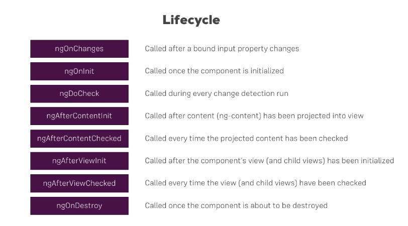
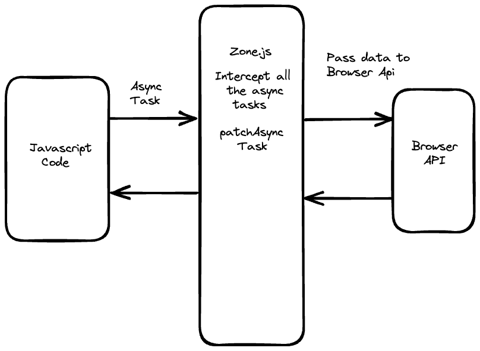

# INDEX

- [INDEX](#index)
  - [Angular](#angular)
    - [Angular History](#angular-history)
    - [How Angular works (Compilation)](#how-angular-works-compilation)
    - [Folders and files Structure](#folders-and-files-structure)
  - [Installation \& Updating (Angular CLI)](#installation--updating-angular-cli)
    - [Installation](#installation)
    - [Updating from old version to a new version](#updating-from-old-version-to-a-new-version)
  - [Components](#components)
    - [Creating Components](#creating-components)
    - [Component example](#component-example)
    - [Component properties](#component-properties)
    - [Component methods](#component-methods)
    - [Component Lifecycle Hooks](#component-lifecycle-hooks)
      - [ngOnInit()](#ngoninit)
      - [ngOnDestroy()](#ngondestroy)
      - [ngOnChanges()](#ngonchanges)
    - [Presentational vs Smart components](#presentational-vs-smart-components)
  - [Styling and CSS](#styling-and-css)
    - [Inline style](#inline-style)
    - [External styles](#external-styles)
    - [Dynamic classes](#dynamic-classes)
    - [Encapsulated styles](#encapsulated-styles)
  - [State](#state)
    - [State Management](#state-management)
    - [Zone.js](#zonejs)
    - [Signals](#signals)
      - [How to use Signals?](#how-to-use-signals)
      - [Signals Input and Output](#signals-input-and-output)
    - [Signals vs Zone.js](#signals-vs-zonejs)
  - [Data-Binding](#data-binding)
    - [String Interpolation](#string-interpolation)
    - [Property Binding](#property-binding)
    - [Event Binding](#event-binding)
    - [2-way-binding](#2-way-binding)
    - [Data Binding Notes](#data-binding-notes)
  - [Directives](#directives)
    - [Attribute Directives](#attribute-directives)
    - [Structural Directives](#structural-directives)
    - [Multiple Directives](#multiple-directives)
    - [Custom Directives](#custom-directives)
      - [Custom Attribute Directive](#custom-attribute-directive)
      - [Custom Structural Directive](#custom-structural-directive)
  - [Data flow between components](#data-flow-between-components)
    - [Parent to Child (Passing data / Input / Props)](#parent-to-child-passing-data--input--props)
    - [Child to Parent (Emitting events / Output)](#child-to-parent-emitting-events--output)
    - [Local Reference (Template variable)](#local-reference-template-variable)
    - [Content projection (Slots)](#content-projection-slots)
      - [Single-slot content projection](#single-slot-content-projection)
      - [Multi-slot content projection](#multi-slot-content-projection)
  - [Pipes](#pipes)
    - [Built-in pipes](#built-in-pipes)
    - [Custom Pipes](#custom-pipes)
    - [Chaining pipes](#chaining-pipes)
  - [Forms and Input Handling](#forms-and-input-handling)
    - [Input Handling (Two-way data binding)](#input-handling-two-way-data-binding)
      - [Input masking in Angular](#input-masking-in-angular)
    - [Forms](#forms)
      - [Reactive Forms](#reactive-forms)
      - [Template Forms (`ngModel` \& `ngForm`)](#template-forms-ngmodel--ngform)
  - [Modals (Portals and Overlays)](#modals-portals-and-overlays)
    - [Angular CDK (Component Dev Kit)](#angular-cdk-component-dev-kit)
  - [Notes](#notes)
    - [Expressions vs String Interpolation](#expressions-vs-string-interpolation)
    - [Angular HTML Escaper (Sanitization)](#angular-html-escaper-sanitization)

---

## Angular

Angular is a `framework` for building **reactive** web applications.

> "reactive" means that the app responds to user input and changes in the environment in real-time (by manipulating the **DOM**)

- It's a **framework** because it provides a lot of things out of the box like `routing`, `forms`, `http` libraries, etc.
- It's also a **collection of tools** that help you build web applications, like `Angular CLI`, `Debugger`, `DevTools`, `IDE Plugins`, etc.
- Code is written in `Typescript`, and Templates are written in Angular template syntax (which is a superset of `HTML` with Angular-specific syntax).

---

### Angular History


1. Angular was created by Google in 2010 as a JavaScript framework called `AngularJS` (or Angular 1)
2. In 2016, Google released a complete rewrite of AngularJS called `Angular` (or Angular 2+), which is a TypeScript-based framework

   - Angular 2+ is a complete rewrite of AngularJS, and it's not backward compatible with AngularJS
   - It's based on **Modules** and **Components** architecture, which makes it more modular and easier to maintain

3. Angular has been continuously updated since then, with new versions released every 6 months
   - But note that any new version of Angular is backward compatible with the previous version, so you can upgrade your app to the latest version without breaking it
4. The latest version of Angular is `Angular 20` (May 2025), which is the latest stable version at the time of writing this document
   - Since Angular 16, Angular moved

---

### How Angular works (Compilation)

This is how Angular works under the hood

1. When you run the `ng serve` command, Angular CLI starts a development server that serves the app, and compiles the app code into JavaScript code that the browser can understand
   

2. The server sends the `index.html` file to the browser **(Angular injects a `<script>` tag into the `index.html` file that loads the `main.ts` file)**
   

   - The `main.ts` file bootstraps the `AppModule` and starts the app

     ```ts
     // main.ts 📄
     import { bootstrapApplication } from '@angular/platform-browser';
     import { AppModule } from './app/app.module'; // or import the main component directly

     // bootstrap the AppModule and start the app
     bootstrapApplication(AppModule).catch(err => console.error(err));
     ```

3. The `AppModule` is the main module of the app, and it imports all the other modules and components that are needed for the app to work

   ```ts
   // app.module.ts 📄
   // import the necessary modules and components and services

   @NgModule({
     declarations: [AppComponent], // declare the components that are used in the app
     imports: [BrowserModule, AppRoutingModule, FormsModule], // import the modules that are needed for the app
     providers: [AppService], // provide the services that are used in the app
     bootstrap: [AppComponent] // bootstrap the main component of the app
   })
   export class AppModule {}
   ```

> **Compilation** is the process of converting the Angular code into `Javascript` code that the browser can understand

- **There are 2 types of compilation strategies in Angular:**

- Just-in-time compilation
  

  - Here, the server compiles typescript code into javascript code
  - Then, the browser downloads the javascript code (including the Angular framework) and runs & compiles it
  - This is the default compilation strategy in Angular
  - It's good for development because it's faster to compile and run the app, but it's slower for the browser to load and run the app
  - It's good for small to medium-sized apps
  - It's not used in production because it's slower for the browser to load and run the app

- Ahead-of-time compilation
  

  - Here, the server compiles typescript code into javascript code (same as JIT)
  - Then, the server compiles the javascript code into a bundle that the browser can understand
  - The browser downloads the bundle and runs it immediately (no need to compile it)
  - It's good for production because it's faster for the browser to load and run the app

  - It's faster and more efficient ✅
    

- selecting platform to run the app (`Compilation Strategy`)


- **Note:** Starting from Angular 18, the default compilation strategy is `AOT` (Ahead-of-time compilation), and no need to specify it in the `angular.json` file

- **Incremental DOM**
- it's a technique used by Angular to update the DOM efficiently
- Angular keeps a copy of the DOM in memory, and when the data changes, Angular compares the new DOM with the old DOM and only updates the parts that have changed
- It's similar to `Virtual DOM` in `React` but more efficient
- Read this [article](https://medium.com/@mubeennaeem247/angular-incremental-dom-bcae3db06108) for more information

---

### Folders and files Structure

In Angular, the `src` folder is the main folder that contains all the files of the app.

- **File structure**

- `app` folder : contains all the components, services, and modules
  - `app/app.component.html` : the html file for the main component
  - `app/app.component.ts` :
    - the main component of the app
    - it has the content that would be in the `app-root` tags in `index.html`
      - target can be html-code or `templateUrl` containing path for html file
  - `app/app-routing.module.ts` : the routing module of the app
  - `app/app.service.ts` : the main service of the app
    - it's a class that can be injected into components and contains code that (fetches/stores/update) data
  - `app/app.module.ts` : the main module of the app
    - It's a gate to import the main app components and services
      
- `assets` : contains all the static files like images, fonts, etc.
- `environments` : contains the environment files for the app
- `styles.css` : contains the global styles for the app
- `index.html` : the main html file for the app
- `main.ts` : the main typescript file that starts the app
  - it contains the `bootstrapModule` function that bootstraps the `AppModule` -> starts up `app.module.ts`, So we need to register the main module here.
- `polyfills.ts` : contains the polyfills for the app (features that are not supported in all browsers)
- `tsconfig.json` : contains the typescript configuration for the app
- `angular.json` : contains the configuration for the app (like build settings, etc.)

  - The most important part in this file is the `"architect"` object, which contains the build configurations for the app
    

- Example
  

- **Images**

- external images (hosted on different server) -> just need `url` in the `src` attribute

  ```html
  
  ```

- local images **(assets folder)** -> need to use `src` attribute with the path of the image in the `assets` folder

  ```html
  
  ```

  - **⚠️ Note:** If you don't see the image, make sure that the path is added in `angular.json` file in the `assets` array

    ```json
    "assets": [
      "src/favicon.ico",
      "src/assets"
    ]
    ```

---

## Installation & Updating (Angular CLI)

**Angular CLI** is a command-line interface tool that helps you to create, develop, and maintain Angular applications.

### Installation

it's a utility tool for managing projects and tools (like `webpack`, `Babel`, `Typescript`, etc.) that are needed for Angular development.


- Installing `Angular CLI` globally to use it in the terminal

```bash
npm install -g @angular/cli
```

- ng-commands

  ```sh
  # Creating new project
  ng new <project_name>

  # Create new project with flags (routing, style, strict)
  ng new <project_name> --routing --style=scss --no-strict

  # Starting development server
  npm start # or ng serve

  # Generating new component
  ng generate component <name of component>
  # Generating new module
  ng generate module <name of module>

  # To skip creating test files for the component/module
  ng generate component <name of component> --skip-tests
  ```

- modules generated with `cli` are not registered in the app so you need import the module into the `app.module`
- now, we can use `Vite` instead of `Angular CLI` for faster development

---

### Updating from old version to a new version

[Update Guide](https://angular.dev/update-guide)

---

## Components

**Components** are just exported `classes`


A component should present properties and methods for data binding, in order to mediate between the **view (rendered by the template)** and the **application logic (services) (which often includes some notion of a model)**.

- **What does a component consist of?**

  - `Component Metadata` : it's the information that Angular needs to create the component and render it to the DOM, like the `selector`, `template`, and `styles`
  - `Component Template` : it's the view of the component, and contains the HTML that will be rendered to the user
  - `Component Class` : it's the code that supports the view, and contains the properties and methods that the view uses

- **How components work**

  

### Creating Components

- In order to create a component, you can use the `Angular CLI` to generate a new component

  ```sh
  ng generate component <component-name> # or ng g c

  # Ex: creating a component named "nav" in the app folder
  ng generate component nav
  # Ex: creating a sub-component named "nav-item" in the nav folder
  ng generate component nav/nav-item
  ```

  - this will create a folder with the name of the component in the `app` folder
  - the folder will contain 4 files:
    - `component-name.component.html` : the html file for the component
    - `component-name.component.ts` : the typescript file for the component
    - `component-name.component.css` : the css file for the component
    - `component-name.component.spec.ts` : the test file for the component
  - the component will be registered in the `app.module.ts` file automatically, and added to the `declarations` array
  - the component will be added to the `app-routing.module.ts` file automatically

- Instead, you can create a component manually by creating the files and adding the component to the `app.module.ts` file

  ```ts
  // in app.module.ts
  import { NgModule } from '@angular/core';
  import { BrowserModule } from '@angular/platform-browser';

  import { AppComponent } from './app.component';
  import { NavComponent } from './nav/nav.component'; // import the component

  @NgModule({
    declarations: [AppComponent, NavComponent], // add the component to the declarations array ✅
    imports: [BrowserModule], // imported modules go here
    providers: [], // services go here
    bootstrap: [AppComponent] // the main component of the app (only in the AppModule)
  })
  export class AppModule {}
  ```

  ```ts
  // in nav.component.ts
  import { Component } from '@angular/core';

  // @Component is a decorator that tells Angular that this class is a component
  @Component({
    selector: 'app-nav', // the new html tag that will represent this component -> <app-nav></app-nav>
    templateUrl: './nav.component.html',
    styleUrls: ['./nav.component.css'],
    standalone: false // if true, the component can be used without being declared in a module (default is true starting from Angular 19)
  })
  export class NavComponent {}
  ```

---

### Component example

- Component as html element

  ```ts
  // nav.component.ts
  import { Component } from '@angular/core'; // import the Component decorator

  @Component({
    selector: 'app-nav', // the html selector that will be represent this component
    templateUrl: './nav.component.html', // the html file
    styleUrls: ['./nav.component.css']
  })
  export class NavComponent {
    constructor() {} // function that runs when the component is created

    // properties
    title = 'My App';
    links = ['Home', 'About', 'Contact'];

    // methods
    sayHi() {
      console.log('Hi');
    }
  }
  ```

- now in `"nav.component.html"` you can use this component like an html element or as a `directive`

  ```html
  <app-nav></app-nav>

  <!-- or as a directive -->
  <div app-nav></div>
  ```

  - When using the component, you must match the `selector` with the name of the component -> `app-nav`
  - It's a good practice to use the `app-` prefix for the component selector to avoid conflicts with native HTML elements, ex: `app-header` instead of `header` which will conflict with the native HTML `<header>` element
  - we can also overwrite the `selector` to be any type of selector like `class` or `attribute` selector (also you can use combinators like `tag.class` or `tag[attribute]`)

    ```ts
    @Component({
      selector: '.app-nav', // class selector
      // or
      selector: '[app-nav]' // attribute selector
    })
    ```

    ```html
    <!-- class selector -->
    <div class="app-nav"></div>
    <!-- attribute selector -->
    <div app-nav></div>
    ```

  - Also you can have multiple selectors for the same component by using an array of selectors

    ```ts
    @Component({
      selector: ['app-nav', '.app-nav', '[app-nav]'] // multiple selectors
    })
    ```

- **Notes:**

  - We can write the `HTML` code directly in the component file using the `template` property instead of using the `templateUrl` property

    ```ts
    @Component({
      template: `<h1>{{ title }}</h1> <ul> <li *ngFor="let link of links">{{ link }}</li> </ul>`,
      // or
      templateUrl: './nav.component.html'
    })
    ```

  - We can write the `CSS` code directly in the component file using the `styles` property instead of using the `styleUrls` property

    ```ts
    @Component({
      styles: [`h1 { color: red; }`],
      // or
      styleUrls: ['./nav.component.css']
    })
    ```

  - We can use the `selector` property to be any type of selector like `tag`, `class`, or `attribute`

    ```ts
    selector: 'app-nav'; // element tag selector
    selector: '.app-nav'; // class selector
    selector: '[app-nav]'; // attribute selector
    ```

    ```html
    <!-- element tag selector -->
    <app-nav></app-nav>
    <!-- class selector -->
    <div class="app-nav"></div>
    <!-- attribute selector -->
    <div app-nav></div>
    ```

---

### Component properties

- **Properties** are variables that are defined in the component class and are used in the component template

- Example:

  ```ts
  // in nav.component.ts
  export class NavComponent {
    title = 'My App';
    links = ['Home', 'About', 'Contact'];
  }
  ```

  ```html
  <!-- in nav.component.html -->
  <h1>{{ title }}</h1>
  <ul>
    <li *ngFor="let link of links">{{ link }}</li>
  </ul>
  ```

- It's declared in the component class using 2 ways:

  - **Class Access Modifiers**: `public`, `private`, `protected`

    ```ts
    public title = 'My App';
    // or title = 'My App';
    ```

  - **Class Constructor Function:** it's a method that runs when the component is created, and it's a good place to initialize properties

    ```ts
    constructor() {
      this.title = 'My App';
    }
    ```

- It's the **state** of the component, and it can be changed by the user or by the component itself
  - It's different from state in React, where we use `useState` hook to manage the state of the component, but in Angular, we just declare the properties in the component class and use them in the template

---

### Component methods

- `constructor` : it's a method that runs when the component is created
- `ngOnInit` : it's a lifecycle hook that runs after the constructor and after the first `ngOnChanges` (it's a good place to put initialization logic)
- `ngOnChanges` : it's a lifecycle hook that runs when the input properties of the component change
- `ngOnDestroy` : it's a lifecycle hook that runs when the component is destroyed (it's a good place to put cleanup logic)
- `ngAfterViewInit` : it's a lifecycle hook that runs after the view has been initialized (it's a good place to put logic that needs to run after the view has been initialized)
- `ngAfterViewChecked` : it's a lifecycle hook that runs after the view has been checked (it's a good place to put logic that needs to run after the view has been checked)
- **Notes:**
  - Don't use the constructor to fetch data from a server or to initialize the component. Use `ngOnInit` instead.
  - Don't use arrow functions when defining methods in a component. Use regular functions instead. (to avoid `this` keyword problems)

---

### Component Lifecycle Hooks



- A component instance has a lifecycle that

  - **starts** when Angular instantiates the component class and renders the component view along with its child views.
  - The lifecycle **continues** with "change detection" (reactivity), as Angular checks to see when data-bound properties change, and updates both the view and the component instance as needed.
  - The lifecycle **ends** when Angular destroys the component instance and removes its rendered template from the DOM.

- **Most common lifecycle hooks:**
  

- To be able to use the lifecycle hooks, you need to implement the interface for the hook you want to use in the component class **(it's optional)**

  ```ts
  import { Component, OnInit, OnDestroy } from '@angular/core';

  // ------------------- Works ✅ ------------------------ //
  export class MyComponent implements OnInit, OnDestroy {
    ngOnInit() {
      // ...
    }

    ngOnDestroy() {
      // ...
    }
  }

  // ------------------- Also works ✅ ------------------------ //
  export class MyComponent {
    ngOnInit() {
      // ...
    }

    ngOnDestroy() {
      // ...
    }
  }
  ```

- **Useful Links:**

  - [lifecycle hooks guide](https://angular.io/guide/lifecycle-hooks)
  - [lifecycle events sequence](https://angular.io/guide/lifecycle-hooks#sequence-and-frequency-of-all-lifecycle-events)

---

#### ngOnInit()

- It's a callback method that is invoked immediately after the default change detector has checked the directive's data-bound properties for the first time, and before any of the view or content children have been checked. It is invoked only once when the directive is instantiated.
- it can be called normally or using an `interface`

```ts
import { Component, OnInit } from '@angular/core';

class MyComponent implements OnInit {
  ngOnInit() {
    // ...
  }
}
```

- **Difference between `Constructor` and `ngOnInit`**

  - The `Constructor` is a default method of the class that is executed when the class is instantiated and ensures proper initialization of fields in the class and its subclasses.
  - `ngOnInit` is a life cycle hook called by Angular to indicate that Angular is done creating the component (data is passed between components).
  - Mostly we use `ngOnInit` for all the initialization/declaration and avoid stuff to work in the constructor. The `constructor` should only be used to initialize class members but shouldn't do actual "work".

#### ngOnDestroy()

- It's a callback method that performs `cleanup` right before Angular destroys the directive/component. Use `ngOnDestroy` for `cleanup` logic, `subscriptions`, `listeners`, etc.

  ```ts
  ngOnDestroy() {
    // ...
  }
  ```

#### ngOnChanges()

- It's a callback method that is invoked immediately after the default change detector has checked the directive's data-bound properties for the first time and before any of the view or content children have been checked. It is invoked every time the input properties of a component change.

  ```ts
  ngOnChanges() {
    // ...
  }
  ```

---

### Presentational vs Smart components

- **Presentational components**: are responsible for only displaying data, without knowing where the data comes from. They receive the data via an `@Input()`, and return modified data through `@Output()` events

- **Smart components**: are responsible for interacting with the service layer and retrieving the data, which then they pass to presentational components. They are also responsible for handling the `events` emitted by the presentational components.

---

## Styling and CSS

There're many ways to style Angular components:

1. Inline styles -> `style="color: red"`
2. External styles -> `styles.css`

- `styles.css`
  - is a global stylesheet that will be applied to all components in the app
- `app.component.css`
  - is a stylesheet that will be applied only to the `app.component` **(Scoped)**

### Inline style

The `style` attribute can be used to add inline styles to an element

```html
<button style="color: red">Click me</button>
```

- You can also use `ngStyle` directive to add styles dynamically

  ```html
  <button [ngStyle]="{color: isRed ? 'red' : 'blue'}">Click me</button>
  ```

- or you can use the `style` binding to add styles dynamically

  ```html
  <button [style.color]="currentColor">Click me</button>
  <!-- Here, `currentColor` is a property in the component class, and we want to add its value as a style to the button element -->
  ```

---

### External styles

- You can add styles to the `styles.css` file to apply them globally to the app

  ```css
  /* in styles.css */
  button {
    color: red;
  }
  ```

- You can also add styles to the `app.component.css` file to apply them only to the `app.component` (scoped styles)

  ```ts
  // in app.component.ts
  @Component({
    selector: 'app-root',
    templateUrl: './app.component.html',
    styleUrls: ['./app.component.css'] // add the css file here ✅
    // or
    // styles: [`h1 { color: red; }`] // add the styles directly here ✅
  })
  export class AppComponent {}
  ```

  ```css
  /* in app.component.css */
  button {
    color: red;
  }
  ```

- **Host Element**
  

  - Every component has a **host element** that is the root element of the component in the DOM
  - The host element is the element that is used to render the component in the DOM, and it can be selected using the `:host` pseudo-class in the CSS file of the component

  ```html
  <!-- in app.component.html -->
  <h1>My App</h1>
  <button>Click me</button>
  ```

  ```css
  /* in app.component.css */
  :host {
    display: block; /* This will apply to the host element */
    border: 1px solid black; /* This will apply to the host element */
  }
  ```

---

### Dynamic classes

- To add fixed classes to an element, you can use the `class` attribute

  ```html
  <button class="btn">Click me</button>
  ```

- To add class names in a JS string, you can use the `class` binding

  ```html
  <button [class]="classNames">Click me</button>
  <!-- Here, `classNames` is a property in the component class, and we want to add its string value as a class to the button element -->
  ```

- To add classes dynamically, you can use the `ngClass` or `class` binding

  ```html
  <button [ngClass]="{btn-error: isError}">Error Button</button>
  <!-- or -->
  <button [class]="{'btn-error': isError}">Error Button</button>
  ```

  - It's a common pattern to use a method in the component class to return the classes

    ```html
    <button [ngClass]="getClasses()">Click me</button>
    ```

    ```ts
    // in the component class
    getClasses() {
      return {
        btn: true,
        error: this.isError
      };

      // or
      if (this.isError) {
        return 'btn error';
      } else {
        return 'btn';
      }
    }
    ```

- ✅ Or to dynamically add classes based on a condition, you can use the `class.<class-name>` syntax

  ```html
  <button [class.btn-error]="isError">Error Button</button>
  <!-- conditionaly adding the class btn-error if isError is true -->
  ```

---

### Encapsulated styles

Sometimes you want to apply styles to a component, but you don't want those styles to affect other components. In Angular, you can use **encapsulated styles** to achieve this.

- **Encapsulated styles** are styles that are applied only to the component and its children, and they don't affect other components
- This is done by using the `ViewEncapsulation` property in the `@Component` decorator

  ```ts
  import { Component, ViewEncapsulation } from '@angular/core';
  @Component({
    selector: 'app-root',
    templateUrl: './app.component.html',
    styleUrls: ['./app.component.css'],
    encapsulation: ViewEncapsulation.Emulated // default value 👈
  })
  export class AppComponent {}
  ```

- It has 3 possible values:
  - `ViewEncapsulation.Emulated` (default): styles are encapsulated and don't affect other components
  - `ViewEncapsulation.None`: styles are applied **globally** and affect all components
  - `ViewEncapsulation.ShadowDom`: styles are encapsulated using Shadow DOM, which is a web standard that allows you to create a separate DOM tree for the component

---

## State

**State** in Angular refers to the data that is used by the component to render the view. It's similar to `state` in React, where we use `useState` hook to manage the state of the component, but in Angular, we just declare the properties in the component class and use them in the template.

### State Management

- There're multiple approaches to manage state in Angular:
  
  - Relying on `Zone.js`
  - Using a state management library like `NgRx` or `Akita`
  - Uing **Signals**

---

### Zone.js

It's a library that Angular uses to detect changes in the component state and update the view accordingly. It patches the `JavaScript` event loop and detects when an event occurs, and then it triggers change detection in Angular.

It's invisible grouping mechanism that allows Angular to know when to update the view. It works by monkey-patching the `JavaScript` event loop and detecting when an event occurs, and then it triggers change detection in Angular.

- **How does Angular's Change Detection Works with state/properties?**

  - Angular uses a change detection mechanism to detect changes in the component state and update the view accordingly
    
  - When a property in the component class changes, Angular automatically updates the view to reflect the new value of the property
  - This is done using [`Zone.js`](https://www.npmjs.com/package/zone.js), which is a library that Angular uses to detect changes in the component state
    
    - This means that when an event occurs, Angular will check if any of the component properties have changed, and if so, it will update the view accordingly
      
    - This is done automatically, so you don't need to worry about it, but it's good to know how it works under the hood

---

### Signals

**Signals** are a new way to manage state in Angular, introduced in Angular 16, which allows you to create **reactive state** that can be used in the component template and automatically updates the view when the state changes.

- Signals are similar to
  - `useState` in React, but they are more powerful and flexible
  - `ref` in Vue, but they are more efficient and easier to use
- They're like a **container** that contains a value, and when the value changes, Angular is notified and updates the view accordingly wherever the signal is used
  

- **Signals are automatically tracked by Angular**, so when the signal value changes, Angular will update the view accordingly
- It's better than using `Zone.js` because it doesn't require any monkey-patching of the `JavaScript` event loop, and it's more efficient because it only updates the view when the signal value changes
  > "monkey-patching" means modifying the behavior of a function or object at runtime, which can lead to performance issues and bugs

#### How to use Signals?

- `signal()`

  - You can create a signal using the `signal` function from the `@angular/core` package

    ```ts
    import { signal } from '@angular/core';

    // Create a signal with an initial value
    const count = signal(0);
    ```

  - You can use the signal in the component template using the `{{}}` syntax, **and you have to call the signal as a function to get its value**

    ```html
    <p>Count: {{ count() }}</p>
    ```

  - You can update the signal value using the `set` method

    ```ts
    count.set(count() + 1);
    ```

- `computed()`

  - You can create a computed signal that depends on other signals using the `computed` function

    ```ts
    import { computed } from '@angular/core';

    const doubleCount = computed(() => count() * 2);
    ```

  - You can use the computed signal in the component template using the `{{}}` syntax, **and you have to call the computed signal as a function to get its value**

    ```html
    <p>Double Count: {{ doubleCount() }}</p>
    ```

  - It will only be re-evaluated when the signals it depends on change, so it's more efficient than using a method that returns a value

---

#### Signals Input and Output

- **`input`**

  - You can use signals as input properties in a component by using the `input` decorator (it's lowercase unlike `@Input()` decorator)

    ```ts
    import { Component, input } from '@angular/core';

    @Component({
      selector: 'app-child',
      template: `
        <h2>{{ title }}</h2>
        <p>Child Count: {{ count() }}</p>
      `
    })
    export class ChildComponent {
      title = input.required<string>(); // create a required input signal
      count = input<number>(); // create an input signal
    }
    ```

- **`output`**

  - You can use signals as output properties in a component by using the `output` decorator (it's lowercase unlike `@Output()` decorator)

    ```ts
    import { Component, output } from '@angular/core';

    @Component({
      selector: 'app-child',
      template: `
        <button (click)="increment()">Increment</button>
      `
    })
    export class ChildComponent {
      count = output<number>(); // create an output signal

      increment() {
        this.count.emit(this.count() + 1); // emit the new value of the count signal
      }
    }
    ```

  - **⚠️ Note:** It doesn't create a signal, it just creates an output property that can be used to emit values from the component

- **2 way binding**

  - You can use signals for 2-way binding with `ngModel` normally as Angular will detect that we're using signals and will update the view accordingly, and no need to use `()` syntax

    ```html
    <input [(ngModel)]="count" />
    <p>Count: {{ count() }}</p>
    ```

---

### Signals vs Zone.js

- `Signals` are more efficient than `Zone.js` because they only update the view when the `signal` value changes, while `Zone.js` updates the view whenever an event occurs
- `Signals` are more powerful than `Zone.js` because they allow you to create reactive state that can be used in the component template and automatically updates the view when the state changes
- `Signals` are easier to use than `Zone.js` because they don't require any monkey-patching of the `JavaScript` event loop, and they are more intuitive to use

**Note:** Signals are still an experimental feature in Angular, and they are not yet widely used in production apps. But they are expected to become the standard way to manage state in Angular in the future.

---

## Data-Binding

**Data-binding** is a way to pass data from the component class to the component template and vice versa (Communication between the component class and the template)


### String Interpolation

It's a way to display data in the template using `{{}}` syntax

- It's a one-way data binding from the component to the template

```html
<p>{{ property_x }}</p>
```

- Here, we are binding the `property_x` from the component class to the template, so that when the value of `property_x` changes, the template will be updated automatically

---

### Property Binding

It's a way to bind the properties of an HTML element to the properties of the component class

- It's a one-way data binding from the component to the template using **square brackets `[]`** around the property name

- It's like `Attribute Directives` as if the value is true you will add the attribute/class to the html element
  

- Here, we **bind** the property of an element to a property in the component class
- Example

  ```html
  <!-- in component.ts file: the propery_x:true or false -->
  <button [disable]="propery_x"></button>

  <input [value]="password" />

  <p>{{ property_x }}</p>

  <p [innerText]="property_x"></p>
  ```

  - `disable` is a property of the button element, and we are binding it to the property `propery_x` in the component class
  - `value` is a property of the input element, and we are binding it to the property `password` in the component class

- It's also used to pass data from the parent component to the child component **(props)**

  ```html
  <!-- in parent component -->
  <app-child [childProperty]="parentProperty"></app-child>

  <!-- in child component -->
  <p>{{ childProperty }}</p>
  ```

---

### Event Binding

It's a way to bind an event of an HTML element to a method in the component class by setting up an event handler on the element using **parentheses `()`** around the event name

- Here we write events-attribute in the html element and call a method from the class
  

- Here we usually call a method from the class **(binding a method to an event)**

  ```html
  <button (click)="sayHi()"></button>
  ```

- In order to access the `event` object in the method, we can pass it as an argument using `$event` reserved word

  ```html
  <input (input)="onInput($event)" />
  ```

  ```ts
  onInput(event: Event) {
    console.log(event.target.value);
  }
  ```

- We don't need to write the class name in the method because Angular knows that it's a method from the class
  - `myComponent.sayHi()` ❌ (in the template)
  - `this.sayHi()` ❌ (in the template)
  - `sayHi()` ✅ (in the template)
- `$event` : it's a reserved word used with event binding so that you can use the event as an argument of the method
- Comparison of form-handling in Angular and Vanilla JS
  

---

### 2-way-binding

- it's the ability to being able to listen to events and update a property simultaneously
- It's usually used with form elements like `input`, `select`, and `textarea`
- It's a combination of property binding and event binding, and it's done using the `ngModel` directive

  ```html
  <input [(ngModel)]="name" />
  <p>{{ name }}</p>

  <!-- Instead of -->
  <input [value]="name" (input)="name = $event.target.value" />
  <p>{{ name }}</p>
  ```

  - here the `ngModel` directive is doing 2 tasks:
    - set value of the attribute with property-binding
    - **Emit an event** when the property changes in the template

- **⚠️ Note:** In order to use `ngModel`, you need to import the `FormsModule` in the `app.module.ts` file

  ```ts
  import { FormsModule } from '@angular/forms';

  @NgModule({
    declarations: [AppComponent],
    imports: [BrowserModule, FormsModule], // import the FormsModule here 👈
    providers: [],
    bootstrap: [AppComponent]
  })
  export class AppModule {}
  ```

---

### Data Binding Notes

- It's a good practice to make binded values in the template as simple as possible, so that the template is easy to read and understand, So if you have a complex expression, it's better to move it to a method in the component class and call that method in the template

  ```html
  <!---------------------------- ❌ ---------------------------->
  <!-- in template -->
  <p>{{ firstName + ' ' + lastName }}</p>

  <!---------------------------- ✅ ---------------------------->
  <!-- in template -->
  <p>{{ getFullName() }}</p>

  <!-- in component class -->
  getFullName() { return `${this.firstName} ${this.lastName}`; }
  ```

  - Also you can make the method a `getter` so that it can be used as a property in the template

    ```ts
    get fullName() {
      return `${this.firstName} ${this.lastName}`;
    }
    ```

    ```html
    <!-- in template -->
    <p>{{ fullName }}</p>
    ```

---

## Directives

**Angular directives** are extended `HTML attributes` with the prefix `"ng-"`.


> [Directives Resource](https://angular.io/api?type=directive)

- They're **instructions** in the DOM that tell Angular to do something to a DOM element
- **Directives Types**
  
  
  

- Angular has built-in directives:
  - **Structural directives**: Change the DOM structure.
    - `*ngIf`: Conditionally remove/recreate DOM.
    - `*ngFor`: Repeat DOM for each list item.
    - `*ngSwitch`: Swap DOM based on expression.
  - **Attribute directives**: Change element appearance/behavior.
    - `ngStyle`: Set inline styles.
    - `ngClass`: Add/remove CSS classes.
    - `ngModel`: Two-way data binding.
  - **Multiple directives**: Combine for complex behavior.
    - `<ng-container>`: Grouping element, no style/layout impact.
    - `<ng-template>`: Grouping element, no style/layout impact.

---

### Attribute Directives

- attribute directive changes the appearance or behavior of a DOM element
- used to add styles,classes (modify appearance through attributes)

- look here for full types and documentation [Attribute Directives](https://angular.io/guide/attribute-directives)

- `ngStyle` : it sets inline styles on an HTML element

  ```html
  <button [ngStyle]="{color: 'red', 'font-size': '20px'}">Click me</button>
  ```

  - Here, we are setting the color and font-size of the button element using the `ngStyle` directive

  ```html
  <button [ngStyle]="{color: isRed ? 'red' : 'blue', 'font-size': isBig ? '20px' : '10px'}">
    Click me
  </button>
  ```

  - Here, we are setting the color and font-size of the button element dynamically using the `isRed` and `isBig` properties from the component class

- `ngClass` : it adds and removes CSS classes on an HTML element

  ```html
  <!-- in css-file we have class ".error" -->
  <button [ngClass]="{error: isError}">Error Button</button>
  ```

  - Here, we are adding the `error` class to the button element if the `isError` property is `true`

- `ngModel` : it creates a two-way data binding on form elements

  ```html
  <input [(ngModel)]="name" />
  ```

  - Here, we are creating a **two-way data binding** on the input element, so that the `name` property in the component class is updated when the input value changes, and the input value is updated when the `name` property changes

---

### Structural Directives

- it can add or remove elements from the DOM
- it starts with `*` and it's a `directive` that changes the structure of the DOM
- Angular makes the content inside of `<ng-template>` become hidden but Angular will be aware of it so that it can be used based on condition

- **Angular <= 16**

  - `*ngIf`

    ```html
    <!-- this element "<p>" will only show if the property "blueClass=True" -->
    <p *ngIf="blueClass">the button is blue</p>
    ```

  - `*ngFor`

    ```html
    <ul>
      <li *ngFor="let item of items">{{ item }}</li>
      <!-- Or, to access the index -->
      <li *ngFor="let item of items; let i = index">{{ i }} - {{ item }}</li>
    </ul>

    <!-- OR, passing props -->

    <app-card *ngFor="let card of cards" [title]="card.title" [content]="card.content"></app-card>
    ```

  - `*ngSwitch`

    ```html
    <div [ngSwitch]="color">
      <p *ngSwitchCase="'red'">Red color</p>
      <p *ngSwitchCase="'blue'">Blue color</p>
      <p *ngSwitchDefault>Invalid color</p>
    </div>
    ```

- **Angular >= 17**

  - with the new syntax, we can use structural directives without the `*ng` prefix, and we can use them with the `@` prefix
  - It's better because it makes the code cleaner and easier to read, and it allows us to use structural directives in a more consistent way, also it has better TypeScript support.

  - `@if`

    ```html
    @if (condition) {
    <p>The condition is true</p>
    }

    <!-- Or, with an else block -->
    @if (condition) {
    <p>The condition is true</p>
    } @else {
    <p>The condition is false</p>
    }
    ```

  - `@for`

    ```html
    <ul>
      @for (item of items) {
      <li>{{ item }}</li>
      }
    </ul>

    <!-- Or, to access the index with tracking -->
    <ul>
      @for (item of items; track i) {
      <li>{{ i }} - {{ item }}</li>
      }
    </ul>
    ```

  - `@switch`

    ```html
    <div @switch (color) { @case 'red':
    <p>Red color</p>
    @case 'blue':
    <p>Blue color</p>
    @default:
    <p>Invalid color</p>
    }
    ```

- [Shorthand examples](https://angular.io/guide/structural-directives#shorthand-examples)

---

### Multiple Directives

We can't use both `*ngIf` and `*ngFor` on the same element, so we use `<ng-container>` to group them together, and use them on the `<ng-container>` element

```html
<!-- ✅ -->
<ng-container *ngIf="condition">
  <p *ngFor="let item of items">{{ item }}</p>
</ng-container>

<!-- ❌ -->
<p *ngIf="condition" *ngFor="let item of items">{{ item }}</p>
```

- It's usually used when we want to limit the number of elements that can be used with a structural directive

  ```html
  <ng-container *ngFor="let item of items; let i = index">
    <p *ngIf="i < 3">{{ item }}</p>
  </ng-container>
  ```

- It's also used when we want to group elements together **(without adding an extra wrapping element to the DOM)**

  ```html
  <ng-container *ngIf="condition">
    <p>Item 1</p>
    <p>Item 2</p>
    <p>Item 3</p>
  </ng-container>
  ```

> It's similar to:
>
> - `<template>` in **Vue.js**
> - `<Fragment>` in **React**

---

### Custom Directives

- To create a custom directive, you can use the `Angular CLI` to generate a new directive

  ```bash
  ng generate directive <directive-name>
  ```

  - this will create a file in the `app` folder with the name `<directive-name>.directive.ts` and add the directive to the `declarations` array in the `app.module.ts` file
  - the file will contain a class with the name `<DirectiveName>Directive`
  - the class will have a `constructor` method that takes an `ElementRef` and a `Renderer2` as arguments

#### Custom Attribute Directive

- Example: creating a custom directive to highlight an element

  ```sh
  ng generate directive highlight
  ```

  ```ts
  // in app/highlight.directive.ts
  import { Directive, ElementRef, Renderer2 } from '@angular/core';

  @Directive({
    selector: '[appHighlight]'
  })
  export class HighlightDirective {
    constructor(private el: ElementRef, private renderer: Renderer2) {
      this.renderer.setStyle(this.el.nativeElement, 'backgroundColor', 'yellow'); // recommended ✅
      // or
      this.el.nativeElement.style.backgroundColor = 'yellow'; // it's not recommended ❌
    }
  }
  ```

  ```html
  <p appHighlight>Highlight me!</p>
  ```

  - `el` -> is a reference to the element that the directive is applied to
  - `renderer` -> is a service that can be used to modify the element in a way that is safe from XSS attacks

- Example: setting background color dynamically

  ```ts
  // in app/highlight.directive.ts
  import { Directive, ElementRef, Renderer2, Input } from '@angular/core';

  @Directive({
    selector: '[appHighlight]'
  })
  export class HighlightDirective {
    @Input() color = 'yellow'; // we can pass the color as a property to the directive

    constructor(private el: ElementRef, private renderer: Renderer2) {
      this.renderer.setStyle(this.el.nativeElement, 'backgroundColor', this.color);
      // or
      this.el.nativeElement.style.backgroundColor = this.color;
    }
  }
  ```

  ```html
  <p [appHighlight]="'red'">Highlight me!</p>
  ```

#### Custom Structural Directive

- Example: creating a custom directive to repeat an element multiple times

  ```sh
  ng generate directive repeat
  ```

  ```ts
  // in app/repeat.directive.ts
  import { Directive, Input, TemplateRef, ViewContainerRef } from '@angular/core';

  @Directive({
    selector: '[appRepeat]'
  })
  export class RepeatDirective {
    @Input() set appRepeat(times: number) {
      for (let i = 0; i < times; i++) {
        this.viewContainer.createEmbeddedView(this.templateRef);
      }
    }

    constructor(private templateRef: TemplateRef<any>, private viewContainer: ViewContainerRef) {}
  }
  ```

  ```html
  <ng-template appRepeat="3">
    <p>Repeat me!</p>
  </ng-template>
  ```

  - `viewContainer` is a reference to the element that the directive is applied to (the `<ng-template>` element), it can be used to add or remove elements from the DOM

---

## Data flow between components


---

### Parent to Child (Passing data / Input / Props)

The parent component can pass data to the child component using `@Input()` decorator, and the child component can receive the data using property binding.


- data (props) are passed using `property binding` in the parent component
- we need to use `@Input()` decorator in the child component to receive the data (tell the child component that it will receive data from the parent component)

- Example

  ```ts
  // in hero-child.component.ts
  import { Component, Input } from '@angular/core';

  import { Hero } from './hero';

  @Component({
    selector: 'app-hero-child',
    template: `
      <h3>{{ hero.name }} says:</h3>
      <p>I, {{ hero.name }}, am at your service, {{ masterName }}.</p>
    `
  })
  export class HeroChildComponent {
    @Input() hero!: Hero; // "!" means that it's a required property
    @Input('master') masterName = ''; // here we use an "alias" so that in the parent component we use the alias not the othername(masterName)
  }
  ```

  ```ts
  // in hero-parent.component.ts
  import { Component } from '@angular/core';

  @Component({
    selector: 'app-hero-parent',
    template: `
      <h2>{{ master }} controls {{ heroes.length }} heroes</h2>

      <app-hero-child *ngFor="let hero of heroes" [hero]="hero" [master]="master"></app-hero-child>
    `
  })
  export class HeroParentComponent {
    heroes = [{ name: 'Dr IQ' }, { name: 'Magneta' }, { name: 'Bombasto' }];
    master = 'Master';
  }
  ```

- To have an **alias** for the input property, you can use the `@Input('alias')` decorator

  ```ts
  @Input('master') masterName = '';
  ```

  - here we use an alias(`"master"`) so that in the parent component we use the alias not the other name (`"masterName"`), but in the child component we use the other name (`"masterName"`)

- To make a prop required, you should:

  - 1️⃣ use the `!` operator after the property name (To tell TypeScript that this property will be initialized later, and it will not be `undefined`)
  - 2️⃣ use the `@Input({ required: true })` decorator

    ```ts
    @Input({ required: true }) hero!: Hero;
    ```

---

### Child to Parent (Emitting events / Output)

- To emit an event from a child component to a parent component, you can use the `@Output()` decorator

  ```ts
  // in child.component.ts
  import { Component, Output, EventEmitter } from '@angular/core';

  @Component({
    selector: 'app-child',
    template: `
      <button (click)="sayHi()">Click me</button>
    `
  })
  export class ChildComponent {
    @Output() myEvent = new EventEmitter<string>(); // event will be emitted with a string as an argument and the name of the event is "myEvent"

    sayHi() {
      this.myEvent.emit('Hello');
    }
  }
  ```

  ```html
  <!-- in parent.component.html -->
  <app-child (myEvent)="onMyEvent($event)"></app-child>
  ```

  ```ts
  // in parent.component.ts
  onMyEvent(event: string) {
    console.log(event);
  }
  ```

  - The `@Output()` decorator is used to emit events from a child component to a parent component
  - The `EventEmitter` class is used to emit events
  - The `emit()` method is used to emit an event with a value
  - The event name should be the same in the parent component as the name of the event in the child component

- **Notes:**

  - Make sure to handle **event bubbling** and **event propagation** in the parent component by using the `$event` object and the `stopPropagation()` method

    ```html
    <button (click)="sayHi(); $event.stopPropagation()">Click me</button>
    ```

  - When you know the type of value that will be emitted, you can specify the type of the `EventEmitter` in the `@Output()` decorator using TypeScript generics `<T>`:

    ```ts
    @Output() myEvent = new EventEmitter<string>(); // here we specify that the event will emit a string value
    ```

---

### Local Reference (Template variable)

its a word that you use to mark an element and get access to it in the template to use it in another place in the **same template**

- it starts with `#`

- to access it in the template:

  ```html
  <input #serveNameInput />

  <button (click)="fun(serverNameInput.value)"></button>
  ```

- to access it in the .ts file:

  ```ts
  // in the class
  @viewChile('serveNameInput') serveNameInput:ElementRef;
  ```

- to access it in its child-.ts file:

  ```ts
  // in the class
  @contentChild('serveNameInput') serveNameInput:ElementRef;
  ```

---

### Content projection (Slots)

**Content projection** is a pattern in which you `insert, or project`, the content you want to use inside another component.

> This pattern is used as a replacement for using `properties/props` to pass data from a parent component to a child component and add special handling for the content based on the `properties/props`.
>
> Also, it's used when you want to pass content to a component and want to keep the outer/wrapper component clean and have fixed styles or behavior.

- This is done using the `<ng-content>` element in the child component
  
  - **`<ng-content>` is a placeholder for the content that will be projected into the component**

#### Single-slot content projection

```html
<!-- child -->
<h2>Single-slot content projection</h2>
<ng-content></ng-content>

<!-- parent -->
<child-component>
  <p>the projected content</p>
</child-component>
```

#### Multi-slot content projection

- A component can have multiple slots. Each slot can specify a CSS selector that determines which content goes into that slot. This pattern is referred to as multi-slot content projection. With this pattern, you must specify where you want the projected content to appear. You accomplish this task by using the `select` attribute of `<ng-content>`.

  ```ts
  // in the child component
  @Component({
    selector: 'app-child',
    template: `
      <h2>Multi-slot content projection</h2>
      <ng-content select=".header"></ng-content>
      <ng-content select=".footer"></ng-content>
      <ng-content></ng-content>
    `
  })
  export class ChildComponent {}
  ```

  ```html
  <!-- in the parent component -->
  <app-child>
    <p class="header">Header content</p>
    <p class="footer">Footer content</p>
  </app-child>
  ```

- Here, the `header` content will be projected into the first slot, and the `footer` content will be projected into the second slot.
- The `select` attribute of `<ng-content>` is used to specify the CSS selector that determines which content goes into that slot.
  - It's can select by `class`, `id`, `tag`, etc.
- The `<ng-content>` element without the `select` attribute is the **default slot**, and it will project any content that doesn't match the other slots.

---

## Pipes

It's a transformer that takes input data and transforms it into a desired output format, which is then displayed in the template.


- Pipes are used to transform data **in the template** before displaying it.

### Built-in pipes

> [pipe reference](https://angular.io/api?type=pipe) -> Here, you can find all the built-in pipes in Angular

- In order to use a pipe:

  - **Using modules:** you need to import the `CommonModule` in the `app.module.ts` file, and other pipes like `currency`, `date`, `decimal`, etc. are already included in the `CommonModule`, so you don't need to import them separately.

    ```ts
    import { CommonModule } from '@angular/common';

    @NgModule({
      declarations: [AppComponent],
      imports: [BrowserModule, CommonModule], // import the CommonModule here 👈
      providers: [],
      bootstrap: [AppComponent]
    })
    export class AppModule {}
    ```

  - **Using standalone components:** you can import the `CommonModule` in the `@Component` decorator of the component that uses the pipe

    ```ts
    import { Component } from '@angular/core';
    import { CommonModule } from '@angular/common';

    @Component({
      selector: 'app-root',
      templateUrl: './app.component.html',
      styleUrls: ['./app.component.css'],
      standalone: true,
      imports: [CommonModule] // import the CommonModule here 👈
    })
    export class AppComponent {}
    ```

- [date-pipe format options](https://angular.io/api/common/DatePipe#pre-defined-format-options)
- **Format:** `{{ data | pipeName:arg1:arg2:... }}`

  - `data` : the data you want to transform
  - `pipeName` : the name of the pipe you want to use
  - `arg1`, `arg2`, ... : the arguments you want to pass to the pipe (optional)

- Example with `UpperCasePipe`: it transform text to all uppercase

  ```html
  <p>{{ 'hello' | uppercase }}</p>
  <!-- this converts the text to uppercase, ex: HELLO -->
  ```

- Example with `DatePipe`: it transform date to a specific format

  ```html
  <p>{{ today | date: 'short' }}</p>
  <!-- this converts the date to a short format, ex: 6/15/15, 9:03 AM -->

  <p>{{ today | date: 'E' }}</p>
  <!-- this converts the date to the day of the week, ex: Mon -->

  <p>{{ today | date: 'MMMM d, y' }}</p>
  <!-- this converts the date to this custom format, ex: June 15, 2015 -->
  ```

- Example with `CurrencyPipe`: it transform number to currency

  ```html
  <p>{{ price | currency }}</p>
  <!-- this converts the number to currency, ex: $123.45 -->

  <p>{{ price | currency: 'EUR' }}</p>
  <!-- this converts the number to currency, ex: €123.45 -->
  ```

- Example with `DecimalPipe`: it transform number to decimal

  ```html
  <p>{{ pi | number: '1.2-2' }}</p>
  <!-- this converts the number to decimal, ex: transform 3.1412 to 3.14 -->
  ```

- `JSONPipe` : it converts a JavaScript object into a JSON string **(it's only for debugging purposes)**

  ```html
  <p>{{ userObject | json }}</p>
  ```

- `async` : it's a pipe that subscribes to an `Observable` or a `Promise` and returns the latest value it has emitted

  ```html
  <p>{{ user$ | async }}</p>
  <!-- Here, user$ is an Observable that emits user objects, and the async pipe subscribes to it and returns the latest user object -->
  ```

  - It's an alternative to subscribing to an `Observable` in the component class (it's used in the template but not in the component class)

---

### Custom Pipes

- To create a custom pipe, you can use the `Angular CLI` to generate a new pipe

  ```bash
  ng generate pipe <pipe-name>
  ```

  - this will create a file in the `app` folder with the name `<pipe-name>.pipe.ts` and add the pipe to the `declarations` array in the `app.module.ts` file
  - the file will contain a class with the name `<PipeName>Pipe`
  - the class will have a `transform()` method that takes a value and **returns a value after transforming it**

- Example: creating a custom pipe to shorten a text

  ```ts
  // in app/shorten.pipe.ts
  import { Pipe, PipeTransform } from '@angular/core';

  @Pipe({
    name: 'shorten'
  })
  export class ShortenPipe implements PipeTransform {
    transform(value: string, limit: number) {
      return value.length > limit ? value.substr(0, limit) + '...' : value;
    }
  }
  ```

  ```html
  <!-- in app.component.html -->
  <p>{{ longText | shorten: 10 }}</p>
  ```

---

### Chaining pipes

- You can chain multiple pipes together to transform data in the template

  ```html
  <p>{{ longText | uppercase | shorten: 10 }}</p>
  ```

  - Here, we first transform the text to uppercase, then we shorten it

---

## Forms and Input Handling

### Input Handling (Two-way data binding)

- To handle user input in Angular, you can use `two-way data binding` with the `ngModel` directive

  ```html
  <input [(ngModel)]="name" />
  ```

  - Here, we are creating a **two-way data binding** on the `input` element, so that the `name` property in the component class is updated when the input value changes, and the input value is updated when the `name` property changes

- It's a replacement for `event binding` and `property binding` to handle user input

  ```html
  <input [value]="name" (input)="name = $event.target.value" />
  ```

#### Input masking in Angular

- To create an input mask in Angular, you can use the [ngx-mask library](https://www.npmjs.com/package/ngx-mask)

  ```bash
  npm install ngx-mask --save
  ```

  - This library provides a directive that can be used to create an input mask

  ```html
  <!-- Create an input mask for a date field -->
  <input type="text" mask="00/00/0000" />
  ```

  - We can also use `pipe` to for masking text

    ```html
    <p>{{ '1234567890' | mask: '(000) 000-0000' }}</p>
    ```

- You can also create a custom input mask using the `input` event and the `value` property of the input element

  ```html
  <input (input)="onInput($event)" />
  ```

  ```ts
  onInput(event: Event) {
    const input = event.target as HTMLInputElement;
    // or const input = <HTMLInputElement>event.target;
    let value = input.value.replace(/\D/g, '');
    if (value.length > 8) {
      value = value.substr(0, 8);
    }
    input.value = value;
  }
  ```

  - Here, we are creating a custom input mask for a date field

---

### Forms

Angular has **two different approaches** to handling user input through forms: `Reactive Forms` and `Template Forms`. Both capture user input events from the view, validate the user input, create a form model and data model to update, and provide a way to track changes.


|                     | `REACTIVE`                                    | `TEMPLATE-DRIVEN`                                                 |
| ------------------- | --------------------------------------------- | ----------------------------------------------------------------- |
| Setup of form model | Explicit, created in component class manually | Implicit, created by directives (the class is created by Angular) |
| Data model          | Structured and immutable                      | Unstructured and mutable                                          |
| Data flow           | Synchronous                                   | Asynchronous                                                      |
| Form validation     | Functions                                     | Directives                                                        |
| Scalability         | Scalable                                      | better for small forms                                            |
| Selector            | `[FormGroup]` directive                       | `[ngForm]` directive                                              |

- Angular provides `ngSubmit` directive to handle form submission, which is used in both approaches

  ```html
  <form (ngSubmit)="onSubmit()">
    <input type="text" name="name" [(ngModel)]="name" />
    <button type="submit">Submit</button>
  </form>
  ```

  - **⚠️ Note:** In order to use `ngSubmit`, you need to import the `FormsModule` in the `app.module.ts` file or the standalone-component that uses it

    ```ts
    import { FormsModule } from '@angular/forms';

    @NgModule({
      imports: [FormsModule]
    })
    export class AppModule {}
    ```

  - or we can use the `submit` event, but the difference is that `ngSubmit` will not reload the page, while the `submit` event will reload the page

    ```html
    <form (submit)="onSubmit()">
      <input type="text" name="name" [(ngModel)]="name" />
      <button type="submit">Submit</button>
    </form>
    ```

---

#### Reactive Forms

- Reactive forms are more **explicit** and **synchronous** than template-driven forms. They are created programmatically in the component class and are **immutable**.
- To create a reactive form:

  - 1️⃣ You need to import the `ReactiveFormsModule` in the `app.module.ts` file

    ```ts
    // in app.module.ts
    import { ReactiveFormsModule } from '@angular/forms';

    @NgModule({
      imports: [ReactiveFormsModule]
    })
    export class AppModule {}
    ```

    - The `ReactiveFormsModule` module provides the `FormControl`, `FormGroup`, and `FormArray` classes to create reactive forms

  - 2️⃣ Then, you can create a reactive form in the component class

    ```ts
    // in app.component.ts
    import { Component } from '@angular/core';
    import { FormGroup, FormControl, Validators } from '@angular/forms';

    @Component({
      selector: 'app-root',
      template: 'app.component.html'
    })
    export class AppComponent {
      // Telling Angular that we have a form group with the name "form"
      myForm = new FormGroup({
        name: new FormControl(''), // Telling Angular that we have a form-field named "name" with an initial value of ""
        email: new FormControl('', [
          Validators.required, // Telling Angular that the email field is required
          Validators.email // Telling Angular that the email field should be a valid email
        ]),
        password: new FormControl('', [
          Validators.required,
          Validators.minLength(6),
          Validators.pattern('^(?=.*[0-9])(?=.*[a-zA-Z])([a-zA-Z0-9]+)$')
        ])
      });

      onSubmit() {
        console.log(this.myForm.value); // { name: 'John', email: 'test@test.com', password: '123456' }
        console.log(this.myForm.get('name').value); // John
        console.log(this.myForm.valid); // true or false
      }
    }
    ```

  - 3️⃣ Then, you can bind the form to the template using the `formGroup` directive

    ```html
    <!-- in app.component.html -->
    <form [formGroup]="myForm" (ngSubmit)="onSubmit()">
      <input formControlName="name" />
      <input formControlName="email" />
      <input formControlName="password" />
      <button type="submit" [disabled]="!myForm.valid">Submit</button>
    </form>
    ```

    - The `formGroup` directive is used to bind the form to the template
    - The `formControlName` directive is used to bind the input element to a form field

  - 4️⃣ (OPTIONAL): You can handle form validation in the component class

    ```ts
    // in app.component.ts
    get email() {
      return this.myForm.get('email');
    }

    get password() {
      return this.myForm.get('password');
    }

    onSubmit() {
      if (this.myForm.valid) {
        console.log(this.myForm.value);
      } else {
        if (this.email.hasError('required')) {
          console.log('Email is required');
        }
        if (this.email.hasError('email')) {
          console.log('Email is invalid');
        }
        if (this.password.hasError('required')) {
          console.log('Password is required');
        }
      }
    }
    ```

    ```html
    <!-- in app.component.html -->
    <p *ngIf="email.hasError('required')">Email is required</p>
    <p *ngIf="email.hasError('email')">Email is invalid</p>
    <p *ngIf="password.hasError('required')">Password is required</p>
    ```

  - 5️⃣ (OPTIONAL): You can listen to form changes in the component class, by subscribing to the `valueChanges` or `statusChanges` observables from the form

    ```ts
    // in app.component.ts
    ngOnInit() {
      this.myForm.valueChanges.subscribe(value => {
        console.log(value); // Whenever the form value changes, this will log the form value
      });

      this.myForm.statusChanges.subscribe(status => {
        console.log(status); // Whenever the form status changes, this will log the form status
      });
    }
    ```

- Here, we are:
  - creating a reactive form with a single `FormControl` named `name` in the component class
  - We are binding the form to the `form` property in the component class using the `formGroup` directive
  - We are binding the input element to the `name` property in the form using the `formControlName` directive
  - We are handling the form submission using the `ngSubmit` event, and not using the `submit` event (because it will reload the page and we're using a reactive form)
- **Form Validation**

  - `Validators` is a class that **provides built-in validators** like `required`, `email`, `minLength`, `maxLength`, etc.
    - To have multiple validators for a form field, you can pass an array of validators to the `FormControl` constructor
  - To access information about the form-field, you can use the `get()` method of the `FormGroup` object to get different properties of the form-field
    

  - To handle validation errors, you can use the `errors` property of the `FormControl` object

    - You can use the `hasError()` method to check if a specific error exists
    - You can use the `getError()` method to get the error message

    ```ts
    // in the component class
    get email() {
      return this.myForm.get('email');
      // or return this.myForm.controls.email;
    }

    get password() {
      return this.myForm.get('password');
    }

    onSubmit() {
      if (this.myForm.valid) {
        console.log(this.myForm.value);
      } else {
        if (this.email.hasError('required') && this.password.touched) {
          console.log('Email is required'); // or you can set an error message in the template via a variable
        }
        if (this.email.hasError('email')) {
          console.log('Email is invalid');
        }
        if (this.password.hasError('required')) {
          console.log('Password is required');
        }
      }
    }
    ```

  - **Custom validation** can be done by passing a function to the `FormControl` constructor

    - The function should return `null` if the field is valid, and an object with the error message if the field is invalid
    - You can pass the function to the `FormControl` constructor as the second argument
    - The function have access to the:

      - (`FormControl` or `FormGroup` or `FormArray` or `AbstractControl`) objects

    - Example of custom validation for the password field

      ```ts
      // in the component class
      myForm = new FormGroup({
        // ...
        password: new FormControl('', [Validators.required, Validators.minLength(6), this.customValidator])
      });

      customValidator(control: FormControl) {
        if (!control.value.match(/^(?=.*[0-9])(?=.*[a-zA-Z])([a-zA-Z0-9]+)$/)) {
          return { invalidPassword: true };
        }
        return null;
      }
      ```

      ```html
      <!-- in the template -->
      <p *ngIf="password.hasError('invalidPassword')">
        Password should contain at least one letter and one number
      </p>
      ```

  > **Note:** `Validators` class provides **static methods** to create validators, So, it's a good practice to create a custom validator as a **static method** in a separate class for custom validation

  - **Synchronous vs Asynchronous validation**

    - **Synchronous validation**:
      

      - is done using the `Validators` class and the `errors` property of the `FormControl` object
      - it's done **immediately** when the form is submitted
      - Example of **Class-Based Custom Validator**:

        ```ts
        // in the component class
        myForm = new FormGroup({
          // ...
          password: new FormControl('', [
            Validators.required,
            Validators.minLength(6),
            CustomValidators.passwordValidator
          ])
        });

        // in a separate file
        export class CustomValidators implements Validator {
          validate(control: AbstractControl): ValidationErrors | null {
            if (!control.value.match(/^(?=.*[0-9])(?=.*[a-zA-Z])([a-zA-Z0-9]+)$/)) {
              return { invalidPassword: true };
            }
            return null;
          }
        }
        ```

        - We use `Validator` interface to create a custom validator class, and to help Angular understand that this class is a validator and tell the developer how to use it correctly

    - **Asynchronous validation**:
      

      - is done using the `asyncValidator` property of the `FormControl` object
      - it's done **after a delay** when the form is submitted (like checking if the email is already taken from the server)
      - It's called after the synchronous validation is done **(to avoid unnecessary server requests)**
      - Example of **Async Custom Validator**:

        ```ts
        @Injectable({
          providedIn: 'root'
        })
        export class UniqueUsername implements AsyncValidator {
          constructor(private http: HttpClient) {} // 👈 inject the HttpClient

          // Arrow function to bind the context of 'this'
          validate = (control: FormControl) => {
            const { value } = control;

            return this.http.get<any>('https://api.angular-email.com/auth/signedin');
          };
        }

        // -------------------------OR------------------------- //
        export class UniqueUsername {
          static validate(control: AbstractControl): Promise<ValidationErrors | null> {
            return new Promise((resolve, reject) => {
              setTimeout(() => {
                if (control.value === 'test') {
                  resolve({ isUsernameUnique: true });
                } else {
                  resolve(null);
                }
              }, 2000);
            });
          }
        }
        ```

        - We use a **static method** to create an async custom validator, and to help Angular understand that this method is a validator and tell the developer how to use it correctly
        - We use `Promise` to create an async custom validator

---

#### Template Forms (`ngModel` & `ngForm`)

- Here, we use `ngModel` directive **with 2-way-binding** added to the `input element`

  - a local-reference equal to `ngModel` is added to the `input element`

- To create a template form:

  - 1️⃣ You need to import the `FormsModule` in the `app.module.ts` file

    ```ts
    // in app.module.ts
    import { FormsModule } from '@angular/forms';

    @NgModule({
      imports: [FormsModule]
    })
    export class AppModule {}
    ```

    - The `FormsModule` module provides the `ngModel` directive to create template forms

    > **Note**: without importing the `FormsModule` module, you will get an error like `Can't bind to 'ngModel' since it isn't a known property of 'input'`

  - 2️⃣ Then, you can create a template form in the component class with (`ngForm` & `ngModel` directives)

    ```html
    <!-- in app.component.html -->
    <form #credentials="ngForm" (ngSubmit)="onSubmit()">
      <input [(ngModel)]="credentials.name" name="name" />
      <input [(ngModel)]="credentials.email" name="email" />
      <input [(ngModel)]="credentials.password" name="password" />
      <button type="submit">Submit</button>
    </form>
    ```

    - `ngForm` directive is used to create a template form which is a group of form fields that can be accessed using the `ngModel` directive
    - `ngModel` directive is used to create a two-way data binding on form fields

  - 3️⃣ Then, you can handle the form submission in the component class

    ```ts
    // in app.component.ts
    import { Component } from '@angular/core';

    @Component({
      selector: 'app-root',
      template: 'app.component.html'
    })
    export class AppComponent {
      myForm = new FormGroup({
        name: new FormControl(''),
        email: new FormControl('', [Validators.required, Validators.email]),
        password: new FormControl('', [Validators.required, Validators.minLength(6)])
      });
    }
    ```

- Here, we are:
  - creating a template form with a single `FormControl` named `name` in the component class
  - We are binding the form to the `form` property in the component class using the `ngForm` directive
  - We are binding the input element to the `name` property in the form using the `ngModel` directive
  - We are handling the form submission using the `ngSubmit` event, and not using the `submit` event (because it will reload the page and we're using a template form)
- **Validation** is done using the `Validators` class and the `errors` property of the `FormControl` object

  ```html
  <input [(ngModel)]="credentials.email" name="email" required email />
  ```

  - You can find more [Constraint validation attributes](https://developer.mozilla.org/en-US/docs/Web/HTML/Constraint_validation) here

---

## Modals (Portals and Overlays)

A common problem in web development is how to create a modal dialog that is positioned **absolutely** and in the center of the page, regardless of the size of the content, and be positioned **relatively** to the `<body>` element so that it's not affected by the parent's styles.

- So, instead of making the modal rendered inside the parent component in the DOM tree, we can render it outside the parent component and inside the `<body>` element, and use the `Angular CDK` to create a portal that will render the modal in the desired position.
  

- **Note:** Because we're manually modifying the HTML structure here, we will need to manually clean up the modal when it's closed to avoid memory leaks (using the `ngOnDestroy` lifecycle hook)

- Example of linking the modal to the `body` element

  ```ts
  // in app/modal/modal.component.ts
  import { Component, ElementRef, OnInit, OnDestroy } from '@angular/core';

  @Component({
    selector: 'app-modal',
    template: `
      <div class="modal">
        <ng-content></ng-content>
      </div>
    `,
    styles: // styles
  })
  export class ModalComponent implements OnInit, OnDestroy {
    constructor(private elementRef: ElementRef) {}

    ngOnInit() {
      // Manually adding the modal to the body element
      document.body.appendChild(this.elementRef.nativeElement);
    }

    ngOnDestroy() {
      // Manually removing the modal from the body element when the component is destroyed
      document.body.removeChild(this.elementRef.nativeElement);
      // or
      this.elementRef.nativeElement.remove();
    }
  }
  ```

  ```html
  <!-- in app.component.html -->
  <app-modal *ngIf="showModal">
    <p>Modal content</p>
  </app-modal>
  ```

---

### Angular CDK (Component Dev Kit)

- The `Angular CDK` provides a set of tools to help you create custom components that can be rendered in a different part of the DOM tree.

  - This is useful for creating components like modals, tooltips, and popovers.

  ```ts
  // in app/modal/modal.component.ts
  import { Component, ElementRef, OnInit } from '@angular/core';
  import { Overlay, OverlayConfig } from '@angular/cdk/overlay';
  import { ComponentPortal } from '@angular/cdk/portal';

  @Component({
    selector: 'app-modal',
    template: `
      <div class="modal">
        <ng-content></ng-content>
      </div>
    `,
    styles: [
      `
        .modal {
          position: absolute;
          top: 50%;
          left: 50%;
          transform: translate(-50%, -50%);
          background-color: white;
          padding: 20px;
          border-radius: 5px;
          box-shadow: 0 2px 8px rgba(0, 0, 0, 0.26);
        }
      `
    ]
  })
  export class ModalComponent implements OnInit {
    constructor(private overlay: Overlay, private elementRef: ElementRef) {}

    ngOnInit() {
      const overlayRef = this.overlay.create({
        positionStrategy: this.overlay.position().global().centerHorizontally().centerVertically()
      });

      overlayRef.attach(new ComponentPortal(ModalComponent, this.elementRef));
    }
  }
  ```

  - Here, we are creating a modal component that will be rendered in the center of the page using the `Angular CDK` overlay service

---

## Notes

### Expressions vs String Interpolation

- `Expressions` : the code inside `{{}}`
- `String Interpolation` : the process of replacing placeholders(expressions) into string values
- Angular handles expressions in `{{expression}}`

```ts
// in app.module.ts
export class AppModule {
  name = "John";
  imgURL = "url of img";
}

// in app.component.html
<p>hello {{ name }}</p>; // no need for this-keyword

 // Property Binding
<button (click)="onSave()">Save</button> // event binding

```

---

### Angular HTML Escaper (Sanitization)

- Angular escapes the HTML content by default automatically to prevent **XSS attacks**
  
  
- In order to render HTML content as HTML, you can use the `bypassSecurityTrustHtml` method from the `DomSanitizer` service, and then use the `innerHTML` property to render the HTML content

  ```ts
  import { DomSanitizer } from '@angular/platform-browser';

  @...
  export class MyComponent {
    content = '<p>Some HTML content</p>';

    constructor(private sanitizer: DomSanitizer) {}

    getHtmlContent() {
      return this.sanitizer.bypassSecurityTrustHtml(this.content);
    }
  }
  ```

  ```html
  <p [innerHTML]="getHtmlContent()"></p>
  ```

- Notes:
  - We can use the `[innerHTML]` property without using the `DomSanitizer` service, but it's not recommended because it can expose your app to **XSS attacks**
  - **Be careful** when using this method because it can expose your app to **XSS attacks**
