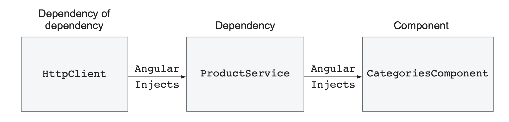
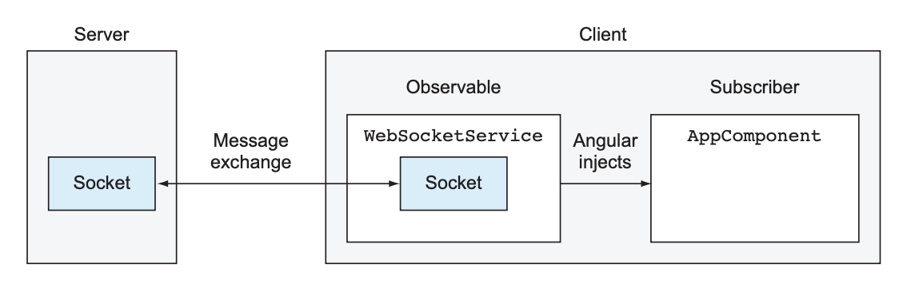
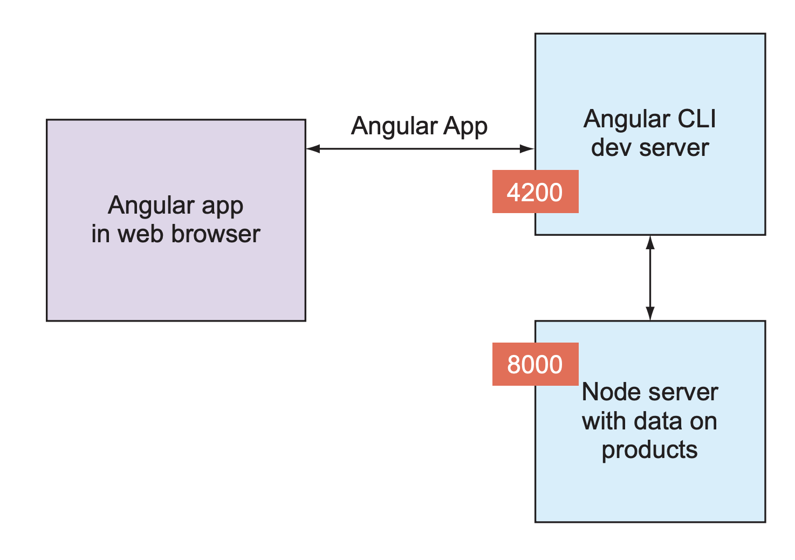

# INDEX

- [INDEX](#index)
  - [HttpClient](#httpclient)
    - [Overview of the HttpClient Service](#overview-of-the-httpclient-service)
  - [Angular HttpClient Service](#angular-httpclient-service)
    - [HTTPClient Methods](#httpclient-methods)
      - [GET method](#get-method)
      - [POST method](#post-method)
      - [PUT method](#put-method)
      - [DELETE method](#delete-method)
    - [Injecting HttpClient](#injecting-httpclient)
    - [Subscribing to HttpClient Observables](#subscribing-to-httpclient-observables)
  - [HttpClientModule Module](#httpclientmodule-module)
    - [HTTP Params](#http-params)
    - [HTTP Interceptors](#http-interceptors)
      - [Interceptors real-life examples](#interceptors-real-life-examples)
  - [Progress bar using HTTP Client](#progress-bar-using-http-client)
  - [WebSocket in Angular](#websocket-in-angular)
    - [Using WebSockets in Angular clients](#using-websockets-in-angular-clients)
  - [Proxying to a backend server](#proxying-to-a-backend-server)

---

## HttpClient

### Overview of the HttpClient Service

Browser-based web applications run HTTP requests **asynchronously**, allowing the UI to remain responsive while the user continues working with the application. HTTP requests are processed by the server in the background.


- Handling Asynchronous HTTP Requests
  - Asynchronous HTTP requests can be implemented using three approaches:
    1. **Callbacks** - Traditional approach
    2. **Promises** - Better than callbacks, avoiding callback hell
    3. **Observables** - Most powerful and flexible approach

- Why Use Observables Over Promises?
  
  - While **promises** help avoid callback hell, they have significant shortcomings:
    - ❌ **No way to cancel** a pending request made with a promise
    - ❌ **Single piece of data**: When a promise resolves or rejects, the client receives either data or an error message, but in both cases it'll be a single piece of data. A JavaScript promise doesn't offer a way to handle a continuous stream of data chunks delivered over time.

  - Observables Advantages
    - ✅ **Cancellable**: You can cancel HTTP requests made with observables by unsubscribing from the observable
    - ✅ **Stream support**: A server can push a stream of data to the client using WebSockets or Server-Sent Events (SSE), and the client can handle the stream using observables

---

## Angular HttpClient Service

Angular supports HTTP communications via the `HttpClient` service from the `@angular/common/http` package.

### HTTPClient Methods

- If your app requires HTTP communications, you need to add `HttpClientModule` to the `imports` section of the `@NgModule()` decorator -> **see [HttpClientModule Module](#httpclientmodule-module) below**
- The `HttpClient` service methods like `get()`, `post()`, `put()`, `delete()`, etc. are used to perform HTTP requests.
- Public methods of HttpClient return an Observable object, and only when the client subscribes to it is the request to the server made.

#### GET method

```ts
this.http.get<T>(url, options?)
```

- `T`: The expected response type
  > The type annotation doesn’t enforce or validate the shape of the data returned by the server; it just makes the other code aware of the expected server response. By default, the response type is `any`, and the TypeScript compiler won’t be able to type-check the properties you access on the returned object.
- `url`: The URL to which the request is sent
- `options`: An optional object containing request options such as headers, parameters, etc.

#### POST method

HTTP POST requests are used for sending new data to the server. With HttpClient,
making POST requests is similar to making GET requests.

- Invoking the `HttpClient.post()` method declares your intention to post data to the specified URL, but the request is made when you invoke `subscribe()`.

```ts
this.http.post<T>(url, body, options?)
```

- `body`: The request payload to be sent to the server
- Other parameters are the same as in the `get()` method

#### PUT method

```ts
this.http.put<T>(url, body, options?)
```

- Parameters are the same as in the `post()` method

#### DELETE method

```ts
this.http.delete<T>(url, options?)
```

- Parameters are the same as in the `get()` method

---

### Injecting HttpClient

We can use the `HttpClient` service to perform HTTP requests in Angular applications. and we can inject it into a service or component using Angular's dependency injection system.

- To use the `HttpClient` service, you need to **inject** it into a service or component

> **HttpClient Provider**
>
> Every injectable service requires a provider declaration. The providers for `HttpClient` are declared in `HttpClientModule`, so you don't need to declare them in your app.

- injecting `HttpClient` into a component requires one dependency injection, but we can also inject it into a service and then inject that service into a component (2 dependency injections (one for the service and one for the HttpClient))
  

- Example of injecting `HttpClient` into a component and using it to perform HTTP requests:

  ```ts
  import { HttpClient } from '@angular/common/http';

  export class AppComponent {
    // Dependency Injection of HttpClient
    constructor(private http: HttpClient) {
      // Example 1️⃣ of using HttpClient to perform an HTTP GET request without options or params
      this.http.get('https://api/posts').subscribe(data => {
        console.log(data);
      });
      // Note: calling just `get` method will not make the request, we need to subscribe to the observable to make the request


      // Example 2️⃣ of using HttpClient to perform an HTTP GET request with options and params
      const let httpHeaders = new HttpHeaders().set('Custom-Header', 'value');
      const let httpParams = new HttpParams().set('userId', '1');
      const options = {
        headers: httpHeaders,
        params: httpParams
      };
      this.http.get('https://api/posts', options).subscribe(data => {
        console.log(data);
      });
    }
  }
  ```

- `HTTP Headers` and `HTTP Params` are explained in the [HTTP Params](#http-params) section below

---

### Subscribing to HttpClient Observables

- The `HttpClient` service methods return an `Observable` that emits the server response when the request is complete, that's why:
  - An app needs to **subscribe** to the Observable to get the data

    ```ts
    this.http.get<T>(url).subscribe(
      (data: T) => {
        // handle the data
      },
      (error: any) => {
        // handle the error
      }
    );
    ```

    - The request is not made until the Observable is subscribed to, so you can either subscribe to it or use the `async` pipe in the template to subscribe to it automatically

  - **⚠️ NOTE** you don't need to use `ngOnDestroy()` to explicitly unsubscribe from the observable because **once HttpClient gets the response (or an error), the underlying Observable completes, so the observer is unsubscribed automatically**.

- By default, the `HttpClient` service returns the response body as a **JSON object**, and the **data is automatically parsed into a JavaScript object**
  - You can specify a different response type using the `responseType` option in the request options object

  ```ts
  this.http.get<T>(url, { responseType: 'text' }).subscribe(
    (data: T) => {
      // handle the data
    },
    (error: any) => {
      // handle the error
    }
  );
  ```

---

## HttpClientModule Module

To perform HTTP requests in Angular, we need to import the `HttpClientModule` in the module, and then we can use the `HttpClient` service to perform HTTP requests


- Check [observables](./6-Angular-RXJS.md#observables) for more information about observables and how the `HttpClient` service works with observables

- Example of using the `HttpClient` service to perform an HTTP request

  ```ts
  // app.module.ts
  import { HttpClientModule } from '@angular/common/http';

  @NgModule({
    declarations: [AppComponent],
    imports: [BrowserModule, HttpClientModule], // import the HttpClientModule here
    providers: [],
    bootstrap: [AppComponent]
  })
  export class AppModule {}
  ```

  ```ts
  // app.component.ts
  import { HttpClient } from '@angular/common/http';

  export class AppComponent {
    // Dependency Injection of HttpClient
    constructor(private http: HttpClient) {
      this.http.get('https://jsonplaceholder.typicode.com/posts').subscribe(data => {
        console.log(data);
      });
      // Note: calling just `get` method will not make the request, we need to subscribe to the observable to make the request
    }
  }
  ```

- Note: We can still use other tools like `fetch` or `axios` to perform HTTP requests in Angular, but it's recommended to use the `HttpClient` service provided by Angular
  - One of the reasons is that the `HttpClient` service is integrated with Angular's `error handling` and `observables`, which makes it easier to handle the HTTP requests and responses and work with `RxJS` observables

---

### HTTP Params

`HttpParams` is a class in Angular that is used to create URL parameters (query string for the URL) for an HTTP request

- It's used to create a URL query string with key-value pairs for an HTTP request
- It's immutable, which means that once it's created, it cannot be changed
- Example of using `HttpParams` to create URL parameters for an HTTP request

  ```ts
  // app.component.ts
  import { HttpClient, HttpParams } from '@angular/common/http';

  export class AppComponent {
    constructor(private http: HttpClient) {
      const params = new HttpParams().set('userId', '1').set('id', '1');
      this.http.get('https://jsonplaceholder.typicode.com/posts', { params }).subscribe(data => {
        console.log(data);
      });
    }
  }
  ```

  - In this example, we're creating URL parameters with key-value pairs `userId=1` and `id=1` and passing them to the `get` method of the `HttpClient` service
  - The `get` method takes an optional configuration object as the second argument, where we can pass the `params` object

- Example of using `HttpParams` with an observable:

  ```ts
  // service
  // ...
  export class NewsApiService {
    url = 'https://newsapi.org/v2/top-head';
    pageSize = 10;
    apiKey = '123456789';
    totalPages: number;

    pagesInput: Subject<number>;
    pagesOutput: Observable<any>;

    constructor(private http: HttpClient) {
      this.pagesInput = new Subject();
      this.pagesOutput = this.pagesInput.pipe(
        map(page => {
          return new HttpParams()
            .set('apiKey', this.apiKey)
            .set('pageSize', this.pageSize.toString())
        }),
        switchMap(params => {
          return this.http.get(this.url, { params });
        }),
        tap(res => {
          // Here we add any operations that we want to do after fetching
          this.totalPages = Math.ceil(response.totalResults / 10);
        }
      );
    }
  }
  ```

---

### HTTP Interceptors

> Is there a way to intercept all of them to provide some additional processing, like showing/hiding the progress bar, or logging requests? **Yes, we can use HTTP Interceptors for that.**

Angular allows you to create HTTP interceptors for pre- and post-processing of all HTTP requests and responses of your app. They can be useful for implementing such cross-cutting concerns as logging, global error handling, authentication, and others.

- **HTTP Interceptor** is a middleware (function) that intercepts HTTP requests and responses from the client to the server and vice versa **(executes before the request is sent to the server and after the response is received from the server)**
  
  - It is used to modify the request or response, add headers, handle errors, etc. Examples:
    - Adding an authentication token to the request headers (e.g., JWT token)
    - set cookies in the request headers before sending the request to the server
    - Logging request and response details
    - Handling global errors (e.g., redirecting to a login page on 401 Unauthorized errors)

- ⚠️ Note: The interceptors work before the request goes out or before a response is rendered on the UI.
  - This gives you a chance to implement the fallback scenarios for certain errors or prevent attempts of unauthorized access.

- **To create an interceptor**, you need to write a service that implements the `HttpInterceptor` interface, which requires you to implement one method: `intercept()`.
  - Angular will provide two arguments to this callback: `HttpRequest` and `HttpHandler`.
    - The first one contains the request object being intercepted, which you can clone and modify.
    - The second argument is used to forward the modified request to the backend or another interceptor in the chain (if any) by invoking the `handle()` method.

    > NOTE The `HttpRequest` and `HttpResponse` objects are immutable, and the word **modify** means creating and passing through the new instances of these objects.

- Example of creating an HTTP Interceptor
  - 1️⃣ Create a new class file for the interceptor

    ```bash
    ng g service interceptors/auth-interceptor
    ```

    - This will create a new service in the `interceptors` folder
    - The service file will have a class with the same name as the service file

  - 2️⃣ Implement the `HttpInterceptor` interface in the service class

    ```ts
    // auth-interceptor.ts (class file)
    import { Injectable } from '@angular/core';
    import { HttpInterceptor, HttpRequest, HttpHandler, HttpEvent } from '@angular/common/http';
    import { Observable } from 'rxjs';

    @Injectable()
    export class AuthInterceptor implements HttpInterceptor {
      intercept(req: HttpRequest<any>, next: HttpHandler): Observable<HttpEvent<any>> {
        const token = localStorage.getItem('token');
        if (token) {
          const modifiedRequest = req.clone({
            headers: req.headers.set('Authorization', 'Bearer ' + token),
            withCredentials: true // to send cookies with the request
          });
          return next.handle(modifiedRequest);
        } else {
          return next.handle(req);
        }
      }
    }
    ```

    - The `intercept` method is called for every HTTP request
    - It takes two arguments:
      - `req`: the request object
      - `next`: the next interceptor in the chain
    - It returns an observable of the `HttpEvent` type
    - **Why we use `req.clone()` method?**
      - Because **the `HttpRequest` object is immutable** (if you try to override it, Typescript will raise errors), which means that we cannot modify it directly, so we need to create a copy of the request object and modify the copy using the `clone()` method

  - 3️⃣ Because an interceptor is an injectable service, don’t forget to declare its provider by either (registering it in the `app.module.ts` file or using standalone components using the `withInterceptors` method):
    - **Module based:** Add the interceptor to the providers array in the `app.module.ts` file (to make it available to the entire app)

      ```ts
      // app.module.ts
      import { HTTP_INTERCEPTORS } from '@angular/common/http';
      import { AuthInterceptor } from './interceptors/auth-interceptor';

      @NgModule({
        declarations: [AppComponent],
        imports: [BrowserModule, HttpClientModule],
        providers: [
          // Here, we're telling Angular to provide the AuthInterceptor and use it as an HTTP_INTERCEPTOR if any HTTP request is made in the app (because by default, Angular doesn't know about the AuthInterceptor, so we need to provide it here as it only uses the HTTP_INTERCEPTORS token)
          {
            provide: HTTP_INTERCEPTORS,
            useClass: AuthInterceptor,
            multi: true // this is important to allow multiple interceptors
          }
        ],
        bootstrap: [AppComponent]
      })
      export class AppModule {}
      ```

      - The `HTTP_INTERCEPTORS` is a token that is used to provide the interceptors in Angular
      - Here, we're telling Angular to provide the `AuthInterceptor` class and use it as an `HTTP_INTERCEPTOR` if any HTTP request is made in the app (because by default, Angular doesn't know about the `AuthInterceptor`, so we need to provide it here as it only uses the `HTTP_INTERCEPTORS` token)
      - It's an old way of dependency injection, and now we can also use standalone components to register the interceptor using the `withInterceptors` method

    - **Standalone based:** If you're using standalone components, you can use the `withInterceptors` method to register the interceptor in the component

      ```ts
      // app.component.ts
      import { withInterceptors } from '@angular/core';
      import { AuthInterceptor } from './interceptors/auth-interceptor';

      @Component({
        selector: 'app-root',
        templateUrl: './app.component.html',
        styleUrls: ['./app.component.css'],
        imports: [HttpClientModule],
        providers: [withInterceptors([AuthInterceptor])] // register the interceptor here
      })
      export class AppComponent {
        // component logic
      }
      ```

  - 4️⃣ Now, the `AuthInterceptor` will intercept every HTTP request and add the token to the request headers before sending the request to the server

    ```ts
    // interceptors/auth-interceptor.ts 📄

    // Option 1: class based interceptor (OLD WAY)
    import { Injectable } from '@angular/core';
    import { HttpInterceptor, HttpRequest, HttpHandler, HttpEvent } from '@angular/common/http';
    import { Observable } from 'rxjs';
    @Injectable()
    export class AuthInterceptor implements HttpInterceptor {
      intercept(req: HttpRequest<any>, next: HttpHandler): Observable<HttpEvent<any>> {
        const token = localStorage.getItem('token');
        if (token) {
          const modifiedRequest = req.clone({
            headers: req.headers.set('Authorization', 'Bearer ' + token)
          });
          return next.handle(modifiedRequest);
        } else {
          return next.handle(req);
        }
      }
    }

    // -------------------------or-------------------------

    // Option 2: standalone based interceptor (NEW WAY)
    import { withInterceptors } from '@angular/core';
    import { HttpClientModule } from '@angular/common/http';
    import { AuthInterceptor } from './interceptors/auth-interceptor';

    export funtion AuthInterceptor(req: HttpRequest<any>, next: HttpHandler): Observable<HttpEvent<any>> {
      const token = localStorage.getItem('token');
      if (token) {
        const modifiedRequest = req.clone({
          headers: req.headers.set('Authorization', 'Bearer ' + token)
        });
        return next.handle(modifiedRequest);
      } else {
        return next.handle(req);
      }
    }
    ```

- Notes:
  - To have different handling for the request and response, we can:
    - create separate interceptors for the request and response

      ```ts
      // auth-request-interceptor.ts
      export class AuthRequestInterceptor implements HttpInterceptor {
        intercept(req: HttpRequest<any>, next: HttpHandler): Observable<HttpEvent<any>> {
          // handle request
        }
      }

      export class AuthResponseInterceptor implements HttpInterceptor {
        intercept(req: HttpRequest<any>, next: HttpHandler): Observable<HttpEvent<any>> {
          // handle response
        }
      }
      ```

    - or **we can handle both request and response** in the same interceptor

      ```ts
      export class AuthInterceptor implements HttpInterceptor {
        intercept(req: HttpRequest<any>, next: HttpHandler): Observable<HttpEvent<any>> {
          // ...
          return next.handle(req).pipe(
            tap(event => {
              if (event instanceof HttpResponse) {
                // or
                // if (event.type === HttpEventType.Response) {
                // handle response
              }
              if (event instanceof HttpRequest) {
                // or
                // if (event.type === HttpEventType.Sent) {
                // handle request
              }

              return event;
            })
          );
        }
      }
      ```

---

#### Interceptors real-life examples

- **Example 1: Adding an Authorization header to every request**

  ```ts
  export class AuthInterceptor implements HttpInterceptor {
    intercept(req: HttpRequest<any>, next: HttpHandler): Observable<HttpEvent<any>> {
      const token = localStorage.getItem('token');
      if (token) {
        const modifiedRequest = req.clone({
          headers: req.headers.set('Authorization', 'Bearer ' + token)
        });
        return next.handle(modifiedRequest);
      } else {
        return next.handle(req);
      }
    }
  }
  ```

- **Example 2: Logging request and response details**

  ```ts
  export class LoggingInterceptor implements HttpInterceptor {
    intercept(req: HttpRequest<any>, next: HttpHandler): Observable<HttpEvent<any>> {
      console.log('Request URL:', req.url);
      console.log('Request Headers:', req.headers);
      return next.handle(req).pipe(
        tap(event => {
          if (event instanceof HttpResponse) {
            console.log('Response Status:', event.status);
            console.log('Response Body:', event.body);
          }
          return event;
        })
      );
    }
  }
  ```

- **Example 3: Handling global errors**

  ```ts
  export class ErrorInterceptor implements HttpInterceptor {
    intercept(req: HttpRequest<any>, next: HttpHandler): Observable<HttpEvent<any>> {
      return next.handle(req).pipe(
        catchError((error: HttpErrorResponse) => {
          if (error.status === 401) {
            // Redirect to login page
            window.location.href = '/login';
          } else if (error.status === 500) {
            // Show a generic error message
            alert('An unexpected error occurred. Please try again later.');
          }
          return throwError(error);
        })
      );
    }
  }
  ```

- **Example 4: Showing a loading spinner during HTTP requests**

  ```ts
  export class LoadingInterceptor implements HttpInterceptor {
    private requests: HttpRequest<any>[] = [];

    intercept(req: HttpRequest<any>, next: HttpHandler): Observable<HttpEvent<any>> {
      this.requests.push(req);
      // Show loading spinner
      this.showSpinner();

      return next.handle(req).pipe(
        finalize(() => {
          this.requests = this.requests.filter(r => r !== req);
          if (this.requests.length === 0) {
            // Hide loading spinner
            this.hideSpinner();
          }
        })
      );
    }

    private showSpinner() {
      // Logic to show spinner by inserting DOM element to the body or using a service
    }

    private hideSpinner() {
      // Logic to hide spinner by removing DOM element from the body or using a service
    }
  }
  ```

- **Example 5: Caching GET requests**

  ```ts
  export class CachingInterceptor implements HttpInterceptor {
    private cache = new Map<string, HttpResponse<any>>();

    intercept(req: HttpRequest<any>, next: HttpHandler): Observable<HttpEvent<any>> {
      if (req.method === 'GET') {
        const cachedResponse = this.cache.get(req.urlWithParams);
        if (cachedResponse) {
          return of(cachedResponse);
        } else {
          return next.handle(req).pipe(
            tap(event => {
              if (event instanceof HttpResponse) {
                this.cache.set(req.urlWithParams, event);
              }
            })
          );
        }
      } else {
        return next.handle(req);
      }
    }
  }
  ```

---

## Progress bar using HTTP Client

Sometimes uploading or downloading certain assets (like large data files or images) takes time, and you should keep the user informed about the progress. `HttpClient` offers progress events that contain information like total size of the asset, current number of bytes that are already uploaded or downloaded, and more.

1. To enable progress events tracking, make your requests using the `HttpRequest` object with the option `{reportProgress: true}`.
2. Then, instead of using methods like `http.get()` or `http.post()`, use the more general `http.request()` method that accepts an `HttpRequest` object.
3. Finally, subscribe to the returned observable and check the type of each emitted event to determine whether it's a progress event or the final response.

```ts
const req = new HttpRequest('GET', 'https://api/large-file', { reportProgress: true });
this.http.request(req).subscribe(event => {
  if (event.type === HttpEventType.DownloadProgress) {
    const percentDone = Math.round((100 * event.loaded) / event.total);
    console.log(`File is ${percentDone}% downloaded.`);
  } else if (event instanceof HttpResponse) {
    console.log('File downloaded successfully!', event.body);
  }
});
```

---

## WebSocket in Angular

**WebSocket** is a protocol that enables two-way communication between a client and a server over a single, long-lived connection. It allows real-time data transfer, making it suitable for applications that require instant updates, such as chat applications, live notifications, and online gaming.

- You can create an Angular service that turns WebSocket events into an observable stream.

> You can find more about WebSockets in the:
>
> - [System design/2-API-design.md#websockets](../../../System%20design/2-API-design.md#websockets) file.
> - [Frontend/JavaScript/5-Web-APIs.md#websocket-api](./5-Web-APIs.md#websocket-api) file.

### Using WebSockets in Angular clients

In Angular, you usually wrap all communications with servers into injectable services. So, to use WebSockets in an Angular application, you can create a service that manages the WebSocket connection and provides methods for sending and receiving messages.


- Note that We used `httpClient` for HTTP communications because Angular provides a built-in `HttpClient` service for that purpose. However, Angular does not have a built-in WebSocket service, so we can use third-party libraries like `rxjs/webSocket` to work with WebSockets in Angular or use the native WebSocket API.
  - **the WebSocket object offers an API that’s easy to turn into an observable stream of multiple values** like changing stock prices or bids on products.
  - Think of a WebSocket as a data producer that can emit values, and an Observable object can relay these values to subscribers (for example, Angular components). In Angular, you can either manually create a service producing an observable stream from a WebSocket connection or use the `WebSocketSubject` offered by RxJS.

- **Example 1️⃣:** using `WebSocketSubject` from the `rxjs/webSocket` package to create a WebSocket service in Angular.

  ```ts
  // websocket.service.ts 📄
  import { Injectable } from '@angular/core';
  import { webSocket, WebSocketSubject } from 'rxjs/webSocket';
  import { Observable } from 'rxjs';

  @Injectable({
    providedIn: 'root'
  })
  export class WebSocketService {
    private socket$: WebSocketSubject<any>;

    constructor() {
      this.socket$ = webSocket('ws://localhost:8080'); // Replace with your WebSocket server URL
    }

    // Method to send messages to the server
    sendMessage(message: any): void {
      this.socket$.next(message);
    }

    // Method to receive messages from the server
    getMessages(): Observable<any> {
      return this.socket$.asObservable();
    }

    // Method to close the WebSocket connection
    closeConnection(): void {
      this.socket$.complete();
    }
  }
  ```

  ```ts
  // app.component.ts 📄
  import { Component, OnInit, OnDestroy } from '@angular/core';
  import { WebSocketService } from './websocket.service';
  import { Subscription } from 'rxjs';

  @Component({
    selector: 'app-root',
    templateUrl: './app.component.html',
    styleUrls: ['./app.component.css']
  })
  export class AppComponent implements OnInit, OnDestroy {
    private messagesSubscription: Subscription;
    messages: any[] = [];

    constructor(private webSocketService: WebSocketService) {}

    ngOnInit(): void {
      // Subscribe to receive messages from the server
      this.messagesSubscription = this.webSocketService.getMessages().subscribe(
        message => {
          this.messages.push(message);
        },
        error => {
          console.error('WebSocket error:', error);
        }
      );
    }

    ngOnDestroy(): void {
      // Unsubscribe to avoid memory leaks
      if (this.messagesSubscription) {
        this.messagesSubscription.unsubscribe();
      }
    }
  }
  ```

  - You will notice that we didn't call the `closeConnection()` method in the `ngOnDestroy()` lifecycle hook. This is because when the component is destroyed, the subscription to the observable is unsubscribed, which will automatically close the WebSocket connection.

- **Example 2️⃣:** using the native WebSocket API and `new Observable()` syntax to create a WebSocket service in Angular.

  ```ts
  // websocket.service.ts 📄
  import { Injectable } from '@angular/core';
  import { Observable, Subject } from 'rxjs';

  @Injectable({
    providedIn: 'root'
  })
  export class WebSocketService {
    private socket: WebSocket;
    
    createObservableSocket(url: string): Observable<any> {
      this.socket = new WebSocket(url);
      return new Observable(observer => {
        this.socket.onmessage = event => observer.next(event.data);
        this.socket.onerror = event => observer.error(event);
        this.socket.onclose = event => observer.complete();

        // Cleanup function
        return () => {
          this.socket.close();
        };
      });
    }

    sendMessage(message: any): void {
      if (this.socket && this.socket.readyState === WebSocket.OPEN) {
        this.socket.send(message);
        return `Message sent: ${message}`;
      } else {
        console.error('WebSocket is not open. Unable to send message.');
      }
    }
  }
  ```

  - The usage in the component remains the same as in Example 1️⃣.

---

## Proxying to a backend server

When developing an Angular application that communicates with a backend server, you may encounter issues related to `Cross-Origin Resource Sharing (CORS)`. This occurs when the frontend and backend are hosted on different domains or ports.

To avoid CORS issues during development, you can set up a proxy configuration in your Angular application. This allows you to redirect API calls from the Angular development server to the backend server seamlessly.


- Steps to set up a proxy configuration:
  1. Create a `proxy.conf.json` file in the root of your Angular project (or any other name you prefer).

  2. Define the proxy configuration in the `proxy.conf.json` file. For example:

     ```json
     {
       "/api": {
         "target": "http://localhost:8000",
         "secure": false,
         "changeOrigin": true,
         "logLevel": "debug"
       }
     }
     ```

     - In this example, any request made to `/api` will be proxied to `http://localhost:8000/api`.

  3. Update the `angular.json` file to include the proxy configuration in the `serve` options:

     ```json
     "architect": {
       "serve": {
         "options": {
           "proxyConfig": "proxy.conf.json"
         }
       }
     }
     ```

  4. Start the Angular development server using the command:

     ```bash
     ng serve
     ```
