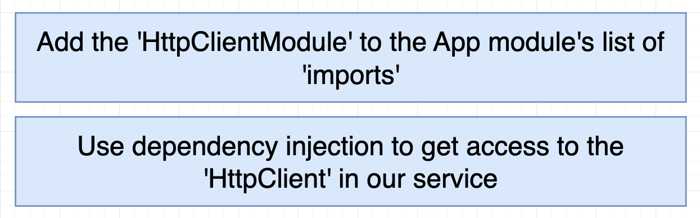

# INDEX

- [INDEX](#index)
  - [HttpClient](#httpclient)
    - [Overview of the HttpClient Service](#overview-of-the-httpclient-service)
    - [Angular HttpClient Service](#angular-httpclient-service)
  - [HttpClientModule Module](#httpclientmodule-module)
    - [HTTP Params](#http-params)
    - [HTTP Interceptors](#http-interceptors)

---

## HttpClient

### Overview of the HttpClient Service

Browser-based web applications run HTTP requests **asynchronously**, allowing the UI to remain responsive while the user continues working with the application. HTTP requests are processed by the server in the background.


- Handling Asynchronous HTTP Requests

  - Asynchronous HTTP requests can be implemented using three approaches:

    1. **Callbacks** - Traditional approach
    2. **Promises** - Better than callbacks, avoiding callback hell
    3. **Observables** - Most powerful and flexible approach

- Why Use Observables Over Promises?
  

  - While **promises** help avoid callback hell, they have significant shortcomings:

    - ❌ **No way to cancel** a pending request made with a promise
    - ❌ **Single piece of data**: When a promise resolves or rejects, the client receives either data or an error message, but in both cases it'll be a single piece of data. A JavaScript promise doesn't offer a way to handle a continuous stream of data chunks delivered over time.

  - Observables Advantages

    - ✅ **Cancellable**: You can cancel HTTP requests made with observables by unsubscribing from the observable
    - ✅ **Stream support**: A server can push a stream of data to the client using WebSockets or Server-Sent Events (SSE), and the client can handle the stream using observables

---

### Angular HttpClient Service

Angular supports HTTP communications via the `HttpClient` service from the `@angular/common/http` package.

- If your app requires HTTP communications, you need to add `HttpClientModule` to the `imports` section of the `@NgModule()` decorator -> **see [HttpClientModule Module](#httpclientmodule-module) below**
- The `HttpClient` service methods like `get()`, `post()`, `put()`, `delete()`, etc., return an `Observable`
- An app needs to **subscribe** to the Observable to get the data
- To use the `HttpClient` service, you need to **inject** it into a service or component

> **HttpClient Provider**
>
> Every injectable service requires a provider declaration. The providers for `HttpClient` are declared in `HttpClientModule`, so you don't need to declare them in your app.

```ts
import { HttpClient } from '@angular/common/http';

export class AppComponent {
  // Dependency Injection of HttpClient
  constructor(private http: HttpClient) {
    this.http.get('https://api/posts').subscribe(data => {
      console.log(data);
    });
    // Note: calling just `get` method will not make the request, we need to subscribe to the observable to make the request
  }
}
```

---

## HttpClientModule Module

To perform HTTP requests in Angular, we need to import the `HttpClientModule` in the module, and then we can use the `HttpClient` service to perform HTTP requests


- Check [observables](./6-Angular-RXJS.md#observables) for more information about observables and how the `HttpClient` service works with observables

- Example of using the `HttpClient` service to perform an HTTP request

  ```ts
  // app.module.ts
  import { HttpClientModule } from '@angular/common/http';

  @NgModule({
    declarations: [AppComponent],
    imports: [BrowserModule, HttpClientModule], // import the HttpClientModule here
    providers: [],
    bootstrap: [AppComponent]
  })
  export class AppModule {}
  ```

  ```ts
  // app.component.ts
  import { HttpClient } from '@angular/common/http';

  export class AppComponent {
    // Dependency Injection of HttpClient
    constructor(private http: HttpClient) {
      this.http.get('https://jsonplaceholder.typicode.com/posts').subscribe(data => {
        console.log(data);
      });
      // Note: calling just `get` method will not make the request, we need to subscribe to the observable to make the request
    }
  }
  ```

- Note: We can still use other tools like `fetch` or `axios` to perform HTTP requests in Angular, but it's recommended to use the `HttpClient` service provided by Angular
  - One of the reasons is that the `HttpClient` service is integrated with Angular's `error handling` and `observables`, which makes it easier to handle the HTTP requests and responses and work with `RxJS` observables

---

### HTTP Params

`HttpParams` is a class in Angular that is used to create URL parameters (query string for the URL) for an HTTP request

- It's used to create a URL query string with key-value pairs for an HTTP request
- It's immutable, which means that once it's created, it cannot be changed
- Example of using `HttpParams` to create URL parameters for an HTTP request

  ```ts
  // app.component.ts
  import { HttpClient, HttpParams } from '@angular/common/http';

  export class AppComponent {
    constructor(private http: HttpClient) {
      const params = new HttpParams().set('userId', '1').set('id', '1');
      this.http.get('https://jsonplaceholder.typicode.com/posts', { params }).subscribe(data => {
        console.log(data);
      });
    }
  }
  ```

  - In this example, we're creating URL parameters with key-value pairs `userId=1` and `id=1` and passing them to the `get` method of the `HttpClient` service
  - The `get` method takes an optional configuration object as the second argument, where we can pass the `params` object

- Example of using `HttpParams` with an observable:

  ```ts
  // service
  // ...
  export class NewsApiService {
    url = 'https://newsapi.org/v2/top-head';
    pageSize = 10;
    apiKey = '123456789';
    totalPages: number;

    pagesInput: Subject<number>;
    pagesOutput: Observable<any>;

    constructor(private http: HttpClient) {
      this.pagesInput = new Subject();
      this.pagesOutput = this.pagesInput.pipe(
        map(page => {
          return new HttpParams()
            .set('apiKey', this.apiKey)
            .set('pageSize', this.pageSize.toString())
        }),
        switchMap(params => {
          return this.http.get(this.url, { params });
        }),
        tap(res => {
          // Here we add any operations that we want to do after fetching
          this.totalPages = Math.ceil(response.totalResults / 10);
        }
      );
    }
  }
  ```

---

### HTTP Interceptors

**HTTP Interceptor** is a middleware (function) that intercepts HTTP requests and responses from the client to the server and vice versa **(executes before the request is sent to the server and after the response is received from the server)**


- It is used to modify the request or response, add headers, handle errors, etc.
- Usually, we use HTTP Interceptor to add the token to the request headers before sending the request to the server, ex:

  - add the `JWT` token to the request headers before sending the request to the server
  - set cookies in the request headers before sending the request to the server
  - handle errors in the response before sending the response to the client

- Example of creating an HTTP Interceptor

  - 1️⃣ Create a new class file for the interceptor

    ```bash
    ng g service interceptors/auth-interceptor
    ```

    - This will create a new service in the `interceptors` folder
    - The service file will have a class with the same name as the service file

  - 2️⃣ Implement the `HttpInterceptor` interface in the service class

    ```ts
    // auth-interceptor.ts (class file)
    import { Injectable } from '@angular/core';
    import { HttpInterceptor, HttpRequest, HttpHandler, HttpEvent } from '@angular/common/http';
    import { Observable } from 'rxjs';

    @Injectable()
    export class AuthInterceptor implements HttpInterceptor {
      intercept(req: HttpRequest<any>, next: HttpHandler): Observable<HttpEvent<any>> {
        const token = localStorage.getItem('token');
        if (token) {
          const modifiedRequest = req.clone({
            headers: req.headers.set('Authorization', 'Bearer ' + token),
            withCredentials: true // to send cookies with the request
          });
          return next.handle(modifiedRequest);
        } else {
          return next.handle(req);
        }
      }
    }
    ```

    - The `intercept` method is called for every HTTP request
    - It takes two arguments:
      - `req`: the request object
      - `next`: the next interceptor in the chain
    - It returns an observable of the `HttpEvent` type
    - **Why we use `req.clone()` method?**
      - Because the `HttpRequest` object is immutable (if you try to override it, Typescript will raise errors), which means that we cannot modify it directly, so we need to create a copy of the request object and modify the copy using the `clone()` method

  - 3️⃣ register the interceptor in the `app.module.ts` file / or the `app.config.ts` file (to make it available to the entire app)

    - The old way is to create a class for the interceptor and register it in the `app.module.ts` file, but now we can also use standalone components to register the interceptor using the `withInterceptors` method
    - **Module based:** Add the interceptor to the providers array in the `app.module.ts` file (to make it available to the entire app)

      ```ts
      // app.module.ts
      import { HTTP_INTERCEPTORS } from '@angular/common/http';
      import { AuthInterceptor } from './interceptors/auth-interceptor';

      @NgModule({
        declarations: [AppComponent],
        imports: [BrowserModule, HttpClientModule],
        providers: [
          // Here, we're telling Angular to provide the AuthInterceptor and use it as an HTTP_INTERCEPTOR if any HTTP request is made in the app (because by default, Angular doesn't know about the AuthInterceptor, so we need to provide it here as it only uses the HTTP_INTERCEPTORS token)
          {
            provide: HTTP_INTERCEPTORS,
            useClass: AuthInterceptor,
            multi: true
          }
        ],
        bootstrap: [AppComponent]
      })
      export class AppModule {}
      ```

      - The `HTTP_INTERCEPTORS` is a token that is used to provide the interceptors in Angular
      - Here, we're telling Angular to provide the `AuthInterceptor` class and use it as an `HTTP_INTERCEPTOR` if any HTTP request is made in the app (because by default, Angular doesn't know about the `AuthInterceptor`, so we need to provide it here as it only uses the `HTTP_INTERCEPTORS` token)
      - It's an old way of dependency injection, and now we can also use standalone components to register the interceptor using the `withInterceptors` method

    - **Standalone based:** If you're using standalone components, you can use the `withInterceptors` method to register the interceptor in the component

      ```ts
      // app.component.ts
      import { withInterceptors } from '@angular/core';
      import { AuthInterceptor } from './interceptors/auth-interceptor';

      @Component({
        selector: 'app-root',
        templateUrl: './app.component.html',
        styleUrls: ['./app.component.css'],
        imports: [HttpClientModule],
        providers: [withInterceptors([AuthInterceptor])] // register the interceptor here
      })
      export class AppComponent {
        // component logic
      }
      ```

  - 4️⃣ Now, the `AuthInterceptor` will intercept every HTTP request and add the token to the request headers before sending the request to the server

    ```ts
    // interceptors/auth-interceptor.ts 📄

    // Option 1: class based interceptor (OLD WAY)
    import { Injectable } from '@angular/core';
    import { HttpInterceptor, HttpRequest, HttpHandler, HttpEvent } from '@angular/common/http';
    import { Observable } from 'rxjs';
    @Injectable()
    export class AuthInterceptor implements HttpInterceptor {
      intercept(req: HttpRequest<any>, next: HttpHandler): Observable<HttpEvent<any>> {
        const token = localStorage.getItem('token');
        if (token) {
          const modifiedRequest = req.clone({
            headers: req.headers.set('Authorization', 'Bearer ' + token)
          });
          return next.handle(modifiedRequest);
        } else {
          return next.handle(req);
        }
      }
    }

    // -------------------------or-------------------------

    // Option 2: standalone based interceptor (NEW WAY)
    import { withInterceptors } from '@angular/core';
    import { HttpClientModule } from '@angular/common/http';
    import { AuthInterceptor } from './interceptors/auth-interceptor';

    export funtion AuthInterceptor(req: HttpRequest<any>, next: HttpHandler): Observable<HttpEvent<any>> {
      const token = localStorage.getItem('token');
      if (token) {
        const modifiedRequest = req.clone({
          headers: req.headers.set('Authorization', 'Bearer ' + token)
        });
        return next.handle(modifiedRequest);
      } else {
        return next.handle(req);
      }
    }
    ```

- Notes:

  - To have different handling for the request and response, we can:

    - create separate interceptors for the request and response

      ```ts
      // auth-request-interceptor.ts
      export class AuthRequestInterceptor implements HttpInterceptor {
        intercept(req: HttpRequest<any>, next: HttpHandler): Observable<HttpEvent<any>> {
          // handle request
        }
      }

      export class AuthResponseInterceptor implements HttpInterceptor {
        intercept(req: HttpRequest<any>, next: HttpHandler): Observable<HttpEvent<any>> {
          // handle response
        }
      }
      ```

    - or **we can handle both request and response** in the same interceptor

      ```ts
      export class AuthInterceptor implements HttpInterceptor {
        intercept(req: HttpRequest<any>, next: HttpHandler): Observable<HttpEvent<any>> {
          // ...
          return next.handle(req).pipe(
            tap(event => {
              if (event instanceof HttpResponse) {
                // or
                // if (event.type === HttpEventType.Response) {
                // handle response
              }
              if (event instanceof HttpRequest) {
                // or
                // if (event.type === HttpEventType.Sent) {
                // handle request
              }

              return event;
            })
          );
        }
      }
      ```

---
