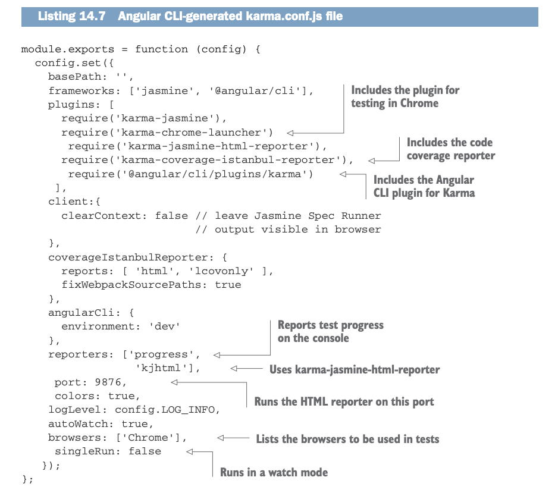
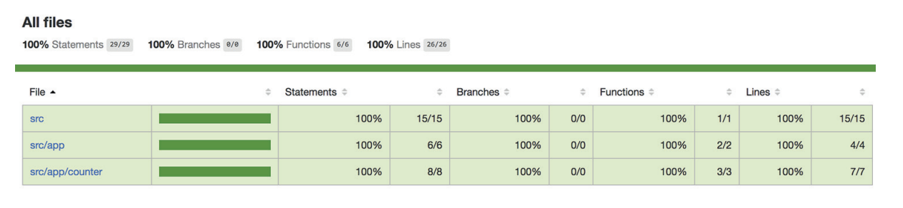
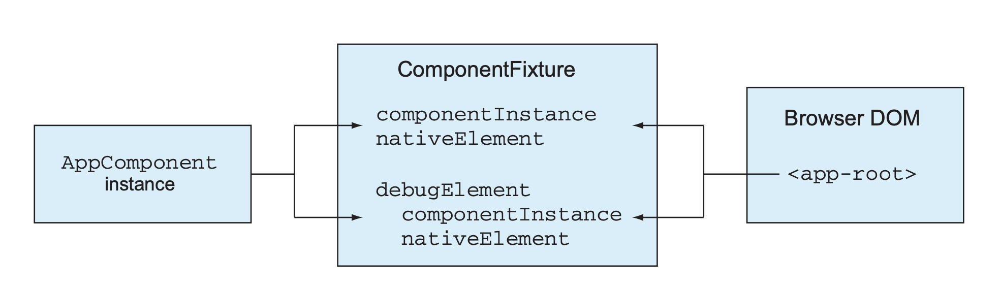
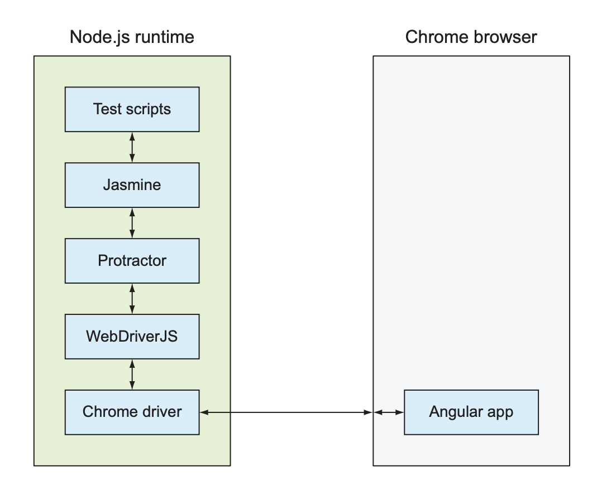

# INDEX

- [INDEX](#index)
  - [Testing in Angular](#testing-in-angular)
  - [Using the Angular testing library](#using-the-angular-testing-library)
    - [Configuring the Testing Module](#configuring-the-testing-module)
    - [Working with Asynchronous Code](#working-with-asynchronous-code)
    - [Dependency Injection in Tests](#dependency-injection-in-tests)
  - [Unit testing in Angular](#unit-testing-in-angular)
    - [Testing Components](#testing-components)
    - [Testing Services](#testing-services)
      - [Testing Services with Dependencies](#testing-services-with-dependencies)
    - [Testing components that use routing](#testing-components-that-use-routing)
  - [End-to-End (E2E) Testing in Angular](#end-to-end-e2e-testing-in-angular)
    - [E2E Testing with Protractor](#e2e-testing-with-protractor)
      - [E2E Example of testing login flow](#e2e-example-of-testing-login-flow)
      - [Dealing with waiting time in E2E tests](#dealing-with-waiting-time-in-e2e-tests)
      - [Dealing with flaky E2E tests](#dealing-with-flaky-e2e-tests)

---

## Testing in Angular

When writing tests in Angular, it's important to follow best practices to ensure your tests are effective, maintainable, and reliable.

- Here are some key best practices for testing in Angular:
  1. **Use Angular Testing Utilities**: Leverage Angular's built-in testing utilities such as TestBed, ComponentFixture, and async utilities to create a robust testing environment.
  2. **Isolate Unit Tests**: Focus on testing individual components, services, or directives in isolation. Use mocks and spies to simulate dependencies and avoid testing external systems.
  3. **Write Descriptive Test Cases**: Use clear and descriptive names for your test cases to convey the purpose of each test. This helps in understanding the test's intent and makes it easier to maintain.
  4. **Test Component Interaction**: Ensure that you test how components interact with each other, including input/output properties and event handling.
  5. **Use Test Data**: Create reusable test data to avoid duplication and make your tests more readable.
  6. **Avoid Over-Mocking**: While mocking is essential, avoid over-mocking as it can lead to tests that do not accurately reflect real-world scenarios.
  7. **Run Tests Frequently**: Integrate tests into your development workflow and run them frequently to catch issues early.
  8. **Use Code Coverage Tools**: Utilize code coverage tools to identify untested parts of your codebase and ensure comprehensive test coverage.
  9. **Keep Tests Fast**: Aim for fast-running tests to maintain developer productivity. Slow tests can lead to frustration and reduced test frequency.
  10. **Review and Refactor Tests**: Regularly review and refactor your tests to improve readability, maintainability, and effectiveness.

  > By following these best practices, you can create a robust testing strategy for your Angular applications that enhances code quality and reliability.

- There're 2 main types of testing in Angular:
  1. **Unit Testing**: Focuses on testing individual components, services, or directives in isolation. It ensures that each unit of code behaves as expected.
     > Threre're also integration tests that check that more than one app can communicate. **Whereas unit tests mock dependencies, integration tests use real dependencies** to ensure that different parts of the application work together correctly.
     >
     > To turn unit tests into integration tests, you can replace mocked services with real implementations in your test setup. This allows you to verify that multiple components or services interact correctly in a more realistic scenario.
  2. **End-to-End (E2E) Testing**: Simulates real user scenarios to test the entire application flow. It verifies that all components work together as intended.

---

## Using the Angular testing library

The Angular Testing Library is a popular library for testing Angular applications. It provides a set of utilities and helpers that make it easier to write tests for Angular components and services.

- It includes wrappers for some jasmine functions and adds new functions as `inject()`, `async()`, `fakeAsync()`, and `tick()` to help with asynchronous testing.

### Configuring the Testing Module

To test Angular artifacts, you need to create and configure an Angular module for the class under test using the `configureTestingModule()` method of the `TestBed` utility, which allows you to declare modules, components, providers, and so on. For example, the syntax for configuring a testing module looks similar to configuring `@NgModule()`, as you can see in the following listing.

```typescript
beforeEach(async(() => {
  // Runs this code asynchronously before each spec
  TestBed.configureTestingModule({
    // Configures the testing module
    declarations: [
      AppComponent // Lists components under test
    ]
  }).compileComponents(); // Compiles components
}));
```

- The `beforeEach()` function is used in test suites during the setup phase. With it you can specify the required modules, components, and providers that may be needed by each test. The `async()` function runs in the Zone and may be used with asynchronous code. The `async()` function doesn't complete until all of its asynchronous operations have been completed or the specified timeout has passed.

---

### Working with Asynchronous Code

- **`async()`**
  - It will run the function(s) under test in the Zone. If your test code uses timeouts, observables, or promises, wrap it into `async()` to ensure that the `expect()` statement doesn't execute before the function under test completes.

  ```typescript
  it('should do something async', async(() => {
    // Test code with async operations
    // The test will wait for all async operations to complete
  }));
  ```

  - Note that actual waits may slow down your tests. So, use `async()` only when necessary. and prefer using `fakeAsync()` and `tick()` for better performance.

- **`fakeAsync()`**
  - It is another utility for handling asynchronous operations in tests. It allows you to control the passage of time and execute asynchronous code synchronously within the test context **(Allows you to eliminate actual waits in your tests)**.
  - It identifies the timers in the code under test and replaces the code inside `setTimeout()`, `setInterval()`, or the `debounceTime()` with immediately executed functions as if they’re synchronous, and executes them in order. It also gives you more-precise time control with the `tick()` and `flush()` functions, which allow you to fast-forward the time.

  ```typescript
  it('should do something with fake async', fakeAsync(() => {
    // Asynchronous code here
    tick(1000); // Simulates the passage of 1000ms
    // Assertions here
  }));
  ```

- **`tick()`** is used in conjunction with `fakeAsync()` to simulate the passage of time. You can specify the number of milliseconds to advance the virtual clock.
  - ⚠️ You can use the `tick()` function only inside `fakeAsync()`.
  - Calling `tick()` without the argument means that you want the code that follows to be executed after all pending asynchronous activities finish.

### Dependency Injection in Tests

Use `inject()` or `TestBed.get()` (or `TestBed.inject()` in newer versions) to retrieve service instances for testing:

```typescript
it('should inject a service', inject([MyService], (service: MyService) => {
  expect(service).toBeTruthy();
}));

// Or using TestBed
it('should get a service from TestBed', () => {
  const service = TestBed.inject(MyService);
  expect(service).toBeTruthy();
});
```

> **Note**: In newer versions of Angular (v9+), `TestBed.inject()` is preferred over `TestBed.get()` for better type safety.

---

## Unit testing in Angular

- Whether you're using Jasmine, Mocha, or any other testing framework, the structure of test scripts in Angular follows a consistent pattern.

- In Angular, test suites have the same names as the files under test, adding the suffix `.spec` to the name.
  - For example, the file `application.spec.ts` contains the test script for `application.ts` file.

    ```ts
    // app.spec.ts
    import { AppComponent } from './app.component';

    describe('AppComponent', () => {
      it('should create the app', () => {
        const app = new AppComponent();
        expect(app).toBeTruthy();
      });
    });
    ```

- In Angular applications, you keep each test script in the same directory as the component (or service) under test, so if you need to reuse a component in another app, all related files are located together. If you use Angular CLI for generating a component or service, the boilerplate code for tests (the `.spec.ts` file) will be generated in the same directory.

  ```bash
  ├── app
  │     ├── app.component.ts
  │     ├── app.component.spec.ts  <-- test script for app.component.ts
  │     ├── app.module.ts
  │     └── app.service.ts
  │     └── app.service.spec.ts    <-- test script for app.service.ts
  ├── assets
  ├── environments
  ├── index.html
  └── main.ts
  ```

- Karma is the test runner used in Angular applications by default. It executes the test scripts in a real browser environment, providing accurate results that reflect how the application behaves in a user's browser.
  - Angular installs Jasmine and Karma by default when you create a new project using Angular CLI. so no additional setup is required to start writing tests.
    - Here's an example of a karma configuration file
      
  - Karma can be configured to run tests in different browsers, including Chrome, Firefox, and Safari. This allows you to ensure cross-browser compatibility for your Angular applications.
  - You can also set up Karma to run tests automatically whenever you make changes to your code, providing instant feedback during development.
  - To run the tests in an Angular application, you can use the following command:

    ```bash
    ng test
    ```

  - This command will launch Karma, which will execute all the test scripts in your application and display the results in the terminal or command prompt.

- **Test coverage** in Angular applications can be measured using the built-in code coverage tool provided by Karma. To generate a code coverage report, you can use the following command:

  ```bash
  ng test --code-coverage
  ```

  - This will create a directory called coverage that will include an `index.html` file that loads the coverage report.
    

  > **NOTE** Some organizations impose strict rules for code coverage, such as that at least 90% of the code must be covered with unit tests or the build must fail. To enforce such coverage, install the npm package karma-istanbul-threshold and add the istanbulThresholdReporter section to karma.conf.js. For more details, see [http://mng.bz/544u](http://mng.bz/544u).

- **Testing Components and Services**
  - In an Angular app, the components are "magically" created and services are injected, but in test scripts, you'll need to explicitly instantiate components and invoke the `inject()` function or the `TestBed.get()` function to inject services. If a function under test invokes asynchronous functions, you should wrap such it into `async()` or `fakeAsync()`.

### Testing Components

> Components are classes with templates. If a component’s class contains methods implementing some application logic, you can test them as you would any other function. But more often, you’ll be testing the UI to see that the bindings work properly and that the component template displays expected data.
>
> Under the hood, an Angular component consists of two parts: an instance of the class and the DOM element. Technically, when you write a unit test for a component, it’s more of an integration test, because it has to check that the instance of the component class and the DOM object work in sync.

- Components have two parts: the class (logic) and the template (DOM). Tests usually verify that the class and DOM stay in sync.

- Angular testing library offers the `TestBed.createComponent()` method to create a component instance along with its template. This method returns a `ComponentFixture` object that provides access to both the component instance and the rendered DOM.
  
  - `fixture.componentInstance` (or `fixture.debugElement.componentInstance`) gives the component class instance.
  - `fixture.nativeElement` (or `fixture.debugElement.nativeElement`) gives the rendered DOM element.

- Typical steps to test a component:
  1. Configure the testing module with `TestBed.configureTestingModule({...})` and call `compileComponents()` if needed.
  2. Create the component: `const fixture = TestBed.createComponent(MyComponent)`.
  3. Access the instance: `const comp = fixture.componentInstance` and call its methods or set inputs.
  4. Trigger change detection: `fixture.detectChanges()` so the template updates. After this, the DOM reflects the component state and you can query it or assert values.
     > **NOTE** If you want change detection to be triggered automatically, you can configure the testing module with the provider for the `ComponentFixtureAutoDetect` service. Although this seems to be a better choice than manually invoking `detectChanges()`, this service only notices the asynchronous activities and won’t react to synchronous updates of component properties.
  5. Query the DOM: `fixture.nativeElement.querySelector(...)` and assert rendered output with `expect(...)`.

- Example:

  ```typescript
  import { TestBed, ComponentFixture } from '@angular/core/testing';
  import { MyComponent } from './my.component';

  describe('MyComponent', () => {
    let fixture: ComponentFixture<MyComponent>;
    let component: MyComponent;

    beforeEach(async () => {
      await TestBed.configureTestingModule({
        declarations: [MyComponent]
      }).compileComponents();

      fixture = TestBed.createComponent(MyComponent);
      component = fixture.componentInstance;
    });

    it('should create the component', () => {
      expect(component).toBeTruthy();
    });

    it('should have default title', () => {
      expect(component.title).toBe('Default Title');
    });

    it('should display the title', () => {
      component.title = 'Test Title';
      fixture.detectChanges(); // Update the template by triggering change detection 👈

      const compiled = fixture.nativeElement;
      expect(compiled.querySelector('h1').textContent).toContain('Test Title');
    });
  });
  ```

  - 💡 You will notice the different between accessing the component instance via `fixture.componentInstance` and querying the DOM via `fixture.nativeElement`.

- Notes:
  - You can also use `fixture.debugElement` to query with DebugElement helpers and access injected services.
  - To auto-trigger change detection, use the `ComponentFixtureAutoDetect` provider, but be aware it only tracks asynchronous activity and may not react to synchronous property changes.
  - Wrap async setup or operations with `async()` or use `fakeAsync()` + `tick()` to control timers in tests.
  - Keep in mind that if your component uses **lifecycle** hooks, they won’t be called automatically. You need to call them explicitly, as in `component.ngOnInit()`.

---

### Testing Services

A service is a class with one or more methods, and you unit-test only the public ones, which in turn may invoke private methods.

- In Angular apps, you specify providers for services in `@Component` or `@NgModule`, so Angular can properly instantiate and inject them.
- In test files, you also declare providers for services under test, but you do this inside `TestBed.configureTestingModule()` in the setup phase.
  - To inject a service into a test, you can use the `inject()` function or the `TestBed.get()` (or `TestBed.inject()` in newer versions which uses root injector) method.
- Example of testing a service:

  ```ts
  import { TestBed } from '@angular/core/testing';
  import { MyService } from './my.service';

  describe('MyService', () => {
    let service: MyService;

    beforeEach(() => {
      TestBed.configureTestingModule({
        providers: [MyService] // Provide the service under test
      });
      service = TestBed.inject(MyService); // or use inject() in tests
    });

    it('should be created', () => {
      expect(service).toBeTruthy();
    });

    it('should return expected value from method', () => {
      const result = service.myMethod();
      expect(result).toBe('expected value');
    });
  });
  ```

  - In this example, we configure the testing module to provide `MyService`, then we inject it in the `beforeEach()` setup phase. Each test can then call methods on the service instance and assert expected behavior.

#### Testing Services with Dependencies

- Usually services depend on other services. In such cases, you can provide **mock implementations** of the dependencies using (Jasmine/Jest) spies or custom mock classes to isolate the service under test.

  ```ts
  import { TestBed } from '@angular/core/testing';
  import { MyService } from './my.service';
  import { DependencyService } from './dependency.service';

  let service: MyService;

  const mockDependency = {
    someMethod: jasmine.createSpy('someMethod').and.returnValue('mocked value')
  };
  // or in jest using jest.fn()
  // const mockDependency = {
  //   someMethod: jest.fn().mockReturnValue('mocked value')
  // };

  beforeEach(() => {
    TestBed.configureTestingModule({
      providers: [
        MyService,
        { provide: DependencyService, useValue: mockDependency } // Provide mock
      ]
    });
    service = TestBed.inject(MyService);
  });
  ```

- One of the most common dependencies is the `HttpClient` service for making HTTP requests. To test services that use `HttpClient`, Angular provides the `HttpClientTestingModule`, which allows you to mock HTTP requests and responses.

  ```ts
  import { TestBed } from '@angular/core/testing';
  import { HttpClientTestingModule, HttpTestingController } from '@angular/common/http/testing';
  import { MyService } from './my.service';

  let service: MyService;
  let httpMock: HttpTestingController;

  beforeEach(() => {
    TestBed.configureTestingModule({
      imports: [HttpClientTestingModule], // Import the testing module
      providers: [MyService]
    });
    service = TestBed.inject(MyService);
    httpMock = TestBed.inject(HttpTestingController);
  });

  afterEach(() => {
    httpMock.verify(); // Verify that no unmatched requests are outstanding
  });

  it('should fetch data from API', () => {
    const mockData = { id: 1, name: 'Test' };

    service.getData().subscribe(data => {
      expect(data).toEqual(mockData);
    });

    const req = httpMock.expectOne('api/data-endpoint'); // Expect a specific request
    expect(req.request.method).toBe('GET');
    req.flush(mockData); // Provide mock response
  });

  it('should handle error response', () => {
    const mockError = { status: 404, statusText: 'Not Found' };

    service.getData().subscribe(
      data => fail('should have failed with 404 error'),
      error => {
        expect(error.status).toBe(404);
      }
    );

    const req = httpMock.expectOne('api/data-endpoint');
    req.flush(null, mockError); // Provide mock error response
  });
  ```

  - In this example, we import `HttpClientTestingModule` to mock HTTP requests. We use `HttpTestingController` to expect specific requests and provide mock responses, allowing us to test the service's behavior without making real HTTP calls.
    - It does so by **intercepting HTTP requests** made by the `HttpClient` and allowing you to specify what responses should be returned for those requests.
    - Also note that without calling `.flush()`, the observable returned by the service method will not emit any value, and the subscription callback will not be executed.
  - Note that the order inside the test is important: first, you subscribe to the observable returned by the service method, then you expect the HTTP request and flush the mock response. This ensures that the subscription receives the data as expected.

  > 💡 You can also use `spyOn()` to spy on methods of dependencies if you want to verify that certain methods were called during the test.

---

### Testing components that use routing

When testing components that depend on Angular's Router, you can use the `RouterTestingModule` to provide a mock router for your tests. This allows you to simulate navigation and test how your component behaves in response to route changes.

- `RouterTestingModule` is part of `@angular/router/testing` and provides a way to configure routes and simulate navigation without actually changing the browser's URL. this is done by creating a mock router that can be controlled in your tests.

- Example of testing a component that uses routing:

  ```ts
  import { TestBed } from '@angular/core/testing';
  import { Router } from '@angular/router';
  import { RouterTestingModule } from '@angular/router/testing';
  import { MyComponent } from './my.component';

  describe('MyComponent with Router', () => {
    let component: MyComponent;
    let fixture: ComponentFixture<MyComponent>;
    let router: Router;

    beforeEach(async () => {
      await TestBed.configureTestingModule({
        imports: [RouterTestingModule], // Import the RouterTestingModule
        declarations: [MyComponent]
      }).compileComponents();

      fixture = TestBed.createComponent(MyComponent);
      component = fixture.componentInstance;
      router = TestBed.inject(Router);
    });

    it('should create the component', () => {
      expect(component).toBeTruthy();
    });

    // More tests that involve routing here

    it('should navigate to another route', () => {
      const navigateSpy = spyOn(router, 'navigate');

      component.goToAnotherRoute(); // Method that triggers navigation

      expect(navigateSpy).toHaveBeenCalledWith(['/another-route']);
    });
  });
  ```

- We can also spy on the `location` service to verify that the component navigates to the expected URL when a method is called.

  ```ts
  import { Location } from '@angular/common';

  it('should navigate to /home on goHome()', () => {
    const location = TestBed.inject(Location);
    const locationSpy = spyOn(location, 'go');

    component.goHome(); // Method that triggers navigation

    expect(locationSpy).toHaveBeenCalledWith('/home');
  });
  ```

---

## End-to-End (E2E) Testing in Angular

End-to-end (E2E) testing is for testing the entire app workflow by simulating user interaction with the app. For example, the process of placing an order may use multiple components and services. You can create an E2E test to ensure that this workflow behaves as expected. **Also, if in unit tests you’re mocking dependencies, E2E tests will use the real ones**.

> **⚠️ Note** that **Protractor** has been deprecated as of Angular 15, and the Angular team recommends using alternative E2E testing frameworks like **Cypress or Playwright** for new projects. However, Protractor is still widely used in existing Angular applications for E2E testing.

### E2E Testing with Protractor

- End-to-End (E2E) testing in Angular is typically performed using **Protractor**, a popular E2E testing framework that is specifically designed for Angular applications. **Protractor** allows you to write tests that simulate user interactions and verify that the application behaves as expected from the user's perspective.
  - By default it uses **Jasmine syntax** for writing test cases, but you can also configure it to use other testing frameworks like Mocha or Cucumber if desired.
  - It's based on **Selenium WebDriver**, which allows it to interact with web browsers and perform actions like clicking buttons, filling out forms, and navigating between pages.
  - It includes **angular-specific API** for locating elements and waiting for Angular to finish rendering before performing actions or assertions.

- To create E2E tests in an Angular application, you typically create a separate directory called `e2e` that contains the test scripts and configuration files. The test scripts are usually written in TypeScript and use Protractor's API to interact with the application.

  ```bash
  ├── e2e
  │     ├── src
  │     │     ├── app.e2e-spec.ts      <-- E2E test script
  │     │     └── app.po.ts             <-- Page Object file
  │     ├── protractor.conf.js         <-- Protractor configuration file
  ├── src
  │     ├── app
  │     └── ...
  └── ...
  ```

- Example of a simple E2E test using Protractor:

  ```typescript
  import { browser, by, element, $ } from 'protractor';

  describe('My Angular App', () => {
    beforeEach(() => {
      browser.get('/'); // Navigate to the app's root URL
    });

    it('should display the correct title', () => {
      const title = element(by.css('h1')).getText();
      // or using $
      // const title = $('h1').getText();

      expect(title).toEqual('Welcome to My Angular App');
    });

    it('should navigate to the about page', () => {
      const aboutLink = element(by.css('a.about-link'));
      // or using $
      // const aboutLink = $('a.about-link');

      aboutLink.click(); // Simulate clicking the link

      const aboutTitle = element(by.css('h2')).getText();
      // or using $
      // const aboutTitle = $('h2').getText();

      expect(aboutTitle).toEqual('About Us');
    });
  });
  ```

  - In this example, we use Protractor's `browser`, `by`, and `element` modules to interact with the application. The test navigates to the root URL, verifies the title, and simulates a click on a link to navigate to the about page.

- The `ng e2e` command builds the app bundles, starts the Node instance, and loads the test scripts, Protractor, and Selenium WebDriver. Protractor launches your app in the browser(s), and your test scripts communicate with the browser using the API of Protractor and WebDriverJS
  

- There's a common pattern here to have separate files for test scripts and page objects. Page objects encapsulate the logic for interacting with specific pages or components in the application, making the tests more maintainable and reusable.

  ```typescript
  // app.po.ts
  import { browser, by, element } from 'protractor';

  export class AppPage {
    navigateTo() {
      return browser.get('/');
    }

    getTitleText() {
      return element(by.css('h1')).getText();
    }
  }
  ```

  ```typescript
  // app.e2e-spec.ts
  import { AppPage } from './app.po';

  describe('My Angular App', () => {
    let page: AppPage;

    beforeEach(() => {
      page = new AppPage();
    });

    it('should display the correct title', () => {
      page.navigateTo();
      expect(page.getTitleText()).toEqual('Welcome to My Angular App');
    });
  });
  ```

  - In this example, the `AppPage` class encapsulates the logic for navigating to the app's root URL and retrieving the title text. The E2E test script uses this page object to perform the test, making it cleaner and easier to maintain.

---

#### E2E Example of testing login flow

A simple app with login and home pages. The app has two routes: `login` and `home`. If a user enters `Joe` as ID and `password` as password, the app navigates to the home page; otherwise, it stays on the login page and shows "Invalid ID or password."

**Route configurations:**

```ts
[
  { path: '', redirectTo: 'login', pathMatch: 'full' },
  { path: 'login', component: LoginComponent },
  { path: 'home', component: HomeComponent }
];
```

**Home component template:**

```html
<h1>Home Component</h1>
```

**Login component:**

```ts
@Component({
  selector: 'app-home',
  template: `
    <h1 class="home">Login Component</h1>
    <form #f="ngForm" (ngSubmit)="login(f.value)">
      ID:
      <input name="id" ngModel />
      <br />
      PWD:
      <input type="password" name="pwd" ngModel="" />
      <br />
      <button type="submit">Login</button>
      <span id="errMessage" *ngIf="wrongCredentials">Invalid ID or password</span>
    </form>
  `
})
export class LoginComponent {
  wrongCredentials = false;
  constructor(private router: Router) {}

  login(formValue) {
    if ('Joe' === formValue.id && 'password' === formValue.pwd) {
      this.router.navigate(['/home']);
      this.wrongCredentials = false;
    } else {
      this.router.navigate(['/login']);
      this.wrongCredentials = true;
    }
  }
}
```

**Page objects:**

Tests are located in the `e2e` directory and include two page objects (`login.po.ts` and `home.po.ts`) and one spec (`login.e2e-spec.ts`).

```ts
// home.po.ts
import { by, element } from 'protractor';

export class HomePage {
  getHeaderText() {
    return element(by.css('h1')).getText();
  }
}
```

```ts
// login.po.ts
import { browser, by, element, $ } from 'protractor';

export class LoginPage {
  id = $('input[name="id"]');
  pwd = $('input[name="pwd"]');
  submit = element(by.buttonText('Login'));
  errMessage = element(by.id('errMessage'));

  login(id: string, password: string): void {
    this.id.sendKeys(id);
    this.pwd.sendKeys(password);
    this.submit.click();
  }

  navigateToLogin() {
    return browser.get('/login');
  }

  getErrorMessage() {
    return this.errMessage;
  }
}
```

The page objects use locators to get references to form fields and the button. The `login()` method simulates user actions: entering the ID and password and clicking the Login button. The `navigateToLogin()` method instructs the browser to visit the URL configured to the login component. The `getErrorMessage()` method returns the login error message element that may or may not be present on the page.

**E2E spec:**

```ts
// login.e2e-spec.ts
import { LoginPage } from './login.po';
import { HomePage } from './home.po';
import { browser } from 'protractor';

describe('Login page', () => {
  let loginPage: LoginPage;
  let homePage: HomePage;

  beforeEach(() => {
    loginPage = new LoginPage();
  });

  it('should navigate to login page and log in', () => {
    loginPage.navigateToLogin();
    loginPage.login('Joe', 'password');

    const url = browser.getCurrentUrl();
    expect(url).toContain('/home');

    homePage = new HomePage();
    expect(homePage.getHeaderText()).toEqual('Home Component');
  });

  it('should stay on login page if wrong credentials entered', () => {
    loginPage.navigateToLogin();
    loginPage.login('Joe', 'wrongpassword');

    const url = browser.getCurrentUrl();
    expect(url).toContain('/login');
    expect(loginPage.getErrorMessage().isPresent()).toBe(true);
  });
});
```

The test suite instantiates the login page object and includes two specs: one for testing a successful login and another for a failed one.

- The first spec navigates to the login page and logs in with correct credentials (`Joe` and `password`). If login was successful, the app navigates to the home page, and the spec asserts this by checking that the URL contains `/home` and that the rendered page header is "Home Component."
- The second spec tests failed login by entering wrong credentials. It asserts that the app stays on the login page and displays the error message.

> **Note:** The `LoginComponent` uses the `*ngIf` structural directive to conditionally show or hide the login error message. The failed login spec asserts that the error message is present on the page.
>
> Sometimes you need to wait for certain operations to complete before making assertions. For example, the `login()` method in the page object ends with a button click, and the successful login spec contains the assertion that the URL contains `/home`.

---

#### Dealing with waiting time in E2E tests

In E2E tests, you often need to wait for certain operations to complete before making assertions. For example, after clicking a button that triggers navigation, you may need to wait for the new page to load before checking the URL or page content.

- Protractor provides built-in mechanisms to handle waiting for Angular applications. It automatically waits for Angular to finish rendering and for all asynchronous tasks to complete before proceeding with the next step in the test. This means that in most cases, you don't need to add explicit waits in your E2E tests when working with Angular apps.
- However, there may be cases where you need to wait for specific conditions that Protractor's automatic waiting doesn't cover. In such cases, you can use Protractor's `ExpectedConditions` to create custom wait conditions.

  ```ts
  import { browser, by, element, ExpectedConditions as EC } from 'protractor';

  it('should wait for the home page to load', () => {
    // Simulate login
    loginPage.login('Joe', 'password');

    // Wait for the URL to contain '/home'
    browser.wait(EC.urlContains('/home'), 5000); // Wait up to 5 seconds

    // Now you can make assertions about the home page
    expect(browser.getCurrentUrl()).toContain('/home');
  });
  ```

---

#### Dealing with flaky E2E tests
