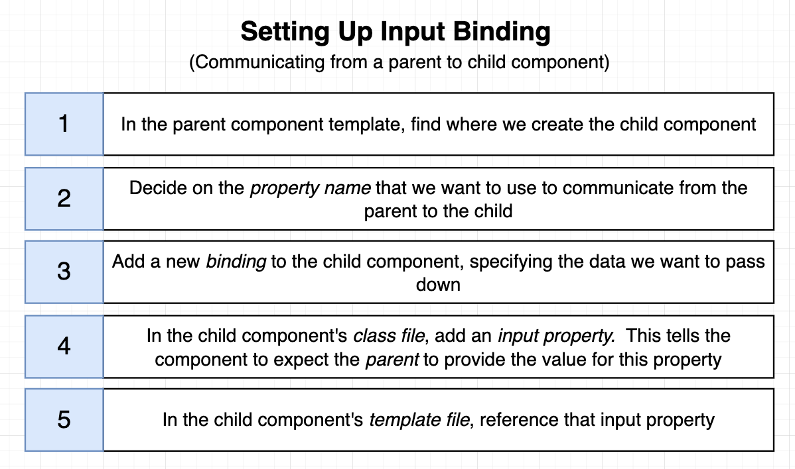

# INDEX

- [INDEX](#index)
  - [Components](#components)
    - [Creating Components](#creating-components)
    - [Component example](#component-example)
    - [Component Selector](#component-selector)
    - [Component properties](#component-properties)
    - [Component Lifecycles](#component-lifecycles)
      - [ngOnInit()](#ngoninit)
      - [ngAfterViewInit()](#ngafterviewinit)
      - [ngOnDestroy()](#ngondestroy)
      - [ngOnChanges()](#ngonchanges)
    - [Presentational vs Smart components](#presentational-vs-smart-components)
  - [Communication between Components](#communication-between-components)
    - [Input \& Output Properties](#input--output-properties)
      - [Input Properties](#input-properties)
      - [Output Properties](#output-properties)
    - [The Mediator Design Pattern](#the-mediator-design-pattern)
      - [Using parent component as a mediator](#using-parent-component-as-a-mediator)
      - [Using an injectable Service as a Mediator](#using-an-injectable-service-as-a-mediator)
    - [Exposing a child component's API to the parent using ViewChild](#exposing-a-child-components-api-to-the-parent-using-viewchild)
    - [Projecting templates at runtime using ng-content](#projecting-templates-at-runtime-using-ng-content)
  - [Data flow between components](#data-flow-between-components)
    - [Parent to Child (Passing data / Input / Props)](#parent-to-child-passing-data--input--props)
    - [Child to Parent (Emitting events / Output)](#child-to-parent-emitting-events--output)
    - [Template variable (Refs)](#template-variable-refs)
    - [Content projection (Slots)](#content-projection-slots)
      - [Single-slot content projection](#single-slot-content-projection)
      - [Multi-slot content projection](#multi-slot-content-projection)
      - [Handling projected content](#handling-projected-content)
  - [Standalone Components (NEW)](#standalone-components-new)
    - [Creating a standalone component](#creating-a-standalone-component)
    - [Using Services in Standalone Components](#using-services-in-standalone-components)

---

## Components

**Components** are just exported `classes` that are decorated with the `@Component` decorator.


A component should present properties and methods for data binding, in order to mediate between the **view (rendered by the template)** and the **application logic (services) (which often includes some notion of a model)**.

- **What does a component consist of?**

  - `Component Metadata` : it's the information that Angular needs to create the component and render it to the DOM, like the `selector`, `template`, and `styles`
  - `Component Template` : it's the view of the component, and contains the HTML that will be rendered to the user
  - `Component Class` : it's the code that supports the view, and contains the properties and methods that the view uses

- **How components work**

  

### Creating Components

- In order to create a component, you can use the `Angular CLI` to generate a new component

  ```sh
  ng generate component <component-name> # or ng g c

  # Ex: creating a component named "nav" in the app folder
  ng generate component nav
  # Ex: creating a sub-component named "nav-item" in the nav folder
  ng generate component nav/nav-item
  ```

  - this will create a folder with the name of the component in the `app` folder
  - the folder will contain 4 files:
    - `component-name.component.html` : the html file for the component
    - `component-name.component.ts` : the typescript file for the component
    - `component-name.component.css` : the css file for the component
    - `component-name.component.spec.ts` : the test file for the component
  - the component will be registered in the `app.module.ts` file automatically, and added to the `declarations` array
  - the component will be added to the `app-routing.module.ts` file automatically

- Instead, you can create a component manually by creating the files and adding the component to the `app.module.ts` file

  ```ts
  // in app.module.ts
  import { NgModule } from '@angular/core';
  import { BrowserModule } from '@angular/platform-browser';

  import { AppComponent } from './app.component';
  import { NavComponent } from './nav/nav.component'; // import the component

  @NgModule({
    declarations: [AppComponent, NavComponent], // add the component to the declarations array ✅
    imports: [BrowserModule], // imported modules go here
    providers: [], // services go here
    bootstrap: [AppComponent] // the main component of the app (only in the AppModule)
  })
  export class AppModule {}
  ```

  ```ts
  // in nav.component.ts
  import { Component } from '@angular/core';

  // @Component is a decorator that tells Angular that this class is a component
  @Component({
    selector: 'app-nav', // the new html tag that will represent this component -> <app-nav></app-nav>
    templateUrl: './nav.component.html',
    styleUrls: ['./nav.component.css'],
    standalone: false // if true, the component can be used without being declared in a module (default is true starting from Angular 19)
  })
  export class NavComponent {}
  ```

---

### Component example

- Component as html element

  ```ts
  // nav.component.ts
  import { Component } from '@angular/core'; // import the Component decorator

  @Component({
    selector: 'app-nav', // the html selector that will be represent this component
    templateUrl: './nav.component.html', // the html file
    styleUrls: ['./nav.component.css']
  })
  export class NavComponent {
    constructor() {} // function that runs when the component is created

    // properties
    title = 'My App';
    links = ['Home', 'About', 'Contact'];

    // methods
    sayHi() {
      console.log('Hi');
    }
  }
  ```

- **Notes:**

  - We can write the `HTML` code directly in the component file using the `template` property instead of using the `templateUrl` property

    ```ts
    @Component({
      template: `<h1>{{ title }}</h1> <ul> <li *ngFor="let link of links">{{ link }}</li> </ul>`,
      // or
      templateUrl: './nav.component.html'
    })
    ```

  - We can write the `CSS` code directly in the component file using the `styles` property instead of using the `styleUrls` property

    ```ts
    @Component({
      styles: [`h1 { color: red; }`],
      // or
      styleUrls: ['./nav.component.css']
    })
    ```

---

### Component Selector

- The `selector` property in the `@Component` decorator defines the custom HTML tag that represents the component.
- This selector can be used in the component's template to include the component itself.

  ```html
  <!-- in app.component.html -->
  <app-nav></app-nav>
  <!-- using the NavComponent here -->
  ```

  - When using the component, you must match the `selector` with the name of the component -> `app-nav`

- **Selector Prefix:**

  - The `selector` property in the `@Component` decorator defines the custom HTML tag for the component. By default, Angular uses the `app-` prefix for selectors in applications and `lib-` for libraries.

  - **Custom Prefix**: You can specify a custom prefix for your components to better identify them. For example, if your project is named `Hello CLI`, you might use the `hello-` prefix.

    ```sh
    ng generate component product --prefix hello
    ```

    - This command generates a component with the selector `hello-product`.

  - **Global Prefix**: To ensure all components use a specific prefix, set it in the `angular.json` file under the `prefix` property.

    ```json
    {
      "projects": {
        "your-project-name": {
          "prefix": "hello"
        }
      }
    }
    ```

  - **Best Practice**: Use prefixes like `app-` or `hello-` to avoid conflicts with native HTML elements. like `app-header` instead of `header`.

- **Selector Types**: You can use different types of selectors:

  - **Tag Selector**: `<app-nav></app-nav>`
  - **Class Selector**: `<div class="app-nav"></div>`
  - **Attribute Selector**: `<div app-nav></div>`

    ```ts
    @Component({
      selector: 'app-nav', // tag selector
      // or
      selector: '.app-nav', // class selector
      // or
      selector: '[app-nav]' // attribute selector
    })
    ```

    ```html
    <!-- tag selector -->
    <app-nav></app-nav>

    <!-- class selector -->
    <div class="app-nav"></div>

    <!-- attribute selector -->
    <div app-nav></div>
    ```

  - Also you can have multiple selectors for the same component by using an array of selectors

    ```ts
    @Component({
      selector: ['app-nav', '.app-nav', '[app-nav]'] // multiple selectors
    })
    ```

---

### Component properties

- **Properties** are variables that are defined in the component class and are used in the component template

- Example:

  ```ts
  // in nav.component.ts
  export class NavComponent {
    title = 'My App';
    links = ['Home', 'About', 'Contact'];
  }
  ```

  ```html
  <!-- in nav.component.html -->
  <h1>{{ title }}</h1>
  <ul>
    <li *ngFor="let link of links">{{ link }}</li>
  </ul>
  ```

- It's declared in the component class using 2 ways:

  - **Class Access Modifiers**: `public`, `private`, `protected`

    ```ts
    public title = 'My App';
    // or title = 'My App';
    ```

  - **Class Constructor Function:** it's a method that runs when the component is created, and it's a good place to initialize properties

    ```ts
    constructor() {
      this.title = 'My App';
    }
    ```

- It's the **state** of the component, and it can be changed by the user or by the component itself
  - It's different from state in React, where we use `useState` hook to manage the state of the component, but in Angular, we just declare the properties in the component class and use them in the template

---

### Component Lifecycles

Angular components have a lifecycle that consists of a series of events that occur from the moment the component is created until it is destroyed. These events are called **lifecycle hooks**, and they allow you to run code at specific points in the component's lifecycle.


- A component instance has a lifecycle that

  - **starts** when Angular instantiates the component class and renders the component view along with its child views.
  - The lifecycle **continues** with "change detection" (reactivity), as Angular checks to see when data-bound properties change, and updates both the view and the component instance as needed.
  - The lifecycle **ends** when Angular destroys the component instance and removes its rendered template from the DOM.

- **Most common lifecycle hooks:**
  

- **Lifecycles:**

  - `constructor` : it's a method that runs when the component is created
  - `ngOnInit` : it's a lifecycle hook that runs after the constructor and after the first `ngOnChanges` (it's a good place to put initialization logic)
  - `ngOnChanges` : it's a lifecycle hook that runs when the input properties of the component change
  - `ngOnDestroy` : it's a lifecycle hook that runs when the component is destroyed (it's a good place to put cleanup logic)
  - `ngAfterViewInit` : it's a lifecycle hook that runs after the view has been initialized (it's a good place to put logic that needs to run after the view has been initialized)
  - `ngAfterViewChecked` : it's a lifecycle hook that runs after the view has been checked (it's a good place to put logic that needs to run after the view has been checked)
  - **Notes:**
    - Don't use the constructor to fetch data from a server or to initialize the component. Use `ngOnInit` instead.
    - Don't use arrow functions when defining methods in a component. Use regular functions instead. (to avoid `this` keyword problems)

- **Note ⚠️:** To be able to use the lifecycle hooks, you need to implement the interface for the hook you want to use in the component class

  > it's optional technically for typescript, but it's a good practice, as it's simply a check for typescript that this component's class has the method for the lifecycle hook

  ```ts
  import { Component, OnInit, OnDestroy } from '@angular/core';

  // ------------------- Works ✅ ------------------------ //
  export class MyComponent implements OnInit, OnDestroy {
    ngOnInit() {
      // ...
    }

    ngOnDestroy() {
      // ...
    }
  }

  // ------------------- Also works ✅ ------------------------ //
  export class MyComponent {
    ngOnInit() {
      // ...
    }

    ngOnDestroy() {
      // ...
    }
  }
  ```

- **⚠️ Note:** It's better to import the`OnInit` interface from `@angular/core` package, so that you can use them in the component class to implement the lifecycle hooks, but it's not mandatory. You can just define the methods in the component class without implementing the interface. But it's a good practice to implement the interface to make it clear that the component has lifecycle hooks and to avoid typos in the method names.

  ```ts
  import { Component, OnInit } from '@angular/core';

  export class MyComponent implements OnInit {
    ngOnInit() {
      // ...
    }
  }
  ```

- Why use `ngOnInit` instead of `constructor`?

  - The `ngOnInit` hook is called after the component is initialized, and **all the component's input properties are set**. This is unlike `constructor`, which is called before the component is initialized and before the input properties are set.
  - So, if you need to access the input properties of the component, you should use `ngOnInit` instead of `constructor`.

- **Useful Links:**

  - [lifecycle hooks guide](https://angular.io/guide/lifecycle-hooks)
  - [lifecycle events sequence](https://angular.io/guide/lifecycle-hooks#sequence-and-frequency-of-all-lifecycle-events)

---

#### ngOnInit()

- It's a callback method that is invoked immediately after the default change detector has checked the directive's data-bound properties for the first time, and before any of the view or content children have been checked. It is invoked only once when the directive is instantiated.
- it can be called normally or using an `interface`

```ts
import { Component, OnInit } from '@angular/core';

class MyComponent implements OnInit {
  ngOnInit() {
    // ...
  }
}
```

- **Difference between `Constructor` and `ngOnInit`**

  - The `Constructor` is a default method of the class that is executed when the class is instantiated and ensures proper initialization of fields in the class and its subclasses.
  - `ngOnInit` is a life cycle hook called by Angular to indicate that Angular is done creating the component (data is passed between components).
  - Mostly we use `ngOnInit` for all the initialization/declaration and avoid stuff to work in the constructor. The `constructor` should only be used to initialize class members but shouldn't do actual "work".

#### ngAfterViewInit()

- It's a callback method that is invoked after the component's view and its child views have been initialized. It is invoked only once when the directive is instantiated.
- It's used to perform any additional initialization tasks that require access to the component's view or its child views, such as **querying for elements in the view or setting up Intersection Observers**.

  ```ts
  import { Component, AfterViewInit } from '@angular/core';

  class MyComponent implements AfterViewInit {
    @ViewChild('childElement') childElementRef: ElementRef;

    ngAfterViewInit() {
      // This method is called after the view is initialized
      console.log('View has been initialized');

      // Example: Accessing a child element using ViewChild
      const childElement = this.childElementRef.nativeElement;

      // Example: Setting intersection observer on the child element
      const observer = new IntersectionObserver(entries => {
        entries.forEach(entry => {
          if (entry.isIntersecting) {
            console.log('Child element is in view');
          }
        });
      });
      observer.observe(childElement);
    }
  }
  ```

#### ngOnDestroy()

- It's a callback method that performs `cleanup` right before Angular destroys the directive/component. Use `ngOnDestroy` for `cleanup` logic, `subscriptions`, `listeners`, etc.

  ```ts
  ngOnDestroy() {
    // ...
  }
  ```

- It's common to use it to unsubscribe from `Observables` or `EventEmitters` **to prevent memory leaks, or to remove event listeners** that were added in the component.

  ```ts
  import { Component, OnDestroy } from '@angular/core';
  import { Subscription } from 'rxjs';

  class MyComponent implements OnDestroy {
    private subscription: Subscription;

    constructor() {
      // Subscribe to an observable
      this.subscription = someObservable.subscribe(data => {
        // Handle data
      });
    }

    ngOnDestroy() {
      // Unsubscribe to prevent memory leaks
      this.subscription.unsubscribe();
    }
  }
  ```

- `destroyRef`

  - It's a reference to the component instance that is being destroyed, and it can be used to perform cleanup logic before the component is destroyed.

  ```ts
  import { Component, inject } from '@angular/core';
  import { DestroyRef } from '@angular/core';
  import { Subscription } from 'rxjs';

  class MyComponent {
    private destroyRef = inject(DestroyRef);
    private subscription: Subscription;

    constructor() {
      // Subscribe to an observable
      this.subscription = someObservable.subscribe(data => {
        // Handle data
      });

      this.destroyRef.onDestroy(() => {
        // Cleanup logic before the component is destroyed
        console.log('Component is being destroyed');
      });
    }
  }
  ```

#### ngOnChanges()

It's a callback method that is invoked whenever one or more data-bound input properties change. It receives a `SimpleChanges` object that contains the current and previous values of the changed properties.

```ts
import { Component, OnChanges, SimpleChanges } from '@angular/core';

class MyComponent implements OnChanges {
  // Input properties
  @Input() someProperty: string;

  ngOnChanges(changes: SimpleChanges) {
    // Handle changes to input properties
    console.log('Changes:', changes);
  }
}
```

- The value of the `changes` object is a map of the changed properties, where the key is the name of the property and the value is an object that contains the current and previous values of the property.
  

- **⚠️ Notes:**
  - `ngOnChanges` is called before `ngOnInit`, so if you need to access the input properties of the component, you should use `ngOnChanges` instead of `ngOnInit`.
  - `ngOnChanges` is called whenever the input properties of the component change, so you can use it to react to changes in the input properties and update the component accordingly.
  - **it's called a lot of times, so you should avoid doing heavy computations in it**.

---

### Presentational vs Smart components

- **Presentational components**: are responsible for only displaying data, without knowing where the data comes from. They receive the data via an `@Input()`, and return modified data through `@Output()` events

- **Smart components**: are responsible for interacting with the service layer and retrieving the data, which then they pass to presentational components. They are also responsible for handling the `events` emitted by the presentational components.

---

## Communication between Components

> This section is similar to the [Data Binding section in Angular Notes](./1-Angular.md#data-binding), but here we will focus on the communication between components specifically.

Components will usually have relationships with other components, and they will need to communicate with each other to share data and functionality.

- The relationships between components can be classified into 3 types:

  - **Parent-Child**: where one component is the parent of another component. The parent component can pass data to the child component via `@Input()` properties, and the child component can emit events to the parent component via `@Output()` properties.
  - **Sibling-Sibling**: where two components are siblings, meaning they share the same parent component. Sibling components can communicate with each other via the parent component, by passing data and events through the parent component.
  - **Unrelated Components**: where two components are not related to each other in any way. Unrelated components can communicate with each other via services, which can be used to share data and functionality between components.

- Components can communicate with each other in several ways:

  - **Input and Output properties**: using `@Input()` and `@Output()` decorators to pass data between parent and child components.
  - **ViewChild and ContentChild**: using `@ViewChild()` and `@ContentChild()` decorators to access child components or elements in the template.
  - **Services**: using services to share data between components that are not directly related.
  - **Event Emitters**: using `EventEmitter` to emit events from child components to parent components.

---

### Input & Output Properties

#### Input Properties

**Input properties** are used to pass data from a parent component to a child component.

- To create an input property, you need to use the `@Input()` decorator from the `@angular/core` package.

  ```ts
  // 📄 Child Component
  import { Component, Input } from '@angular/core';

  @Component({
    selector: 'app-child',
    template: `
      <h1>{{ title }}</h1>
    `
  })
  export class ChildComponent {
    @Input() title: string; // input property
  }
  ```

- To use the input property in the parent component, you need to bind the property to the child component using property binding syntax `[]`.

  ```ts
  // 📄 Parent Component
  import { Component } from '@angular/core';
  import { ChildComponent } from './child.component';
  @Component({
    selector: 'app-parent',
    template: `
      <app-child [title]="parentTitle"></app-child>
    `
  })
  export class ParentComponent {
    parentTitle = 'Hello from Parent Component'; // parent property
  }
  ```

- If we want to intercept the value being passed to the input property, we can use a setter method, so we can manipulate the value before assigning it to the property.

  ```ts
  // 📄 Child Component
  import { Component, Input } from '@angular/core';

  @Component({
    selector: 'app-child',
    template: `
      <h1>{{ title }}</h1>
    `
  })
  export class ChildComponent {
    private _title: string;

    @Input()
    set title(value: string) {
      this._title = value.toUpperCase(); // intercepting the value
    }

    get title(): string {
      return this._title;
    }
  }
  ```

  - ⚠️ Don't forget to also create a `getter` for the property to be able to access it in the template.
  - It's useful when you want to perform some logic before assigning the value to the property, like formatting the value or validating it, or checking if the value is valid or defined before assigning it to the property.

---

#### Output Properties

**Output properties** are used to emit events from a child component to a parent component.

- To create an output property, you need to use the `@Output()` decorator from the `@angular/core` package, and you also need to create an instance of the `EventEmitter` class.

  ```ts
  // 📄 Child Component
  import { Component, Output, EventEmitter } from '@angular/core';

  @Component({
    selector: 'app-child',
    template: `
      <button (click)="sendMessage()">Send Message</button>
    `
  })
  export class ChildComponent {
    @Output() messageEvent = new EventEmitter<string>(); // output property

    sendMessage() {
      this.messageEvent.emit('Hello from Child Component'); // emitting event
    }
  }
  ```

  - It's a good practice to specify the type of data that will be emitted by the `EventEmitter`, in this case, it's a `string`. This is because the `EventEmitter` is a generic class that can emit any type of data, so specifying the type helps to ensure type safety and makes it easier to understand the code.

- To use the output property in the parent component, you need to bind the property to the child component using event binding syntax `()`.

  ```ts
  // 📄 Parent Component
  import { Component } from '@angular/core';
  import { ChildComponent } from './child.component';

  @Component({
    selector: 'app-parent',
    template: `
      <app-child (messageEvent)="receiveMessage($event)"></app-child>
      <p>{{ message }}</p>
    `
  })
  export class ParentComponent {
    message: string;

    receiveMessage(msg: string) {
      this.message = msg; // receiving event
    }
  }
  ```

- When using the output property in the parent component, you can access the emitted data using the `$event` variable, which contains the data emitted by the `EventEmitter`.

- Also, Don't worry about **"Event Bubbling"** here, because Angular handles event bubbling automatically for you, so you don't need to worry about it when using output properties.

  - If "event bubbling" is important for your use case, you can always implement it manually using services or other techniques like: (`RxJS Subjects` or native DOM events).

    ```ts
    @Component({
      selector: 'app-child',
      template: `
        <button (click)="sendMessage()">Send Message</button>
      `
    })
    export class ChildComponent {
      constructor(element: ElementRef) {
        element.nativeElement.addEventListener('click', event => {
          // Manually handle event bubbling
          const customEvent = new CustomEvent('customClick', {
            bubbles: true,
            detail: 'Hello from Child Component'
          });
          element.nativeElement.dispatchEvent(customEvent);
        });
      }
    }
    ```

---

### The Mediator Design Pattern

Communication between loosely coupled components can be implemented using **the Mediator design pattern**, which, according to Wikipedia, “defines how a set of objects interact”

> The **Mediator Design Pattern** is a behavioral design pattern that defines an object that encapsulates how a set of objects interact. This pattern promotes loose coupling by keeping objects from referring to each other explicitly, and it allows their interaction to be varied independently.
> 

- In Angular, this pattern can be implemented in several ways, like:
  - using a mediator parent component.
  - using `Services` with `RxJS Subjects`
  - using a dedicated `Mediator Service`.
  - using `NgRx` or other state management libraries.

#### Using parent component as a mediator

In this example, we have a `AppComponent` that acts as a mediator between two child components: `ChildAComponent` and `ChildBComponent`. The `AppComponent` will handle the communication between the two child components.


```ts
// 📄 app.component.ts (Mediator Parent Component)
import { Component } from '@angular/core';
import { ChildAComponent } from './child-a.component';
import { ChildBComponent } from './child-b.component';

@Component({
  selector: 'app-root',
  template: `
    <app-child-a (messageEvent)="receiveMessage($event)"></app-child-a>
    <app-child-b [message]="messageFromA"></app-child-b>
  `
})
export class AppComponent {
  messageFromA: string;

  receiveMessage(msg: string) {
    this.messageFromA = msg; // receiving event from ChildAComponent
  }
}
```

```ts
// 📄 child-a.component.ts
import { Component, Output, EventEmitter } from '@angular/core';

@Component({
  selector: 'app-child-a',
  template: `
    <button (click)="sendMessage()">Send Message to Child B</button>
  `
})
export class ChildAComponent {
  @Output() messageEvent = new EventEmitter<string>();
  sendMessage() {
    this.messageEvent.emit('Hello from Child A Component');
  }
}
```

```ts
// 📄 child-b.component.ts
import { Component, Input } from '@angular/core';

@Component({
  selector: 'app-child-b',
  template: `
    <h1>{{ message }}</h1>
  `
})
export class ChildBComponent {
  @Input() message: string;
}
```

---

#### Using an injectable Service as a Mediator

Here, we can use an injectable service as a mediator between two components. The service will handle the communication between the components using `RxJS Subjects`.

- Whenever the component is created, the mediator service is injected, and the component can subscribe to events emitted by the service (as opposed to using `@Input()` parameters).
- This is used when the components are not directly related (not parent-child or siblings or have the same parent), and they need to communicate with each other.

In this example, we have a `MediatorService` that acts as a mediator between two components: `ComponentA` and `ComponentB`. The `MediatorService` will handle the communication between the two components using `RxJS Subjects`.


```ts
// 📄 mediator.service.ts
import { Injectable } from '@angular/core';
import { Subject } from 'rxjs';

@Injectable({
  providedIn: 'root'
})
export class MediatorService {
  private messageSubject = new Subject<string>();
  // or we can use BehaviorSubject if we want to have an initial value + the last emitted value
  // private messageSubject = new BehaviorSubject<string>('Initial Message');

  message$ = this.messageSubject.asObservable();

  sendMessage(message: string) {
    this.messageSubject.next(message);
  }
}
```

```ts
// 📄 component-a.ts
import { Component } from '@angular/core';
import { MediatorService } from './mediator.service';

@Component({
  selector: 'app-component-a',
  template: `
    <button (click)="sendMessage()">Send Message to Component B</button>
  `
})
export class ComponentA {
  constructor(private mediatorService: MediatorService) {}

  sendMessage() {
    this.mediatorService.sendMessage('Hello from Component A');
  }
}
```

```ts
// 📄 component-b.ts
import { Component, OnInit } from '@angular/core';
import { MediatorService } from './mediator.service';

@Component({
  selector: 'app-component-b',
  template: `
    <h1>{{ message }}</h1>
  `
})
export class ComponentB implements OnInit {
  message: string;
  constructor(private mediatorService: MediatorService) {}
  ngOnInit() {
    this.mediatorService.message$.subscribe(msg => {
      this.message = msg; // receiving message from Component A
    });
  }
}
```

- It's important to subscribe to the observable in the `ngOnInit` lifecycle hook to ensure that the component is fully initialized before receiving messages.
- Also, don't forget to unsubscribe from the observable in the `ngOnDestroy` lifecycle hook to prevent memory leaks.
- You can also use `BehaviorSubject` instead of `Subject` if you want to have an initial value and the last emitted value.
  - The `BehaviorSubject` requires an initial value when created, and it will always emit the last emitted value to new subscribers. **so even if `ComponentB` subscribes to the observable after `ComponentA` has sent a message, it will still receive the last emitted message**.
  - This is useful when you want to ensure that the component always has a value to display, even if it subscribes to the observable after the message has been sent.
  - in this case the `ReplaySubject` can also be used, which is similar to `BehaviorSubject`, but it can store a buffer of the last `n` emitted values.

---

### Exposing a child component's API to the parent using ViewChild

Another way for communication between parent and child components is by using the `@ViewChild()` decorator. This allows the parent component to access the child component's properties and methods directly.

- It works by querying the child component from the parent component's template, and then accessing the child component's instance in the parent component's class.
- This is useful when you want to call a method or access a property of the child component from the parent component.

In this example, we have a `ChildComponent` that has a method called `greet()`. The `ParentComponent` uses the `@ViewChild()` decorator to access the `ChildComponent` instance and call the `greet()` method.


```ts
// 📄 child.component.ts
import { Component } from '@angular/core';

@Component({
  selector: 'app-child',
  template: `
    <h1>Child Component</h1>
  `
})
export class ChildComponent {
  greet() {
    return 'Hello from Child Component';
  }
}
```

```ts
// 📄 parent.component.ts
import { Component, AfterViewInit, ViewChild } from '@angular/core';
import { ChildComponent } from './child.component';

@Component({
  selector: 'app-parent',
  template: `
    <app-child></app-child>
    <button (click)="callGreet()">Call Greet Method</button>
    <p>{{ message }}</p>
  `
})
export class ParentComponent implements AfterViewInit {
  @ViewChild(ChildComponent) childComponent: ChildComponent;
  message: string;

  ngAfterViewInit() {
    this.message = this.childComponent.greet();
  }

  callGreet() {
    this.message = this.childComponent.greet();
  }
}
```

- In this example, the `ParentComponent` uses the `@ViewChild()` decorator to query the `ChildComponent` instance. The `greet()` method of the `ChildComponent` is called in the `ngAfterViewInit()` lifecycle hook to ensure that the child component is fully initialized before accessing its properties and methods.
  - If you try to access the child component in the `ngOnInit()` lifecycle hook, it will be `undefined` because the child component is not yet initialized at that point.
  - **So it's important to use `ngAfterViewInit()` when using `@ViewChild()` to access child components.**

---

### Projecting templates at runtime using ng-content

**Content Projection** is a powerful feature in Angular that allows you to insert dynamic content into a component's template at runtime. This is done using the `<ng-content>` directive, which acts as a placeholder for the projected content.

- Using `<ng-content>`, you can create reusable components that can accept different content from their parent components, making them more flexible and adaptable to various use cases.

> Check [Content Projection section](#content-projection-slots) and come back here for more details and examples.

In this example, we have a `CardComponent` that uses `<ng-content>` to project content from its parent component.


```ts
// 📄 card.component.ts
import { Component } from '@angular/core';

@Component({
  selector: 'app-card',
  template: `
    <div class="card">
      <ng-content></ng-content>
      <!-- Placeholder for projected content -->
    </div>
  `
})
export class CardComponent {}
```

```ts
// 📄 parent.component.ts
import { Component } from '@angular/core';
import { CardComponent } from './card.component';

@Component({
  selector: 'app-parent',
  template: `
    <app-card>
      <h2>Card Title</h2>
      <p>This is some content inside the card.</p>
    </app-card>
  `
})
export class ParentComponent {}
```

- In this example, the `CardComponent` defines a `<ng-content>` directive in its template, which acts as a placeholder for the content projected from the `ParentComponent`. When the `ParentComponent` uses the `CardComponent`, it can insert any content between the opening and closing tags of the `app-card` component, and that content will be rendered inside the card.

---

## Data flow between components


---

### Parent to Child (Passing data / Input / Props)

The parent component can pass data to the child component using `@Input()` decorator, and the child component can receive the data using property binding.



- data (props) are passed using `property binding` in the parent component
- we need to use `@Input()` decorator in the child component to receive the data (tell the child component that it will receive data from the parent component)

- Example

  ```ts
  // in hero-child.component.ts
  import { Component, Input } from '@angular/core';

  import { Hero } from './hero';

  @Component({
    selector: 'app-hero-child',
    template: `
      <h3>{{ hero.name }} says:</h3>
      <p>I, {{ hero.name }}, am at your service, {{ masterName }}.</p>
    `
  })
  export class HeroChildComponent {
    @Input() hero!: Hero; // "!" means that it's a required property
    @Input('master') masterName = ''; // here we use an "alias" so that in the parent component we use the alias not the othername(masterName)
  }
  ```

  ```ts
  // in hero-parent.component.ts
  import { Component } from '@angular/core';

  @Component({
    selector: 'app-hero-parent',
    template: `
      <h2>{{ master }} controls {{ heroes.length }} heroes</h2>

      <app-hero-child *ngFor="let hero of heroes" [hero]="hero" [master]="master"></app-hero-child>
    `
  })
  export class HeroParentComponent {
    heroes = [{ name: 'Dr IQ' }, { name: 'Magneta' }, { name: 'Bombasto' }];
    master = 'Master';
  }
  ```

- To have an **alias** for the input property, you can use the `@Input('alias')` decorator

  ```ts
  @Input('master') masterName = '';
  ```

  - here we use an alias(`"master"`) so that in the parent component we use the alias not the other name (`"masterName"`), but in the child component we use the other name (`"masterName"`)

- **To make a prop required**, you should:

  - 1️⃣ use the `!` operator after the property name (To tell TypeScript that this property will be initialized later, and it will not be `undefined`)
  - 2️⃣ use the `@Input({ required: true })` decorator

    ```ts
    @Input({ required: true }) hero!: Hero;
    ```

---

### Child to Parent (Emitting events / Output)

- To emit an event from a child component to a parent component, you can use the `@Output()` decorator

  ```ts
  // in child.component.ts
  import { Component, Output, EventEmitter } from '@angular/core';

  @Component({
    selector: 'app-child',
    template: `
      <button (click)="sayHi()">Click me</button>
    `
  })
  export class ChildComponent {
    @Output() myEvent = new EventEmitter<string>(); // event will be emitted with a string as an argument and the name of the event is "myEvent"

    sayHi() {
      this.myEvent.emit('Hello');
    }
  }
  ```

  ```html
  <!-- in parent.component.html -->
  <app-child (myEvent)="onMyEvent($event)"></app-child>
  ```

  ```ts
  // in parent.component.ts
  onMyEvent(event: string) {
    console.log(event);
  }
  ```

  - The `@Output()` decorator is used to emit events from a child component to a parent component
  - The `EventEmitter` class is used to emit events
  - The `emit()` method is used to emit an event with a value
  - The event name should be the same in the parent component as the name of the event in the child component

- **Notes:**

  - Make sure to handle **event bubbling** and **event propagation** in the parent component by using the `$event` object and the `stopPropagation()` method

    ```html
    <button (click)="sayHi(); $event.stopPropagation()">Click me</button>
    ```

  - When you know the type of value that will be emitted, you can specify the type of the `EventEmitter` in the `@Output()` decorator using TypeScript generics `<T>`:

    ```ts
    @Output() myEvent = new EventEmitter<string>(); // here we specify that the event will emit a string value
    ```

---

### Template variable (Refs)

It's a way to reference an element in the template so that you can access it in the template or in the component class.

- it starts with `#`

- to access it:

  - in the template:

    ```html
    <input #nameInput />

    <button (click)="fun(nameInput.value)"></button>
    ```

  - in the component class, you can use the `@ViewChild` decorator to get a reference to the element

    ```ts
    @ViewChild('nameInput') nameInput:ElementRef;
    ```

    > If you want to use signals, you can use `signal()` function to create a signal that holds the value of the input element

- To select multiple elements, you can use the `@ViewChildren` decorator

  ```ts
  @ViewChildren('nameInput') nameInputs: QueryList<ElementRef>;
  ```

- To access content-projected (slots) elements, you can use the `@ContentChild` decorator

  ```html
  <!-- parent -->
  <child-component>
    <input #nameInput />
  </child-component>
  ```

  ```html
  <!-- child -->
  <ng-content></ng-content>
  ```

  ```ts
  @ContentChild('nameInput') nameInput: ElementRef;
  ```

- **Use cases:**

  - To access the value of an input elements in a form instead of using `ngModel`

    ```html
    <form (submit)="submit(nameInput.value)">
      <input #nameInput />
      <button type="submit">Submit</button>
    </form>
    ```

    ```ts
    submit(name: string) {
      console.log(name);
    }
    ```

---

### Content projection (Slots)

**Content projection** is a pattern in which you `insert, or project`, the content you want to use inside another component.

> This pattern is used as a replacement for using `properties/props` to pass data from a parent component to a child component and add special handling for the content based on the `properties/props`.
>
> Also, it's used when you want to pass content to a component and want to keep the outer/wrapper component clean and have fixed styles or behavior.

- This is done using the `<ng-content>` element in the child component
  
  - **`<ng-content>` is a placeholder for the content that will be projected into the component**

#### Single-slot content projection

```html
<!-- child -->
<h2>Single-slot content projection</h2>
<ng-content></ng-content>

<!-------------------------------------------->

<!-- parent -->
<child-component>
  <p>the projected content</p>
</child-component>
```

---

#### Multi-slot content projection

- A component can have multiple slots. Each slot can specify a CSS selector that determines which content goes into that slot. This pattern is referred to as multi-slot content projection. With this pattern, you must specify where you want the projected content to appear. You accomplish this task by using the `select` attribute of `<ng-content>`.

  ```html
  <!-- child -->
  <h2>Multi-slot content projection</h2>
  <ng-content select=".header"></ng-content>
  <ng-content select="[mainContent]"></ng-content>
  <ng-content select="#footer"></ng-content>
  <ng-content></ng-content>
  ```

  ```html
  <!-- parent -->
  <child-component>
    <p class="header">Header content</p>
    <p mainContent>Main content</p>
    <p id="footer">Footer content</p>
  </child-component>
  ```

- Here, the `header` content will be projected into the first slot, and the `footer` content will be projected into the second slot.
- The `select` attribute of `<ng-content>` is used to specify the CSS selector that determines which content goes into that slot.
  - It can select by any selector type: `class`, `id`, `element name`, `attribute`, etc.
- The `<ng-content>` element without the `select` attribute is the **default slot**, and it will project any content that doesn't match the other slots.

---

#### Handling projected content

- Sometimes, you may want to show/hide a wrapper element that contains `<ng-content>`, based on if there's any projected content or not.

  - To do so we may:

    - 1️⃣ use `@ContentChild` decorator to check if there's any projected content or not, and `*ngIf` to show/hide the wrapper element

      ```ts
      @ContentChild('projectedContent') projectedContent!: ElementRef;
      ```

      ```html
      <div *ngIf="projectedContent">
        <ng-content></ng-content>
      </div>
      ```

    - 2️⃣ use `:empty` CSS pseudo-class to style the wrapper element based on if there's any projected content or not

      ```html
      <div class="wrapper">
        <ng-content></ng-content>
      </div>
      ```

      ```css
      .wrapper:empty {
        display: none;
      }
      ```

---

## Standalone Components (NEW)

It's a new feature in Angular that allows you to create components **without the need for a module**. This means that you can create a component and use it directly in your application without having to create a module for it.

> Before **Angular 14**, every component had to be declared in a module, which made the codebase more complex and harder to manage. With standalone components, you can create components that are self-contained and can be used directly in your application without the need for a module.
>
> Now, Standalone components are the recommended way to create components in Angular, as they simplify the codebase and make it easier to manage and maintain the code.
>
> Note: You can still use **modules** in Angular, and **you can mix standalone components with modules** in your application. However, it's recommended to use standalone components for new components that you create in your application.

- **Benefits of standalone components**
  - **Simplified Structure**: Standalone components reduce the need for modules, making the codebase simpler and easier to understand.
  - **Improved Performance**: They can lead to better performance by reducing the overhead of module loading.
  - **Easier Testing**: Standalone components can be tested in isolation without the need for a module context.
  - **Flexibility**: They allow for more flexible component usage across different parts of the application without being tied to a specific module.
- **Limitations**
  - Standalone components are still a relatively new feature, and some advanced use cases may require modules (e.g., complex dependency injection scenarios).
  - Not all Angular features are compatible with standalone components, so it's important to check the documentation for any limitations.
- **Conclusion**
  - Standalone components are a powerful feature in Angular that allows you to create components without the need for a module, making the codebase simpler and easier to understand.
  - They can be used directly in other components or modules, and they can be tested in isolation without the need for a module context.
  - However, they are still a relatively new feature, and some advanced use cases may require modules.

---

### Creating a standalone component

- **Creating a standalone component**

  - To create a standalone component, use the `--standalone` flag with the `ng generate component` command

    ```bash
    ng g c my-component --standalone
    ```

  - This will create a new component in the `my-component` folder and add the `standalone: true` property to the component decorator

    ```ts
    // my-component.component.ts
    import { Component } from '@angular/core';

    @Component({
      selector: 'app-my-component',
      templateUrl: './my-component.component.html',
      styleUrls: ['./my-component.component.css'],
      standalone: true // this makes the component standalone
    })
    export class MyComponentComponent {
      // component logic
    }
    ```

    - It's identical to the regular angular component but with the `standalone: true` property.
    - When using a standalone component, **you don't need to declare it in a module 🎉🥳** as it is self-contained.
    - To use it now, you can import it directly into another component or module without the need for a module.

- **Using a standalone component**

  - To use a standalone component, you can import it directly into another component or module without the need for a module
  - It will be imported in the `imports` array of the component/module decorator

    ```ts
    // app.component.ts
    import { Component } from '@angular/core';
    import { MyComponentComponent } from './my-component/my-component.component';

    @Component({
      selector: 'app-root',
      template: `
        <app-my-component></app-my-component>
      `, // use the standalone component here
      imports: [MyComponentComponent] // 👈 import the standalone component here
    })
    export class AppComponent {
      // component logic
    }
    ```

  - In order to use comopnents in the template of a standalone component, you need to import them in the `imports` array of the component decorator. This is similar to how you would import modules in a module file. Also you can import `modules` in the `imports` array of the component decorator, which allows you to use the directives and pipes provided by those modules in the template of the standalone component.

- Notes:

  - You can import other `components/modules` in the standalone component's `imports` array.

---

### Using Services in Standalone Components

- To use a service in a standalone component, you can inject it directly into the component's constructor, just like you would in a regular component.

  ```ts
  // my-component.component.ts
  import { Component } from '@angular/core';
  import { MyService } from '../my-service.service';

  @Component({
    selector: 'app-my-component',
    templateUrl: './my-component.component.html',
    styleUrls: ['./my-component.component.css'],
    standalone: true
  })
  export class MyComponentComponent {
    constructor(private myService: MyService) {
      // use the service
    }
  }
  ```

````

- You also need to provide the service in the `providers` array of the component decorator.

  ```ts
  // my-component.component.ts
  import { Component } from '@angular/core';
  import { MyService } from '../my-service.service';

  @Component({
    selector: 'app-my-component',
    templateUrl: './my-component.component.html',
    styleUrls: ['./my-component.component.css'],
    standalone: true,
    providers: [MyService] // provide the service here
  })
  export class MyComponentComponent {
    constructor(private myService: MyService) {
      // use the service
    }
  }
  ```

  - The difference here when providing a service in a standalone component is that the service is scoped to the component itself, rather than a module. This means that **the service instance will be unique to the component and its children**, allowing for more granular control over service instances.
    - This will cancel the shared instance behavior that is typical in Angular services.

- This way, the service will be available for injection in the standalone component.

---

### Routing with Standalone Components

See this section: [Adding Routing to an Angular App](./4-Angular-Router.md#adding-routing-to-an-angular-app)
````
