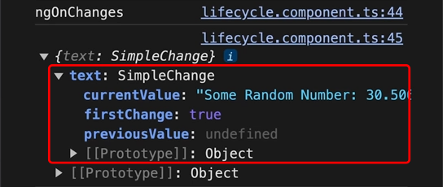

# INDEX

- [INDEX](#index)
  - [Components](#components)
    - [Creating Components](#creating-components)
    - [Component example](#component-example)
    - [Component properties](#component-properties)
    - [Component Lifecycles](#component-lifecycles)
      - [ngOnInit()](#ngoninit)
      - [ngAfterViewInit()](#ngafterviewinit)
      - [ngOnDestroy()](#ngondestroy)
      - [ngOnChanges()](#ngonchanges)
    - [Presentational vs Smart components](#presentational-vs-smart-components)
  - [Standalone Components (NEW)](#standalone-components-new)
    - [Creating a standalone component](#creating-a-standalone-component)
    - [Using Services in Standalone Components](#using-services-in-standalone-components)
    - [Routing with Standalone Components](#routing-with-standalone-components)

---

## Components

**Components** are just exported `classes` that are decorated with the `@Component` decorator.


A component should present properties and methods for data binding, in order to mediate between the **view (rendered by the template)** and the **application logic (services) (which often includes some notion of a model)**.

- **What does a component consist of?**

  - `Component Metadata` : it's the information that Angular needs to create the component and render it to the DOM, like the `selector`, `template`, and `styles`
  - `Component Template` : it's the view of the component, and contains the HTML that will be rendered to the user
  - `Component Class` : it's the code that supports the view, and contains the properties and methods that the view uses

- **How components work**

  

### Creating Components

- In order to create a component, you can use the `Angular CLI` to generate a new component

  ```sh
  ng generate component <component-name> # or ng g c

  # Ex: creating a component named "nav" in the app folder
  ng generate component nav
  # Ex: creating a sub-component named "nav-item" in the nav folder
  ng generate component nav/nav-item
  ```

  - this will create a folder with the name of the component in the `app` folder
  - the folder will contain 4 files:
    - `component-name.component.html` : the html file for the component
    - `component-name.component.ts` : the typescript file for the component
    - `component-name.component.css` : the css file for the component
    - `component-name.component.spec.ts` : the test file for the component
  - the component will be registered in the `app.module.ts` file automatically, and added to the `declarations` array
  - the component will be added to the `app-routing.module.ts` file automatically

- Instead, you can create a component manually by creating the files and adding the component to the `app.module.ts` file

  ```ts
  // in app.module.ts
  import { NgModule } from '@angular/core';
  import { BrowserModule } from '@angular/platform-browser';

  import { AppComponent } from './app.component';
  import { NavComponent } from './nav/nav.component'; // import the component

  @NgModule({
    declarations: [AppComponent, NavComponent], // add the component to the declarations array ✅
    imports: [BrowserModule], // imported modules go here
    providers: [], // services go here
    bootstrap: [AppComponent] // the main component of the app (only in the AppModule)
  })
  export class AppModule {}
  ```

  ```ts
  // in nav.component.ts
  import { Component } from '@angular/core';

  // @Component is a decorator that tells Angular that this class is a component
  @Component({
    selector: 'app-nav', // the new html tag that will represent this component -> <app-nav></app-nav>
    templateUrl: './nav.component.html',
    styleUrls: ['./nav.component.css'],
    standalone: false // if true, the component can be used without being declared in a module (default is true starting from Angular 19)
  })
  export class NavComponent {}
  ```

---

### Component example

- Component as html element

  ```ts
  // nav.component.ts
  import { Component } from '@angular/core'; // import the Component decorator

  @Component({
    selector: 'app-nav', // the html selector that will be represent this component
    templateUrl: './nav.component.html', // the html file
    styleUrls: ['./nav.component.css']
  })
  export class NavComponent {
    constructor() {} // function that runs when the component is created

    // properties
    title = 'My App';
    links = ['Home', 'About', 'Contact'];

    // methods
    sayHi() {
      console.log('Hi');
    }
  }
  ```

- now in `"nav.component.html"` you can use this component like an html element or as a `directive`

  ```html
  <app-nav></app-nav>

  <!-- or as a directive -->
  <div app-nav></div>
  ```

  - When using the component, you must match the `selector` with the name of the component -> `app-nav`
  - It's a good practice to use the `app-` prefix for the component selector to avoid conflicts with native HTML elements, ex: `app-header` instead of `header` which will conflict with the native HTML `<header>` element
  - we can also overwrite the `selector` to be any type of selector like `class` or `attribute` selector (also you can use combinators like `tag.class` or `tag[attribute]`)

    ```ts
    @Component({
      selector: '.app-nav', // class selector
      // or
      selector: '[app-nav]' // attribute selector
    })
    ```

    ```html
    <!-- class selector -->
    <div class="app-nav"></div>
    <!-- attribute selector -->
    <div app-nav></div>
    ```

  - Also you can have multiple selectors for the same component by using an array of selectors

    ```ts
    @Component({
      selector: ['app-nav', '.app-nav', '[app-nav]'] // multiple selectors
    })
    ```

- **Notes:**

  - We can write the `HTML` code directly in the component file using the `template` property instead of using the `templateUrl` property

    ```ts
    @Component({
      template: `<h1>{{ title }}</h1> <ul> <li *ngFor="let link of links">{{ link }}</li> </ul>`,
      // or
      templateUrl: './nav.component.html'
    })
    ```

  - We can write the `CSS` code directly in the component file using the `styles` property instead of using the `styleUrls` property

    ```ts
    @Component({
      styles: [`h1 { color: red; }`],
      // or
      styleUrls: ['./nav.component.css']
    })
    ```

  - We can use the `selector` property to be any type of selector like `tag`, `class`, or `attribute`

    ```ts
    selector: 'app-nav'; // element tag selector
    selector: '.app-nav'; // class selector
    selector: '[app-nav]'; // attribute selector
    ```

    ```html
    <!-- element tag selector -->
    <app-nav></app-nav>
    <!-- class selector -->
    <div class="app-nav"></div>
    <!-- attribute selector -->
    <div app-nav></div>
    ```

---

### Component properties

- **Properties** are variables that are defined in the component class and are used in the component template

- Example:

  ```ts
  // in nav.component.ts
  export class NavComponent {
    title = 'My App';
    links = ['Home', 'About', 'Contact'];
  }
  ```

  ```html
  <!-- in nav.component.html -->
  <h1>{{ title }}</h1>
  <ul>
    <li *ngFor="let link of links">{{ link }}</li>
  </ul>
  ```

- It's declared in the component class using 2 ways:

  - **Class Access Modifiers**: `public`, `private`, `protected`

    ```ts
    public title = 'My App';
    // or title = 'My App';
    ```

  - **Class Constructor Function:** it's a method that runs when the component is created, and it's a good place to initialize properties

    ```ts
    constructor() {
      this.title = 'My App';
    }
    ```

- It's the **state** of the component, and it can be changed by the user or by the component itself
  - It's different from state in React, where we use `useState` hook to manage the state of the component, but in Angular, we just declare the properties in the component class and use them in the template

---

### Component Lifecycles

Angular components have a lifecycle that consists of a series of events that occur from the moment the component is created until it is destroyed. These events are called **lifecycle hooks**, and they allow you to run code at specific points in the component's lifecycle.


- A component instance has a lifecycle that

  - **starts** when Angular instantiates the component class and renders the component view along with its child views.
  - The lifecycle **continues** with "change detection" (reactivity), as Angular checks to see when data-bound properties change, and updates both the view and the component instance as needed.
  - The lifecycle **ends** when Angular destroys the component instance and removes its rendered template from the DOM.

- **Most common lifecycle hooks:**
  

- **Lifecycles:**

  - `constructor` : it's a method that runs when the component is created
  - `ngOnInit` : it's a lifecycle hook that runs after the constructor and after the first `ngOnChanges` (it's a good place to put initialization logic)
  - `ngOnChanges` : it's a lifecycle hook that runs when the input properties of the component change
  - `ngOnDestroy` : it's a lifecycle hook that runs when the component is destroyed (it's a good place to put cleanup logic)
  - `ngAfterViewInit` : it's a lifecycle hook that runs after the view has been initialized (it's a good place to put logic that needs to run after the view has been initialized)
  - `ngAfterViewChecked` : it's a lifecycle hook that runs after the view has been checked (it's a good place to put logic that needs to run after the view has been checked)
  - **Notes:**
    - Don't use the constructor to fetch data from a server or to initialize the component. Use `ngOnInit` instead.
    - Don't use arrow functions when defining methods in a component. Use regular functions instead. (to avoid `this` keyword problems)

- To be able to use the lifecycle hooks, you need to implement the interface for the hook you want to use in the component class **(it's optional)**

  ```ts
  import { Component, OnInit, OnDestroy } from '@angular/core';

  // ------------------- Works ✅ ------------------------ //
  export class MyComponent implements OnInit, OnDestroy {
    ngOnInit() {
      // ...
    }

    ngOnDestroy() {
      // ...
    }
  }

  // ------------------- Also works ✅ ------------------------ //
  export class MyComponent {
    ngOnInit() {
      // ...
    }

    ngOnDestroy() {
      // ...
    }
  }
  ```

- **⚠️ Note:** It's better to import the`OnInit` interface from `@angular/core` package, so that you can use them in the component class to implement the lifecycle hooks, but it's not mandatory. You can just define the methods in the component class without implementing the interface. But it's a good practice to implement the interface to make it clear that the component has lifecycle hooks and to avoid typos in the method names.

  ```ts
  import { Component, OnInit } from '@angular/core';

  export class MyComponent implements OnInit {
    ngOnInit() {
      // ...
    }
  }
  ```

- Why use `ngOnInit` instead of `constructor`?

  - The `ngOnInit` hook is called after the component is initialized, and **all the component's input properties are set**. This is unlike `constructor`, which is called before the component is initialized and before the input properties are set.
  - So, if you need to access the input properties of the component, you should use `ngOnInit` instead of `constructor`.

- **Useful Links:**

  - [lifecycle hooks guide](https://angular.io/guide/lifecycle-hooks)
  - [lifecycle events sequence](https://angular.io/guide/lifecycle-hooks#sequence-and-frequency-of-all-lifecycle-events)

---

#### ngOnInit()

- It's a callback method that is invoked immediately after the default change detector has checked the directive's data-bound properties for the first time, and before any of the view or content children have been checked. It is invoked only once when the directive is instantiated.
- it can be called normally or using an `interface`

```ts
import { Component, OnInit } from '@angular/core';

class MyComponent implements OnInit {
  ngOnInit() {
    // ...
  }
}
```

- **Difference between `Constructor` and `ngOnInit`**

  - The `Constructor` is a default method of the class that is executed when the class is instantiated and ensures proper initialization of fields in the class and its subclasses.
  - `ngOnInit` is a life cycle hook called by Angular to indicate that Angular is done creating the component (data is passed between components).
  - Mostly we use `ngOnInit` for all the initialization/declaration and avoid stuff to work in the constructor. The `constructor` should only be used to initialize class members but shouldn't do actual "work".

#### ngAfterViewInit()

- It's a callback method that is invoked after the component's view and its child views have been initialized. It is invoked only once when the directive is instantiated.
- It's used to perform any additional initialization tasks that require access to the component's view or its child views, such as **querying for elements in the view or setting up Intersection Observers**.

  ```ts
  import { Component, AfterViewInit } from '@angular/core';

  class MyComponent implements AfterViewInit {
    @ViewChild('childElement') childElementRef: ElementRef;

    ngAfterViewInit() {
      // This method is called after the view is initialized
      console.log('View has been initialized');

      // Example: Accessing a child element using ViewChild
      const childElement = this.childElementRef.nativeElement;

      // Example: Setting intersection observer on the child element
      const observer = new IntersectionObserver(entries => {
        entries.forEach(entry => {
          if (entry.isIntersecting) {
            console.log('Child element is in view');
          }
        });
      });
      observer.observe(childElement);
    }
  }
  ```

#### ngOnDestroy()

- It's a callback method that performs `cleanup` right before Angular destroys the directive/component. Use `ngOnDestroy` for `cleanup` logic, `subscriptions`, `listeners`, etc.

  ```ts
  ngOnDestroy() {
    // ...
  }
  ```

- It's common to use it to unsubscribe from `Observables` or `EventEmitters` **to prevent memory leaks, or to remove event listeners** that were added in the component.

  ```ts
  import { Component, OnDestroy } from '@angular/core';
  import { Subscription } from 'rxjs';

  class MyComponent implements OnDestroy {
    private subscription: Subscription;

    constructor() {
      // Subscribe to an observable
      this.subscription = someObservable.subscribe(data => {
        // Handle data
      });
    }

    ngOnDestroy() {
      // Unsubscribe to prevent memory leaks
      this.subscription.unsubscribe();
    }
  }
  ```

- `destroyRef`

  - It's a reference to the component instance that is being destroyed, and it can be used to perform cleanup logic before the component is destroyed.

  ```ts
  import { Component, inject } from '@angular/core';
  import { DestroyRef } from '@angular/core';
  import { Subscription } from 'rxjs';

  class MyComponent {
    private destroyRef = inject(DestroyRef);
    private subscription: Subscription;

    constructor() {
      // Subscribe to an observable
      this.subscription = someObservable.subscribe(data => {
        // Handle data
      });

      this.destroyRef.onDestroy(() => {
        // Cleanup logic before the component is destroyed
        console.log('Component is being destroyed');
      });
    }
  }
  ```

#### ngOnChanges()

It's a callback method that is invoked whenever one or more data-bound input properties change. It receives a `SimpleChanges` object that contains the current and previous values of the changed properties.

```ts
import { Component, OnChanges, SimpleChanges } from '@angular/core';

class MyComponent implements OnChanges {
  // Input properties
  @Input() someProperty: string;

  ngOnChanges(changes: SimpleChanges) {
    // Handle changes to input properties
    console.log('Changes:', changes);
  }
}
```

- The value of the `changes` object is a map of the changed properties, where the key is the name of the property and the value is an object that contains the current and previous values of the property.
  

- **⚠️ Notes:**
  - `ngOnChanges` is called before `ngOnInit`, so if you need to access the input properties of the component, you should use `ngOnChanges` instead of `ngOnInit`.
  - `ngOnChanges` is called whenever the input properties of the component change, so you can use it to react to changes in the input properties and update the component accordingly.
  - **it's called a lot of times, so you should avoid doing heavy computations in it**.

---

### Presentational vs Smart components

- **Presentational components**: are responsible for only displaying data, without knowing where the data comes from. They receive the data via an `@Input()`, and return modified data through `@Output()` events

- **Smart components**: are responsible for interacting with the service layer and retrieving the data, which then they pass to presentational components. They are also responsible for handling the `events` emitted by the presentational components.

---

## Standalone Components (NEW)

It's a new feature in Angular that allows you to create components **without the need for a module**. This means that you can create a component and use it directly in your application without having to create a module for it.

> Before **Angular 14**, every component had to be declared in a module, which made the codebase more complex and harder to manage. With standalone components, you can create components that are self-contained and can be used directly in your application without the need for a module.
>
> Now, Standalone components are the recommended way to create components in Angular, as they simplify the codebase and make it easier to manage and maintain the code.
>
> Note: You can still use **modules** in Angular, and **you can mix standalone components with modules** in your application. However, it's recommended to use standalone components for new components that you create in your application.

- **Benefits of standalone components**
  - **Simplified Structure**: Standalone components reduce the need for modules, making the codebase simpler and easier to understand.
  - **Improved Performance**: They can lead to better performance by reducing the overhead of module loading.
  - **Easier Testing**: Standalone components can be tested in isolation without the need for a module context.
  - **Flexibility**: They allow for more flexible component usage across different parts of the application without being tied to a specific module.
- **Limitations**
  - Standalone components are still a relatively new feature, and some advanced use cases may require modules (e.g., complex dependency injection scenarios).
  - Not all Angular features are compatible with standalone components, so it's important to check the documentation for any limitations.
- **Conclusion**
  - Standalone components are a powerful feature in Angular that allows you to create components without the need for a module, making the codebase simpler and easier to understand.
  - They can be used directly in other components or modules, and they can be tested in isolation without the need for a module context.
  - However, they are still a relatively new feature, and some advanced use cases may require modules.

---

### Creating a standalone component

- **Creating a standalone component**

  - To create a standalone component, use the `--standalone` flag with the `ng generate component` command

    ```bash
    ng g c my-component --standalone
    ```

  - This will create a new component in the `my-component` folder and add the `standalone: true` property to the component decorator

    ```ts
    // my-component.component.ts
    import { Component } from '@angular/core';

    @Component({
      selector: 'app-my-component',
      templateUrl: './my-component.component.html',
      styleUrls: ['./my-component.component.css'],
      standalone: true // this makes the component standalone
    })
    export class MyComponentComponent {
      // component logic
    }
    ```

    - It's identical to the regular angular component but with the `standalone: true` property.
    - When using a standalone component, **you don't need to declare it in a module 🎉🥳** as it is self-contained.
    - To use it now, you can import it directly into another component or module without the need for a module.

- **Using a standalone component**

  - To use a standalone component, you can import it directly into another component or module without the need for a module
  - It will be imported in the `imports` array of the component/module decorator

    ```ts
    // app.component.ts
    import { Component } from '@angular/core';
    import { MyComponentComponent } from './my-component/my-component.component';

    @Component({
      selector: 'app-root',
      template: `
        <app-my-component></app-my-component>
      `, // use the standalone component here
      imports: [MyComponentComponent] // 👈 import the standalone component here
    })
    export class AppComponent {
      // component logic
    }
    ```

  - In order to use comopnents in the template of a standalone component, you need to import them in the `imports` array of the component decorator. This is similar to how you would import modules in a module file. Also you can import `modules` in the `imports` array of the component decorator, which allows you to use the directives and pipes provided by those modules in the template of the standalone component.

- Notes:

  - You can import other `components/modules` in the standalone component's `imports` array.

---

### Using Services in Standalone Components

- To use a service in a standalone component, you can inject it directly into the component's constructor, just like you would in a regular component.

  ```ts
  // my-component.component.ts
  import { Component } from '@angular/core';
  import { MyService } from '../my-service.service';

  @Component({
    selector: 'app-my-component',
    templateUrl: './my-component.component.html',
    styleUrls: ['./my-component.component.css'],
    standalone: true
  })
  export class MyComponentComponent {
    constructor(private myService: MyService) {
      // use the service
    }
  }
  ```

- You also need to provide the service in the `providers` array of the component decorator.

  ```ts
  // my-component.component.ts
  import { Component } from '@angular/core';
  import { MyService } from '../my-service.service';

  @Component({
    selector: 'app-my-component',
    templateUrl: './my-component.component.html',
    styleUrls: ['./my-component.component.css'],
    standalone: true,
    providers: [MyService] // provide the service here
  })
  export class MyComponentComponent {
    constructor(private myService: MyService) {
      // use the service
    }
  }
  ```

  - The difference here when providing a service in a standalone component is that the service is scoped to the component itself, rather than a module. This means that **the service instance will be unique to the component and its children**, allowing for more granular control over service instances.
    - This will cancel the shared instance behavior that is typical in Angular services.

- This way, the service will be available for injection in the standalone component.

---

### Routing with Standalone Components

See this section: [Adding Routing to an Angular App](./4-Angular-Router.md#adding-routing-to-an-angular-app)
