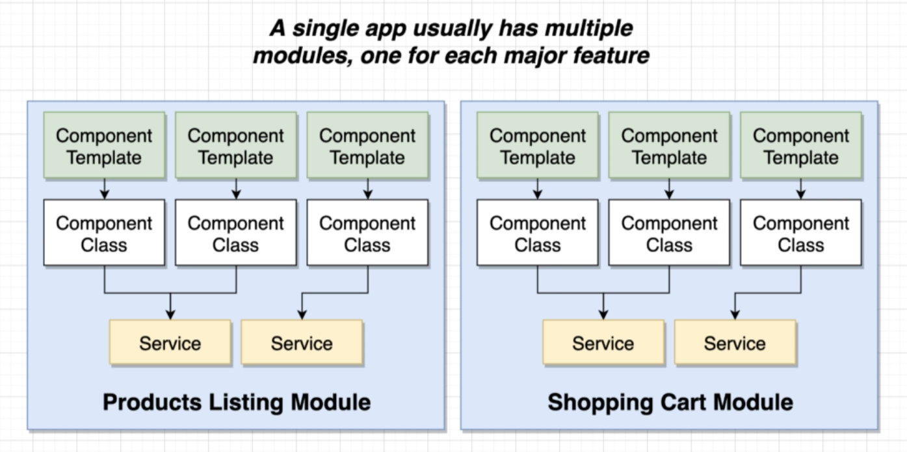
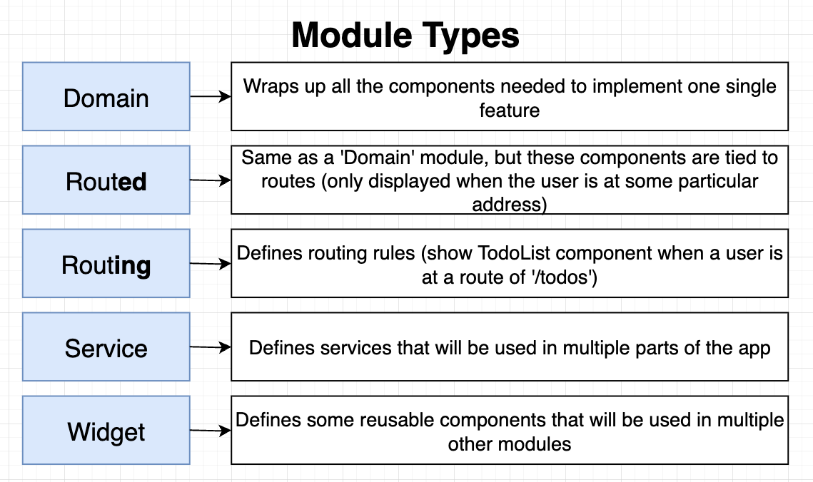
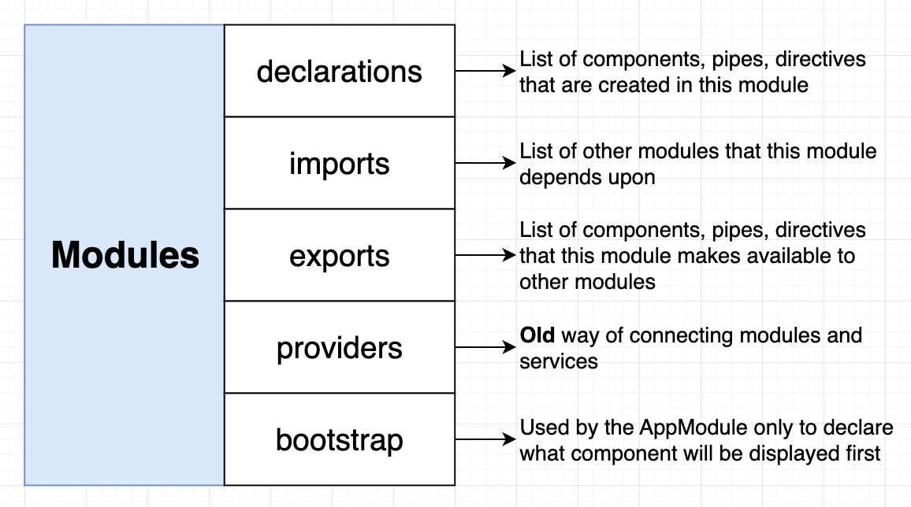
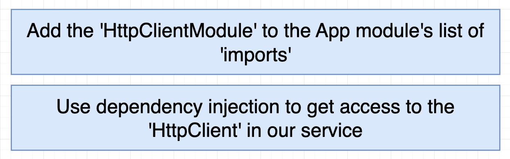
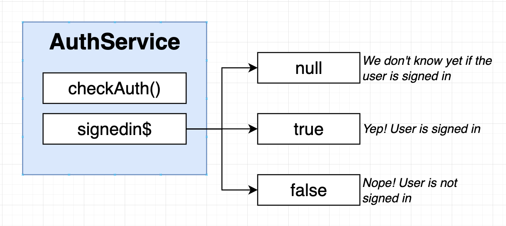
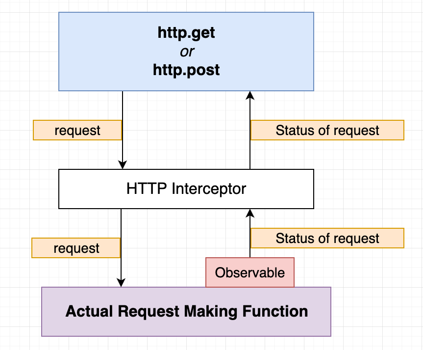

# INDEX

- [INDEX](#index)
  - [Modules](#modules)
    - [Module Types](#module-types)
    - [Why use Modules ?](#why-use-modules-)
  - [Creating and using modules](#creating-and-using-modules)
    - [Creating modules](#creating-modules)
    - [Using modules](#using-modules)
  - [Router module](#router-module)
  - [HTTP Module](#http-module)
    - [HTTP Interceptors](#http-interceptors)
  - [Shared Module](#shared-module)

---

## Modules

Angular uses modules to `bundle` different components into packages

- A single app can have multiple modules, each module can have multiple components, and each component can have multiple services.
  

- It's where we import components so that Angular knows that they exist

  - `BrowserModule`
    - provides services that are essential to launch the app in the browser
    - it's imported in the `app.module.ts` file
  - `CommonModule`
    - provides common directives like `ngIf` and `ngFor`
    - It's re-exported by `BrowserModule`, so when we import `BrowserModule` we actually import `CommonModule` as well

- **Shared Modules**

  - Instead of importing these common modules and components in every feature module, you can create a shared module that has all these modules and components. Import them into a shared module and import this shared module into all feature modules. This will save imports and a lot of coding lines.

### Module Types



- **Domain Module**
  - Contains the components that will be shown at all times in the app
- **Routing Module**
  - Contains the routes of the app and routing configuration/rules on how to navigate between the components
- **Routed Module**
  - Contains the components that will be shown when the user navigates to a specific route
- **Shared (Widget) Module**
  - Contains the common components, directives, and pipes that are used in multiple modules

---

### Why use Modules ?

- **Code Organization**
  - Modules help in organizing the code in a better way
  - It helps in separating the code into different modules based on their functionality
- **Reusability**
  - Modules can be reused in different parts of the application, as a module can contain multiple components and services, and **they can be used in different parts of the application by only importing the module and not the individual components**
  - It helps in reducing the code duplication
- **Lazy Loading**
  - Modules can be lazy-loaded, which means they are loaded only when they are needed
  - This helps in reducing the initial load time of the application

---

## Creating and using modules

### Creating modules

- To create a module, use the `ng generate module` command

  ```bash
  ng generate module modules/modal
  # or
  ng g m modules/modal
  ```

- This will create a new module in the `modules` folder

  ```ts
  // modules/modal/modal.module.ts
  import { NgModule } from '@angular/core';
  import { CommonModule } from '@angular/common';

  @NgModule({
    declarations: [], // to declare components
    imports: [CommonModule], // to import other modules
    exports: [] // to export components to other modules
  })
  export class ModalModule {}
  ```

- To add a component to the module, use the `ng generate component` command with the module name

  ```bash
  ng generate component modules/modal/modal
  # or
  ng g c modules/modal/modal
  ```

---

### Using modules

One of the main advantages of using modules is that they can be reused in different parts of the application. This is done by exporting the components from the module and importing the module in the required module.

- **First step** is to manually list all the components/services that you want to export in the `exports` array of the module

  ```ts
  // modules/modal/modal.module.ts
  import { NgModule } from '@angular/core';
  import { CommonModule } from '@angular/common';
  import { ModalComponent } from './modal.component';

  @NgModule({
    declarations: [ModalComponent],
    imports: [CommonModule],
    exports: [ModalComponent] // export the component here
  })
  export class ModalModule {}
  ```

- **Second step** is to import the module in the required module

  ```ts
  // app.module.ts
  import { ModalModule } from './modules/modal/modal.module';

  @NgModule({
    declarations: [AppComponent],
    imports: [BrowserModule, ModalModule], // add the module here
    providers: [],
    bootstrap: [AppComponent]
  })
  export class AppModule {}
  // Now, the `ModalComponent` can be used in the `AppComponent` and other components of the app (without importing it explicitly) ✅
  ```

- The `@NgModule` decorator of the Module is used to define the module and its properties
  

---

## Router module

It's a module that provides the `routing` functionality to the Angular app and is used to define the routes of the app.

- To include the router inside of your new app

  ```sh
  ng g module <Module_name> --routing
  ```

- For example to create a new module called `app-routing` with routing

  ```bash
  ng g module app-routing --routing
  ```

- This will generate 2 files `app-routing.module.ts` and `app-routing-routing.module.ts`

  - `app-routing.module.ts`
    - It will contain the routes of the app
  - `app-routing-routing.module.ts`
    - It will contain the routing module configuration

- **Router Configuration ->** [Router configuration](./4-Angular-Router.md#router-configuration)

---

## HTTP Module

To perform HTTP requests in Angular, we need to import the `HttpClientModule` in the module, and then we can use the `HttpClient` service to perform HTTP requests


- Check [observables](./6-Angular-RXJS.md#observables) for more information about observables and how the `HttpClient` service works with observables

- Example of using the `HttpClient` service to perform an HTTP request

  ```ts
  // app.module.ts
  import { HttpClientModule } from '@angular/common/http';

  @NgModule({
    declarations: [AppComponent],
    imports: [BrowserModule, HttpClientModule], // import the HttpClientModule here
    providers: [],
    bootstrap: [AppComponent]
  })
  export class AppModule {}
  ```

  ```ts
  // app.component.ts
  import { HttpClient } from '@angular/common/http';

  export class AppComponent {
    // Dependency Injection of HttpClient
    constructor(private http: HttpClient) {
      this.http.get('https://jsonplaceholder.typicode.com/posts').subscribe(data => {
        console.log(data);
      });
      // Note: calling just `get` method will not make the request, we need to subscribe to the observable to make the request
    }
  }
  ```

- Note: We can still use other tools like `fetch` or `axios` to perform HTTP requests in Angular, but it's recommended to use the `HttpClient` service provided by Angular
  - One of the reasons is that the `HttpClient` service is integrated with Angular's `error handling` and `observables`, which makes it easier to handle the HTTP requests and responses and work with `RxJS` observables

---

### HTTP Interceptors

**HTTP Interceptor** is a middleware that intercepts HTTP requests and responses from the client to the server and vice versa




- It is used to modify the request or response, add headers, handle errors, etc.
- Usually, we use HTTP Interceptor to add the token to the request headers before sending the request to the server, ex:

  - add the JWT token to the request headers before sending the request to the server
  - set cookies in the request headers before sending the request to the server
  - handle errors in the response before sending the response to the client

- Example of creating an HTTP Interceptor

  - 1️⃣ Create a new class file for the interceptor

    ```bash
    ng g service interceptors/auth-interceptor
    ```

    - This will create a new service in the `interceptors` folder
    - The service file will have a class with the same name as the service file

  - 2️⃣ Implement the `HttpInterceptor` interface in the service class

    ```ts
    // auth-interceptor.ts (class file)
    import { Injectable } from '@angular/core';
    import { HttpInterceptor, HttpRequest, HttpHandler, HttpEvent } from '@angular/common/http';
    import { Observable } from 'rxjs';

    @Injectable()
    export class AuthInterceptor implements HttpInterceptor {
      intercept(req: HttpRequest<any>, next: HttpHandler): Observable<HttpEvent<any>> {
        const token = localStorage.getItem('token');
        if (token) {
          const modifiedRequest = req.clone({
            headers: req.headers.set('Authorization', 'Bearer ' + token)
          });
          return next.handle(modifiedRequest);
        } else {
          return next.handle(req);
        }
      }
    }
    ```

    - The `intercept` method is called for every HTTP request
    - It takes two arguments:
      - `req`: the request object
      - `next`: the next interceptor in the chain
    - It returns an observable of the `HttpEvent` type

  - 3️⃣ Add the interceptor to the providers array in the `app.module.ts` file (to make it available to the entire app)

    ```ts
    // app.module.ts
    import { HTTP_INTERCEPTORS } from '@angular/common/http';
    import { AuthInterceptor } from './interceptors/auth-interceptor';

    @NgModule({
      declarations: [AppComponent],
      imports: [BrowserModule, HttpClientModule],
      providers: [
        // Here, we're telling Angular to provide the AuthInterceptor and use it as an HTTP_INTERCEPTOR if any HTTP request is made in the app (because by default, Angular doesn't know about the AuthInterceptor, so we need to provide it here as it only uses the HTTP_INTERCEPTORS token)
        {
          provide: HTTP_INTERCEPTORS,
          useClass: AuthInterceptor,
          multi: true
        }
      ],
      bootstrap: [AppComponent]
    })
    export class AppModule {}
    ```

    - The `HTTP_INTERCEPTORS` is a token that is used to provide the interceptors in Angular
    - Here, we're telling Angular to provide the `AuthInterceptor` and use it as an `HTTP_INTERCEPTOR` if any HTTP request is made in the app (because by default, Angular doesn't know about the `AuthInterceptor`, so we need to provide it here as it only uses the `HTTP_INTERCEPTORS` token)

  - 4️⃣ Now, the `AuthInterceptor` will intercept every HTTP request and add the token to the request headers before sending the request to the server

- Notes:

  - To have different handling for the request and response, we can:

    - create separate interceptors for the request and response

      ```ts
      // auth-request-interceptor.ts
      export class AuthRequestInterceptor implements HttpInterceptor {
        intercept(req: HttpRequest<any>, next: HttpHandler): Observable<HttpEvent<any>> {
          // handle request
        }
      }

      export class AuthResponseInterceptor implements HttpInterceptor {
        intercept(req: HttpRequest<any>, next: HttpHandler): Observable<HttpEvent<any>> {
          // handle response
        }
      }
      ```

    - or we can handle both request and response in the same interceptor

      ```ts
      export class AuthInterceptor implements HttpInterceptor {
        intercept(req: HttpRequest<any>, next: HttpHandler): Observable<HttpEvent<any>> {
          // ...
          return next.handle(req).pipe(
            tap(event => {
              if (event instanceof HttpResponse) {
                // handle response
              }
              if (event instanceof HttpRequest) {
                // handle request
              }

              return event;
            })
          );
        }
      }
      ```

---

## Shared Module

A shared module is a module that contains the common components, directives, and pipes that are used in multiple modules

- **Creating a shared module**

  ```bash
  ng g module shared
  ```

  - This will create a new module in the `shared` folder
  - The shared module can contain the common components, directives, and pipes that are used in multiple modules

- **Exporting the common components**

  - To export the common components, add them to the `exports` array of the module

    ```ts
    // shared/shared.module.ts
    import { NgModule } from '@angular/core';
    import { CommonModule } from '@angular/common';
    import { HeaderComponent } from './header/header.component';
    import { FooterComponent } from './footer/footer.component';

    @NgModule({
      declarations: [HeaderComponent, FooterComponent],
      imports: [CommonModule],
      exports: [HeaderComponent, FooterComponent] // export the components here
    })
    export class SharedModule {}
    ```

  - Now, by importing the `SharedModule`, we have access to the `HeaderComponent` and `FooterComponent` and all the other components that are exported from the `SharedModule`

    ```ts
    // app.module.ts
    import { SharedModule } from './shared/shared.module';

    @NgModule({
      declarations: [AppComponent],
      imports: [BrowserModule, SharedModule], // import the SharedModule here
      providers: [],
      bootstrap: [AppComponent]
    })
    export class AppModule {}
    ```
