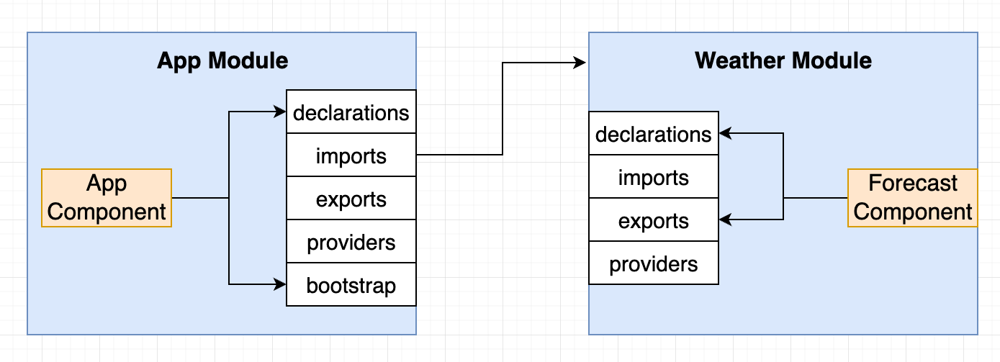

# INDEX

- [INDEX](#index)
  - [Modules](#modules)
    - [How Modules work (`NgModule`)](#how-modules-work-ngmodule)
    - [Module Types](#module-types)
    - [Why use Modules ?](#why-use-modules-)
  - [Creating and using modules](#creating-and-using-modules)
    - [Creating modules](#creating-modules)
    - [Using modules](#using-modules)
  - [Router module](#router-module)
  - [HTTP Module](#http-module)
    - [HTTP Params](#http-params)
    - [HTTP Interceptors](#http-interceptors)
  - [Shared Module](#shared-module)
  - [Standalone Components (NEW)](#standalone-components-new)

---

## Modules

It's a way to organize the code into different modules based on their functionality, which helps in separating the code into different modules based on their functionality and makes it easier to manage and maintain the code


- A **module** is a container for a set of related components, services, directives, and pipes
- An app can have multiple modules, each containing related components and services.
  

  - Instead of importing each component or service individually, you import the module that contains them, making your code cleaner and easier to manage.

- There're **built-in modules** in Angular like:

  - `BrowserModule` **(⚠️ Required for every Angular app that uses modules)**
    - provides services that are essential to launch the app in the browser _(e.g., Pipes, Directives, etc.)_
    - it's imported in the `app.module.ts` file
  - `CommonModule`
    - provides common directives like `ngIf` and `ngFor`
    - It's re-exported by `BrowserModule`, so when we import `BrowserModule` we actually import `CommonModule` as well
  - `FormsModule`
    - provides support for template-driven forms

---

### How Modules work (`NgModule`)

The `@NgModule` decorator of the Module is used to define the module and its properties


- It takes a `metadata` object that tells Angular how to compile and launch the application **(like which components to compile, which services to provide, etc.)**

  ```ts
  @NgModule({
    declarations: [AppComponent], // to declare components that belong to this module and need to be compiled
    imports: [BrowserModule], // to import other modules that we will depend on (inside the module)
    exports: [], // to export components to other modules (for shared modules)
    providers: [], // to provide services
    bootstrap: [AppComponent] // to bootstrap the app
  })
  ```

- `declarations`
  

  - `declarations` is used to declare components, directives, and pipes that belong to this module and need to be compiled

- `imports` & `exports`
  

  - `imports` is used to import other modules/components that we will depend on (inside the module)
  - `exports` is used to export components/directives/pipes that we want to make available to other modules that will import this module

- **Notes:**

  - You can't add a standalone component to the `declarations` array, as standalone components are not part of a module
  - You can add a standalone component to the `imports` array, as it can be used in the module without the need for a module
  - If you're using module for the root and not standalone components, you need to add the `bootstrap` property to the `@NgModule` decorator, which tells Angular which component to bootstrap when the app starts, and bootstrap the app with that module

    ```ts
    // main.ts 📄
    platformBrowserDynamic()
      .bootstrapModule(AppModule)
      .catch(err => console.error(err));
    ```

---

### Module Types


- **Domain Module**
  - Contains the components that will be shown at all times in the app
- **Routing Module**
  - Contains the routes of the app and routing configuration/rules on how to navigate between the components
- **Routed Module**
  - Contains the components that will be shown when the user navigates to a specific route
- **Shared (Widget) Module**
  - Contains the common components, directives, and pipes that are used in multiple modules
  - Instead of importing the common modules and components in every feature-module, you can create a shared module that has all these modules and components, Then import them into a shared module and import this shared module into all feature modules. This will save imports and a lot of coding lines.

---

### Why use Modules ?

- **Code Organization**
  - Modules help in organizing the code in a better way
  - It helps in separating the code into different modules based on their functionality
- **Reusability**
  - Modules can be reused in different parts of the application, as a module can contain multiple components and services, and **they can be used in different parts of the application by only importing the module and not the individual components**
  - It helps in reducing the code duplication
- **Lazy Loading**
  - Modules can be lazy-loaded, which means they are loaded only when they are needed
  - This helps in reducing the initial load time of the application

---

## Creating and using modules

### Creating modules

- To create a module, use the `ng generate module` command

  ```bash
  ng generate module modules/modal
  # or
  ng g m modules/modal
  ```

- This will create a new module in the `modules` folder

  ```ts
  // modules/modal/modal.module.ts
  import { NgModule } from '@angular/core';
  import { CommonModule } from '@angular/common';

  @NgModule({
    declarations: [], // to declare components
    imports: [CommonModule], // to import other modules
    exports: [] // to export components to other modules
  })
  export class ModalModule {}
  ```

- To add a component to the module, use the `ng generate component` command with the module name

  ```bash
  ng generate component modules/modal/modal
  # or
  ng g c modules/modal/modal
  ```

  - This will create a new component in the `modules/modal` folder and add it to the `declarations` array of the module

    ```ts
    // modules/modal/modal.module.ts
    import { NgModule } from '@angular/core';
    import { CommonModule } from '@angular/common';
    import { ModalComponent } from './modal.component';

    @NgModule({
      declarations: [ModalComponent], // Automatically add the component here ✅
      imports: [CommonModule],
      exports: []
    })
    // ...
    ```

---

### Using modules

One of the main advantages of using modules is that they can be reused in different parts of the application. This is done by exporting the components from the module and importing the module in the required module.

- **Steps to use a module in another module**

  - **First step** is to manually list all the components/services that you want to export in the `exports` array of the module

    ```ts
    // modules/modal/modal.module.ts
    import { NgModule } from '@angular/core';
    import { CommonModule } from '@angular/common';
    import { ModalComponent } from './modal.component';

    @NgModule({
      declarations: [ModalComponent],
      imports: [CommonModule],
      exports: [ModalComponent] // export the component here
    })
    export class ModalModule {}
    ```

  - **Second step** is to import the module in the required module

    ```ts
    // app.module.ts
    import { ModalModule } from './modules/modal/modal.module';

    @NgModule({
      declarations: [AppComponent],
      imports: [BrowserModule, ModalModule], // add the module here
      providers: [],
      bootstrap: [AppComponent]
    })
    export class AppModule {}
    // Now, the `ModalComponent` can be used in the `AppComponent` and other components of the app (without importing it explicitly) ✅
    ```

---

## Router module

It's a module that provides the `routing` functionality to the Angular app and is used to define the routes of the app.

- To include the router inside of your new app

  ```sh
  ng g module <Module_name> --routing
  ```

- For example to create a new module called `app-routing` with routing

  ```bash
  ng g module app-routing --routing
  ```

- This will generate 2 files `app-routing.module.ts` and `app-routing-routing.module.ts`

  - `app-routing.module.ts`
    - It will contain the routes of the app
  - `app-routing-routing.module.ts`
    - It will contain the routing module configuration

- **Router Configuration ->** [Router configuration](./4-Angular-Router.md#router-configuration)

---

## HTTP Module

To perform HTTP requests in Angular, we need to import the `HttpClientModule` in the module, and then we can use the `HttpClient` service to perform HTTP requests


- Check [observables](./6-Angular-RXJS.md#observables) for more information about observables and how the `HttpClient` service works with observables

- Example of using the `HttpClient` service to perform an HTTP request

  ```ts
  // app.module.ts
  import { HttpClientModule } from '@angular/common/http';

  @NgModule({
    declarations: [AppComponent],
    imports: [BrowserModule, HttpClientModule], // import the HttpClientModule here
    providers: [],
    bootstrap: [AppComponent]
  })
  export class AppModule {}
  ```

  ```ts
  // app.component.ts
  import { HttpClient } from '@angular/common/http';

  export class AppComponent {
    // Dependency Injection of HttpClient
    constructor(private http: HttpClient) {
      this.http.get('https://jsonplaceholder.typicode.com/posts').subscribe(data => {
        console.log(data);
      });
      // Note: calling just `get` method will not make the request, we need to subscribe to the observable to make the request
    }
  }
  ```

- Note: We can still use other tools like `fetch` or `axios` to perform HTTP requests in Angular, but it's recommended to use the `HttpClient` service provided by Angular
  - One of the reasons is that the `HttpClient` service is integrated with Angular's `error handling` and `observables`, which makes it easier to handle the HTTP requests and responses and work with `RxJS` observables

---

### HTTP Params

`HttpParams` is a class in Angular that is used to create URL parameters (query string for the URL) for an HTTP request

- It's used to create a URL query string with key-value pairs for an HTTP request
- It's immutable, which means that once it's created, it cannot be changed
- Example of using `HttpParams` to create URL parameters for an HTTP request

  ```ts
  // app.component.ts
  import { HttpClient, HttpParams } from '@angular/common/http';

  export class AppComponent {
    constructor(private http: HttpClient) {
      const params = new HttpParams().set('userId', '1').set('id', '1');
      this.http.get('https://jsonplaceholder.typicode.com/posts', { params }).subscribe(data => {
        console.log(data);
      });
    }
  }
  ```

  - In this example, we're creating URL parameters with key-value pairs `userId=1` and `id=1` and passing them to the `get` method of the `HttpClient` service
  - The `get` method takes an optional configuration object as the second argument, where we can pass the `params` object

- Example of using `HttpParams` with an observable:

  ```ts
  // service
  // ...
  export class NewsApiService {
    url = 'https://newsapi.org/v2/top-head';
    pageSize = 10;
    apiKey = '123456789';
    totalPages: number;

    pagesInput: Subject<number>;
    pagesOutput: Observable<any>;

    constructor(private http: HttpClient) {
      this.pagesInput = new Subject();
      this.pagesOutput = this.pagesInput.pipe(
        map(page => {
          return new HttpParams()
            .set('apiKey', this.apiKey)
            .set('pageSize', this.pageSize.toString())
        }),
        switchMap(params => {
          return this.http.get(this.url, { params });
        }),
        tap(res => {
          // Here we add any operations that we want to do after fetching
          this.totalPages = Math.ceil(response.totalResults / 10);
        }
      );
    }
  }
  ```

---

### HTTP Interceptors

**HTTP Interceptor** is a middleware (function) that intercepts HTTP requests and responses from the client to the server and vice versa **(executes before the request is sent to the server and after the response is received from the server)**


- It is used to modify the request or response, add headers, handle errors, etc.
- Usually, we use HTTP Interceptor to add the token to the request headers before sending the request to the server, ex:

  - add the `JWT` token to the request headers before sending the request to the server
  - set cookies in the request headers before sending the request to the server
  - handle errors in the response before sending the response to the client

- Example of creating an HTTP Interceptor

  - 1️⃣ Create a new class file for the interceptor

    ```bash
    ng g service interceptors/auth-interceptor
    ```

    - This will create a new service in the `interceptors` folder
    - The service file will have a class with the same name as the service file

  - 2️⃣ Implement the `HttpInterceptor` interface in the service class

    ```ts
    // auth-interceptor.ts (class file)
    import { Injectable } from '@angular/core';
    import { HttpInterceptor, HttpRequest, HttpHandler, HttpEvent } from '@angular/common/http';
    import { Observable } from 'rxjs';

    @Injectable()
    export class AuthInterceptor implements HttpInterceptor {
      intercept(req: HttpRequest<any>, next: HttpHandler): Observable<HttpEvent<any>> {
        const token = localStorage.getItem('token');
        if (token) {
          const modifiedRequest = req.clone({
            headers: req.headers.set('Authorization', 'Bearer ' + token)
          });
          return next.handle(modifiedRequest);
        } else {
          return next.handle(req);
        }
      }
    }
    ```

    - The `intercept` method is called for every HTTP request
    - It takes two arguments:
      - `req`: the request object
      - `next`: the next interceptor in the chain
    - It returns an observable of the `HttpEvent` type

  - 3️⃣ register the interceptor in the `app.module.ts` file / or the `app.config.ts` file (to make it available to the entire app)
    - The old way is to create a class for the interceptor and register it in the `app.module.ts` file, but now we can also use standalone components to register the interceptor using the `withInterceptors` method
    - **Module based:** Add the interceptor to the providers array in the `app.module.ts` file (to make it available to the entire app)

      ```ts
      // app.module.ts
      import { HTTP_INTERCEPTORS } from '@angular/common/http';
      import { AuthInterceptor } from './interceptors/auth-interceptor';

      @NgModule({
        declarations: [AppComponent],
        imports: [BrowserModule, HttpClientModule],
        providers: [
          // Here, we're telling Angular to provide the AuthInterceptor and use it as an HTTP_INTERCEPTOR if any HTTP request is made in the app (because by default, Angular doesn't know about the AuthInterceptor, so we need to provide it here as it only uses the HTTP_INTERCEPTORS token)
          {
            provide: HTTP_INTERCEPTORS,
            useClass: AuthInterceptor,
            multi: true
          }
        ],
        bootstrap: [AppComponent]
      })
      export class AppModule {}
      ```

      - The `HTTP_INTERCEPTORS` is a token that is used to provide the interceptors in Angular
      - Here, we're telling Angular to provide the `AuthInterceptor` and use it as an `HTTP_INTERCEPTOR` if any HTTP request is made in the app (because by default, Angular doesn't know about the `AuthInterceptor`, so we need to provide it here as it only uses the `HTTP_INTERCEPTORS` token)
    - **Standalone based:** If you're using standalone components, you can use the `withInterceptors` method to register the interceptor in the component

      ```ts
      // app.component.ts
      import { withInterceptors } from '@angular/core';
      import { AuthInterceptor } from './interceptors/auth-interceptor';

      @Component({
        selector: 'app-root',
        templateUrl: './app.component.html',
        styleUrls: ['./app.component.css'],
        imports: [HttpClientModule],
        providers: [withInterceptors([AuthInterceptor])] // register the interceptor here
      })
      export class AppComponent {
        // component logic
      }
      ```

  - 4️⃣ Now, the `AuthInterceptor` will intercept every HTTP request and add the token to the request headers before sending the request to the server
    ```ts
    // interceptors/auth-interceptor.ts 📄

    // Option 1: class based interceptor (OLD WAY)
    import { Injectable } from '@angular/core';
    import { HttpInterceptor, HttpRequest, HttpHandler, HttpEvent } from '@angular/common/http';
    import { Observable } from 'rxjs';
    @Injectable()
    export class AuthInterceptor implements HttpInterceptor {
      intercept(req: HttpRequest<any>, next: HttpHandler): Observable<HttpEvent<any>> {
        const token = localStorage.getItem('token');
        if (token) {
          const modifiedRequest = req.clone({
            headers: req.headers.set('Authorization', 'Bearer ' + token)
          });
          return next.handle(modifiedRequest);
        } else {
          return next.handle(req);
        }
      }
    }

    // -------------------------or-------------------------
    
    // Option 2: standalone based interceptor (NEW WAY)
    import { withInterceptors } from '@angular/core';
    import { HttpClientModule } from '@angular/common/http';
    import { AuthInterceptor } from './interceptors/auth-interceptor'; 

    export funtion AuthInterceptor(req: HttpRequest<any>, next: HttpHandler): Observable<HttpEvent<any>> {
      const token = localStorage.getItem('token');
      if (token) {
        const modifiedRequest = req.clone({
          headers: req.headers.set('Authorization', 'Bearer ' + token)
        });
        return next.handle(modifiedRequest);
      } else {
        return next.handle(req);
      }
    }
    ```

- Notes:

  - To have different handling for the request and response, we can:

    - create separate interceptors for the request and response

      ```ts
      // auth-request-interceptor.ts
      export class AuthRequestInterceptor implements HttpInterceptor {
        intercept(req: HttpRequest<any>, next: HttpHandler): Observable<HttpEvent<any>> {
          // handle request
        }
      }

      export class AuthResponseInterceptor implements HttpInterceptor {
        intercept(req: HttpRequest<any>, next: HttpHandler): Observable<HttpEvent<any>> {
          // handle response
        }
      }
      ```

    - or we can handle both request and response in the same interceptor

      ```ts
      export class AuthInterceptor implements HttpInterceptor {
        intercept(req: HttpRequest<any>, next: HttpHandler): Observable<HttpEvent<any>> {
          // ...
          return next.handle(req).pipe(
            tap(event => {
              if (event instanceof HttpResponse) {
                // handle response
              }
              if (event instanceof HttpRequest) {
                // handle request
              }

              return event;
            })
          );
        }
      }
      ```

---

## Shared Module

A shared module is a module that contains the common components, directives, and pipes that are used in multiple modules

- **Creating a shared module**

  ```bash
  ng g module shared
  ```

  - This will create a new module in the `shared` folder
  - The shared module can contain the common components, directives, and pipes that are used in multiple modules

- **Exporting the common components**

  - To export the common components, add them to the `exports` array of the module

    ```ts
    // shared/shared.module.ts
    import { NgModule } from '@angular/core';
    import { CommonModule } from '@angular/common';
    import { HeaderComponent } from './header/header.component';
    import { FooterComponent } from './footer/footer.component';

    @NgModule({
      declarations: [HeaderComponent, FooterComponent],
      imports: [CommonModule],
      exports: [HeaderComponent, FooterComponent] // export the components here
    })
    export class SharedModule {}
    ```

  - Now, by importing the `SharedModule`, we have access to the `HeaderComponent` and `FooterComponent` and all the other components that are exported from the `SharedModule`

    ```ts
    // app.module.ts
    import { SharedModule } from './shared/shared.module';

    @NgModule({
      declarations: [AppComponent],
      imports: [BrowserModule, SharedModule], // import the SharedModule here
      providers: [],
      bootstrap: [AppComponent]
    })
    export class AppModule {}
    ```

---

## Standalone Components (NEW)

It's a new feature in Angular that allows you to create components **without the need for a module**. This means that you can create a component and use it directly in your application without having to create a module for it.

> Before **Angular 14**, every component had to be declared in a module, which made the codebase more complex and harder to manage. With standalone components, you can create components that are self-contained and can be used directly in your application without the need for a module.
>
> Now, Standalone components are the recommended way to create components in Angular, as they simplify the codebase and make it easier to manage and maintain the code.
>
> Note: You can still use modules in Angular, and you can mix standalone components with modules in your application. However, it's recommended to use standalone components for new components that you create in your application.

- **Creating a standalone component**

  - To create a standalone component, use the `--standalone` flag with the `ng generate component` command

    ```bash
    ng g c my-component --standalone
    ```

  - This will create a new component in the `my-component` folder and add the `standalone: true` property to the component decorator

    ```ts
    // my-component.component.ts
    import { Component } from '@angular/core';

    @Component({
      selector: 'app-my-component',
      templateUrl: './my-component.component.html',
      styleUrls: ['./my-component.component.css'],
      standalone: true // this makes the component standalone
    })
    export class MyComponentComponent {
      // component logic
    }
    ```

- **Using a standalone component**

  - To use a standalone component, you can import it directly into another component or module without the need for a module

    ```ts
    // app.component.ts
    import { Component } from '@angular/core';
    import { MyComponentComponent } from './my-component/my-component.component';

    @Component({
      selector: 'app-root',
      template: `
        <app-my-component></app-my-component>
      `, // use the standalone component here
      imports: [MyComponentComponent] // import the standalone component here
    })
    export class AppComponent {
      // component logic
    }
    ```

  - In order to use comopnents in the template of a standalone component, you need to import them in the `imports` array of the component decorator. This is similar to how you would import modules in a module file. Also you can import `modules` in the `imports` array of the component decorator, which allows you to use the directives and pipes provided by those modules in the template of the standalone component.

- **Benefits of standalone components**
  - **Simplified Structure**: Standalone components reduce the need for modules, making the codebase simpler and easier to understand.
  - **Improved Performance**: They can lead to better performance by reducing the overhead of module loading.
  - **Easier Testing**: Standalone components can be tested in isolation without the need for a module context.
  - **Flexibility**: They allow for more flexible component usage across different parts of the application without being tied to a specific module.
- **Limitations**
  - Standalone components are still a relatively new feature, and some advanced use cases may require modules (e.g., complex dependency injection scenarios).
  - Not all Angular features are compatible with standalone components, so it's important to check the documentation for any limitations.
- **Conclusion**
  - Standalone components are a powerful feature in Angular that allows you to create components without the need for a module, making the codebase simpler and easier to understand.
  - They can be used directly in other components or modules, and they can be tested in isolation without the need for a module context.
  - However, they are still a relatively new feature, and some advanced use cases may require modules.
