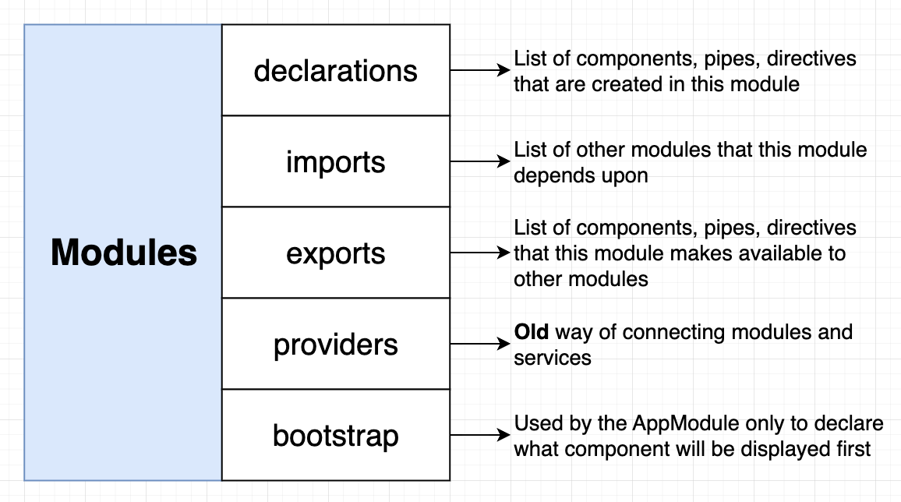

# INDEX

- [INDEX](#index)
  - [Modules](#modules)
    - [How Modules work (`NgModule`)](#how-modules-work-ngmodule)
    - [Explaining an example module](#explaining-an-example-module)
    - [Module Types](#module-types)
    - [Why use Modules ?](#why-use-modules-)
  - [Creating and using modules](#creating-and-using-modules)
    - [Creating modules](#creating-modules)
    - [Using modules](#using-modules)
  - [Router module](#router-module)
  - [HTTP Module](#http-module)
  - [Shared Module](#shared-module)

---

## Modules

**It's a way to organize the code into different modules based on their functionality**, which helps in separating the code into different modules based on their functionality and makes it easier to manage and maintain the code


> An Angular module is a container for a group of related components, services, directives, and pipes. You can think of a module as a package that implements certain functionality from the business domain of your application, such as a (shipping or billing module). All elements of a small application can be located in one module (the root module), whereas larger apps may have more than one module (feature modules).
>
> All apps must have at least a root module that’s bootstrapped during app launch.

- A **module** is a container for a set of related components, services, directives, and pipes
- An app can have multiple modules, each containing related components and services.
  

  - Instead of importing each component or service individually, you import the module that contains them, making your code cleaner and easier to manage.

- There're **built-in modules** in Angular like:

  - `BrowserModule` **(⚠️ Required for every Angular app that uses modules)**
    - provides services that are essential to launch the app in the browser _(e.g., Pipes, Directives, etc.)_
    - it's imported in the `app.module.ts` file
  - `CommonModule`
    - provides common directives like `ngIf` and `ngFor`
    - It's re-exported by `BrowserModule`, so when we import `BrowserModule` we actually import `CommonModule` as well
  - `FormsModule`
    - provides support for template-driven forms

---

### How Modules work (`NgModule`)

The `@NgModule` decorator of the Module is used to define the module and its properties


- It takes a `metadata` object that tells Angular how to compile and launch the application **(like which components to compile, which services to provide, etc.)**

  ```ts
  @NgModule({
    declarations: [AppComponent], // to declare components that belong to this module and need to be compiled
    imports: [BrowserModule], // to import other modules that we will depend on (inside the module)
    exports: [], // to export components to other modules (for shared modules or any other modules)
    providers: [], // to provide services
    bootstrap: [AppComponent] // to bootstrap the app (only in the root module)
  })
  ```

  - `declarations`
    

    - It's used to declare components, directives, and pipes that belong to this module and need to be compiled
    - A **feature module** may **declare** its own components and services, but to make all or some of them visible to other modules, you need to **export** them.
    - when using `ng generate component` command, the new component will be automatically added to the `declarations` array of the module

  - `imports` & `exports`
    

    - `imports` is used to import other modules/components that we will depend on (inside the module)
      - Usually, we import `CommonModule` in feature modules to have access to common directives like `ngIf` and `ngFor`, and we import `BrowserModule` in the root module to have access to all the features of Angular for web applications
    - `exports` is used to export components/directives/pipes that we want to make available to other modules that will import this module
      - External modules will see only those members of the shipping module that were explicitly mentioned in exports.

  - `providers`

    - It's an **old way** of providing services

  - `bootstrap`

    - It's used to bootstrap the application with the root module
    - It's only used in the **root module** (usually `app.module.ts`)
    - **Feature modules** doesn’t include the `bootstrap` property, because bootstrapping the entire app is the responsibility of the **root module**.

- **Notes:**

  - You can't add a standalone component to the `declarations` array, as standalone components are not part of a module
  - You can add a standalone component to the `imports` array, as it can be used in the module without the need for a module
  - If you're using module for the root and not standalone components, you need to add the `bootstrap` property to the `@NgModule` decorator, which tells Angular which component to bootstrap when the app starts, and bootstrap the app with that module

    ```ts
    // main.ts 📄
    platformBrowserDynamic()
      .bootstrapModule(AppModule)
      .catch(err => console.error(err));
    ```

---

### Explaining an example module

A typical Angular module is a small class that has an empty body, unless you want to write code that manually bootstraps the application—for example, if an app includes a legacy AngularJS app. The `@NgModule()` decorator lists all components, directives, and pipes that belong to the module.

```ts
@NgModule({
  declarations: [AppComponent], // -> Declares that the AppComponent belongs to this module
  imports: [BrowserModule], // -> Imports BrowserModule to have access to common directives like ngIf and ngFor (Needed for any web-based Angular app)
  bootstrap: [AppComponent] // -> Specifies the root component that Angular should bootstrap when it starts the application (the root component of the app)
})
export class ExampleModule {}
```

- A typical module lists several components, and the root component is specified in the bootstrap property of the module. also lists `BrowserModule`, which is a must for apps that run in a browser.

---

### Module Types


- **Domain Module**
  - Contains the components that will be shown at all times in the app
- **Routing Module**
  - Contains the routes of the app and routing configuration/rules on how to navigate between the components
- **Routed Module**
  - Contains the components that will be shown when the user navigates to a specific route
- **Shared (Widget) Module**
  - Contains the common components, directives, and pipes that are used in multiple modules
  - Instead of importing the common modules and components in every feature-module, you can create a shared module that has all these modules and components, Then import them into a shared module and import this shared module into all feature modules. This will save imports and a lot of coding lines.

---

### Why use Modules ?

- **Code Organization**
  - Modules help in organizing the code in a better way
  - It helps in separating the code into different modules based on their functionality
- **Reusability**
  - Modules can be reused in different parts of the application, as a module can contain multiple components and services, and **they can be used in different parts of the application by only importing the module and not the individual components**
  - It helps in reducing the code duplication
- **Lazy Loading**
  - Modules can be lazy-loaded, which means they are loaded only when they are needed
  - This helps in reducing the initial load time of the application

---

## Creating and using modules

### Creating modules

- To create a module, use the `ng generate module` command

  ```bash
  ng generate module modules/modal
  # or
  ng g m modules/modal
  ```

- This will create a new module in the `modules` folder

  ```ts
  // modules/modal/modal.module.ts
  import { NgModule } from '@angular/core';
  import { CommonModule } from '@angular/common';

  @NgModule({
    declarations: [], // to declare components
    imports: [CommonModule], // to import other modules
    exports: [] // to export components to other modules
  })
  export class ModalModule {}
  ```

- To add a component to the module, use the `ng generate component` command with the module name

  ```bash
  ng generate component modules/modal/modal
  # or
  ng g c modules/modal/modal
  ```

  - This will create a new component in the `modules/modal` module-folder and add it to the `declarations` array of the module

    ```ts
    // modules/modal/modal.module.ts
    import { NgModule } from '@angular/core';
    import { CommonModule } from '@angular/common';
    import { ModalComponent } from './modal.component';

    @NgModule({
      declarations: [ModalComponent], // Automatically add the component here ✅
      imports: [CommonModule],
      exports: []
    })
    // ...
    ```

---

### Using modules

One of the main advantages of using modules is that they can be reused in different parts of the application. This is done by exporting the components from the module and importing the module in the required module.

- **Steps to use a module in another module**

  - **First step** is to manually list all the components/services that you want to export in the `exports` array of the module

    ```ts
    // modules/modal/modal.module.ts
    import { NgModule } from '@angular/core';
    import { CommonModule } from '@angular/common';
    import { ModalComponent } from './modal.component';

    @NgModule({
      declarations: [ModalComponent],
      imports: [CommonModule],
      exports: [ModalComponent] // export the component here
    })
    export class ModalModule {}
    ```

  - **Second step** is to import the module in the required module

    ```ts
    // app.module.ts
    import { ModalModule } from './modules/modal/modal.module';

    @NgModule({
      declarations: [AppComponent],
      imports: [BrowserModule, ModalModule], // add the module here
      providers: [],
      bootstrap: [AppComponent]
    })
    export class AppModule {}
    // Now, the `ModalComponent` can be used in the `AppComponent` and other components of the app (without importing it explicitly) ✅
    ```

---

## Router module

It's a module that provides the `routing` functionality to the Angular app and is used to define the routes of the app.

- To include the router inside of your new app

  ```sh
  ng g module <module_name> --routing
  ```

  - `--routing` flag will create a separate routing module for the feature module, that will handle the routing for that module

- For example to create a new module called `cart` with routing

  ```bash
  ng g module cart --routing
  ```

- This will generate 2 files `cart-routing.module.ts` and `cart.module.ts`

  - `cart-routing.module.ts`
    - It will contain the routes of the app
  - `cart.module.ts`
    - It will contain the module configuration

- **Router Configuration ->** [Router configuration](./4-Angular-Router.md#router-configuration)

- Example
  

  - Here, we have 2 `Routing modules` and 2 `Domain modules` that are imported in the `AppModule`
  - The `Domain modules` contain the `Routing modules`, and then the `Routing modules` contain the `Routes` and the `RouterModule`
  - The main `App module` imports the `Domain modules` and the `RouterModule` is imported in the `AppRoutingModule`, so that now the `App module` contains all the routes

  - **Notes:**
    - the `<router-outlet>` directive will be in the `AppComponent` template, and not in the `Domain modules`

- **Common Router Modules Issue**

  - When we have multiple `Routing modules`, we need to ensure that order of imports is correct to avoid any issues with route resolution.
    
  - Angular uses a hierarchical dependency injection system, and the order of module imports in the @NgModule decorator matters. If the routing modules are not imported in the correct order, it can lead to route resolution conflicts or unexpected behavior.
  - Example: Consider the following scenario:

    ```ts
    // AppRoutingModule
    // contains this:
    const routes: Routes = [
      { path: '', component: HomeComponent },
      { path: '**', component: PageNotFoundComponent }
    ];
    ```

    ```ts
    // FeatureRoutingModule
    // contains this:
    const routes: Routes = [
      { path: 'elements', component: ElementsHomeComponent },
      { path: 'collections', component: CollectionsHomeComponent }
    ];
    ```

    ```ts
    // main module: `app.module.ts`
    import { AppRoutingModule } from './app-routing.module';
    import { FeatureModule } from './feature/feature.module';
    import { AppComponent } from './app.component';

    @NgModule({
      declarations: [AppComponent],
      imports: [BrowserModule, AppRoutingModule, FeatureModule], // 👈 Here's the root cause of the issue
      // solution: re-order the imports, so that FeatureModule is imported before AppRoutingModule
      providers: [],
      bootstrap: [AppComponent]
    })
    export class AppModule {}
    ```

---

## HTTP Module

To perform HTTP requests in Angular, we need to import the `HttpClientModule` in the module, and then we can use the `HttpClient` service to perform HTTP requests


> You can check the full documentation of `HttpClientModule` in its file [Angular-Http-Client.md](./12-Angular-Http-Client.md)

---

## Shared Module

A shared module is a module that contains the common components, directives, and pipes that are used in multiple modules

- **Creating a shared module**

  ```bash
  ng g module shared
  ```

  - This will create a new module in the `shared` folder
  - The shared module can contain the common components, directives, and pipes that are used in multiple modules

- **Exporting the common components**

  - To export the common components, add them to the `exports` array of the module

    ```ts
    // shared/shared.module.ts
    import { NgModule } from '@angular/core';
    import { CommonModule } from '@angular/common';
    import { HeaderComponent } from './header/header.component';
    import { FooterComponent } from './footer/footer.component';

    @NgModule({
      declarations: [HeaderComponent, FooterComponent],
      imports: [CommonModule],
      exports: [HeaderComponent, FooterComponent] // export the components here
    })
    export class SharedModule {}
    ```

  - Now, by importing the `SharedModule`, we have access to the `HeaderComponent` and `FooterComponent` and all the other components that are exported from the `SharedModule`

    ```ts
    // app.module.ts
    import { SharedModule } from './shared/shared.module';

    @NgModule({
      declarations: [AppComponent],
      imports: [BrowserModule, SharedModule], // import the SharedModule here
      providers: [],
      bootstrap: [AppComponent]
    })
    export class AppModule {}
    ```

---
