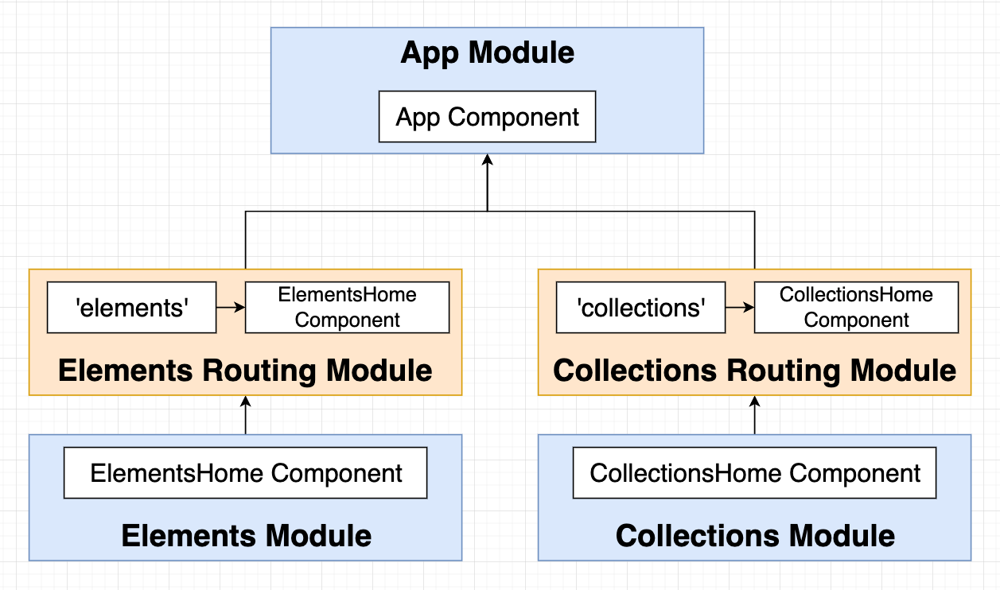

# INDEX

- [INDEX](#index)
  - [Adding Routing to an Angular App](#adding-routing-to-an-angular-app)
  - [Router configuration](#router-configuration)
    - [Routes](#routes)
      - [RouterModule.`forRoot`(ROUTES) vs RouterModule.`forChild`(ROUTES)](#routermoduleforrootroutes-vs-routermoduleforchildroutes)
    - [Nested Routes](#nested-routes)
  - [Using the Router](#using-the-router)
    - [Router directives](#router-directives)
    - [Route Properties (Params and Query Params)](#route-properties-params-and-query-params)
      - [`ActivatedRoute` service](#activatedroute-service)
      - [`ActivatedRouteSnapshot` and `RouterStateSnapshot`](#activatedroutesnapshot-and-routerstatesnapshot)
  - [Router Navigation](#router-navigation)
    - [Navigating using the `routerLink` directive](#navigating-using-the-routerlink-directive)
    - [Navigating to route programmatically](#navigating-to-route-programmatically)
    - [Relative Router Link References (Nested Routes)](#relative-router-link-references-nested-routes)
  - [Lazy Loading](#lazy-loading)
    - [Implementing Lazy Loading](#implementing-lazy-loading)
  - [Router Guards](#router-guards)
    - [Implementing Router Guards](#implementing-router-guards)
    - [Route Guards Common Issues](#route-guards-common-issues)
  - [Route Resolvers](#route-resolvers)
    - [Why we use Route Resolvers](#why-we-use-route-resolvers)

---

## Adding Routing to an Angular App

- **Generate a new app with routing**

  ```bash
  ng new <project_name> --routing

  # or run script for creating new app and answer yes to routing
  ```

  - this will create a new app with routing enabled and generate a `app-routing.module.ts` file that contains the routes of the app

- **Add routing to an existing app**

  ```bash
  ng generate module app-routing --flat --module=app
  ```

  - this will generate a new module called `app-routing` and import it into the `app.module.ts` file

- **Generating Router Module** -> [Router module](./2-Angular-Modules.md#router-module)

---

## Router configuration

- In order to configure the routes of the app, the `RouterModule` and `Routes` are imported into the `routing module`

  ```ts
  // in app-routing.module.ts
  import { NgModule } from '@angular/core';
  import { RouterModule, Routes } from '@angular/router';
  import { FirstComponent } from './first/first.component';

  const routes: Routes = [{ path: 'first-component', component: FirstComponent }]; // sets up routes constant where you define your routes

  @NgModule({
    imports: [RouterModule.forRoot(routes)],
    exports: [RouterModule]
  })
  export class AppRoutingModule {}
  ```

- The `RouterModule.forRoot(routes)` method is used to configure the routes of the app and the `routes` constant is used to define the routes
- Each route in this array is a `JavaScript object` that contains two properties.
  - `path` -> defines the URL path for the route.
  - `component` -> defines the component Angular should use for the corresponding path.
- We can also use `RouterModule.forChild(routes)` to configure child routes

---

### Routes

- The `Routes` array is used to define the routes of the app
- Each route in the `Routes` array is a `JavaScript object` that contains two properties

  - `path` : defines the URL path for the route
  - `component` : defines the component Angular should use for the corresponding path

  ```ts
  const routes: Routes = [
    { path: 'first-component', component: FirstComponent },
    { path: 'second-component', component: SecondComponent }
  ];
  ```

- **Home route** : The home route is defined by the path `/` and is usually the first route in the `Routes` array

  ```ts
  const routes: Routes = [
    { path: '', component: HomeComponent }, // home route
    { path: 'first-component', component: FirstComponent },
    { path: 'second-component', component: SecondComponent }
  ];
  ```

  - The `HomeComponent` is the component that will be displayed when the app is loaded

- **Wildcard route** : The wildcard route is defined by the path `**` and is usually the last route in the `Routes` array

  ```ts
  const routes: Routes = [
    { path: '', component: HomeComponent },
    { path: 'first-component', component: FirstComponent },
    { path: 'second-component', component: SecondComponent },
    { path: '**', component: PageNotFoundComponent } // wildcard route
  ];
  ```

  - The `PageNotFoundComponent` is the component that will be displayed when the route does not match any of the other routes

- **Notes:**

  - The `wildcard route` must be the last route in the `Routes` array because the router uses the first match it finds

    - To do this in the `@import` statement, use the `routing module` that contains the `wildcard route` as the last module

      ```ts
      @NgModule({
        imports: [
          BrowserModule,
          ElephantsModule,
          CollectionsModule, // module that contains routes
          AppRoutingModule // module that contains wildcard route (last module) ✅
        ],
        exports: [RouterModule]
      })
      export class AppModule {}
      ```

#### RouterModule.`forRoot`(ROUTES) vs RouterModule.`forChild`(ROUTES)

- `forRoot` is the method that configures the root routing module for your app. When called, you are asking Angular to instantiate an instance of the Router class `globally`.

  - it also provides the `AppRoutingModule` to import all of your child routes.

- `forChild` : When you are using the forChild static method, you are basically telling Angular, "**There is already a Router instance available in the app so please just register all of these routes with that instance.**". The forChild static method is useful by allowing you to maintain `separation of concerns` within your app.

  ```ts
  // in app-routing.module.ts
  import { NgModule } from '@angular/core';
  import { RouterModule, Routes } from '@angular/router';
  import { FirstComponent } from './first/first.component';

  const routes: Routes = [{ path: 'first-component', component: FirstComponent }];

  @NgModule({
    imports: [RouterModule.forChild(routes)],
    exports: [RouterModule]
  })
  export class AppRoutingModule {}
  ```

---

### Nested Routes

**Nested routes** are routes that are defined inside another route and are used to create a hierarchy of routes

- To define nested routes, use the `children` property of the route object

  ```ts
  const routes: Routes = [
    {
      path: 'parent-component',
      component: ParentComponent,
      children: [
        { path: '', component: FirstChildComponent },
        { path: 'child-component', component: SecondChildComponent }
      ]
    }
  ];
  ```

  - The `children` property is an array of routes that are nested inside the parent route
  - The `path` property of the child route is relative to the parent route
  - The `component` property of the child route is the component that will be displayed when the child route is navigated to

- Now, the `ChildComponent` will be displayed when the route `/parent-component/child-component` is navigated to
- The place where the child component will be displayed is defined in the parent component using the `router-outlet` directive

  ```html
  <h1>First Component</h1>
  <router-outlet></router-outlet>
  ```

---

## Using the Router

- To show the component based on the route, use the `router-outlet` directive in the `app.component.html` file

  ```html
  <h1>Angular Router App</h1>
  <!-- This nav gives you links to click, which tells the router which route to use (defined in the routes constant in  AppRoutingModule) -->
  <nav>
    <ul>
      <li>
        <a routerLink="/first-component" routerLinkActive="blue-text">First Component</a>
      </li>
    </ul>
  </nav>
  <!-- The routed views render in the <router-outlet>-->
  <router-outlet></router-outlet>
  ```

- It shows the component based on the route
  
- Example
  
  - Here, we have 2 `Routing modules` and 2 `Domain modules` that are imported in the `AppModule`
  - The `Domain modules` contain the `Routing modules` and the `Routing modules` contain the `Routes` and the `RouterModule`
  - The main `App module` imports the `Domain modules` and the `RouterModule` is imported in the `AppRoutingModule`, so that now the `App module` contains all the routes

---

### Router directives

- `routerLink` : to specify the link ( **instead of `href`** )
- `routerLinkActive` : it's an attribute directive that applies a class if the router link is matched
- `[routerLinkActiveOptions]="{exact:true}"` to prevent `Partial Matching Routes` to make it exact route **usually with route("/")**
- `router-outlet` : place holder for the component that will show based on the router link

---

### Route Properties (Params and Query Params)

In order to access the route parameters, we can use the `ActivatedRoute` service in the component


#### `ActivatedRoute` service

- The `ActivatedRoute` service is used to access the route parameters and query parameters of the route

  - To be able to use the `ActivatedRoute` service, we need to inject it into the component using **dependency injection**

    ```ts
    constructor(private route: ActivatedRoute) {} // inject the ActivatedRoute service
    ```

  - The `ActivatedRoute` service has a property called `params` that is an `Observable` that contains the route parameters

    ```ts
    this.route.params.subscribe(params => {
      console.log(params.id); // log the route parameter id
    });
    ```

  - The `ActivatedRoute` service has a property called `queryParams` that is an `Observable` that contains the query parameters

    ```ts
    this.route.queryParams.subscribe(params => {
      console.log(params.id); // log the query parameter id
    });
    ```

- **Example:**

  ```ts
  // in first.component.ts
  import { Component, OnInit } from '@angular/core';
  import { ActivatedRoute } from '@angular/router';

  @Component({
    selector: 'app-first',
    templateUrl: './first.component.html',
    styleUrls: ['./first.component.css']
  })
  export class FirstComponent implements OnInit {
    constructor(private route: ActivatedRoute) {} // inject the ActivatedRoute service (dependency injection)

    ngOnInit() {
      this.route.params.subscribe(params => {
        console.log(params.id); // log the route parameter id
      });

      this.route.queryParams.subscribe(params => {
        console.log(params.id); // log the query parameter id
      });
    }
  }
  ```

- **Notes:**

  - The `params` property of the `ActivatedRoute` service is an `Observable` that contains the route parameters
  - The `queryParams` property of the `ActivatedRoute` service is an `Observable` that contains the query parameters
  - The `subscribe` method of the `Observable` is used to subscribe to the `Observable` and get the value of the `Observable`

#### `ActivatedRouteSnapshot` and `RouterStateSnapshot`

They are used to access the route parameters and query parameters of the route **WITHOUT** subscribing to the `Observable`

- This is done by using the `snapshot` property of the `ActivatedRoute` service

  ```ts
  console.log(this.route.snapshot.params.id); // log the route parameter id
  console.log(this.route.snapshot.queryParams.id); // log the query parameter id
  ```

- **Example:**

  ```ts
  // in first.component.ts
  import { Component, OnInit } from '@angular/core';
  import { ActivatedRoute } from '@angular/router';

  @Component({
    selector: 'app-first',
    templateUrl: './first.component.html',
    styleUrls: ['./first.component.css']
  })
  export class FirstComponent implements OnInit {
    constructor(private route: ActivatedRoute) {} // inject the ActivatedRoute service (dependency injection)

    ngOnInit() {
      console.log(this.route.snapshot.params.id); // log the route parameter id
      console.log(this.route.snapshot.queryParams.id); // log the query parameter id
    }
  }
  ```

- **Notes:**

  - By using the `snapshot` property of the `ActivatedRoute` service, We won't be able to get the updated values of the route parameters and query parameters when they change **(no live updates, only initial values when the component is initialized)**

---

## Router Navigation

### Navigating using the `routerLink` directive

- To navigate to a route, use the `routerLink` directive in the `app.component.html` file

  ```html
  <nav>
    <ul>
      <li>
        <a routerLink="/first-component" routerLinkActive="blue-text">First Component</a>
      </li>
    </ul>
  </nav>
  ```

- The `routerLink` (directive / attribute) is used to navigate to a route when the link is clicked
  - The `routerLink` (directive / attribute) takes the path of the route as an argument
- The `routerLinkActive` (directive / attribute) is used to apply a class to the link when the route is active
  - Make sure to use the **`exact`** option to prevent partial matching routes (specially with nested routes)
- We don't use `href` to navigate to a route, we use `routerLink` instead

  - This is because if we use `href` attribute, the page will reload and the app will lose its state, but if we use `routerLink`, the app will not lose its state and the page will not reload

- **Notes:**

  - There's another syntax for `routerLink` that uses an array of strings to navigate to a route

    ```html
    <!-- This will route to "/first-component" -->
    <a [routerLink]="['/first-component']">First Component</a>

    <!-- This will route to "/first-component/1" -->
    <a [routerLink]="['/first-component', 1]">First Component</a>

    <!-- This will route to "/first-component/1/edit" -->
    <a [routerLink]="['/first-component', 1, 'edit']">First Component</a>
    ```

---

### Navigating to route programmatically

- To navigate to a route programmatically, use the `Router` service in the component

- The `Router` service is used to navigate to a route programmatically

  - To be able to use the `Router` service, we need to inject it into the component using **dependency injection**

    ```ts
    constructor(private router: Router) {} // inject the Router service
    ```

- The `navigate` method of the `Router` service is used to navigate to a route

  - The `navigate` method takes an array of the path of the route as an argument

    ```ts
    ['/first-component'];
    ```

  - The path of the route is the same as the path of the route in the `Routes` array
  - The `navigate` method can also take an object as an argument to navigate to a route with query parameters

    ```ts
    {
      path: '/first-component',
      queryParams: { id: 1 }
    }
    ```

- Example:

  ```ts
  // in app.component.ts
  import { Component } from '@angular/core';
  import { Router } from '@angular/router';

  @Component({
    selector: 'app-root',
    templateUrl: './app.component.html',
    styleUrls: ['./app.component.css']
  })
  export class AppComponent {
    constructor(private router: Router) {} // inject the Router service (dependency injection)

    navigateToFirstComponent() {
      this.router.navigate(['/first-component']);
    }
  }
  ```

---

### Relative Router Link References (Nested Routes)

When we use nested (child) routes, we need to use relative paths to navigate to the child routes to avoid routing issues

- one issue is that if we use the absolute path `('/')` to navigate to the child route main route will be replaced with the child route

- Instead we use unix-like relative paths to navigate to the child routes
  

  ```html
  <a routerLink="./child-component">Child Component</a>
  ```

  - The `./` is used to navigate to the child route from the parent route
  - The `../` is used to navigate to the parent route from the child route

---

## Lazy Loading

**Lazy loading** is a technique in Angular that allows you to load the modules of the app only when they are needed (on-demand)

- It is used to improve the performance of the app by reducing the initial load time
- It is used to reduce the size of the app by loading only the modules that are needed
  
- Usually it's used for large modules that are not needed when the app is loaded **(for the main routes in the main app module)**

### Implementing Lazy Loading


- **Steps to implement Lazy Loading:**

  1. **Create a new module** that you want to lazy load
  2. **Remove the module from the imports array** of the `AppModule`
  3. **Add the module to the routes array** of the `AppRoutingModule` with the `loadChildren` property and rules on how to load the module
  4. **Remove the module from the imports array** of the `DomainModule` (if it is imported)
  5. **Remove the module from the imports array** of the `RoutingModule` (if it is imported)

- **Example:**

  ```ts
  // in app-routing.module.ts
  const routes: Routes = [
    { path: '', component: HomeComponent },
    { path: 'first-component', component: FirstComponent },
    { path: 'second-component', component: SecondComponent },
    { path: 'lazy', loadChildren: () => import('./lazy/lazy.module').then(m => m.LazyModule) }
  ];
  ```

  - The `loadChildren` property is used to lazy load the module `LazyModule` when the route `/lazy` is navigated to
  - The `loadChildren` property takes a function that returns a `Promise` that resolves to the module to load
  - The `import` function is used to import the module `LazyModule` and the `then` method is used to return the module
  - `m.LazyModule` is the module that is returned by the `then` method, **which is the module to load when the route `/lazy` is navigated to**

- **Notes:**

  - The lazy loaded module should be set up in its own `Domain module` and `Routing module` **with empty string path** to avoid routing issues
    
    

---

## Router Guards

**Router guards** are used to protect the routes of the app and control the navigation to the routes

- They are used to prevent **unauthorized** users from accessing certain routes
  - They are used to prevent users from navigating to certain routes based on certain conditions
    
- They're **Classes** that implement a specific interface and contain a method that returns a `boolean` or an `observable` that resolves to a `boolean`
  - This `boolean` value determines whether the user can navigate to the route
- There are 4 types of router guards in Angular:
  
  - `CanActivate` : to prevent the user from navigating to a route
  - `CanActivateChild` : to prevent the user from navigating to the child routes of a route
  - `CanLoad` : to prevent the user from loading the module of a route (lazy loading modules)
  - `CanDeactivate` : to prevent the user from leaving a route

### Implementing Router Guards

- **Steps to implement Router Guards:**

  1. **Create a new guard** using the Angular CLI
  2. **Implement the guard** by adding the logic to the guard
  3. **Add the guard to the routes** of the `AppRoutingModule` using the `canActivate` property

- **Example:**

  - 1️⃣ **Create a new guard** using the Angular CLI

    ```bash
    ng generate guard auth/Auth
    ```

    - Note: Angular will add `guard` to the name of the guard automatically, so you don't need to add it because it will be `AuthGuardGuard` if you add `guard` to the name
      - in newer versions of Angular, the guard will be a `function` instead of a `class`

  - 2️⃣ This will generate a new guard called `auth.guard.ts` in the `src/app` directory

    ```ts
    // in auth.guard.ts
    import { Injectable } from '@angular/core';
    import {
      CanActivate,
      ActivatedRouteSnapshot,
      RouterStateSnapshot,
      UrlTree
    } from '@angular/router';
    import { Observable } from 'rxjs';

    @Injectable({
      providedIn: 'root'
    })
    export class AuthGuard implements CanActivate {
      canActivate(
        route: ActivatedRouteSnapshot,
        state: RouterStateSnapshot
      ): Observable<boolean | UrlTree> | Promise<boolean | UrlTree> | boolean | UrlTree {
        return true; // return true to allow the user to navigate to the route
      }
    }
    ```

    - The `canActivate` method of the `AuthGuard` class is used to determine whether the user can navigate to the route
    - The `canActivate` method takes the `ActivatedRouteSnapshot` and `RouterStateSnapshot` as arguments
    - The `canActivate` method returns a `boolean` or an `Observable` that resolves to a `boolean` to allow the user to navigate to the route

  - 3️⃣ **Add the guard to the routes** of the `AppRoutingModule` using the `canActivate` property

    ```ts
    // in app-routing.module.ts
    const routes: Routes = [
      { path: '', component: HomeComponent },
      { path: 'first-component', component: FirstComponent, canActivate: [AuthGuard] },
      { path: 'second-component', component: SecondComponent }
    ];
    ```

    - The `canActivate` property is used to add the `AuthGuard` to the route `/first-component` to prevent the user from navigating to the route

- **Notes:**

  - The `canActivate` property can also take an array of guards to add multiple guards to the route

    ```ts
    { path: 'first-component', component: FirstComponent, canActivate: [AuthGuard, AnotherGuard] }
    ```

---

### Route Guards Common Issues


---

## Route Resolvers

**Route resolvers** are used to fetch the data needed for a route before the route is activated, and then pass the data to the component

- They are used to prevent the user from navigating to the route until the data is fetched

- **Example 1:**

  - 1️⃣ **Create a new resolver** using the Angular CLI

    ```bash
    ng generate resolver data
    ```

    - Note: Angular will add `resolver` to the name of the resolver automatically, so you don't need to add it because it will be `DataResolverResolver` if you add `resolver` to the name

  - 2️⃣ This will generate a new resolver called `data.resolver.ts` in the `src/app` directory

    ```ts
    // in data.resolver.ts
    import { Injectable } from '@angular/core';
    import { Resolve, ActivatedRouteSnapshot, RouterStateSnapshot } from '@angular/router';
    import { Observable } from 'rxjs';

    @Injectable({
      providedIn: 'root'
    })
    export class DataResolver implements Resolve<any> {
      resolve(
        route: ActivatedRouteSnapshot,
        state: RouterStateSnapshot
      ): Observable<any> | Promise<any> | any {
        return null; // return the data needed for the route
      }
    }
    ```

    - The `resolve` method of the `DataResolver` class is used to fetch the data needed for the route
    - The `resolve` method takes the `ActivatedRouteSnapshot` and `RouterStateSnapshot` as arguments
    - The `resolve` method returns an `Observable`, a `Promise`, or the data needed for the route

  - 3️⃣ **Add the resolver to the routes** of the `AppRoutingModule` using the `resolve` property

    ```ts
    // in app-routing.module.ts
    const routes: Routes = [
      { path: '', component: HomeComponent },
      { path: 'first-component', component: FirstComponent, resolve: { data: DataResolver } }, // add the resolver to the route
      { path: 'second-component', component: SecondComponent }
    ];
    ```

    - The `resolve` property is used to add the `DataResolver` to the route `/first-component` to fetch the data needed for the route

- **Example 2:** resolving fetching data from a service then passing it to the component

  - 1️⃣ **Create a new service**

    ```ts
    // in data.service.ts
    import { Injectable } from '@angular/core';
    import {
      ActivatedRouteSnapshot,
      MaybeAsync,
      Resolve,
      RouterStateSnapshot
    } from '@angular/router';
    import { Email } from './email';
    import { EmailService } from './email.service';

    @Injectable({
      providedIn: 'root'
    })
    export class EmailResolverService implements Resolve<Email> {
      constructor(private emailService: EmailService) {}

      resolve(route: ActivatedRouteSnapshot, state: RouterStateSnapshot): MaybeAsync<Email> {
        const { id } = route.params;
        return this.emailService.getEmail(id);
      }
    }
    ```

    - The `resolve` method of the `EmailResolverService` class is used to fetch the email data needed for the route
    - The `resolve` method takes the `ActivatedRouteSnapshot` and `RouterStateSnapshot` as arguments (to access the route parameters)
    - The `resolve` method returns an `Observable`, a `Promise`, or the email data needed for the route
    - **Now, the data returned will now be passed to the component through the `ActivatedRoute` service**

  - 2️⃣ **Add the resolver to the routes** of the `AppRoutingModule` using the `resolve` property

    ```ts
    // in app-routing.module.ts
    import { EmailResolverService } from './email-resolver.service';

    const routes: Routes = [
      { path: '', component: HomeComponent },
      { path: 'email/:id', component: EmailComponent, resolve: { email: EmailResolverService } },
      { path: 'first-component', component: FirstComponent },
      { path: 'second-component', component: SecondComponent }
    ];
    ```

    - The `resolve` property is used to add the `EmailResolverService` to the route `/email/:id` to fetch the email data needed for the route

  - 3️⃣ **Use the data in the component**

    ```ts
    // in email.component.ts
    import { Component, OnInit } from '@angular/core';
    import { ActivatedRoute } from '@angular/router';
    import { Email } from './email';

    @Component({
      selector: 'app-email',
      templateUrl: './email.component.html',
      styleUrls: ['./email.component.css']
    })
    export class EmailComponent implements OnInit {
      email: Email;

      constructor(private route: ActivatedRoute) {}

      ngOnInit() {
        this.email = this.route.snapshot.data.email;
      }
    }
    ```

    - The `email` property of the `ActivatedRoute` service is used to access the email data fetched by the resolver
    - The `email` data is passed to the component using the `ActivatedRoute` service

- **Notes:**

  - The `resolve` property can also take an object with the key as the name of the data and the value as the resolver

    ```ts
    { path: 'first-component', component: FirstComponent, resolve: { data: DataResolver } }
    ```

  - The data fetched by the resolver is passed to the component using the `ActivatedRoute` service

    ```ts
    this.route.data.subscribe(data => {
      console.log(data); // log the data fetched by the resolver
    });
    ```

---

### Why we use Route Resolvers

- Prevent the user from navigating to the route until the data is fetched
- Pause rendering of the component until the data is fetched (to avoid `undefined` errors in the template)
