# INDEX

- [INDEX](#index)
  - [Angular Router](#angular-router)
    - [Adding Routing to an Angular App](#adding-routing-to-an-angular-app)
  - [Router configuration](#router-configuration)
    - [Routes](#routes)
      - [RouterModule.`forRoot`(ROUTES) vs RouterModule.`forChild`(ROUTES)](#routermoduleforrootroutes-vs-routermoduleforchildroutes)
    - [Dynamic Routes (Routes with parameters)](#dynamic-routes-routes-with-parameters)
      - [Accessing Dynamic Route Parameters and query parameters](#accessing-dynamic-route-parameters-and-query-parameters)
    - [Nested Routes (child routes)](#nested-routes-child-routes)
    - [Redirecting Routes](#redirecting-routes)
    - [Adding data to routes](#adding-data-to-routes)
      - [Adding static data to routes](#adding-static-data-to-routes)
      - [Adding dynamic data to routes (Resolvers)](#adding-dynamic-data-to-routes-resolvers)
      - [Adding title to routes window tab](#adding-title-to-routes-window-tab)
  - [Router Outlet](#router-outlet)
    - [Multiple Router Outlets](#multiple-router-outlets)
  - [Router Data (route)](#router-data-route)
    - [Route Properties (Params and Query Params)](#route-properties-params-and-query-params)
      - [`ActivatedRoute`](#activatedroute)
      - [`ActivatedRouteSnapshot` and `RouterStateSnapshot`](#activatedroutesnapshot-and-routerstatesnapshot)
  - [Router Navigation (router)](#router-navigation-router)
    - [Location strategies](#location-strategies)
      - [Hash-based Navigation](#hash-based-navigation)
      - [History API-based navigation (Default)](#history-api-based-navigation-default)
    - [`routerLink`](#routerlink)
    - [Styling the Router Links](#styling-the-router-links)
    - [Navigating to route programmatically](#navigating-to-route-programmatically)
    - [Relative Router Link References (Nested Routes)](#relative-router-link-references-nested-routes)
  - [Router Events](#router-events)
  - [Lazy Loading](#lazy-loading)
    - [Implementing Lazy Loading](#implementing-lazy-loading)
      - [Old way of lazy loading (modules)](#old-way-of-lazy-loading-modules)
      - [New way of lazy loading (standalone components)](#new-way-of-lazy-loading-standalone-components)
    - [Preloading](#preloading)
      - [Preloading Strategies](#preloading-strategies)
  - [Route Guards](#route-guards)
    - [Implementing Router Guards](#implementing-router-guards)
      - [NEW: Guards Using Functions](#new-guards-using-functions)
      - [OLD: Guards Using Classes](#old-guards-using-classes)
      - [Complex guards](#complex-guards)
    - [Route Guards Examples](#route-guards-examples)
    - [Route Guards Common Issues](#route-guards-common-issues)
      - [Auth Guard always returns false or never allows navigation](#auth-guard-always-returns-false-or-never-allows-navigation)
  - [Route Resolvers](#route-resolvers)
    - [Why we use Route Resolvers](#why-we-use-route-resolvers)
    - [How to implement Route Resolvers](#how-to-implement-route-resolvers)
    - [Tracking resolved data progress](#tracking-resolved-data-progress)

---

## Angular Router

**Angular Router** is a powerful module that allows you to create single-page applications (SPAs) with Angular. It enables navigation between different views or components in your application without reloading the entire page.

> - **Single Page Application (SPA)**: A web application that loads a **single HTML page** and dynamically updates the content as the user interacts with the app, without requiring a full page reload.
> - You can think of a router as an object responsible for the view state of the application. Every application has one router object, and you need to configure the routes of your app.

- It provides a way to define routes, navigate between them, and manage the state of the application
- Angular **watches & manipulates the browser's URL** to determine which component to render based on the current route

---

### Adding Routing to an Angular App

- **Generate a new app with routing**

  ```bash
  ng new <project_name> --routing

  # or run script for creating new app and answer yes to routing
  ```

  - this will create a new app with routing enabled and generate a `app-routing.module.ts` file that contains the routes of the app

- **Add routing to an existing app**
  - **Option 1: module-based routing**

    > **Generating Router Module in more details** -> [Router module](./3-Angular-Modules.md#router-module)
    - Create a new module for routing

      ```bash
      ng generate module app-routing --flat
      ```

    - This will create a new module called `app-routing.module.ts` in the `src/app` directory
    - Then, import the `AppRoutingModule` in the `app.module.ts` file

      ```ts
      // in app.module.ts
      import { AppRoutingModule } from './app-routing.module';

      @NgModule({
        declarations: [AppComponent],
        imports: [BrowserModule, AppRoutingModule], // import the AppRoutingModule
        providers: [],
        bootstrap: [AppComponent]
      })
      export class AppModule {}
      ```

  - **Option 2: standalone-component-based routing**
    - Here, the `<router-outlet>` directive is not defined in the standalone components unless you explicitly add it to the component's provider array.

    - import the `provideRouter` function from `@angular/router` in the `main.ts` file

      ```ts
      // in main.ts
      import { provideRouter } from '@angular/router';
      import { AppComponent } from './app/app.component';

      platformBrowserDynamic()
        .bootstrapModule(AppModule, {
          providers: [provideRouter(routes)] // provide the routes to the app
        })
        .catch(err => console.error(err));
      ```

    - Or you can import the `provideRouter` in the standalone component directly in the `providers` array

      ```ts
      // in app.component.ts
      import { provideRouter } from '@angular/router';
      import { AppComponent } from './app.component';

      @Component({
        selector: 'app-root',
        templateUrl: './app.component.html',
        styleUrls: ['./app.component.css'],
        providers: [provideRouter(routes)] // provide the routes to the app
      })
      export class AppComponent {}
      ```

---

## Router configuration

- In order to configure the routes of the app, the `RouterModule` and `Routes` are imported into the `routing module`

  ```ts
  // in app-routing.module.ts
  import { NgModule } from '@angular/core';
  import { RouterModule, Routes } from '@angular/router';
  import { FirstComponent } from './first/first.component';

  const routes: Routes = [{ path: 'first-component', component: FirstComponent }]; // sets up routes constant where you define your routes

  @NgModule({
    imports: [RouterModule.forRoot(routes)], // <- Creates a router module and a service for the app root module
    exports: [RouterModule] // <- Makes module and router directives accessible from other modules
  })
  export class AppRoutingModule {}
  ```

- The `RouterModule.forRoot(routes)`
  - Because route configuration is done on the module level, you need to let the app module know about the routes in the `@NgModule()` decorator. If you declare routes for the root module, use the `forRoot()` method.
  - It's a method is used to configure the routes of the app and the `routes` constant is used to define the routes
- Each route in this array is a `JavaScript object` that contains two properties.
  - `path` -> defines the URL path for the route.
  - `component` -> defines the component Angular should use for the corresponding path.
- We can also use `RouterModule.forChild(routes)` to configure child routes
  - If you’re configuring routes for a feature module (not for the root one), use the `forChild()` method, which also creates a router module but doesn’t create the router service (`forRoot()` should have created the service by now), as you can see in the following listing.

> **Notes:** The following features are possible in angular router:
>
> - You can configure routes in parent and child modules/components.
> - You can create nested routes (child routes).
> - You can pass data to routes (static and dynamic data).
> - During navigation, the router renders components in the area defined by the `<router-outlet>` directive/tag.
> - During navigation, you can listen to route events.

---

### Routes

- The `Routes` array is used to define the routes of the app
- Each route in the `Routes` array is a `JavaScript object` that contains two properties
  - `path` : defines the URL path for the route
  - `component` : defines the component Angular should use for the corresponding path

  ```ts
  const routes: Routes = [
    { path: 'first-component', component: FirstComponent },
    { path: 'second-component', component: SecondComponent }
  ];
  ```

- **Home route** : The home route is defined by the path `/` and is usually the first route in the `Routes` array

  ```ts
  const routes: Routes = [
    { path: '', component: HomeComponent }, // home route
    { path: 'first-component', component: FirstComponent },
    { path: 'second-component', component: SecondComponent }
  ];
  ```

  - The `HomeComponent` is the component that will be displayed when the app is loaded

- **Wildcard route**
  - The wildcard route is defined by the path `**` and is usually the last route in the `Routes` array
  - It's used to handle any route that does not match the other routes, instead of showing a blank page or an error

  ```ts
  const routes: Routes = [
    { path: '', component: HomeComponent },
    { path: 'first-component', component: FirstComponent },
    { path: 'second-component', component: SecondComponent },
    { path: '**', component: PageNotFoundComponent } // catch-all route -> It's used to handle any route that does not match the other routes
  ];
  ```

  - The `PageNotFoundComponent` is the component that will be displayed when the route does not match any of the other routes
  - It must be the last route in the `Routes` array because the router uses the first match it finds, or it will always match the wildcard route and never reach the other routes (as other routes will be ignored)

- **Notes:**
  - The `wildcard route` must be the last route in the `Routes` array because the router uses the first match it finds
    - To do this in the `@import` statement, use the `routing module` that contains the `wildcard route` as the last module

      ```ts
      @NgModule({
        imports: [
          BrowserModule,
          ElephantsModule,
          CollectionsModule, // module that contains routes
          AppRoutingModule // module that contains wildcard route (last module) ✅
        ],
        exports: [RouterModule]
      })
      export class AppModule {}
      ```

#### RouterModule.`forRoot`(ROUTES) vs RouterModule.`forChild`(ROUTES)

- `forRoot` is the method that configures the root routing module for your app. When called, you are asking Angular to instantiate an instance of the Router class `globally`.
  - it also provides the `AppRoutingModule` to import all of your child routes.

- `forChild` : When you are using the forChild static method, you are basically telling Angular, "**There is already a Router instance available in the app so please just register all of these routes with that instance.**". The forChild static method is useful by allowing you to maintain `separation of concerns` within your app.

  ```ts
  // in app-routing.module.ts
  import { NgModule } from '@angular/core';
  import { RouterModule, Routes } from '@angular/router';
  import { FirstComponent } from './first/first.component';

  const routes: Routes = [{ path: 'first-component', component: FirstComponent }];

  @NgModule({
    imports: [RouterModule.forChild(routes)],
    exports: [RouterModule]
  })
  export class AppRoutingModule {}
  ```

---

### Dynamic Routes (Routes with parameters)

**Dynamic routes** are routes that contain parameters in the URL, which can be used to pass data to the component

- To define a dynamic route, use the `:` character before the parameter name in the `path` property of the route object

  ```ts
  const routes: Routes = [
    { path: 'users/:id', component: UserComponent },
    { path: 'products/:id', component: ProductComponent } // if the url contains the fragment 'product' followed by a value, the ProductComponent will be displayed and passed the id parameter
  ];
  ```

  - The `:id` in the path is a dynamic parameter that can be used to pass data to the component
  - The `id` parameter can be accessed in the component using the `ActivatedRoute` service

- **Important Notes:**
  - Dynamic route parameters are different from query parameters.
    - Dynamic route parameters are part of the URL path and are defined in the route configuration, and they're **required** by default when navigating to the route.
    - Query parameters are **optional** and are added to the URL after a `?` character, and they can be accessed in any route without being defined in the route configuration.

#### Accessing Dynamic Route Parameters and query parameters

> **Note:** Because query parameters are optional and not scoped to a specific route, they don't require to be defined in the route path. You can add query parameters to any route without modifying the route configuration.

- To access the dynamic route parameters (or query parameters) in the component, We have 2 options:
  1. **Using the `ActivatedRoute` service** (recommended ✅)
  2. Accessing the paramater as an `input` property of the component
     - This is not recommended because it doesn't provide live updates when the route parameter changes (but it can be useful in some cases)

- **Option 1:** use the `ActivatedRoute` service (Observables)

  ```ts
  // in user.component.ts
  import { Component, OnInit } from '@angular/core';
  import { ActivatedRoute } from '@angular/router';

  @Component({
    selector: 'app-user',
    templateUrl: './user.component.html',
    styleUrls: ['./user.component.css']
  })
  export class UserComponent implements OnInit {
    constructor(private route: ActivatedRoute) {} // inject the ActivatedRoute service

    ngOnInit() {
      this.route.params.subscribe(params => {
        console.log(params.id); // log the dynamic route parameter id
      });
    }
  }
  ```

  - The `ActivatedRoute` service is used to access data about the current route like (route parameters, query parameters, and more)
  - The `params` property of the `ActivatedRoute` service is an `Observable` that contains the dynamic route parameters
  - The `subscribe` method of the `Observable` is used to subscribe to the `Observable` and get the value of the dynamic route parameter

- **Option 2:** access the parameter as an `input` property of the component
  - First, we need to add the `withComponentInputBinding` option to the route object in the `app.config.ts` file

    ```ts
    // in app.config.ts
    import { ApplicationConfig } from '@angular/core';
    import { provideRouter, withComponentInputBinding } from '@angular/router';
    import { routes } from './app.routes';

    export const appConfig: ApplicationConfig = {
      providers: [
        provideRouter(routes, withComponentInputBinding()) // add the withComponentInputBinding option
      ]
    };
    ```

  - Then, we can access the dynamic route parameter as an input property of the component

    ```ts
    // in user.component.ts
    import { Component, Input } from '@angular/core';

    @Component({
      selector: 'app-user',
      templateUrl: './user.component.html',
      styleUrls: ['./user.component.css']
    })
    export class UserComponent {
      @Input() id!: string; // access the dynamic route parameter as an input property (MUST BE THE SAME NAME AS THE PARAMETER IN THE ROUTE)
    }
    ```

---

### Nested Routes (child routes)

**Nested routes** are routes that are defined inside another route and are used to create a hierarchy of routes
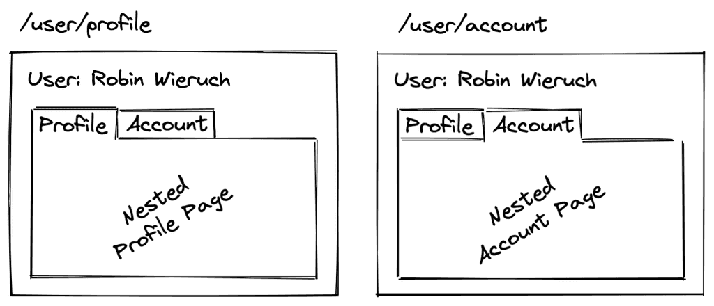

- To define nested routes, use the `children` property of the route object

  ```ts
  const routes: Routes = [
    {
      path: 'parent-component',
      component: ParentComponent,
      children: [
        { path: '', component: FirstChildComponent },
        { path: 'child-component', component: SecondChildComponent }
      ]
    }
  ];
  ```

  - The `children` property is an array of routes that are nested inside the parent route
  - The `path` property of the child route is relative to the parent route
  - The `component` property of the child route is the component that will be displayed when the child route is navigated to

- Now, the `ChildComponent` will be displayed when the route `/parent-component/child-component` is navigated to
- The place where the child component will be displayed is defined in the parent component using the `<router-outlet>` directive

  ```html
  <!-- in parent.component.html -->
  <router-outlet></router-outlet>
  ```

---

### Redirecting Routes

**Redirecting routes** are used to redirect the user from one route to another route when the user navigates to a specific route

- To define a redirect route, use the `redirectTo` property of the route object

  ```ts
  const routes: Routes = [
    { path: '', redirectTo: '/home', pathMatch: 'full' }, // redirect to home route
    { path: 'home', component: HomeComponent },
    { path: 'store', component: StoreComponent }
  ];
  ```

  - The `redirectTo` property is used to redirect the user to the specified route when the user navigates to the route
  - The `pathMatch` property is used to determine how the router should match the URL segment to the route's path
    - `full` : the router will only redirect if the entire URL matches the path
    - `prefix` : the router will redirect if the URL starts with the path
  - **Note:** `pathMatch` is required when using `redirectTo` to avoid routing issues
    - This is because for example if we don't use `pathMatch: 'full'` and we have a route with the path `''`, the router will match this route and redirect to `/home` for every route that starts with `/`, which are all routes in the app **(infinite redirect loop)**

---

### Adding data to routes

#### Adding static data to routes

You can add static data to routes using the `data` property of the route object

```ts
const routes: Routes = [
  { path: 'home', component: HomeComponent, data: { title: 'Home' } },
  { path: 'about', component: AboutComponent, data: { title: 'About' } }
];
```

- The `data` property is an object that contains the static data to be passed to the component when the route is navigated to.
- It's commonly used to pass metadata to the component, such as the title of the page or other information that is not dynamic
- It can be accessed in the component using the `ActivatedRoute` service or as an `input` property of the component -> [more here on how to access router properties](#route-properties-params-and-query-params)

---

#### Adding dynamic data to routes (Resolvers)

See this part: [How to implement Route Resolvers](#how-to-implement-route-resolvers)

---

#### Adding title to routes window tab

You can add a title to the window tab of the browser when navigating to a route by using:

- Option 1: the `title` option in the route object

  ```ts
  const routes: Routes = [
    {
      path: 'home',
      component: HomeComponent,
      title: 'Home Page' // this will set the title of the window tab to 'Home Page'
    },
    {
      path: 'about',
      component: AboutComponent,
      title: 'About Page' // this will set the title of the window tab to 'About Page'
    }
  ];
  ```

- Option 2: the `Title` service in Angular

  ```ts
  import { Title } from '@angular/platform-browser';

  constructor(private titleService: Title) {}

  ngOnInit() {
    this.titleService.setTitle('Home Page');
  }
  ```

---

## Router Outlet

It's the placeholder that Angular uses to display the component based on the current route.

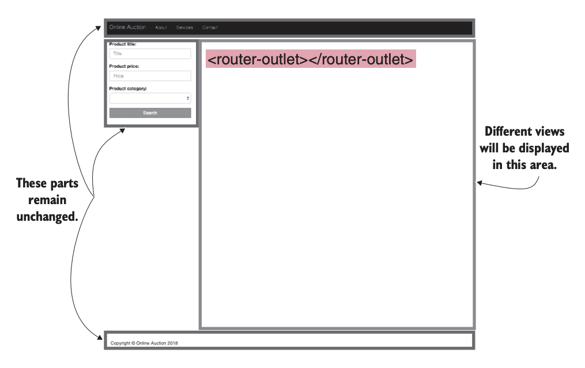

- We have main `<router-outlet>` in the `app.component.html` file to display the component based on the current route

  ```html
  <!-- in app.component.html -->
  <h1>Angular Router App</h1>
  <nav>
    <ul>
      <li>
        <a routerLink="/first-component" routerLinkActive="blue-text">First Component</a>
      </li>
    </ul>
  </nav>
  <!-- The routed views render in the <router-outlet>-->
  <router-outlet></router-outlet>
  ```

- We also can have multiple `<router-outlet>` in the app to display nested routes (child routes)
  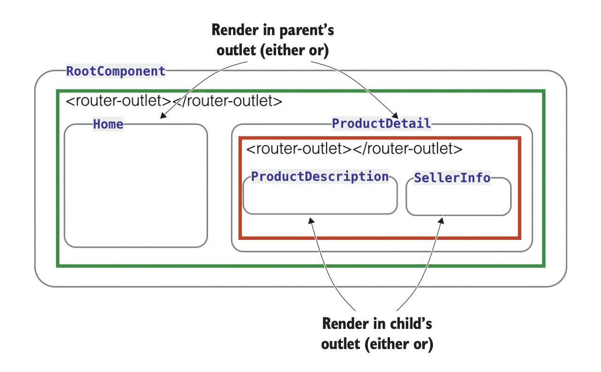

---

### Multiple Router Outlets

You can have multiple `<router-outlet>` in the app to display nested routes (child routes).

- This is useful when you want to display multiple components based on the current route, like a dashboard with multiple sections, each with its own `<router-outlet>`

- This can be done by:
  - Having one primary (default) `<router-outlet>` and one or more named `<router-outlet>`s

  - First, giving each `<router-outlet>` a unique name using the `name` attribute

    ```html
    <nav>
      <ul>
        <li>
          <a routerLink="/home" routerLinkActive="blue-text">Home</a>
        </li>
        <li>
          <a [routerLink]="[{ outlets: { aux: ['chat'] } }]" routerLinkActive="blue-text">Chat</a>
        </li>
      </ul>
    </nav>

    <router-outlet></router-outlet>
    <router-outlet name="chat"></router-outlet>
    ```

  - Then, defining the routes for each outlet using the `outlet` property of the route object

    ```ts
    export const routes: Routes = [
      { path: '', redirectTo: 'home', pathMatch: 'full' },
      { path: 'home', component: HomeComponent },
      { path: 'chat', component: ChatComponent, outlet: 'aux' }
    ];
    ```

    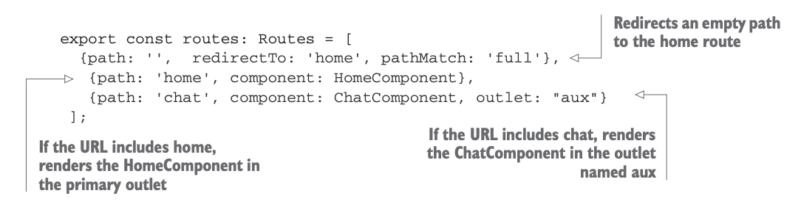

  - The result will be:
    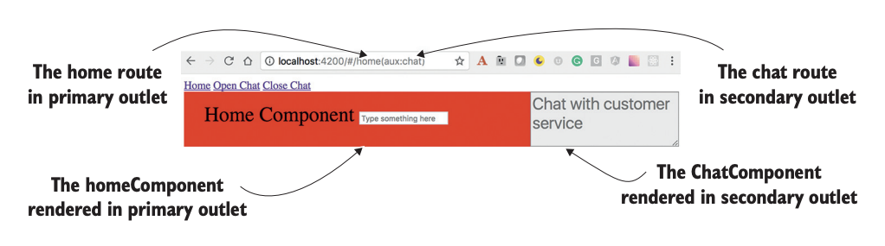

---

## Router Data (route)

Angular doesn't replace the entire page when navigating between routes, it only updates the view based on the current route. This is done using the `<router-outlet>` directive which acts as a placeholder for the component that will be displayed based on the current route.

- To show the component based on the route, use the `<router-outlet>` directive in the `app.component.html` file

  ```html
  <h1>Angular Router App</h1>
  <!-- This nav gives you links to click, which tells the router which route to use (defined in the routes constant in  AppRoutingModule) -->
  <nav>
    <ul>
      <li>
        <a routerLink="/first-component" routerLinkActive="blue-text">First Component</a>
      </li>
    </ul>
  </nav>
  <!-- The routed views render in the <router-outlet>-->
  <router-outlet></router-outlet>
  ```

- It shows the component based on the route
  

---

### Route Properties (Params and Query Params)

In order to access the route parameters, we can use the `ActivatedRoute` service in the component


#### `ActivatedRoute`

- The `ActivatedRoute` is a service used to access the route parameters and query parameters of the route
  - To be able to use the `ActivatedRoute` service, we need to inject it into the component using **dependency injection**

    ```ts
    constructor(private route: ActivatedRoute) {} // inject the ActivatedRoute service
    ```

- The `ActivatedRoute` has multiple properties that can be used to access the route parameters and query parameters.
- It provides access to information from the current route in **2 ways: (Observables and Snapshots)**
  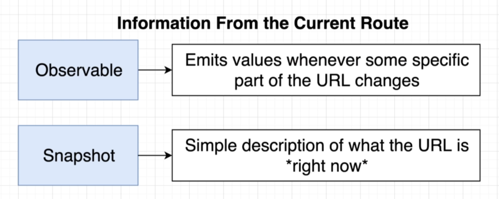
  - **Using Observables** (recommended ✅)
    - This is done by subscribing to the `params` and `queryParams` properties of the `ActivatedRoute` service
    - they are all (`BehaviorSubject`) that can be subscribed to **in order to get the updated values when they change**
      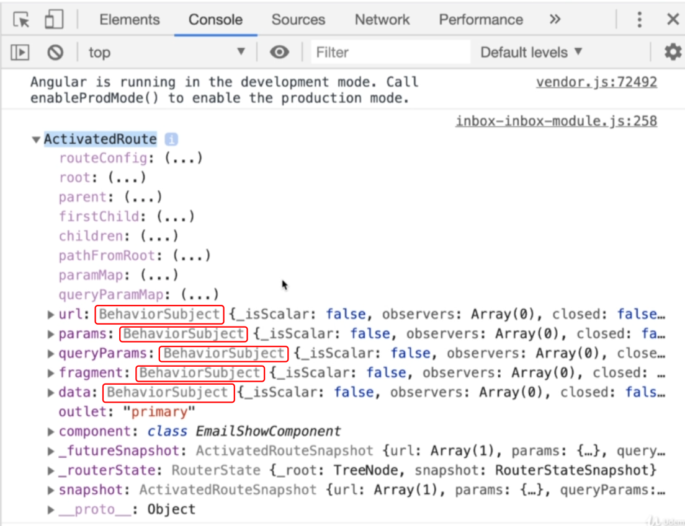
    - The `ActivatedRoute` service has a property called `params` that is an `Observable` that contains the route parameters

      ```ts
      this.route.params.subscribe(params => {
        console.log(params.id); // log the route parameter id
      });
      ```

    - The `ActivatedRoute` service has a property called `queryParams` that is an `Observable` that contains the query parameters

      ```ts
      this.route.queryParams.subscribe(params => {
        console.log(params.id); // log the query parameter id
      });
      ```

  - **Using Snapshots** (not recommended ❌)
    - This is done by using the `snapshot` property of the `ActivatedRoute` service
    - The `snapshot` property contains the current value of the route parameters and query parameters
      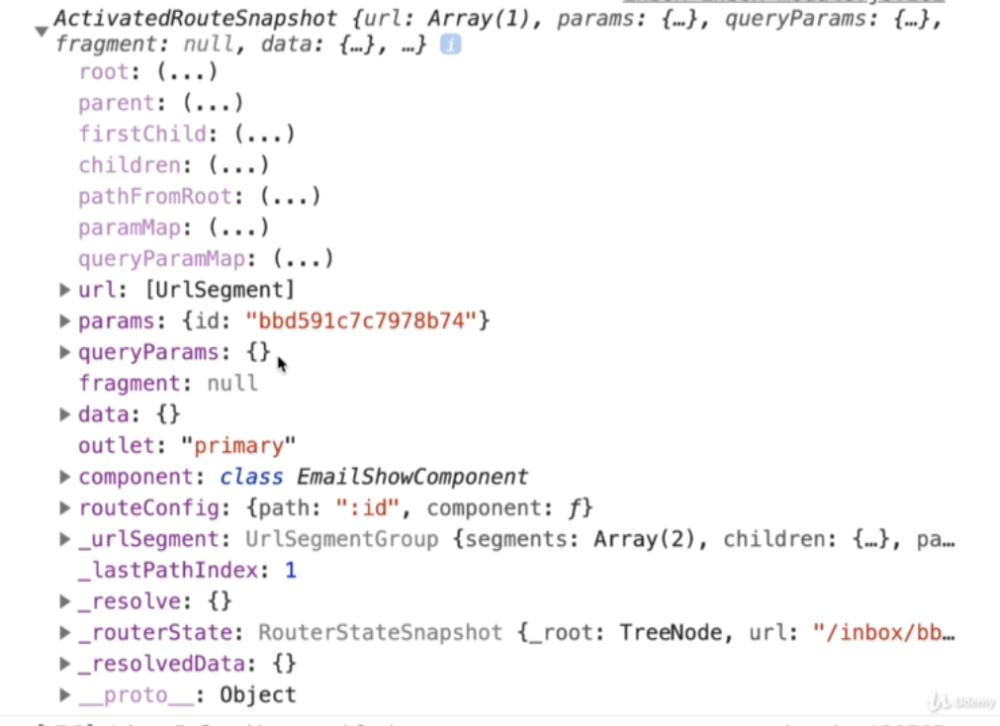
    - It doesn't provide live updates when the route parameters or query parameters change

    ```ts
    ngOnInit() { // or in the constructor
      console.log(this.route.snapshot.params.id); // log the route parameter id
      console.log(this.route.snapshot.queryParams.id); // log the query parameter id
    }
    ```

- **Example:**

  ```ts
  // in first.component.ts
  import { Component, OnInit } from '@angular/core';
  import { ActivatedRoute } from '@angular/router';

  @Component({
    selector: 'app-first',
    templateUrl: './first.component.html',
    styleUrls: ['./first.component.css']
  })
  export class FirstComponent implements OnInit {
    constructor(private route: ActivatedRoute) {} // inject the ActivatedRoute service (dependency injection) and use it in the component using `this.route`

    ngOnInit() {
      this.route.params.subscribe(params => {
        console.log(params.id); // log the route parameter id
      });

      this.route.queryParams.subscribe(params => {
        console.log(params.id); // log the query parameter id
      });
    }
  }
  ```

> **When to use Observables vs Snapshots?**
>
> The snapshot property of ActivatedRoute gives you the route parameters just once—when the component loads. Use it if the parameters never change. If the parameters can change while the component is active (like clicking different products), use ActivatedRoute.paramMap and subscribe to it, so your component updates automatically.

- **Notes:**
  - The `params` property of the `ActivatedRoute` service is an `Observable` that contains the route parameters
  - The `queryParams` property of the `ActivatedRoute` service is an `Observable` that contains the query parameters
  - The `subscribe` method of the `Observable` is used to subscribe to the `Observable` and get the value of the `Observable`

---

#### `ActivatedRouteSnapshot` and `RouterStateSnapshot`

They are used to access the route parameters and query parameters of the route **WITHOUT** subscribing to the `Observable`

- This is done by using the `snapshot` property of the `ActivatedRoute` service

  ```ts
  console.log(this.route.snapshot.params.id); // log the route parameter id
  console.log(this.route.snapshot.queryParams.id); // log the query parameter id
  ```

- **Example:**

  ```ts
  // in first.component.ts
  import { Component, OnInit } from '@angular/core';
  import { ActivatedRoute } from '@angular/router';

  @Component({
    selector: 'app-first',
    templateUrl: './first.component.html',
    styleUrls: ['./first.component.css']
  })
  export class FirstComponent implements OnInit {
    constructor(private route: ActivatedRoute) {} // inject the ActivatedRoute service (dependency injection)

    ngOnInit() {
      console.log(this.route.snapshot.params.id); // log the route parameter id
      console.log(this.route.snapshot.queryParams.id); // log the query parameter id
    }
  }
  ```

- **Notes:**
  - By using the `snapshot` property of the `ActivatedRoute` service, **We won't be able to get the updated values** of the route parameters and query parameters when they change **(no live updates, only initial values when the component is initialized)**

---

## Router Navigation (router)

### Location strategies

**URL Structure:**
A typical URL consists of several parts:

```diagram
http://mysite.com:8080/users/123?sort=name#section
│      │         │    │        │         │
│      │         │    │        │         └─ Fragment (hash)
│      │         │    │        └─ Query parameters
│      │         │    └─ Path segments
│      │         └─ Port number
│      └─ Domain name
└─ Protocol
```

In a non-SPA, changing any character in the preceding URL results in a new request to the server. In SPAs, you need the ability to modify the URL without forcing the browser to make a server-side request so the application can locate the proper view on the client. Angular offers two location strategies for implementing client-side navigation: **(HashLocationStrategy & PathLocationStrategy)**

#### Hash-based Navigation

Hash-based navigation uses a `#` in the URL to separate the base URL from the client-side route. This strategy works in all browsers, including older ones, and doesn't require server configuration.

- Example: `http://localhost:4200/#/users/123`
  - The part after `#` is handled by the client and not sent to the server.
  - Gmail uses this strategy for its web app.
- It works with all browsers, including older ones.
- To enable this strategy in Angular, configure the `HashLocationStrategy`:

```ts
// 📄 app.module.ts
import { HashLocationStrategy, LocationStrategy } from '@angular/common';

@NgModule({
  providers: [{ provide: LocationStrategy, useClass: HashLocationStrategy }] // <- provide HashLocationStrategy
})
export class AppModule {}
```

#### History API-based navigation (Default)

The browser's History API allows you to move back and forth through the user's navigation history as well as programmatically manipulate the history stack. In particular, the `pushState()` method is used to attach a segment to the base URL as the user navigates your SPA.

- It uses the HTML5 History API (`pushState`, `replaceState`, `popstate`) to manage navigation without reloading the page.

Consider the following URL: `http://mysite.com:8080/products/page/3` **(note the absence of the hash sign)**. The URL segment `products/page/3` can be pushed (attached) to the base URL programmatically without using the hash tag. If the user navigates from page 3 to 4, the application's code will push the URL segment `products/page/4`, saving the previously visited `products/page/3` in the browser history.

- Angular spares you from invoking `pushState()` explicitly—you just need to configure the URL segments and map them to the corresponding components. With the History API–based location strategy, you need to tell Angular what to use as a base URL in your application so it can properly append the client-side URL segments. If you want to serve an Angular app on a non-root path, you have to do the following:
  - Add the `<base>` tag to the header of index.html, such as `<base href="/mypath">`, or use the `--base-href` option while running `ng build`. Angular CLI-generated projects include `<base href="/">` in index.html.

  - Assign a value for the `APP_BASE_HREF` constant in the root module and use it as the providers value. The following listing uses `/` as a base URL, but it can be any URL segment that denotes the end of the base URL.

    ```ts
    import { APP_BASE_HREF } from '@angular/common';
    // ...
    @NgModule({
      // ...
      providers: [{ provide: APP_BASE_HREF, useValue: '/mypath' }] // <- set base href for the app
    })
    class AppModule {}
    ```

    > `APP_BASE_HREF` affects how the router resolves `routerLink` properties and the `router.navigate()` calls within the app, whereas the `<base href="...">` tag affects how the browser resolves URLs when loading static resources like `<link>`, `<script>`, and `` tags.

- **Example:**
  - The image below shows a snapshot of the home page of the application with the Chrome Developer Tools panel open. Because the path property of the configured home route had an empty string, Angular didn’t add anything to the base URL of the page. But the anchor under the Product Details link has already been converted into a regular HTML tag. When the user clicks the Product Details link, the router will attach a hash sign and add `/product/1234` to the base URL so that the absolute URL of the product-detail view will become `http:// localhost:4200/#/product/1234`.
    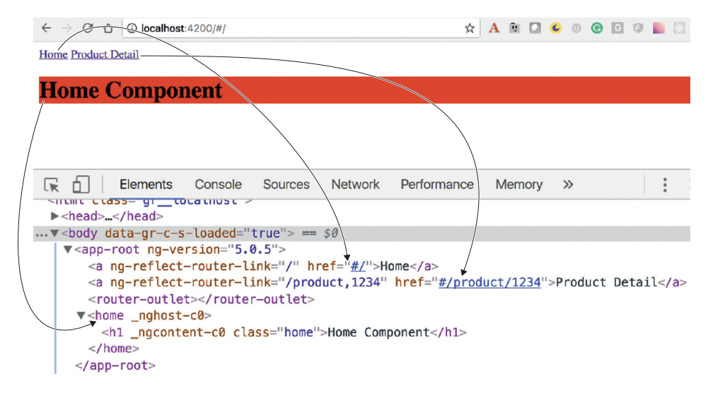

---

### `routerLink`

- To navigate to a route, use the `routerLink` attribute/directive instead of `href` in the `<a>` tag

  > We don't use `href` to navigate to a route, we use `routerLink` instead
  >
  > This is because if we use `href` attribute, the page will reload and the app will lose its state, but if we use `routerLink`, the app will not lose its state and the page will not reload

  ```html
  <nav>
    <ul>
      <li>
        <a routerLink="/first-component" routerLinkActive="blue-text">First Component</a>

        <!-- Dynamic route with parameters -->
        <a [routerLink]="['/first-component', 1]">First Component with ID 1</a>

        <!-- routerlink with query params -->
        <a [routerLink]="['/first-component']" [queryParams]="{ id: 1 }">First Component</a>
      </li>
    </ul>
  </nav>
  ```

- The `routerLink` (directive / attribute) is used to navigate to a route when the link is clicked
  - It takes the path of the route as an argument, and set-up the path for this link with extra handling from Angular so that it doesn't reload the page

- Check this: [Relative RouterLink References](#relative-router-link-references-nested-routes)
  - You can use relative paths to navigate to a route

    ```html
    <a [routerLink]="'./'">First Component</a>
    <!-- relative path to the current route -->
    <a [routerLink]="'../'">Parent Component</a>
    <!-- relative path to the parent route -->
    ```

- The `routerLinkActive` (directive / attribute) is used to apply a class to the link when the route is active
  - Make sure to use the **`exact`** option to prevent partial matching routes (specially with nested routes)

- The `queryParams` property is used to pass query parameters to the route

  ```html
  <a [routerLink]="'./'" [queryParams]="{ order: 'asc'}">sort by asc</a>
  <a [routerLink]="'./'" [queryParams]="{ order: 'desc'}">sort by desc</a>
  ```

  - The `queryParams` property takes an object with the query parameters to pass to the route
  - The `queryParams` will be added to the URL as query parameters when the link is clicked

- **Notes:**
  - There's another alternative syntax for `routerLink` that uses an array of strings to navigate to a route

    ```html
    <!-- This will route to "/first-component" -->
    <a [routerLink]="['/first-component']">First Component</a>

    <!-- This will route to "/first-component/1" -->
    <a [routerLink]="['/first-component', 1]">First Component</a>

    <!-- This will route to "/first-component/1/edit" -->
    <a [routerLink]="['/first-component', 1, 'edit']">First Component</a>
    ```

  - If you don't want to change the url in the address-bar in the browser when navigating to a route, you can use the `skipLocationChange` option

    ```html
    <a [routerLink]="['/first-component']" [queryParams]="{ id: 1 }" [skipLocationChange]="true">
      First Component
    </a>
    ```

    - This will navigate to the route without changing the url in the address-bar in the browser

---

### Styling the Router Links

- `routerLinkActive` : it's an attribute directive that applies a class if the router link is matched

  ```html
  <a routerLink="/first-component" routerLinkActive="active-link">First Component</a>
  <a routerLink="/second-component" routerLinkActive="active-link">Second Component</a>
  ```

  ```css
  /* in styles.css */
  .active-link {
    color: blue;
    font-weight: bold;
  }
  ```

- `[routerLinkActiveOptions]="{exact:true}"` to prevent `Partial Matching Routes` to make it exact route **usually with main route `"/"` or with nested routes**
  - This is useful when you have nested routes and you want to apply the class only to the exact route, and not partial matching routes

  ```html
  <a routerLink="./" routerLinkActive="active-link" [routerLinkActiveOptions]="{ exact: true }">
    First Component
  </a>
  ```

---

### Navigating to route programmatically

- To navigate to a route programmatically, use the (`navigate()` or `navigateByUrl()`) methods of the `Router` service in the component
  - `navigateByUrl()` : it takes a string as an argument, which is the url to navigate to

    ```ts
    this.router.navigateByUrl('/first-component'); // navigate to the /first-component route
    this.router.navigateByUrl('/first-component?id=1'); // navigate to the /first-component route with query parameter id=1
    ```

  - `navigate()` : it takes an array of the path of the route as an argument, or an object with additional options (more flexible)

    ```ts
    this.router.navigate(['/first-component']); // navigate to the /first-component route
    this.router.navigate(['/first-component'], {
      queryParams: { id: 1 }
    }); // navigate to the /first-component route with query parameter id=1
    ```

- The `Router` service is used to navigate to a route programmatically
  - To be able to use the `Router` service, we need to inject it into the component using **dependency injection**

    ```ts
    constructor(private router: Router) {} // inject the Router service
    ```

  - The `navigate` method of the `Router` service is used to navigate to a route
    - The `navigate` method takes an array of the path of the route as an argument, or an object with additional options

      ```ts
      this.router.navigate(['/first-component']); // navigate to the /first-component route

      // or

      this.router.navigate({
        path: '/first-component',
        queryParams: { id: 1 }
      });
      ```

- It is also possible to navigate to a route with query parameters using the `navigate` method
  - The `queryParams` property is used to pass query parameters to the route

    ```ts
    this.router.navigate(['/first-component'], {
      queryParams: { id: 1 },
      replaceUrl: true // optional, to replace the current URL in the browser history (prevent going back to the previous URL)
    });
    ```

- Example:

  ```ts
  // in app.component.ts
  import { Component } from '@angular/core';
  import { Router } from '@angular/router';

  @Component({
    selector: 'app-root',
    templateUrl: './app.component.html',
    styleUrls: ['./app.component.css']
  })
  export class AppComponent {
    constructor(private router: Router) {} // inject the Router service (dependency injection)

    navigateToFirstComponent() {
      this.router.navigate(['/first-component']);
    }
  }
  ```

---

### Relative Router Link References (Nested Routes)

When we use nested (child) routes, we need to use relative paths to navigate to the child routes to avoid routing issues

- one issue is that if we use the absolute path `('/')` to navigate to the child route main route will be replaced with the child route

- Instead we use unix-like relative paths to navigate to the child routes
  

  ```html
  <a routerLink="./child-component">Child Component</a>
  ```

  - The `./` is used to navigate to the child route from the parent route
  - The `../` is used to navigate to the parent route from the child route

---

## Router Events

The Angular Router emits various events during the navigation process. You can listen to these events to perform actions based on the navigation state.

- To listen to router events, you can subscribe to the `events` observable of the `Router` service

  ```ts
  this.router.events.subscribe(event => {
    // handle the event
  });
  ```

---

## Lazy Loading

**Lazy loading** is a technique in Angular that allows you to load the modules of the app only when they are needed (on-demand)

> The default way of loading route's modules/components is called **Eager Loading**. In this case, all modules are loaded at the start of the application, which can lead to longer initial load times and larger bundle sizes.

- It is used to improve the performance of the app by reducing the initial load time
- It is used to reduce the size of the app by loading only the modules that are needed
- Usually it's used for large modules that are not needed when the app is loaded **(for the main routes in the main app module)**
- Example: **Eager vs Lazy Loading**
  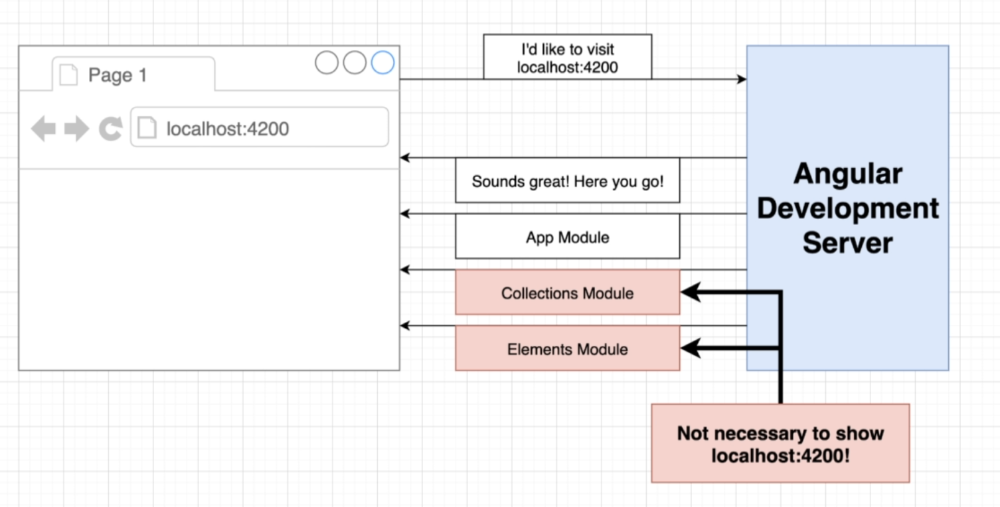
  

- **Note:** If you want to see the effect on the bundles, you can:
  - check the terminal output after building the app using `ng build --prod` command. You will see that the lazy-loaded modules are in separate chunks, which are loaded on demand when the user navigates to the corresponding routes. it will be something like this:

    ```sh
    chunk {main} main.js (main) 200 kB [initial] [rendered]
    chunk {polyfills} polyfills.js (polyfills) 50 kB [initial] [rendered]
    chunk {runtime} runtime.js (runtime) 6 kB [entry] [rendered]
    chunk {lazy-lazy-module} lazy-lazy-module.js (lazy-lazy-module) 123 kB [rendered] # 👈
    chunk {styles} styles.js (styles) 20 kB [initial] [rendered]
    ```

  - Alternatively, you can use browser developer tools (like Chrome DevTools) to monitor network requests. When you navigate to a lazy-loaded route, you should see a new network request for the corresponding chunk file, indicating that the module is being loaded on demand.
    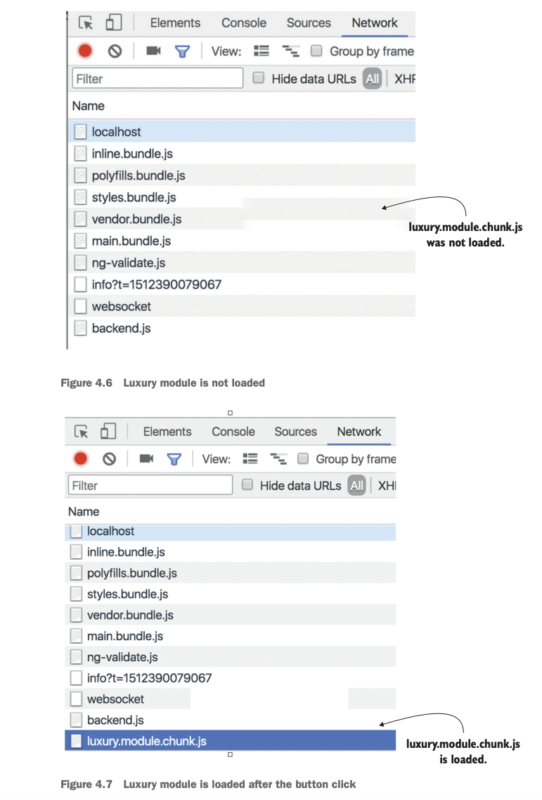

> **TIP:** Make the root module of your app as small as possible. Split the rest of your app into lazy-loaded modules, and users will praise the performance of your app.

---

### Implementing Lazy Loading

#### Old way of lazy loading (modules)


- **Steps to implement Lazy Loading:**
  1. **Create a new module** that you want to lazy load
  2. **Remove the module from the imports array** of the `AppModule`
  3. **Add the module to the routes array** of the `AppRoutingModule` with the `loadChildren` property and rules on how to load the module
  4. **Remove the module from the imports array** of the `DomainModule` (if it is imported)
  5. **Remove the module from the imports array** of the `RoutingModule` (if it is imported)

- **Example:**

  ```ts
  // in app-routing.module.ts
  const routes: Routes = [
    { path: '', component: HomeComponent },
    { path: 'first-component', component: FirstComponent },
    { path: 'second-component', component: SecondComponent },
    { path: 'lazy', loadChildren: () => import('./lazy/lazy.module').then(m => m.LazyModule) }
  ];
  ```

  ```ts
  // in lazy-routing.module.ts
  // We must create a routing module for the lazy-loaded module
  const routes: Routes = [{ path: '', component: LazyComponent }];
  ```

  - The `loadChildren` property is used to lazy load the module `LazyModule` when the route `/lazy` is navigated to
  - The `loadChildren` property takes a function that returns a `Promise` that resolves to the module to load
  - The `import` function is used to import the module `LazyModule` and the `then` method is used to return the module
  - `m.LazyModule` is the module that is returned by the `then` method, **which is the module to load when the route `/lazy` is navigated to**
  - When the route is activated, the `LazyModule` will be loaded on demand, and it also contains a `routes` array with the routes for the lazy-loaded module

- **Notes:**
  - The lazy loaded module should be set up in its own `Domain module` and `Routing module` **with empty string path** to avoid routing issues
    
    

---

#### New way of lazy loading (standalone components)

- **Steps to implement Lazy Loading:**
  1. **Create a new standalone component** that you want to lazy load
  2. **Remove the component from the imports array** of the `AppModule`
  3. **Add the component to the routes array** of the `AppRoutingModule` with the `loadComponent` property and rules on how to load the component
  4. **Remove the component from the imports array** of the `DomainModule` (if it is imported)
  5. **Remove the component from the imports array** of the `RoutingModule` (if it is imported)

- **Example:**

  ```ts
  // in app-routing.module.ts
  const routes: Routes = [
    { path: '', component: HomeComponent },
    { path: 'first-component', component: FirstComponent },
    { path: 'second-component', component: SecondComponent },
    {
      path: 'lazy',
      loadComponent: () => import('./lazy/lazy.component').then(m => m.LazyComponent)
    }
  ];
  ```

---

### Preloading

Let's say we have a large application with multiple lazy-loaded modules. When a user navigates to a route that requires a lazy-loaded module, there might be a noticeable delay as the module is fetched from the server. To improve the user experience, we can use preloading to load these modules in the background after the initial application load.

- With Angular preloaders, you can do the following:
  - Load lazy-loaded modules in the background after the initial application load
  - Improve the user experience by reducing the delay when navigating to lazy-loaded routes
  - Control which modules to preload based on certain conditions (like user roles or network speed)
  - Specify the preloading strategy to use for the lazy-loaded modules

- **How to enable Preloading:**
  - To enable preloading, you need to configure the `RouterModule` in the `AppRoutingModule` with a preloading strategy

    ```ts
    import { NgModule } from '@angular/core';
    import { RouterModule, Routes, PreloadAllModules } from '@angular/router';

    const routes: Routes = [
      // your routes here
    ];

    @NgModule({
      imports: [
        RouterModule.forRoot(routes, {
          preloadingStrategy: PreloadAllModules // 👈 enable preloading with PreloadAllModules strategy
        })
      ],
      exports: [RouterModule]
    })
    export class AppRoutingModule {}
    ```

#### Preloading Strategies

- Angular provides two built-in preloading strategies:
  1. `PreloadAllModules`: This strategy preloads all lazy-loaded modules in the background after the initial application load. This is useful when you want to ensure that all modules are available for navigation without any delay.

  2. `NoPreloading`: This strategy does not preload any lazy-loaded modules. **This is the default behavior** if no preloading strategy is specified.

- You can also create custom preloading strategies by implementing the `PreloadingStrategy` interface. This allows you to define your own logic for determining which modules to preload based on specific conditions.
  - Say you have two lazy modules, `LuxuryModule` and `SuperLuxuryModule`, and you want to preload only the first. You can add some Boolean variable (for example, `preloadme: true`) to the configuration of the luxury path:

    ```ts
    const routes: Routes = [
      {
        path: 'luxury',
        loadChildren: () => import('./luxury/luxury.module').then(m => m.LuxuryModule),
        data: { preloadme: true } // 👈
      },
      {
        path: 'super-luxury',
        loadChildren: () =>
          import('./super-luxury/super-luxury.module').then(m => m.SuperLuxuryModule),
        data: { preloadme: false } // 👈
      }
    ];
    ```

  - Then, you can create a custom preloading strategy that checks this variable and preloads only the modules with `preloadme: true`:

    ```ts
    import { PreloadingStrategy, Route } from '@angular/router';
    import { Observable, of } from 'rxjs';

    export class CustomPreloadingStrategy implements PreloadingStrategy {
      // it must implement the `preload` method
      preload(route: Route, load: () => Observable<any>): Observable<any> {
        return route.data && route.data['preloadme'] ? load() : of(null); // or return EMPTY;
      }
    }
    ```

  - Finally, you need to provide this custom preloading strategy in the `AppRoutingModule`:

    ```ts
    import { NgModule } from '@angular/core';
    import { RouterModule, Routes } from '@angular/router';
    import { CustomPreloadingStrategy } from './custom-preloading.strategy';
    import routes from './app.routes';

    @NgModule({
      imports: [
        RouterModule.forRoot(routes, {
          preloadingStrategy: CustomPreloadingStrategy // 👈 use custom preloading strategy
        })
      ],
      exports: [RouterModule],
      providers: [CustomPreloadingStrategy] // 👈 provide the custom preloading strategy
    })
    ```

---

## Route Guards

**Route guards** are used to protect the routes of the app and control the navigation (to & from) the routes by **restricting access to certain routes based on certain conditions**

- They are used to prevent **unauthorized** users from accessing certain routes
  - They are used to prevent users from navigating to certain routes based on certain conditions
    - For example, preventing users from accessing a route if they are not logged in
      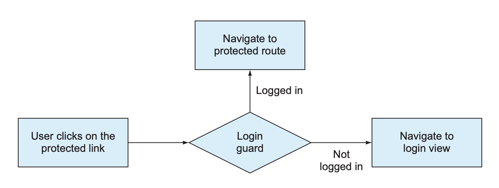
- They're **Classes** that implement a specific interface and contain a method that returns a `boolean` or an `observable` that resolves to a `boolean`
  

  > In newer versions of Angular, the guards are **functions instead of classes**, but they still implement the same logic
  - This `boolean` value determines whether the user can navigate to the route

- **Use cases for Router Guards:**
  - Preventing unauthorized access to certain routes (e.g., admin routes)
  - Preventing users from navigating away from a route when there are unsaved changes in a form
  - Preventing navigation to the route before certain data is loaded

- **Guard Interfaces:**
  
  - `canActivate` : to prevent the user from navigating to a route
  - `canMatch` **(NEW)**: to prevent the user from navigating to a route based on certain conditions (used for advanced routing scenarios)
  - `canActivateChild` : to prevent the user from navigating to the child routes of a route
  - `canLoad` : to prevent the user from loading the module of a route **(lazy loaded modules)**
  - `resolve` : to ensure that the required data is retrieved before navigating to a route
  - `canDeactivate` : to prevent the user from leaving a route
    - It's confusing for beginners, but it's used to prevent the user from leaving a route **when there are unsaved changes in the form or other conditions**
      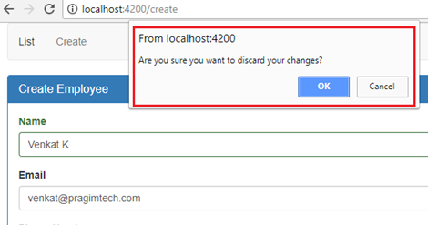
    - Usually it will be inside the component that is being navigated away from and we will export the guard function from the component and use it in the routes file, so that it will have access to the component instance and its properties

---

### Implementing Router Guards

#### NEW: Guards Using Functions

- **Steps to implement Router Guards:**
  1. **Create a function** that implements the guard logic (it should return a `boolean` or an `Observable` that resolves to a `boolean`)
  2. **Add the function to the routes** using the `canActivate` property
  3. the guard property **takes an array of functions**, so you can add multiple guards to the route

  ```ts
  // routes.ts
  import { Routes } from '@angular/router';
  import { canActivate } from '@angular/router';
  import { FirstComponent } from './first/first.component';
  import { SecondComponent } from './second/second.component';

  const authGuard: CanMatchFn = (
    route: ActivatedRouteSnapshot,
    state: RouterStateSnapshot
  ): boolean | Observable<boolean> => {
    // Implement your guard logic here
    // For example, check if the user is authenticated
    const isAuthenticated = true; // Replace with actual authentication check
    return isAuthenticated; // Return true to allow navigation, false to prevent it
  };

  export const routes: Routes = [
    { path: '', component: HomeComponent },
    { path: 'first-component', component: FirstComponent, canMatch: [authGuard] }, // 👈
    { path: 'second-component', component: SecondComponent }
  ];
  ```

- Notes:
  - We can use multiple guards in the `canActivate` property by passing an **array of functions**.
  - It's sometimes recommended to use the `canMatch` guard instead of `canActivate` for advanced routing scenarios, especially when dealing with lazy-loaded modules or complex route configurations
  - It's recommended to not return `false` directly in the guard function, but rather return an `Observable` that resolves to `false` to allow for asynchronous checks (like API calls or other asynchronous operations)
  - Also it's not recommended to return falsy values directly, as this can lead to crashing the app or unexpected behavior. Instead, we should redirect the user to a specific route using `new RedirectCommand()` or return an `Observable` that resolves to `false` or a `UrlTree` to redirect the user to a specific route
  - If you want to return observables instead of boolean values, you must know that **the guard will wait for the observable to (complete) before allowing or preventing navigation**, so make sure the observable completes (for example, using `take(1)` operator from `rxjs` which takes the first value **and completes the observable**)

---

#### OLD: Guards Using Classes

- **Steps to implement Router Guards:**
  1. **Create a new guard** using the Angular CLI
  2. **Implement the guard** by adding the logic to the guard
  3. **Add the guard to the routes** of the `AppRoutingModule` using the `canActivate` property

- **Example:**
  - 1️⃣ **Create a new guard** using the Angular CLI

    ```bash
    ng generate guard auth/Auth
    ```

    - Note: Angular will add `guard` to the name of the guard automatically, so you don't need to add it because it will be `AuthGuardGuard` if you add `guard` to the name
      - in newer versions of Angular, the guard will be a `function` instead of a `class`

  - 2️⃣ This will generate a new guard called `auth.guard.ts` in the `src/app` directory

    ```ts
    // in auth.guard.ts
    import { Injectable } from '@angular/core';
    import {
      CanActivate,
      ActivatedRouteSnapshot,
      RouterStateSnapshot,
      UrlTree
    } from '@angular/router';
    import { Observable } from 'rxjs';

    @Injectable({
      providedIn: 'root'
    })
    export class AuthGuard implements CanActivate {
      canActivate(
        route: ActivatedRouteSnapshot,
        state: RouterStateSnapshot
      ): Observable<boolean | UrlTree> | Promise<boolean | UrlTree> | boolean | UrlTree {
        return true; // return true to allow the user to navigate to the route
      }
    }
    ```

    - The `canActivate` method of the `AuthGuard` class is used to determine whether the user can navigate to the route
    - The `canActivate` method takes the `ActivatedRouteSnapshot` and `RouterStateSnapshot` as arguments
    - The `canActivate` method returns a `boolean` or an `Observable` that resolves to a `boolean` to allow the user to navigate to the route

  - 3️⃣ **Add the guard to the routes** of the `AppRoutingModule` using the `canActivate` property

    ```ts
    // in app-routing.module.ts
    const routes: Routes = [
      { path: '', component: HomeComponent },
      { path: 'first-component', component: FirstComponent, canActivate: [AuthGuard] }, // 👈
      { path: 'second-component', component: SecondComponent }
    ];
    ```

    - The `canActivate` property is used to add the `AuthGuard` to the route `/first-component` to prevent the user from navigating to the route
    - we can pass multiple guards to the `canActivate` property by passing an **array of guards**

- **Notes:**
  - The `canActivate` property can also take an array of guards to add multiple guards to the route

    ```ts
    { path: 'first-component', component: FirstComponent, canActivate: [AuthGuard, AnotherGuard] }
    ```

---

#### Complex guards

- Guards are methods/functions that take 2 parameters: `ActivatedRouteSnapshot` and `RouterStateSnapshot`, and return a `boolean` or an `Observable` that resolves to a `boolean`
  - `ActivatedRouteSnapshot`: contains information about the route that is being navigated to
  - `RouterStateSnapshot`: contains information about the state of the router at the time of navigation
- There parameters usually is not used in simple guards, but they are useful in advanced guards where we need to access the route parameters or query parameters to determine whether the user can navigate to the route or not, like having a white-list or black-list of routes in the guard or based on user roles/permissions
- We can access the route or the component or any other service inside the guard to determine whether the user can navigate to the route or not
  - This is super useful, for example we can access the route's component instance to check if there are unsaved changes in a form before navigating away from the route using the `canDeactivate` guard

    ```ts
    canDeactivate(
      component: YourComponent, // access the component instance
      currentRoute: ActivatedRouteSnapshot,
      currentState: RouterStateSnapshot,
      nextState?: RouterStateSnapshot
    ): boolean | Observable<boolean> {
      if (component.hasUnsavedChanges()) {
        // or we can check if form is dirty using component.form.dirty
        return confirm('You have unsaved changes! Do you really want to leave?');
      }
      return true; // allow navigation if there are no unsaved changes
    }
    ```

---

### Route Guards Examples

- **Auth Guard Example:**
  - We will create an `AuthService` that will handle the authentication logic
  - We will create an `AuthGuard` that will use the `AuthService` to check if the user is authenticated
    - If the user is authenticated, the guard will return `true` to allow the user to navigate to the route
    - If the user is not authenticated, the guard will redirect the user to the login page and return `false` to prevent the user from navigating to the route
  - We will add the `AuthGuard` to the routes to protect the routes

  ```ts
  // in auth.service.ts
  import { Injectable } from '@angular/core';
  import { BehaviorSubject } from 'rxjs';

  @Injectable({
    providedIn: 'root'
  })
  export class AuthService {
    private signedin$ = new BehaviorSubject<boolean>(false); // initial state is false (not signed in)

    // method to sign in the user
    signIn() {
      this.signedin$.next(true); // set the signedin$ to true (signed in)
    }

    // method to sign out the user
    signOut() {
      this.signedin$.next(false); // set the signedin$ to false (not signed in)
    }

    // method to get the signedin$ observable
    get isSignedIn$() {
      return this.signedin$.asObservable(); // return the signedin$ as an observable
    }
  }
  ```

  ```ts
  // in auth.guard.ts
  import { Injectable } from '@angular/core';
  import {
    CanActivate,
    ActivatedRouteSnapshot,
    RouterStateSnapshot,
    UrlTree
  } from '@angular/router';
  import { Observable } from 'rxjs';
  import { map } from 'rxjs/operators';
  import { AuthService } from './auth.service';
  @Injectable({
    providedIn: 'root'
  })
  export class AuthGuard implements CanActivate {
    constructor(
      private authService: AuthService,
      private router: Router
    ) {}

    canActivate(
      route: ActivatedRouteSnapshot,
      state: RouterStateSnapshot
    ): Observable<boolean | UrlTree> | Promise<boolean | UrlTree> | boolean | UrlTree {
      return this.authService.isSignedIn$.pipe(
        map(isSignedIn => {
          if (isSignedIn) {
            return true;
          } else {
            // navigate to another route (e.g., login page) if not authenticated
            this.router.navigate(['/login']);
            return false;
          }
        })
      );
    }
  }
  ```

  ```ts
  // in app-routing.module.ts
  const routes: Routes = [
    { path: '', component: HomeComponent },
    { path: 'first-component', component: FirstComponent, canActivate: [AuthGuard] }, // 👈
    { path: 'second-component', component: SecondComponent }
  ];
  ```

- **Resolver Guard Example:**
  - See this part: [Adding dynamic data to routes (Resolvers)](#adding-dynamic-data-to-routes-resolvers)

---

### Route Guards Common Issues

#### Auth Guard always returns false or never allows navigation

- Problem:
  

  > Here, we assume that the `checkAuth` function is defined and returns a boolean indicating whether the user is authenticated or not by sending an API request to the server or checking a token in local storage

- Solution:
  
  - Instead of having the `signedin$` with only 2 boolean values (`true` or `false`), we can have 3 states: `loading / null`, `true`, `false`
    - This way, we can handle the loading state and prevent the guard from returning `false` before the authentication check is complete
  - We will use the (`skipWhile` and `take`) operators from `rxjs` to skip the loading state and take only the first non-loading state value

    ```ts
    // in auth.service.ts

    // ...
    private signedin$ = new BehaviorSubject<boolean | null>(null); // 👈 initial state is null (loading state)
    ```

    ```ts
    // in auth.guard.ts
    import { Injectable } from '@angular/core';
    import {
      CanActivate,
      ActivatedRouteSnapshot,
      RouterStateSnapshot,
      UrlTree
    } from '@angular/router';
    import { Observable } from 'rxjs';
    import { map, skipWhile, take } from 'rxjs/operators';
    import { AuthService } from './auth.service';

    @Injectable({
      providedIn: 'root'
    })
    export class AuthGuard implements CanActivate {
      constructor(private authService: AuthService) {}

      canActivate(
        route: ActivatedRouteSnapshot,
        state: RouterStateSnapshot
      ): Observable<boolean | UrlTree> | Promise<boolean | UrlTree> | boolean | UrlTree {
        return this.authService.signedin$.pipe(
          skipWhile(value => value === null), // Skip the loading state (null)
          take(1), // Take only the first non-loading state value, and mark the observable as complete
          map(isSignedIn => {
            if (isSignedIn) {
              return true; // User is authenticated, allow navigation
            } else {
              // navigate to another route (e.g., login page) if not authenticated
              // this.router.navigate(['/login']);
              return false; // User is not authenticated, prevent navigation
            }
          })
        );
      }
    }
    ```

    - We use the `skipWhile` operator to skip the loading state (`null` value)
    - We use the `take(1)` operator to take only the first non-loading state value and mark the observable as complete **(Actually it doesn't complete the observable, it just unsubscribes from it after taking the first value, but for our case it's enough because we only need the first value to determine whether to allow navigation or not. So it tricks the subscriber into thinking that the observable is complete)**

---

## Route Resolvers

> Let’s say you navigate to a product-detail component that makes an HTTP request to retrieve data. The connection is slow, and it takes two seconds to retrieve the data. This means that the user will look at the empty component for two seconds (or at least see loading state), and then the data will be displayed. That’s not a good user experience. What if the server request returns an error? The user will look at the empty component to see the error message after that. That’s why it may be a good idea to not even render the component until the required data arrives.
>
> If you want to make sure that by the time the user navigates to a route some data structures are populated, create a Resolve guard that allows getting the data before the route is activated. A `resolver` is a class that implements the Resolve interface. The code in its `resolve()` method loads the required data, and only after the data arrives does the router navigate to the route.

**Route resolvers** are used to fetch the data needed for a route before the route is activated, and then pass the data to the component

- They are used to prevent the user from navigating to the route until the data is fetched

- **Example 1:**
  - 1️⃣ **Create a new resolver** using the Angular CLI

    ```bash
    ng generate resolver data
    ```

    - Note: Angular will add `resolver` to the name of the resolver automatically, so you don't need to add it because it will be `DataResolverResolver` if you add `resolver` to the name

  - 2️⃣ This will generate a new resolver called `data.resolver.ts` in the `src/app` directory

    ```ts
    // in data.resolver.ts
    import { Injectable } from '@angular/core';
    import { Resolve, ActivatedRouteSnapshot, RouterStateSnapshot } from '@angular/router';
    import { Observable } from 'rxjs';

    @Injectable({
      providedIn: 'root'
    })
    export class DataResolver implements Resolve<any> {
      resolve(
        route: ActivatedRouteSnapshot,
        state: RouterStateSnapshot
      ): Observable<any> | Promise<any> | any {
        return null; // return the data needed for the route
      }
    }
    ```

    - The `resolve` method of the `DataResolver` class is used to fetch the data needed for the route
    - The `resolve` method takes the `ActivatedRouteSnapshot` and `RouterStateSnapshot` as arguments
    - The `resolve` method returns an `Observable`, a `Promise`, or the data needed for the route

  - 3️⃣ **Add the resolver to the routes** of the `AppRoutingModule` using the `resolve` property

    ```ts
    // in app-routing.module.ts
    const routes: Routes = [
      { path: '', component: HomeComponent },
      { path: 'first-component', component: FirstComponent, resolve: { data: DataResolver } }, // 👈 add the resolver to the route
      { path: 'second-component', component: SecondComponent }
    ];
    ```

    - The `resolve` property is used to add the `DataResolver` to the route `/first-component` to fetch the data needed for the route

- **Example 2:** resolving fetching data from a service then passing it to the component
  - 1️⃣ **Create a new service**

    ```ts
    // in data.service.ts
    import { Injectable } from '@angular/core';
    import {
      ActivatedRouteSnapshot,
      MaybeAsync,
      Resolve,
      RouterStateSnapshot
    } from '@angular/router';
    import { Email } from './email';
    import { EmailService } from './email.service';

    @Injectable({
      providedIn: 'root'
    })
    export class EmailResolverService implements Resolve<Email> {
      constructor(private emailService: EmailService) {}

      resolve(route: ActivatedRouteSnapshot, state: RouterStateSnapshot): MaybeAsync<Email> {
        const { id } = route.params;
        // call HTTP request to fetch the email data and then return it so that it can be passed to the component
        return this.emailService.getEmail(id).pipe(
          catchError(() => {
            // Handle error and return a default value or navigate to an error page
            return of({ id: '', subject: 'Error', body: 'Could not load email.' });
          })
        );
      }
    }
    ```

    - The `resolve()` method of the `EmailResolverService` class is used to fetch the email data needed for the route
    - The `resolve()` method takes the `ActivatedRouteSnapshot` and `RouterStateSnapshot` as arguments (to access the route parameters)
    - The `resolve()` method **returns an `Observable`, a `Promise`**, or the email data needed for the route
      > Angular generates the code for resolvers that auto-subscribes to the observable and stores the emitted data in the `ActivatedRoute` object.
    - **Now, the data returned will now be passed to the component through the `ActivatedRoute` service**

  - 2️⃣ **Add the resolver to the routes** of the `AppRoutingModule` using the `resolve` property

    ```ts
    // in app-routing.module.ts
    import { EmailResolverService } from './email-resolver.service';

    const routes: Routes = [
      { path: '', component: HomeComponent },
      { path: 'email/:id', component: EmailComponent, resolve: { email: EmailResolverService } },
      { path: 'first-component', component: FirstComponent },
      { path: 'second-component', component: SecondComponent }
    ];
    ```

    - The `resolve` property is used to add the `EmailResolverService` to the route `/email/:id` to fetch the email data needed for the route
    - Now in the `EmailComponent`, we can access the email data using the `email` property of the `ActivatedRoute` service

  - 3️⃣ **Use the data in the component**

    ```ts
    // in email.component.ts
    import { Component, OnInit } from '@angular/core';
    import { ActivatedRoute } from '@angular/router';
    import { Email } from './email';

    @Component({
      selector: 'app-email',
      templateUrl: './email.component.html',
      styleUrls: ['./email.component.css']
    })
    export class EmailComponent implements OnInit {
      email: Email;

      constructor(private route: ActivatedRoute) {}

      ngOnInit() {
        this.email = this.route.snapshot.data.email;
        // or using observable
        // this.route.data.subscribe(data => {
        //   this.email = data.email;
        // });
      }
    }
    ```

    - The `email` property of the `ActivatedRoute` service is used to access the email data fetched by the resolver
    - The `email` data is passed to the component using the `ActivatedRoute` service

- **Notes:**
  - The `resolve` property can also take an object with the key as the name of the data and the value as the resolver

    ```ts
    { path: 'first-component', component: FirstComponent, resolve: { data: DataResolver } }
    ```

  - The data fetched by the resolver is passed to the component using the `ActivatedRoute` service

    ```ts
    this.route.data.subscribe(data => {
      console.log(data); // log the data fetched by the resolver
    });
    ```

---

### Why we use Route Resolvers

- Prevent the user from navigating to the route until the data is fetched
- Pause rendering of the component until the data is fetched (to avoid `undefined` errors in the template)
  - I know that we can just use `*ngIf` to check if the data is available before rendering the component, or the safe navigation operator (`?.`) in the template to avoid `undefined` errors, but using resolvers is a cleaner way to handle this
- Ensure that the data is available when the component is initialized

### How to implement Route Resolvers

You can add dynamic data to routes using the `resolve` property of the route object

```ts
const routes: Routes = [
  { path: 'home', component: HomeComponent, resolve: { data: HomeResolver } },
  { path: 'about', component: AboutComponent, resolve: { data: AboutResolver } }
];
```

- The `resolve` property is used to define a resolver for the route

> **A resolver is a service that is responsible for fetching data before the route is activated**
>
> It's used to fetch data from an API or a service before the route is activated, and then pass the data to the component so that when the component is initialized, it already has the data it needs to render

- How the resolver works:
  - The `resolver` is a service that implements the `Resolve` interface
  - The `resolve` method of the resolver is called before the route is activated
  - The `resolve` method returns an `Observable`, `Promise`, or a value that contains the data to be passed to the component
    - This method will be located inside the component that is being resolved and then imported into the `routes` file
  - The data returned from the resolver is available in the component via the `ActivatedRoute` service

- **Example:**
  - Here, we first will have a resolver function inside the component

    ```ts
    // in home.component.ts
    import { resolveFn } from '@angular/core';
    import { ActivatedRouteSnapshot, RouterStateSnapshot } from '@angular/router';

    //...
    export const HomeResolver: resolveFn = (
      route: ActivatedRouteSnapshot,
      state: RouterStateSnapshot
    ) => {
      return this.dataService.getData(); // return the data to be passed to the component
    };
    ```

  - Then, we will import the resolver into the `routes` file and use it in the route

  ```ts
  import { Routes } from '@angular/router';
  import { HomeComponent } from './home/home.component';
  import { HomeResolver } from './home.resolver';

  export const routes: Routes = [
    {
      path: 'home',
      component: HomeComponent,
      resolve: {
        data: HomeResolver // we can use any alias not just 'data' and that alias will be used to access the resloved data inside the component
      }
    }
  ];
  ```

- **Resolver Notes:**
  - The resolver function runs every time the route is activated or re-activated, but by default it doesn't run when the query parameters change
    - To make the resolver run when the query parameters change, we can use the `runGuardsAndResolvers` property in the route configuration

    ```ts
    const routes: Routes = [
      {
        path: 'home',
        component: HomeComponent,
        resolve: {
          data: HomeResolver
        },
        runGuardsAndResolvers: 'paramsChange' // 👈 this will make the resolver run when the query parameters change
      }
    ];
    ```

---

### Tracking resolved data progress

- We can track the progress of the resolved data using the **`Router` events**
  - The `ResolveStart` event is emitted when the resolver starts fetching the data
  - The `ResolveEnd` event is emitted when the resolver finishes fetching the data

> **Note:** The `Router` events can be used to track the progress of the resolved data and show a loading indicator while the data is being fetched
>
> This is also commonly used with [lazy loading](#lazy-loading) to show a loading indicator while the module is being loaded

- Example:

  ```ts
  import { Router, ResolveStart, ResolveEnd } from '@angular/router';

  constructor(private router: Router) {
    this.router.events.subscribe(event => {
      if (event instanceof ResolveStart) {
        // Show loading indicator
      } else if (event instanceof ResolveEnd) {
        // Hide loading indicator
      }
    });
  }
  ```
