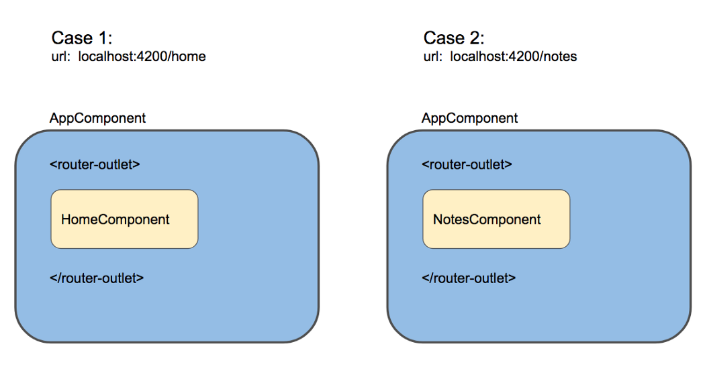
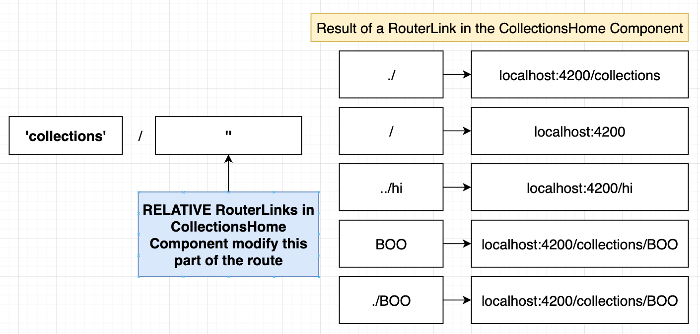
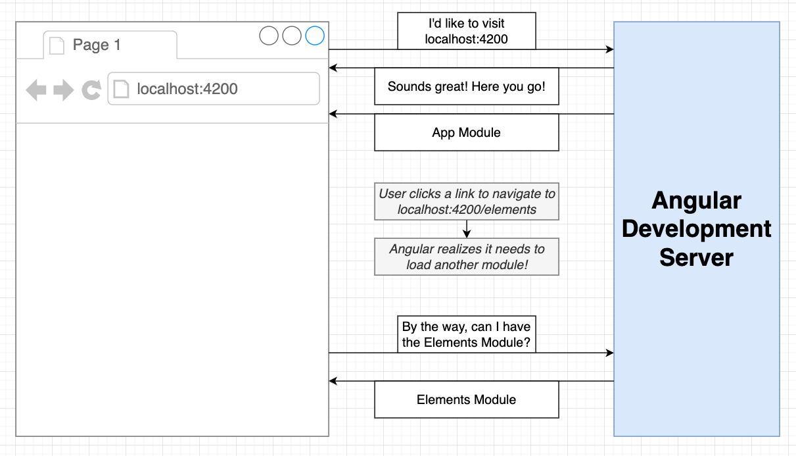

# INDEX

- [INDEX](#index)
  - [Adding Routing to an Angular App](#adding-routing-to-an-angular-app)
  - [Router configuration](#router-configuration)
    - [Routes](#routes)
      - [RouterModule.`forRoot`(ROUTES) vs RouterModule.`forChild`(ROUTES)](#routermoduleforrootroutes-vs-routermoduleforchildroutes)
    - [Nested Routes](#nested-routes)
  - [Using the Router](#using-the-router)
    - [Router directives](#router-directives)
  - [Router Navigation](#router-navigation)
    - [Navigating using the `routerLink` directive](#navigating-using-the-routerlink-directive)
    - [Navigating to route programmatically](#navigating-to-route-programmatically)
    - [Relative Router Link References (Nested Routes)](#relative-router-link-references-nested-routes)
  - [Lazy Loading](#lazy-loading)
    - [Implementing Lazy Loading](#implementing-lazy-loading)

---

## Adding Routing to an Angular App

- **Generate a new app with routing**

  ```bash
  ng new <project_name> --routing

  # or run script for creating new app and answer yes to routing
  ```

  - this will create a new app with routing enabled and generate a `app-routing.module.ts` file that contains the routes of the app

- **Add routing to an existing app**

  ```bash
  ng generate module app-routing --flat --module=app
  ```

  - this will generate a new module called `app-routing` and import it into the `app.module.ts` file

- **Generating Router Module** -> [Router module](./2-Angular-Modules.md#router-module)

---

## Router configuration

- In order to configure the routes of the app, the `RouterModule` and `Routes` are imported into the `routing module`

  ```ts
  // in app-routing.module.ts
  import { NgModule } from '@angular/core';
  import { RouterModule, Routes } from '@angular/router';
  import { FirstComponent } from './first/first.component';

  const routes: Routes = [{ path: 'first-component', component: FirstComponent }]; // sets up routes constant where you define your routes

  @NgModule({
    imports: [RouterModule.forRoot(routes)],
    exports: [RouterModule]
  })
  export class AppRoutingModule {}
  ```

- The `RouterModule.forRoot(routes)` method is used to configure the routes of the app and the `routes` constant is used to define the routes
- Each route in this array is a `JavaScript object` that contains two properties.
  - `path` -> defines the URL path for the route.
  - `component` -> defines the component Angular should use for the corresponding path.
- We can also use `RouterModule.forChild(routes)` to configure child routes

---

### Routes

- The `Routes` array is used to define the routes of the app
- Each route in the `Routes` array is a `JavaScript object` that contains two properties

  - `path` : defines the URL path for the route
  - `component` : defines the component Angular should use for the corresponding path

  ```ts
  const routes: Routes = [
    { path: 'first-component', component: FirstComponent },
    { path: 'second-component', component: SecondComponent }
  ];
  ```

- **Home route** : The home route is defined by the path `/` and is usually the first route in the `Routes` array

  ```ts
  const routes: Routes = [
    { path: '', component: HomeComponent }, // home route
    { path: 'first-component', component: FirstComponent },
    { path: 'second-component', component: SecondComponent }
  ];
  ```

  - The `HomeComponent` is the component that will be displayed when the app is loaded

- **Wildcard route** : The wildcard route is defined by the path `**` and is usually the last route in the `Routes` array

  ```ts
  const routes: Routes = [
    { path: '', component: HomeComponent },
    { path: 'first-component', component: FirstComponent },
    { path: 'second-component', component: SecondComponent },
    { path: '**', component: PageNotFoundComponent } // wildcard route
  ];
  ```

  - The `PageNotFoundComponent` is the component that will be displayed when the route does not match any of the other routes

- **Notes:**

  - The `wildcard route` must be the last route in the `Routes` array because the router uses the first match it finds

    - To do this in the `@import` statement, use the `routing module` that contains the `wildcard route` as the last module

      ```ts
      @NgModule({
        imports: [
          BrowserModule,
          ElephantsModule,
          CollectionsModule, // module that contains routes
          AppRoutingModule // module that contains wildcard route (last module) ✅
        ],
        exports: [RouterModule]
      })
      export class AppModule {}
      ```

#### RouterModule.`forRoot`(ROUTES) vs RouterModule.`forChild`(ROUTES)

- `forRoot` is the method that configures the root routing module for your app. When called, you are asking Angular to instantiate an instance of the Router class `globally`.

  - it also provides the `AppRoutingModule` to import all of your child routes.

- `forChild` : When you are using the forChild static method, you are basically telling Angular, "**There is already a Router instance available in the app so please just register all of these routes with that instance.**". The forChild static method is useful by allowing you to maintain `separation of concerns` within your app.

  ```ts
  // in app-routing.module.ts
  import { NgModule } from '@angular/core';
  import { RouterModule, Routes } from '@angular/router';
  import { FirstComponent } from './first/first.component';

  const routes: Routes = [{ path: 'first-component', component: FirstComponent }];

  @NgModule({
    imports: [RouterModule.forChild(routes)],
    exports: [RouterModule]
  })
  export class AppRoutingModule {}
  ```

---

### Nested Routes

**Nested routes** are routes that are defined inside another route and are used to create a hierarchy of routes

- To define nested routes, use the `children` property of the route object

  ```ts
  const routes: Routes = [
    {
      path: 'parent-component',
      component: ParentComponent,
      children: [
        { path: '', component: FirstChildComponent },
        { path: 'child-component', component: SecondChildComponent }
      ]
    }
  ];
  ```

  - The `children` property is an array of routes that are nested inside the parent route
  - The `path` property of the child route is relative to the parent route
  - The `component` property of the child route is the component that will be displayed when the child route is navigated to

- Now, the `ChildComponent` will be displayed when the route `/parent-component/child-component` is navigated to
- The place where the child component will be displayed is defined in the parent component using the `router-outlet` directive

  ```html
  <h1>First Component</h1>
  <router-outlet></router-outlet>
  ```

---

## Using the Router

- To show the component based on the route, use the `router-outlet` directive in the `app.component.html` file

  ```html
  <h1>Angular Router App</h1>
  <!-- This nav gives you links to click, which tells the router which route to use (defined in the routes constant in  AppRoutingModule) -->
  <nav>
    <ul>
      <li>
        <a routerLink="/first-component" routerLinkActive="blue-text">First Component</a>
      </li>
    </ul>
  </nav>
  <!-- The routed views render in the <router-outlet>-->
  <router-outlet></router-outlet>
  ```

- It shows the component based on the route
  
- Example
  
  - Here, we have 2 `Routing modules` and 2 `Domain modules` that are imported in the `AppModule`
  - The `Domain modules` contain the `Routing modules` and the `Routing modules` contain the `Routes` and the `RouterModule`
  - The main `App module` imports the `Domain modules` and the `RouterModule` is imported in the `AppRoutingModule`, so that now the `App module` contains all the routes

---

### Router directives

- `routerLink` : to specify the link ( **instead of `href`** )
- `routerLinkActive` : it's an attribute directive that applies a class if the router link is matched
- `[routerLinkActiveOptions]="{exact:true}"` to prevent `Partial Matching Routes` to make it exact route **usually with route("/")**
- `router-outlet` : place holder for the component that will show based on the router link

---

## Router Navigation

### Navigating using the `routerLink` directive

- To navigate to a route, use the `routerLink` directive in the `app.component.html` file

  ```html
  <nav>
    <ul>
      <li>
        <a routerLink="/first-component" routerLinkActive="blue-text">First Component</a>
      </li>
    </ul>
  </nav>
  ```

- The `routerLink` (directive / attribute) is used to navigate to a route when the link is clicked
  - The `routerLink` (directive / attribute) takes the path of the route as an argument
- The `routerLinkActive` (directive / attribute) is used to apply a class to the link when the route is active
  - Make sure to use the **`exact`** option to prevent partial matching routes (specially with nested routes)
- We don't use `href` to navigate to a route, we use `routerLink` instead

  - This is because if we use `href` attribute, the page will reload and the app will lose its state, but if we use `routerLink`, the app will not lose its state and the page will not reload

- **Notes:**

  - There's another syntax for `routerLink` that uses an array of strings to navigate to a route

    ```html
    <!-- This will route to "/first-component" -->
    <a [routerLink]="['/first-component']">First Component</a>

    <!-- This will route to "/first-component/1" -->
    <a [routerLink]="['/first-component', 1]">First Component</a>

    <!-- This will route to "/first-component/1/edit" -->
    <a [routerLink]="['/first-component', 1, 'edit']">First Component</a>
    ```

---

### Navigating to route programmatically

- To navigate to a route programmatically, use the `Router` service in the component

- The `Router` service is used to navigate to a route programmatically
- The `navigate` method of the `Router` service is used to navigate to a route

  - The `navigate` method takes an array of the path of the route as an argument

    ```ts
    ['/first-component'];
    ```

  - The path of the route is the same as the path of the route in the `Routes` array
  - The `navigate` method can also take an object as an argument to navigate to a route with query parameters

    ```ts
    {
      path: '/first-component',
      queryParams: { id: 1 }
    }
    ```

- Example:

  ```ts
  // in app.component.ts
  import { Component } from '@angular/core';
  import { Router } from '@angular/router';

  @Component({
    selector: 'app-root',
    templateUrl: './app.component.html',
    styleUrls: ['./app.component.css']
  })
  export class AppComponent {
    constructor(private router: Router) {}

    navigateToFirstComponent() {
      this.router.navigate(['/first-component']);
    }
  }
  ```

---

### Relative Router Link References (Nested Routes)

When we use nested (child) routes, we need to use relative paths to navigate to the child routes to avoid routing issues

- one issue is that if we use the absolute path `('/')` to navigate to the child route main route will be replaced with the child route

- Instead we use unix-like relative paths to navigate to the child routes
  

  ```html
  <a routerLink="./child-component">Child Component</a>
  ```

  - The `./` is used to navigate to the child route from the parent route
  - The `../` is used to navigate to the parent route from the child route

---

## Lazy Loading

**Lazy loading** is a technique in Angular that allows you to load the modules of the app only when they are needed (on-demand)

- It is used to improve the performance of the app by reducing the initial load time
- It is used to reduce the size of the app by loading only the modules that are needed
  
- Usually it's used for large modules that are not needed when the app is loaded **(for the main routes in the main app module)**

### Implementing Lazy Loading


- **Steps to implement Lazy Loading:**

  1. **Create a new module** that you want to lazy load
  2. **Remove the module from the imports array** of the `AppModule`
  3. **Add the module to the routes array** of the `AppRoutingModule` with the `loadChildren` property and rules on how to load the module
  4. **Remove the module from the imports array** of the `DomainModule` (if it is imported)
  5. **Remove the module from the imports array** of the `RoutingModule` (if it is imported)

- **Example:**

  ```ts
  // in app-routing.module.ts
  const routes: Routes = [
    { path: '', component: HomeComponent },
    { path: 'first-component', component: FirstComponent },
    { path: 'second-component', component: SecondComponent },
    { path: 'lazy', loadChildren: () => import('./lazy/lazy.module').then(m => m.LazyModule) }
  ];
  ```

  - The `loadChildren` property is used to lazy load the module `LazyModule` when the route `/lazy` is navigated to
  - The `loadChildren` property takes a function that returns a `Promise` that resolves to the module to load
  - The `import` function is used to import the module `LazyModule` and the `then` method is used to return the module
  - `m.LazyModule` is the module that is returned by the `then` method, **which is the module to load when the route `/lazy` is navigated to**

- **Notes:**

  - The lazy loaded module should be set up in its own `Domain module` and `Routing module` **with empty string path** to avoid routing issues
    
    
