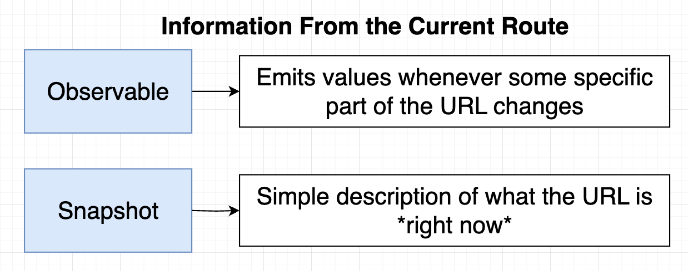
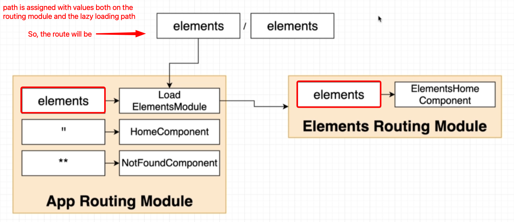

# INDEX

- [INDEX](#index)
  - [Angular Router](#angular-router)
    - [Adding Routing to an Angular App](#adding-routing-to-an-angular-app)
  - [Router configuration](#router-configuration)
    - [Routes](#routes)
      - [RouterModule.`forRoot`(ROUTES) vs RouterModule.`forChild`(ROUTES)](#routermoduleforrootroutes-vs-routermoduleforchildroutes)
    - [Dynamic Routes](#dynamic-routes)
      - [Accessing Dynamic Route Parameters and query parameters](#accessing-dynamic-route-parameters-and-query-parameters)
    - [Nested Routes](#nested-routes)
    - [Redirecting Routes](#redirecting-routes)
    - [Adding data to routes](#adding-data-to-routes)
      - [Adding static data to routes](#adding-static-data-to-routes)
      - [Adding dynamic data to routes (Resolvers)](#adding-dynamic-data-to-routes-resolvers)
      - [Adding title to routes window tab](#adding-title-to-routes-window-tab)
  - [Using the Router](#using-the-router)
    - [Route Properties (Params and Query Params)](#route-properties-params-and-query-params)
      - [`ActivatedRoute` service](#activatedroute-service)
      - [`ActivatedRouteSnapshot` and `RouterStateSnapshot`](#activatedroutesnapshot-and-routerstatesnapshot)
  - [Navigation (Router Links)](#navigation-router-links)
    - [`routerLink`](#routerlink)
    - [Styling the Router Links](#styling-the-router-links)
    - [Navigating to route programmatically](#navigating-to-route-programmatically)
    - [Relative Router Link References (Nested Routes)](#relative-router-link-references-nested-routes)
  - [Lazy Loading](#lazy-loading)
    - [Implementing Lazy Loading](#implementing-lazy-loading)
      - [Old way of lazy loading (modules)](#old-way-of-lazy-loading-modules)
      - [New way of lazy loading (standalone components)](#new-way-of-lazy-loading-standalone-components)
  - [Router Guards](#router-guards)
    - [Implementing Router Guards](#implementing-router-guards)
      - [NEW: Guards Using Functions](#new-guards-using-functions)
      - [OLD: Guards Using Classes](#old-guards-using-classes)
    - [Route Guards Common Issues](#route-guards-common-issues)
  - [Route Resolvers](#route-resolvers)
    - [Why we use Route Resolvers](#why-we-use-route-resolvers)

---

## Angular Router

**Angular Router** is a powerful module that allows you to create single-page applications (SPAs) with Angular. It enables navigation between different views or components in your application without reloading the entire page.

> **Single Page Application (SPA)**: A web application that loads a **single HTML page** and dynamically updates the content as the user interacts with the app, without requiring a full page reload.

- It provides a way to define routes, navigate between them, and manage the state of the application
- Angular **watches & manipulates the browser's URL** to determine which component to render based on the current route

---

### Adding Routing to an Angular App

- **Generate a new app with routing**

  ```bash
  ng new <project_name> --routing

  # or run script for creating new app and answer yes to routing
  ```

  - this will create a new app with routing enabled and generate a `app-routing.module.ts` file that contains the routes of the app

- **Add routing to an existing app**

  - **Option 1: module-based routing**

    - Create a new module for routing

      ```bash
      ng generate module app-routing --flat
      ```

    - This will create a new module called `app-routing.module.ts` in the `src/app` directory
    - Then, import the `AppRoutingModule` in the `app.module.ts` file

      ```ts
      // in app.module.ts
      import { AppRoutingModule } from './app-routing.module';

      @NgModule({
        declarations: [AppComponent],
        imports: [BrowserModule, AppRoutingModule], // import the AppRoutingModule
        providers: [],
        bootstrap: [AppComponent]
      })
      export class AppModule {}
      ```

  - **Option 2: standalone-component-based routing**

    - Here, the `<router-outlet>` directive is not defined in the standalone components unless you explicitly add it to the component's provider array.

    - import the `provideRouter` function from `@angular/router` in the `main.ts` file

      ```ts
      // in main.ts
      import { provideRouter } from '@angular/router';
      import { AppComponent } from './app/app.component';

      platformBrowserDynamic()
        .bootstrapModule(AppModule, {
          providers: [provideRouter(routes)] // provide the routes to the app
        })
        .catch(err => console.error(err));
      ```

    - Or you can import the `provideRouter` in the standalone component directly in the `providers` array

      ```ts
      // in app.component.ts
      import { provideRouter } from '@angular/router';
      import { AppComponent } from './app.component';

      @Component({
        selector: 'app-root',
        templateUrl: './app.component.html',
        styleUrls: ['./app.component.css'],
        providers: [provideRouter(routes)] // provide the routes to the app
      })
      export class AppComponent {}
      ```

- **Generating Router Module** -> [Router module](./2-Angular-Modules.md#router-module)

---

## Router configuration

- In order to configure the routes of the app, the `RouterModule` and `Routes` are imported into the `routing module`

  ```ts
  // in app-routing.module.ts
  import { NgModule } from '@angular/core';
  import { RouterModule, Routes } from '@angular/router';
  import { FirstComponent } from './first/first.component';

  const routes: Routes = [{ path: 'first-component', component: FirstComponent }]; // sets up routes constant where you define your routes

  @NgModule({
    imports: [RouterModule.forRoot(routes)],
    exports: [RouterModule]
  })
  export class AppRoutingModule {}
  ```

- The `RouterModule.forRoot(routes)` method is used to configure the routes of the app and the `routes` constant is used to define the routes
- Each route in this array is a `JavaScript object` that contains two properties.
  - `path` -> defines the URL path for the route.
  - `component` -> defines the component Angular should use for the corresponding path.
- We can also use `RouterModule.forChild(routes)` to configure child routes

---

### Routes

- The `Routes` array is used to define the routes of the app
- Each route in the `Routes` array is a `JavaScript object` that contains two properties

  - `path` : defines the URL path for the route
  - `component` : defines the component Angular should use for the corresponding path

  ```ts
  const routes: Routes = [
    { path: 'first-component', component: FirstComponent },
    { path: 'second-component', component: SecondComponent }
  ];
  ```

- **Home route** : The home route is defined by the path `/` and is usually the first route in the `Routes` array

  ```ts
  const routes: Routes = [
    { path: '', component: HomeComponent }, // home route
    { path: 'first-component', component: FirstComponent },
    { path: 'second-component', component: SecondComponent }
  ];
  ```

  - The `HomeComponent` is the component that will be displayed when the app is loaded

- **Wildcard route** : The wildcard route is defined by the path `**` and is usually the last route in the `Routes` array

  ```ts
  const routes: Routes = [
    { path: '', component: HomeComponent },
    { path: 'first-component', component: FirstComponent },
    { path: 'second-component', component: SecondComponent },
    { path: '**', component: PageNotFoundComponent } // catch-all route -> It's used to handle any route that does not match the other routes
  ];
  ```

  - The `PageNotFoundComponent` is the component that will be displayed when the route does not match any of the other routes

- **Notes:**

  - The `wildcard route` must be the last route in the `Routes` array because the router uses the first match it finds

    - To do this in the `@import` statement, use the `routing module` that contains the `wildcard route` as the last module

      ```ts
      @NgModule({
        imports: [
          BrowserModule,
          ElephantsModule,
          CollectionsModule, // module that contains routes
          AppRoutingModule // module that contains wildcard route (last module) ✅
        ],
        exports: [RouterModule]
      })
      export class AppModule {}
      ```

#### RouterModule.`forRoot`(ROUTES) vs RouterModule.`forChild`(ROUTES)

- `forRoot` is the method that configures the root routing module for your app. When called, you are asking Angular to instantiate an instance of the Router class `globally`.

  - it also provides the `AppRoutingModule` to import all of your child routes.

- `forChild` : When you are using the forChild static method, you are basically telling Angular, "**There is already a Router instance available in the app so please just register all of these routes with that instance.**". The forChild static method is useful by allowing you to maintain `separation of concerns` within your app.

  ```ts
  // in app-routing.module.ts
  import { NgModule } from '@angular/core';
  import { RouterModule, Routes } from '@angular/router';
  import { FirstComponent } from './first/first.component';

  const routes: Routes = [{ path: 'first-component', component: FirstComponent }];

  @NgModule({
    imports: [RouterModule.forChild(routes)],
    exports: [RouterModule]
  })
  export class AppRoutingModule {}
  ```

---

### Dynamic Routes

**Dynamic routes** are routes that contain parameters in the URL, which can be used to pass data to the component

- To define a dynamic route, use the `:` character before the parameter name in the `path` property of the route object

  ```ts
  const routes: Routes = [
    { path: 'users/:id', component: UserComponent },
    { path: 'products/:id', component: ProductComponent }
  ];
  ```

  - The `:id` in the path is a dynamic parameter that can be used to pass data to the component
  - The `id` parameter can be accessed in the component using the `ActivatedRoute` service

#### Accessing Dynamic Route Parameters and query parameters

- To access the dynamic route parameters (or query parameters) in the component, We have 2 options:

  1. **Using the `ActivatedRoute` service** (recommended ✅)
  2. accessing the paramater as an `input` property of the component
     - This is not recommended because it doesn't provide live updates when the route parameter changes (but it can be useful in some cases)

- **Option 1:** use the `ActivatedRoute` service (Observables)

  ```ts
  // in user.component.ts
  import { Component, OnInit } from '@angular/core';
  import { ActivatedRoute } from '@angular/router';

  @Component({
    selector: 'app-user',
    templateUrl: './user.component.html',
    styleUrls: ['./user.component.css']
  })
  export class UserComponent implements OnInit {
    constructor(private route: ActivatedRoute) {} // inject the ActivatedRoute service

    ngOnInit() {
      this.route.params.subscribe(params => {
        console.log(params.id); // log the dynamic route parameter id
      });
    }
  }
  ```

  - The `ActivatedRoute` service is used to access data about the current route like (route parameters, query parameters, and more)
  - The `params` property of the `ActivatedRoute` service is an `Observable` that contains the dynamic route parameters
  - The `subscribe` method of the `Observable` is used to subscribe to the `Observable` and get the value of the dynamic route parameter

- **Option 2:** access the parameter as an `input` property of the component

  - First, we need to add the `withComponentInputBinding` option to the route object in the `app.config.ts` file

    ```ts
    // in app.config.ts
    import { ApplicationConfig } from '@angular/core';
    import { provideRouter, withComponentInputBinding } from '@angular/router';
    import { routes } from './app.routes';

    export const appConfig: ApplicationConfig = {
      providers: [
        provideRouter(routes, withComponentInputBinding()) // add the withComponentInputBinding option
      ]
    };
    ```

  - Then, we can access the dynamic route parameter as an input property of the component

    ```ts
    // in user.component.ts
    import { Component, Input } from '@angular/core';

    @Component({
      selector: 'app-user',
      templateUrl: './user.component.html',
      styleUrls: ['./user.component.css']
    })
    export class UserComponent {
      @Input() id!: string; // access the dynamic route parameter as an input property (MUST BE THE SAME NAME AS THE PARAMETER IN THE ROUTE)
    }
    ```

---

### Nested Routes

**Nested routes** are routes that are defined inside another route and are used to create a hierarchy of routes

- To define nested routes, use the `children` property of the route object

  ```ts
  const routes: Routes = [
    {
      path: 'parent-component',
      component: ParentComponent,
      children: [
        { path: '', component: FirstChildComponent },
        { path: 'child-component', component: SecondChildComponent }
      ]
    }
  ];
  ```

  - The `children` property is an array of routes that are nested inside the parent route
  - The `path` property of the child route is relative to the parent route
  - The `component` property of the child route is the component that will be displayed when the child route is navigated to

- Now, the `ChildComponent` will be displayed when the route `/parent-component/child-component` is navigated to
- The place where the child component will be displayed is defined in the parent component using the `router-outlet` directive

  ```html
  <!-- in parent.component.html -->
  <router-outlet></router-outlet>
  ```

---

### Redirecting Routes

**Redirecting routes** are used to redirect the user from one route to another route when the user navigates to a specific route

- To define a redirect route, use the `redirectTo` property of the route object

  ```ts
  const routes: Routes = [
    { path: '', redirectTo: '/home', pathMatch: 'full' }, // redirect to home route
    { path: 'home', component: HomeComponent },
    { path: 'store', component: StoreComponent }
  ];
  ```

  - The `redirectTo` property is used to redirect the user to the specified route when the user navigates to the route
  - The `pathMatch` property is used to determine how the router should match the URL segment to the route's path
    - `full` : the router will only redirect if the entire URL matches the path
    - `prefix` : the router will redirect if the URL starts with the path
  - **Note:** `pathMatch` is required when using `redirectTo` to avoid routing issues
    - This is because for example if we don't use `pathMatch: 'full'` and we have a route with the path `''`, the router will match this route and redirect to `/home` for every route that starts with `/`, which are all routes in the app **(infinite redirect loop)**

---

### Adding data to routes

#### Adding static data to routes

You can add static data to routes using the `data` property of the route object

```ts
const routes: Routes = [
  { path: 'home', component: HomeComponent, data: { title: 'Home' } },
  { path: 'about', component: AboutComponent, data: { title: 'About' } }
];
```

- The `data` property is an object that contains the static data to be passed to the component when the route is navigated to.
- It's commonly used to pass metadata to the component, such as the title of the page or other information that is not dynamic
- It can be accessed in the component using the `ActivatedRoute` service or as an `input` property of the component -> [more here on how to access router properties](#route-properties-params-and-query-params)

---

#### Adding dynamic data to routes (Resolvers)

You can add dynamic data to routes using the `resolve` property of the route object

```ts
const routes: Routes = [
  { path: 'home', component: HomeComponent, resolve: { data: HomeResolver } },
  { path: 'about', component: AboutComponent, resolve: { data: AboutResolver } }
];
```

- The `resolve` property is used to define a resolver for the route

> **A resolver is a service that is responsible for fetching data before the route is activated**
>
> It's used to fetch data from an API or a service before the route is activated, and then pass the data to the component so that when the component is initialized, it already has the data it needs to render

- How the resolver works:

  - The `resolver` is a service that implements the `Resolve` interface
  - The `resolve` method of the resolver is called before the route is activated
  - The `resolve` method returns an `Observable`, `Promise`, or a value that contains the data to be passed to the component
    - This method will be located inside the component that is being resolved and then imported into the `routes` file
  - The data returned from the resolver is available in the component via the `ActivatedRoute` service

- **Example:**

  - Here, we first will have a resolver function inside the component

    ```ts
    // in home.component.ts
    import { resolveFn } from '@angular/core';
    import { ActivatedRouteSnapshot, RouterStateSnapshot } from '@angular/router';

    //...
    export const HomeResolver: resolveFn = (
      route: ActivatedRouteSnapshot,
      state: RouterStateSnapshot
    ) => {
      return this.dataService.getData(); // return the data to be passed to the component
    };
    ```

  - Then, we will import the resolver into the `routes` file and use it in the route

  ```ts
  import { Routes } from '@angular/router';
  import { HomeComponent } from './home/home.component';
  import { HomeResolver } from './home.resolver';

  export const routes: Routes = [
    {
      path: 'home',
      component: HomeComponent,
      resolve: {
        data: HomeResolver // we can use any alias not just 'data' and that alias will be used to access the resloved data inside the component
      }
    }
  ];
  ```

- **Resolver Notes:**

  - The resolver function runs every time the route is activated or re-activated, but by default it doesn't run when the query parameters change

    - To make the resolver run when the query parameters change, we can use the `runGuardsAndResolvers` property in the route configuration

    ```ts
    const routes: Routes = [
      {
        path: 'home',
        component: HomeComponent,
        resolve: {
          data: HomeResolver
        },
        runGuardsAndResolvers: 'paramsChange' // 👈 this will make the resolver run when the query parameters change
      }
    ];
    ```

---

#### Adding title to routes window tab

You can add a title to the window tab of the browser when navigating to a route by using:

- Option 1: the `title` option in the route object

  ```ts
  const routes: Routes = [
    {
      path: 'home',
      component: HomeComponent,
      title: 'Home Page' // this will set the title of the window tab to 'Home Page'
    },
    {
      path: 'about',
      component: AboutComponent,
      title: 'About Page' // this will set the title of the window tab to 'About Page'
    }
  ];
  ```

- Option 2: the `Title` service in Angular

  ```ts
  import { Title } from '@angular/platform-browser';

  constructor(private titleService: Title) {}

  ngOnInit() {
    this.titleService.setTitle('Home Page');
  }
  ```

---

## Using the Router

Angular doesn't replace the entire page when navigating between routes, it only updates the view based on the current route. This is done using the `<router-outlet>` directive which acts as a placeholder for the component that will be displayed based on the current route.

- To show the component based on the route, use the `<router-outlet>` directive in the `app.component.html` file

  ```html
  <h1>Angular Router App</h1>
  <!-- This nav gives you links to click, which tells the router which route to use (defined in the routes constant in  AppRoutingModule) -->
  <nav>
    <ul>
      <li>
        <a routerLink="/first-component" routerLinkActive="blue-text">First Component</a>
      </li>
    </ul>
  </nav>
  <!-- The routed views render in the <router-outlet>-->
  <router-outlet></router-outlet>
  ```

- It shows the component based on the route
  

---

### Route Properties (Params and Query Params)

In order to access the route parameters, we can use the `ActivatedRoute` service in the component



#### `ActivatedRoute` service

- The `ActivatedRoute` service is used to access the route parameters and query parameters of the route

  - To be able to use the `ActivatedRoute` service, we need to inject it into the component using **dependency injection**

    ```ts
    constructor(private route: ActivatedRoute) {} // inject the ActivatedRoute service
    ```

  - The `ActivatedRoute` service has a property called `params` that is an `Observable` that contains the route parameters

    ```ts
    this.route.params.subscribe(params => {
      console.log(params.id); // log the route parameter id
    });
    ```

  - The `ActivatedRoute` service has a property called `queryParams` that is an `Observable` that contains the query parameters

    ```ts
    this.route.queryParams.subscribe(params => {
      console.log(params.id); // log the query parameter id
    });
    ```

- **Example:**

  ```ts
  // in first.component.ts
  import { Component, OnInit } from '@angular/core';
  import { ActivatedRoute } from '@angular/router';

  @Component({
    selector: 'app-first',
    templateUrl: './first.component.html',
    styleUrls: ['./first.component.css']
  })
  export class FirstComponent implements OnInit {
    constructor(private route: ActivatedRoute) {} // inject the ActivatedRoute service (dependency injection) and use it in the component using `this.route`

    ngOnInit() {
      this.route.params.subscribe(params => {
        console.log(params.id); // log the route parameter id
      });

      this.route.queryParams.subscribe(params => {
        console.log(params.id); // log the query parameter id
      });
    }
  }
  ```

- **Notes:**

  - The `params` property of the `ActivatedRoute` service is an `Observable` that contains the route parameters
  - The `queryParams` property of the `ActivatedRoute` service is an `Observable` that contains the query parameters
  - The `subscribe` method of the `Observable` is used to subscribe to the `Observable` and get the value of the `Observable`

---

#### `ActivatedRouteSnapshot` and `RouterStateSnapshot`

They are used to access the route parameters and query parameters of the route **WITHOUT** subscribing to the `Observable`

- This is done by using the `snapshot` property of the `ActivatedRoute` service

  ```ts
  console.log(this.route.snapshot.params.id); // log the route parameter id
  console.log(this.route.snapshot.queryParams.id); // log the query parameter id
  ```

- **Example:**

  ```ts
  // in first.component.ts
  import { Component, OnInit } from '@angular/core';
  import { ActivatedRoute } from '@angular/router';

  @Component({
    selector: 'app-first',
    templateUrl: './first.component.html',
    styleUrls: ['./first.component.css']
  })
  export class FirstComponent implements OnInit {
    constructor(private route: ActivatedRoute) {} // inject the ActivatedRoute service (dependency injection)

    ngOnInit() {
      console.log(this.route.snapshot.params.id); // log the route parameter id
      console.log(this.route.snapshot.queryParams.id); // log the query parameter id
    }
  }
  ```

- **Notes:**

  - By using the `snapshot` property of the `ActivatedRoute` service, **We won't be able to get the updated values** of the route parameters and query parameters when they change **(no live updates, only initial values when the component is initialized)**

---

## Navigation (Router Links)

### `routerLink`

- To navigate to a route, use the `routerLink` attribute/directive instead of `href` in the `<a>` tag

  > We don't use `href` to navigate to a route, we use `routerLink` instead
  >
  > This is because if we use `href` attribute, the page will reload and the app will lose its state, but if we use `routerLink`, the app will not lose its state and the page will not reload

  ```html
  <nav>
    <ul>
      <li>
        <a routerLink="/first-component" routerLinkActive="blue-text">First Component</a>

        <!-- routerlink with query params -->
        <a [routerLink]="['/first-component']" [queryParams]="{ id: 1 }">First Component</a>
      </li>
    </ul>
  </nav>
  ```

- The `routerLink` (directive / attribute) is used to navigate to a route when the link is clicked

  - It takes the path of the route as an argument, and set-up the path for this link with extra handling from Angular so that it doesn't reload the page

- Check this: [Relative RouterLink References](#relative-router-link-references-nested-routes)

  - You can use relative paths to navigate to a route

    ```html
    <a [routerLink]="'./'">First Component</a>
    <!-- relative path to the current route -->
    <a [routerLink]="'../'">Parent Component</a>
    <!-- relative path to the parent route -->
    ```

- The `routerLinkActive` (directive / attribute) is used to apply a class to the link when the route is active

  - Make sure to use the **`exact`** option to prevent partial matching routes (specially with nested routes)

- The `queryParams` property is used to pass query parameters to the route

  ```html
  <a [routerLink]="'./'" [queryParams]="{ order: 'asc'}">sort by asc</a>
  <a [routerLink]="'./'" [queryParams]="{ order: 'desc'}">sort by desc</a>
  ```

  - The `queryParams` property takes an object with the query parameters to pass to the route
  - The `queryParams` will be added to the URL as query parameters when the link is clicked

- **Notes:**

  - There's another alternative syntax for `routerLink` that uses an array of strings to navigate to a route

    ```html
    <!-- This will route to "/first-component" -->
    <a [routerLink]="['/first-component']">First Component</a>

    <!-- This will route to "/first-component/1" -->
    <a [routerLink]="['/first-component', 1]">First Component</a>

    <!-- This will route to "/first-component/1/edit" -->
    <a [routerLink]="['/first-component', 1, 'edit']">First Component</a>
    ```

---

### Styling the Router Links

- `routerLinkActive` : it's an attribute directive that applies a class if the router link is matched

  ```html
  <a routerLink="/first-component" routerLinkActive="active-link">First Component</a>
  <a routerLink="/second-component" routerLinkActive="active-link">Second Component</a>
  ```

  ```css
  /* in styles.css */
  .active-link {
    color: blue;
    font-weight: bold;
  }
  ```

- `[routerLinkActiveOptions]="{exact:true}"` to prevent `Partial Matching Routes` to make it exact route **usually with main route `"/"` or with nested routes**

  - This is useful when you have nested routes and you want to apply the class only to the exact route, and not partial matching routes

  ```html
  <a routerLink="./" routerLinkActive="active-link" [routerLinkActiveOptions]="{ exact: true }">
    First Component
  </a>
  ```

---

### Navigating to route programmatically

- To navigate to a route programmatically, use the `Router` service in the component

- The `Router` service is used to navigate to a route programmatically

  - To be able to use the `Router` service, we need to inject it into the component using **dependency injection**

    ```ts
    constructor(private router: Router) {} // inject the Router service
    ```

- The `navigate` method of the `Router` service is used to navigate to a route

  - The `navigate` method takes an array of the path of the route as an argument

    ```ts
    ['/first-component'];
    ```

  - The path of the route is the same as the path of the route in the `Routes` array
  - The `navigate` method can also take an object as an argument to navigate to a route with query parameters

    ```ts
    {
      path: '/first-component',
      queryParams: { id: 1 }
    }
    ```

- It is also possible to navigate to a route with query parameters using the `navigate` method

  - The `queryParams` property is used to pass query parameters to the route

    ```ts
    this.router.navigate(['/first-component'], {
      queryParams: { id: 1 },
      replaceUrl: true // optional, to replace the current URL in the browser history (prevent going back to the previous URL)
    });
    ```

- Example:

  ```ts
  // in app.component.ts
  import { Component } from '@angular/core';
  import { Router } from '@angular/router';

  @Component({
    selector: 'app-root',
    templateUrl: './app.component.html',
    styleUrls: ['./app.component.css']
  })
  export class AppComponent {
    constructor(private router: Router) {} // inject the Router service (dependency injection)

    navigateToFirstComponent() {
      this.router.navigate(['/first-component']);
    }
  }
  ```

---

### Relative Router Link References (Nested Routes)

When we use nested (child) routes, we need to use relative paths to navigate to the child routes to avoid routing issues

- one issue is that if we use the absolute path `('/')` to navigate to the child route main route will be replaced with the child route

- Instead we use unix-like relative paths to navigate to the child routes
  

  ```html
  <a routerLink="./child-component">Child Component</a>
  ```

  - The `./` is used to navigate to the child route from the parent route
  - The `../` is used to navigate to the parent route from the child route

---

## Lazy Loading

**Lazy loading** is a technique in Angular that allows you to load the modules of the app only when they are needed (on-demand)

> The default way of loading route's modules/components is called **Eager Loading**. In this case, all modules are loaded at the start of the application, which can lead to longer initial load times and larger bundle sizes.

- It is used to improve the performance of the app by reducing the initial load time
- It is used to reduce the size of the app by loading only the modules that are needed
- Usually it's used for large modules that are not needed when the app is loaded **(for the main routes in the main app module)**
- Example: **Eager vs Lazy Loading**
  
  

### Implementing Lazy Loading

#### Old way of lazy loading (modules)


- **Steps to implement Lazy Loading:**

  1. **Create a new module** that you want to lazy load
  2. **Remove the module from the imports array** of the `AppModule`
  3. **Add the module to the routes array** of the `AppRoutingModule` with the `loadChildren` property and rules on how to load the module
  4. **Remove the module from the imports array** of the `DomainModule` (if it is imported)
  5. **Remove the module from the imports array** of the `RoutingModule` (if it is imported)

- **Example:**

  ```ts
  // in app-routing.module.ts
  const routes: Routes = [
    { path: '', component: HomeComponent },
    { path: 'first-component', component: FirstComponent },
    { path: 'second-component', component: SecondComponent },
    { path: 'lazy', loadChildren: () => import('./lazy/lazy.module').then(m => m.LazyModule) }
  ];
  ```

  ```ts
  // in lazy-routing.module.ts
  // We must create a routing module for the lazy-loaded module
  const routes: Routes = [{ path: '', component: LazyComponent }];
  ```

  - The `loadChildren` property is used to lazy load the module `LazyModule` when the route `/lazy` is navigated to
  - The `loadChildren` property takes a function that returns a `Promise` that resolves to the module to load
  - The `import` function is used to import the module `LazyModule` and the `then` method is used to return the module
  - `m.LazyModule` is the module that is returned by the `then` method, **which is the module to load when the route `/lazy` is navigated to**
  - When the route is activated, the `LazyModule` will be loaded on demand, and it also contains a `routes` array with the routes for the lazy-loaded module

- **Notes:**

  - The lazy loaded module should be set up in its own `Domain module` and `Routing module` **with empty string path** to avoid routing issues
    
    

---

#### New way of lazy loading (standalone components)

- **Steps to implement Lazy Loading:**

  1. **Create a new standalone component** that you want to lazy load
  2. **Remove the component from the imports array** of the `AppModule`
  3. **Add the component to the routes array** of the `AppRoutingModule` with the `loadComponent` property and rules on how to load the component
  4. **Remove the component from the imports array** of the `DomainModule` (if it is imported)
  5. **Remove the component from the imports array** of the `RoutingModule` (if it is imported)

- **Example:**

  ```ts
  // in app-routing.module.ts
  const routes: Routes = [
    { path: '', component: HomeComponent },
    { path: 'first-component', component: FirstComponent },
    { path: 'second-component', component: SecondComponent },
    {
      path: 'lazy',
      loadComponent: () => import('./lazy/lazy.component').then(m => m.LazyComponent)
    }
  ];
  ```

---

## Router Guards

**Router guards** are used to protect the routes of the app and control the navigation to the routes

- They are used to prevent **unauthorized** users from accessing certain routes
  - They are used to prevent users from navigating to certain routes based on certain conditions
    
- They're **Classes** that implement a specific interface and contain a method that returns a `boolean` or an `observable` that resolves to a `boolean`

  > In newer versions of Angular, the guards are **functions instead of classes**, but they still implement the same logic

  - This `boolean` value determines whether the user can navigate to the route

- There are 4 types of router guards in Angular:
  
  - `canActivate` : to prevent the user from navigating to a route
  - `canMatch` **(NEW)**: to prevent the user from navigating to a route based on certain conditions (used for advanced routing scenarios)
  - `canActivateChild` : to prevent the user from navigating to the child routes of a route
  - `canLoad` : to prevent the user from loading the module of a route (lazy loading modules)
  - `canDeactivate` : to prevent the user from leaving a route
    - It's confusing for beginners, but it's used to prevent the user from leaving a route **when there are unsaved changes in the form or other conditions**
      
    - Usually it will be inside the component that is being navigated away from and we will export the guard function from the component and use it in the routes file, so that it will have access to the component instance and its properties

---

### Implementing Router Guards

#### NEW: Guards Using Functions

- **Steps to implement Router Guards:**

  1. **Create a function** that implements the guard logic (it should return a `boolean` or an `Observable` that resolves to a `boolean`)
  2. **Add the function to the routes** using the `canActivate` property
  3. the guard property **takes an array of functions**, so you can add multiple guards to the route

  ```ts
  // routes.ts
  import { Routes } from '@angular/router';
  import { canActivate } from '@angular/router';
  import { FirstComponent } from './first/first.component';
  import { SecondComponent } from './second/second.component';

  const authGuard: CanMatchFn = (
    route: ActivatedRouteSnapshot,
    state: RouterStateSnapshot
  ): boolean | Observable<boolean> => {
    // Implement your guard logic here
    // For example, check if the user is authenticated
    const isAuthenticated = true; // Replace with actual authentication check
    return isAuthenticated; // Return true to allow navigation, false to prevent it
  };

  export const routes: Routes = [
    { path: '', component: HomeComponent },
    { path: 'first-component', component: FirstComponent, canMatch: [authGuard] }, // 👈
    { path: 'second-component', component: SecondComponent }
  ];
  ```

- Notes:

  - It's sometimes recommended to use the `canMatch` guard instead of `canActivate` for advanced routing scenarios, especially when dealing with lazy-loaded modules or complex route configurations
  - It's recommended to not return `false` directly in the guard function, but rather return an `Observable` that resolves to `false` to allow for asynchronous checks (like API calls or other asynchronous operations)
  - Also it's not recommended to return falsy values directly, as this can lead to crashing the app or unexpected behavior. Instead, we should redirect the user to a specific route using `new RedirectCommand()` or return an `Observable` that resolves to `false` or a `UrlTree` to redirect the user to a specific route

---

#### OLD: Guards Using Classes

- **Steps to implement Router Guards:**

  1. **Create a new guard** using the Angular CLI
  2. **Implement the guard** by adding the logic to the guard
  3. **Add the guard to the routes** of the `AppRoutingModule` using the `canActivate` property

- **Example:**

  - 1️⃣ **Create a new guard** using the Angular CLI

    ```bash
    ng generate guard auth/Auth
    ```

    - Note: Angular will add `guard` to the name of the guard automatically, so you don't need to add it because it will be `AuthGuardGuard` if you add `guard` to the name
      - in newer versions of Angular, the guard will be a `function` instead of a `class`

  - 2️⃣ This will generate a new guard called `auth.guard.ts` in the `src/app` directory

    ```ts
    // in auth.guard.ts
    import { Injectable } from '@angular/core';
    import {
      CanActivate,
      ActivatedRouteSnapshot,
      RouterStateSnapshot,
      UrlTree
    } from '@angular/router';
    import { Observable } from 'rxjs';

    @Injectable({
      providedIn: 'root'
    })
    export class AuthGuard implements CanActivate {
      canActivate(
        route: ActivatedRouteSnapshot,
        state: RouterStateSnapshot
      ): Observable<boolean | UrlTree> | Promise<boolean | UrlTree> | boolean | UrlTree {
        return true; // return true to allow the user to navigate to the route
      }
    }
    ```

    - The `canActivate` method of the `AuthGuard` class is used to determine whether the user can navigate to the route
    - The `canActivate` method takes the `ActivatedRouteSnapshot` and `RouterStateSnapshot` as arguments
    - The `canActivate` method returns a `boolean` or an `Observable` that resolves to a `boolean` to allow the user to navigate to the route

  - 3️⃣ **Add the guard to the routes** of the `AppRoutingModule` using the `canActivate` property

    ```ts
    // in app-routing.module.ts
    const routes: Routes = [
      { path: '', component: HomeComponent },
      { path: 'first-component', component: FirstComponent, canActivate: [AuthGuard] },
      { path: 'second-component', component: SecondComponent }
    ];
    ```

    - The `canActivate` property is used to add the `AuthGuard` to the route `/first-component` to prevent the user from navigating to the route

- **Notes:**

  - The `canActivate` property can also take an array of guards to add multiple guards to the route

    ```ts
    { path: 'first-component', component: FirstComponent, canActivate: [AuthGuard, AnotherGuard] }
    ```

---

### Route Guards Common Issues


---

## Route Resolvers

> See this part: [Adding dynamic data to routes (Resolvers)](#adding-dynamic-data-to-routes-resolvers)

**Route resolvers** are used to fetch the data needed for a route before the route is activated, and then pass the data to the component

- They are used to prevent the user from navigating to the route until the data is fetched

- **Example 1:**

  - 1️⃣ **Create a new resolver** using the Angular CLI

    ```bash
    ng generate resolver data
    ```

    - Note: Angular will add `resolver` to the name of the resolver automatically, so you don't need to add it because it will be `DataResolverResolver` if you add `resolver` to the name

  - 2️⃣ This will generate a new resolver called `data.resolver.ts` in the `src/app` directory

    ```ts
    // in data.resolver.ts
    import { Injectable } from '@angular/core';
    import { Resolve, ActivatedRouteSnapshot, RouterStateSnapshot } from '@angular/router';
    import { Observable } from 'rxjs';

    @Injectable({
      providedIn: 'root'
    })
    export class DataResolver implements Resolve<any> {
      resolve(
        route: ActivatedRouteSnapshot,
        state: RouterStateSnapshot
      ): Observable<any> | Promise<any> | any {
        return null; // return the data needed for the route
      }
    }
    ```

    - The `resolve` method of the `DataResolver` class is used to fetch the data needed for the route
    - The `resolve` method takes the `ActivatedRouteSnapshot` and `RouterStateSnapshot` as arguments
    - The `resolve` method returns an `Observable`, a `Promise`, or the data needed for the route

  - 3️⃣ **Add the resolver to the routes** of the `AppRoutingModule` using the `resolve` property

    ```ts
    // in app-routing.module.ts
    const routes: Routes = [
      { path: '', component: HomeComponent },
      { path: 'first-component', component: FirstComponent, resolve: { data: DataResolver } }, // add the resolver to the route
      { path: 'second-component', component: SecondComponent }
    ];
    ```

    - The `resolve` property is used to add the `DataResolver` to the route `/first-component` to fetch the data needed for the route

- **Example 2:** resolving fetching data from a service then passing it to the component

  - 1️⃣ **Create a new service**

    ```ts
    // in data.service.ts
    import { Injectable } from '@angular/core';
    import {
      ActivatedRouteSnapshot,
      MaybeAsync,
      Resolve,
      RouterStateSnapshot
    } from '@angular/router';
    import { Email } from './email';
    import { EmailService } from './email.service';

    @Injectable({
      providedIn: 'root'
    })
    export class EmailResolverService implements Resolve<Email> {
      constructor(private emailService: EmailService) {}

      resolve(route: ActivatedRouteSnapshot, state: RouterStateSnapshot): MaybeAsync<Email> {
        const { id } = route.params;
        return this.emailService.getEmail(id);
      }
    }
    ```

    - The `resolve` method of the `EmailResolverService` class is used to fetch the email data needed for the route
    - The `resolve` method takes the `ActivatedRouteSnapshot` and `RouterStateSnapshot` as arguments (to access the route parameters)
    - The `resolve` method returns an `Observable`, a `Promise`, or the email data needed for the route
    - **Now, the data returned will now be passed to the component through the `ActivatedRoute` service**

  - 2️⃣ **Add the resolver to the routes** of the `AppRoutingModule` using the `resolve` property

    ```ts
    // in app-routing.module.ts
    import { EmailResolverService } from './email-resolver.service';

    const routes: Routes = [
      { path: '', component: HomeComponent },
      { path: 'email/:id', component: EmailComponent, resolve: { email: EmailResolverService } },
      { path: 'first-component', component: FirstComponent },
      { path: 'second-component', component: SecondComponent }
    ];
    ```

    - The `resolve` property is used to add the `EmailResolverService` to the route `/email/:id` to fetch the email data needed for the route

  - 3️⃣ **Use the data in the component**

    ```ts
    // in email.component.ts
    import { Component, OnInit } from '@angular/core';
    import { ActivatedRoute } from '@angular/router';
    import { Email } from './email';

    @Component({
      selector: 'app-email',
      templateUrl: './email.component.html',
      styleUrls: ['./email.component.css']
    })
    export class EmailComponent implements OnInit {
      email: Email;

      constructor(private route: ActivatedRoute) {}

      ngOnInit() {
        this.email = this.route.snapshot.data.email;
      }
    }
    ```

    - The `email` property of the `ActivatedRoute` service is used to access the email data fetched by the resolver
    - The `email` data is passed to the component using the `ActivatedRoute` service

- **Notes:**

  - The `resolve` property can also take an object with the key as the name of the data and the value as the resolver

    ```ts
    { path: 'first-component', component: FirstComponent, resolve: { data: DataResolver } }
    ```

  - The data fetched by the resolver is passed to the component using the `ActivatedRoute` service

    ```ts
    this.route.data.subscribe(data => {
      console.log(data); // log the data fetched by the resolver
    });
    ```

---

### Why we use Route Resolvers

- Prevent the user from navigating to the route until the data is fetched
- Pause rendering of the component until the data is fetched (to avoid `undefined` errors in the template)
