# INDEX

- [INDEX](#index)
  - [Services](#services)
  - [Creating a Service](#creating-a-service)
  - [Dependency injection](#dependency-injection)
    - [Why use Dependency Injection?](#why-use-dependency-injection)
    - [How Angular does Dependency Injection?](#how-angular-does-dependency-injection)
    - [Singleton](#singleton)
    - [`@injectable`](#injectable)
  - [Services \& RxJS](#services--rxjs)
    - [Auth Service](#auth-service)

---

## Services

Service is a broad category encompassing any value, function, or feature that an application needs. A service is typically a class with a narrow, well-defined purpose. It should do something specific and do it well.

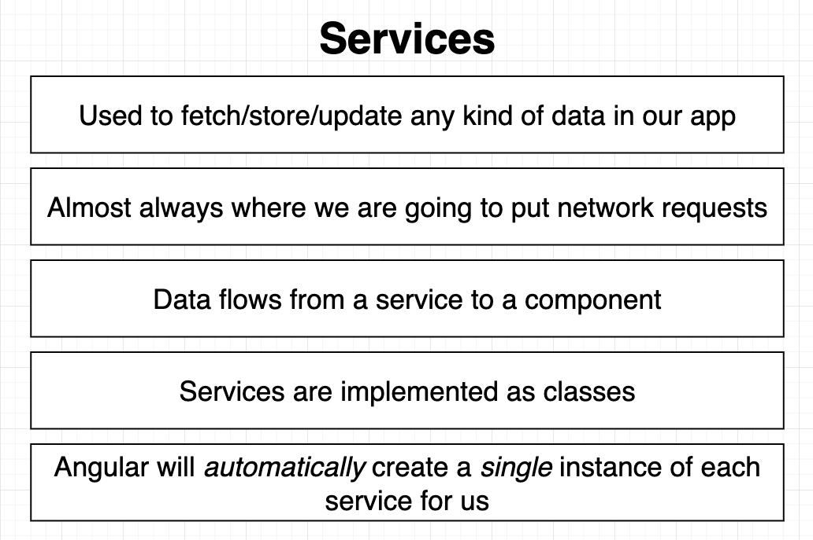

- It's something that **manages or fetches data**
  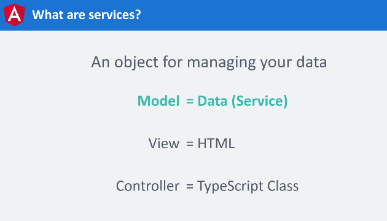

- It's a class that can be used in multiple components and other services

## Creating a Service

- Create a service using the following command:

  ```sh
  ng generate service services/modal
  ```

- This will create a service file in the `services` folder
- The service file will have a class with the same name as the service file
- The service class will have a decorator `@Injectable` which is used to inject the service into other components

  - The service class will have a constructor that will have the dependencies that the service needs

- The service class will have a method that will be used to fetch data or perform some operation
- The service class will be imported in the component where it is needed
- The service class will be injected in the constructor of the component
- The method of the service class will be called in the component

- **Example:**

  - First, create a service using the following command:

    ```sh
    ng generate service services/fetch-data
    ```

  - Second, create a method in the service class that will fetch data from an API

    ```ts
    // services/fetch-data.service.ts
    import { Injectable } from '@angular/core';

    @Injectable({
      providedIn: 'root'
    })
    export class FetchDataService {
      constructor() {}

      fetchData() {
        return fetch('https://jsonplaceholder.typicode.com/posts')
          .then(response => response.json())
          .then(data => data);
      }
    }
    ```

  - Third, import the service class in the component where it is needed **and inject it in the constructor** to use the method of the service class

    ```ts
    // app.component.ts
    import { Component, OnInit } from '@angular/core';
    import { FetchDataService } from './services/fetch-data.service';

    @Component({
      selector: 'app-root',
      templateUrl: './app.component.html',
      styleUrls: ['./app.component.css']
    })
    export class AppComponent implements OnInit {
      fetchData: any;
      constructor(private fetchDataService: FetchDataService) {}

      ngOnInit() {
        this.fetchDataService.fetchData().then(data => {
          this.fetchData = data;
        });
      }
    }
    ```

  - Fourth, display the data in the component template

    ```html
    <!-- app.component.html -->
    <div *ngFor="let data of fetchData">
      <p>{{ data.title }}</p>
    </div>
    ```

- We use `@Injectable` decorator to inject the service into other components
  - This enables Angular to inject the service as an instance of the class in the component where it is needed **(dependency injection)**
- We use `provided: 'root'` to provide the service in the root module **so that it can be used in the whole application**

---

## Dependency injection

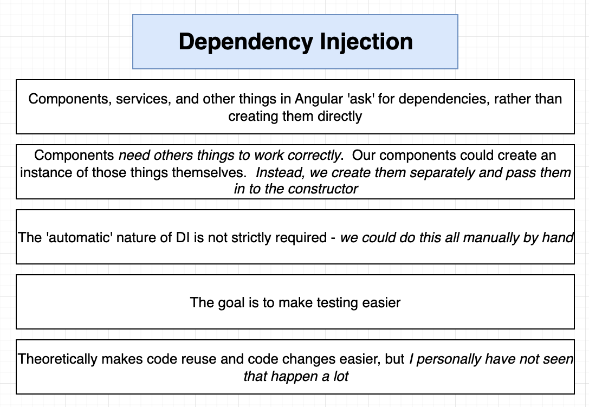

- it's a system that does 2 things:

  - looks in the `[providers] array in the component` and creates instances (objects) from the service-class so that it can be used in other components
  - pass them on to our classes

- When we use `services`, We use the `constructor` to inject the service in the component where it is needed
  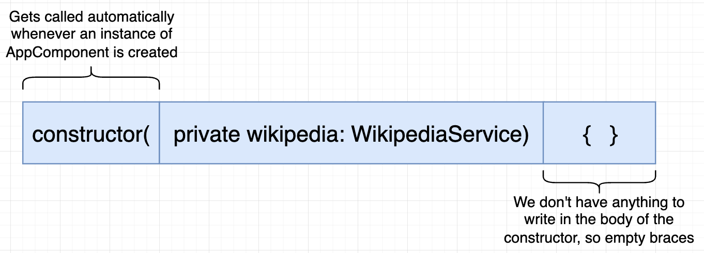
  - We can use another name for the service in the constructor (alias name)
  - We use `private` keyword to create a property of the service in the component class (instead of creating a property and assigning the service to it)
- We use the methods and properties of the service in the component class without creating an instance of the service class in the component class **(because Angular creates an instance of the service class automatically)**

  ```ts
  // We don't create an instance of the service class in the component class ✅
  constructor(private fetchDataService: FetchDataService) {}
  this.fetchDataService.fetchData();

  // ------------------------------------------------------------

  // Instead of creating an instance of the service class in the component class ❌
  constructor() {
    this.fetchDataService = new FetchDataService(); // creating an instance of the service class in the component class ❌
  }
  this.fetchDataService.fetchData();
  ```

> It's called **"Dependency Injection"** because the service-instance is injected (passed) into the component class as a dependency, instead of creating another instance of the service class related to the component class

---

### Why use Dependency Injection?

- **Reusability**: We can use the same service in multiple components
- **Maintainability**: We can maintain the service in one place and use it in multiple components
- **Testability**: We can test the service separately from the component class
  - by creating a mock service and injecting it in the component class when testing the component class

---

### How Angular does Dependency Injection?

- Angular uses `Hierarchical Dependency Injection` system

  > if service is initiates in a parent component -> it will be available for all of its children
  >
  > - Highest component is the `app.module.ts` not `app.component.ts`
  > - so to apply a service to the whole app you should inject it in the module-file

- Angular creates an application-wide injector for you during the bootstrap process, and additional injectors as needed. You don't have to create injectors.

  - An `injector` creates dependencies and maintains a container of dependency instances that it reuses, if possible.

    ```ts
    constructor(private fetchDataService: FetchDataService) {}
    // Here, FetchDataService is a dependency that is injected in the component class by the injector
    ```

  - A `provider` is an object that tells an injector how to obtain or create a dependency

    ```ts
    @Injectable({
      providedIn: 'root'
    })
    export class FetchDataService {
      constructor() {}
    }
    // Here, FetchDataService is a provider that is used to provide the service in the root module
    ```

- When Angular sees a service in the constructor of a component, it looks in the `[providers] array in the component` and creates instances (objects) from the service-class so that it can be used in other components
  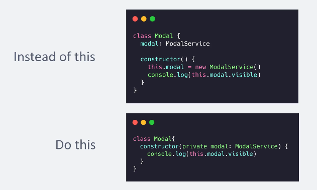

---

### Singleton

> `Singleton` is a **creation design pattern** that lets you ensure that a class has only one instance, while providing a global access point to this instance. more [here](https://refactoring.guru/design-patterns/singleton)

- Angular uses `Singleton` pattern to create a single instance of the service class and use it in multiple components
  
- in each component that uses the service, instead of creating one instance of the same class for each component, --> we use `Singleton`

---

### `@injectable`

- The injector is the main mechanism. Angular creates an application-wide injector for you during the bootstrap process, and additional injectors as needed. You don't have to create injectors.
- An injector creates dependencies and maintainsacontainer of dependency instances that it reuses, if possible.
- Aprovider is an object that tells an injector how to obtain or createadependency

---

## Services & RxJS

- **RxJS** is a library for reactive programming using Observables, to make it easier to compose asynchronous or callback-based code, it has:

  - [Observables](./6-Angular-RXJS.md/#observables)
  - [Operators](./6-Angular-RXJS.md/#operators)
  - Subjects
  - Subscription
  - Scheduler

- Usually, we use `Observables` to handle asynchronous data in services and components in Angular (instead of using Promises or libraries like `axios`)
- We use `Observables` to:
  - handle data that changes over time
  - handle data that comes from multiple sources (like multiple API calls)

---

### Auth Service

- Module structure
  
  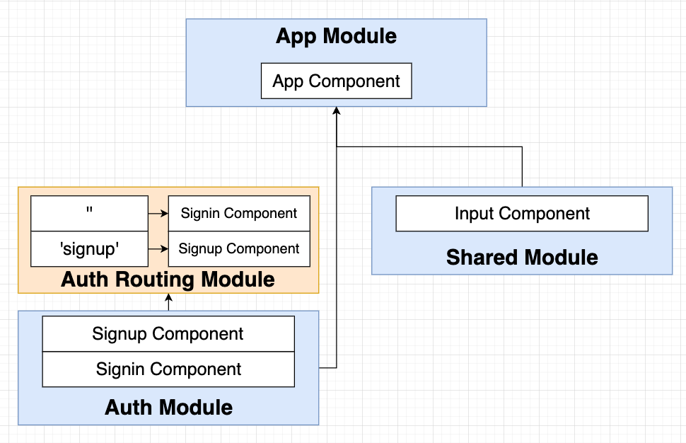
- Auth service requests
  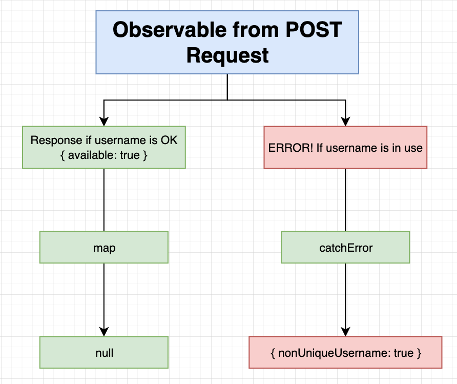
  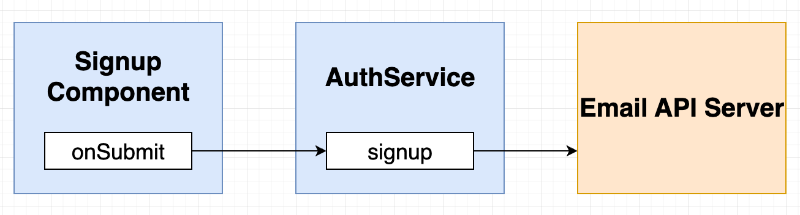
  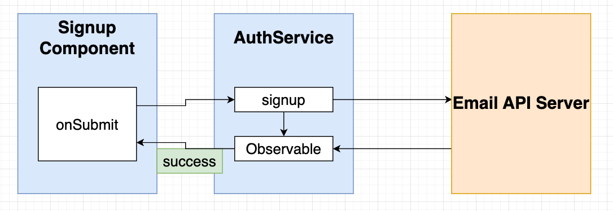
  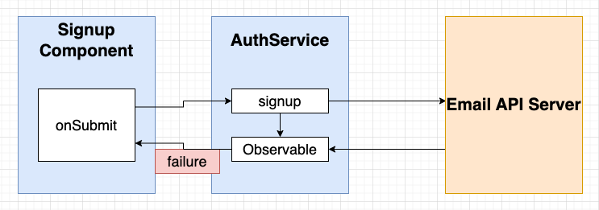
  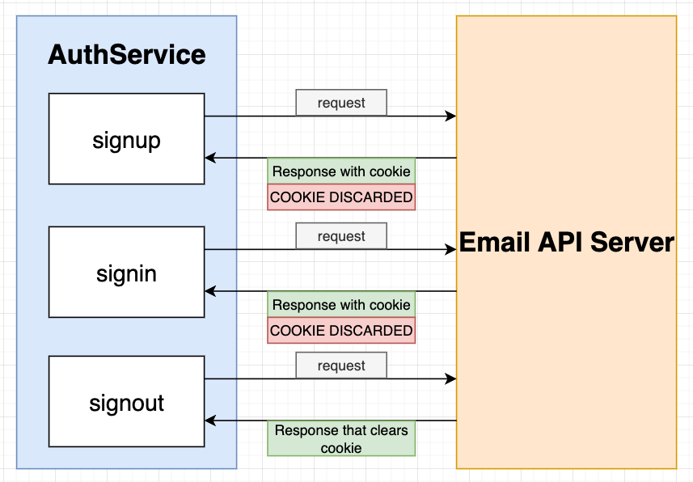
- Handle signed -in state in the app
  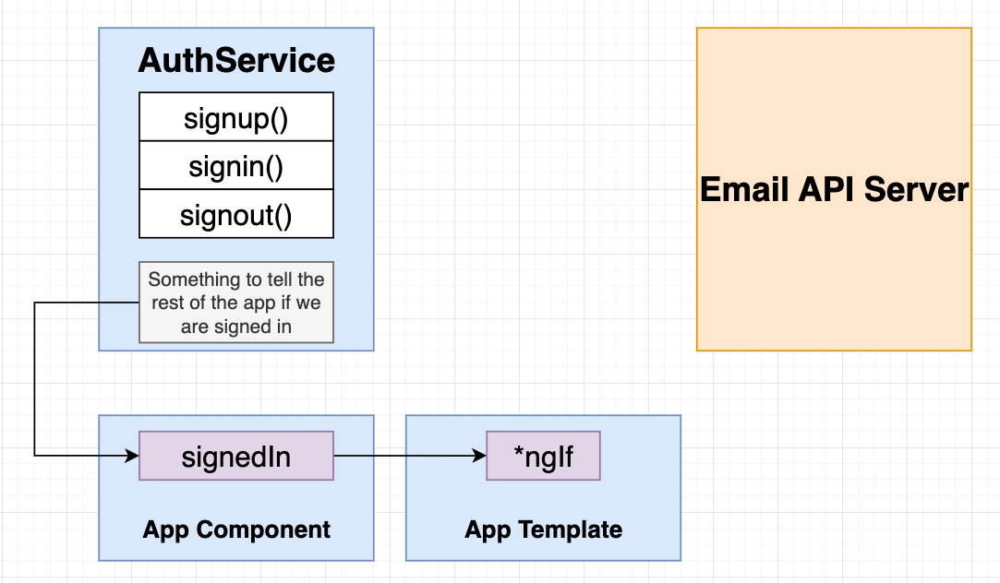
  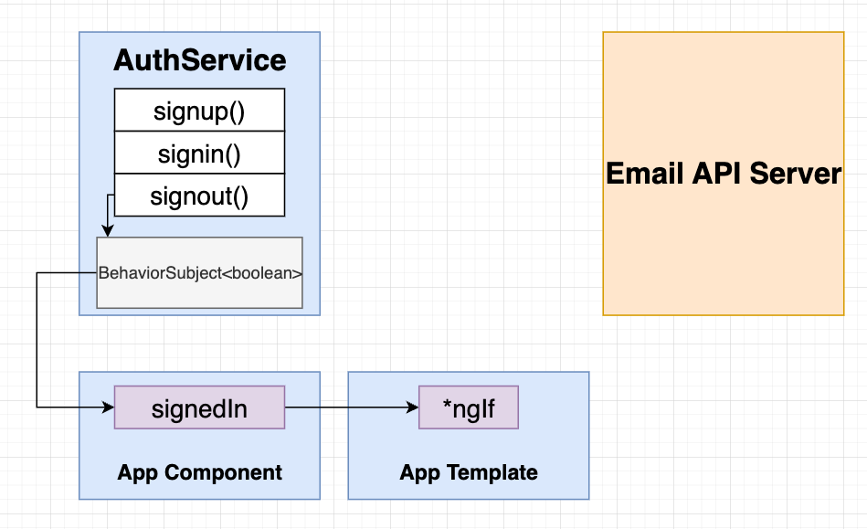
  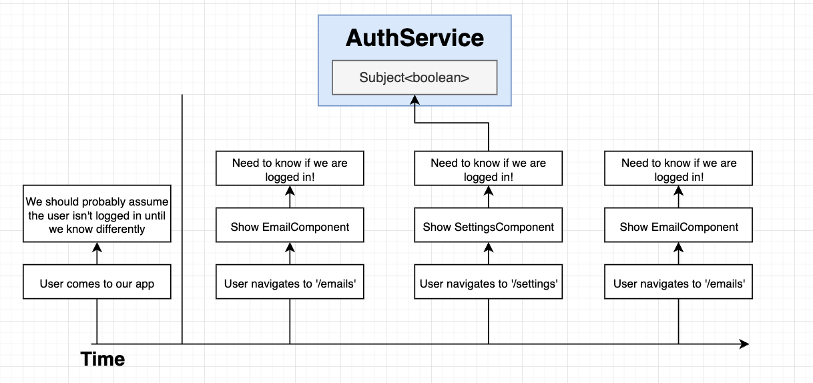
- Signed-in Observable
  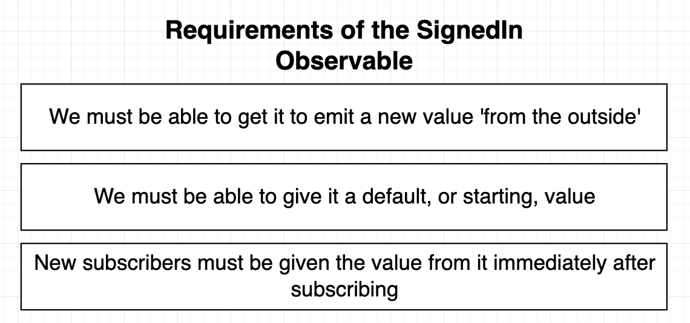
  
- HTTP Requests interceptor -> [Here](./2-Angular-Modules.md#http-interceptors)

---

[⬆ back to top](#index)
