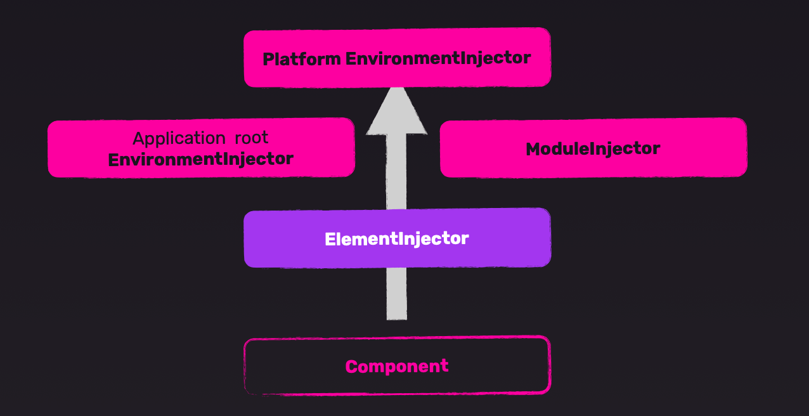

# INDEX

- [INDEX](#index)
  - [Services](#services)
    - [Creating a Service](#creating-a-service)
    - [How Services work](#how-services-work)
    - [Access modifiers in Services](#access-modifiers-in-services)
  - [Dependency injection](#dependency-injection)
    - [Why use Dependency Injection?](#why-use-dependency-injection)
    - [Why Dependency Injection is useful?](#why-dependency-injection-is-useful)
    - [How to use Dependency Injection in Angular components](#how-to-use-dependency-injection-in-angular-components)
      - [Old/Common Way (in the constructor)](#oldcommon-way-in-the-constructor)
      - [New way (using `inject()`)](#new-way-using-inject)
    - [How Angular does Dependency Injection behind the scenes](#how-angular-does-dependency-injection-behind-the-scenes)
    - [Singleton](#singleton)
    - [`@injectable`](#injectable)
  - [Services \& RxJS](#services--rxjs)
    - [HttpClient Service](#httpclient-service)
    - [Auth Service](#auth-service)

---

## Services

It's a class that is used to **share data and logic between components** in Angular applications

- It has often a single responsibility, meaning that it does one thing and does it well, so it can be reused in multiple components, (_e.g. fetching data from an API, handling authentication, etc_).


- It's something that **manages or fetches data**
  

### Creating a Service

- Create a service using the following command:

  ```sh
  ng generate service services/modal
  ```

  - This will create a service file in the `services` folder

- The service file will have a class with the same name as the service file
- The service class will:

  - have a decorator `@Injectable` which is used to inject the service into other components
  - have a constructor that will have the dependencies that the service needs
  - have a method that will be used to fetch data or perform some operation
  - be imported in the component where it is needed
  - be injected in the constructor of the component

- The method of the service class will be called in the component

- **Example:**

  ```ts
  // services/fetch-data.service.ts 📄
  import { Injectable } from '@angular/core';

  @Injectable({
    providedIn: 'root'
  })
  export class FetchDataService {
    constructor() {}

    fetchData() {
      return fetch('https://jsonplaceholder.typicode.com/posts')
        .then(response => response.json())
        .then(data => data);
    }
  }
  ```

  ```ts
  // import the service class in the component where it is needed and inject it in the constructor

  // app.component.ts 📄
  import { Component, OnInit } from '@angular/core';
  import { FetchDataService } from './services/fetch-data.service';

  @Component({
    selector: 'app-root',
    templateUrl: './app.component.html',
    styleUrls: ['./app.component.css']
  })
  export class AppComponent implements OnInit {
    fetchData: any;
    constructor(private fetchDataService: FetchDataService) {}

    ngOnInit() {
      this.fetchDataService.fetchData().then(data => {
        this.fetchData = data;
      });
    }
  }
  ```

---

### How Services work

Services depend on the **[Dependency Injection](#dependency-injection)** system in Angular to work, where only one instance of the service class is created and shared across the application, this is done by using the `@Injectable` decorator and the `providedIn` property, and injecting the service in the component where it is needed.

- **Why don't we instantiate the service class in the component?**

  - Because we want to use the same instance of the service class in multiple components, and we want to use the Dependency Injection system to manage the service class instance
  - If we instantiate the service class in the component, we will create a new instance of the service class for each component, which will lead to multiple instances of the same service class and will not maintain the state of the data and the previous emissions
  - This is especially important when we have services that use `Observables` to handle asynchronous data, because we don't want to create multiple instances of the service class that uses Observables which will create multiple subscriptions and not maintain the state of the data and the previous emissions

- **How services use Dependency Injection?**

  - Fortunately, we don't need to manually create instances of the service class in the component, Angular does it for us using the Dependency Injection system
  - When we inject the service in the component, Angular looks for the service in the `[providers] array in the component` and creates an instance of the service class **(if it doesn't exist)**, or uses the existing instance if it does exist
  - This way, we can use the service in the component without creating an instance of the service class in the component class
  - This requires 3 things:

    1. **Injectable decorator**: We use the `@Injectable` decorator to mark the class as a service, which tells Angular that this class can be injected into other components
    2. **ProvidedIn property**: We use the `providedIn` property to provide the service in the root module, so that it can be used in the whole application
    3. **Dependency Injection**: We use the Dependency Injection system to inject the service in the component where it is needed, so that we can use the service without creating an instance of the service class in the component class:

       ```ts
       constructor(private fetchDataService: FetchDataService) {}
       ```

- We use `@Injectable` decorator to mark the class as a service

  - This tells Angular that this class can be injected into other components
    - This enables Angular to inject the service as an instance of the class in the component where it is needed **(dependency injection)**
  - The `@Injectable` decorator is used to define the metadata for the service class

  > Another alternative is to add the service in the `[providers] array in the module` to provide the service in the module's components **(not recommended anymore ❌, because it's not tree-shakable and creates multiple instances of the service class)**

- We use `provided: 'root'` to provide the service in the root module **so that it can be used in the whole application**

---

### Access modifiers in Services

- We can use access modifiers in the service class to control the visibility of the properties and methods of the service class

  - `public`: The property or method is accessible from anywhere
  - `private`: The property or method is only accessible within the service class
  - `protected`: The property or method is accessible within the service class and its subclasses

- Usually, we use `private` access modifier for the properties and methods in the service, so that they are not accessible from outside the service class, and we use `public` access modifier for the methods that we want to expose to the components that use the service

  ```ts
  // services/fetch-data.service.ts 📄
  import { Injectable } from '@angular/core';
  @Injectable({
    providedIn: 'root'
  })
  export class FetchDataService {
    // private property, not accessible from outside the service class
    private apiUrl = 'https://jsonplaceholder.typicode.com/posts';

    constructor() {}

    // public method, accessible from outside the service class
    public fetchData() {
      return fetch(this.apiUrl)
        .then(response => response.json())
        .then(data => data);
    }

    // private method, not accessible from outside the service class
    private handleError(error: any) {
      console.error('An error occurred', error);
      return throwError(error);
    }
  }
  ```

- It's also a good practice to use `computed()` when accessing properties in the service class, so that we can control the visibility of the properties and methods of the service class

---

## Dependency injection


- it's a system that does 2 things:

  - looks in the `[providers] array in the component` and creates instances (objects) from the service-class so that it can be used in other components
  - pass them on to our classes

> **Dependency Injection** is a design pattern that allows us to remove the hard-coded dependencies and make our application more loosely coupled and easy to manage by injecting the dependencies at runtime
>
> Meaning that when we have a piece of code inside a piece of code, we can inject the dependency from the outside instead of creating it inside the code
> 
>
> 
>
> - When we pass something into the code, we call it **"injection"**

- When we use `services`, We use the `constructor` to inject the service in the component where it is needed
  
  - We can use another name for the service in the constructor (alias name)
  - We use `private` keyword to create a property of the service in the component class (instead of creating a property and assigning the service to it)
- We use the methods and properties of the service in the component class without creating an instance of the service class in the component class **(because Angular creates an instance of the service class automatically)**

  ```ts
  // We don't create an instance of the service class in the component class ✅
  constructor(private fetchDataService: FetchDataService) {}
  this.fetchDataService.fetchData();

  // ------------------------------------------------------------

  // Instead of creating an instance of the service class in the component class ❌
  constructor() {
    this.fetchDataService = new FetchDataService(); // creating an instance of the service class in the component class ❌
  }
  this.fetchDataService.fetchData();
  ```

> It's called **"Dependency Injection"** because the service-instance is injected (passed) into the component class as a dependency, instead of creating another instance of the service class related to the component class

---

### Why use Dependency Injection?

- **Reusability**: We can use the same service in multiple components
- **Maintainability**: We can maintain the service in one place and use it in multiple components
- **Testability**: We can test the service separately from the component class
  - by creating a mock service and injecting it in the component class when testing the component class
- **One instance**: We use `Singleton` pattern to create a single instance of the service class and use it in multiple components
  - instead of creating one instance of the same class for each component
  - This is super important when we have services that uses `Observables` to handle asynchronous data
    - because we don't want to create multiple instances of the service class that uses Observables which will create multiple subscriptions and not maintain the state of the data and the previous emissions

---

### Why Dependency Injection is useful?

- **Testing**

  - When we use Dependency Injection, we can easily create a mock service and inject it in the component class when testing the component class
  - This is not possible when we create an instance of the service class in the component class
  - This way, we can test the component class without worrying about the service class

  - Examples:

    - example without Dependency Injection ❌

      ```ts
      const axios = require('axios');

      class WikipediaSearch {
        constructor() {
          this.axios = axios.create({});
        }

        async search(term) {
          const response = await this.axios.get(`https://en.wikipedia.org/w/api.php`, {
            params: {
              action: 'query',
              format: 'json',
              list: 'search',
              srsearch: term
            }
          });
          return response.data;
        }
      }
      ```

      - Here, whenever the class is instantiated, a new instance of `axios` is created, which makes it hard to test the class without making actual HTTP requests
      - ex:

        ```ts
        const wikipediaSearch = new WikipediaSearch();
        const data = await wikipediaSearch.search('test');
        // This will make an actual HTTP request, which is not ideal for testing and will take time ❌
        ```

    - example with Dependency Injection ✅

      ```ts
      class WikipediaSearch {
        constructor(axiosInstance) {
          this.axios = axiosInstance;
        }

        async search(term) {
          const response = await this.axios.get(`https://en.wikipedia.org/w/api.php`, {
            params: {
              action: 'query',
              format: 'json',
              list: 'search',
              srsearch: term
            }
          });
          return response.data;
        }
      }
      ```

      - Here, we can pass a mock instance of `axios` when testing the class, which makes it easy to test the class without making actual HTTP requests
      - ex:

        ```ts
        // fake mock object for axios
        const mockAxios = {
          get: jest.fn().mockResolvedValue({ data: 'mock data' })
        };

        const wikipediaSearch = new WikipediaSearch(mockAxios);
        const data = await wikipediaSearch.search('test');
        // This will use the mock instance of axios, which is ideal for testing ✅
        expect(data).toBe('mock data');
        ```

- Separate low-level services from the components that use them
  - For example, if we have a service that fetches data from an API, we can separate the service from the component that uses the service, and this service will contain all the logic for fetching data from the API using low-level services like `HttpClient` or `axios`
  - This also makes it easier to reuse the service in other components

---

### How to use Dependency Injection in Angular components

Either way, we need to import the service class in the component where it is needed and inject it in the constructor of the component

Also if we're using modules instead of standalone components, we need to import the service in the module where the component is declared and add it to the `[providers] array in the module` to provide the service in the module's components

```ts
// app.module.ts 📄
import { NgModule } from '@angular/core';
import { BrowserModule } from '@angular/platform-browser';
import { AppComponent } from './app.component';
import { FetchDataService } from './services/fetch-data.service';

@NgModule({
  declarations: [AppComponent],
  imports: [BrowserModule],
  providers: [FetchDataService], // providing the service in the module
  bootstrap: [AppComponent]
})
export class AppModule {}
```

#### Old/Common Way (in the constructor)

Here we use access-modifiers in the constructor to inject the service in the component class, which is the most common way to inject dependencies in Angular components

```ts
// app.component.ts 📄
import { Component, OnInit } from '@angular/core';
import { FetchDataService } from './services/fetch-data.service';
@Component({
  selector: 'app-root',
  templateUrl: './app.component.html',
  styleUrls: ['./app.component.css']
})
export class AppComponent implements OnInit {
  fetchData: any;

  // Injecting the service in the constructor ✅
  constructor(private fetchDataService: FetchDataService) {}

  ngOnInit() {
    // Using the service in the component
    this.fetchDataService.fetchData().then(data => {
      this.fetchData = data;
    });
  }
}
```

- When Angular sees a service in the constructor of a component, it looks in the `[providers] array in the component` and creates instances (objects) from the service-class so that it can be used in other components
  

- **Question ?**: What is the difference between adding a class-access-modifier in the constructor and not adding it?

  ```ts
  constructor(private fetchDataService: FetchDataService) {}
  // vs
  constructor(fetchDataService: FetchDataService) {}
  ```

  - When we add a class-access-modifier (`private` or `public`), it creates a property of the service in the component class
  - When we don't add a class-access-modifier, it creates a parameter of the service in the `constructor` (only accessible in the `constructor`)

#### New way (using `inject()`)

- Angular 14 introduced a new way to inject dependencies using the `inject()` function, which allows us to inject dependencies without using the constructor
- This is useful when we want to inject dependencies in a method or a property, instead of the constructor

  ```ts
  import { inject } from '@angular/core';
  import { FetchDataService } from './services/fetch-data.service';

  export class AppComponent {
    private fetchDataService = inject(FetchDataService); // injecting the service using the inject() function

    ngOnInit() {
      this.fetchDataService.fetchData().then(data => {
        console.log(data);
      });
    }
  }
  ```

---

### How Angular does Dependency Injection behind the scenes

Angular uses a **hierarchical dependency injection system**, which means that it creates an injector for each component and its children, and it looks for the service in the `[providers] array in the component` and creates instances (objects) from the service-class so that it can be used in other components



- Angular has multiple **injectors**:

  - `Element Injector`: Each component has its own injector, which is created when the component is created
  - `Module Injector`: Each module has its own injector, which is created when the module is created
  - `Environment Injector`: The root injector, which is created when the application is bootstrapped
  - `Platform Injector`: The platform injector, which is created when the application is bootstrapped
    - **Note:** Avoid using the `Platform Injector` directly, as it will **not be tree-shakable** if the service is not used. and will be always included in the final bundle, which will increase the bundle size

  > You can see all injectors and the Injector tree in the Angular DevTools in the browser
  >
  > 

- Angular checks each injector in the hierarchy to find the service that is being requested
  - If the service is found in the injector, Angular creates an instance of the service class and injects it into the component
  - If the service is not found in the injector, Angular looks for the service in the parent injector, and so on, until it finds the service or reaches the root injector
- Angular uses the `@Injectable` decorator to mark the class as a service, which tells Angular that this class can be injected into other components
- Angular uses the `providedIn` property to provide the service in the root module, so that it can be used in the whole application
- When we inject the service in the component, Angular looks for the service in the `[providers] array in the component` and creates an instance of the service class **(if it doesn't exist)**, or uses the existing instance if it does exist
- Angular uses `Hierarchical Dependency Injection` system

  > if service is initiates in a parent component -> it will be available for all of its children
  >
  > - Highest component is the `app.module.ts` not `app.component.ts`
  > - so to apply a service to the whole app you should inject it in the module-file

- Angular creates an application-wide injector for you during the bootstrap process, and additional injectors as needed. You don't have to create injectors.

  - An `injector` creates dependencies and maintains a container of dependency instances that it reuses, if possible.

    ```ts
    constructor(private fetchDataService: FetchDataService) {}
    // Here, FetchDataService is a dependency that is injected in the component class by the injector
    ```

  - A `provider` is an object that tells an injector how to obtain or create a dependency

    ```ts
    @Injectable({
      providedIn: 'root'
    })
    export class FetchDataService {
      constructor() {}
    }
    // Here, FetchDataService is a provider that is used to provide the service in the root module
    ```

---

### Singleton

> `Singleton` is a **creation design pattern** that lets you ensure that a class has only one instance, while providing a global access point to this instance. more here: [Singleton Pattern](https://refactoring.guru/design-patterns/singleton)

- Angular uses `Singleton` pattern to create a single instance of the service class and use it in multiple components
  
- in each component that uses the service, instead of creating one instance of the same class for each component, --> we use `Singleton`

---

### `@injectable`

- The injector is the main mechanism. Angular creates an application-wide injector for you during the bootstrap process, and additional injectors as needed. You don't have to create injectors.
- An injector creates dependencies and maintainsacontainer of dependency instances that it reuses, if possible.
- Aprovider is an object that tells an injector how to obtain or createadependency

---

## Services & RxJS

- **RxJS** is a library for reactive programming using Observables, to make it easier to compose asynchronous or callback-based code, it has:

  - [Observables](./6-Angular-RXJS.md/#observables)
  - [Operators](./6-Angular-RXJS.md/#operators)
  - Subjects
  - Subscription
  - Scheduler

- Usually, we use `Observables` to handle asynchronous data in services and components in Angular (instead of using Promises or libraries like `axios`)
- We use `Observables` to:
  - handle data that changes over time
  - handle data that comes from multiple sources (like multiple API calls)

---

### HttpClient Service

The `HttpClient` service is a built-in Angular service that provides a simplified API for making HTTP requests and handling responses using observables.

> Check also the [HTTP Module section](./3-Angular-Modules.md#http-module) in the Angular-Modules file

- **How to use it in Angular?**

  - In order to use the `HttpClient` service in Angular, we need to:

    - If using modules

      - import the `HttpClientModule` from the `@angular/common/http` package and add it to the `imports` array of the `AppModule`.

        ```ts
        import { HttpClientModule } from '@angular/common/http';

        @NgModule({
          declarations: [AppComponent],
          imports: [BrowserModule, HttpClientModule], // add HttpClientModule here
          providers: [],
          bootstrap: [AppComponent]
        })
        export class AppModule {}
        ```

    - If using standalone components

      - import the `provideHttpClient` function from the `@angular/common/http` package and add it to the `providers` array of the component.

        ```ts
        import { provideHttpClient } from '@angular/common/http';

        @Component({
          selector: 'app-root',
          templateUrl: './app.component.html',
          styleUrls: ['./app.component.css'],
          providers: [provideHttpClient()] // add provideHttpClient here
        })
        export class AppComponent implements OnInit {
          // ...
        }
        ```

      - or in the `app.config.ts` file, we can add the `provideHttpClient` function to the `providers` array.

        ```ts
        import { provideHttpClient } from '@angular/common/http';

        export const appConfig: ApplicationConfig = {
          providers: [provideHttpClient()]
        };
        ```

    - This will allow us to use the `HttpClient` service in our Angular application to make HTTP requests and handle the responses using observables.
    - Then, we can inject the `HttpClient` service in our service class and use it to make HTTP requests.
      > It's similar to the example here [Why Dependency Injection is useful?](#why-dependency-injection-is-useful) where we used `axios` to make HTTP requests

  - The `HttpClient` service provides methods for making HTTP requests, such as `get()`, `post()`, `put()`, `delete()`, etc.

    - T**hese methods return an `Observable` that emits the response** from the server, which we can subscribe to in order to handle the response data.

    ```ts
    // services/fetch-data.service.ts 📄
    import { Injectable } from '@angular/core';
    import { HttpClient } from '@angular/common/http';
    import { Observable } from 'rxjs';
    @Injectable({
      providedIn: 'root'
    })
    export class FetchDataService {
      private apiUrl = 'https://jsonplaceholder.typicode.com/posts';

      constructor(private http: HttpClient) {} // inject HttpClient service

      // use HttpClient to make a GET request
      fetchData(): Observable<any> {
        return this.http.get<any>(this.apiUrl).subscribe(response => {
          console.log(response); // handle the response data
        });
        // return an Observable
      }
    }
    ```

    - You will notice the usage of **Generics** in the `get<any>()` method, which allows us to specify the type of the response data, so that we can get type-checking and autocompletion when working with the response data. So instead of using `any`, we can create an interface that defines the structure of the response data and use it in the `get<ResponseInterface>()` method.

  - Now to use it in a component, after injecting the service in the component, we can subscribe to the `Observable` returned by the `fetchData()` method to get the data from the server.

    ```ts
    // app.component.ts 📄
    import { Component, OnInit, OnDestroy } from '@angular/core';
    import { FetchDataService } from './services/fetch-data.service';

    @Component({
      selector: 'app-root',
      templateUrl: './app.component.html',
      styleUrls: ['./app.component.css']
    })
    export class AppComponent implements OnInit, OnDestroy {
      fetchData: any;

      constructor(private fetchDataService: FetchDataService) {}

      ngOnInit() {
        // ⚠️ Note: This won't do anything, because fetchData() returns an Observable, and must be subscribed to in order to get the data
        // this.fetchDataService.fetchData();

        // subscribe to the Observable returned by fetchData()
        this.fetchDataService.fetchData().subscribe(data => {
          this.fetchData = data; // handle the response data
        });

        // or using next() and error() methods
        this.fetchDataService.fetchData().subscribe({
          next: data => {
            this.fetchData = data; // handle the response data
          },
          error: error => {
            console.error('Error fetching data:', error); // handle the error
          }
        });
      }

      // Also, don't forget to clean up the subscription when the component is destroyed to avoid memory leaks
      ngOnDestroy() {
        if (this.fetchDataSubscription) {
          this.fetchDataSubscription.unsubscribe(); // unsubscribe from the Observable
        }
      }
    }
    ```

- **Notes**

  - Why use it instead of `fetch()` or `axios`?

    - Because it provides a simplified API for making HTTP requests and handling responses using observables, which makes it easier to work with asynchronous data in Angular applications
    - It provides built-in support for **interceptors**, which allows us to modify the request and response data before they are sent or received, and to handle errors in a more elegant way

      > **Interceptors**: We can use `HttpClient` interceptors to intercept HTTP requests and responses, and modify them before they are sent or received, or to handle errors in a more elegant way. More about interceptors [in the Angular-Modules file](./2-Angular-Modules.md#http-interceptors)

    - It provides built-in support for **cancellation** of HTTP requests, which allows us to cancel an ongoing request if it is no longer needed, and to avoid unnecessary network traffic

      > **Cancellation**: We can use the `takeUntil` operator from RxJS to cancel an ongoing HTTP request if it is no longer needed, and to avoid unnecessary network traffic.

    - It has a lot of built-in performance optimizations, such as request caching, request deduplication, and request batching, which can improve the performance of our Angular applications

  - It's a good practice to use the `pluck` operator piped to the data emitted from the `http` methods inside the service method and not in the component using the service, this is because of 2 reasons:
    1. separation of concerns (the component only cares about the data from the service-method)
    2. making use of `generics` in the service-method to select the right data from the response
  - By default, the `HttpClient` service **doesn't send or receive cookies** from the server, to enable this, we need to set the `withCredentials` option to `true` in the request options

    ```ts
    this.http.get<any>(this.apiUrl, { withCredentials: true });
    ```

---

### Auth Service

- Module structure
  
  
- Auth service requests
  
  
  
  
  
- Handle signed -in state in the app
  
  
  
- Signed-in Observable
  
  
- HTTP Requests interceptor -> [Here in modules file](./3-Angular-Modules.md#http-interceptors)

```ts
// auth.service.ts 📄
import { Injectable } from '@angular/core';
import { HttpClient } from '@angular/common/http';
import { BehaviorSubject, Observable } from 'rxjs';
import { tap } from 'rxjs/operators';

@Injectable({
  providedIn: 'root'
})
export class AuthService {
  private apiUrl = 'https://example.com/api/auth';
  private isAuthenticatedSubject = new BehaviorSubject<boolean>(false); // BehaviorSubject to hold the authentication status
  public isAuthenticated$ = this.isAuthenticatedSubject.asObservable(); // Observable to expose the authentication status
  private token: string | null = null; // to hold the JWT token

  constructor(private http: HttpClient) {}
  // Login method
  login(username: string, password: string): Observable<any> {
    return this.http.post<any>(`${this.apiUrl}/login`, { username, password }).pipe(
      tap(response => {
        this.token = response.token; // store the JWT token
        this.isAuthenticatedSubject.next(true); // update the authentication status
      })
    );
  }
  // Logout method
  logout(): Observable<any> {
    return this.http.post<any>(`${this.apiUrl}/logout`, {}).pipe(
      tap(() => {
        this.token = null; // clear the JWT token
        this.isAuthenticatedSubject.next(false); // update the authentication status
      })
    );
  }
}
```

---

[⬆ back to top](#index)
