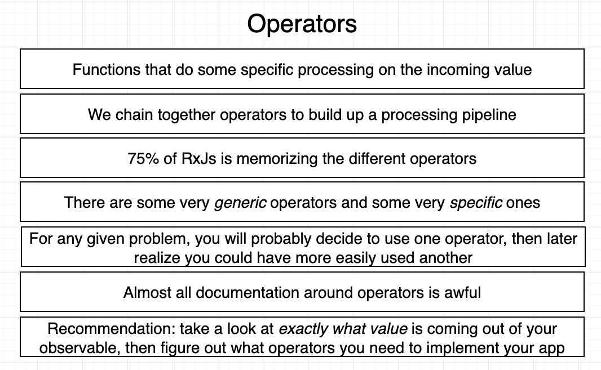

# INDEX

- [INDEX](#index)
  - [RxJS](#rxjs)
    - [RxJS Terminology](#rxjs-terminology)
    - [Reference \& Docs](#reference--docs)
  - [Operators](#operators)
    - [Transform Operators](#transform-operators)
    - [Flattening Operators](#flattening-operators)
    - [Creation Operators](#creation-operators)
    - [Error Handling Operators](#error-handling-operators)
    - [Other Operators](#other-operators)
  - [Observables](#observables)
    - [Unicast (Cold) Observables](#unicast-cold-observables)
    - [Multicast (Hot) Observables](#multicast-hot-observables)
      - [Subject Variations](#subject-variations)
    - [Observables with Typescript](#observables-with-typescript)
    - [Error Handling in Observables](#error-handling-in-observables)
  - [Common RxJS Issues](#common-rxjs-issues)
    - [Nested Subscriptions](#nested-subscriptions)
    - [Required return value](#required-return-value)
  - [RxJS in Angular](#rxjs-in-angular)
    - [Example on how to use RxJS in Angular](#example-on-how-to-use-rxjs-in-angular)
      - [Example 1️⃣: Fetching data from an API using an Angular service and an observable](#example-1️⃣-fetching-data-from-an-api-using-an-angular-service-and-an-observable)
      - [Example 2️⃣: Using the `navigator` api to get the user's location](#example-2️⃣-using-the-navigator-api-to-get-the-users-location)
      - [Example 3️⃣: Using the `navigator` api to get the user's location (With Pipe)](#example-3️⃣-using-the-navigator-api-to-get-the-users-location-with-pipe)

---

## RxJS

It's a **functional reactive library** for filtering,sorting and coordinating data.


- It's a library for composing asynchronous and event-based programs by using observable sequences.

  - It provides one core type, the Observable, satellite types `(Observer, Schedulers, Subjects)` and operators inspired by Array#extras `(map, filter, reduce, every, etc)` to allow handling asynchronous events as collections.

- It can be used with Angular, React, Vue, Node.js, and other frameworks. But it's mostly used with Angular for:
  - handling HTTP requests
  - event handling
  - state management

---

### RxJS Terminology

- How **event-handling** works for this code

  ```js
  const input = document.querySelector('input');
  input.addEventListener('input', event => {
    let text = event.target.value;
    text = parseInt(text);
    if (isNaN(text)) {
      throw new Error('Not a number');
    }
    console.log(text);
  });
  ```

  

- How is this different in **RxJS**?

  - In RxJS, we have an **Observable** that wraps the input element and listens to the input event. **(instead of using `addEventListener` (imperative approach))**
  - In RxJS, the "pipeline processing steps" are called **Operators**. which are used to transform the data sequently by using the `pipe` method.
  - In RxJS, the `subscribe` method is used to listen to the data emitted by the observable.
  - In RxJS, the `Observer` is used to handle the data emitted by the observable.

  ```js
  import { fromEvent } from 'rxjs';
  import { map } from 'rxjs/operators';

  const input = document.querySelector('input');
  const observable = fromEvent(input, 'input').pipe(
    map(event => event.target.value),
    map(text => parseInt(text)),
    map(value => {
      if (isNaN(value)) {
        throw new Error('Not a number');
      }
      return value;
    })
  );

  // Now we can subscribe to the observable to listen to the data emitted by the input element
  observable.subscribe({
    next: value => console.log(value),
    error: err => console.error(err), // optional (to handle errors)
    complete: () => console.log('done') // optional (like finally in promises)
  });
  ```

  - **Note:** for the `error` and `complete` methods, we should use **Arrow functions** to maintain the context of `this`. (because they are called by the observable, not by us)

  

---

### Reference & Docs

[Official Docs](https://rxjs.dev)

---

## Operators



- Operators are functions that build on the observables foundation to enable sophisticated manipulation of collections.
- **Operator Groups**
  
  - **Generic operators:** These are the operators that can be used with any type of observable.
  - **Specific operators:** These are the operators that are used with specific types of observables.
    - **Creation operators:** These are the operators that are used to create observables.
    - **Transformation operators:** These are the operators that are used to transform the data emitted by the observables.
    - **Filtering operators:** These are the operators that are used to filter the data emitted by the observables.
    - **Combination operators:** These are the operators that are used to combine the data emitted by the observables.
    - **Multicasting operators:** These are the operators that are used to multicast the data emitted by the observables.
    - **Error handling operators:** These are the operators that are used to handle the errors emitted by the observables.

---

### Transform Operators

- `map`: It is used to transform the data emitted by the observable.

  ```ts
  import { of } from 'rxjs';
  import { map } from 'rxjs/operators';

  const observable = of(1, 2, 3, 4, 5);
  observable.pipe(map(value => value * 2)).subscribe(console.log); // 2, 4, 6, 8, 10
  ```

- `tap`: It is used to perform side-effects on the data emitted by the observable.

  ```ts
  import { of } from 'rxjs';
  import { tap } from 'rxjs/operators';

  const observable = of(1, 2, 3, 4, 5);
  observable.pipe(tap(value => console.log(value))).subscribe(); // 1, 2, 3, 4, 5
  ```

- `pluck`: It is used to extract a property from the data emitted by the observable.

  ```ts
  import { of } from 'rxjs';
  import { pluck } from 'rxjs/operators';

  const observable = of({ name: 'Alice', age: 30 }, { name: 'Bob', age: 25 });
  observable.pipe(pluck('name')).subscribe(console.log); // Alice, Bob
  ```

---

### Flattening Operators


- `filter`: It is used to filter the data emitted by the observable.

  ```ts
  import { of } from 'rxjs';
  import { filter } from 'rxjs/operators';

  const observable = of(1, 2, 3, 4, 5);
  observable.pipe(filter(value => value % 2 === 0)).subscribe(console.log); // 2, 4
  ```

- `reduce`: It is used to reduce the data emitted by the observable.

  ```ts
  import { of } from 'rxjs';
  import { reduce } from 'rxjs/operators';

  const observable = of(1, 2, 3, 4, 5);
  observable.pipe(reduce((acc, value) => acc + value, 0)).subscribe(console.log); // 15
  ```

- `mergeMap`: It is used to merge the data emitted by the observable.

  ```ts
  import { of } from 'rxjs';
  import { mergeMap } from 'rxjs/operators';

  const observable = of(1, 2, 3, 4, 5);
  observable.pipe(mergeMap(value => of(value * 2))).subscribe(console.log); // 2, 4, 6, 8, 10
  ```

  - The `mergeMap` operator is used to subscribe to the inner observable and emit its data in the outer observable (without waiting for the inner observable to complete).
    

- `switchMap`: It is used to switch the data emitted by the observable.

  ```ts
  import { of } from 'rxjs';
  import { switchMap } from 'rxjs/operators';

  const observable = of(1, 2, 3, 4, 5);
  observable.pipe(switchMap(value => of(value * 2))).subscribe(console.log); // 10
  ```

  - The `switchMap` operator is used to subscribe to the **inner observable** and emit its data in the **outer observable** (but it only emits the data from the last inner observable).
    
  - This way, we avoid nested subscriptions and the problems that come with them when a conflict occurs between the data emitted by the inner observables.
  - It's commonly used with `http` requests to cancel the previous request when a new request is made.

    ```ts
    import { fromEvent } from 'rxjs';
    import { switchMap } from 'rxjs/operators';

    const input = document.querySelector('input');
    fromEvent(input, 'input')
      .pipe(
        // ... other operators, then switch to the fetch request and cancel any conflicting requests (like typing fast)
        switchMap(params =>
          this.http.get('https://api.openweathermap.org/data/2.5/weather', { params })
        )
      )
      .subscribe(console.log);
    ```

    - In this example, we use the `switchMap` operator to switch the data emitted by the observable to the data emitted by the `fetch` request, and cancel the previous request when a new request is made that **conflicts** with it.
      

---

### Creation Operators

- `observable`: It is used to create an observable from a function **(low level)**

  ```ts
  import { Observable } from 'rxjs';

  const observable = new Observable(subscriber => {
    subscriber.next(1);
    subscriber.next(2);
    subscriber.next(3);
    subscriber.next(4);
    // subscriber.error('error');
    subscriber.next(5);
    subscriber.complete('done');
  });

  observable.subscribe(console.log); // 1, 2, 3, 4, 5, done
  ```

- `of`: It is used to create an observable from a list of values, or a single value inside an observable **(high level)**

  ```ts
  import { of } from 'rxjs';

  const observable = of(1, 2, 3, 4, 5);
  observable.subscribe(console.log); // 1, 2, 3, 4, 5
  ```

---

### Error Handling Operators

- `catchError`: It is used to catch the errors emitted by the observable and return a new observable that emits the error message.

  ```ts
  import { of } from 'rxjs';
  import { catchError } from 'rxjs/operators';

  const observable = of(1, 2, 3, 4, 5).pipe(
    map(value => {
      if (value === 3) {
        throw new Error('An error occurred');
      }
      return value;
    }),
    catchError(err => of('Error occurred'))
  );

  observable.subscribe(console.log); // 1, 2, 'Error occurred'
  ```

---

### Other Operators

- `delay`: It is used to delay the data emitted by the observable.

  ```ts
  import { of } from 'rxjs';
  import { delay } from 'rxjs/operators';

  const observable = of(1, 2, 3, 4, 5).pipe(delay(1000));
  observable.subscribe(console.log); // 1, 2, 3, 4, 5 (after 1 second)
  ```

- `scan`: It is used to accumulate the data emitted by the observable.

  ```ts
  import { of } from 'rxjs';
  import { scan } from 'rxjs/operators';

  const observable = of(1, 2, 3, 4, 5);
  observable.pipe(scan((acc, value) => acc + value, 0)).subscribe(console.log); // 1, 3, 6, 10, 15
  ```

  - The `scan` operator is similar to the `reduce` operator, but it emits the accumulated value **for each value emitted** by the observable. unlike the `reduce` operator which emits the accumulated value **only once** at the end of the observable.
  - Another example:

    ```ts
    import { Subject } from 'rxjs';
    import { scan } from 'rxjs/operators';

    const subject = new Subject();
    subject.pipe(scan((acc, value) => {
      if (value === 'increment') {
        return acc + 1;
      } else if (value === 'decrement') {
        return acc - 1;
    }, 0)).subscribe(console.log);

    subject.next('increment'); // 1
    subject.next('increment'); // 2
    subject.next('increment'); // 3
    subject.next('decrement'); // 2
    subject.next('increment'); // 3
    subject.next('increment'); // 4
    ```

  - Another example:

    ```ts
    import { Subject } from 'rxjs';
    import { scan } from 'rxjs/operators';

    const subject = new Subject();
    subject.pipe(scan((acc, value) => {
      if (value.type === 'success' || value.type === 'error') {
        return [...acc, value];
      }
      else if (value.type === 'clear') {
        return acc.filter(command ==> command.id !== value.id);
      }
    }, [])).subscribe(console.log);

    setTimeout(() => subject.next({
      type: 'success',
      id: 1,
      text: 'Fetched stuff'
    }), 1000);

    setTimeout(() => subject.next({
      type: 'error',
      id: 2,
      text: 'Failed to fetch stuff'
    }), 2000);

    setTimeout(() => subject.next({
      type: 'clear',
      id: 1
    }), 3000);
    ```

    

- `Retry`: It is used to retry the observable when an error occurs.

  ```ts
  import { of } from 'rxjs';
  import { retry } from 'rxjs/operators';

  const observable = of(1, 2, 3, 4, 5).pipe(
    map(value => {
      if (value === 3) {
        throw new Error('An error occurred');
      }
      return value;
    }),
    retry(2) // retry the observable 2 times when an error occurs
  );

  observable.subscribe(console.log); // 1, 2, 1, 2, 1, 2, 'An error occurred'
  ```

  - The `retry` operator is used to retry the observable a specified number of times when an error occurs.
    - Note: it only retries the operator that caused the error, not the whole observable.
  - It's commonly used with `http` requests to retry the request when it fails. (like when the user has a slow internet connection)

    ```ts
    import { fromEvent } from 'rxjs';
    import { switchMap, retry } from 'rxjs/operators';

    const input = document.querySelector('input');
    fromEvent(input, 'input')
      .pipe(
        // ... other operators, then switch to the fetch request and retry it 3 times when it fails
        switchMap(params =>
          this.http
            .get('https://api.openweathermap.org/data/2.5/weather', { params })
            .pipe(retry(3))
        )
      )
      .subscribe(console.log);
    ```

---

## Observables

they are wrappers around a data-source that can be subscribed to.

- **Observables** are used to handle asynchronous data streams.
- In Angular, Observables are usually subscribed to in the component class to handle asynchronous data. (**the component subscribes to the observable and listens to the data emitted by it)**

| Method      | Description                                                       |
| ----------- | ----------------------------------------------------------------- |
| `next`      | Used to emit the data.                                            |
| `subscribe` | Used to listen to the data emitted by the observable.             |
| `complete`  | Used to indicate that the observable has completed emitting data. |
| `error`     | Used to indicate that an error has occurred while emitting data.  |

- Usually, we only focus on `next` and `subscribe` methods.

  - `complete` and `error` are used to handle the completion and error scenarios. (not used frequently)

- Observables have different types:
  - Unicast and Multicast Observables (based on the number of subscribers)
    
  - Hot and Cold Observables (based on the data source and event stream)
    

---

### Unicast (Cold) Observables

**Unicast Observables:** They are cold observables that emit data to a single subscriber.


> **"COLD"** means that the data is emitted only when there is a subscriber.

- Example:

  ```ts
  import { Observable } from 'rxjs';

  const observable = new Observable(subscriber => {
    subscriber.next(1);
    subscriber.next(2);
    subscriber.next(3);
    subscriber.complete();
  });

  // All operators are executed for each subscriber

  // first subscriber
  observable.subscribe(console.log); // 1, 2, 3
  // second subscriber
  observable.subscribe(console.log); // 1, 2, 3
  ```

- Each subscriber gets its own data stream. which means that all operators are executed for each subscriber.
- This can lead to performance issues if the data stream is expensive to create. **(Bad practice ❌)**
  

---

### Multicast (Hot) Observables

**Multicast Observables:** They are hot observables that emit data to multiple subscribers at the same time **(share the same data stream)**.


> **"HOT"** means that the data is emitted regardless of whether there are any subscribers.

- Example:

  ```ts
  import { Subject } from 'rxjs';

  const subject = new Subject();
  subject.next(1);
  subject.next(2);
  subject.next(3);

  subject.subscribe(console.log); // 1, 2, 3
  subject.subscribe(console.log); // 1, 2, 3
  ```

- All subscribers share the same data stream. which means that all operators are executed only once for all subscribers.
  - This can lead to performance improvements if the data stream is expensive to create. **(Good practice ✅)**
    
  - **But be careful! ⚠️** because all subscribers share the same data stream, if one observer subscribes after the data stream has completed, it will not receive any data, or after some operators are executed, it will not receive the data that was emitted before it subscribed.
    
- To convert a `cold` observable to a `hot` observable, we can use the `share` operator.

  ```ts
  import { Observable } from 'rxjs';
  import { share } from 'rxjs/operators';

  const observable = new Observable(subscriber => {
    subscriber.next(1);
    subscriber.next(2);
    subscriber.next(3);
    subscriber.complete();
  }).pipe(share()); // at the end of the pipeline to share the data stream after all operators are executed

  observable.subscribe(console.log); // 1, 2, 3
  observable.subscribe(console.log); // 1, 2, 3
  ```

- One of the great features of the `subject` is that we can emit data from outside the observable (unlike the `observable` class which emits data from inside the observable).

  - It's like a mix between the `observable` and the `observer` classes.
    

  ```ts
  import { Subject } from 'rxjs';

  const subject = new Subject();
  subject.next(1);
  subject.next(2);
  subject.next(3);

  subject.subscribe(console.log); // 1, 2, 3
  subject.subscribe(console.log); // 1, 2, 3

  subject.next(4);
  subject.next(5);
  subject.next(6);

  subject.subscribe(console.log); // 4, 5, 6
  subject.subscribe(console.log); // 4, 5, 6
  ```

  - We can emit data from outside the observable using the `next` method of the `subject`.
  - This is useful when we want to emit data from an event handler or a callback function.

---

#### Subject Variations


- **AsyncSubject:** It emits only the last value emitted by the observable when the observable completes.

  ```ts
  import { AsyncSubject } from 'rxjs';

  const subject = new AsyncSubject();
  subject.next(1);
  subject.next(2);
  subject.next(3);
  subject.complete(); // the subject will emit only the last value (3)

  subject.subscribe(console.log); // 3
  ```

  - Here, the `subject` won't emit any data until the `complete` method is called, and when it's called, it will emit only the last value (`3`).
  - It's rarely used ❌, because it's not common to emit only the last value of the observable.

- **BehaviorSubject:** It emits the most recent value emitted by the observable when a new subscriber subscribes to it.

  ```ts
  import { BehaviorSubject } from 'rxjs';

  const subject = new BehaviorSubject(0);
  subject.next(1);
  subject.next(2);
  subject.next(3);

  subject.subscribe(console.log); // 3
  subject.subscribe(console.log); // 3
  ```

  - Here, the `subject` will emit the most recent value (`3`) when a new subscriber subscribes to it.
  - It's commonly used ✅, when we want to emit the most recent value of the observable to new subscribers.

- **ReplaySubject:** It emits a specified number of the most recent values emitted by the observable when a new subscriber subscribes to it.

  ```ts
  import { ReplaySubject } from 'rxjs';

  const subject = new ReplaySubject(2);
  subject.next(1);
  subject.next(2);
  subject.next(3);

  subject.subscribe(console.log); // 2, 3
  subject.subscribe(console.log); // 2, 3
  ```

  - Here, the `subject` **will emit the most previously and recent `2` emitted values** (`2, 3`) when a new subscriber subscribes to it.
  - It's commonly used ✅, when we want to emit a specified number of the most recent values of the observable to new subscribers.

---

### Observables with Typescript

- We can use **Typescript** to define the type of the data emitted by the observable.

- This is done by using **generics** with the `Observable` class.
- Example:

  ```ts
  import { Observable } from 'rxjs';

  const observable = new Observable<number>(subscriber => {
    // the type of the data emitted by the observable is `number`
    subscriber.next(1);
    subscriber.next(2);
    subscriber.next(3);
    subscriber.complete();
  });

  // Now, when we subscribe to the observable, the data emitted by the observable will be of type `number`
  observable.subscribe(value => console.log(value)); // from type-inference, value is of type `number`
  ```

- This is super useful when we have a complex data structure that we want to emit from the observable.

  ```ts
  import { Observable } from 'rxjs';

  interface Car {
    year: number;
    color: string;
    running: boolean;
    make: {
      name: string;
      dateCreated: Date;
    };
  }

  const observable = new Observable<Car>(subscriber => {
    subscriber.next({
      year: 2000,
      color: 'red',
      running: true,
      make: {
        name: 'Chevy',
        dateCreated: new Date('2000-01-01')
      }
    });
  }).pipe(pluck('make', 'name')); // extract the `name` property from the `make` property

  observable.subscribe(value => console.log(value)); // Chevy, and it's of type `string` from (type-inference)
  ```

  - Typescript understands the type of the data emitted by the observable even when we use operators to transform the data.
    

---

### Error Handling in Observables

It's important to handle errors in observables to prevent the application from crashing, and to provide developers with useful information about what went wrong.

- We can use the `error` method to handle errors emitted by the observable.

  ```ts
  import { Observable } from 'rxjs';

  const observable = new Observable(subscriber => {
    subscriber.next(1);
    subscriber.next(2);
    subscriber.next(3);
    subscriber.error('An error occurred');
    subscriber.next(4);
    subscriber.complete();
  });

  observable.subscribe({
    next: value => console.log(value),
    error: err => console.error(err)
  });
  ```

- We can use the `catchError` operator to handle errors emitted by the observable.

  ```ts
  import { of } from 'rxjs';
  import { catchError } from 'rxjs/operators';

  const observable = of(1, 2, 3, 4, 5).pipe(
    map(value => {
      if (value === 3) {
        throw new Error('An error occurred');
      }
      return value;
    }),
    catchError(err => of('Error occurred'))
  );

  observable.subscribe(console.log); // 1, 2, 'Error occurred'
  ```

  - The `catchError` operator catches the error emitted by the observable and returns a new observable that emits the error message.

---

## Common RxJS Issues

### Nested Subscriptions

- **Nested subscriptions** are when we subscribe to an observable inside another subscription.

  ```ts
  import { of } from 'rxjs';

  const observable1 = of(1, 2, 3, 4, 5);
  observable1.subscribe(value => {
    console.log(value);
    const observable2 = of('a', 'b', 'c', 'd', 'e');
    observable2.subscribe(value => console.log(value));
  });
  ```

  - This can cause problems, as if the first observable was delayed, the second observable will not wait for the first observable to complete.

    - This can lead to **out of order data from the observables** (especially in `http` requests where the data is not emitted immediately).
    - This can lead to performance issues and memory leaks.
    - This can lead to the creation of multiple subscriptions that are not needed.

- **Solution**

  - Use **operators** to transform the data emitted by the observable instead of subscribing to it inside another subscription.
  - `mergeMap` operator

    ```ts
    import { of } from 'rxjs';
    import { mergeMap } from 'rxjs/operators';

    const observable1 = of(1, 2, 3, 4, 5);
    observable1
      .pipe(mergeMap(value => of('a', 'b', 'c', 'd', 'e')))
      .subscribe(value => console.log(value));
    ```

    - The `mergeMap` operator is used to subscribe to the inner observable and emit its data in the outer observable.
    - This way, we avoid nested subscriptions and the problems that come with them.

  - `switchMap` operator

    ```ts
    import { of } from 'rxjs';
    import { switchMap } from 'rxjs/operators';

    const observable1 = of(1, 2, 3, 4, 5);
    observable1
      .pipe(switchMap(value => of('a', 'b', 'c', 'd', 'e')))
      .subscribe(value => console.log(value));
    ```

    - The `switchMap` operator is used to subscribe to the **inner observable** and emit its data in the **outer observable**.
      
    - This way, we avoid nested subscriptions and the problems that come with them when a conflict occurs between the data emitted by the inner observables.

---

### Required return value

**RxJS** operators require a return value to work properly. If you don't return a value from the operator, the observable will not emit any data.

- This is because any observable needs to be marked as `complete` to emit data, and if you don't return a value from the operator, the observable will not be marked as `complete`.
- To fix this, you can return the value from the operator, or use the `EMPTY` observable to emit no data.

  ```ts
  // ❌
  this.emailService.getEmails().catchError(err => {
    console.error(err);
  });

  // ✅
  this.emailService.getEmails().catchError(err => {
    console.error(err);
    return EMPTY;
  });
  ```

  - The `EMPTY` observable is used to emit no data and mark the observable as `complete`.

---

## RxJS in Angular

- Angular uses **RxJS** for handling asynchronous data streams (like HTTP requests, event handling, and state management).
- Angular uses:

  - **Observables** to handle asynchronous data streams.
  - **Operators** to transform the data emitted by the observables.
  - **Subjects** to multicast the data emitted by the observables.

- Usually, we use **Observables** in Angular to handle asynchronous data streams in services and components.

  - This is because most of the Angular APIs and services **return observables that emit data asynchronously**.

> **Role of Observables in Angular:**
> Whenever you need to do something asynchronously in Angular, you should:
>
> - use a built-in Angular service that returns an observable
> - OR, wrap your asynchronous operation in an observable using the `Observable` class (by using `next`, `error`, and `complete` methods instead of returning a `promise`)
> - OR, create a promise from the observable if you need to use it with async/await
> - subscribe to the observable in the component to listen to the data emitted by it
> - use operators to transform the data emitted by the observable

### Example on how to use RxJS in Angular

#### Example 1️⃣: Fetching data from an API using an Angular service and an observable

```ts
export class FetchDataService {
  constructor(private http: HttpClient) {}

  fetchData() {
    return this.http.get('https://jsonplaceholder.typicode.com/posts');
    // `http` returns an observable that emits the data from the API
  }
}
```

```ts
export class AppComponent implements OnInit {
  fetchData: string[];

  constructor(private fetchDataService: FetchDataService) {}

  ngOnInit() {
    // `fetchData()` returns an observable that emits the data from the API (we can subscribe to it to listen to the data)
    this.fetchDataService.fetchData().subscribe(data => {
      this.fetchData = data.results.search;
    });
    // Note: calling just `fetchData()` will not make the HTTP request, we need to subscribe to it to make the request and listen to the data
  }
}
```

- **Improvement 1️⃣:** Using an operator to transform the data emitted by the observable and only emit what the component needs.

  ```ts
  export class FetchDataService {
    constructor(private http: HttpClient) {}

    fetchData() {
      return this.http
        .get('https://jsonplaceholder.typicode.com/posts')
        .pipe(map(data => data.results.search));
    }
  }
  ```

  - Now, the component only receives the data that it needs.

    ```ts
    export class AppComponent implements OnInit {
      fetchData: string;

      constructor(private fetchDataService: FetchDataService) {}

      ngOnInit() {
        this.fetchDataService.fetchData().subscribe(data => {
          this.fetchData = data;
        });
      }
    }
    ```

- **Improvement 2️⃣:** Using a `generic` type to define the type of the data emitted by the observable, and add error handling.

  ```ts
  interface responseData {
    results: {
      search: {
        title: string;
        snippet: string;
        pageId: number;
      }[];
    };
  }

  export class FetchDataService {
    constructor(private http: HttpClient) {}

    fetchData() {
      return this.http.get<responseData>('https://jsonplaceholder.typicode.com/posts').pipe(
        map(data => data.results.search),
        catchError(err => of('An error occurred'))
      );
    }
  }
  ```

  - As `http.get` returns an observable, we can use **generics** to define the type of the data emitted by the observable.
    - By doing this, **Typescript** will understand the type of the data emitted by the observable and provide useful information about it.
  - We can use the `catchError` operator to handle errors emitted by the observable.
  - Now, the component receives the data of type `string` and can handle errors.

    ```ts
    export class AppComponent implements OnInit {
      fetchData: string;

      constructor(private fetchDataService: FetchDataService) {}

      ngOnInit() {
        this.fetchDataService.fetchData().subscribe(data => {
          this.fetchData = data;
        });
      }
    }
    ```

---

#### Example 2️⃣: Using the `navigator` api to get the user's location

```ts
export class LocationService {
  getLocation() {
    return new Observable(subscriber => {
      if (navigator.geolocation) {
        navigator.geolocation.getCurrentPosition(
          position => {
            subscriber.next(position); // emit the position (instead of returning it)
            subscriber.complete(); // mark the observable as complete
          },
          err => subscriber.error(err) // emit the error (instead of throwing it)
        );
      } else {
        subscriber.error('Geolocation is not supported by this browser'); // emit the error (instead of throwing it)
      }
    });
  }
}
```

```ts
export class AppComponent implements OnInit {
  location: string;

  constructor(private locationService: LocationService) {}

  ngOnInit() {
    this.locationService.getLocation().subscribe(
      position => {
        this.location = `Latitude: ${position.coords.latitude}, Longitude: ${position.coords.longitude}`;
      },
      err => {
        this.location = err;
      }
    );
  }
}
```

---

#### Example 3️⃣: Using the `navigator` api to get the user's location (With Pipe)

- service for getting the forecast

  ```ts
  interface Coordinates {
    latitude: number;
    longitude: number;
  }

  interface OpenWeatherResponse {
    list: {
      dt_txt: string;
      main: {
        temp: number;
      };
    }[];
  }

  export class ForecastService {
    constructor(private http: HttpClient) {}

    getCurrentLocation() {
      return new Observable<Coordinates>(subscriber => {
        if (navigator.geolocation) {
          navigator.geolocation.getCurrentPosition(
            position => {
              subscriber.next(position.coords);
              subscriber.complete();
            },
            err => subscriber.error(err)
          );
        } else {
          subscriber.error('Geolocation is not supported by this browser');
        }
      });
    }

    getForecast(lat: number, lon: number) {
      return this.getCurrentLocation().pipe(
        map(coords => {
          const queryParams = new HttpParams()
            .set('lat', coords.latitude.toString())
            .set('lon', coords.longitude.toString())
            .set('units', 'metric')
            .set('appid', 'YOUR_API');
        }),
        switchMap(params =>
          this.http.get<OpenWeatherResponse>('https://api.openweathermap.org/data/2.5/weather', {
            params
          })
        ),
        pluck('list'),
        mergeMap(value => of(...value)), // to emit each item in the array as a separate value in the observable
        filter((value, index) => index % 8 === 0), // to get the forecast for every 3 hours
        map(value => {
          dateString: value.dt_txt;
          temperature: value.main.temp;
        }),
        toArray() // to collect all the values emitted by the observable into an array
      );
    }
  }
  ```

  - Here, we have an `observable` that emits the user's location, and another `observable` that emits the forecast data after running some `operators` on the user's location.
    
    
    
    

- component for subscribing to the forecast service

  ```ts
  export class AppComponent implements OnInit {
    forecast = [];

    constructor(private forecastService: ForecastService) {}

    ngOnInit() {
      this.forecastService.getForecast().subscribe(forecastData => {
        this.forecast = forecastData;
      });
    }
  }
  ```

---

[Back to top](#index)
