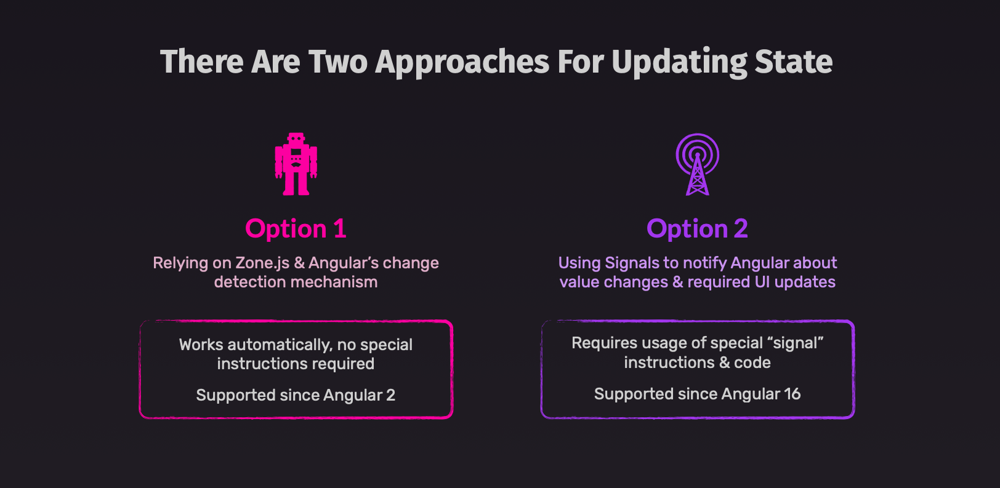
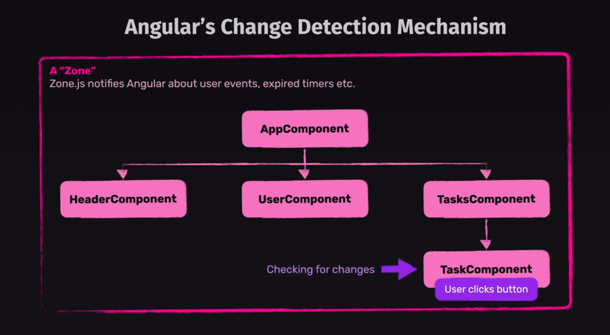
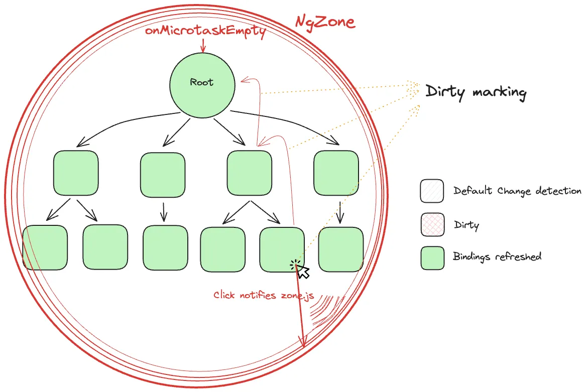
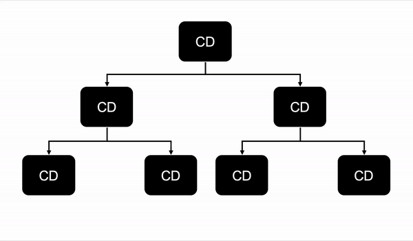
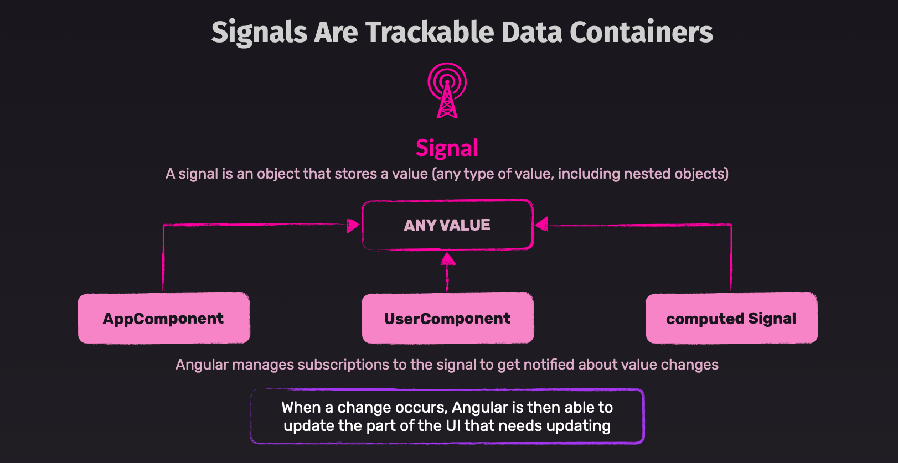
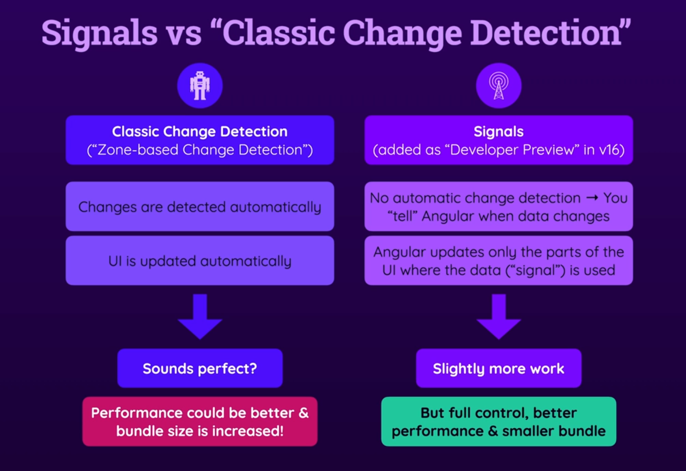
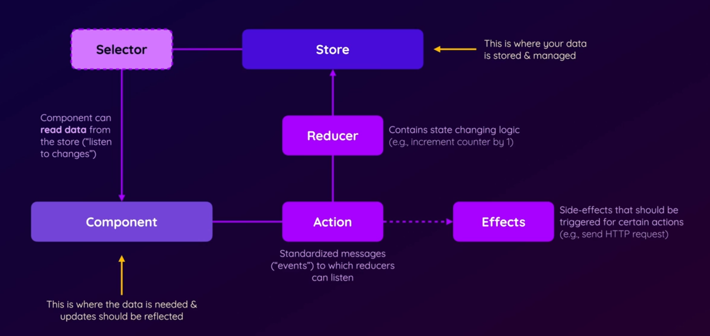
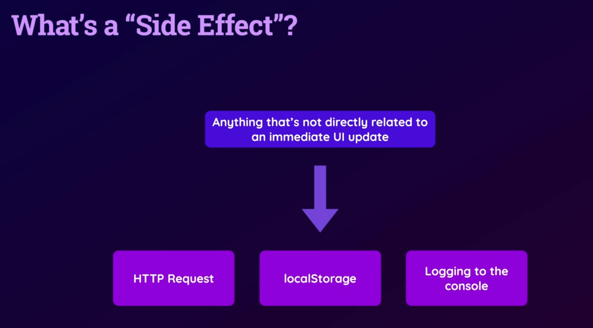

# INDEX

- [INDEX](#index)
  - [State](#state)
    - [State Management](#state-management)
  - [Angular Detection Mechanism](#angular-detection-mechanism)
    - [Zone.js](#zonejs)
    - [Performance Optimization in Detection Mechanism](#performance-optimization-in-detection-mechanism)
      - [Avoiding heavy operations in the component's Getters and Setters](#avoiding-heavy-operations-in-the-components-getters-and-setters)
      - [`OnPush` Strategy](#onpush-strategy)
      - [`ngZone.runOutsideAngular()`](#ngzonerunoutsideangular)
    - [Triggering Change Detection Manually](#triggering-change-detection-manually)
  - [Signals](#signals)
    - [How to use Signals?](#how-to-use-signals)
      - [`signal()`](#signal)
      - [`computed()`](#computed)
      - [`effect()` - Effects (Watchers)](#effect---effects-watchers)
    - [Signals Input and Output](#signals-input-and-output)
    - [Signals vs Zone.js](#signals-vs-zonejs)
    - [Signals vs Observables](#signals-vs-observables)
  - [NgRx](#ngrx)
    - [Key Concepts](#key-concepts)
      - [NgRx Store Structure](#ngrx-store-structure)
    - [How to Use NgRx](#how-to-use-ngrx)

---

## State

> **State** is data that changes over time and affects the behavior of the application.

**State** in Angular refers to the data that is used by the component to render the view. It's similar to `state` in React, where we use `useState` hook to manage the state of the component, but in Angular, we just declare the properties in the component class and use them in the template.

### State Management

- There're multiple approaches to manage state in Angular:
  
  - [Relying on `Zone.js`](#angular-detection-mechanism)
  - [Using `Signals`](#signals)
  - [Using a state management library like `NgRx` or `Akita`](#ngrx)

---

## Angular Detection Mechanism

> **Change Detection** is the process of checking if the component state has changed and updating the view accordingly

Angular uses a change detection mechanism to detect changes in the component state and update the view accordingly. This mechanism is based on the concept of `Zone.js`, which is a library that Angular uses to detect changes in the component state.


- When a property in the component class changes, Angular automatically updates the view to reflect the new value of the property, this is done by:
  - Checking **all components in the Application's component tree** to see if any of their properties have changed
  - If a property has changed, Angular updates the view (DOM) accordingly
- **Notes**
  - Angular's change detection mechanism **runs twice in development mode** to help catch errors, but it only runs once in production mode

### Zone.js

[`Zone.js`](https://www.npmjs.com/package/zone.js) is a library that Angular uses to detect changes in the component state and update the view accordingly. It **patches the `JavaScript` event loop and detects when an event occurs**, and then it triggers change detection in Angular.


- This means that when an event occurs, Angular will check if any of the component properties have changed, and if so, it will update the view accordingly
  
- This is done automatically, so you don't need to worry about it, but it's good to know how it works under the hood

---

### Performance Optimization in Detection Mechanism

- As the application grows, the number of components in the component tree increases, and this can lead to performance issues because Angular has to check all components in the tree to see if any of their properties have changed
- So, it's important to optimize the change detection mechanism to improve performance, and there are several ways to do this:

  - Avoid heavy-operations in the component's Getters and Setters, as they are called during change detection
  - Use `OnPush` change detection strategy
  - Use `trackBy` function in `*ngFor` directive
  - Use `async` pipe to handle observables
  - Use `ngZone.runOutsideAngular()` to run code outside of Angular's zone

#### Avoiding heavy operations in the component's Getters and Setters

- Avoid performing heavy operations in the component's Getters and Setters, as they are called during change detection, which can lead to performance issues

  > That's why **Pipes** are cached and only re-evaluated when the input value changes, to avoid heavy operations during change detection

- Instead, you can use a method to perform the heavy operation and call it only when needed, or use a `Signal` or `Computed` to manage the state
- For example, if you have a `getter` that performs a heavy operation, you can change it to a method and call it only when needed:

  ```ts
  import { Component } from '@angular/core';

  @Component({
    selector: 'app-example',
    template: `
      <p>Bad Result ❌: {{ result }}</p>
      <p>Good Result ✅: {{ getResult() }}</p>
      <button (click)="calculate()">Calculate</button>
    `
  })
  export class ExampleComponent {
    private heavyData = [1, 2, 3, 4, 5];

    // Bad ❌
    get result() {
      // This is a heavy operation that should not be called during change detection
      return this.heavyData.reduce((acc, val) => acc + val, 0);
    }

    // Good ✅
    getResult() {
      return this.heavyData.reduce((acc, val) => acc + val, 0);
    }

    calculate() {
      console.log('Calculating result...');
      // Call the method to perform the heavy operation
      console.log(this.getResult());
    }
  }
  ```

- In this example, the `getResult()` method performs a heavy operation, but it's called only when the user clicks the "Calculate" button, instead of being called during change detection
- This way, you avoid unnecessary performance overhead during change detection, and the heavy operation is performed only when needed

---

#### `OnPush` Strategy

The `OnPush` change detection strategy is a way to optimize change detection in Angular by **telling Angular to check the component only when certain conditions are met, instead of checking it on every change detection cycle**.

- When you use the `OnPush` strategy, Angular will only check the component **when something occurs inside the current component (or its children)**, such as:
  - The component's input properties change
  - An event occurs in the component (like a button click)
  - Signals or observables that the component is subscribed to emit a new value
- It's different than the default change detection strategy, which checks all components in the component tree on every change detection cycle
  
  
  > Here's a great article about this topic: [Make Your Angular App 100+ Times Faster with ‘OnPush’ Change Detection Strategy](https://medium.com/@yar.dobroskok/make-your-angular-app-100-times-faster-with-onpush-change-detection-strategy-76a272cd0f0c)
- This can significantly improve performance, especially in large applications with many components
  - This is because the `OnPush` strategy limits the things that can trigger change detection in the component, which can lead to better performance
- To use the `OnPush` strategy, you can set the `changeDetection` property in the component's decorator to `ChangeDetectionStrategy.OnPush`

  ```ts
  import { Component, ChangeDetectionStrategy } from '@angular/core';
  @Component({
    selector: 'app-example',
    template: `
      <p>Count: {{ count }}</p>
      <button (click)="increment()">Increment</button>
    `,
    changeDetection: ChangeDetectionStrategy.OnPush // Use OnPush strategy
  })
  export class ExampleComponent {
    count = 0;

    increment() {
      this.count++;
    }
  }
  ```

  - Here, the `ExampleComponent` will only be checked for changes when the `increment()` method is called, or when the component's input properties change, or when an observable emits a new value

- When not to use it?
  - When you have simple applications with few components, the default change detection strategy is sufficient
  - When you have components that rely on a shared state or global state, and needs to be updated when any part of the state changes, the default change detection strategy is more suitable

---

#### `ngZone.runOutsideAngular()`

This is called **"Avoiding Zone Pollution"** and it helps to improve performance by avoiding unnecessary change detection cycles

- It's similar to **Web Workers** in that it allows you to run code outside of Angular's zone, but it's not a separate thread, it's just a way to run code without triggering change detection

- Examples

  - Simple example of using `ngZone.runOutsideAngular()`:

    ```ts
    import { Component, NgZone } from '@angular/core';

    @Component({
      selector: 'app-example',
      template: `
        <button (click)="doSomething()">Do Something</button>
      `
    })
    export class ExampleComponent {
      constructor(private ngZone: NgZone) {}

      doSomething() {
        // Run the code outside of Angular's zone
        this.ngZone.runOutsideAngular(() => {
          // Perform some operation that doesn't require change detection
          console.log('Doing something outside of Angular zone');
        });
      }
    }
    ```

  - Complex example of doing heavy operations in the component:

    ```ts
    import { Component, NgZone } from '@angular/core';
    @Component({
      selector: 'app-example',
      template: `
        <button (click)="startHeavyOperation()">Start Heavy Operation</button>
      `
    })
    export class ExampleComponent {
      constructor(private ngZone: NgZone) {}

      startHeavyOperation() {
        // Run the heavy operation outside of Angular's zone
        this.ngZone.runOutsideAngular(() => {
          // Perform the heavy operation here
          // This will not trigger change detection
          setTimeout(() => {
            console.log('Heavy operation completed');
            // If you need to update the view, you can run it inside Angular's zone
            this.ngZone.run(() => {
              // Update the view here
            });
          }, 2000);
        });
      }
    }
    ```

---

### Triggering Change Detection Manually

This is done using `RxJS` Observables, `ChangeDetectorRef`, or `ApplicationRef`

- **`ChangeDetectorRef`**: This is a service that allows you to manually trigger change detection in a component. You can inject it into your component and use the `detectChanges()` method to trigger change detection manually.

  ```ts
  import { Component, ChangeDetectorRef } from '@angular/core';

  @Component({
    selector: 'app-example',
    template: `
      <p>Count: {{ count }}</p>
      <button (click)="increment()">Increment</button>
    `
  })
  export class ExampleComponent {
    count = 0;

    constructor(private cdr: ChangeDetectorRef) {}
    // "cdr" is short for ChangeDetectorRef

    increment() {
      this.count++;
      this.cdr.detectChanges(); // Manually trigger change detection
    }
  }
  ```

- Or, using RxJS Observables, you can create an observable that emits a value when the component state changes, and then subscribe to it in the component to trigger change detection

  ```ts
  import { Component } from '@angular/core';
  import { BehaviorSubject } from 'rxjs';

  @Component({
    selector: 'app-example',
    template: `
      <p>Count: {{ count$ | async }}</p>
      <button (click)="increment()">Increment</button>
    `
  })
  export class ExampleComponent {
    private countSubject = new BehaviorSubject<number>(0);
    count$ = this.countSubject.asObservable();

    increment() {
      this.countSubject.next(this.countSubject.value + 1); // Emit a new value to trigger change detection
    }
  }
  ```

  - You can find more about RxJS Observables in the [RxJS file](./6-Angular-RxJS.md)

---

## Signals

**Signals** are a new way to manage state in Angular, introduced in Angular 16, which allows you to create **reactive state** that can be used in the component template and automatically updates the view when the state changes.

- Signals are similar to
- `useState` in React, but they are more powerful and flexible
- `ref` in Vue, but they are more efficient and easier to use
- They're like a **container** that contains a value, and when the value changes, Angular is notified and updates the view accordingly wherever the signal is used
  

- **Signals are automatically tracked by Angular**, so when the signal value changes, Angular will update the view accordingly
- It's better than using `Zone.js` because it doesn't require any monkey-patching of the `JavaScript` event loop, and it's more efficient because it only updates the view when the signal value changes

> "monkey-patching" means modifying the behavior of a function or object at runtime, which can lead to performance issues and bugs

### How to use Signals?

#### `signal()`

- You can create a signal using the `signal` function from the `@angular/core` package

  ```ts
  import { signal } from '@angular/core';

  // Create a signal with an initial value
  const count = signal(0);
  ```

- You can use the signal in the component template using the `{{}}` syntax, **and you have to call the signal as a function to get its value**

  ```html
  <p>Count: {{ count() }}</p>
  ```

- You can update the signal value using:

  - `.set()` method to set a new value

    ```ts
    count.set(count() + 1);
    ```

  - `.update()` method to update the signal value based on its current value

    ```ts
    count.update(value => value + 1);
    isVisible.update(value => !value); // Toggling a boolean value

    // Note: you can also do this using the .set() method
    count.set(count() + 1); // Notice here that we're calling the signal as a function to get its value
    ```

- **Note for reference-type signals**

  - when working with `Arrays` or `Objects`, you should replace the entire array or object to trigger change detection, as signals do not track changes to the properties of an object or the elements of an array

    ```ts
    // For arrays
    const items = signal(['item1', 'item2']);
    items.set([...items(), 'item3']); // replace the entire array
    // or
    items.update(currentItems => [...currentItems, 'item3']); // add an item to the array

    // -----------------------------------------------------------------

    // For objects
    const user = signal({ name: 'John', age: 30 });
    user.set({ ...user(), age: 31 }); // replace the entire object
    // or
    user.update(currentUser => ({ ...currentUser, age: 31 })); // update a property of the object
    ```

---

#### `computed()`

- You can create a computed signal that depends on other signals using the `computed` function

  ```ts
  import { computed } from '@angular/core';

  doubleCount = computed(() => this.count() * 2);
  ```

- You can use the computed signal in the component template using the `{{}}` syntax, **and you have to call the computed signal as a function to get its value**

  ```html
  <p>Double Count: {{ doubleCount() }}</p>
  ```

- It will only be re-evaluated when the signals it depends on change, so it's more efficient than using a method that returns a value

---

#### `effect()` - Effects (Watchers)

- You can create an effect (or watcher) that runs when a signal changes using the `effect` function

  ```ts
  import { Component, effect } from '@angular/core';
  import { signal } from '@angular/core';
  @Component({
    selector: 'app-root',
    template: `
      <h1>Signals Example</h1>
      <p>Count: {{ count() }}</p>
      <button (click)="increment()">Increment</button>
    `
  })
  export class AppComponent {
    count = signal(0); // create a signal with an initial value

    constructor() {
      // ✅ Create an effect that runs when the count signal changes
      effect(() => {
        console.log('Count changed:', this.count());
      });
    }

    increment() {
      this.count.set(this.count() + 1); // update the count signal
    }
  }
  ```

---

### Signals Input and Output

- **`input`**

- You can use signals as input properties in a component by using the `input` decorator (it's lowercase unlike `@Input()` decorator)

  ```ts
  import { Component, input } from '@angular/core';

  @Component({
    selector: 'app-child',
    template: `
      <h2>{{ title }}</h2>
      <p>Child Count: {{ count() }}</p>
    `
  })
  export class ChildComponent {
    title = input.required<string>(); // create a required input signal
    count = input<number>(); // create an input signal
  }
  ```

- **`output`**

- You can use signals as output properties in a component by using the `output` decorator (it's lowercase unlike `@Output()` decorator)

  ```ts
  import { Component, output } from '@angular/core';

  @Component({
    selector: 'app-child',
    template: `
      <button (click)="increment()">Increment</button>
    `
  })
  export class ChildComponent {
    count = output<number>(); // create an output signal

    increment() {
      this.count.emit(this.count() + 1); // emit the new value of the count signal
    }
  }
  ```

- **⚠️ Note:** It doesn't create a signal, it just creates an output property that can be used to emit values from the component

- **2 way binding**

- You can use signals for 2-way binding with `ngModel` normally as Angular will detect that we're using signals and will update the view accordingly, and no need to use `()` syntax

  ```html
  <input [(ngModel)]="count" />
  <p>Count: {{ count() }}</p>
  ```

---

### Signals vs Zone.js



- `Signals` are more efficient than `Zone.js` because they only update the view when the `signal` value changes, while `Zone.js` updates the view whenever an event occurs
- `Signals` are more powerful than `Zone.js` because they allow you to create reactive state that can be used in the component template and automatically updates the view when the state changes
- `Signals` are easier to use than `Zone.js` because they don't require any monkey-patching of the `JavaScript` event loop, and they are more intuitive to use

- Signals give us full control over the reactivity of our components, allowing us to create more predictable and maintainable code, and reduce overhead on the browser's rendering engine when always updating the view for changes.

**Note:** Signals are still an experimental feature in Angular, and they are not yet widely used in production apps. But they are expected to become the standard way to manage state in Angular in the future.

---

### Signals vs Observables

**Signals** and **Observables** are both used for reactivity in Angular, but they serve different purposes

| Signals                                               | Observables                                                                                       |
| ----------------------------------------------------- | ------------------------------------------------------------------------------------------------- |
| Values in a container                                 | Values in a stream over time                                                                      |
| Automatically updates the view when the value changes | Updates the view when an event occurs                                                             |
| Should exiplicitly have initial value                 | Have no initial value when created, **But** can pass an initial value using configuration options |
| Best for local, synchronous state management          | Best for handling events & asynchronous data streams                                              |

- **Signals**

  - More efficient for local state management.
  - More efficient than Observables as they only update the view when the signal value changes. unlike Observables which update the view whenever an event occurs
  - Best for simple, synchronous state management inside components (no need for subscription management).
  - Hold a single value and update the view automatically when changed.
  - Easy to use and require less boilerplate.
  - Not designed for handling streams or async data.

- **Observables**

  - Best for handling asynchronous data streams (e.g., HTTP requests, user events).
  - Can emit multiple values over time.
  - Support powerful operators for data transformation.
  - Used widely in Angular for async operations and event handling.

- Similar functionality Example:

  ```ts
  import { Component, signal, effect } from '@angular/core';
  import { Observable, of } from 'rxjs';

  @Component({
    selector: 'app-example',
    template: `
      <p>Signal Count: {{ count() }}</p>
      <p>Observable Count: {{ observableCount$ | async }}</p>
      <button (click)="increment()">Increment</button>
    `
  })
  export class ExampleComponent {
    count = signal(0);
    observableCount$: Observable<number>;

    constructor() {
      // Using Signals
      effect(() => console.log('Signal Count:', this.count()));

      // Using Observables
      this.observableCount$.subscribe({
        next: (value) => console.log('Observable Count:', value),
      }
    }

    increment() {
      this.count.set(this.count() + 1);
      this.observableCount$ = of(this.count()); // Emit new value as an Observable
    }
  }
  ```

- **How to convert from Signals to Observables and vice versa?**

  - **From Signals to Observables**: You can use the `toObservable()` method on a signal to convert it to an observable

    ```ts
    import { toObservable } from '@angular/core';

    const countSignal = signal(0);
    const countObservable = toObservable(countSignal);
    ```

  - **From Observables to Signals**: You can use the `toSignal()` method on an observable to convert it to a signal

    ```ts
    import { toSignal } from '@angular/core';

    const countObservable = of(0);
    const countSignal = toSignal(countObservable);
    ```

**When to use which?**

- Use **Signals** for local, synchronous state that needs to update the view.
- Use **Observables** for async data, streams, or when you need advanced operators.
- You can combine both: use Observables for async data, then update Signals with the results for simple state management.

---

## NgRx

**NgRx** is a state management library for Angular applications inspired by **Redux**. It provides a way to manage state in a reactive way using Observables and the Redux pattern.

- It helps with the management of more complex (application-wide) state.
- **Benefits of Using NgRx**

  - Centralized state management
  - Predictable state changes
  - Time-travel debugging
  - Improved performance with memoized selectors

### Key Concepts



- **Store**: The single source of truth for the application state.
- **Selectors**: Functions that select a slice of state from the store.
- **Actions**: Events that describe a change in the state.
- **Reducers**: Functions that take the current state and an action, and return a new state.
- **Effects**: Functions that listen for actions and perform side effects (e.g., API calls).

#### NgRx Store Structure

A typical NgRx store follows a well-organized folder structure that separates concerns and makes the codebase maintainable:

```sh
src/
└── app/
  └── store/
    ├── actions/           # Action definitions
    │   ├── user.actions.ts
    │   ├── product.actions.ts
    │   └── ...
    ├── reducers/          # State reducers
    │   ├── user.reducer.ts
    │   ├── product.reducer.ts
    │   └── index.ts       # Root reducer combining all feature reducers
    ├── effects/           # Side effects handlers
    │   ├── user.effects.ts
    │   ├── product.effects.ts
    │   └── ...
    ├── selectors/         # State selectors
    │   ├── user.selectors.ts
    │   ├── product.selectors.ts
    │   └── ...
    ├── models/            # TypeScript interfaces/types
    │   ├── user.model.ts
    │   ├── product.model.ts
    │   ├── app-state.model.ts
    │   └── ...
    └── index.ts           # Barrel exports
```

**Alternative Feature-Based Structure** (recommended for larger apps):

```sh
src/
└── app/
  └── store/
    ├── user/              # User feature module
    │   ├── user.actions.ts
    │   ├── user.reducer.ts
    │   ├── user.effects.ts
    │   ├── user.selectors.ts
    │   ├── user.models.ts
    │   └── index.ts
    ├── product/           # Product feature module
    │   ├── product.actions.ts
    │   ├── product.reducer.ts
    │   ├── product.effects.ts
    │   ├── product.selectors.ts
    │   ├── product.models.ts
    │   └── index.ts
    ├── app.state.ts       # Root application state interface
    └── index.ts           # Root store configuration
```

**Key Files Explanation:**

- **`actions/`**: Define all possible events that can occur in your app
- **`reducers/`**: Pure functions that specify how state changes in response to actions
- **`effects/`**: Handle side effects like API calls, triggered by actions
- **`selectors/`**: Efficiently extract and compute derived state from the store
- **`models/`**: TypeScript interfaces defining the shape of your state
- **`index.ts`**: Barrel file for clean imports and store configuration

This structure promotes:

- **Separation of concerns**
- **Code reusability**
- **Easy testing**
- **Scalable architecture**

---

---

### How to Use NgRx

1. **Install NgRx**: Add NgRx to your Angular project using Angular CLI:

   ```bash
   ng add @ngrx/store @ngrx/effects @ngrx/store-devtools
   ```

   - If you're using **Modules**, you will find that this will modify your `app.module.ts` file to include the NgRx store module.

     ```ts
     import { StoreModule } from '@ngrx/store';
     import { effects } from './store/effects';
     import { reducers } from './store/reducers';

     @NgModule({
       imports: [
         StoreModule.forRoot(reducers), // 👈 Register the root reducer
         EffectsModule.forRoot(effects) // 👈 Register the root effects
       ]
     })
     export class AppModule {}
     ```

   - If you're using **standalone components**, it will modify the `main.ts` file to provide the NgRx store module in the `providers` array.

     ```ts
     // ...
     import { provideStore } from '@ngrx/store';

     bootstrapApplication(AppComponent, {
       providers: [provideStore(reducers)]
     });
     ```

   - `reducers` here is a combination of all feature reducers, which manage the state for their respective features.

     ```ts
     // reducers.ts 📄

     export const reducers = {
       user: userReducer,
       product: productReducer
     };
     ```

2. **Define State**: Create interfaces to define the shape of your application state.

   ```ts
   // user.state.ts 📄
   export interface UserState {
     user: User | null;
     loading: boolean;
     error: string | null;
   }

   export const initialState: UserState = {
     user: null,
     loading: false,
     error: null
   };
   ```

3. **Create Actions**: Define actions that describe state changes.

   ```ts
   // user.actions.ts 📄
   import { createAction, props } from '@ngrx/store';

   export const loadUser = createAction('[User] Load User');
   export const loadUserSuccess = createAction('[User] Load User Success', props<{ user: User }>());
   export const loadUserFailure = createAction(
     '[User] Load User Failure',
     props<{ error: string }>()
   );
   ```

   - Here, we define three actions related to user loading: initiating the load, handling success, and handling failure.
     - Each action is created using the `createAction` function from NgRx. it takes **(a string identifier and optional payload properties)**.
       - The string identifier is used to uniquely identify the action. it consists of **a feature name (e.g., `[User]`) and a descriptive action name (e.g., `Load User`)**.
       - The `props` function is used to define the shape of the payload for actions that require it.
     - Actions can be dispatched from components or services to trigger state changes.
   - There's another way to define actions instead of using `createAction`. which is to create a **class-based action**.

     ```ts
     import { Action } from '@ngrx/store';

     export class LoadUser implements Action {
       readonly type = '[User] Load User';
     }

     export class LoadUserSuccess implements Action {
       readonly type = '[User] Load User Success';
       constructor(public payload: { user: User }) {}
     }

     export class LoadUserFailure implements Action {
       readonly type = '[User] Load User Failure';
       constructor(public payload: { error: string }) {}
     }
     ```

4. **Implement Reducers**: Write reducer functions to handle state transitions based on actions.

   ```ts
   // user.reducer.ts 📄
   import { createReducer, on } from '@ngrx/store';
   import { loadUser, loadUserSuccess, loadUserFailure } from './user.actions';
   import { initialState } from './user.state';

   export const userReducer = createReducer(
     initialState,
     on(loadUser, state => ({ ...state, loading: true })),
     on(loadUserSuccess, (state, { user }) => ({ ...state, user, loading: false })),
     on(loadUserFailure, (state, { error }) => ({ ...state, error, loading: false }))
   );
   ```

5. **Register and use the store**: Import the store module in your app module (or standalone component) and register your reducers.

   ```ts
   // component.component.ts 📄
   import { Component } from '@angular/core';
   import { Store } from '@ngrx/store';
   import { loadUser } from './store/user.actions';
   import { UserState } from './store/user.state';

   @Component({
     selector: 'app-user',
     templateUrl: './user.component.html',
     styleUrls: ['./user.component.css']
   })
   export class UserComponent {
     // Inject the store 👈
     constructor(private store: Store<{ user: UserState }>) {}

     ngOnInit() {
       this.store.dispatch(loadUser()); // the action must be called inside the `dispatch` function

       // ⚠️ Subscribe to the user state (as it's an observable)
       this.store.select('user').subscribe(user => {
         console.log('user state:', user);
       });
     }
   }
   ```

   - When accessing the store's state, you can use the `select` method to retrieve specific slices of state. **(They are called "selectors")**
   - Note that they return an **observable**, so you need to subscribe to it to get the actual state.
   - Usually this is not how selectors are used in practice. Instead, you would define selector functions to encapsulate the selection logic which will be inside a `.selectors.ts` file.

6. **Define Selectors**: Create selector functions to encapsulate the selection logic.

   ```ts
   // user.selectors.ts 📄
   import { createFeatureSelector, createSelector } from '@ngrx/store';
   import { UserState } from './user.state';

   export const selectUserState = createFeatureSelector<UserState>('user');

   export const selectUser = createSelector(selectUserState, (state: UserState) => state.user);

   export const selectUserLoading = createSelector(
     selectUserState,
     (state: UserState) => state.loading
   );

   export const selectUserError = createSelector(
     selectUserState,
     (state: UserState) => state.error
   );
   ```

   - To use these selectors in your components, you can inject the store and use the `select` method.

     ```ts
     // user.component.ts 📄
     import { Component } from '@angular/core';
     import { Store } from '@ngrx/store';
     import { selectUser, selectUserLoading, selectUserError } from './store/user.selectors';

     @Component({
       selector: 'app-user',
       templateUrl: './user.component.html',
       styleUrls: ['./user.component.css']
     })
     export class UserComponent {
       user$ = this.store.select(selectUser);
       loading$ = this.store.select(selectUserLoading);
       error$ = this.store.select(selectUserError);

       constructor(private store: Store) {}
     }
     ```

     - Notice that we use `$` at the end of the observable variable names (e.g., `user$`). This is a common convention in Angular to indicate that the variable is an observable.

7. **Use Async Pipe**: In your component template, use the `async` pipe to subscribe to the observables and get the latest values.

   ```html
   <!-- user.component.html 📄 -->
   <div *ngIf="loading$ | async; else userContent">Loading...</div>
   <ng-template #userContent>
     <div *ngIf="error$ | async as error">Error: {{ error }}</div>
     <div *ngIf="user$ | async as user">User: {{ user.name }}</div>
   </ng-template>
   ```

   - **Note**: The `async` pipe automatically subscribes to the observable and unsubscribes when the component is destroyed, preventing memory leaks.

8. **Creating Effects**: Effects are used to handle side effects in your application, such as API calls. Create an effect to load the user data.
   

   ```ts
   // user.effects.ts 📄
   import { Injectable } from '@angular/core';
   import { Actions, createEffect, ofType } from '@ngrx/effects';
   import { UserService } from './user.service';
   import { loadUser, loadUserSuccess, loadUserFailure } from './user.actions';
   import { catchError, map, mergeMap } from 'rxjs/operators';

   @Injectable()
   export class UserEffects {
     constructor(private actions$: Actions, private userService: UserService) {}

     loadUser$ = createEffect(() =>
       this.actions$.pipe(
         ofType(loadUser),
         mergeMap(() =>
           this.userService.getUser().pipe(
             map(user => loadUserSuccess({ user })),
             catchError(error => of(loadUserFailure({ error })))
           )
         )
       )
     );
   }
   ```

   - **Note**: Effects are typically used for handling side effects, such as API calls, and are defined in a separate file (e.g., `user.effects.ts`).

   - **Register Effects**: Finally, register the effects in your module.

     ```ts
     // user.module.ts 📄
     import { NgModule } from '@angular/core';
     import { EffectsModule } from '@ngrx/effects';
     import { UserEffects } from './user.effects';

     @NgModule({
       imports: [EffectsModule.forFeature([UserEffects])]
     })
     export class UserModule {}
     ```

---

[⬆ back to top](#index)
