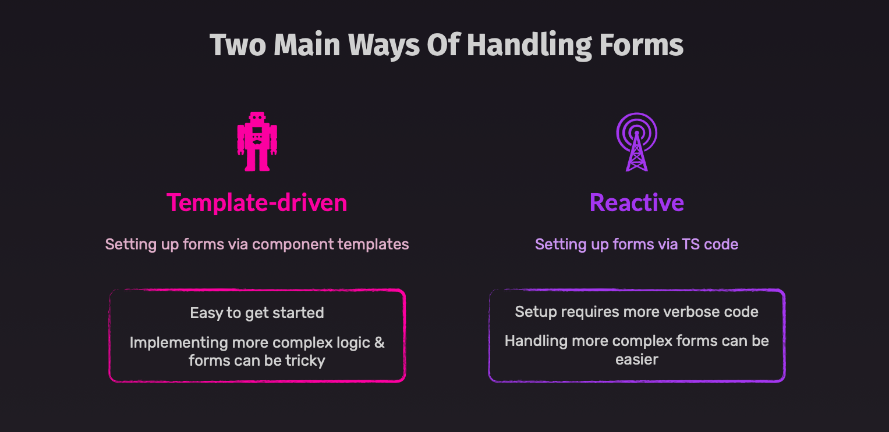
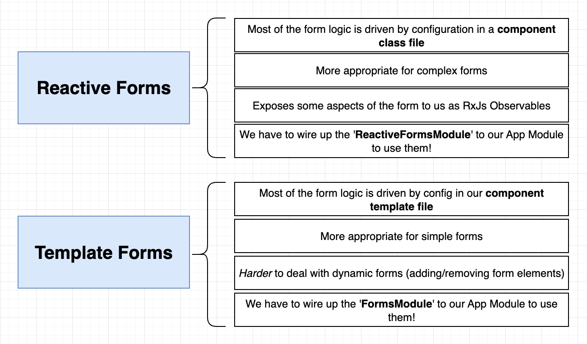
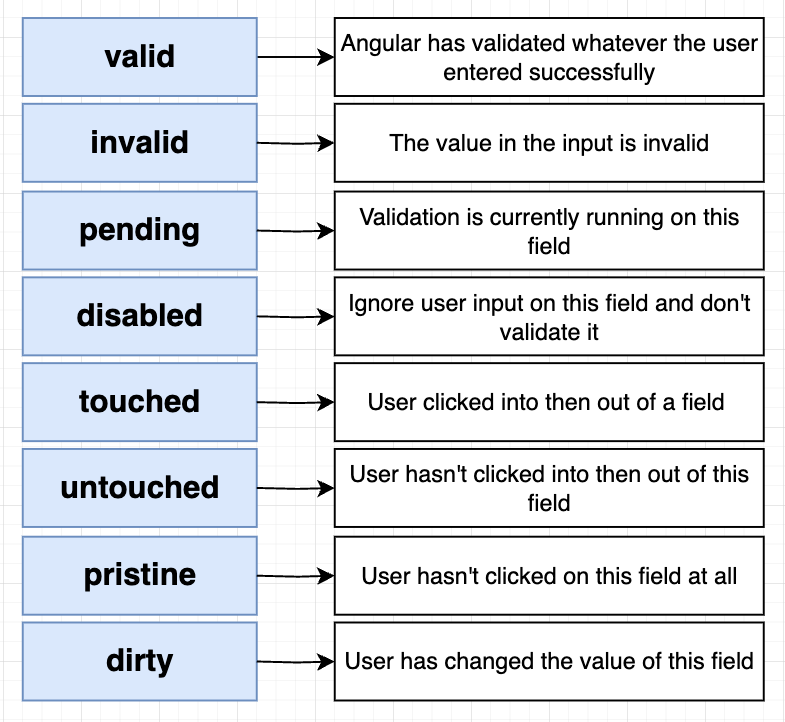
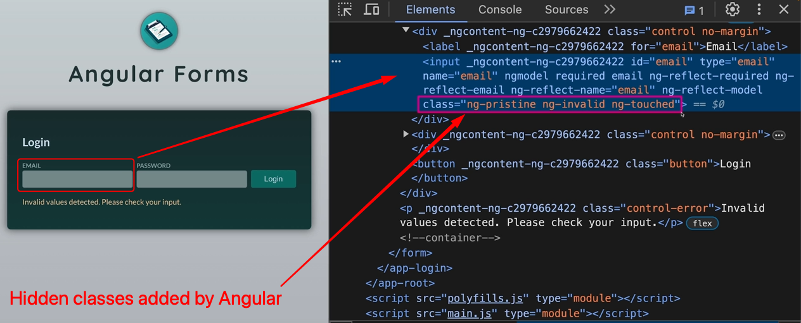
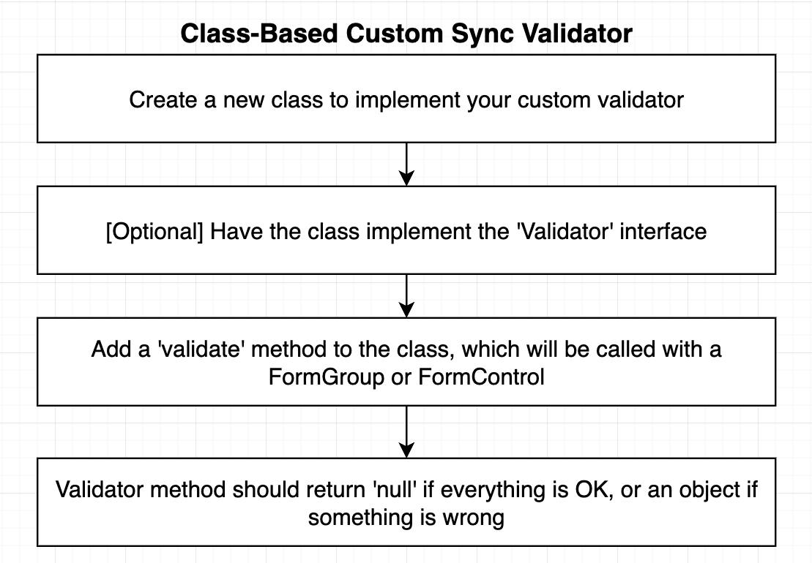

# INDEX

- [INDEX](#index)
  - [Forms and Input Handling](#forms-and-input-handling)
    - [Input Handling (Two-way data binding)](#input-handling-two-way-data-binding)
      - [Input masking in Angular](#input-masking-in-angular)
    - [Forms Handling](#forms-handling)
  - [Template Forms (`ngModel` \& `ngForm`)](#template-forms-ngmodel--ngform)
    - [How to create a template form](#how-to-create-a-template-form)
    - [Accessing form values and validity](#accessing-form-values-and-validity)
    - [Validation in template-driven forms](#validation-in-template-driven-forms)
    - [Watching Changes in the Form](#watching-changes-in-the-form)
    - [Updating Templates-Form Values Programmatically](#updating-templates-form-values-programmatically)
  - [Reactive Forms](#reactive-forms)
    - [How to create a reactive form](#how-to-create-a-reactive-form)
    - [Validation in reactive forms](#validation-in-reactive-forms)
      - [Custom validation in reactive forms](#custom-validation-in-reactive-forms)
      - [Synchronous vs Asynchronous validation](#synchronous-vs-asynchronous-validation)
    - [Updating Reactive Form Values Programmatically](#updating-reactive-form-values-programmatically)

---

## Forms and Input Handling

### Input Handling (Two-way data binding)

- To handle user input in Angular, you can use `two-way data binding` with the `ngModel` directive

  ```html
  <input [(ngModel)]="name" />
  ```

  - Here, we are creating a **two-way data binding** on the `input` element, so that the `name` property in the component class is updated when the input value changes, and the input value is updated when the `name` property changes

- It's a replacement for `event binding` and `property binding` to handle user input

  ```html
  <input [value]="name" (input)="name = $event.target.value" />
  ```

#### Input masking in Angular

- To create an input mask in Angular, you can use the [ngx-mask library](https://www.npmjs.com/package/ngx-mask)

  ```bash
  npm install ngx-mask --save
  ```

  - This library provides a directive that can be used to create an input mask

  ```html
  <!-- Create an input mask for a date field -->
  <input type="text" mask="00/00/0000" />
  ```

  - We can also use `pipe` to for masking text

    ```html
    <p>{{ '1234567890' | mask: '(000) 000-0000' }}</p>
    ```

- You can also create a custom input mask using the `input` event and the `value` property of the input element

  ```html
  <input (input)="onInput($event)" />
  ```

  ```ts
  onInput(event: Event) {
    const input = event.target as HTMLInputElement;
    // or const input = <HTMLInputElement>event.target;
    let value = input.value.replace(/\D/g, '');
    if (value.length > 8) {
      value = value.substr(0, 8);
    }
    input.value = value;
  }
  ```

  - Here, we are creating a custom input mask for a date field

---

### Forms Handling

Angular has **two different approaches** to handling user input through forms: (**Reactive Forms** and **Template Forms**). Both capture user input events from the view, validate the user input, create a form model and data model to update, and provide a way to track changes.




|                     | REACTIVE                                      | TEMPLATE-DRIVEN                                                   |
| ------------------- | --------------------------------------------- | ----------------------------------------------------------------- |
| Setup of form model | Explicit, created in component class manually | Implicit, created by directives (the class is created by Angular) |
| Data model          | Structured and immutable                      | Unstructured and mutable                                          |
| Data flow           | Synchronous                                   | Asynchronous                                                      |
| Form validation     | Functions                                     | Directives                                                        |
| Scalability         | Scalable                                      | better for small forms                                            |
| Selector            | `[FormGroup]` directive                       | `[ngForm]` directive                                              |

- Angular provides `ngSubmit` directive to handle form submission, which is used in both approaches

  ```html
  <form (ngSubmit)="onSubmit()">
    <input type="text" name="name" [(ngModel)]="name" />
    <button type="submit">Submit</button>
  </form>
  ```

  - **⚠️ Note:** In order to use `ngSubmit`, you need to import the `FormsModule` in the `app.module.ts` file or the standalone-component that uses it

    ```ts
    import { FormsModule } from '@angular/forms';

    @NgModule({
      imports: [FormsModule]
    })
    export class AppModule {}
    ```

  - or we can use the `submit` event, but the difference is that `ngSubmit` will not reload the page, while the `submit` event will reload the page

    ```html
    <form (submit)="onSubmit()">
      <input type="text" name="name" [(ngModel)]="name" />
      <button type="submit">Submit</button>
    </form>
    ```

---

## Template Forms (`ngModel` & `ngForm`)

Template-driven forms are more **declarative** and **asynchronous** than reactive forms. They are created in the template using the `ngModel` directive and the `ngForm` directive.

- Most of the setup is done in the template, and the form model is created implicitly by Angular, that's why it's called **template-driven forms**.
- Template-driven forms are **suitable for simple forms** and **small applications**.

- Here, we use `ngModel` directive **with 2-way-binding** added to the `input element`

  - a local-reference equal to `ngModel` is added to the `input element`

### How to create a template form

- **To create a template form:**

  - First, You need to import the `FormsModule` in the `app.module.ts` file (or the standalone component that uses it)

    ```ts
    // in app.module.ts
    import { FormsModule } from '@angular/forms';

    @NgModule({
      imports: [FormsModule]
    })
    export class AppModule {}
    ```

    - The `FormsModule` module provides the `ngModel` directive to create template forms

      > **Note**: without importing the `FormsModule` module, you will get an error like `Can't bind to 'ngModel' since it isn't a known property of 'input'`

  - Then, you can create a template form in the component template using the `ngForm` directive, and the `ngModel` directive, and using the `ngSubmit` event to handle form submission and access the form values

    - 1️⃣ Pass the `form` object to the `ngSubmit` event handler
    - 2️⃣ Use the `ngModel` directive to bind the form fields to the `form` object
    - 3️⃣ Access the form values using the `form.value` property on the handler

      ```html
      <!-- in app.component.html -->
      <form #form="ngForm" (ngSubmit)="onSubmit(form)">
        <input type="text" name="name" ngModel />
        <input type="email" name="email" ngModel />
        <input type="password" name="password" ngModel minlength="6" />
        <button type="submit">Submit</button>
      </form>
      ```

      ```ts
      // in app.component.ts
      import { Component } from '@angular/core';
      import { NgForm } from '@angular/forms';
      @Component({
        selector: 'app-root',
        template: 'app.component.html'
      })
      export class AppComponent {
        onSubmit(form: NgForm) {
          console.log(form.value); // { name: 'John', ... }
          console.log(form.status); // 'VALID' or 'INVALID'
        }
      }
      ```

      - ⚠️ Here, even if some input fields are not filled, the form will still be submitted, and you can handle the validation in the `onSubmit` method, so it's important to check the form validity before processing the form data

- **Validation** is done using the `Validators` class and the `errors` property of the `FormControl` object

  ```html
  <input [(ngModel)]="credentials.email" name="email" required email />
  ```

  - You can find more [Constraint validation attributes](https://developer.mozilla.org/en-US/docs/Web/HTML/Constraint_validation) here

---

### Accessing form values and validity

- You can access the form values and validity in the component class using the `NgForm` object like shown above, or you can access the form values and validity in the template using the `form` object

  ```html
  <p>Form value: {{ form.value | json }}</p>
  <p>Form status: {{ form.status }}</p>
  ```

- But sometimes you may want to access the form values before the form is submitted, so you can use the `#<fieldName>="ngModel"` syntax to create a local reference to the form field, and then you can access the value and validity of the form field in the template

  ```html
  <!-- Here, we need to access the value and validity of the name field, and not the whole form -->
  <input type="text" name="name" ngModel #nameField="ngModel" />
  <p>Name value: {{ nameField.value }}</p>
  <p>Name valid: {{ nameField.valid }}</p>
  ```

---

### Validation in template-driven forms

Here, we can use the `required`, `minlength`, `maxlength`, and `pattern` attributes to validate the form fields, and we can use the `ngModel` directive to bind the form fields to the component class and handle the validation in the component class.

- To validate the form fields, you can use the `required`, `minlength`, `maxlength`, and `pattern` attributes in the template

  ```html
  <form #form="ngForm" (ngSubmit)="onSubmit(form)">
    <input type="text" name="name" ngModel required />
    <input type="email" name="email" ngModel required email />
    <input type="password" name="password" ngModel required minlength="6" />
    <button type="submit">Submit</button>
  </form>
  ```

- You can also use the `ngModel` directive to bind the form fields to the component class and handle the validation in the component class, by accessing the `form.controls` object that contains the form fields and their validation status

  ```ts
  // in app.component.ts
  import { Component } from '@angular/core';
  import { NgForm } from '@angular/forms';
  @Component({
    selector: 'app-root',
    template: 'app.component.html'
  })
  export class AppComponent {
    name = '';
    email = '';
    password = '';

    onSubmit(form: NgForm) {
      if (form.valid) {
        console.log(form.value);
      } else {
        if (form.controls.name.errors?.required) {
          console.log('Name is required');
        }
        if (form.controls.email.errors?.required) {
          console.log('Email is required');
        }
        if (form.controls.email.errors?.email) {
          console.log('Email is invalid');
        }
        if (form.controls.password.errors?.required) {
          console.log('Password is required');
        }
        if (form.controls.password.errors?.minlength) {
          console.log('Password must be at least 6 characters long');
        }
      }
  ```

- Here're some of the values of the controls object that you can use to check the validation status of the form fields:
  
- Angular by default adds some hidden classes to the form fields to indicate their validation status, you can use these classes to style the form fields based on their validation status
  

  ```html
  <input
    type="text"
    name="name"
    ngModel
    required
    class="form-control"
    [ngClass]="{ 'is-invalid': form.controls.name.invalid && form.controls.name.touched }" />
  ```

---

### Watching Changes in the Form

- You can watch for changes in the form using the `ngAfterViewInit` lifecycle hook, which is called after the form is rendered, and you can access the form values and validity in the component class using the `viewChild` decorator to get a reference to the form
- To watch for changes in the form, you can use the **`valueChanges` observable** of the `NgForm` object, **which emits the form value whenever it changes**

  ```ts
  // in app.component.ts
  import { Component, ViewChild } from '@angular/core';
  import { NgForm } from '@angular/forms';

  @Component({
    selector: 'app-root',
    template: 'app.component.html'
  })
  export class AppComponent {
    @ViewChild('form') form: NgForm;
    // or as a signal:
    // private form = viewChild<NgForm>('form');

    ngAfterViewInit() {
      this.form.valueChanges.subscribe({
        next: value => {
          // Whenever the form value changes, this will log the form value
          console.log('Form value changed:', value);
        }
      });
    }
  }
  ```

- Following best practices for performance, we should do the following:

  - Unsubscribe from the `valueChanges` observable when the component is destroyed to avoid memory leaks, using the `ngOnDestroy` lifecycle hook to unsubscribe from the observable

    ```ts
    // in app.component.ts
    import { Component, ViewChild, OnDestroy } from '@angular/core';
    import { NgForm } from '@angular/forms';
    import { Subscription } from 'rxjs';

    @Component({
      selector: 'app-root',
      template: 'app.component.html'
    })
    export class AppComponent implements OnDestroy {
      @ViewChild('form') form: NgForm;
      private formSubscription: Subscription;

      ngAfterViewInit() {
        this.formSubscription = this.form.valueChanges.subscribe(value => {
          console.log('Form value changed:', value);
        });
      }

      ngOnDestroy() {
        this.formSubscription.unsubscribe(); // Unsubscribe to avoid memory leaks
      }
    }
    ```

  - Use **Debouncing** to limit the number of times the `valueChanges` observable emits values, especially for large forms or complex forms, to avoid performance issues, using the `debounceTime` operator from `rxjs/operators`

    ```ts
    // in app.component.ts
    import { debounceTime } from 'rxjs/operators';

    ngAfterViewInit() {
      this.formSubscription = this.form.valueChanges
        .pipe(debounceTime(300)) // Wait for 300ms before emitting the value
        .subscribe(value => {
          console.log('Form value changed:', value);
        });
    }
    ```

---

### Updating Templates-Form Values Programmatically

- To update the form values programmatically, you can use the `setValue` or `patchValue` methods of the `NgForm` object

  ```ts
  // in app.component.ts
  import { Component, ViewChild } from '@angular/core';
  import { NgForm } from '@angular/forms';

  @Component({
    selector: 'app-root',
    template: 'app.component.html'
  })
  export class AppComponent {
    @ViewChild('form') form: NgForm;

    updateForm() {
      this.form.setValue({
        name: 'John Doe',
        email: 'john@test.com'
      });
      // or you can use patchValue to update only some fields
      this.form.patchValue({
        name: 'John Doe'
      });
    }
  }
  ```

- **Common use cases**

  - Reset the form values to their initial state, you can use the `resetForm` method of the `NgForm` object

    ```ts
    // in app.component.ts
    resetForm() {
      this.form.resetForm(); // Reset the form values to their initial state
    }
    ```

  - Persist the form values on localStorage on render and on form submission, you can use the `localStorage` API to store the form values

    ```ts
    // in app.component.ts
    ngAfterViewInit() {
      const savedForm = localStorage.getItem('form');
      if (savedForm) {
        // in a conditional to check if the savedForm is not null (Typescript)
        this.form.setValue(JSON.parse(savedForm));
      }
    }
    ```

    - You might face errors that the form is not yet defined, so you can use a `setTimeout` to wait for the form to be rendered before accessing it

    ```ts
    // in app.component.ts
    ngAfterViewInit() {
      const savedForm = localStorage.getItem('form');

      setTimeout(() => {
        if (savedForm) {
          this.form.setValue(JSON.parse(savedForm));
        }
      });
    }
    ```

---

## Reactive Forms

Reactive forms are a more **structured** and **scalable** way to handle forms in Angular. They are based on the `ReactiveFormsModule` and provide a more programmatic approach to form handling.

- Benefits of using reactive forms:

  - Better typescript support, as reactive forms are based on creating a form model in the component class.
  - Reactive forms are **more explicit** and **synchronous** than template-driven forms.
  - Reactive forms has **better validation** and **error handling** capabilities.
  - Reactive forms are **more testable** than template-driven forms, as they provide a more structured way to handle forms and validation.
  - Reactive forms are **more suitable for complex forms** and **large applications**.

- Here, we don't do much in the template (we just connect the form to the template), and we do most of the setup in the component class, that's why it's called **reactive forms**.

  - `FormControl`

    - is used to create a single form field
    - it takes the initial value of the form field as an argument, and can also take an array of validators as the second argument

      ```ts
      const nameControl = new FormControl(''); // A form control with an initial value of ""

      const emailControl = new FormControl('', [Validators.required, Validators.email]); // A form control with an initial value of "" and validators
      ```

    - To provide the **type** of the form control, you can use the `FormControl` generic type (useful for dropdonwns, selectors inputs)

      ```ts
      const roleControl = new FormControl<string>(''); // A form control with an initial value of "" and type string

      // or

      const roleControl = new FormControl<'admin' | 'user' | 'guest'>('user'); // A form control with an initial value of "user" and type 'admin' | 'user' | 'guest'
      ```

  - `FormArray`

    - is used to create a dynamic list of form fields, It's commonly used for forms that require a list of items, like a list of emails or a list of phone numbers
    - it takes an array of `FormControl` or `FormGroup` objects as an argument, and can also take an array of validators as the second argument

      ```ts
      const myArray = new FormArray([
        new FormControl(''),
        new FormControl(''),
        new FormControl('')
      ]);
      ```

    - You can add or remove form controls from the array using the `push` and `removeAt` methods

      ```ts
      myArray.push(new FormControl('')); // Add a new form control to the array
      myArray.removeAt(0); // Remove the first form control from the array
      ```

  - `FormGroup`

    - is used to create a group of form fields
    - it takes an object with the form fields as keys and their initial values as values

      ```ts
      const myForm = new FormGroup({
        name: new FormControl(''),
        email: new FormControl(''),
        password: new FormControl('')
      });
      ```

    - You can have **Nested FormGroups** to create a more complex form structure (but it's not recommended to have more than 2 levels of nesting), and bind them to the template using the `formGroupName` directive

      ```ts
      const myForm = new FormGroup({
        user: new FormGroup({
          name: new FormControl(''),
          email: new FormControl('')
        }),
        password: new FormControl('')
      });
      ```

      ```html
      <form [formGroup]="myForm" (ngSubmit)="onSubmit()">
        <div formGroupName="user">
          <input formControlName="name" />
          <input formControlName="email" />
        </div>
        <input formControlName="password" />
        <button type="submit">Submit</button>
      </form>
      ```

### How to create a reactive form

- **To create a reactive form:**

  - 1️⃣ You need to import the `ReactiveFormsModule` in the `app.module.ts` file

    ```ts
    // in app.module.ts
    import { ReactiveFormsModule } from '@angular/forms';

    @NgModule({
      imports: [ReactiveFormsModule]
    })
    export class AppModule {}
    ```

    - The `ReactiveFormsModule` module provides the `FormControl`, `FormGroup`, and `FormArray` classes to create reactive forms

  - 2️⃣ Then, you can create a reactive form in the component class

    ```ts
    // in app.component.ts
    import { Component } from '@angular/core';
    import { FormGroup, FormControl, Validators } from '@angular/forms';

    @Component({
      selector: 'app-root',
      template: 'app.component.html'
    })
    export class AppComponent {
      // Telling Angular that we have a form group with the name "form"
      myForm = new FormGroup({
        name: new FormControl(''), // Telling Angular that we have a form-field named "name" with an initial value of ""
        email: new FormControl('', [
          Validators.required, // Telling Angular that the email field is required
          Validators.email // Telling Angular that the email field should be a valid email
        ]),
        password: new FormControl('', [
          Validators.required,
          Validators.minLength(6),
          Validators.pattern('^(?=.*[0-9])(?=.*[a-zA-Z])([a-zA-Z0-9]+)$')
        ])
      });

      onSubmit() {
        console.log(this.myForm.value); // { name: 'John', email: 'test@test.com', password: '123456' }
        console.log(this.myForm.get('name').value); // John
        // or
        // console.log(this.myForm.value.name); // John
        console.log(this.myForm.valid); // true or false
      }
    }
    ```

  - 3️⃣ Then, you can bind the form to the template using the `formGroup` directive, and bind the form fields to the form using the `formControlName` directive

    ```html
    <!-- in app.component.html -->
    <form [formGroup]="myForm" (ngSubmit)="onSubmit()">
      <input formControlName="name" />
      <!-- or -->
      <!-- <input type="email" [formControl]="myForm.get('email')" /> -->
      <input formControlName="email" />
      <input formControlName="password" />
      <button type="submit" [disabled]="!myForm.valid">Submit</button>
    </form>
    ```

    - The `formGroup` directive is used to bind the form to the template
    - The `formControlName` directive is used to bind the input element to a form field

  - 4️⃣ (OPTIONAL): You can handle form validation in the component class

    ```ts
    // in app.component.ts
    get email() {
      return this.myForm.get('email');
    }

    get password() {
      return this.myForm.get('password');
    }

    onSubmit() {
      if (this.myForm.valid) {
        console.log(this.myForm.value);
      } else {
        if (this.email.hasError('required')) {
          console.log('Email is required');
        }
        if (this.email.hasError('email')) {
          console.log('Email is invalid');
        }
        if (this.password.hasError('required')) {
          console.log('Password is required');
        }
      }
    }
    ```

    ```html
    <!-- in app.component.html -->
    <p *ngIf="email.hasError('required')">Email is required</p>
    <p *ngIf="email.hasError('email')">Email is invalid</p>
    <p *ngIf="password.hasError('required')">Password is required</p>
    ```

  - 5️⃣ (OPTIONAL): You can listen to form changes in the component class, by subscribing to the `valueChanges` or `statusChanges` observables from the form

    ```ts
    // in app.component.ts
    ngOnInit() {
      this.myForm.valueChanges.subscribe(value => {
        console.log(value); // Whenever the form value changes, this will log the form value
      });

      this.myForm.statusChanges.subscribe(status => {
        console.log(status); // Whenever the form status changes, this will log the form status
      });
    }
    ```

- Here, we are:
  - creating a reactive form with a single `FormControl` named `name` in the component class
  - We are binding the form to the `form` property in the component class using the `formGroup` directive
  - We are binding the input element to the `name` property in the form using the `formControlName` directive
  - We are handling the form submission using the `ngSubmit` event, and not using the `submit` event (because it will reload the page and we're using a reactive form)

---

### Validation in reactive forms

Here, we can use the `Validators` class to validate the form fields, and we can use the `errors` property of the `FormControl` object to check for validation errors.

- `Validators` is a class that **provides built-in validators** like `required`, `email`, `minLength`, `maxLength`, etc.

  - To have multiple validators for a form field, you can pass an array of validators to the `FormControl` constructor

- Example of creating a reactive form with validation:

  - 1️⃣ First, you need to import the `ReactiveFormsModule` in the `app.module.ts` file
  - 2️⃣ Then, you can create a reactive form in the component class using the `FormGroup` and `FormControl` classes, and use the `Validators` class to validate the form fields

    ```ts
    // in app.component.ts
    import { Component } from '@angular/core';
    import { FormGroup, FormControl, Validators } from '@angular/forms';
    @Component({
      selector: 'app-root',
      template: 'app.component.html'
    })
    export class AppComponent {
      myForm = new FormGroup({
        name: new FormControl(''), // without validation
        email: new FormControl('', [Validators.required, Validators.email]), // with validation (required and email-type)
        password: new FormControl('', [
          Validators.required,
          Validators.minLength(6),
          Validators.pattern('^(?=.*[0-9])(?=.*[a-zA-Z])([a-zA-Z0-9]+)$')
        ]) // with validation (required, minLength, and match-pattern)
      });

      onSubmit() {
        console.log(this.myForm.value);
      }
    }
    ```

  - 3️⃣ Then, you can bind the form to the template using the `formGroup` directive, and bind the form fields to the form using the `formControlName` directive

    ```html
    <!-- in app.component.html -->
    <form [formGroup]="myForm" (ngSubmit)="onSubmit()">
      <input formControlName="name" />
      <input formControlName="email" />
      <input formControlName="password" />
      <button type="submit">Submit</button>
    </form>
    ```

  - 4️⃣ Now, To access information about the form-field, you can use the `get()` method of the `FormGroup` object to get different properties of the form-field

    ```html
    <!-- in app.component.html -->
    <p *ngIf="myForm.get('email').hasError('required')">Email is required</p>
    <!-- or -->
    <!-- <p *ngIf="myForm.controls.email.hasError('required')">Email is required</p> -->
    <p *ngIf="myForm.get('email').touched && myForm.get('email').hasError('email')">
      Email is invalid
    </p>
    <p *ngIf="myForm.get('password').hasError('required')">Password is required</p>
    ```

- Here're some of the values of the controls object that you can use to check the validation status of the form fields:
  

#### Custom validation in reactive forms

Here, we can create custom validators to validate the form fields, and we can use the `errors` property of the `FormControl` object to check for validation errors.

- This can be done by passing a **function** to the `FormControl` constructor, instead of using the `Validators` class

  - The function should return `null` if the field is valid, and an object with the error message if the field is invalid
  - You can pass the function to the `FormControl` constructor as the second argument
  - The function have access to the:

    - (`FormControl` or `FormGroup` or `FormArray` or `AbstractControl`) objects

  - Example of custom validation for the password field

    ```ts
    // in the component class
    myForm = new FormGroup({
      // ...
      password: new FormControl('', [Validators.required, Validators.minLength(6), this.mustContainQuestionMark])
    });

    mustContainQuestionMark(control: FormControl) {
      if (!control.value.includes('?')) {
        return { mustContainQuestionMark: true };
      }
      return null;
    }
    ```

    ```html
    <!-- in the template -->
    <p *ngIf="password.hasError('invalidPassword')">
      Password should contain at least one letter and one number
    </p>
    ```

> **Note:** `Validators` class provides **static methods** to create validators, So, it's a good practice to create a custom validator as a **static method** in a separate class for custom validation

- To handle validation errors, you can use the `errors` property of the `FormControl` object

  - You can use the `hasError()` method to check if a specific error exists
  - You can use the `getError()` method to get the error message

  ```ts
  // in the component class
  get email() {
    return this.myForm.get('email');
    // or return this.myForm.controls.email;
  }

  get password() {
    return this.myForm.get('password');
  }

  onSubmit() {
    if (this.myForm.valid) {
      console.log(this.myForm.value);
    } else {
      if (this.email.hasError('required') && this.password.touched) {
        console.log('Email is required'); // or you can set an error message in the template via a variable
      }
      if (this.email.hasError('email')) {
        console.log('Email is invalid');
      }
      if (this.password.hasError('required')) {
        console.log('Password is required');
      }
    }
  }
  ```

#### Synchronous vs Asynchronous validation

- **Synchronous validation**:
  

  - is done using the `Validators` class and the `errors` property of the `FormControl` object
  - it's done **immediately** when the form is submitted
  - Example of **Class-Based Custom Validator**:

    ```ts
    // in the component class
    myForm = new FormGroup({
      // ...
      password: new FormControl('', [
        Validators.required,
        Validators.minLength(6),
        CustomValidators.passwordValidator
      ])
    });

    // in a separate file
    export class CustomValidators implements Validator {
      validate(control: AbstractControl): ValidationErrors | null {
        if (!control.value.match(/^(?=.*[0-9])(?=.*[a-zA-Z])([a-zA-Z0-9]+)$/)) {
          return { invalidPassword: true };
        }
        return null;
      }
    }
    ```

    - We use `Validator` interface to create a custom validator class, and to help Angular understand that this class is a validator and tell the developer how to use it correctly

- **Asynchronous validation**:
  

  - It's a validation that is done asynchronously, meaning it takes some time to complete, and it can be used to validate form fields that require a server request or some other asynchronous operation

  - is done using the `asyncValidator` property of the `FormControl` object
  - it's done **after a delay** when the form is submitted (like checking if the email is already taken from the server)
  - It's called after the synchronous validation is done **(to avoid unnecessary server requests)**
  - Example of **Async Custom Validator**:

    ```ts
    @Injectable({
      providedIn: 'root'
    })
    export class UniqueUsername implements AsyncValidator {
      constructor(private http: HttpClient) {} // 👈 inject the HttpClient

      // Arrow function to bind the context of 'this'
      validate = (control: FormControl) => {
        const { value } = control;

        return this.http.get<any>('https://api.angular-email.com/auth/signedin');
      };
    }

    // -------------------------OR------------------------- //
    export class UniqueUsername {
      static validate(control: AbstractControl): Promise<ValidationErrors | null> {
        return new Promise((resolve, reject) => {
          setTimeout(() => {
            if (control.value === 'test') {
              resolve({ isUsernameUnique: true });
            } else {
              resolve(null);
            }
          }, 2000);
        });
      }
    }
    ```

    - We use a **static method** to create an async custom validator, and to help Angular understand that this method is a validator and tell the developer how to use it correctly
    - We use `Promise` to create an async custom validator

---

### Updating Reactive Form Values Programmatically

- To update the form values programmatically, you can use the `setValue` or `patchValue` methods of the `FormGroup` object

  ```ts
  // in app.component.ts
  import { Component } from '@angular/core';
  import { FormGroup, FormControl } from '@angular/forms';

  @Component({
    selector: 'app-root',
    template: 'app.component.html'
  })
  export class AppComponent {
    myForm = new FormGroup({
      name: new FormControl(''),
      email: new FormControl(''),
      password: new FormControl('')
    });

    updateForm() {
      this.myForm.setValue({
        name: 'John Doe',
        email: 'john@test.com',
      });
    }

      // or you can use patchValue to update only some fields
      this.myForm.patchValue({
        name: 'John Doe'
      });
    }
  ```

---

[Back to top](#index)
