# INDEX

- [INDEX](#index)
  - [RxJS](#rxjs)
    - [Why use RxJS (reactive programming) instead of traditional Event Handling?](#why-use-rxjs-reactive-programming-instead-of-traditional-event-handling)
    - [RxJS Terminology](#rxjs-terminology)
    - [Reference \& Docs](#reference--docs)
  - [Observables](#observables)
    - [Creating an Observable](#creating-an-observable)
    - [Types of Observables](#types-of-observables)
      - [Unicast (Cold) Observables](#unicast-cold-observables)
      - [Multicast (Hot) Observables](#multicast-hot-observables)
      - [Subject Variations](#subject-variations)
    - [Dealing with multiple observables](#dealing-with-multiple-observables)
    - [Observables with Typescript](#observables-with-typescript)
    - [Error Handling in Observables](#error-handling-in-observables)
    - [Turning DOM events into observables](#turning-dom-events-into-observables)
  - [Operators](#operators)
    - [Transform Operators](#transform-operators)
    - [Flattening Operators](#flattening-operators)
    - [Creation Operators (create observable using operators)](#creation-operators-create-observable-using-operators)
    - [Error Handling Operators](#error-handling-operators)
    - [Other Operators](#other-operators)
  - [Common RxJS Issues](#common-rxjs-issues)
    - [Nested Subscriptions](#nested-subscriptions)
    - [Required return value](#required-return-value)
  - [RxJS in Angular](#rxjs-in-angular)
    - [How to use RxJS in Angular](#how-to-use-rxjs-in-angular)
      - [Handling observable events with the Forms API](#handling-observable-events-with-the-forms-api)
      - [Async Pipe for subscribing to observables in templates](#async-pipe-for-subscribing-to-observables-in-templates)
      - [Observables and the router](#observables-and-the-router)
    - [Example on how to use RxJS in Angular](#example-on-how-to-use-rxjs-in-angular)
      - [1️⃣ Fetching data from an API using an Angular service and an observable](#1️⃣-fetching-data-from-an-api-using-an-angular-service-and-an-observable)
      - [2️⃣ Authentication using an Angular service and an observable](#2️⃣-authentication-using-an-angular-service-and-an-observable)
      - [3️⃣ Using the `navigator` api to get the user's location](#3️⃣-using-the-navigator-api-to-get-the-users-location)
      - [4️⃣ Using the `navigator` api to get the user's location (With Pipe)](#4️⃣-using-the-navigator-api-to-get-the-users-location-with-pipe)

---

## RxJS

It's a **functional reactive library** for filtering, sorting and coordinating data **(Managing data)**.

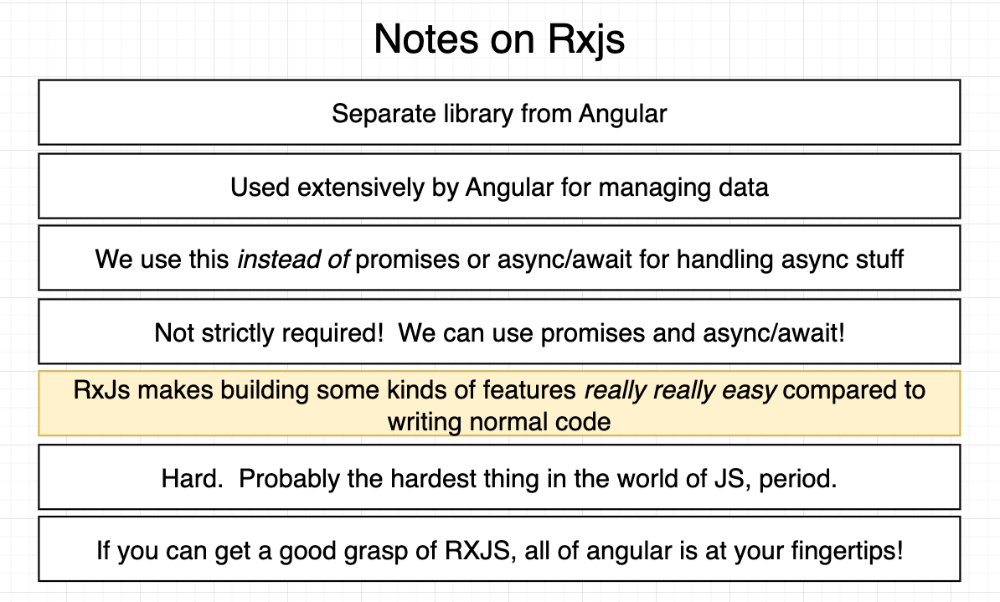

- It's a library for composing asynchronous and event-based programs by using observable sequences.
  - It provides one core type, the Observable, satellite types `(Observer, Schedulers, Subjects)` and operators inspired by Array#extras `(map, filter, reduce, every, etc)` to allow handling asynchronous events as collections.

- **It's a third-party library that is independent of Angular**, but it's used in Angular applications to handle asynchronous data streams.
- It can be used with Angular, React, Vue, Node.js, and other frameworks. But it's mostly used with Angular for:
  - handling HTTP requests
  - event handling
  - state management

---

### Why use RxJS (reactive programming) instead of traditional Event Handling?

Using RxJS provides powerful, clean, and elegant solutions, especially for handling complex streams of user interface (UI) events like typing in an input field.

- **⏳ Managing Event Frequency and Latency**
  - When a user types quickly, traditional event handling runs the risk of sending a request **for every single keystroke**. Trying to fix this manually with `setTimeout()` and `clearTimeout()` (known as **debouncing**) is cumbersome and error-prone.

  - RxJS Solution: The `debounceTime` operator automatically manages this. It ensures the observable only emits a value (and triggers the network request) after a specified time has passed **without any new keystrokes**, eliminating manual timer management.

- **🗑️ Cancelling Outdated Requests**
  - If a user continues typing, the requests for the earlier, incomplete search terms become obsolete. Traditional methods struggle to **cancel** these pending requests, which leads to network overload, wasted processing, and potentially processing an old result after a newer one.
  - RxJS Solution: The `switchMap` operator is key here. When a new value is emitted, `switchMap` automatically **cancels any previous, pending inner observable** (like a pending HTTP request) and starts the new one. This guarantees that only the result from the **latest** user input is ever processed.
    - it cancels the previous observable and the http request.
      

- **🔗 Streamlining Complex Operations**
  - RxJS treats events as **observable streams of data**. This lets you easily chain multiple data-processing steps (operators) together in a declarative way (e.g., filter the input, apply `debounceTime`, then use `switchMap` to make the request).
  - Result: You get **readable, maintainable, and highly composable code** for complex event flows.

---

### RxJS Terminology

- How **event-handling** works for this code

  ```js
  const input = document.querySelector('input');
  input.addEventListener('input', event => {
    let text = event.target.value;
    text = parseInt(text);
    if (isNaN(text)) {
      throw new Error('Not a number');
    }
    console.log(text);
  });
  ```

  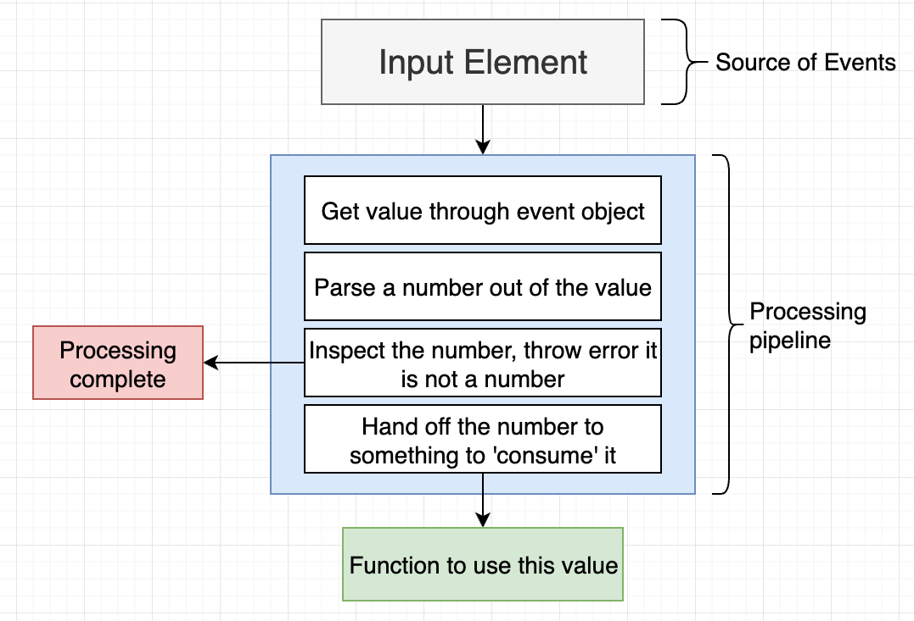

- How is this different in **RxJS**?
  - In RxJS, we have an **Observable** that wraps the input element and listens to the input event. **(instead of using `addEventListener` (imperative approach))**

    > **Observable:** Is something that emits data/events over time.

  - In RxJS, the "pipeline processing steps" are called **Operators**. which are used to transform the data sequently by using the `pipe` method.
  - In RxJS, the `subscribe` method is used to listen to the data emitted by the observable.
  - In RxJS, the `Observer` is used to handle the data emitted by the observable.

  ```js
  import { fromEvent } from 'rxjs';
  import { map } from 'rxjs/operators';

  const input = document.querySelector('input');
  const observable = fromEvent(input, 'input').pipe(
    map(event => event.target.value),
    map(text => parseInt(text)),
    map(value => {
      if (isNaN(value)) {
        throw new Error('Not a number');
      }
      return value;
    })
  );

  // Now we can subscribe to the observable to listen to the data emitted by the input element
  observable.subscribe({
    next: value => console.log(value),
    error: err => console.error(err), // optional (to handle errors)
    complete: () => console.log('done') // optional (similar to finally in promises)
  });
  ```

  
  - **Note:** for the `error` and `complete` methods, we should use **Arrow functions** to maintain the context of `this`. (because they are called by the observable, not by us)

---

### Reference & Docs

[Official Docs](https://rxjs.dev)

---

## Observables

It's wrapped around a data source that can emit data over time, and it allows us to listen to the data emitted by it (subscribe to it).

> Angular offers ready-to-use observables for implementing various scenarios: handling events, subscribing to the route’s parameters, checking the status of a form, handling HTTP requests, and more.

- **Observables** are used to handle asynchronous **data streams**.
- In Angular, Observables are usually **subscribed to** in the component class to handle asynchronous data. (**the component subscribes to the observable and listens to the data emitted by it)**
- It's a common convention to have the observable's name end with `$` to indicate that it's an observable. (like `data$`, `users$`, etc.)

| Method      | Description                                                                                                                    |
| ----------- | ------------------------------------------------------------------------------------------------------------------------------ |
| `next`      | Used to emit the data.                                                                                                         |
| `subscribe` | Used to listen to the data emitted by the observable.                                                                          |
| `complete`  | Used to indicate that the observable has completed emitting data **(After this, the observable will not emit any more data)**. |
| `error`     | Used to indicate that an error has occurred while emitting data.                                                               |

- Usually, we only focus on `next` and `subscribe` methods.
  - `complete` and `error` are used to handle the completion and error scenarios. (not used frequently)

  > It's similar to `then()...catch()...finally()` in promises, but with more flexibility and control over the data stream.

- Example of an observable that emits data:

  ```ts
  import { Observable } from 'rxjs';

  const observable = new Observable(subscriber => {
    subscriber.next(1);
    subscriber.next(2);
    subscriber.next(3);
    subscriber.complete(); // indicates that the observable has completed emitting data
  });

  observable.subscribe({
    next: value => console.log(value), // 1, 2, 3
    error: err => console.error(err), // optional (to handle errors)
    complete: () => console.log('done') // done
  });
  ```

  - Here, the callback function passed to the `Observable` constructor is called when the observable is created, and it receives a `subscriber` object that has the `next`, `complete`, and `error` methods.
    

- Observables have different types:
  - Unicast and Multicast Observables (based on the number of subscribers)
    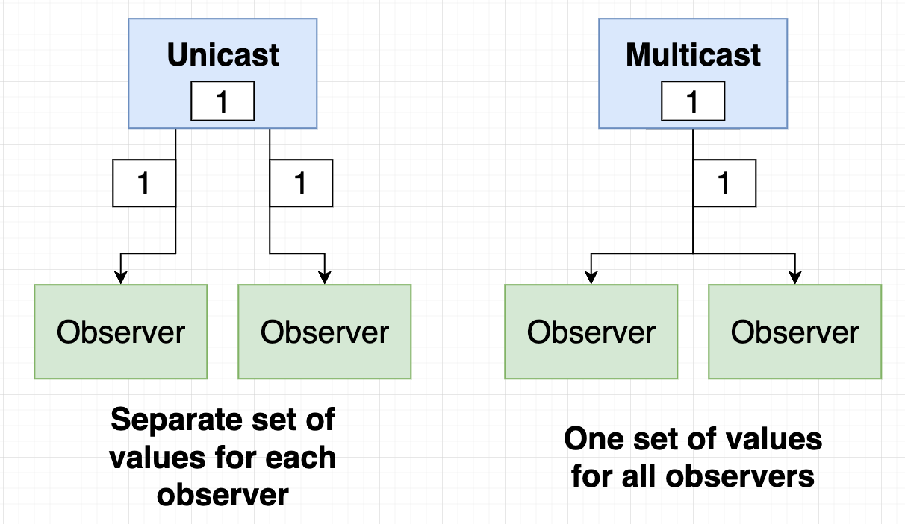
  - Hot and Cold Observables (based on the data source and event stream)
    

---

### Creating an Observable

- We can create an observable using the `Observable` class from the `rxjs` package.

  ```ts
  import { Observable } from 'rxjs';

  const observable = new Observable(subscriber => {
    // the callback function is called when the observable is created
    subscriber.next(1); // emit data
    subscriber.next(2); // emit data
    subscriber.next(3); // emit data
    subscriber.complete(); // indicate that the observable has completed emitting data
  });

  observable.subscribe(value => console.log(value)); // 1, 2, 3
  ```

  - Here, we have 2 callback functions:
    - The first one is passed to the `Observable` constructor, and it receives a `subscriber` object that has the `next`, `complete`, and `error` methods. **It tells the observable when and what data to emit**.
    - The second one is passed to the `subscribe` method, and it receives the data emitted by the observable. **It tells the observable what to do with the data emitted by it**.

- Another way to create an observable is by using the built-in functions that return observables, such as:
  - `of` operator from the `rxjs` package.

    ```ts
    import { of } from 'rxjs';

    const observable = of(1, 2, 3); // create an observable that emits the values 1, 2, and 3

    observable.subscribe(value => console.log(value)); // 1, 2, 3
    ```

  - `interval` operator from the `rxjs` package.

    ```ts
    import { interval } from 'rxjs';

    const observable = interval(1000); // create an observable that emits a value every second

    observable.subscribe(value => console.log(value)); // 0, 1, 2, 3, ...
    ```

---

### Types of Observables

There are two main types of observables: **(cold vs hot) and (unicast vs multicast)**.

> Think of "cold Observables" as they're created for each subscriber, and "hot Observables" as they share the same data stream among all subscribers.

#### Unicast (Cold) Observables

**Unicast Observables:** They are cold observables that emit data to a single subscriber at a time **(each subscriber has its own data stream)**.


> **"COLD"** means that the data is emitted only when there is a subscriber.
>
> **"UNICAST"** means that each subscriber has its own data stream.

- When a new subscriber subscribes to a cold observable, a new data stream is created for that subscriber (even if it was created before when another subscriber subscribed to it). **(meaning that we have separate data streams for each subscriber -> "Unicast")**
- Example:

  ```ts
  import { Observable } from 'rxjs';

  const observable = new Observable(subscriber => {
    subscriber.next(1);
    subscriber.next(2);
    subscriber.next(3);
    subscriber.complete();
  });

  // All operators are executed for each subscriber

  // first subscriber
  observable.subscribe(console.log); // 1, 2, 3
  // second subscriber
  observable.subscribe(console.log); // 1, 2, 3
  ```

  

- Each subscriber gets its own data stream. which means that all operators are executed for each subscriber.
- This can lead to performance issues if the data stream is expensive to create. **(Bad practice ❌)**
  

---

#### Multicast (Hot) Observables

**Multicast Observables:** They are hot observables that emit data to multiple subscribers at the same time **(all subscribers share the same data stream)**. Also called **Subjects** and we can call `.next()` on them to emit data outside the observable unlike the `Observable` class.
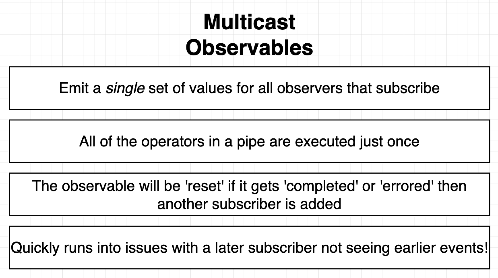

> **"HOT"** means that the data is emitted regardless of whether there are any subscribers.

- Example:

  ```ts
  import { Subject } from 'rxjs';

  const subject = new Subject();
  subject.next(1);
  subject.next(2);
  subject.next(3);
  setTimeout(() => subject.next(4), 1000); // emit data after 1 second

  // first subscriber
  subject.subscribe(console.log); // 1, 2, 3, ( 4 after 1 second )

  // second subscriber
  subject.subscribe(console.log); // ⚠️ in the beginning, it won't receive 1, 2, 3 because they were emitted before it subscribed, but it will receive 4 after 1 second
  ```

  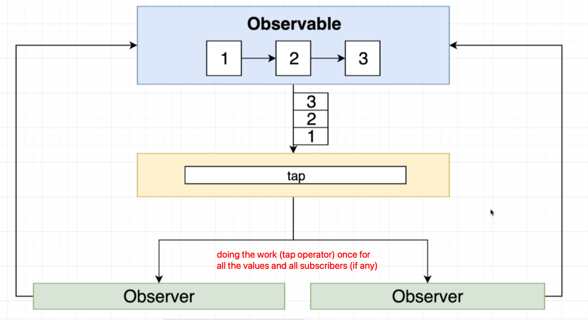

- All subscribers share the same data stream. which means that all operators are executed only once for all subscribers.
  - This can lead to performance improvements if the data stream is expensive to create. **(Good practice ✅)**
    
  - **But be careful! ⚠️** because all subscribers share the same data stream, if one observer subscribes after the data stream has completed, it will not receive any data, or after some operators are executed, it will not receive the data that was emitted before it subscribed.
    
- **Note:** If the observer gets `complete` or `error`, it will be reseted for new subscribers.
  - This is because it will be unsubscribed from the first subscription, and when a new subscription is made, it will be subscribed again.
- To convert a `cold` observable to a `hot` observable, we can use the `share` operator.

  ```ts
  import { Observable } from 'rxjs';
  import { share } from 'rxjs/operators';

  const observable = new Observable(subscriber => {
    subscriber.next(1);
    subscriber.next(2);
    subscriber.next(3);
    subscriber.complete();
  }).pipe(share()); // at the end of the pipeline to share the data stream after all operators are executed

  observable.subscribe(console.log); // 1, 2, 3
  observable.subscribe(console.log); // 1, 2, 3
  ```

- One of the great features of the `subject` is that we can emit data from outside the observable (unlike the `observable` class which emits data from inside the observable).
  - It's like a mix between the `observable` and the `observer` classes.
    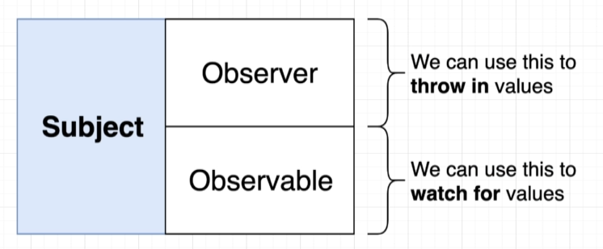

  ```ts
  import { Subject } from 'rxjs';

  const subject = new Subject();
  subject.next(1);
  subject.next(2);
  subject.next(3);

  subject.subscribe(console.log); // 1, 2, 3
  subject.subscribe(console.log); // 1, 2, 3

  subject.next(4);
  subject.next(5);
  subject.next(6);

  subject.subscribe(console.log); // 4, 5, 6
  subject.subscribe(console.log); // 4, 5, 6
  ```

  - We can emit data from outside the observable using the `next` method of the `subject`.
  - This is useful when we want to emit data from an event handler or a callback function.

#### Subject Variations

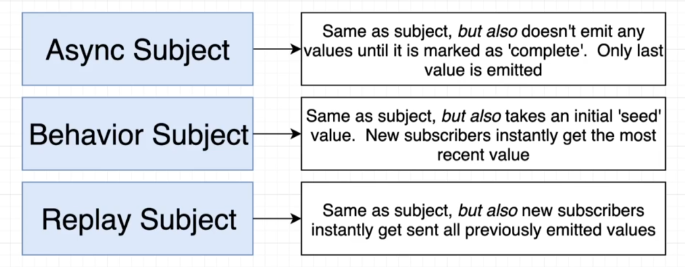

- **AsyncSubject:** It emits only the last value emitted by the observable when the observable completes.

  ```ts
  import { AsyncSubject } from 'rxjs';

  const subject = new AsyncSubject();
  subject.next(1);
  subject.next(2);
  subject.next(3);
  subject.complete(); // the subject will emit only the last value (3)

  subject.subscribe(console.log); // 3
  ```

  - Here, the `subject` won't emit any data until the `complete` method is called, and when it's called, it will emit only the last value (`3`).
  - It's rarely used ❌, because it's not common to emit only the last value of the observable.

- **BehaviorSubject:** It emits the most recent value emitted by the observable when a new subscriber subscribes to it. and also **requires an initial value**.

  ```ts
  import { BehaviorSubject } from 'rxjs';

  const subject = new BehaviorSubject(0);
  subject.next(1);
  subject.next(2);
  subject.next(3);

  subject.subscribe(console.log); // 3
  subject.subscribe(console.log); // 3
  ```

  - Here, the `subject` will emit the most recent value (`3`) when a new subscriber subscribes to it.
  - It's commonly used ✅, when we want to emit the most recent value of the observable to new subscribers. **(Ex: state management and user authentication status, more here [in the authentication section below](#2️⃣-authentication-using-an-angular-service-and-an-observable))**

- **ReplaySubject:** It emits a specified number of the most recent values emitted by the observable when a new subscriber subscribes to it.

  ```ts
  import { ReplaySubject } from 'rxjs';

  const subject = new ReplaySubject(2);
  subject.next(1);
  subject.next(2);
  subject.next(3);

  subject.subscribe(console.log); // 2, 3
  subject.subscribe(console.log); // 2, 3
  ```

  - Here, the `subject` **will emit the most previously and recent `2` emitted values** (`2, 3`) when a new subscriber subscribes to it.
  - It's commonly used ✅, when we want to emit a specified number of the most recent values of the observable to new subscribers.

---

### Dealing with multiple observables

- `combineLatest`
  - It is used to combine the latest values emitted by multiple observables.

  ```ts
  import { combineLatest, of } from 'rxjs';

  const observable1 = of(1, 2, 3);
  const observable2 = of('a', 'b', 'c');

  const combined = combineLatest([observable1, observable2]);

  combined.subscribe(value => console.log(value)); // [3, 'c']
  ```

  - Here, the `combineLatest` operator combines the latest values emitted by `observable1` and `observable2`, and emits them as an array.
  - It only emits when all observables have emitted at least once.
  - It's commonly used ✅, when we want to combine the latest values of multiple observables.

---

### Observables with Typescript

- We can use **Typescript** to define the type of the data emitted by the observable.

- This is done by using **generics** with the `Observable` class.
  - This is becase `Observable` is a generic class.
- Example:

  ```ts
  import { Observable } from 'rxjs';

  const observable = new Observable<number>(subscriber => {
    // the type of the data emitted by the observable is `number`
    subscriber.next(1);
    subscriber.next(2);
    subscriber.next(3);
    subscriber.complete();
  });

  // Now, when we subscribe to the observable, the data emitted by the observable will be of type `number`
  observable.subscribe(value => console.log(value)); // from type-inference, value is of type `number`
  ```

- This is super useful when we have a complex data structure that we want to emit from the observable.

  ```ts
  import { Observable } from 'rxjs';

  interface Car {
    year: number;
    color: string;
    running: boolean;
    make: {
      name: string;
      dateCreated: Date;
    };
  }

  const observable = new Observable<Car>(subscriber => {
    subscriber.next({
      year: 2000,
      color: 'red',
      running: true,
      make: {
        name: 'Chevy',
        dateCreated: new Date('2000-01-01')
      }
    });
  }).pipe(pluck('make', 'name')); // extract the `name` property from the `make` property

  observable.subscribe(value => console.log(value)); // Chevy, and it's of type `string` from (type-inference)
  ```

  - Typescript understands the type of the data emitted by the observable even when we use operators to transform the data.
    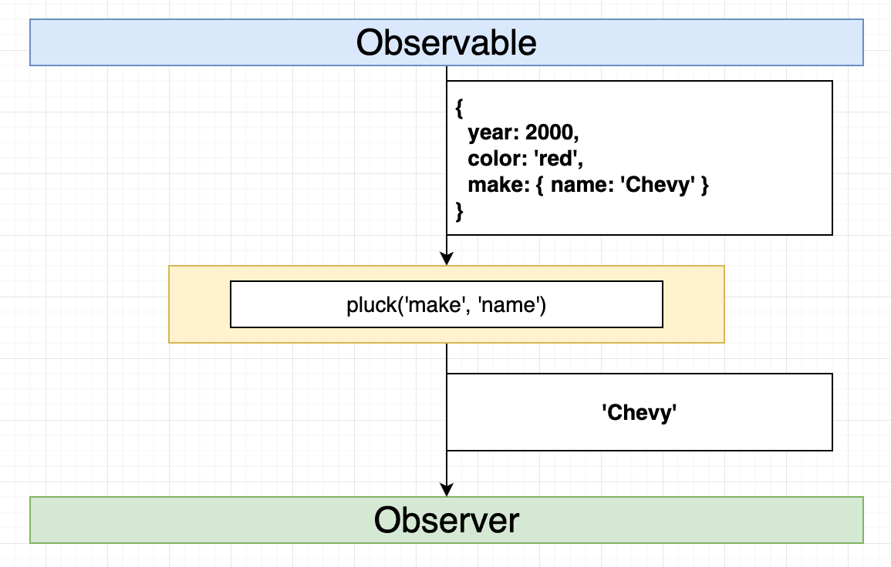

---

### Error Handling in Observables

It's important to handle errors in observables to prevent the application from crashing, and to provide developers with useful information about what went wrong.

- We can use the `error` method to handle errors emitted by the observable.

  ```ts
  import { Observable } from 'rxjs';

  const observable = new Observable(subscriber => {
    subscriber.next(1);
    subscriber.next(2);
    subscriber.next(3);
    subscriber.error('An error occurred');
    subscriber.next(4);
    subscriber.complete();
  });

  observable.subscribe({
    next: value => console.log(value),
    error: err => console.error(err)
  });
  ```

- We can use the `catchError` operator to handle errors emitted by the observable.

  ```ts
  import { of } from 'rxjs';
  import { catchError } from 'rxjs/operators';

  const observable = of(1, 2, 3, 4, 5).pipe(
    map(value => {
      if (value === 3) {
        throw new Error('An error occurred');
      }
      return value;
    }),
    catchError(err => of('Error occurred'))
  );

  observable.subscribe(console.log); // 1, 2, 'Error occurred'
  ```

  - The `catchError` operator catches the error emitted by the observable and returns a new observable that emits the error message.
  - It's the same as `error` method, when subscribing to the observable.

---

### Turning DOM events into observables

In Angular apps, we can get direct access to any DOM element using a special class called `ElementRef`, and then we can turn its events into observables using the `fromEvent` operator from the `rxjs` package.

```ts
import { Component, ElementRef, ViewChild, AfterViewInit } from '@angular/core';
import { fromEvent } from 'rxjs';
import { map } from 'rxjs/operators';

@Component({
  selector: 'app-root',
  template: `
    <input #inputElement type="text" placeholder="Type something..." />
  `
})
export class AppComponent implements AfterViewInit {
  @ViewChild('inputElement') inputElement!: ElementRef; // get a reference to the input element using `@ViewChild` decorator

  ngAfterViewInit() {
    // Create an observable from the input event of the input element, by providing a reference to the native element and the event name
    const input$ = fromEvent(this.inputElement.nativeElement, 'input').pipe(
      map((event: Event) => (event.target as HTMLInputElement).value)
    );

    input$.subscribe(value => console.log(value));
  }
}
```

- Notes:
  - It's recommended to create the observable in the `ngAfterViewInit` lifecycle hook, because the DOM elements are not available in the `ngOnInit` lifecycle hook.
  - We need to use `this.inputElement.nativeElement` to get the native DOM element from the `ElementRef` object.
  - We use `@ViewChild` decorator to get a reference to the DOM element in the template.

---

## Operators

It's a function that takes an observable as input and returns a new observable as output. It allows us to transform the data emitted by the observable, filter it, or combine it with other observables.


- To use operators, we need to import them from the `rxjs/operators` package. then we can use the `pipe` method to apply the operators to the observable.

  ```ts
  import { of } from 'rxjs';
  import { map, filter } from 'rxjs/operators';

  const observable = of(1, 2, 3, 4, 5).pipe(
    map(value => value * 2), // transform the data emitted by the observable
    filter(value => value > 5) // filter the data emitted by the observable
  );

  observable.subscribe(console.log); // 6, 8, 10
  ```

- **Operator Groups**
  
  - **Generic operators:** These are the operators that can be used with any type of observable.
  - **Specific operators:** These are the operators that are used with specific types of observables.
    - **Creation operators:** These are the operators that are used to create observables.
    - **Transformation operators:** These are the operators that are used to transform the data emitted by the observables.
    - **Filtering operators:** These are the operators that are used to filter the data emitted by the observables.
    - **Combination operators:** These are the operators that are used to combine the data emitted by the observables.
    - **Multicasting operators:** These are the operators that are used to multicast the data emitted by the observables.
    - **Error handling operators:** These are the operators that are used to handle the errors emitted by the observables.

- You will find that almost everythings has an operator for it in RxJS. So **it's a common practice to use operator for each task instead of grouping multiple tasks in a single operator**.

  ```js
  // ❌ Bad practice
  observable.pipe(
    map(parseInt(event.target.value)) // parse the value
  );

  // ✅ Good practice
  observable.pipe(
    map(event => event.target.value), // extract the value
    map(value => parseInt(value)) // parse the value
  );
  ```

---

### Transform Operators

- `map`: It is used to transform the data emitted by the observable.

  ```ts
  import { of } from 'rxjs';
  import { map } from 'rxjs/operators';

  const observable = of(1, 2, 3, 4, 5);
  observable.pipe(map(value => value * 2)).subscribe(console.log); // 2, 4, 6, 8, 10
  ```

- `tap`: It is used to perform side effects for the data emitted by the observable **(like logging, debugging, etc.)** without modifying the data. **(It's used for `console.log` the data)**

  ```ts
  import { of } from 'rxjs';
  import { tap } from 'rxjs/operators';

  const observable = of(1, 2, 3, 4, 5);
  observable.pipe(tap(value => console.log(value))).subscribe(); // 1, 2, 3, 4, 5
  ```

- `pluck`: It is used to extract a property from the data emitted by the observable.

  ```ts
  import { of } from 'rxjs';
  import { pluck } from 'rxjs/operators';

  const observable = of({ name: 'Alice', age: 30 }, { name: 'Bob', age: 25 });
  observable.pipe(pluck('name')).subscribe(console.log); // Alice, Bob
  ```

  - It's similar to `map` operator, but it's more concise and easier to read when we want to extract a property from an object.

---

### Flattening Operators


- `filter`: It is used to filter the data emitted by the observable.

  ```ts
  import { of } from 'rxjs';
  import { filter } from 'rxjs/operators';

  const observable = of(1, 2, 3, 4, 5);
  observable.pipe(filter(value => value % 2 === 0)).subscribe(console.log); // 2, 4
  ```

- `reduce`: It is used to reduce the data emitted by the observable.

  ```ts
  import { of } from 'rxjs';
  import { reduce } from 'rxjs/operators';

  const observable = of(1, 2, 3, 4, 5);
  observable.pipe(reduce((acc, value) => acc + value, 0)).subscribe(console.log); // 15
  ```

- `mergeMap`: It is used to merge the data emitted by the observable.

  ```ts
  import { of } from 'rxjs';
  import { mergeMap } from 'rxjs/operators';

  const observable = of(1, 2, 3, 4, 5);
  observable.pipe(mergeMap(value => of(value * 2))).subscribe(console.log); // 2, 4, 6, 8, 10
  ```

  - The `mergeMap` operator is used to subscribe to the inner observable and emit its data in the outer observable (without waiting for the inner observable to complete).
    

- `switchMap`:
  - **(New and preferred)** It is used to switch the data emitted by the observable by cancelling the previous inner observable when a new inner observable is created.
    - for example:
      - when the user is typing fast in an input field and we want to make a request to the server for each input change, but we want to cancel the previous request when a new request is made.
      - or when the form values change and we want to make a request to the server for each form value change, but we want to cancel the previous request when a new request is made.
    - we often use the `switchMap` operator when the data generated by the outer observable (the `FormControl`, in this case) is given to the inner observable (the getWeather() function): Observable1 - > switchMap(function) - > Observable2 - > subscribe(). If Observable1 pushes the new value, but the inner Observable2 hasn’t finished yet, Observable2 gets cancelled. **We’re switching over from the current inner observable to the new one**, and **the switchMap operator unsubscribes from the pending Observable2 and resubscribes again to handle the new value produced by Observable1**.
  - **(old and needs review)** It is used to switch the data emitted by the observable.

    ```ts
    import { of } from 'rxjs';
    import { switchMap } from 'rxjs/operators';

    const observable = of(1, 2, 3, 4, 5);
    observable.pipe(switchMap(value => of(value * 2))).subscribe(console.log); // 10
    ```

    - It takes a value and returns a new observable.
    - It's used when we have **nested subscriptions** and we want to avoid them **(observable inside an observable)**.
      - It is used to subscribe to the **inner observable** and emit its data in the **outer observable** (but it only emits the data from the last inner observable).
      - Meaning that is cancel the previous inner observable when a new inner observable is created.
        
    - This way, we avoid nested subscriptions and the problems that come with them when a conflict occurs between the data emitted by the inner observables.
    - It's commonly used with `http` requests to cancel the previous request when a new request is made.
      - Example: (calling a http request when the route `id` parameter changes)

        ```ts
        ngOnInit() {
          // Bad practice ❌ (nested subscription)
          this.route.params.subscribe(params => {
            this.emailService
              .getEmail(params['id'])
              .subscribe(email => (this.email = email));
          });

          // Good practice ✅ (using switchMap to avoid nested subscription and cancel the previous request when a new request is made)
          this.route.params
            .pipe(
              switchMap(params => this.emailService.getEmail(params['id']))
            )
            .subscribe(email => (this.email = email));

        }
        ```

        - In this example, we use the `switchMap` operator to switch the data emitted by the observable to the data emitted by the `fetch` request, and **cancel the previous request** when a new request is made that **conflicts** with it.
          

      - Example: (when the user is typing fast in an input field and we want to make a request to the server for each input change, but we want to cancel the previous request when a new request is made)

        ```ts
        import { fromEvent } from 'rxjs';
        import { switchMap } from 'rxjs/operators';

        const input = document.querySelector('input');
        fromEvent(input, 'input')
          .pipe(
            // ... other operators, then switch to the fetch request and cancel any conflicting requests (like typing fast)
            switchMap(params =>
              this.http.get('https://api.openweathermap.org/data/2.5/weather', { params })
            )
          )
          .subscribe(console.log);
        ```

        - In this example, we use the `switchMap` operator to switch the data emitted by the observable to the data emitted by the `fetch` request, and cancel the previous request when a new request is made that **conflicts** with it.
          

- `take`: It is used to take a specified number of values emitted by the observable and then complete the observable.

  ```ts
  import { of } from 'rxjs';
  import { take } from 'rxjs/operators';

  const observable = of(1, 2, 3, 4, 5);
  observable.pipe(take(3)).subscribe(console.log); // 1, 2, 3
  ```

  - It's useful when we want to limit the number of values emitted by the observable.

---

### Creation Operators (create observable using operators)

- `observable`: It is used to create an observable from a function **(low level)**

  ```ts
  import { Observable } from 'rxjs';

  const observable = new Observable(subscriber => {
    subscriber.next(1);
    subscriber.next(2);
    subscriber.next(3);
    subscriber.next(4);
    // subscriber.error('error');
    subscriber.next(5);
    subscriber.complete('done');
  });

  observable.subscribe(console.log); // 1, 2, 3, 4, 5, done
  ```

- `of`: It is used to create an observable from a list of values, or a single value inside an observable **(high level)**

  ```ts
  import { of } from 'rxjs';

  const observable = of(1, 2, 3, 4, 5);
  observable.subscribe(console.log); // 1, 2, 3, 4, 5
  ```

- `interval`: It is used to create an observable that emits a value at a specified interval of time.

  ```ts
  import { interval } from 'rxjs';

  const observable = interval(1000); // emit a value every second
  observable.subscribe(console.log); // 0, 1, 2, 3, ...
  ```

---

### Error Handling Operators

- `catchError`: It is used to catch the errors emitted by the observable and return a new observable that emits the error message.

  ```ts
  import { of } from 'rxjs';
  import { catchError } from 'rxjs/operators';

  const observable = of(1, 2, 3, 4, 5).pipe(
    map(value => {
      if (value === 3) {
        throw new Error('An error occurred');
      }
      return value;
    }),
    catchError(err => of('Error occurred'))
  );

  observable.subscribe(console.log); // 1, 2, 'Error occurred'
  ```

---

### Other Operators

- `delay`: It is used to delay the data emitted by the observable.

  ```ts
  import { of } from 'rxjs';
  import { delay } from 'rxjs/operators';

  const observable = of(1, 2, 3, 4, 5).pipe(delay(1000));
  observable.subscribe(console.log); // 1, 2, 3, 4, 5 (after 1 second)
  ```

- `scan`: It is used to accumulate the data emitted by the observable.

  ```ts
  import { of } from 'rxjs';
  import { scan } from 'rxjs/operators';

  const observable = of(1, 2, 3, 4, 5);
  observable.pipe(scan((acc, value) => acc + value, 0)).subscribe(console.log); // 1, 3, 6, 10, 15
  ```

  - The `scan` operator is similar to the `reduce` operator, but it emits the accumulated value **for each value emitted** by the observable. unlike the `reduce` operator which emits the accumulated value **only once** at the end of the observable.
  - Another example:

    ```ts
    import { Subject } from 'rxjs';
    import { scan } from 'rxjs/operators';

    const subject = new Subject();
    subject.pipe(scan((acc, value) => {
      if (value === 'increment') {
        return acc + 1;
      } else if (value === 'decrement') {
        return acc - 1;
    }, 0)).subscribe(console.log);

    subject.next('increment'); // 1
    subject.next('increment'); // 2
    subject.next('increment'); // 3
    subject.next('decrement'); // 2
    subject.next('increment'); // 3
    subject.next('increment'); // 4
    ```

  - Another example:

    ```ts
    import { Subject } from 'rxjs';
    import { scan } from 'rxjs/operators';

    const subject = new Subject();
    subject.pipe(scan((acc, value) => {
      if (value.type === 'success' || value.type === 'error') {
        return [...acc, value];
      }
      else if (value.type === 'clear') {
        return acc.filter(command ==> command.id !== value.id);
      }
    }, [])).subscribe(console.log);

    setTimeout(() => subject.next({
      type: 'success',
      id: 1,
      text: 'Fetched stuff'
    }), 1000);

    setTimeout(() => subject.next({
      type: 'error',
      id: 2,
      text: 'Failed to fetch stuff'
    }), 2000);

    setTimeout(() => subject.next({
      type: 'clear',
      id: 1
    }), 3000);
    ```

    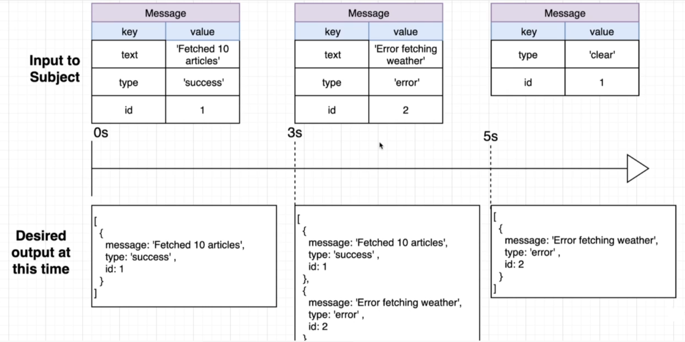

- `Retry`: It is used to retry the observable when an error occurs.

  ```ts
  import { of } from 'rxjs';
  import { retry } from 'rxjs/operators';

  const observable = of(1, 2, 3, 4, 5).pipe(
    map(value => {
      if (value === 3) {
        throw new Error('An error occurred');
      }
      return value;
    }),
    retry(2) // retry the observable 2 times when an error occurs
  );

  observable.subscribe(console.log); // 1, 2, 1, 2, 1, 2, 'An error occurred'
  ```

  - The `retry` operator is used to retry the observable a specified number of times when an error occurs.
    - Note: it only retries the operator that caused the error, not the whole observable.
  - It's commonly used with `http` requests to retry the request when it fails. (like when the user has a slow internet connection)

    ```ts
    import { fromEvent } from 'rxjs';
    import { switchMap, retry } from 'rxjs/operators';

    const input = document.querySelector('input');
    fromEvent(input, 'input')
      .pipe(
        // ... other operators, then switch to the fetch request and retry it 3 times when it fails
        switchMap(params =>
          this.http
            .get('https://api.openweathermap.org/data/2.5/weather', { params })
            .pipe(retry(3))
        )
      )
      .subscribe(console.log);
    ```

---

## Common RxJS Issues

### Nested Subscriptions

- **Nested subscriptions** are when we subscribe to an observable inside another subscription.

  ```ts
  import { of } from 'rxjs';

  const observable1 = of(1, 2, 3, 4, 5);
  observable1.subscribe(value => {
    console.log(value);
    const observable2 = of('a', 'b', 'c', 'd', 'e');
    observable2.subscribe(value => console.log(value));
  });
  ```

  - This can cause problems, as if the first observable was delayed, the second observable will not wait for the first observable to complete.
    - This can lead to **out of order data from the observables** (especially in `http` requests where the data is not emitted immediately).
    - This can lead to performance issues and memory leaks.
    - This can lead to the creation of multiple subscriptions that are not needed.

- **Solution**
  - Use **operators** to transform the data emitted by the observable instead of subscribing to it inside another subscription.
  - `mergeMap` operator

    ```ts
    import { of } from 'rxjs';
    import { mergeMap } from 'rxjs/operators';

    const observable1 = of(1, 2, 3, 4, 5);
    observable1
      .pipe(mergeMap(value => of('a', 'b', 'c', 'd', 'e')))
      .subscribe(value => console.log(value));
    ```

    - The `mergeMap` operator is used to subscribe to the inner observable and emit its data in the outer observable.
    - This way, we avoid nested subscriptions and the problems that come with them.

  - `switchMap` operator

    ```ts
    import { of } from 'rxjs';
    import { switchMap } from 'rxjs/operators';

    const observable1 = of(1, 2, 3, 4, 5);
    observable1
      .pipe(switchMap(value => of('a', 'b', 'c', 'd', 'e')))
      .subscribe(value => console.log(value));
    ```

    - The `switchMap` operator is used to subscribe to the **inner observable** and emit its data in the **outer observable**.
      
    - This way, we avoid nested subscriptions and the problems that come with them when a conflict occurs between the data emitted by the inner observables.

---

### Required return value

**RxJS** operators require a return value to work properly. If you don't return a value from the operator, the observable will not emit any data.

- This is because any observable needs to be marked as `complete` to emit data, and if you don't return a value from the operator, the observable will not be marked as `complete`.
- To fix this, you can return the value from the operator, or use the `EMPTY` observable to emit no data.

  ```ts
  // ❌
  this.emailService.getEmails().catchError(err => {
    console.error(err);
  });

  // ✅
  this.emailService.getEmails().catchError(err => {
    console.error(err);
    return EMPTY;
  });
  ```

  - The `EMPTY` observable is used to emit no data and mark the observable as `complete`.

---

## RxJS in Angular

- Angular uses **RxJS** for handling asynchronous data streams (like HTTP requests, event handling, and state management).
- Angular uses:
  - **Observables** to handle asynchronous data streams.
  - **Operators** to transform the data emitted by the observables.
  - **Subjects** to multicast the data emitted by the observables.

- Usually, we use **Observables** in Angular to handle asynchronous data streams in services and components.
  - This is because most of the Angular APIs and services **return observables that emit data asynchronously**.

> **Role of Observables in Angular:**
> Whenever you need to do something asynchronously in Angular, you should:
>
> - use a built-in Angular service that returns an observable
> - OR, wrap your asynchronous operation in an observable using the `Observable` class (by using `next`, `error`, and `complete` methods instead of returning a `promise`)
> - OR, create a promise from the observable if you need to use it with async/await
> - subscribe to the observable in the component to listen to the data emitted by it
> - use operators to transform the data emitted by the observable

### How to use RxJS in Angular

- To create an observable in Angular, we can use the `Observable` class from the `rxjs` package. and usually it's done in a service.
- Then, in order to use the observable in a component, we need to inject the service that contains the observable and subscribe to it to listen to the data emitted by it.
- In order to access the data that we subscribed to, we need to define a property in the component class and assign the data emitted by the observable to it.

  ```ts
  import { Component, OnInit } from '@angular/core';
  import { FetchDataService } from './fetch-data.service';
  import { Observable } from 'rxjs';

  @Component({
    selector: 'app-root',
    templateUrl: './app.component.html',
    styleUrls: ['./app.component.css']
  })
  export class AppComponent implements OnInit {
    fetchedData$: Observable<string[]>;
    constructor(private fetchDataService: FetchDataService) {}

    ngOnInit() {
      // subscribe to the observable returned by the service
      this.fetchedData$ = this.fetchDataService.fetchData();
      // Now, we can use the async pipe in the template to display the data
    }
  }
  ```

  - Now we can do 2 things to access it in the template:
    - 1️⃣ Use the `async` pipe to automatically subscribe to the observable and display the data.

      ```html
      <ul>
        <li *ngFor="let item of fetchedData$ | async">{{ item }}</li>
      </ul>
      ```

    - 2️⃣ Or, we can subscribe to the observable in the component and assign the data to a property, then use that property in the template.

      ```ts
      this.fetchDataService.fetchData().subscribe(data => {
        this.fetchedData = data;
      });
      ```

- Note:
  - if you want to catch errors emitted by the observable, you can use the `catchError` operator in the service or the `error` method in the subscription. **Note that when using the `next` and `error` methods in the subscription, you should be careful about `this` keyword binding. so use arrow functions to avoid this issue.**

    ```ts
    // 1. Using catchError operator in the service
    return this.fetchDataService
      .fetchData()
      .pipe(
        catchError(err => {
          console.error(err);
          return of([]); // return an empty array or any default value
        })
      )
      .subscribe(data => {
        this.fetchedData = data;
      });

    // --------------------------------------------------------------------

    // 2. Using error method in the subscription
    this.fetchDataService.fetchData().subscribe({
      next: data => {
        this.fetchedData = data;
      },
      error: err => {
        console.error(err);
      },
      complete: () => {
        console.log('Data fetching completed');
      }
    });
    ```

---

#### Handling observable events with the Forms API

In Angular, we can use the **Forms API** to handle form events and turn them into observables using the `valueChanges` & `statusChanges` properties of the `FormControl` class.

- It's covered here: [Watching/Reacting to form changes (RxJS in Reactive Forms)](./8-Angular-Forms.md#watchingreacting-to-form-changes-rxjs-in-reactive-forms)

---

#### Async Pipe for subscribing to observables in templates

- The `async` pipe is a built-in Angular pipe that allows us to subscribe to an observable in the template and automatically unsubscribe from it when the component is destroyed.

  ```html
  <div *ngIf="data$ | async as data; else loading">
    <pre>{{ data | json }}</pre>
  </div>
  <ng-template #loading>
    <p>Loading...</p>
  </ng-template>
  ```

  ```ts
  export class AppComponent {
    data$: Observable<any>;
    constructor(private dataService: DataService) {
      this.data$ = this.dataService.getData(); // no need to subscribe here
    }
  }
  ```

  - Here, we use the `async` pipe to subscribe to the `data$` observable and assign the emitted data to the `data` variable.
  - We also use the `else` clause to display a loading message while waiting for the data to be emitted.
  - The `async` pipe **automatically unsubscribes from the observable when the component is destroyed**, preventing memory leaks.

- With `async` pipes , you can use the special syntax `async as` to **avoid creating multiple subscriptions in templates**. To fix this , you can use `async as` syntax to create a single subscription and assign the emitted data to a variable.
  - `async`: It subscribes to the observable and returns the emitted data.
  - `async as`: It subscribes to the observable and assigns the emitted data to a variable that can be used in the template.

  ```html
  <!-- Using async -->
  <div *ngIf="data$ | async">
    <pre>{{ data$ | async | json }}</pre>
    <!-- ❌ This creates multiple subscriptions -->
  </div>

  <!-- Using async as -->
  <div *ngIf="data$ | async as data">
    <pre>{{ data | json }}</pre>
    <!-- ✅ This creates a single subscription -->
  </div>
  ```

- Don't forget to catch errors also when using `async` pipe, by using `pipe()` and the `catchError` operator in the service that returns the observable.

  ```ts
  // 1️⃣ when using async pipe in the template
  return this.http.get('https://api.example.com/data').pipe(
    catchError(err => {
      console.error(err);
      return of([]); // return an empty array or any default value so that the observable completes successfully
    })
  );

  // 2️⃣ when subscribing to the observable in the component
  this.http.get('https://api.example.com/data').subscribe({
    next: data => {
      this.data = data;
    },
    error: err => {
      console.error(err);
    }
  });
  ```

---

#### Observables and the router

The Angular Router uses observables to handle route changes and navigation events.

- We can subscribe to the `params`, `queryParams`, `fragment`, and `data` observables of the `ActivatedRoute` class to listen to route changes and access the route parameters, query parameters, fragment, and data.

  ```ts
  import { Component, OnInit } from '@angular/core';
  import { ActivatedRoute } from '@angular/router';

  @Component({
    selector: 'app-root',
    templateUrl: './app.component.html',
    styleUrls: ['./app.component.css']
  })
  export class AppComponent implements OnInit {
    constructor(private route: ActivatedRoute) {}

    ngOnInit() {
      this.route.params.subscribe(params => {
        console.log(params); // access route parameters
      });

      this.route.queryParams.subscribe(queryParams => {
        console.log(queryParams); // access query parameters
      });

      this.route.fragment.subscribe(fragment => {
        console.log(fragment); // access fragment
      });

      this.route.data.subscribe(data => {
        console.log(data); // access route data
      });
    }
  }
  ```

> Take in mind that we can access these data also using the `snapshot` property of the `ActivatedRoute` class, but using observables is preferred as it allows us to listen to changes in the route data, instead of accessing the data only once when the component is initialized.

- Example: (when the route `id` parameter changes, we fetch the email with that id)
  - When the user clicks the product for the first time, the router performs the following steps:
    1. It navigates to the route `/products/1`.
    2. It creates the `ProductDetailComponent` instance.
    3. It attaches `ProductDetailComponent` to the DOM.
    4. It renders the component template.
    5. It passes the route parameters to the component using the `ActivatedRoute` service.
    6. It fetches the product with id `1` and displays it.

  - Now, when the user clicks another product (with id `2`), not all of the above steps are repeated. Instead, only the following steps are performed:
    1. The router updates the route to `/products/2`.
    2. It updates the `ActivatedRoute` service with the new route parameters.
    3. It notifies the `ProductDetailComponent` about the change in the route parameters.
    4. The component fetches the product with id `2` and displays it.

  - So, in this case, we need to listen to the changes in the route parameters using the `params` observable of the `ActivatedRoute` service, instead of accessing the route parameters only once using the `snapshot` property.

  ```ts
  export class ProductDetailComponent implements OnInit {
    product: any;

    constructor(
      private route: ActivatedRoute,
      private productService: ProductService
    ) {}

    ngOnInit() {
      // Bad practice ❌ (nested subscription)
      this.route.params.subscribe(params => {
        this.productService.getProduct(params['id']).subscribe(product => (this.product = product));
      });

      // Good practice ✅ (using switchMap to avoid nested subscription and cancel the previous request when a new request is made)
      this.route.params
        .pipe(switchMap(params => this.productService.getProduct(params['id'])))
        .subscribe(product => (this.product = product));
    }
  }
  ```

---

### Example on how to use RxJS in Angular

#### 1️⃣ Fetching data from an API using an Angular service and an observable

```ts
export class FetchDataService {
  constructor(private http: HttpClient) {}

  fetchData() {
    return this.http.get('https://jsonplaceholder.typicode.com/posts');
    // `http` returns an observable that emits the data from the API
  }
}
```

```ts
export class AppComponent implements OnInit {
  fetchData: string[];

  constructor(private fetchDataService: FetchDataService) {}

  ngOnInit() {
    // `fetchData()` returns an observable that emits the data from the API (we can subscribe to it to listen to the data)
    this.fetchDataService.fetchData().subscribe(data => {
      this.fetchData = data.results.search;
    });
    // Note: calling just `fetchData()` will not make the HTTP request, we need to subscribe to it to make the request and listen to the data
  }
}
```

- **Improvement 1️⃣:** Using an operator to transform the data emitted by the observable and only emit what the component needs.

  ```ts
  export class FetchDataService {
    constructor(private http: HttpClient) {}

    fetchData() {
      return this.http
        .get('https://jsonplaceholder.typicode.com/posts')
        .pipe(map(data => data.results.search));
    }
  }
  ```

  - Now, the component only receives the data that it needs.

    ```ts
    export class AppComponent implements OnInit {
      fetchData: string;

      constructor(private fetchDataService: FetchDataService) {}

      ngOnInit() {
        this.fetchDataService.fetchData().subscribe(data => {
          this.fetchData = data;
        });
      }
    }
    ```

- **Improvement 2️⃣:** Using a `generic` type to define the type of the data emitted by the observable, and add error handling.

  ```ts
  interface responseData {
    results: {
      search: {
        title: string;
        snippet: string;
        pageId: number;
      }[];
    };
  }

  export class FetchDataService {
    constructor(private http: HttpClient) {}

    fetchData() {
      return this.http.get<responseData>('https://jsonplaceholder.typicode.com/posts').pipe(
        map(data => data.results.search),
        catchError(err => of('An error occurred'))
      );
    }
  }
  ```

  - As `http.get` returns an observable, we can use **generics** to define the type of the data emitted by the observable.
    - By doing this, **Typescript** will understand the type of the data emitted by the observable and provide useful information about it.
  - We can use the `catchError` operator to handle errors emitted by the observable.
  - Now, the component receives the data of type `string` and can handle errors.

    ```ts
    export class AppComponent implements OnInit {
      fetchData: string;

      constructor(private fetchDataService: FetchDataService) {}

      ngOnInit() {
        this.fetchDataService.fetchData().subscribe(data => {
          this.fetchData = data;
        });
      }
    }
    ```

---

#### 2️⃣ Authentication using an Angular service and an observable

1. First, we create a service that handles the authentication logic and returns an observable that emits the authentication status.

   ```ts
   export class AuthService {
     // private isAuthenticated = false; // ❌ This is not a good practice, Instead it should be an observable or behavior-subject to allow other components to listen to the authentication status

     private isAuthenticated$ = new BehaviorSubject<boolean>(false); // ✅ This is a good practice, as it allows other components to listen to the authentication status

     login(username: string, password: string): Observable<boolean> {
       return this.http
         .post('https://jsonplaceholder.typicode.com/posts', { username, password })
         .pipe(
           map(response => {
             this.isAuthenticated$.next(true);
             return this.isAuthenticated$.asObservable();
           })
         );
     }

     logout(): Observable<boolean> {
       return this.http.post('https://jsonplaceholder.typicode.com/posts', {}).pipe(
         map(response => {
           this.isAuthenticated$.next(false);
           return this.isAuthenticated$.asObservable();
         })
       );
     }

     isLoggedIn(): Observable<boolean> {
       return this.isAuthenticated$.asObservable();
     }
   }
   ```

   - Here, we use the `BehaviorSubject` to allow other components to listen to the authentication status.
     

     > **Why not use a simple boolean variable or a `Subject`?**
     >
     > - A simple boolean variable won't allow other components to listen to the authentication status.
     > - A `Subject` won't emit the last value to new subscribers so some subscribers/components might miss the current authentication status.
     > - A `BehaviorSubject` **will emit the last value** to new subscribers, so all subscribers/components will always have the current authentication status.
     >
     > **Why not use an `Observable`?**
     >
     > - An `Observable` is not a good choice here because it doesn't have a way to emit new values. we need a way to update the authentication status when the user logs in or out (inside each auth method).
     > - A `BehaviorSubject` is a good choice because it allows us to emit new values and also allows other components to listen to the authentication status.
     - This way, we can easily manage the authentication status and update the UI accordingly.

2. Then, we create a component that uses the service to handle the authentication logic and listen to the authentication status.

   ```ts
   import { Component, OnInit } from '@angular/core';
   import { AuthService } from './auth.service';

   @Component({
     selector: 'app-login',
     templateUrl: './login.component.html',
     styleUrls: ['./login.component.css']
   })
   export class LoginComponent implements OnInit {
     isLoggedIn = false;

     constructor(private authService: AuthService) {}

     ngOnInit() {
       // subscribe to the authentication status to listen to it and update the UI accordingly
       this.authService.isAuthenticated$.subscribe(status => {
         this.isLoggedIn = status;
       });
     }

     login(username: string, password: string) {
       this.authService.login(username, password).subscribe();
     }

     logout() {
       this.authService.logout().subscribe();
     }
   }
   ```

- Instead of having a boolean variable to track the authentication status in the component, we can just create another observable that listens to the authentication status from the service.

  ```ts
  import { Component, OnInit } from '@angular/core';
  import { AuthService } from './auth.service';

  @Component({
    selector: 'app-login',
    templateUrl: './login.component.html',
    styleUrls: ['./login.component.css']
  })
  export class LoginComponent implements OnInit {
    isLoggedIn$: Observable<boolean>;

    constructor(private authService: AuthService) {}

    ngOnInit() {
      this.isLoggedIn$ = this.authService.isAuthenticated$;
    }

    // ...
  }
  ```

  - In this case, we can also use the `async` pipe in the template to automatically subscribe to the observable and display the authentication status.

    ```html
    <div *ngIf="isLoggedIn$ | async; else loginForm">
      <h1>Welcome, User!</h1>
      <button (click)="logout()">Logout</button>
    </div>

    <ng-template #loginForm>
      <h1>Please log in</h1>
      <form (ngSubmit)="login(username.value, password.value)">
        <input type="text" #username placeholder="Username" required />
        <input type="password" #password placeholder="Password" required />
        <button type="submit">Login</button>
      </form>
    </ng-template>
    ```

---

#### 3️⃣ Using the `navigator` api to get the user's location

```ts
export class LocationService {
  getLocation() {
    return new Observable(subscriber => {
      if (navigator.geolocation) {
        navigator.geolocation.getCurrentPosition(
          position => {
            subscriber.next(position); // emit the position (instead of returning it)
            subscriber.complete(); // mark the observable as complete
          },
          err => subscriber.error(err) // emit the error (instead of throwing it)
        );
      } else {
        subscriber.error('Geolocation is not supported by this browser'); // emit the error (instead of throwing it)
      }
    });
  }
}
```

```ts
export class AppComponent implements OnInit {
  location: string;

  constructor(private locationService: LocationService) {}

  ngOnInit() {
    this.locationService.getLocation().subscribe(
      position => {
        this.location = `Latitude: ${position.coords.latitude}, Longitude: ${position.coords.longitude}`;
      },
      err => {
        this.location = err;
      }
    );
  }
}
```

---

#### 4️⃣ Using the `navigator` api to get the user's location (With Pipe)

- service for getting the forecast

  ```ts
  interface Coordinates {
    latitude: number;
    longitude: number;
  }

  interface OpenWeatherResponse {
    list: {
      dt_txt: string;
      main: {
        temp: number;
      };
    }[];
  }

  export class ForecastService {
    constructor(private http: HttpClient) {}

    getCurrentLocation() {
      return new Observable<Coordinates>(subscriber => {
        if (navigator.geolocation) {
          navigator.geolocation.getCurrentPosition(
            position => {
              subscriber.next(position.coords);
              subscriber.complete();
            },
            err => subscriber.error(err)
          );
        } else {
          subscriber.error('Geolocation is not supported by this browser');
        }
      });
    }

    getForecast(lat: number, lon: number) {
      return this.getCurrentLocation().pipe(
        map(coords => {
          const queryParams = new HttpParams()
            .set('lat', coords.latitude.toString())
            .set('lon', coords.longitude.toString())
            .set('units', 'metric')
            .set('appid', 'YOUR_API');
        }),
        switchMap(params =>
          this.http.get<OpenWeatherResponse>('https://api.openweathermap.org/data/2.5/weather', {
            params
          })
        ),
        pluck('list'),
        mergeMap(value => of(...value)), // to emit each item in the array as a separate value in the observable
        filter((value, index) => index % 8 === 0), // to get the forecast for every 3 hours
        map(value => {
          dateString: value.dt_txt;
          temperature: value.main.temp;
        }),
        toArray() // to collect all the values emitted by the observable into an array
      );
    }
  }
  ```

  - Here, we have an `observable` that emits the user's location, and another `observable` that emits the forecast data after running some `operators` on the user's location.
    
    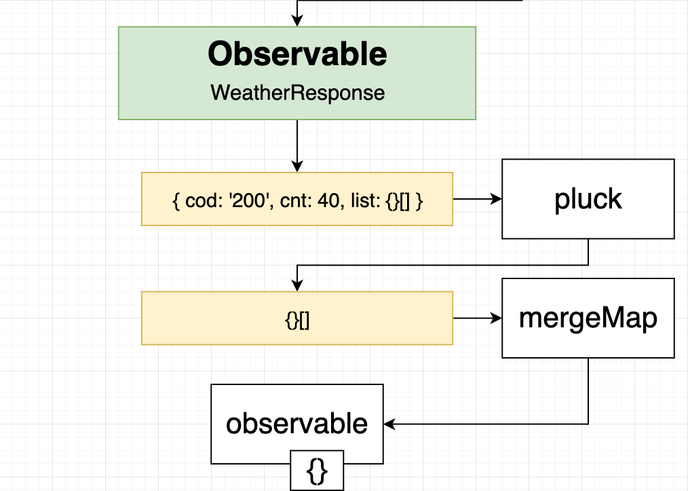
    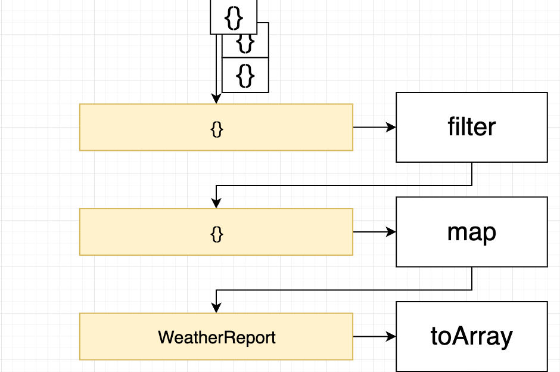
    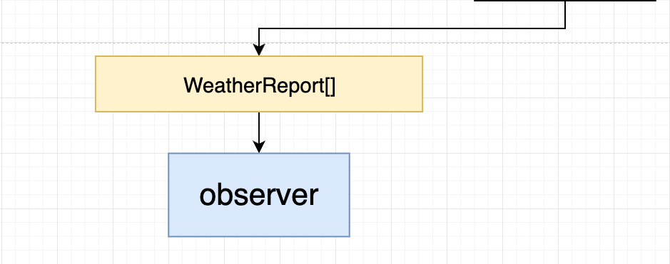

- component for subscribing to the forecast service

  ```ts
  export class AppComponent implements OnInit {
    forecast = [];

    constructor(private forecastService: ForecastService) {}

    ngOnInit() {
      this.forecastService.getForecast().subscribe(forecastData => {
        this.forecast = forecastData;
      });
    }
  }
  ```

---

[Back to top](#index)
