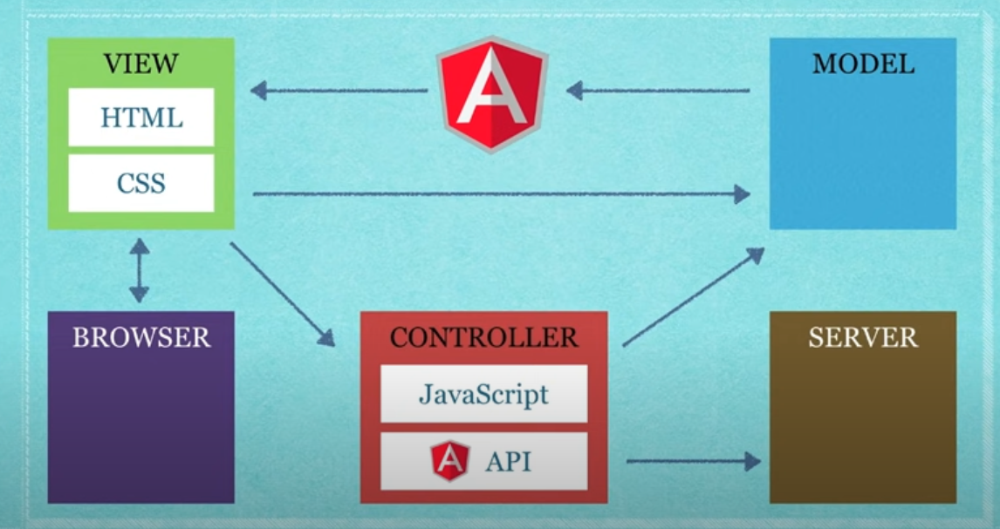

# INDEX

- [INDEX](#index)
  - [AngularJS](#angularjs)
    - [AngularJS vs Angular2+](#angularjs-vs-angular2)
  - [Using AngularJS](#using-angularjs)
    - [Example](#example)
  - [Services](#services)

---

## AngularJS

It's an old version of Angular. It is different from Angular 2+ in many ways. 's not used anymore.

It's built on the MVC (Model-View-Controller) design pattern which makes code easily maintainable and testable.


- AngularJS Jargon:

  - **Module**: Where our application components live.
  - **Controller**: Where we define our app's behavior by defining functions and values -> (components)
  - **Directive**: A marker on a DOM element that tells AngularJS's HTML compiler to attach a specified behavior to that DOM element or even transform the DOM element and its children -> (extends HTML with new attributes allowing us to bind data to the DOM)
  - **Scope**: The context where the model `data` is stored so that controllers, directives, and expressions can access it.
  - **Expression**: How values get displayed within the page. It's linked to the scope (like string interpolation) -> Ex: `{{fullName}}`
  - **Filter**: Formats the value of an expression for display to the user.
  - **Service**: Reusable business logic independent of views.
  - **Factory**: A way to create services.
  - **Provider**: A configurable service.
  - **Dependency Injection**: A way to access services.

- AngularJS Features:
  - **Two-way data binding**: Changes in the model are immediately reflected in the view and vice versa.
  - **Templates**: HTML with additional markups.
  - **Dependency Injection**: AngularJS has a built-in dependency injection subsystem that helps the developer by making the application easier to develop, understand, and test.
  - **Directives**: Extends HTML with new attributes allowing us to bind data to the DOM.
  - **Routing**: AngularJS provides routing which is switching views.
  - **Deep Linking**: Allows the encoding of the application state in the URL so that it can be bookmarked.
  - **Controllers**: The controller is a JavaScript function that augments the AngularJS scope.

---

### AngularJS vs Angular2+

create a table with the differences between AngularJS and Angular2+.

| Comparison           | AngularJS (1.x) | Angular (2+)                                                     |
| -------------------- | --------------- | ---------------------------------------------------------------- |
| Language             | JavaScript      | TypeScript                                                       |
| Architecture         | MVC             | Components                                                       |
| Data Binding         | Two-way         | One-way (with RxJS)                                              |
| Expression Syntax    | ng-Directives   | focuses on `()` for event binding and `[]` for property binding. |
| Dependency Injection | Yes ✅          | Yes ✅                                                           |
| Routing              | Yes ✅          | Yes ✅                                                           |
| Mobile               | No ❌           | Yes ✅                                                           |
| Performance          | Slower          | Faster                                                           |

---

## Using AngularJS

- **Installation**:
  - **CDN**: Add the AngularJS script to your HTML file.
  - **npm**: Install AngularJS using npm.
  - **Bower**: Install AngularJS using Bower.

### Example

```js
// AngularJS Module
var app = angular.module('myApp', []); // []: dependencies

// AngularJS Controller
app.controller('myCtrl', function ($scope) {
  $scope.firstName = 'John';
  $scope.lastName = 'Doe';
  $scope.getFullName = function () {
    $scope.fullName = $scope.firstName + ' ' + $scope.lastName;
  };
  $scope.grades = [90, 80, 70, 60];
});
// function($scope){} is called a constructor/factory function
```

```html
<!-- HTML -->
<!DOCTYPE html>
<html>
  <script src="https://ajax.googleapis.com/ajax/libs/angularjs/1.6.9/angular.min.js"></script>
  <body>
    <div
      ng-app="myApp"
      ng-controller="myCtrl"
      ng-init="firstName='John';lastName='Doe';title='AngularJS'"
    >
      <!------------------- Expression ------------------->
      <h1>Dynamic title: {{title}}</h1>

      <!------------------- Two-way data binding ------------------->
      <p>
        First Name:
        <input type="text" ng-model="firstName" />
      </p>
      <p>
        First Name:
        <input type="text" ng-model="lastName" />
      </p>

      <!------------------- Event ------------------->
      <h1>Hello {{firstName + ' ' + lastName}}</h1>
      <!-- OR -->
      <button ng-click="getFullName()">Show Full Name</button>
      <h1>Hello {{fullName}}</h1>
      <!-- OR -->
      <h1 data-ng-bind="fullName"></h1>

      <!------------------- Loop ------------------->
      <h2>Grades</h2>
      <ul>
        <li ng-repeat="grade in grades">{{grade}}</li>
      </ul>

      <!------------------- Include ------------------->
      <ng-include src="'myTable.html'"></ng-include>

      <!------------------- Switch ------------------->
      <div ng-switch="color">
        <p ng-switch-when="red">Red</p>
        <p ng-switch-when="blue">Blue</p>
        <p ng-switch-default>Invalid color</p>

        <button ng-click="color='red'">Set Red</button>
        <button ng-click="color='blue'">Set Blue</button>
      </div>

      <!------------------- Conditional rendering ------------------->
      <div ng-if="show"> <!-- OR ng-show="show" -->
      <div ng-show="show">
        <h1>Rendered if show is true</h1>
      </div>
      <button ng-click="show = !show">Toggle</button>
    </div>
  </body>
</html>
```

- The `ng-app` directive tells AngularJS that the `<div>` element is the "owner" of an AngularJS application.
- The `ng-controller` directive defines the controller.
  - The controller is a JavaScript function that augments the AngularJS scope.
- The `ng-init` directive initializes application data.
- The `ng-model` directive binds the value of the input field to the application variable `name`.
- The `{{name}}` expression will be replaced with the value of the `name` variable.
- The `ng-click` directive tells AngularJS what to do when an HTML element is clicked.
- The `ng-bind` directive binds the content of an HTML element to application data.
  - It's similar to expressions, but it doesn't show the curly braces while the page is loading.
- The `ng-repeat` directive repeats an HTML element.
  - We can use `limitTo` to limit the number of items to display -> `ng-repeat="x in grades | limitTo:3"`
- The `ng-include` directive includes an HTML file to the main HTML file.

---

## Services

**Services** are reusable business logic independent of views. They are used to organize and share code across the application.

- They're objects that bundle together methods that are common to a particular type of application.
- Services unlike factories don't return a new instance of the service, they return the service itself. so that we can have access to the methods and properties of the service.
- AngularJS has several built-in services such as `$http`, `$location`, `$timeout`, `$interval`, etc.

  ```js
  app.controller('myCtrl', function ($scope, $http, $location) {
    // $http is a service that allows us to make AJAX requests
    $http.get('server/list').then(function (response) {
      $scope.data = response.data;
    });

    // $location is a service that allows us to interact with the browser's URL
    $scope.currURL = $location.absUrl();
    $scope.currPath = $location.path();
  });
  ```

- We can create custom services using the `service`, `factory`, and `provider` methods.

  ```js
  // AngularJS Service
  app.service('myService', function () {
    this.myFunc = function () {
      return 'Hello World from Service!';
    };
  });

  // AngularJS Factory
  app.factory('myFactory', function () {
    return {
      myFunc: function () {
        return 'Hello World from Factory!';
      }
    };
  });

  // Difference here is that we return an object with the methods we want to expose
  ```

  ```html
  <!-- HTML -->
  <div ng-app="myApp" ng-controller="myCtrl">
    <h1>{{myService.myFunc()}}</h1>
    <h1>{{myFactory.myFunc()}}</h1>
  </div>
  ```
