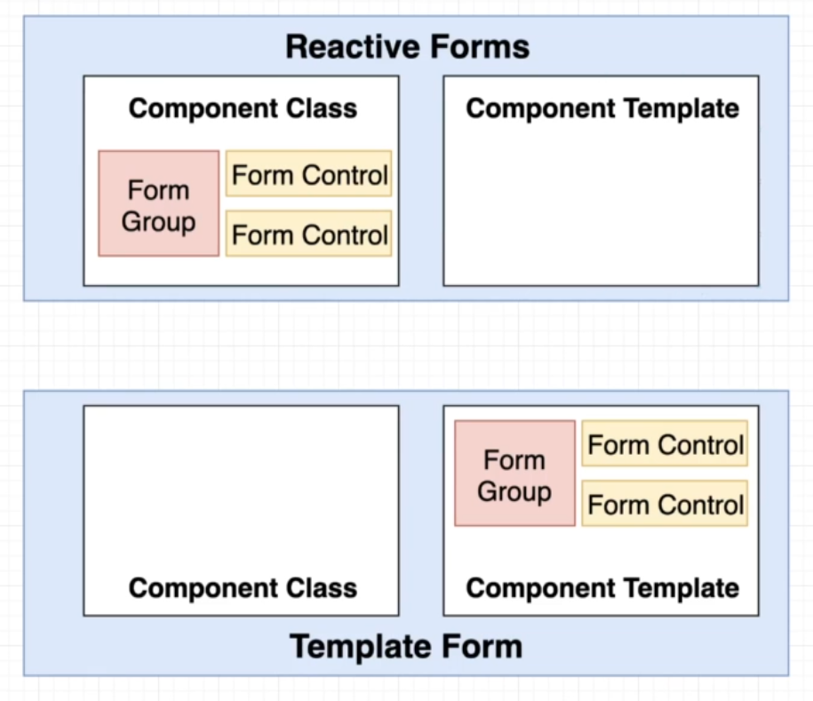
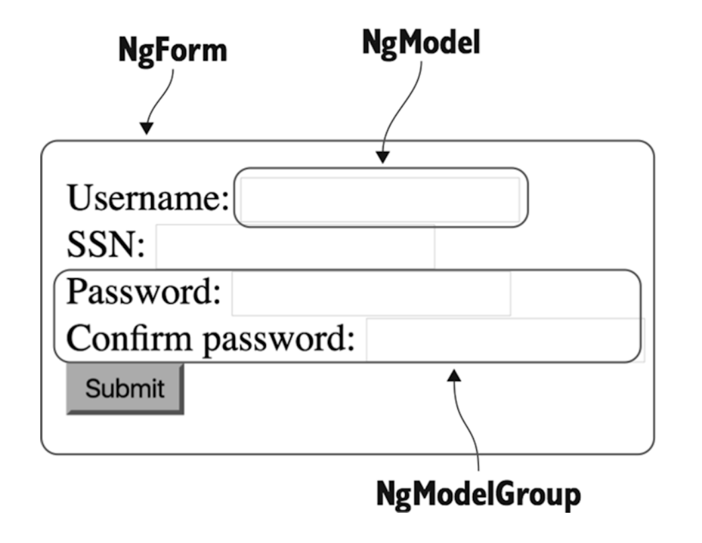
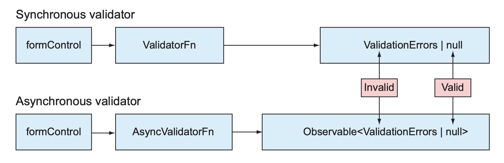

# INDEX

- [INDEX](#index)
  - [Input Handling (Two-way data binding)](#input-handling-two-way-data-binding)
    - [Input masking in Angular](#input-masking-in-angular)
  - [Forms in Angular](#forms-in-angular)
    - [Two Approaches to Forms in Angular](#two-approaches-to-forms-in-angular)
    - [Submitting Forms](#submitting-forms)
  - [Template Forms (`ngModel` \& `ngForm`)](#template-forms-ngmodel--ngform)
    - [Template forms directives](#template-forms-directives)
    - [How to create a template form (steps)](#how-to-create-a-template-form-steps)
    - [Validation in template-driven forms](#validation-in-template-driven-forms)
      - [Normal (Built-in) validation in template-driven forms](#normal-built-in-validation-in-template-driven-forms)
      - [Custom validation in template-driven forms](#custom-validation-in-template-driven-forms)
    - [Watching Changes in the Form](#watching-changes-in-the-form)
    - [Updating Templates-Form Values Programmatically](#updating-templates-form-values-programmatically)
  - [Reactive Forms](#reactive-forms)
    - [Building blocks of reactive forms (`FormControl`, `FormGroup` \& `FormArray`)](#building-blocks-of-reactive-forms-formcontrol-formgroup--formarray)
    - [Reactive forms directives](#reactive-forms-directives)
    - [How to create a reactive form](#how-to-create-a-reactive-form)
    - [Dynamically adding form controls to a reactive form](#dynamically-adding-form-controls-to-a-reactive-form)
    - [Validation in reactive forms](#validation-in-reactive-forms)
      - [Normal validation in reactive forms](#normal-validation-in-reactive-forms)
      - [Custom validation in reactive forms](#custom-validation-in-reactive-forms)
      - [Controlling when validation starts](#controlling-when-validation-starts)
      - [Changing validators dynamically in reactive forms](#changing-validators-dynamically-in-reactive-forms)
      - [Synchronous vs Asynchronous validation](#synchronous-vs-asynchronous-validation)
        - [Synchronous validation](#synchronous-validation)
        - [Asynchronous validation](#asynchronous-validation)
    - [Watching/Reacting to form changes (RxJS in Reactive Forms)](#watchingreacting-to-form-changes-rxjs-in-reactive-forms)
    - [Error handling in Reactive Forms](#error-handling-in-reactive-forms)
    - [Updating Reactive Form Values Programmatically](#updating-reactive-form-values-programmatically)
    - [FormBuilder](#formbuilder)
  - [Checking (form and form-control) status and validity](#checking-form-and-form-control-status-and-validity)
    - [Checking in the template](#checking-in-the-template)
    - [Checking in the component class](#checking-in-the-component-class)
  - [Adding styles to input fields based on validation status](#adding-styles-to-input-fields-based-on-validation-status)

---

## Input Handling (Two-way data binding)

- To handle user input in Angular, you can use `two-way data binding` with the `ngModel` directive

  ```html
  <input [(ngModel)]="name" />
  ```

  - Here, we are creating a **two-way data binding** on the `input` element, so that the `name` property in the component class is updated when the input value changes, and the input value is updated when the `name` property changes

- It's a **replacement** for `event binding` and `property binding` to handle user input

  ```html
  <input [value]="name" (input)="name = $event.target.value" />
  ```

### Input masking in Angular

> **Input masking** is a way to format user input as they type, to ensure that the input is in a specific format (e.g., phone number, date, credit card number, etc.)

- To create an input mask in Angular, you can use the [ngx-mask library](https://www.npmjs.com/package/ngx-mask)

  ```bash
  npm install ngx-mask --save
  ```

  - This library provides a directive that can be used to create an input mask

  ```html
  <!-- Create an input mask for a date field -->
  <input type="text" mask="00/00/0000" />
  ```

  - We can also use `pipe` to for masking text

    ```html
    <p>{{ '1234567890' | mask: '(000) 000-0000' }}</p>
    ```

- You can also create a custom input mask using the `input` event and the `value` property of the input element

  ```html
  <input (input)="onInput($event)" />
  ```

  ```ts
  onInput(event: Event) {
    const input = event.target as HTMLInputElement;
    // or const input = <HTMLInputElement>event.target;
    let value = input.value.replace(/\D/g, '');
    if (value.length > 8) {
      value = value.substr(0, 8);
    }
    input.value = value;
  }
  ```

  - Here, we are creating a custom input mask for a date field

- Also, we can do masking by creating custom `FormControl` class (explained in the [Reactive Forms section](#form-controls--groups))

---

## Forms in Angular

> HTML provides basic features for displaying forms, validating entered values, and submitting data to the server. But HTML forms may not be good enough for real-world applications, which need a way to programmatically process the entered data, apply custom validation rules, display user-friendly error messages, transform the format of the entered data, and choose the way data is submitted to the server. For business applications, one of the most important considerations when choosing a web framework is how well it handles forms.
>
> Angular offers rich support for handling forms. It goes beyond regular data binding by treating form fields as first-class citizens and providing fine-grained control over form data.

### Two Approaches to Forms in Angular

Angular has **two different approaches** to handling user input through forms: (**Reactive Forms** and **Template Forms**). Both capture user input events from the view, validate the user input, create a form model and data model to update, and provide a way to track changes.


> With the **template-driven API**, forms are fully programmed in the component’s template using **directives**, and the model object is created implicitly by Angular. The template defines the structure of the form, the format of its fields, and the validation rules. Because you’re limited to HTML syntax while defining the form, the template-driven approach suits only simple forms.
>
> With the **reactive API**, you explicitly create the model object in TypeScript code and then link the HTML template elements to that model’s properties using special directives. You construct the form model object explicitly using the FormControl, `FormGroup`, and `FormArray` classes. In the template-driven approach, you don’t access these classes directly, whereas in the reactive approach, you explicitly create instances of these classes. For non-trivial forms, the reactive approach is a better option.

- The 2 forms is similar from Angular's perspective, but they differ in how they are created and managed
  

- Both template-driven and reactive APIs need to be explicitly enabled before you start using them.

  - To enable reactive forms, add `ReactiveFormsModule` from `@angular/forms` to the `imports` list of `NgModule`.
  - For template-driven forms, import `FormsModule` from `@angular/forms` to the `imports` list of `NgModule`.

- Here's a comparison between the two approaches:

  |                     | REACTIVE                                      | TEMPLATE-DRIVEN                                                   |
  | ------------------- | --------------------------------------------- | ----------------------------------------------------------------- |
  | Setup of form model | Explicit, created in component class manually | Implicit, created by directives (the class is created by Angular) |
  | Data model          | Structured and immutable                      | Unstructured and mutable                                          |
  | Data flow           | Synchronous                                   | Asynchronous                                                      |
  | Form validation     | Functions                                     | Directives                                                        |
  | Scalability         | Scalable                                      | better for small forms                                            |
  | Selector            | `[FormGroup]` directive                       | `[ngForm]` directive                                              |

---

### Submitting Forms

- Angular provides `ngSubmit` directive to handle form submission, which is used in both approaches

  ```html
  <form (ngSubmit)="onSubmit()">
    <input type="text" name="name" [(ngModel)]="name" />
    <button type="submit">Submit</button>
  </form>
  ```

  - **⚠️ Note:** In order to use `ngSubmit`, you need to import the `FormsModule` in the `app.module.ts` file or the standalone-component that uses it

    ```ts
    import { FormsModule } from '@angular/forms';

    @NgModule({
      imports: [FormsModule]
    })
    export class AppModule {}
    ```

  - or we can use the `submit` event, but the difference is that `ngSubmit` will not reload the page, while the `submit` event will reload the page

    ```html
    <form (submit)="onSubmit()">
      <input type="text" name="name" [(ngModel)]="name" />
      <button type="submit">Submit</button>
    </form>
    ```

---

## Template Forms (`ngModel` & `ngForm`)

Template-driven forms are more **declarative** and **asynchronous** than reactive forms. They are created in the template using the `ngModel` directive and the `ngForm` directive.

- Most of the setup is done in the template, and the form model is created implicitly by Angular, that's why it's called **template-driven forms**.
- Template-driven forms are **suitable for simple forms** and **small applications**.

- Here, we use `ngModel` directive **with 2-way-binding** added to the `input element`

  - a local-reference equal to `ngModel` is added to the `input element`

- We have common **directives** to work with template-driven forms:

  | Directive      | Description                                               |
  | -------------- | --------------------------------------------------------- |
  | `ngForm`       | Directive to create a form model in the template          |
  | `ngModel`      | Directive to bind the form fields to the form model       |
  | `ngModelGroup` | Directive to group form fields together in the form model |

---

### Template forms directives



- `ngForm`

  - creates a form model in the template **(implicitly create an instance of `FormGroup` class to represent the form)**
  - It represents the entire form, and it contains all the form fields and their values
  - It's automatically attached to every `<form>` element.
  - It implicitly creates an instance of the `FormGroup` class to represent the form
  - It automatically discovers all the form fields that are bound to the form using the `ngModel` directive, which adds the form fields to the form model
  - You can access the form model using a local reference like `#<form-name>="ngForm"`
  - It intercepts the standard HTML form submission event and replaces it with Angular's own `ngSubmit` event, which allows you to handle form submission in the component class without reloading the page (automatically prevents the default form submission behavior)

  ```html
  <form #customForm="ngForm" (ngSubmit)="onSubmit(customForm)">...</form>

  <pre></pre>{{ customForm.value | json }}</pre>
  ```

- `ngModel`

  - It binds the form fields to the form model
  - It **(implicitly creates an instance of the `FormControl` class to represent the form field)**
  - It automatically adds the form field to the form model created by the `ngForm` directive
  - It provides two-way data binding between the form field and the form model
  - It doesn't require any additional setup in the component class, as the form model is created implicitly by Angular -> just add the `ngModel` directive to the input element
  - If you want to have different names for the form fields in the form model, you can use the `name` attribute on the input element to specify the name of the form field in the form model

  ```html
  <form #form="ngForm" (ngSubmit)="onSubmit(form)">
    <input type="text" name="firstName" ngModel />
    <input type="text" name="lastName" ngModel />
    <button type="submit">Submit</button>
  </form>
  ```

- `ngModelGroup`

  - It **represents a part of the form**, and it groups form fields together in the form model
  - It creates an instance of the `FormGroup` class to represent the group of form fields, **like a nested form**
  - It automatically adds the group of form fields to the form model created by the `ngForm` directive
  - It allows you to create nested groups of form fields in the form model
  - You can access the group of form fields in the component class using the `form.controls` object

  ```html
  <form #form="ngForm" (ngSubmit)="onSubmit(form)">
    <div ngModelGroup="names">
      <input type="text" name="firstName" ngModel />
      <input type="text" name="lastName" ngModel />
    </div>

    <div ngModelGroup="passwords">
      <input type="password" name="password" ngModel />
      <input type="password" name="confirmPassword" ngModel />
    </div>

    <button type="submit">Submit</button>
  </form>
  ```

- `ngSubmit`

  - It is an event directive that is used to handle form submission
  - It is attached to the `<form>` element, and it intercepts the standard HTML form submission event
  - It replaces the standard HTML form submission event with Angular's own `ngSubmit` event, which allows you to handle form submission in the component class without reloading the page
  - You can pass the form value to the `ngSubmit` event handler as an argument

  ```html
  <form #form="ngForm" (ngSubmit)="onSubmit(form)">...</form>
  ```

---

### How to create a template form (steps)

- **To create a template form:**

  - First, You need to import the `FormsModule` in the `app.module.ts` file (or the standalone component that uses it)

    ```ts
    // in app.module.ts
    import { FormsModule } from '@angular/forms';

    @NgModule({
      imports: [FormsModule]
    })
    export class AppModule {}
    ```

    - The `FormsModule` module provides the `ngModel` directive to create template forms

      > **Note**: without importing the `FormsModule` module, you will get an error like `Can't bind to 'ngModel' since it isn't a known property of 'input'`

  - Then, you can create a template form in the component template using the `ngForm` directive, and the `ngModel` directive, and using the `ngSubmit` event to handle form submission and access the form values

    - 1️⃣ Pass the `form` object to the `ngSubmit` event handler
    - 2️⃣ Use the `ngModel` directive to bind the form fields to the `form` object
    - 3️⃣ Access the form values using the `form.value` property on the handler

      ```html
      <!-- in app.component.html -->
      <form #form="ngForm" (ngSubmit)="onSubmit(form)">
        <input type="text" name="name" ngModel />
        <!-- or -->
        <input type="text" name="name" [(ngModel)]="name" />

        <input type="email" name="email" ngModel />

        <input type="password" name="password" ngModel minlength="6" />

        <button type="submit">Submit</button>
      </form>
      ```

      ```ts
      // in app.component.ts
      import { Component } from '@angular/core';
      import { NgForm } from '@angular/forms';
      @Component({
        selector: 'app-root',
        template: 'app.component.html'
      })
      export class AppComponent {
        onSubmit(form: NgForm) {
          console.log(form.value); // { name: 'John', ... }
          console.log(form.status); // 'VALID' or 'INVALID'
        }
      }
      ```

      - ⚠️ Here, even if some input fields are not filled, the form will still be submitted, and you can handle the validation in the `onSubmit` method, so it's important to check the form validity before processing the form data

- **Validation** is done using the `Validators` class and the `errors` property of the `FormControl` object

  ```html
  <input [(ngModel)]="credentials.email" name="email" required email />
  ```

  - You can find more [Constraint validation attributes](https://developer.mozilla.org/en-US/docs/Web/HTML/Constraint_validation) here

---

### Validation in template-driven forms

In template-driven forms, validation is done using **built-in validation attributes** and **custom validation directives**.

#### Normal (Built-in) validation in template-driven forms

Here, we can use the `required`, `minlength`, `maxlength`, and `pattern` **built-in validation attributes** to validate the form fields, and we can use the `ngModel` directive to bind the form fields to the component class and handle the validation in the component class.

- To validate the form fields, you can use the `required`, `minlength`, `maxlength`, and `pattern` attributes in the template

  ```html
  <form #form="ngForm" (ngSubmit)="onSubmit(form)">
    <input type="text" name="name" ngModel required />
    <input type="email" name="email" ngModel required email />
    <input type="password" name="password" ngModel required minlength="6" />
    <button type="submit" [disabled]="form.invalid">Submit</button>
  </form>
  ```

- To show the validation-error messages, you can use multiple properties of the `NgModel` object, like `errors`, `touched`, `dirty`, and `valid` to check the validation status of the form fields

  ```html
  <input type="text" name="name" ngModel #nameField="ngModel" required />
  <p *ngIf="nameField.errors?.required && nameField.touched">Name is required</p>

  <input type="email" name="email" ngModel #emailField="ngModel" required email />
  <div [hidden]="emailField.valid || !emailField.touched">
    <p *ngIf="emailField.errors?.required && emailField.touched">Email is required</p>
    <p *ngIf="emailField.errors?.email && emailField.touched">Email is invalid</p>
    <!-- or using .hasError() -->
    ️
    <p *ngIf="emailField.hasError('email') && emailField.touched">Email is invalid</p>
  </div>

  <input type="password" name="password" ngModel #passwordField="ngModel" required minlength="6" />
  <p *ngIf="passwordField.errors?.required && passwordField.touched">Password is required</p>
  <p *ngIf="passwordField.errors?.minlength && passwordField.touched">
    Password must be at least 6 characters long
  </p>
  ```

- Usually, it's also recommended to disable the submit button if the form is invalid, to prevent the user from submitting the form with invalid data

  ```html
  <button type="submit" [disabled]="form.invalid">Submit</button>
  ```

- You can also use the `ngModel` directive to bind the form fields to the component class and handle the validation in the component class, by accessing the `form.controls` object that contains the form fields and their validation status

  ```ts
  // in app.component.ts
  import { Component } from '@angular/core';
  import { NgForm } from '@angular/forms';
  @Component({
    selector: 'app-root',
    template: 'app.component.html'
  })
  export class AppComponent {
    name = '';
    email = '';
    password = '';

    onSubmit(form: NgForm) {
      if (form.valid) {
        console.log(form.value);
      } else {
        if (form.controls.name.errors?.required) {
          console.log('Name is required');
        }
        if (form.controls.email.errors?.required) {
          console.log('Email is required');
        }
        if (form.controls.email.errors?.email) {
          console.log('Email is invalid');
        }
        if (form.controls.password.errors?.required) {
          console.log('Password is required');
        }
        if (form.controls.password.errors?.minlength) {
          console.log('Password must be at least 6 characters long');
        }
      }
  ```

- Here're some of the values of the controls object that you can use to check the validation status of the form fields:
  
- Angular by default adds some hidden classes to the form fields to indicate their validation status, you can use these classes to style the form fields based on their validation status

  - Angular’s Forms API offers a number of CSS classes that work hand in hand with their respective flags on the form: `.ng-valid`, `.ng-invalid`, `.ng-pending`, `.ng-pristine`, `.ng-dirty`, `.ng-untouched`, and `.ngtouched`.
    

    ```html
    <input
      type="text"
      name="name"
      ngModel
      required
      class="form-control"
      [ngClass]="{ 'is-invalid': form.controls.name.invalid && form.controls.name.touched }" />
    ```

---

#### Custom validation in template-driven forms

To create a custom validator in template-driven forms, you can create a directive that implements the `Validator` interface from `@angular/forms`

- Example of a custom validator that checks if the input value is at least 5 characters long:

  ```ts
  // in custom-validator.directive.ts
  import { Directive } from '@angular/core';
  import { NG_VALIDATORS, Validator, AbstractControl, ValidationErrors } from '@angular/forms';

  @Directive({
    selector: '[appCustomValidator]',
    providers: [
      {
        provide: NG_VALIDATORS, // Register the validator
        useExisting: CustomValidatorDirective, // Use the current directive as the validator
        multi: true // Allow multiple validators
      }
    ]
  })
  export class CustomValidatorDirective implements Validator {
    validate(control: AbstractControl): ValidationErrors | null {
      const value = control.value;
      // Custom validation logic here
      if (value && value.length < 5) {
        return { customError: 'Value must be at least 5 characters long' };
      }
      return null; // Return null if the validation is successful
    }
  }
  ```

  ```html
  <!-- in app.component.html -->
  <form #form="ngForm" (ngSubmit)="onSubmit(form)">
    <input type="text" name="customField" ngModel appCustomValidator #customField="ngModel" />
    <p *ngIf="customField.errors?.customError && customField.touched">
      {{ customField.errors.customError }}
    </p>
    <button type="submit">Submit</button>
  </form>
  ```

  - Here, we created a custom validator directive called `CustomValidatorDirective` that checks if the input value is at least 5 characters long. We then applied this directive to an input field in the template using the `appCustomValidator` selector. We also displayed the custom error message if the validation fails.
    - we registered the custom validator directive using the `NG_VALIDATORS` token in the `providers` array of the directive metadata
    - The `multi: true` option allows multiple validators to be applied to the same form control
    - we implemented the `validate` method of the `Validator` interface to define the custom validation logic
    - we returned a `ValidationErrors` object if the validation fails, or `null` if the validation is successful
    - we used the custom validator directive in the template by adding the `appCustomValidator` attribute to the input field

---

### Watching Changes in the Form

- You can watch for changes in the form using the `ngAfterViewInit` lifecycle hook, which is called after the form is rendered, and you can access the form values and validity in the component class using the `viewChild` decorator to get a reference to the form
- To watch for changes in the form, you can use the **`valueChanges` observable** of the `NgForm` object, **which emits the form value whenever it changes**

  ```ts
  // in app.component.ts
  import { Component, ViewChild } from '@angular/core';
  import { NgForm } from '@angular/forms';

  @Component({
    selector: 'app-root',
    template: 'app.component.html'
  })
  export class AppComponent {
    @ViewChild('form') form: NgForm;
    // or as a signal:
    // private form = viewChild<NgForm>('form');

    ngAfterViewInit() {
      this.form.valueChanges.subscribe({
        next: value => {
          // Whenever the form value changes, this will log the form value
          console.log('Form value changed:', value);
        }
      });
    }
  }
  ```

- Following best practices for performance, we should do the following:

  - Unsubscribe from the `valueChanges` observable when the component is destroyed to avoid memory leaks, using the `ngOnDestroy` lifecycle hook to unsubscribe from the observable

    ```ts
    // in app.component.ts
    import { Component, ViewChild, OnDestroy } from '@angular/core';
    import { NgForm } from '@angular/forms';
    import { Subscription } from 'rxjs';

    @Component({
      selector: 'app-root',
      template: 'app.component.html'
    })
    export class AppComponent implements OnDestroy {
      @ViewChild('form') form: NgForm;
      private formSubscription: Subscription;

      ngAfterViewInit() {
        this.formSubscription = this.form.valueChanges.subscribe(value => {
          console.log('Form value changed:', value);
        });
      }

      ngOnDestroy() {
        this.formSubscription.unsubscribe(); // Unsubscribe to avoid memory leaks
      }
    }
    ```

  - Use **Debouncing** to limit the number of times the `valueChanges` observable emits values, especially for large forms or complex forms, to avoid performance issues, using the `debounceTime` operator from `rxjs/operators`

    ```ts
    // in app.component.ts
    import { debounceTime } from 'rxjs/operators';

    ngAfterViewInit() {
      this.formSubscription = this.form.valueChanges
        .pipe(debounceTime(300)) // Wait for 300ms before emitting the value
        .subscribe(value => {
          console.log('Form value changed:', value);
        });
    }
    ```

---

### Updating Templates-Form Values Programmatically

> In some scenarios, a form needs to be populated without the user’s interaction. For example, you may need to create a form for editing product data retrieved from the server or another source. Another example is implementing a master-detail relationship—for example, selecting a product in a list should show its details in a form
>
> The Angular Forms API offers several functions for updating a form model including `reset()`, `setValue()`, and `patchValue()`. The `reset()` function reinitializes the form model and resets the flags on the model, like `touched`, `dirty`, and others. The `setValue()` function is used for updating all values in a form model. The `patchValue()` function is used when you need to update the selected properties of a form model.

- To update the form values programmatically, you can use the `setValue` or `patchValue` methods of the `NgForm` object

  ```ts
  // in app.component.ts
  import { Component, ViewChild } from '@angular/core';
  import { NgForm } from '@angular/forms';

  @Component({
    selector: 'app-root',
    template: 'app.component.html'
  })
  export class AppComponent {
    @ViewChild('form') form: NgForm;

    updateForm() {
      this.form.setValue({
        name: 'John Doe',
        email: 'john@test.com'
      });
      // or you can use patchValue to update only some fields
      this.form.patchValue({
        name: 'John Doe'
      });
    }
  }
  ```

- **Common use cases**

  - Reset the form values to their initial state, you can use the `resetForm` method of the `NgForm` object

    ```ts
    // in app.component.ts
    resetForm() {
      this.form.resetForm(); // Reset the form values to their initial state
    }
    ```

  - Persist the form values on localStorage on render and on form submission, you can use the `localStorage` API to store the form values

    ```ts
    // in app.component.ts
    ngAfterViewInit() {
      const savedForm = localStorage.getItem('form');
      if (savedForm) {
        // in a conditional to check if the savedForm is not null (Typescript)
        this.form.setValue(JSON.parse(savedForm));
      }
    }
    ```

    - You might face errors that the form is not yet defined, so you can use a `setTimeout` to wait for the form to be rendered before accessing it

    ```ts
    // in app.component.ts
    ngAfterViewInit() {
      const savedForm = localStorage.getItem('form');

      setTimeout(() => {
        if (savedForm) {
          this.form.setValue(JSON.parse(savedForm));
        }
      });
    }
    ```

---

## Reactive Forms

Reactive forms are a more **structured** and **scalable** way to handle forms in Angular. They are based on the `ReactiveFormsModule` and provide a more programmatic approach to form handling.

- Benefits of using reactive forms:

  - Better typescript support, as reactive forms are based on creating a form model in the component class.
  - Reactive forms are **more explicit** and **synchronous** than template-driven forms.
  - Reactive forms has **better validation** and **error handling** capabilities.
  - Reactive forms are **more testable** than template-driven forms, as they provide a more structured way to handle forms and validation.
  - Reactive forms are **more suitable for complex forms** and **large applications**.

- Here, we don't do much in the template (we just connect the form to the template), and we do most of the setup in the component class, that's why it's called **reactive forms**.

### Building blocks of reactive forms (`FormControl`, `FormGroup` & `FormArray`)

- `FormControl`

  - is used to create a single form field, it's an atomic form-unit that represents a single `<input>` field, but it can also represent other form elements like `<select>`, `<textarea>`, `calendar pickers`, etc.
  - You can use it in the template by binding it to the form field using the `formControl` directive, and without using the `formGroup` directive

    ```html
    <input type="text" [formControl]="nameControl" />
    ```

  - it takes the initial value of the form field as an argument, and **can also take an array of validators** as the second argument

    ```ts
    const nameControl = new FormControl(''); // A form control with an initial value of ""

    const emailControl = new FormControl('', [Validators.required, Validators.email]); // A form control with an initial value of "" and validators
    ```

  - To provide the **type** of the form control, you can use the `FormControl` generic type (useful for dropDowns, selectors inputs)

    ```ts
    const roleControl = new FormControl<string>(''); // A form control with an initial value of "" and type string
    // or
    const roleControl = new FormControl<'admin' | 'user' | 'guest'>('user'); // A form control with an initial value of "user" and type 'admin' | 'user' | 'guest'
    ```

  - We can create **custom form-controls** by extending the `FormControl` class

    ```ts
    import { FormControl } from '@angular/forms';

    export class MyCustomFormControl extends FormControl {
      // example of hijacking the setValue method to add custom behavior
      setValue(value: any, options?: any): void {
        // Custom behavior here to add 'USD' suffix to the value
        super.setValue(value + ' USD', { ...options, emitModelToViewChange: true });
      }
    }
    ```

    - `emitModelToViewChange: true` is used to update the view when the model changes, so that the input value is updated when we call the `setValue` method

- `FormArray`

  - is used to create a dynamic list of form fields, It's commonly used for forms that require a list of items, like a list of emails or a list of phone numbers
  - It usually represents a collection of form-controls that **can grow and shrink dynamically**
  - it takes an array of `FormControl` or `FormGroup` objects as an argument, and can also take an array of validators as the second argument

    ```ts
    const myArray = new FormArray([new FormControl(''), new FormControl(''), new FormControl('')]);
    ```

  - You can add or remove form controls from the array using the `push` and `removeAt` methods

    ```ts
    myArray.push(new FormControl('')); // Add a new form control to the array
    myArray.removeAt(0); // Remove the first form control from the array
    ```

- `FormGroup`

  - is used to create a group of form fields, it's a collection of `FormControl` and/or `FormGroup` objects that represent a form.
  - it takes an object with the form fields as keys and their initial values as values

    ```ts
    const myForm = new FormGroup({
      name: new FormControl(''),
      email: new FormControl(''),
      password: new FormControl('')
    });
    ```

  - You can have **Nested FormGroups** to create a more complex form structure (but it's not recommended to have more than 2 levels of nesting), and bind them to the template using the `formGroupName` directive

    ```ts
    const myForm = new FormGroup({
      user: new FormGroup({
        name: new FormControl(''),
        email: new FormControl('')
      }),
      password: new FormControl('')
    });
    ```

    ```html
    <form [formGroup]="myForm" (ngSubmit)="onSubmit()">
      <div formGroupName="user">
        <input formControlName="name" />
        <input formControlName="email" />
      </div>
      <input formControlName="password" />
      <button type="submit">Submit</button>
    </form>
    ```

  - If one of the form controls inside the form group is invalid, the whole form group will be invalid

---

### Reactive forms directives

The reactive approach also requires some directives to bind the form model to the template:

- `formGroup`

  - Binds an existing `FormGroup` instance to a DOM element.

  ```html
  <form [formGroup]="myForm" (ngSubmit)="onSubmit()">...</form>
  ```

  ```ts
  myForm = new FormGroup({
    name: new FormControl(''),
    email: new FormControl('')
  });
  ```

- `formControlName`

  - Binds an existing `FormControl` instance to a DOM element.
  - it must be used within a parent element that has a `formGroup` directive.

  ```html
  <input formControlName="name" />
  ```

  ```ts
  myForm = new FormGroup({
    name: new FormControl(''),
    email: new FormControl('')
  });
  ```

- `formControl`

  - Binds an existing `FormControl` instance directly to a DOM element without using a `FormGroup`.
  - It is useful for standalone form controls. where you want to take advantage of reactive forms and validation without creating a full form group.

  ```html
  <input [formControl]="nameControl" />
  ```

  ```ts
  nameControl = new FormControl('');
  ```

  - Note that you can instead use `ngModel` for standalone form controls in template-driven forms. but here we are using `formControl` to demonstrate reactive forms and it has more features than `ngModel`.

- `formGroupName`

  - Binds an existing nested `FormGroup` instance to a DOM element.

  ```html
  <div formGroupName="address">
    <input formControlName="street" />
    <input formControlName="city" />
  </div>
  ```

  ```ts
  myForm = new FormGroup({
    address: new FormGroup({
      street: new FormControl(''),
      city: new FormControl('')
    })
  });
  ```

- `formArray`

  - Allows you to create a group of form-controls dynamically and use the array indexes as control names. You create an instance of FormArray in TypeScript code.
  - See the [Dynamically adding form controls to a reactive form](#dynamically-adding-form-controls-to-a-reactive-form) section for more details.

- `formArrayName`

  - Binds an existing `FormArray` instance to a DOM element.

  ```html
  <div formArrayName="aliases">
    <div *ngFor="let alias of aliases.controls; let i = index">
      <input [formControlName]="i" />
    </div>
  </div>
  ```

  ```ts
  myForm = new FormGroup({
    aliases: new FormArray([new FormControl('')])
  });
  ```

- `ngSubmit`

  - It's the same as in template-driven forms, used to handle form submission, but here we don't have to pass the form object to the handler, as we can access the form model directly in the component class

> You don't need to create the form model in the template, as it's created in the component class **implicitly by Angular**. and you just need to bind the form model to the template using the above directives.

---

### How to create a reactive form

- **To create a reactive form:**

  - 1️⃣ You need to import the `ReactiveFormsModule` in the `app.module.ts` file

    ```ts
    // in app.module.ts
    import { ReactiveFormsModule } from '@angular/forms';

    @NgModule({
      imports: [ReactiveFormsModule]
    })
    export class AppModule {}
    ```

    - The `ReactiveFormsModule` module provides the `FormControl`, `FormGroup`, and `FormArray` classes to create reactive forms

  - 2️⃣ Then, you can create an instance of the reactive form in the component class

    ```ts
    // in app.component.ts
    import { Component } from '@angular/core';
    import { FormGroup, FormControl, Validators } from '@angular/forms';

    @Component({
      selector: 'app-root',
      template: 'app.component.html'
    })
    export class AppComponent {
      // Telling Angular that we have a form group with the name "form"
      myForm = new FormGroup({
        name: new FormControl(''), // Telling Angular that we have a form-field named "name" with an initial value of ""
        email: new FormControl('', [
          Validators.required, // Telling Angular that the email field is required
          Validators.email // Telling Angular that the email field should be a valid email
        ]),
        password: new FormControl('', [
          Validators.required,
          Validators.minLength(6),
          Validators.pattern('^(?=.*[0-9])(?=.*[a-zA-Z])([a-zA-Z0-9]+)$')
        ])
      });

      onSubmit() {
        console.log(this.myForm.value); // { name: 'John', email: 'test@test.com', password: '123456' }
        console.log(this.myForm.get('name').value); // John
        // or
        // console.log(this.myForm.value.name); // John
        console.log(this.myForm.valid); // true or false
      }
    }
    ```

  - 3️⃣ Then, you can bind the form to the template using the `formGroup` directive, and bind the form fields to the form using the `formControlName` directive

    ```html
    <!-- in app.component.html -->
    <form [formGroup]="myForm" (ngSubmit)="onSubmit()">
      <input formControlName="name" />

      <input formControlName="email" />
      <!-- or -->
      <input type="email" [formControl]="myForm.get('email')" />

      <input formControlName="password" />
      <button type="submit" [disabled]="myForm.invalid">Submit</button>
      <!-- or -->
      <button type="submit" [disabled]="!myForm.valid">Submit</button>
    </form>
    ```

    - The `formGroup` directive is used to bind the form to the template
    - The `formControlName` directive is used to bind the input element to a form field

  - 4️⃣ (OPTIONAL): You can handle form validation in the component class

    ```ts
    // in app.component.ts
    get email() {
      return this.myForm.get('email');
    }

    get password() {
      return this.myForm.get('password');
    }

    onSubmit() {
      if (this.myForm.valid) {
        console.log(this.myForm.value);
      } else {
        if (this.email.hasError('required')) {
          console.log('Email is required');
        }
        if (this.email.hasError('email')) {
          console.log('Email is invalid');
        }
        if (this.password.hasError('required')) {
          console.log('Password is required');
        }
      }
    }
    ```

    ```html
    <!-- in app.component.html -->
    <p *ngIf="email.hasError('required')">Email is required</p>
    <p *ngIf="email.hasError('email')">Email is invalid</p>
    <p *ngIf="password.hasError('required')">Password is required</p>
    ```

  - 5️⃣ (OPTIONAL): You can listen to form changes in the component class, by subscribing to the `valueChanges` or `statusChanges` observables from the form

    ```ts
    // in app.component.ts
    ngOnInit() {
      this.myForm.valueChanges.subscribe(value => {
        console.log(value); // Whenever the form value changes, this will log the form value
      });

      this.myForm.statusChanges.subscribe(status => {
        console.log(status); // Whenever the form status changes, this will log the form status
      });
    }
    ```

- Here, we are:
  - creating a reactive form with a single `FormControl` named `name` in the component class
  - We are binding the form to the `form` property in the component class using the `formGroup` directive
  - We are binding the input element to the `name` property in the form using the `formControlName` directive
  - We are handling the form submission using the `ngSubmit` event, and not using the `submit` event (because it will reload the page and we're using a reactive form)

---

### Dynamically adding form controls to a reactive form

- When you know in advance all the controls in your form, you can define them statically when creating the `FormGroup` instance. But sometimes, you may need to add or remove form controls dynamically based on user interactions or other conditions. That's where the dynamic nature of reactive forms comes in handy using `FormArray` or the `addControl` method of the `FormGroup` class.

- Using `FormArray`

  - `FormArray` is the preferred way to handle dynamic form controls as it provides better structure and built-in methods for managing collections of form controls.

  ```ts
  // in app.component.ts
  import { Component } from '@angular/core';
  import { FormGroup, FormArray, FormControl } from '@angular/forms';

  @Component({
    selector: 'app-root',
    template: 'app.component.html'
  })
  export class AppComponent {
    formModel: FormGroup = new FormGroup({
      emails: new FormArray([
        new FormControl() // Initially one form control for entering an email
      ])
    });

    // Getter for easy access to the emails FormArray
    get emails() {
      return this.formModel.get('emails') as FormArray;
    }

    // Method to add a new email control to the array
    addEmail() {
      this.emails.push(new FormControl());
    }

    // Method to remove an email control from the array
    removeEmail(index: number) {
      this.emails.removeAt(index);
    }

    onSubmit() {
      console.log(this.formModel.value);
    }
  }
  ```

  ```html
  <!-- in app.component.html -->
  <form [formGroup]="formModel" (ngSubmit)="onSubmit()">
    <ul formArrayName="emails">
      <li *ngFor="let e of formModel.get('emails').controls; let i = index">
        <input [formControlName]="i" />
        <button type="button" (click)="removeEmail(i)">Remove</button>
      </li>
    </ul>
    <button type="button" (click)="addEmail()">Add Email</button>
    <button type="submit">Submit</button>
  </form>
  ```

- Using `addControl` method (Alternative Approach)

  - You can dynamically add form controls to a reactive form using the `addControl` method of the `FormGroup` class

  ```ts
  // in app.component.ts
  addPhoneNumber() {
    this.myForm.addControl('phone' + this.phoneNumbers.length, new FormControl(''));
    this.phoneNumbers.push('phone' + (this.phoneNumbers.length - 1));
  }
  ```

  ```html
  <!-- in app.component.html -->
  <div *ngFor="let phone of phoneNumbers">
    <input [formControlName]="phone" />
  </div>
  <button type="button" (click)="addPhoneNumber()">Add Phone Number</button>
  ```

  > **Note:** While `addControl` works, using `FormArray` is generally preferred because it provides better structure, built-in array methods (`push`, `removeAt`, `at`, `length`), and cleaner iteration in templates.

---

### Validation in reactive forms

Here, we can use the `Validators` class to validate the form fields, and we can use the `errors` property of the `FormControl` object to check for validation errors.

> Validators are functions that conform to the interface in the following listing
>
> ```ts
> interface ValidatorFn {
>   (control: AbstractControl): ValidationErrors | null;
> }
> ```
>
> If a validator determines that a **control (`FormControl`)** is valid, it returns `null`. If the control is invalid, it returns an error object that contains information about the validation error. The error object contains key-value pairs, where the key is the name of the error and the value is any additional information about the error.
>
> `AbstractControl` is the base class (superclass) for `FormControl`, `FormGroup`, and `FormArray`, **so validators can be applied to any of these form elements and models.**

#### Normal validation in reactive forms

- **FormControl validation**

  - Here, we can use the `Validators` class to validate the form fields, and we can use the `errors` property of the `FormControl` object to check for validation errors.

  - `Validators` is a class that **provides built-in validators** like `required`, `email`, `min`, `minLength`, `maxLength`, etc.

    - To have multiple validators for a form field, you can pass an array of validators to the `FormControl` constructor

    > The difference between `min` and `minLength` is that `min` is used for numeric values, while `minLength` is used for string values

  - Example of creating a reactive form with validation:

    - 1️⃣ First, you need to import the `ReactiveFormsModule` in the `app.module.ts` file
    - 2️⃣ Then, you can create a reactive form in the component class using the `FormGroup` and `FormControl` classes, and use the `Validators` class to validate the form fields

      ```ts
      // in app.component.ts
      import { Component } from '@angular/core';
      import { FormGroup, FormControl, Validators } from '@angular/forms';
      @Component({
        selector: 'app-root',
        template: 'app.component.html'
      })
      export class AppComponent {
        myForm = new FormGroup({
          name: new FormControl(''), // without validation
          email: new FormControl('', [Validators.required, Validators.email]), // with validation (required and email-type)
          password: new FormControl('', [
            Validators.required,
            Validators.minLength(6),
            Validators.pattern('^(?=.*[0-9])(?=.*[a-zA-Z])([a-zA-Z0-9]+)$')
          ]) // with validation (required, minLength, and match-pattern)
        });

        onSubmit() {
          console.log(this.myForm.value);
        }
      }
      ```

    - 3️⃣ Then, you can bind the form to the template using the `formGroup` directive, and bind the form fields to the form using the `formControlName` directive

      ```html
      <!-- in app.component.html -->
      <form [formGroup]="myForm" (ngSubmit)="onSubmit()">
        <input formControlName="name" />
        <input formControlName="email" />
        <input formControlName="password" />
        <button type="submit">Submit</button>
      </form>
      ```

    - 4️⃣ Now, To access information about the form-field, you can use the `get()` method of the `FormGroup` object to get different properties of the form-field

      ```html
      <!-- in app.component.html -->
      <p *ngIf="myForm.get('email').hasError('required')">Email is required</p>
      <!-- or -->
      <!-- <p *ngIf="myForm.controls.email.hasError('required')">Email is required</p> -->
      <p *ngIf="myForm.get('email').touched && myForm.get('email').hasError('email')">
        Email is invalid
      </p>
      <p *ngIf="myForm.get('password').hasError('required')">Password is required</p>
      ```

  - Here're some of the values of the controls object that you can use to check the validation status of the form fields:
    

  - The `ValidationErrors` object contains key-value pairs, where the key is the name of the error and the value is any additional information about the error.

    - Sometimes the value can provide more information about the error, like in the case of `minlength` and `maxlength` validators

      ```ts
      // in the component class
      const passwordControl = this.myForm.get('password');
      if (passwordControl.hasError('minlength')) {
        const error = passwordControl.getError('minlength');
        console.log(
          `Password must be at least ${error.requiredLength} characters long. You entered ${error.actualLength} characters.`
        );

        // Error object example:
        // {
        //   minlength: {
        //     requiredLength: 6,
        //     actualLength: 4
        //   }
        // }
      }
      ```

    - Not all validators provide error details. Sometimes, the property just indicates that an error has occurred. In this case, the property is initialized with the value `true`.

      ```ts
      // in the component class
      const emailControl = this.myForm.get('email');
      if (emailControl.hasError('email')) {
        console.log('Email is invalid'); // No additional details provided

        // Error object example:
        // {
        //   email: true
        // }
      }
      ```

- **FormGroup Validation**

  - Here, we can use the `Validators` class to validate the form group, and we can use the `errors` property of the `FormGroup` object to check for validation errors.

  - It's the same as the `FormControl` validation, but we use it as a second argument to the `FormGroup` constructor

    ```ts
    // in the component class
    myForm = new FormGroup(
      {
        password: new FormControl('', [Validators.required, Validators.minLength(6)]),
        confirmPassword: new FormControl('', [Validators.required, Validators.minLength(6)])
      },
      {
        validators: this.passwordsMatch // 👈 note passing the function as the second argument
      }
    );

    passwordsMatch(group: FormGroup) {
      const password = group.get('password').value;
      const confirmPassword = group.get('confirmPassword').value;
      return password === confirmPassword ? null : { passwordsMismatch: true }; // meaning the form-group is invalid ❌ and return an error object
    }
    ```

    ```html
    <!-- in the template -->
    <p *ngIf="myForm.hasError('passwordsMismatch')">Passwords do not match</p>
    ```

---

#### Custom validation in reactive forms

Here, we can create custom validators to validate the form fields, and we can use the `errors` property of the `FormControl` object to check for validation errors.

- This can be done by passing a **function** to the `FormControl` constructor, instead of using the `Validators` class

  ```ts
  interface ValidatorFn {
    (control: AbstractControl): ValidationErrors | null;
    // in case of errors, return the ValidationErrors object, otherwise return null
  }
  ```

  - The function should return `null` if the field is valid, and an object with the error message if the field is invalid
  - You can pass the function to the `FormControl` constructor as the second argument
  - The function have access to the:

    - (`FormControl` or `FormGroup` or `FormArray` or `AbstractControl`) objects

  - Example of custom validation for the password field

    ```ts
    // in the component class
    myForm = new FormGroup({
      // ...
      password: new FormControl('', [Validators.required, Validators.minLength(6), this.mustContainQuestionMark])
    });

    mustContainQuestionMark(control: FormControl) {
      if (!control.value.includes('?')) {
        return { mustContainQuestionMark: true }; // meaning the field is invalid ❌ and return an error object
      }
      return null; // meaning the field is valid ✅
    }
    ```

    ```html
    <!-- in the template -->
    <p *ngIf="password.hasError('invalidPassword') && password.touched">
      Password should contain at least one letter and one number
    </p>
    ```

- **Note:** `Validators` class provides **static methods** to create validators, So, it's a good practice to create a custom validator as a **static method** in a separate class for custom validation

  ```ts
  // 📄 custom-validators.ts
  import { AbstractControl, ValidationErrors, ValidatorFn } from '@angular/forms';

  export class CustomValidators {
    static mustContainQuestionMark(): ValidatorFn {
      return (control: AbstractControl): ValidationErrors | null => {
        if (!control.value.includes('?')) {
          return { mustContainQuestionMark: true };
        }
        return null;
      };
    }
  }
  ```

  ```ts
  // in the component class
  import { CustomValidators } from './custom-validators';

  myForm = new FormGroup({
    // ...
    password: new FormControl('', [
      Validators.required,
      Validators.minLength(6),
      CustomValidators.mustContainQuestionMark() // 👈 note using the class without instantiation
    ])
  });
  ```

- To handle validation errors, you can use the `errors` property of the `FormControl` object

  > ⚠️ Before showing a validation error message, always check whether the form control is `dirty` (has been modified) or `touched` (has lost focus) to avoid showing error messages for untouched fields.

  - You can use the `hasError()` method to check if a specific error exists
  - You can use the `getError()` method to get the error message

  ```ts
  // in the component class
  get email() {
    return this.myForm.get('email');
    // or return this.myForm.controls.email;
  }

  get password() {
    return this.myForm.get('password');
  }

  onSubmit() {
    if (this.myForm.valid) {
      console.log(this.myForm.value);
    } else {
      if (this.email.hasError('required') && this.password.touched) {
        console.log('Email is required'); // or you can set an error message in the template via a variable
      }
      if (this.email.hasError('email')) {
        console.log('Email is invalid');
      }
      if (this.password.hasError('required')) {
        console.log('Password is required');
      }
    }
  }
  ```

- Notes
  - Sometimes, you may find people use **Dependency Injection** to create a custom validator class that implements the `Validator` or `AsyncValidator` interface, but it's not necessary to use dependency injection for custom validators, unless you need to inject a service into the validator (like making an HTTP request to validate the form field)
    - it's not wrong to do this for synchronous validators, but it's not a common practice
    - it's a common practice to do this for asynchronous validators

---

#### Controlling when validation starts

The default behavior of Angular forms is to run validation on every input event (i.e., whenever the user types something in the form field). However, sometimes you may want to control when validation starts, for example, only after the user has finished typing or when the form is submitted. **So is it possible to control when validation starts in reactive forms? ----> ✅ Yes, it is possible.**

- You can control when validation starts in reactive forms by using the `updateOn` option when creating a `FormControl`, `FormGroup`, or `FormArray`. The `updateOn` option can take one of the following values:

  - `'change'` (default): validation runs on every input event
  - `'blur'`: validation runs when the form field loses focus
  - `'submit'`: validation runs when the form is submitted
  - You can set the `updateOn` option as the third argument when creating a `FormControl`, or as the second argument when creating a `FormGroup` or `FormArray`.

- Example of controlling when validation starts:

  ```ts
  // in the component class
  myForm = new FormGroup(
    {
      name: new FormControl('', {
        validators: [Validators.required],
        updateOn: 'blur' // 👈 validation runs when the form field loses focus
      }),
      email: new FormControl('', {
        validators: [Validators.required, Validators.email],
        updateOn: 'submit' // 👈 validation runs when the form is submitted
      })
    }
    // you can also set updateOn for the whole form group
    // , { updateOn: 'submit' } // 👈 validation runs when the form is submitted
  );

  onSubmit() {
    console.log(this.myForm.value);
  }
  ```

- You can also specify the update mode on the form level using the property `ngFormOptions`, as shown here:

  ```html
  <form [formGroup]="myForm" (ngSubmit)="onSubmit()" [ngFormOptions]="{ updateOn: 'blur' }">
    <!-- each form control is validated when focus moves out of it -->
    ...
  </form>
  ```

  - This is easier than specifying the update mode for each form control individually.

- ⚠️ **Note** that when using `updateOn: 'submit'`, the form will not be validated until the user submits the form, so
  - you must remove any conditional disabling of the submit button based on form validity in the template (like `[disabled]="myForm.invalid"`), because the form will always be valid until it's submitted
  - you need to make sure to handle validation errors in the `onSubmit` method.
  -

---

#### Changing validators dynamically in reactive forms

Using reactive forms, you can change validators dynamically based on user interactions or other conditions. This can be done using the `setValidators` and `clearValidators` methods of the `FormControl`, `FormGroup`, or `FormArray` classes.

- Example of changing validators dynamically:

  - Imagine a form that has 2 controls: `country` and `phone`, if the user enters `USA` in the `country` field, we want to make the `phone` field has at least 10 digits, otherwise, we want to clear the validators for the `phone` field. or that they should have the country code and it has to be at least 12 digits, in other words, the phone number format depends on the country selected.
    

    ```ts
    // in the component class
    myForm = new FormGroup({
      country: new FormControl(''),
      phone: new FormControl('')
    });

    ngOnInit() {
      this.myForm.get('country').valueChanges.subscribe((country) => {
        const phoneControl = this.myForm.get('phone');

        if (country === 'USA') {
          phoneControl.setValidators([Validators.required, Validators.minLength(10)]);
        } else {
          phoneControl.clearValidators();
        }

        phoneControl.updateValueAndValidity(); // 👈 to re-evaluate the validity of the control
      });
    }
    ```

    - Here, we subscribe to the `valueChanges` observable of the `country` control, and whenever the value changes, we check if the country is `USA`, if so, we set the validators for the `phone` control to be `required` and `minLength(10)`, otherwise, we clear the validators for the `phone` control. Finally, we call the `updateValueAndValidity()` method to re-evaluate the validity of the control.

---

#### Synchronous vs Asynchronous validation

> **Synchronous validation** is done immediately when the form is submitted (like most built-in validators), while **asynchronous validation** is done after a delay (like checking if the email is already taken from the server using an HTTP request).

##### Synchronous validation


- is done using the `Validators` class and the `errors` property of the `FormControl` object
- it's done **immediately** when the form is submitted
- Example of **Class-Based Custom Validator**:

  ```ts
  // in the component class
  myForm = new FormGroup({
    // ...
    password: new FormControl('', [
      Validators.required,
      Validators.minLength(6),
      CustomValidators.passwordValidator
    ])
  });

  // in a separate file
  export class CustomValidators implements Validator {
    validate(control: AbstractControl): ValidationErrors | null {
      if (!control.value.match(/^(?=.*[0-9])(?=.*[a-zA-Z])([a-zA-Z0-9]+)$/)) {
        return { invalidPassword: true };
      }
      return null;
    }
  }
  ```

  - We use `Validator` interface to create a custom validator class, and to help Angular understand that this class is a validator and tell the developer how to use it correctly

##### Asynchronous validation

It's a validation that is done asynchronously, meaning it takes some time to complete, and it can be used to validate form fields that require a server request or some other asynchronous operation.

> The main difference between synchronous and asynchronous validation is the timing of when the validation is performed, and that the async validators must return either an `Observable` or a `Promise` object that resolves to `null` or an error object.
> 
>
> ⚠️ If a form control has both synchronous and asynchronous validators, Angular will first run the synchronous validators, and if they pass, it will then run the asynchronous validators.


- is done using the `asyncValidator` property of the `FormControl` object
- it's done **after a delay**
  - like when the form is submitted (like checking if the email is already taken from the server)
  - or when the form field value changes (like checking if the username is already taken from the server)
- It must return an `Observable` or a `Promise` that resolves to `null` if the field is valid, and an object with the error message if the field is invalid
- ⚠️ It's called after the synchronous validation is done **(to avoid unnecessary server requests)**
  - This is because Angular knows that most likely the Async validator is expensive to run (like making an HTTP request), so it will only run the async validator if the synchronous validators pass
- Example of **Async Custom Validator**:

  ```ts
  // 📄 in the validation class file

  @Injectable({
    providedIn: 'root'
  })
  export class UniqueUsername implements AsyncValidator {
    constructor(private http: HttpClient) {} // 👈 inject the HttpClient

    // 1. Observable-based async validator
    // Arrow function to bind the context of 'this'
    validate = (control: FormControl) => {
      const { value } = control;

      return this.http.get<any>('https://api.angular-email.com/auth/signedin');
    };
  }

  // -------------------------OR------------------------- //
  export class UniqueUsername {
    // 2. Promise-based async validator
    static validate(control: AbstractControl): Promise<ValidationErrors | null> {
      return new Promise((resolve, reject) => {
        setTimeout(() => {
          if (control.value === 'test') {
            resolve({ isUsernameUnique: true });
          } else {
            resolve(null);
          }
        }, 2000);
      });
    }
  }
  ```

  - We use a **static method** to create an async custom validator, and to help Angular understand that this method is a validator and tell the developer how to use it correctly
  - We use `Promise` to create an async custom validator

    ```ts
    // 📄 in the component file
    import { Component } from '@angular/core';
    import { FormGroup, FormControl } from '@angular/forms';

    @Component({
      selector: 'app-root',
      template: 'app.component.html'
    })
    export class AppComponent {
      myForm = new FormGroup({
        name: new FormControl(''),
        email: new FormControl(''),
        password: new FormControl('')
      });

      // Inject the UniqueUsername service in the constructor
      constructor(private uniqueUsername: UniqueUsername) {}

      ngOnInit() {
        // Add the async validator to the form control
        this.myForm.get('name').setAsyncValidators(this.uniqueUsername.validate);
        // or if using the static method
        // this.myForm.get('name').setAsyncValidators(UniqueUsername.validate);
      }
    }
    ```

---

### Watching/Reacting to form changes (RxJS in Reactive Forms)

- You can watch for changes in the form using the `valueChanges` or `statusChanges` **observables** from the form or form controls

  - `valueChanges` emits the form value whenever it changes (form-control changes, form-group changes, or form-array changes)
  - `statusChanges` emits the form status whenever it changes (valid, invalid, pending, or disabled)

- Usually, we subscribe to these observables in the `ngOnInit` lifecycle hook, and unsubscribe from them in the `ngOnDestroy` lifecycle hook to avoid memory leaks

- Example of watching for changes in the form:

  ```ts
  // in app.component.ts
  import { Component, OnDestroy } from '@angular/core';
  import { FormGroup, FormControl } from '@angular/forms';
  import { Subscription } from 'rxjs';

  @Component({
    selector: 'app-root',
    template: 'app.component.html'
  })
  export class AppComponent implements OnDestroy {
    myForm = new FormGroup({
      name: new FormControl(''),
      email: new FormControl(''),
      password: new FormControl('')
    });

    private formSubscription: Subscription;

    ngOnInit() {
      this.formSubscription = this.myForm.valueChanges.subscribe(value => {
        console.log('Form value changed:', value); // Whenever the form value changes, this will log the form value, like { name: 'John', email: 'john@example.com', password: 'password123' }
      });

      this.formSubscription = this.myForm.statusChanges.subscribe(status => {
        console.log('Form status changed:', status); // Whenever the form status changes, this will log the form status, like 'VALID' or 'INVALID'
      });
    }

    ngOnDestroy() {
      this.formSubscription.unsubscribe(); // Unsubscribe to avoid memory leaks
    }
  }
  ```

- Note:

  - Because that `valueChanges` returns an observable, you can use any RxJS operator to transform the data before subscribing to it
  - You can use **Debouncing** to limit the number of times the `valueChanges` observable emits values, especially for large forms or complex forms, to avoid performance issues, using the `debounceTime` operator from `rxjs/operators`

    ```ts
    // in app.component.ts
    import { debounceTime } from 'rxjs/operators';

    ngOnInit() {
      this.formSubscription = this.myForm.valueChanges
        .pipe(debounceTime(300)) // Wait for 300ms before emitting the value
        // or
        .pipe(delay(300)) // Delay the emission of the value by 300ms
        .subscribe(value => {
          console.log('Form value changed:', value);
        });

      // ------------------ or on a formControl ------------------ //
      this.myForm.get('search').valueChanges
        .pipe(debounceTime(300))
        .subscribe(value => {
          console.log('Search value changed:', value);
        });
    }
    ```

---

### Error handling in Reactive Forms

Error handling in reactive forms is complex and can be done in multiple ways, depending on the use case.

- You can handle errors in the component class using the `errors` property of the `FormControl` object, as shown above.
- Also to show the error messages in the template, you can use the `*ngIf` directive to conditionally show the error messages based on the validation status of the form fields

  ```html
  <!-- in app.component.html -->
  <form [formGroup]="myForm" (ngSubmit)="onSubmit()">
    <input formControlName="email" />
    <p *ngIf="myForm.get('email').hasError('required')">Email is required</p>
    <p *ngIf="myForm.get('email').touched && myForm.get('email').hasError('email')">
      Email is invalid
    </p>

    <input formControlName="password" />
    <p *ngIf="myForm.get('password').hasError('required')">Password is required</p>
    <p *ngIf="myForm.get('password').touched && myForm.get('password').hasError('minlength')">
      Password must be at least 6 characters long
    </p>

    <button type="submit" [disabled]="!myForm.valid">Submit</button>
  </form>
  ```

  - As you can see, here it's nasty to repeat the same code for each form field, **so it's a common practice to create a reusable component for form fields that handles the error messages and validation status**, and use it in the main form component

- Example of a reusable form field component:

  ```ts
  // in form-field.component.ts
  import { Component, Input } from '@angular/core';
  import { FormControl } from '@angular/forms';

  @Component({
    selector: 'app-form-field',
    template: `
      <div>
        <label>{{ label }}</label>
        <input [formControl]="control" />
        <div *ngIf="control.touched && control.invalid">
          <p *ngIf="control.hasError('required')">{{ label }} is required</p>
          <p *ngIf="control.hasError('email')">Invalid email format</p>
          <p *ngIf="control.hasError('minlength')">
            {{ label }} must be at least {{ control.errors?.minlength.requiredLength }} characters
            long
          </p>
        </div>
      </div>
    `
  })
  export class FormFieldComponent {
    @Input() control: FormControl;
    @Input() label: string;
  }
  ```

  ```html
  <!-- in app.component.html -->
  <form [formGroup]="myForm" (ngSubmit)="onSubmit()">
    <app-form-field [control]="myForm.get('email')" label="Email"></app-form-field>
    <app-form-field [control]="myForm.get('password')" label="Password"></app-form-field>
    <button type="submit" [disabled]="!myForm.valid">Submit</button>
  </form>
  ```

---

### Updating Reactive Form Values Programmatically

> In some scenarios, a form needs to be populated without the user’s interaction. For example, you may need to create a form for editing product data retrieved from the server or another source. Another example is implementing a master-detail relationship—for example, selecting a product in a list should show its details in a form
>
> The Angular Forms API offers several functions for updating a form model including `reset()`, `setValue()`, and `patchValue()`. The `reset()` function reinitializes the form model and resets the flags on the model, like `touched`, `dirty`, and others. The `setValue()` function is used for updating all values in a form model. The `patchValue()` function is used when you need to update the selected properties of a form model.

- To update the form values programmatically, you can use the `setValue` or `patchValue` methods of the `FormGroup` object

  ```ts
  // in app.component.ts
  import { Component } from '@angular/core';
  import { FormGroup, FormControl } from '@angular/forms';

  @Component({
    selector: 'app-root',
    template: 'app.component.html'
  })
  export class AppComponent {
    myForm = new FormGroup({
      name: new FormControl(''),
      email: new FormControl(''),
      password: new FormControl('')
    });

    updateForm() {
      // use setValue to update all fields (will overwrite the entire form value)
      this.myForm.setValue({
        name: 'John Doe',
        email: 'john@test.com',
      });

      // or update each field individually
      this.myForm.get('name').setValue('John Doe');
      this.myForm.controls.email.setValue('john@test.com'); // Different way to access the form control
    }

      // or you can use patchValue to update only some fields
      this.myForm.patchValue({
        name: 'John Doe'
      });
    }
  ```

  - ⚠️ Note: You can't use `setValue` in a form that uses `FormArray`, because `setValue` requires all fields to be present, while `FormArray` can have a dynamic number of fields. So, you should use `patchValue` instead.

- `setErrors`

  - You can use the `setErrors` method of the `FormControl` or `FormGroup` object to set custom errors on the form fields or form group

    ```ts
    onSubmit() {
      if (this.myForm.valid) {
        console.log(this.myForm.value);
      } else {
        if (this.email.hasError('required')) {
          this.email.setErrors({ customError: 'Email is required' }); // Set a custom error on the email field
        }
        if (this.email.hasError('email')) {
          this.email.setErrors({ customError: 'Email is invalid' }); // Set a custom error on the email field
        }
      }

      this.authService.login(this.myForm.value).subscribe({
        next: response => {
          console.log('Login successful', response);
        },
        error: err => {
          // Set a custom error on the form group
          this.myForm.setErrors({ serverError: err.message });
        }
      })
    }
    ```

---

### FormBuilder

> If a form has multiple controls, your code may contain lots of `new` operators creating `new` instances of form elements. Is there a way to avoid polluting your code with new statements?
>
> **That's where the `FormBuilder` service comes in handy.** The `FormBuilder` service provides convenient methods for generating controls. It reduces the amount of boilerplate code required to build complex forms.

It's a service that provides helper methods to create form controls, form groups, and form arrays in a more concise way.

- It's part of the `ReactiveFormsModule`, so you need to import it from `@angular/forms`

- To use the `FormBuilder` service, you need to import it from `@angular/forms` and inject it into your component class

  ```ts
  // in app.component.ts
  import { Component } from '@angular/core';
  import { FormBuilder, FormGroup, Validators } from '@angular/forms';

  @Component({
    selector: 'app-root',
    template: 'app.component.html'
  })
  export class AppComponent {
    myForm: FormGroup;

    constructor(private fb: FormBuilder) {
      this.myForm = this.fb.group({
        name: [''], // equivalent to new FormControl('')
        email: ['', [Validators.required, Validators.email]], // equivalent to new FormControl('', [Validators.required, Validators.email])
        password: ['', [Validators.required, Validators.minLength(6)]] // equivalent to new FormControl('', [Validators.required, Validators.minLength(6)])
      });
    }

    onSubmit() {
      console.log(this.myForm.value);
    }
  }
  ```

---

## Checking (form and form-control) status and validity

### Checking in the template

- You can access the form values and validity in the component class using the `NgForm` object like shown above, or you can access the form values and validity in the template using the `form` object

  ```html
  <p>Form value: {{ form.value | json }}</p>
  <p>Form status: {{ form.status }}</p>
  ```

- But sometimes you may want to access the form values before the form is submitted, so you can use the `#<fieldName>="ngModel"` syntax to create a local reference to the form field, and then you can access the value and validity of the form field in the template

  ```html
  <!-- Here, we need to access the value and validity of the name field, and not the whole form -->
  <input type="text" name="name" ngModel #nameField="ngModel" />
  <p>Name value: {{ nameField.value }}</p>
  <p>Name valid: {{ nameField.valid }}</p>
  ```

  - We can also do this for the `<form>` element using `#<formName>="ngForm"` to create a local reference to the form, and then you can access the value and validity of the form in the template

    ```html
    <form #myForm="ngForm" (ngSubmit)="onSubmit(myForm)">
      <input type="text" name="name" ngModel />
      <p>Form value: {{ myForm.value | json }}</p>
      <p>Form valid: {{ myForm.valid }}</p>
      <button type="submit">Submit</button>
    </form>
    ```

- In addition to checking the control's validity, you can also check its state using properties such as `touched`, `untouched`, `dirty`, and `pristine` to provide more user-friendly validation feedback.
  

  - `touched`: Indicates whether the user has focused on the control and then moved away from it.
    - It's useful for showing validation errors only after the user has interacted with the control. because in the beginning, the user hasn't interacted with the control yet and the form control might be unvalid, so we don't want to show the error message right away but only after the user has interacted with the control.
  - `untouched`: Indicates whether the user has not yet focused on the control.
  - `dirty`: Indicates whether the user has changed the original value of the control.
  - `pristine`: Indicates whether the user has not yet interacted with the control or changed the original value of the control.

  ```html
  <input type="text" name="name" ngModel #nameField="ngModel" required />
  <p *ngIf="nameField.errors?.required && nameField.touched">Name is required</p>
  ```

- Pending State

  - The `pending` state indicates that the control is in the process of being validated **asynchronously**. This state is particularly useful when you have asynchronous validators, such as checking the availability of a username or email address against a server.
  - It's usually done with **Reactive Forms**, because they support asynchronous validators out of the box, but you can also use it with **Template-Driven Forms** by creating a custom asynchronous validator.

    ```html
    <input type="text" name="username" ngModel #usernameField="ngModel" />
    <p *ngIf="usernameField.pending">Checking username availability...</p>
    ```

---

### Checking in the component class

- You can access the form values and validity in the component class using the `FormGroup` object like shown above

  ```ts
  // in app.component.ts
  onSubmit() {
    if (this.myForm.valid) {
      console.log(this.myForm.value);
    } else {
      console.log('Form is invalid');
    }
  }
  ```

---

## Adding styles to input fields based on validation status

Angular’s Forms API offers a number of CSS classes that work hand in hand with their respective flags on the form: `.ng-valid`, `.ng-invalid`, `.ng-pending`, `.ng-pristine`, `.ng-dirty`, `.ng-untouched`, and `.ngtouched`.


- Example:

  ```html
  <!-- in app.component.html -->
  <form [formGroup]="myForm" (ngSubmit)="onSubmit()">
    <input formControlName="email" />
    <div *ngIf="myForm.get('email').touched && myForm.get('email').invalid">
      <p *ngIf="myForm.get('email').hasError('required')">Email is required</p>
      <p *ngIf="myForm.get('email').hasError('email')">Email is invalid</p>
    </div>

    <input formControlName="password" />
    <div *ngIf="myForm.get('password').touched && myForm.get('password').invalid">
      <p *ngIf="myForm.get('password').hasError('required')">Password is required</p>
      <p *ngIf="myForm.get('password').hasError('minlength')">
        Password must be at least 6 characters long
      </p>
    </div>

    <button type="submit" [disabled]="!myForm.valid">Submit</button>
  </form>
  ```

  ```css
  /* in styles.css or component styles */
  input.ng-touched.ng-invalid {
    border: 2px solid red;
  }

  input.ng-touched.ng-valid {
    border: 2px solid green;
  }
  ```

---

[Back to top](#index)
