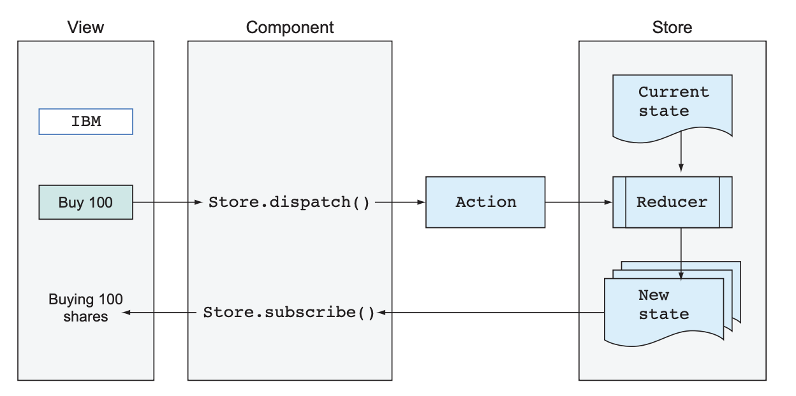
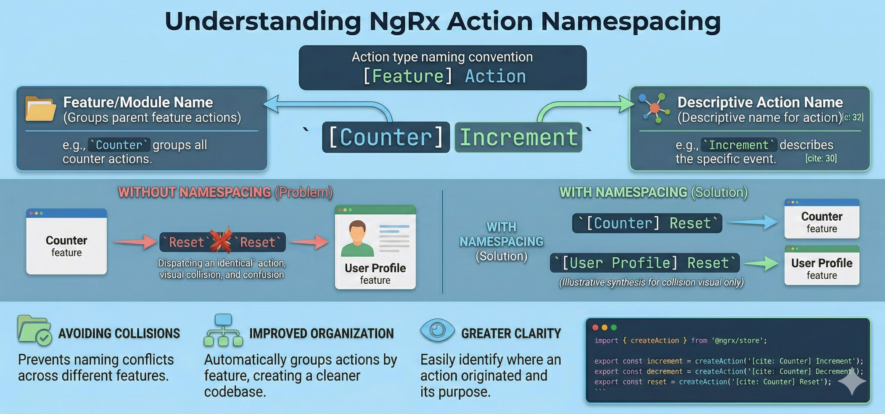
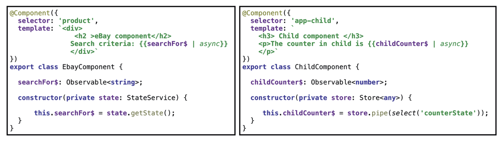
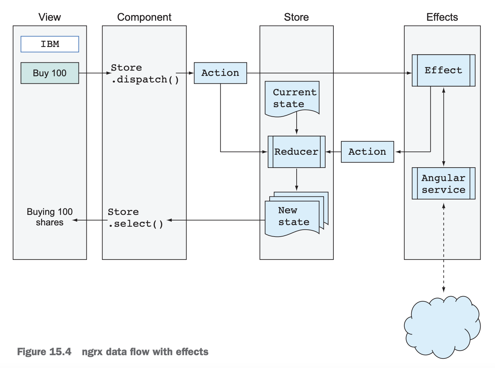
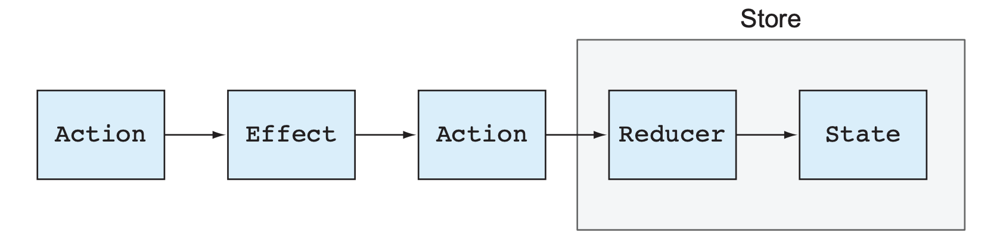
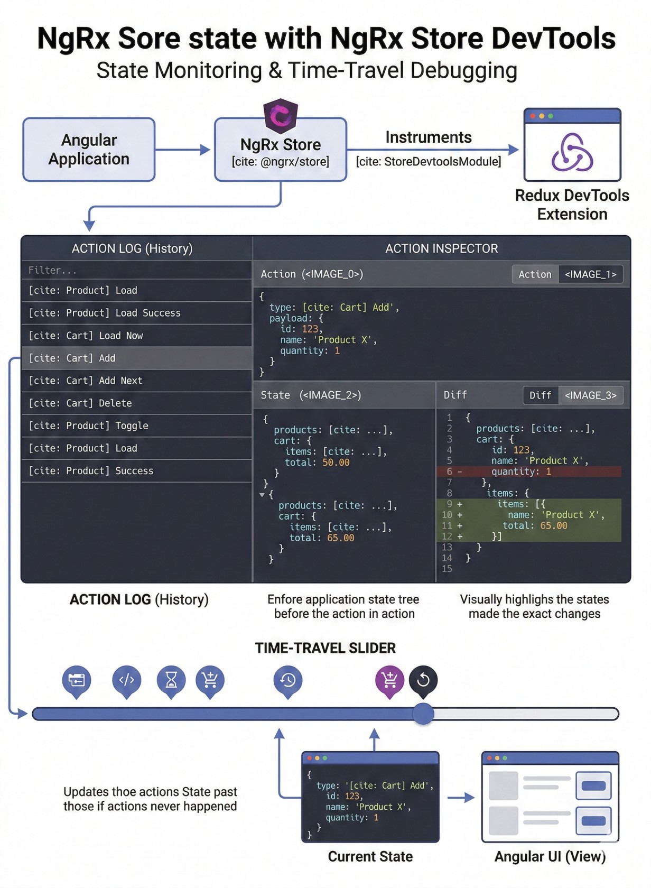
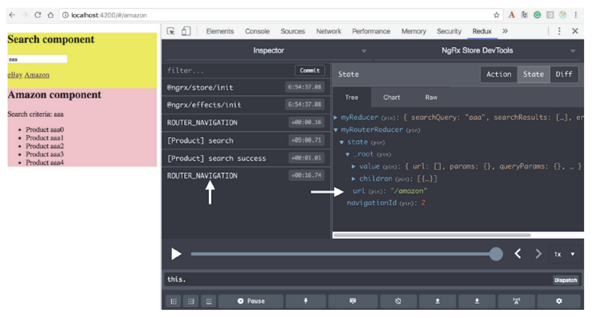

# INDEX

- [INDEX](#index)
  - [Maintaining app state with NgRx](#maintaining-app-state-with-ngrx)
    - [Key Concepts of NgRx](#key-concepts-of-ngrx)
    - [Should you use NgRx or Angular services?](#should-you-use-ngrx-or-angular-services)
  - [How to use NgRx in an Angular application](#how-to-use-ngrx-in-an-angular-application)
    - [Difference between Angular services and NgRx store](#difference-between-angular-services-and-ngrx-store)
    - [Effects in NgRx](#effects-in-ngrx)
    - [Selectors in NgRx](#selectors-in-ngrx)
  - [Monitoring state](#monitoring-state)
    - [Monitoring state with ngrx store DevTools](#monitoring-state-with-ngrx-store-devtools)
    - [Monitoring the router state](#monitoring-the-router-state)

---

## Maintaining app state with NgRx

> Guide: [NgRx](https://ngrx.io/)

**NgRx** is a state management library for Angular applications. It is based on the Redux pattern and provides a way to manage the state of an application in a predictable way.

> Redux is an open-source JavaScript library for managing application state. It is often used with React, but can be used with any JavaScript framework or library. Redux provides a way to manage the state of an application in a predictable way, making it easier to debug and maintain.

- NgRx uses a **unidirectional data flow**:
  - Flow:
    
    1. The app component dispatches the action on the store.
    2. The reducer (a pure function) takes the current state object and then clones, updates, and returns it.
    3. The store then updates the state of the application based on the action and the reducer.
    4. The component can then select specific pieces of state from the store to display in the UI by subscribing to the store and using selectors to retrieve the desired state.

  - So, in summary: the **state of the application is stored in a single store**. The **store is immutable**, meaning that it cannot be modified directly. Instead, **actions are dispatched to the store**, which then **updates the state based on the action**.
    

> Note: NgRx is often used in larger applications where managing state can become complex. It provides a way to keep the state of the application organized and predictable, making it easier to debug and maintain.
>
> ⚠️ But always ask first if it's worth using it in your project, as it can add complexity and boilerplate code to your application. If your application is small and doesn't require complex state management, you may not need to use NgRx.

- NgRx flow is similar to a convenience store, like a supermarket. The store has a single source of truth (the inventory), and customers (components) can only interact with the store by dispatching actions (buying or returning items). The store updates its state based on the actions dispatched, and customers can select specific pieces of state (inventory) to display in the UI.
  

### Key Concepts of NgRx

1. **Store**: The store is the central place where the state of the application is stored. It is an immutable object that can only be updated by dispatching actions.
2. **Actions**: Actions are plain JavaScript objects that describe an event that has occurred in the application. They typically have a `type` property that describes the type of action being performed, and may also have a `payload` property that contains additional data related to the action.
   - ⚠️ The action doesn't know how the state will be updated, it just describes what happened. The reducer is responsible for updating the state based on the action.
3. **Reducers**: Reducers are pure functions that take the current state of the application and an action, and return a new state based on the action. They are responsible for updating the state of the application in response to actions.
   - ⚠️ Reducers should never mutate the state directly. Instead, they should return a new state object that is a copy of the current state with the necessary updates based on the action.

4. **Effects**: Effects are used to handle side effects in the application, such as making API calls or interacting with external services. They listen for specific actions and perform the necessary side effects, then dispatch new actions to update the state of the application based on the results of the side effects.
5. **Selectors**: Selectors are functions that are used to select specific pieces of state from the store. They are typically used in components to retrieve data from the store and display it in the UI.

---

### Should you use NgRx or Angular services?

- Short answer: **it depends on the complexity and scale of your state**.

- Think about it like this:
  - **Angular service + RxJS (`BehaviorSubject`)** = a small whiteboard in one room. Easy, fast, and perfect for local team notes.
  - **NgRx Store** = a central, audited system for the whole company. More setup, but everyone follows the same rules. Keep in mind that ngrx code is more difficult to read especially by newcomers.
    > Components and services remain the same, but NgRx adds conventions for organizing actions, reducers, selectors, and effects.  
    > Actions/reducers can be declared as constants, classes, or enums and exported individually or grouped.  
    > NgRx introduces real boilerplate (not just relocating code), so if your components are already complex it can reduce readability.

- Core difference in one sentence
  - **Services** are great for **simple/shared state and business logic**.
  - **NgRx** is great for **large, shared, predictable application state** where traceability and consistency matter.

- Angular service approach

  You usually keep state in a service using RxJS:

  ```ts
  // cart.service.ts
  @Injectable({ providedIn: 'root' })
  export class CartService {
    private readonly _items = new BehaviorSubject<CartItem[]>([]);
    readonly items$ = this._items.asObservable();

    add(item: CartItem) {
      this._items.next([...this._items.value, item]);
    }

    clear() {
      this._items.next([]);
    }
  }
  ```

  - ✅ Very quick to build.
  - ✅ Low boilerplate.
  - ⚠️ Over time, logic can become scattered across many services/components.
  - ⚠️ Harder to trace _why_ state changed (no action history by default).

- NgRx approach

  State changes happen through explicit steps:
  1. Dispatch action
  2. Reducer calculates new immutable state
  3. Selector reads derived state
  4. Effect handles async work (API, side effects)

  ```ts
  // cart.actions.ts
  export const addItem = createAction('[Cart] Add Item', props<{ item: CartItem }>());

  // cart.reducer.ts
  export const cartReducer = createReducer(
    initialState,
    on(addItem, (state, { item }) => ({ ...state, items: [...state.items, item] }))
  );
  ```

  - ✅ Predictable and testable flow.
  - ✅ Easy to debug with DevTools and action history (time-travel).
  - ✅ Scales better across teams and large apps.
  - ⚠️ More files and concepts (actions, reducers, effects, selectors).

- Side-by-side comparison

  | Topic                           | Angular Services           | NgRx                                       |
  | ------------------------------- | -------------------------- | ------------------------------------------ |
  | Setup cost                      | Low                        | Medium/High                                |
  | Boilerplate                     | Low                        | Higher                                     |
  | Learning curve                  | Low/Medium                 | Medium/High                                |
  | Difficulty to read by newcomers | Low                        | High                                       |
  | Best for                        | Small/medium features      | Medium/large apps with shared global state |
  | State traceability              | Manual logs                | Built-in via actions + DevTools            |
  | Team consistency                | Depends on team discipline | Strong conventions by design               |
  | Async flows                     | RxJS in services           | Effects + actions                          |
  | Debugging complex flows         | Can get difficult          | Usually easier due to explicit flow        |

---

## How to use NgRx in an Angular application

- In ngrx, app state is accessed with the `Store` service, which is injected into components and services. The `Store` service provides methods for dispatching actions and selecting state from the store.

  ```typescript
  import { Store } from '@ngrx/store';

  constructor(private store: Store) {}
  ```

  - `Store` is an observable of state and and observer of actions. It provides methods for dispatching actions and selecting state from the store.

    ```ts
    class Store<T> extends Observable<T> implements Observer<Action> {
      dispatch<V extends Action>(action: V): void;
      select<K>(mapFn: (state: T) => K): Observable<K>;
    }
    ```

- First, we need to install the NgRx packages:

  ```bash
  npm install @ngrx/store @ngrx/effects @ngrx/store-devtools
  ```

- Then, we need to create a reducer function that will handle the actions dispatched to the store and update the state accordingly. For example, let's say we have a simple counter application:

  ```typescript
  // counter.reducer.ts
  import { createReducer, on } from '@ngrx/store';
  import { increment, decrement, reset } from './counter.actions';

  export const initialState = 0;

  const _counterReducer = createReducer(
    initialState,
    on(increment, state => state + 1),
    on(decrement, state => state - 1),
    on(reset, () => initialState)
  );

  export function counterReducer(state: any, action: any) {
    return _counterReducer(state, action);
  }
  ```

- Next, we need to define the actions that will be dispatched to the store. For example:

  ```typescript
  // counter.actions.ts
  import { createAction } from '@ngrx/store';

  export const increment = createAction('[Counter] Increment');
  export const decrement = createAction('[Counter] Decrement');
  export const reset = createAction('[Counter] Reset');
  ```

  - You can see that we're using **Namespacing** in the action types to avoid collisions between actions from different parts of the application. The action type is typically in the format of `[Feature] Action`, where `Feature` is the name of the feature or module that the action belongs to, and `Action` is a descriptive name for the action being performed. This is a common convention in NgRx to help organize actions and make it easier to understand where they belong in the application.
    

- Finally, we need to register the reducer in the `AppModule` and use the `Store` service in our components to dispatch actions and select state from the store.

  ```typescript
  // app.module.ts
  import { NgModule } from '@angular/core';
  import { BrowserModule } from '@angular/platform-browser';
  import { StoreModule } from '@ngrx/store';
  import { counterReducer } from './counter.reducer';

  @NgModule({
    declarations: [AppComponent],
    imports: [BrowserModule, StoreModule.forRoot({ count: counterReducer })],
    providers: [],
    bootstrap: [AppComponent]
  })
  export class AppModule {}
  ```

- Now, we can use the `Store` service in our components to dispatch actions and select state from the store:

  ```typescript
  // counter.component.ts
  import { Component } from '@angular/core';
  import { Store } from '@ngrx/store';
  import { increment, decrement, reset } from './counter.actions';

  @Component({
    selector: 'app-counter',
    template: `
      <div>
        <h1>{{ count$ | async }}</h1>
        <button (click)="increment()">Increment</button>
        <button (click)="decrement()">Decrement</button>
        <button (click)="reset()">Reset</button>
      </div>
    `
  })
  export class CounterComponent {
    count$ = this.store.select(state => state.count); // Observable of the count state

    constructor(private store: Store<{ count: number }>) {}

    increment() {
      this.store.dispatch(increment());
    }

    decrement() {
      this.store.dispatch(decrement());
    }

    reset() {
      this.store.dispatch(reset());
    }
  }
  ```

---

### Difference between Angular services and NgRx store

Note that the main goal of the ngrx store is to manage the app state, but it also plays another role: it acts as a communication channel **(Mediator)** between components. In contrast, Angular services are typically used to share data and functionality between components, but they do not provide the same level of state management and predictability as the ngrx store.

- So they both can be used as mediator between components, where services use observables like `BehaviorSubject` to share data between components, while the ngrx store don't need to use any BehaviorSubject, as it is already an observable of state and an observer of actions. As it emits values whenever the state changes, components can subscribe to the store and get the latest state without having to worry about managing the state themselves.

- To notify the `BehaviorSubject` that the state has changed, we need to call the `next()` method on the `BehaviorSubject` and pass in the new value. This will emit the new value to all subscribers of the `BehaviorSubject`. In contrast, with the ngrx store, we don't need to call any method to notify subscribers of state changes. **Whenever an action is dispatched** to the store and the state is updated by the reducer, the store automatically emits the new state to all subscribers. This means that components can simply subscribe to the store and get the latest state without having to worry about managing the state themselves.
  

---

### Effects in NgRx

- Effects are used to handle side effects in the application, such as making API calls or interacting with external services. They listen for specific actions and perform the necessary side effects, then dispatch new actions to update the state of the application based on the results of the side effects.
- Effects are injectable classes that live outside of the store and are used for implementing functionality that has side effects, without breaking unidirectional data flow. ngrx effects come in a separate package, and you need to run the following command to add them to your project:

  ```sh
  npm install @ngrx/effects
  ```

- If a component dispatches an action that requires communication with external resources, the action can be picked up by the Effects object, which will handle this action and dispatch another one on the reducer.
  - For example, if we have an action to load a list of items from an API, we can create an effect that listens for this action, makes the API call, and then dispatches a new action with the results of the API call.
    

- Effects live outside of the store and are used for implementing functionality that has side effects, without breaking unidirectional data flow. They are not responsible for updating the state of the application directly, but rather for handling side effects and dispatching new actions to update the state based on the results of those side effects.

- In general, you can think of an effect as middleware between the original
  action and the reducer
  

> **Note ⚠️**: Even though actions can be handled in both a reducer and an effect, only a reducer can change the state of an app.

- How to create an effect:
  - 1️⃣ First, Creating the effect class and decorating it with `@Injectable()`.
    - **(old way)**: In your effects class, you’ll declare one or more class variables annotated with the `@Effect` decorator. Each effect will apply the `ofType` operator to ensure that it reacts to only the specified action type, as shown in the following listing.

      ```ts
      // items.effects.ts
      import { Injectable } from '@angular/core';
      import { Actions, Effect, ofType } from '@ngrx/effects';
      import { of } from 'rxjs';
      import { switchMap, map, catchError } from 'rxjs/operators';
      import { ItemsService } from './items.service';
      import { loadItems, loadItemsSuccess, loadItemsFailure } from './items.actions';

      @Injectable()
      export class ItemsEffects {
        @Effect()
        loadItems$ = this.actions$.pipe(
          ofType(loadItems),
          switchMap(() =>
            this.itemsService.getItems().pipe(
              map(items => loadItemsSuccess({ items })),
              catchError(error => of(loadItemsFailure({ error })))
            )
          )
        );

        constructor(
          private actions$: Actions,
          private itemsService: ItemsService
        ) {}
      }
      ```

    - **(new way)**: In your effects class, you’ll declare one or more class variables that are created using the `createEffect` function. Each effect will apply the `ofType` operator to ensure that it reacts to only the specified action type, as shown in the following listing.

      ```ts
      // items.effects.ts
      import { Injectable } from '@angular/core';
      import { Actions, createEffect, ofType } from '@ngrx/effects';
      import { of } from 'rxjs';
      import { switchMap, map, catchError } from 'rxjs/operators';
      import { ItemsService } from './items.service';
      import { loadItems, loadItemsSuccess, loadItemsFailure } from './items.actions';

      @Injectable()
      export class ItemsEffects {
        loadItems$ = createEffect(() =>
          this.actions$.pipe(
            ofType(loadItems),
            switchMap(() =>
              this.itemsService.getItems().pipe(
                map(items => loadItemsSuccess({ items })),
                catchError(error => of(loadItemsFailure({ error })))
              )
            )
          )
        );

        constructor(
          private actions$: Actions,
          private itemsService: ItemsService
        ) {}
      }
      ```

  - 2️⃣ Then, we need to register the effect in the `AppModule`:

    ```ts
    // app.module.ts
    import { NgModule } from '@angular/core';
    import { BrowserModule } from '@angular/platform-browser';
    import { StoreModule } from '@ngrx/store';
    import { EffectsModule } from '@ngrx/effects';
    import { counterReducer } from './counter.reducer';
    import { ItemsEffects } from './items.effects';

    @NgModule({
      declarations: [AppComponent],
      imports: [
        BrowserModule,
        StoreModule.forRoot({ count: counterReducer }),
        EffectsModule.forRoot([ItemsEffects])
      ],
      providers: [],
      bootstrap: [AppComponent]
    })
    export class AppModule {}
    ```

  - 3️⃣ Finally, we can dispatch the action that triggers the effect from our component:

    ```ts
    // items.component.ts
    import { Component } from '@angular/core';
    import { Store } from '@ngrx/store';
    import { loadItems } from './items.actions';

    @Component({
      selector: 'app-items',
      template: `
        <div>
          <button (click)="loadItems()">Load Items</button>
          <ul>
            <li *ngFor="let item of items$ | async">{{ item.name }}</li>
          </ul>
        </div>
      `
    })
    export class ItemsComponent {
      items$ = this.store.select(state => state.items); // Observable of the items state

      constructor(private store: Store<{ items: any[] }>) {}

      loadItems() {
        this.store.dispatch(loadItems());
      }
    }
    ```

- Notes:
  - Not all effects need to dispatch a new action. Some effects may simply perform a side effect without dispatching a new action, such as logging an error or showing a notification. In this case, you can set the `dispatch` property of the effect to `false` to indicate that it should not dispatch a new action.

    ```ts
    loadItems$ = createEffect(
      () =>
        this.actions$.pipe(
          ofType(loadItems),
          switchMap(() =>
            this.itemsService.getItems().pipe(
              map(items => loadItemsSuccess({ items })),
              catchError(error => of(loadItemsFailure({ error })))
            )
          )
        ),
      { dispatch: false } // This effect will not dispatch a new action
    );
    ```

---

### Selectors in NgRx

- Selectors are functions that are used to select specific pieces of state from the store. They are typically used in components to retrieve data from the store and display it in the UI.
- Selectors are created using the `createSelector` function from the `@ngrx/store` package. They take one or more input selectors and a projection function that defines how to combine the input selectors to produce the desired output.
  - For example, let's say we have a state that contains a list of items and we want to create a selector to retrieve the list of items from the state:

    ```ts
    // items.selectors.ts
    import { createSelector } from '@ngrx/store';

    export const selectItemsState = state => state.items;

    export const selectAllItems = createSelector(
      selectItemsState,
      itemsState => itemsState.allItems
    );
    ```

    ```ts
    // items.component.ts
    import { Component } from '@angular/core';
    import { Store } from '@ngrx/store';
    import { selectAllItems } from './items.selectors';

    @Component({
      selector: 'app-items',
      template: `
        <div>
          <ul>
            <li *ngFor="let item of items$ | async">{{ item.name }}</li>
          </ul>
        </div>
      `
    })
    export class ItemsComponent {
      items$ = this.store.select(selectAllItems); // Observable of the selected items state

      constructor(private store: Store<{ items: any[] }>) {}
    }
    ```

    - You can see that we created a selector called `selectAllItems` that takes the `itemsState` as input and returns the `allItems` property from the state. We then use this selector in our component to select the list of items from the store and display it in the UI.

---

## Monitoring state

### Monitoring state with ngrx store DevTools

The ngrx store DevTools is a browser extension that allows you to monitor the state of your application in real-time. It provides a visual interface for inspecting the state of your application, as well as the actions that are being dispatched to the store.

- Because you delegate state-management operations to ngrx, you need a tool to monitor state changes during runtime. The browser extension **Redux DevTools** along with the `@ngrx/store-devtools` package are used for the instrumentation of the app state.
  

- While debugging an app, developers often need to re-create a certain state of the app, and one way to do that is to refresh the page and repeat user actions by clicking buttons, selecting list items, and so on. With Redux DevTools, you can travel back in time and re-create a certain state without refreshing the page—you can jump back to the state after a certain action occurred, or you can skip an action.

- To use the ngrx store DevTools, you need to install the extension in your browser and then add the `StoreDevtoolsModule` to your `AppModule`:

  ```sh
  npm install @ngrx/store-devtools
  ```

  ```ts
  // app.module.ts
  import { NgModule } from '@angular/core';
  import { BrowserModule } from '@angular/platform-browser';
  import { StoreModule } from '@ngrx/store';
  import { StoreDevtoolsModule } from '@ngrx/store-devtools';
  import { counterReducer } from './counter.reducer';

  @NgModule({
    declarations: [AppComponent],
    imports: [
      BrowserModule,
      StoreModule.forRoot({ count: counterReducer }),
      StoreDevtoolsModule.instrument({ maxAge: 25 }) // 👈 Add the StoreDevtoolsModule
    ],
    providers: [],
    bootstrap: [AppComponent]
  })
  export class AppModule {}
  ```

  - `maxAge` is the maximum number of actions to keep in the DevTools history. This allows you to limit the amount of memory used by the DevTools while still providing a useful history of actions and state changes.

---

### Monitoring the router state

> When a user navigates an app, the router renders components, updates the URL, and passes parameters or query strings if need be. Behind the scenes, the router object represents the current state of the router, and the `@ngrx/router-store` package allows you to keep track of the router state in the ngrx store.

The ngrx router store is a package that provides bindings to connect the Angular Router with the ngrx store. It allows you to monitor the router state in your application and dispatch actions based on router events.

- This package doesn’t change the behavior of Angular Router, and you can continue using the Router API in components, but because the store should be a single source of truth, you may want to consider representing the router state there as well.
  - So the ngrx store can give you access to the router state from anywhere in your application, making it easier to manage and debug.

- It comes with a built-in reducer for managing the router state -> `routerReducer`

- How to use it:
  1. Install the package:

     ```sh
     npm install @ngrx/router-store
     ```

  2. Import the `StoreRouterConnectingModule` in your `AppModule`:

     ```ts
     import { StoreRouterConnectingModule } from '@ngrx/router-store';

     @NgModule({
       imports: [StoreRouterConnectingModule.forRoot()]
     })
     export class AppModule {}
     ```

  3. Access the router state from the store using selectors:

     ```ts
     import { Store, select } from '@ngrx/store';
     import { Observable } from 'rxjs';
     import { RouterReducerState } from '@ngrx/router-store';

     interface AppState {
       router: RouterReducerState;
     }

     @Component({
       selector: 'app-root',
       templateUrl: './app.component.html',
       styleUrls: ['./app.component.css']
     })
     export class AppComponent {
       routerState$: Observable<RouterReducerState>;

       constructor(private store: Store<AppState>) {
         this.routerState$ = this.store.pipe(select('router'));
       }
     }
     ```

- The actions that the router uses in the store are of types: `ROUTER_NAVIGATION`, `ROUTER_NAVIGATED`, `ROUTER_CANCEL`, `ROUTER_ERROR`, and `ROUTER_LOAD`.
  - You can see them in the ngrx devtools actions
    

- Listening to router actions/changes using effects
  - You can create effects to listen to router actions and perform side effects based on navigation events. For example, you might want to fetch data when a user navigates to a specific route.

  ```ts
  import { Injectable } from '@angular/core';
  import { Actions, ofType, createEffect } from '@ngrx/effects';
  import { ROUTER_NAVIGATION } from '@ngrx/router-store';
  import { map, switchMap } from 'rxjs/operators';
  import { DataService } from './data.service';

  @Injectable()
  export class RouterEffects {
    constructor(private actions$: Actions, private dataService: DataService) {}

    loadDataOnNavigation$ = createEffect(() =>
      this.actions$.pipe(
        ofType(ROUTER_NAVIGATION), // 👈 Notice the action
        switchMap(() => this.dataService.getData().pipe(map(data => ({ type: 'DATA_LOADED', payload: data }))))
      )
    );
  });
  ```

- **Router Serializer** (optional)
  - The router serializer is responsible for converting the router state into a format that can be stored in the ngrx store. By default, it serializes the router state into a simple object containing the URL, params, and query params. You can provide a custom serializer if you need to include additional information or change the structure of the serialized state.
  - It's useful to tell ngrx store which parts of the router state you want to keep track of and how you want to represent them. in order to not crash the application when the state becomes too large or complex.

  ```ts
  // serializer.ts

  import { RouterStateSerializer } from '@ngrx/router-store';
  import { RouterStateSnapshot, Params } from '@angular/router';

  export interface RouterStateUrl {
    url: string;
    params: Params;
    queryParams: Params;
  }

  export class CustomSerializer implements RouterStateSerializer<RouterStateUrl> {
    serialize(routerState: RouterStateSnapshot): RouterStateUrl {
      const { url } = routerState;
      const { queryParams } = routerState.root;

      let state = routerState.root;
      while (state.firstChild) {
        state = state.firstChild;
      }
      const { params } = state;

      return { url, params, queryParams };
    }
  }
  ```

---

[Back to top](#index)
