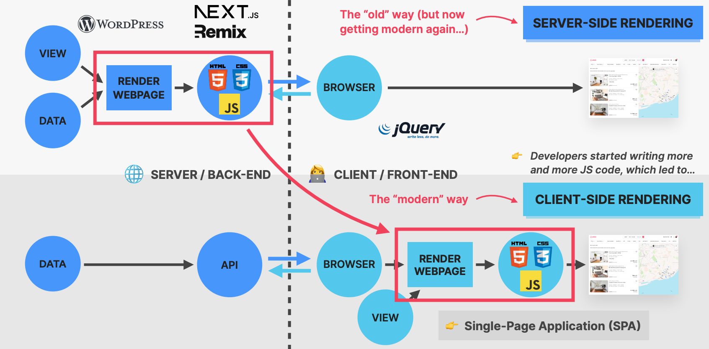
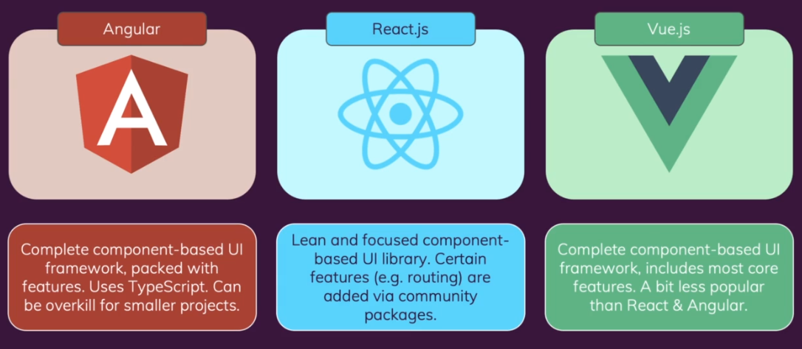
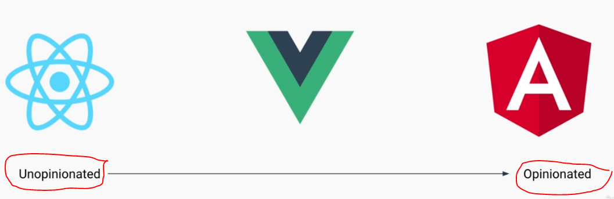
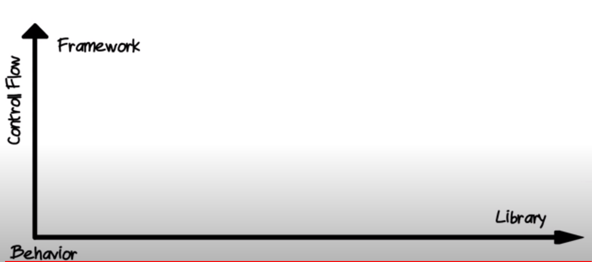
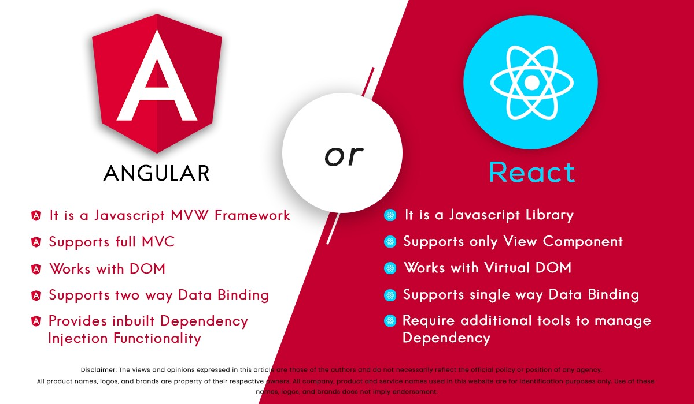

# INDEX

- [INDEX](#index)
  - [Frameworks](#frameworks)
    - [Problem with vanilla JavaScript](#problem-with-vanilla-javascript)
    - [Reactivity (Change Detection)](#reactivity-change-detection)
  - [Types of Frameworks](#types-of-frameworks)
    - [Configuration-over-convention](#configuration-over-convention)
    - [convention-over-configuration](#convention-over-configuration)
  - [Libraries vs Frameworks](#libraries-vs-frameworks)
    - [React](#react)
    - [Angular](#angular)
    - [Vue](#vue)
  - [Frameworks Comparison](#frameworks-comparison)
    - [Vue vs React](#vue-vs-react)

---

## Frameworks

`JavaScript frameworks` are tried and tested tools for building scalable web applications. They contain a collection of JavaScript code libraries that provide pre-written JS code for standard programming features and tasks.

- Before `2010`, most web applications were built using `Server-side rendering` to render the `html, css, js` on the server and send it to the client
  

  - this is an old way, but now it's getting modern again with `Next.js`.
  - now we use `Client-side rendering` to render the `html, css, js` on the client-side (browser) using `JavaScript` and `DOM` API, this is done with frameworks like `React`, `Angular`, `Vue`, etc.

- A JavaScript framework guides developers on building complex applications faster and more efficiently by providing an ecosystem of tools that improves the developer experience. Frameworks enable you to add functionalities like testing and linting to ensure you're shipping error-free code.

> **Opinionated**: having strong opinions on how things should be done and with what tools

---

### Problem with vanilla JavaScript

- `Vanilla JavaScript` is the term used to describe plain JavaScript without any additional libraries or frameworks.
- We use frameworks instead of vanilla JavaScript because it's hard to build a complex application with vanilla JavaScript, as it's not scalable and it's hard to maintain and test

  - it requires keeping the `UI` in sync with the `data` and `state` of the application, which is hard to do with vanilla JavaScript
  - if we want to build a complex application with vanilla JavaScript, we have 2 problems:
    1. we will require lots of `DOM` manipulation and traversing, which is hard to maintain and test **(spaghetti code)**
    2. state (data) needs to be stored in a central place instead of storing it in the `DOM`, and we need to keep the `UI` in sync with the `state` of the application

---

### Reactivity (Change Detection)

> "Reactivity" is the ability of a web application to update the user interface (html document) in response to changes in the underlying data or state of the application.

- It's one of the superpowers of modern frameworks like `React`, `Angular`, `Vue`, etc. as it replaces the old way of `DOM` manipulation and traversing with a more efficient way of updating the `UI` in response to changes in the `state` of the application
- When does reactivity happens?

  - when the app is first loaded / initialized
  - During changes in the state of the application
  - When the user interacts with the application
  - Manually triggering a reactivity update

- Some frameworks runs a `Change Detection` mechanism **Twice** to make sure that the `UI` is in sync with the `state` of the application. **But this is only in development mode, in production mode it runs only once**

  - **First run**: to check for changes in the `state` of the application
  - **Second run**: to update the `UI` with the changes in the `state` of the application

- In a complex application, it's hard to keep the `UI` in sync with the `state` of the application, as we need to manually update the `UI` whenever the `state` changes
- this is called `Reactivity`, and it's hard to do with vanilla JavaScript

---

## Types of Frameworks

### Configuration-over-convention

- easy to use
- freedom to structure however you please
- needs additional libraries to fill in missing features
- EX: `React`, `Vue`

---

### convention-over-configuration

- structure straight out of the box
- Provides solutions for common problems
- larger learning curve
- EX: `Angular`, `Next.js`, `Nuxt.js`

---

## Libraries vs Frameworks

- A `JavaScript library` refers to packaged code, methods, and functions that can be reused and repurposed. On the other hand,
- A `JavaScript framework` defines the application design, **can call on a library, and use code within it**. It doesn't offer a single solution; instead, it gives you a set of blueprints for building web applications.
  - It's wrong to say that a framework is a collection of libraries, as some frameworks doesn't contain/use libraries
- when comparing **framework** and a **library**, remember it's about the **Flow of control** as **"who calls whom"** like in a server/client relationship

  - The caller/callee relationship:
    

- Flow of control difference:
  
  - **Framework** control the flow of your app
  - **Library** don't control the flow of your app

---

### React

- `React` is not technically a framework; it's a library for UI components, but it's seen colloquially as a framework
  - React provides developers with just the **View-section (UI) of a framework**, so it's a library
  - this comes with a price which is less features, but **less features mean more options** which means more community-built projects and tools
- React.js provides fast UIs for interactive apps which use data efficiently by instantly applying changes to elements rather than updating all occurrences at once as other libraries do. It also supports incremental use with the virtual DOM (document object model) to make fast updates to web page content. React also uses JSX, a domain-specific interface created by the same team.

### Angular

- Angular is a `component-based framework`.
  - It offers developers a collection of integrated libraries and tools to develop, test, and update their code. This makes it a robust option for building and deploying web applications.
- Angular combines declarative templates, dependency injection, solid end-to-end tooling, and an integrated set of best practices to solve development challenges.
- Angular has everything built-in, and you as a developer can use these tools together

---

### Vue

- It's a JavaScript framework for building user interfaces. It builds on top of standard HTML, CSS and JavaScript, and provides a **declarative and component-based programming model** that helps you efficiently develop user interfaces, be it simple or complex.
- It gives you best of both worlds of (React & Angular) as it gives you the UI, routing, state-management built-in, but some other tools aren't, that you still get to decide how you want to build your app (like forms)

---

## Frameworks Comparison

When someone asks which framework to choose, a great answer is **"What does the team look like?"**, as it depends on that you should pick the framework/library that the team is most familiar with.

- the bigger the team, the better is to unify tools (AKA use opinionated framework/library like `Angular`), so that all of them do the same thing the same way
- something like `React` is great for Startups, where you trust the development team to make the right decisions and to combine different libraries and tools together to build something great
  - > sometimes `React` can lead to poorly built applications, where developers end up picking the latest libraries and tools and mix everything together that creates complexity and mess

### Vue vs React

1- **Optimization Efforts**

- In React, when a component’s state changes, it triggers the **re-render** of the entire component sub-tree (destroying the changed UI and re-render it **instead of data-binding like in Vue.js**), starting at that component as root. To avoid unnecessary re-renders of child components, you need to either use **`PureComponent`** or implement **`shouldComponentUpdate`**
- In Vue, a component’s dependencies are **automatically** tracked during its render, so the system knows precisely which components actually need to re-render when state changes. Each component can be considered to have shouldComponentUpdate automatically implemented for you, without the nested component caveats.

2- **HTML & CSS**

- In React, everything is just JavaScript. Not only are HTML structures expressed via JSX, the recent trends also tend to put CSS management inside JavaScript as well.
- In Vue, we also have render functions and even support JSX, because sometimes you do need that power. However, as the default experience we offer templates as a simpler alternative. Any valid HTML is also a valid Vue template, and this leads to a few advantages of its own:
  - templates feel more natural to read and write
  - easier to progressively migrate existing applications to take advantage of Vue’s reactivity features.
  - You can even use pre-processors such as **Pug**

3- **Native Rendering**

- React Native enables you to write native-rendered apps for iOS and Android using the same React component model
- Vue has an official collaboration with **Weex**, a cross-platform UI framework

4- **more**:

- Basic configuration, CLI, and initial setup time [Vue ✅]
- Code writing ideology (JSX vs Templates) [ Vue ✅]
- Market strength [React ✅]
- Getting help when needed (documentation and support) [Draw]
- Compatibility with animations [Vue ✅]
- Manipulating changes in DOM [Vue ✅]
- Dependency injection ability [Vue ✅]
- Code hierarchy and refactoring Vue ✅]
- Broadcasting and remote event listening [Vue ✅]
