# INDEX

- [INDEX](#index)
  - [Next.js](#nextjs)
    - [React Drawbacks](#react-drawbacks)
    - [Next.js Features](#nextjs-features)
  - [Installation](#installation)
    - [configuration](#configuration)
  - [Pre-rendering](#pre-rendering)
    - [Data Fetching](#data-fetching)
    - [Static Site Generation (SSG)](#static-site-generation-ssg)
      - [`getStaticProps()`](#getstaticprops)
      - [`getStaticPaths()`](#getstaticpaths)
    - [Incremental Static Regeneration](#incremental-static-regeneration)
    - [Server Side Rendering (SSR)](#server-side-rendering-ssr)
      - [getServerSideProps()](#getserversideprops)
  - [File-based Routing](#file-based-routing)
    - [Dynamic routes](#dynamic-routes)
    - [Catch-All Routes](#catch-all-routes)
      - [Custom 404 Page](#custom-404-page)
    - [Navigation through routes](#navigation-through-routes)
  - [Optimization](#optimization)
    - [Head (meta data)](#head-meta-data)
    - [Optimizing Images](#optimizing-images)
  - [API Routes](#api-routes)
  - [Deployment](#deployment)
    - [Deployment Options](#deployment-options)

---

## Next.js

It's a framework built on top of React that gives you the flexibility of building scalable apps by allowing you to **render content on the server**

- By framework, we mean Next.js handles the tooling and configuration needed for React, and provides additional structure, features, and optimizations for your application.
- this makes Next.js creates full-stack applications


[NEXT.JS VS REACT](https://pagepro.co/blog/nextjs-vs-react/)

- Is it like `create react app`?
  - Yes and NO
  - Yes, in that both make your life easier
  - No, in that it enforces a structure so that we can do more advanced things like:
    - server side rendering
    - automatic **code splitting**
      - > **"code splitting":** is dividing web app in small chunks so that you can load the chunk that is used by the current page
        > 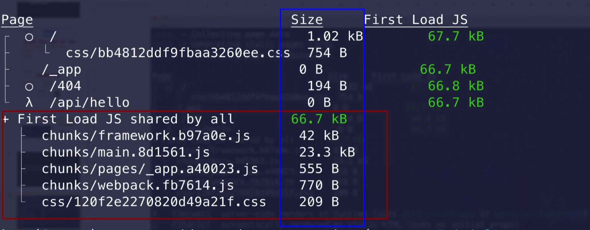
  - In addition, Next.js provides 2 built-in features that are critical for every single website:
    - routing with lazy component loading
    - a way for components to alter `<head>`: `<Head>`

### React Drawbacks

- client-side-rendering **CSR** can cause problems like in Search-engine-optimization **SEO** as in the beginning the html page is empty so that is bad for SEO

  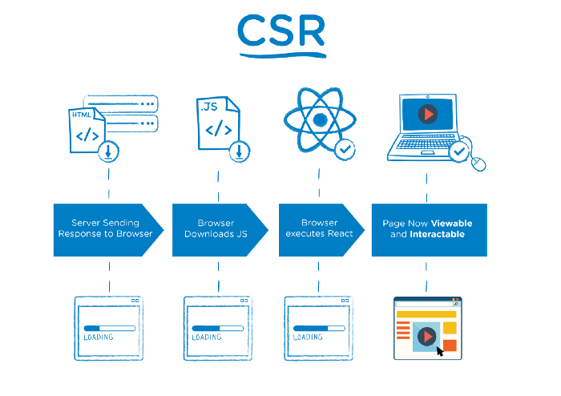

---

### Next.js Features

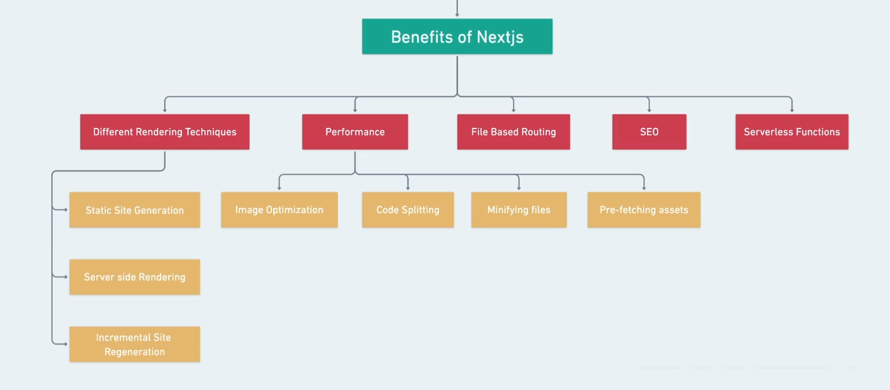

- **Different Rendering Techniques**
  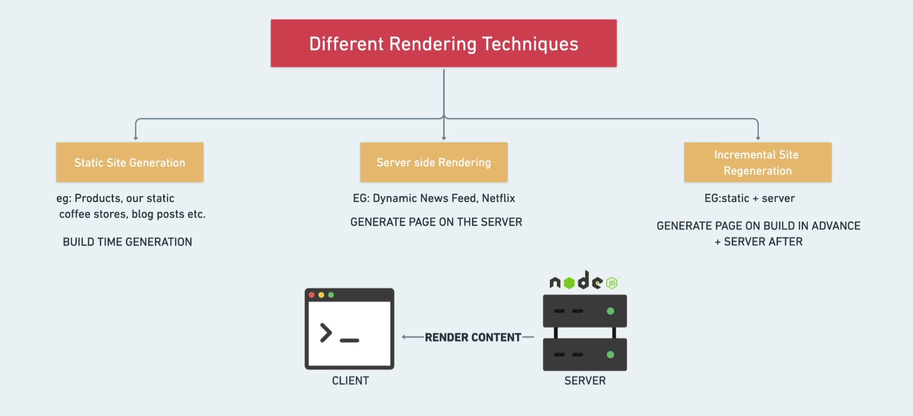

  - Built-in Server Side Rendering SSR : pre-rendering react apps in the server

- **Performance**
  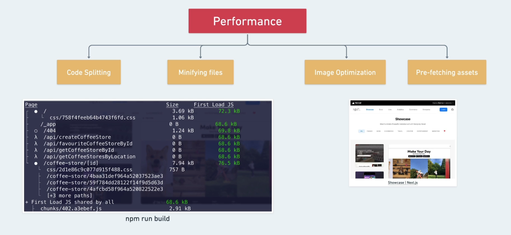

- **File-based routing**

  - define pages and routes with files and folders instead of code
    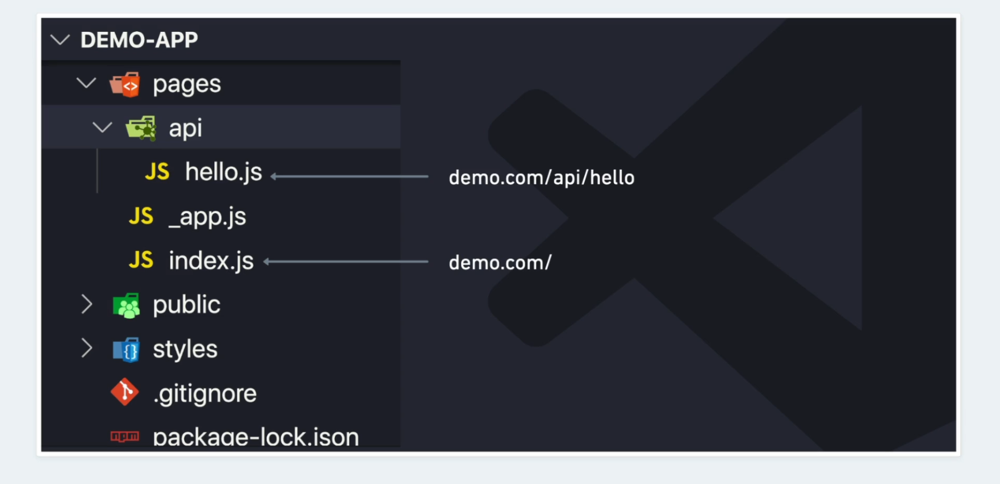

- **SEO**
  
  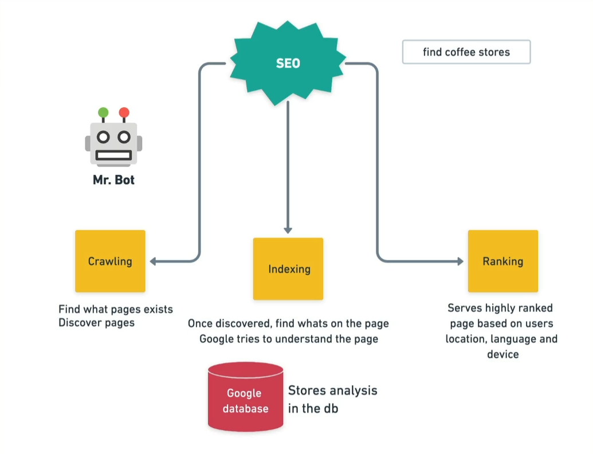

- **Serverless Functions**
  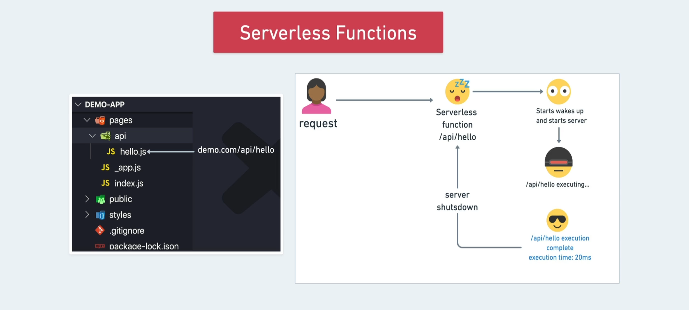
  - it help us with not letting the server run all the time and only run for certain tasks
  - files need to be a function and to be exported by default
  - every serverless function should have its own file

---

## Installation

```sh
npx create-next-app
```

- File structure
  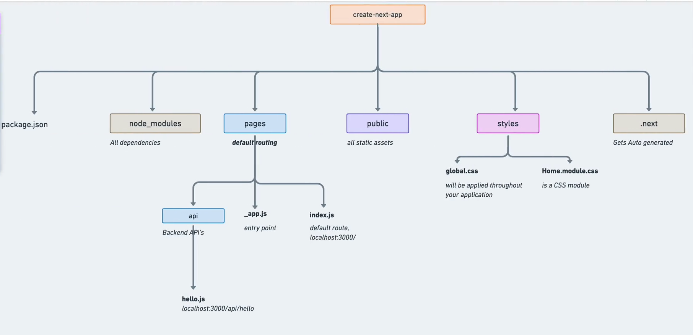
  - `_app.js` is where you have common components in all routes
    - it's responsible for all the routes in the application

---

### configuration

- `next.config.js`: It's a regular Node.js module, not a JSON file. It gets used by the Next.js **server and build phases**, and it's not included in the browser build.
  - here we can use options and things that will be available upon building for the server, like:
    - `environmental variables` instead of creating `.env` file
    - allowed domains (ex: for downloading images from the url in the `src`)

---

## Pre-rendering

**Pre-rendering** to HTML means that we will convert the React Component to an HTML file and send the HTML file to the client so it can quickly show that to our user without much processing or bandwidth.

- rendering in React -> the javascript is responsible for rendering all the content
  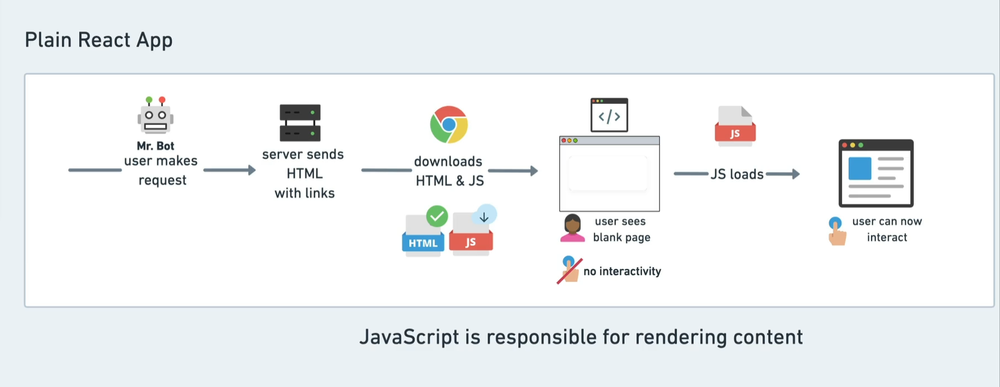
- rendering in Next.js -> the server is responsible for rendering all the content
  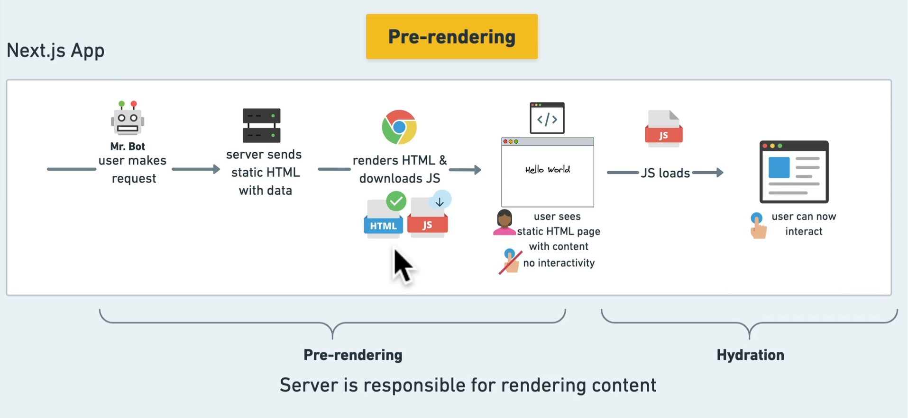

Next.js by default doesn't wait for the data to be fetched even if it's in `useEffect()` instead it renders the data with the initial state

- `Hydration`: it means that react takes over once page is loaded from server-side
  - in this step react then start **fetching** for required data if needed

### Data Fetching

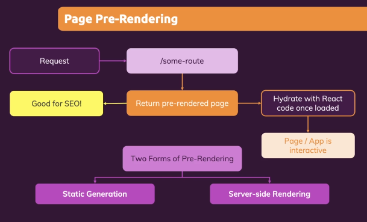

- Static Site Generation (SSG) -> `getStaticProps`
- Incremental Static Regeneration (ISR) -> `getStaticProps with revalidate`
- Server-side Rendering (SSR) -> `getServersideProps`
- Client-side Rendering (CSR) -> `Plain React Way`
  - Client-side data fetching is useful when:
    - your page doesn't require SEO indexing
    - when you don't need to pre-render your data
    - when the content of your pages needs to update frequently.
  - Unlike the server-side rendering APIs, you can use client-side data fetching at the component level.
  - in order to use CSR in Next.js, we use [SWR](https://swr.vercel.app/) -> It's a React Hook for fetching data on the client side

**Notes:**

- Every page(route) can have different rendering method based on the data and the use-case
- good practice is to:
  - see if we can statically generate data or not as this will be the fastest
  - if we can't we can try to do this with updating the data over time with **ISR**
  - if the previous 2 methods don't work with us, and we have dynamic data but we care about performance & SEO, then SSR makes more sense

---

---

### Static Site Generation (SSG)


Static Generation describes the process of compiling and rendering a website or app **at build time** (pre-downloaded).

So it doesn't have to do it for every request, and neither does the browser have to do it on the client-side.

- Benefit:

  - `SEO`

  - `Performance & Speed` :

    - HTML page is much faster for the end-user because the browser doesn't have to do much processing upfront. The pre-rendering makes it easy for the browser to fetch the HTML and render it straight up.
      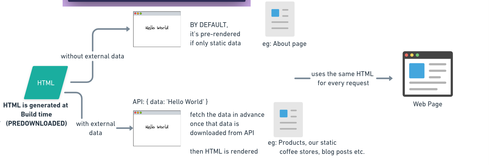

  - `Caching with CDNs`
    - usually the HTML content won't change and the user will be using the already-generated files stored in a CDN, and only when the content changes, the HTML will be re-generated
      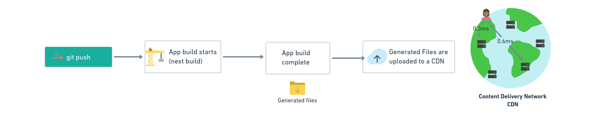
  - more advantages here [Advantages of SSG over SSR](https://www.kezios.fr/articles/advantages-of-ssg-over-ssr-3na)

Next.js provides a few different APIs to fetch data including `getStaticProps` and `getServerSideProps`, which determines how Next.js will build your app.

- **The issue of Static Site Generation:**
  - The build time will increase followed by the number of pages. The time you need to wait could be from minutes to hours. This is a huge blocker when you need to make changes to something in your content.
    - To fix this we can use [Incremental Static Regeneration (ISR)](#incremental-static-regeneration)

---

#### `getStaticProps()`

[Docs](https://nextjs.org/docs/api-reference/data-fetching/get-static-props)

If you export a function called `getStaticProps` from a page, Next.js will pre-render this page **at build time** using the **props** returned by getStaticProps.

- Only runs(fetches data) at build time
- Only runs on the server and never on the client **(and won't be included in client bundle)**
  - > On dev environment, It runs on client and server sides
- it prepares and **returns** props for the component, then execute the component function
- can only be exported from a page file
- inside it, you can Write server-side code directly(**node.js**)

The code in this function won't happen on Client-Side as it will be in the server and after they are done the component will be rendered (after data has been fetched), usually they return a **props object** + we can control how often the page gets regenerated if there's a changing data

```js
// in a page file -> Courses.js
export async function getStaticProps(context) {
  const data = await fetch(something);
  // if you did a `console.log()` here, you will find that the log is in (the Node server terminal as it runs only on the server)

  return {
    props: {
      data
    } // will be passed to the page component as props
  };
}

export default function Courses(props) {
  console.log(props); // here we will have access to the "data" in the props
}
```

- Context parameter:

  - `params`: contains the route parameters for pages using dynamic routes.
    - if the page name is [id].js , then params will look like { id: ... }
  -

- when to use it?
  - when the page must be pre-rendered (for SEO) and be very fast — getStaticProps generates HTML and JSON files, both of which can be cached by a CDN for performance
- You shouldn't fetch internal api inside `getStaticProps` as `getStaticProps` runs on the server and the internal api request is done on the server and the server may have not started fully which may result problems with api fetching

#### `getStaticPaths()`

If a page has dynamic routes and uses `getStaticProps`, it needs to define a list of paths to be rendered to HTML at build time (statically generated).

- can Only be exported from a Page file and Page must also implement `getStaticProps`
- Only runs(fetches data) at build time
- Only runs on the server and never on the client **(and won't be included in client bundle)**
- Next.js will statically pre-render all the paths specified by `getStaticPaths`.

```js
// in [id].js in Courses folder
export async function getStaticPaths() {
  return {
    paths: [{ params: { id: '1' } }, { params: { id: '2' } }],
    fallback: true // false or 'blocking' (tell next.js what to do it it can't find the path)
  };
}

export async function getStaticProps(staticProps) {
  const params staticProps.params;
  const data = await fetch('something');
  return {
    props: {
      data.find((course) => course.id === params.id)
    } // will be passed to the page component as props
  };
}
```

**Fallback**
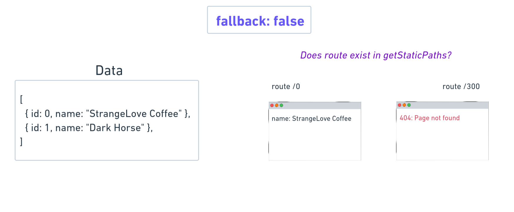
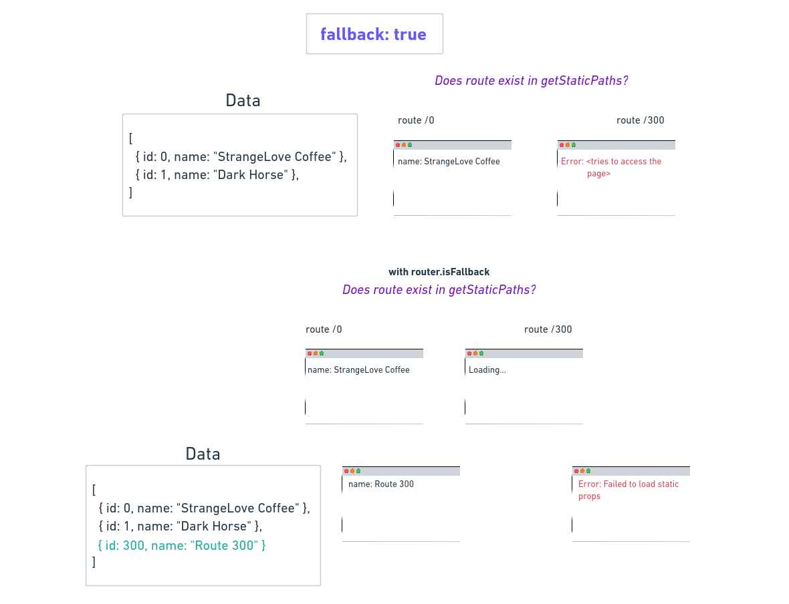
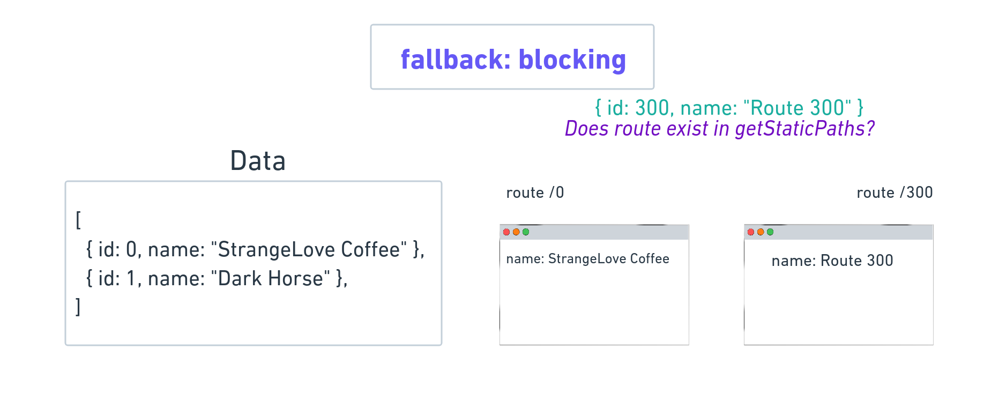

---

### Incremental Static Regeneration

Next.js allows you to create or update static pages **after** you’ve built your site. Incremental Static Regeneration (**ISR**) enables you to use static-generation on a per-page basis, **without needing to rebuild the entire site**. With ISR, you can retain the benefits of static while scaling to millions of pages.

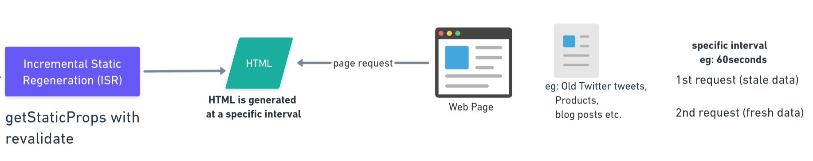
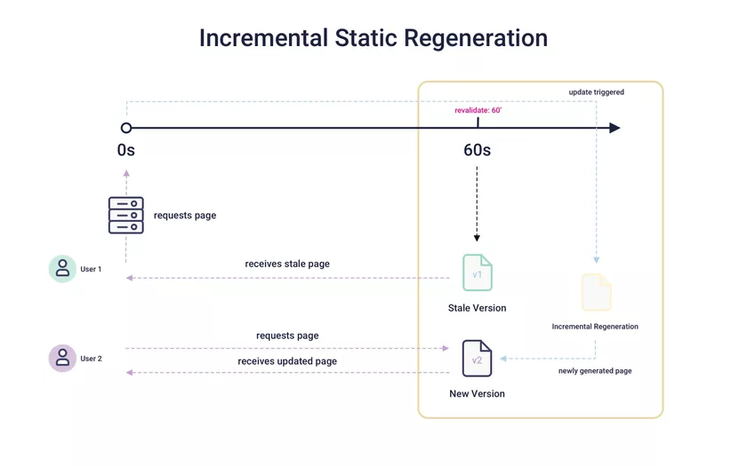

- **Pros**: Possible to choose the number of pages to generate with an adjustable stale time with revalidate. Really fast performance with less build time.

- **Cons**: There's still stale time in the beginning.

```js
// This function gets called at build time on server-side.
// It may be called again, on a serverless function, if
// revalidation is enabled and a new request comes in
export async function getStaticProps() {
  const res = await fetch('https://.../posts');
  const posts = await res.json();

  return {
    props: {
      posts
    },
    // Next.js will attempt to re-generate the page:
    // - When a request comes in
    // - At most once every 10 seconds
    revalidate: 10 // In seconds
  };
}
```

---

### Server Side Rendering (SSR)

Here, when a user accesses a website, this request’s information is sent directly to the server, which responds with a file with the complete HTML code. From this content, the website will be properly loaded in full.

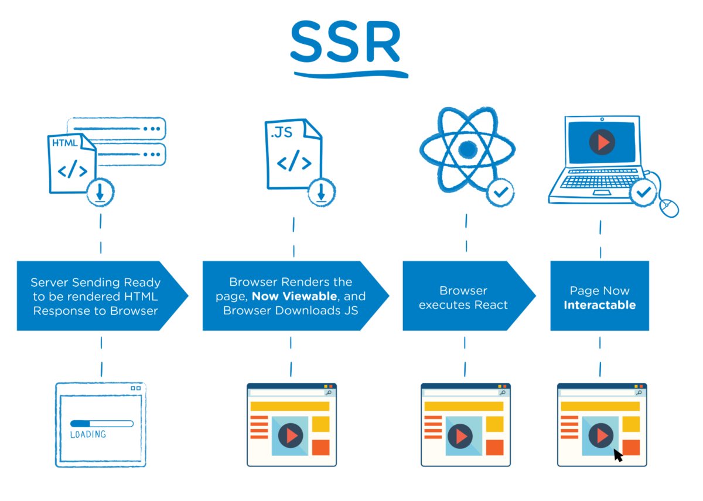
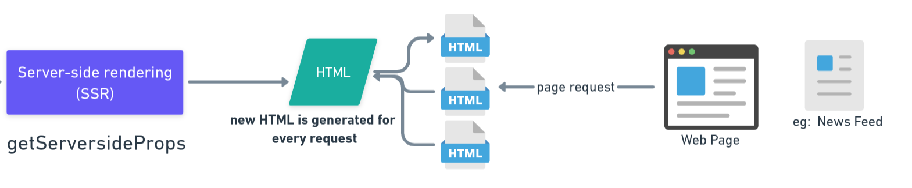

Server-side rendering refers to an application’s ability to display the web-page on the server rather than rendering it in the browser. When a website’s JavaScript is rendered on the website’s server, a fully rendered page is sent to the client and the client’s JavaScript bundle engages and enables the Single Page Application framework to operate.

> if you did a `console.log()` in a SSR file, you will find that the log is in (the Node server terminal + the browser)

- here we will have better SEO but lower performance than **SSG** and **ISR**
- also here, we won't be able to necessarily cache this data in the **CDN**, because we're generating the request every time on the server for every request

#### getServerSideProps()

It's similar to [getStaticProps()](#getstaticprops) but the difference is in the parameter **context**, as here we can access all the data from the **request and response**

---

## File-based Routing

here we used file-based instead of code-based as we don't use react-router


### Dynamic routes

```js
// in pages/post/[id].js
import { useRouter } from 'next/router';

const Post = () => {
  const router = useRouter();
  const productID = router.query.id;

  return <p>Post: {productID}</p>;
};
```

### Catch-All Routes

```js
// in pages/listing/[...slug].js
import { useRouter } from 'next/router';

const Post = () => {
  const router = useRouter();
  const paths = router.query.slug; // this will be an Array of all routes

  return <p></p>;
};
```

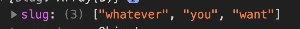

#### Custom 404 Page

-The file must be named `404.js`

---

### Navigation through routes

- **Clickable**:

  ```js
  import Link from 'next/link';

  <Link href='/products'>products</Link>;
  ```

- **Programmatically**:

  ```js
  // like in react
  router.push('/clients/max');
  ```

---

## Optimization

### Head (meta data)

Next.js exposes a built-in component for appending elements to the `head` of the page:

To inject `head`, `meta` content in the real html page

```js
import Head from 'next/head';

function IndexPage() {
  return (
    <div>
      <Head>
        <title>My page title</title>
        <meta property='og:title' content='My page title' key='title' />
      </Head>
      <Head>
        <meta property='og:title' content='My new title' key='title' />
      </Head>
      <p>Hello world!</p>
    </div>
  );
}

export default IndexPage;
```

- Usually, It's used to add fonts to <head>` as this uses Next.js font-optimization with **pre-loading** and prioritizing downloading fonts before other assets

**Notes:**

- You can also put a global header in **`_app.js`** or **`_document.js`** which will be applied for all components

  - A custom Document can update the `<html>` and `<body>` tags used to render a Page. This file is only rendered on the server, so event handlers like onClick cannot be used in `_document` file.
  - To override the default Document, create the file `pages/_document.js` as shown below:

    ```js
    import { Html, Head, Main, NextScript } from 'next/document';

    export default function Document() {
      return (
        <Html>
          <Head />
          <body>
            <Main />
            <NextScript />
          </body>
        </Html>
      );
    }
    ```

- If you have more than one `head`, next.js will **merge** them

---

### Optimizing Images

`Image` component is an extension of the HTML `` element, evolved for the modern web. It includes a variety of built-in performance optimizations to help you achieve good Core Web Vitals. These scores are an important measurement of user experience on your website, and are factored into Google's search rankings.

- optimization:
  - **Improved Performance**: Always serve correctly sized image for each device, using modern image formats
    - based on the device(screen dimensions), Next.js serves the same image at different size(`KB`)
  - **Cashing**
  - **Lazy Loading**: images are loaded when needed

```js
import Image from 'next/image';

<Image
  src={profilePic}
  alt='Picture of the author'
  // width={500} automatically provided
  // height={500} automatically provided
  // blurDataURL="data:..." automatically provided
  // placeholder="blur" // Optional blur-up while loading
/>;
```

---

## API Routes

- must be in `api` folder, inside it we can write **Server-Side** code and will never be exposed to the client-side

---

## Deployment

### Deployment Options

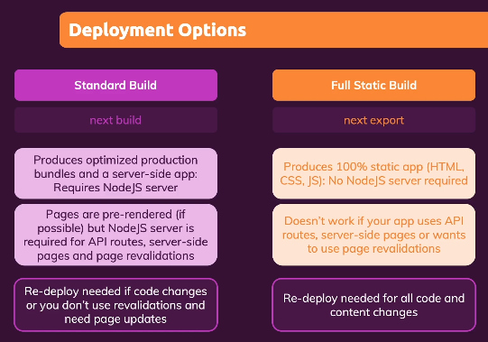
