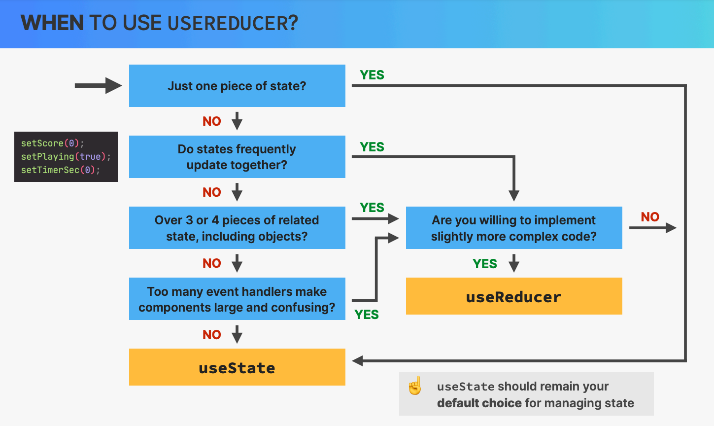

# INDEX

- [INDEX](#index)
  - [Functional Components](#functional-components)
  - [React Hooks](#react-hooks)
    - [Hooks Rules](#hooks-rules)
  - [State](#state)
    - [`useState` Hook](#usestate-hook)
      - [Initializing state](#initializing-state)
      - [changing state of type `object`](#changing-state-of-type-object)
      - [Functional state updates](#functional-state-updates)
  - [Refs](#refs)
    - [`useRef`](#useref)
      - [Why use it ?](#why-use-it-)
    - [`useRef` Implementation (How to use it)](#useref-implementation-how-to-use-it)
  - [Effect Hook](#effect-hook)
    - [You might not need an Effect](#you-might-not-need-an-effect)
    - [useEffect](#useeffect)
    - [useEffect dependency array](#useeffect-dependency-array)
    - [useEffect cleanup function](#useeffect-cleanup-function)
    - [useLayoutEffect](#uselayouteffect)
  - [useReducer](#usereducer)
    - [`useReducer` vs `useState`](#usereducer-vs-usestate)
    - [Reducer function](#reducer-function)
    - [How `useReducer` works](#how-usereducer-works)
    - [Action generator functions](#action-generator-functions)
    - [Not recommended ways of using reducer function](#not-recommended-ways-of-using-reducer-function)
    - [reducer function with Immer](#reducer-function-with-immer)
  - [Context API](#context-api)
    - [Solution for Prop drilling: (context)](#solution-for-prop-drilling-context)
    - [context setup](#context-setup)
    - [`useContext` Hook](#usecontext-hook)
    - [Mixing context with `useReducer`](#mixing-context-with-usereducer)
    - [Context Limitations](#context-limitations)
  - [Custom Hooks](#custom-hooks)
    - [Custom hook for form input (`useInput`)](#custom-hook-for-form-input-useinput)
    - [Custom hook for keyboard events (`useKeyPress`)](#custom-hook-for-keyboard-events-usekeypress)
    - [Custom hook for context](#custom-hook-for-context)

---

## Functional Components

Here, each time the state change the entire function get called and rerendered unlike in `class components` where only the `render()` method was called

- React functional components are **Pure Functions**
  - given the same props (input), a component instance should always render the same `JSX` (output)
- Render logic must produce **no side effects** (no interactions with the outside world)
  - no network requests `HTTP requests`
  - No `timers`
  - no `DOM` manipulation (no direct access to the `DOM` API)
  - no `props` updates -> as it will mutate objects/variable outside the function scope
  - no `state` updates -> as it will create infinite loop
- **Side effects are allowed in `event-handler functions`**

  - There's also a way to do side effects in functional components using `useEffect` hook

- We use `hooks` to create impure functions as they generate side-effects

  - `hooks` are used to make functional components behave like class components (with state and lifecycle methods)
  - `hooks` can only be used inside functional components

    ```jsx
    import { useState } from 'react';

    function App() {
      // works because it's in the top level of the component ✅
      const [count, setCount] = useState(0);

      // doesn't work because it's inside a function or a block ❌
      if (count > 0) {
        const [count, setCount] = useState(0);
      }
    }
    ```

---

## React Hooks

- They're special build-in functions that allow us to "Hook" into React internal features like:
  - creating and accessing `state` from `Fiber` tree
  - registering `side-effects` in `Fiber` tree
  - Manual `DOM` selection and manipulation
- They start with the word `use`, to differentiate them from other functions
  
- We can compose multiple hooks together to create a [custom hook](#custom-hooks), which enable easy reuse of stateful (non-visual) logic between components
- React contains a lot of built-in hooks
  

---

### Hooks Rules

- RULES:
  

  - ✅ Call Hooks from React function components.
  - ✅ Call Hooks from custom Hooks
  - ✅ Call Hooks in a component that its name is uppercase
  - ❌ Don't call hooks conditionally

    ```jsx
    // ❌ not calling hook directly in the component
    if (condition) {
      useEffect(() => {}); // Don't call hooks conditionally
    }

    // ✅ calling hook directly in the component
    useEffect(() => {
      if (condition) {
      }
    });
    ```

- Hooks rely on **call order** (must be called before any return statement).
  
  - if we conditionally call a hook, it will break the call order (nodes references) in the `Linked List` of hooks and will cause bugs
    
  - By maintaining the order of the hooks, React can associate each hook with a specific state variable and correctly update it when the hook is called again. Also this makes developers not required to name their hooks

---

## State

[reference](https://reactjs.org/docs/faq-state.html#gatsby-focus-wrapper)

- `useState` is a Hook that allows you to have state variables in functional components.
- `setState()` schedules an update to a component’s state object. When state changes, the component responds by `re-rendering`.
  - it happens `ASynchronously` as react finds the best strategy to change it, so it's better to use a `callback function` inside of `setState()`
- Mutating the `state` directly, without `setState()` is not allowed and will not re-render the component.

  - Even when mutating `object` state, it's better to use `setState()` as it will make sure to re-render the component

    ```jsx
    // ❌
    person.name = 'Jesse Hall';
    // ✅
    setPerson({ ...person, name: 'Jesse Hall' });
    ```

---

### `useState` Hook

It's used to encapsulate a single value from the state of the component


- Calls to `setState` are **asynchronous** - don’t rely on `state` to reflect the new value immediately after calling `setState`.

- `useState`

  - The React `useState` Hook allows us to track state in a (function component).
    - calling `useState` defines a new piece of state
  - it `must` be written inside the `component` function

```jsx
// in the top of the file
import { useState } from 'react';

function FavoriteColor() {
  const [color, setColor] = useState('red');
  // color is our current state
  // setColor is the function that is used to update our state

  return <h1>My favorite color is {color}!</h1>;
}

// or with Updating the State
function FavoriteColor() {
  const [color, setColor] = useState('red');

  return (
    <>
      <h1>My favorite color is {color}!</h1>
      <button type='button' onClick={() => setColor('blue')}>
        Change Color
      </button>
    </>
  );
}
```

- the current state is assigned to the initial state in the first render
- calling the setter function causes React to **re-render** the component
- `useState` accepts an `initial state` and returns an `array` with two elements:

  - The current state.
  - A function that updates the state.

- To update the state with the current state, we can pass a function to the setter function with the current state as an argument:

  ```jsx
  // updating state with depending on previous state
  setTotal(state => state + 4);
  ```

---

#### Initializing state

When you want to initialize the state with a value in the initial render, we have some options:

1. **Initializing state using a callback function (Lazy initialization)** (recommended)

   - This is the recommended way to initialize state because it avoids duplicating the initial state in the `useState` call and in the `render` method.
   - the function must be pure and has no arguments
   - Only called on the initial render
   - This is useful when the `initialState` is expensive to compute or when the `state` is dependent on props.

   ```jsx
   const [state, setState] = useState(() => {
     const initialState = someExpensiveComputation(props);
     return initialState;
   });
   ```

2. **Initializing state with a lazy initial state** (not recommended)

   - This is an alternative to the `useState` callback function.
   - It's not recommended because it's not supported by the `React DevTools` and makes it difficult to inspect the `state` inside the `DevTools`.

     ```jsx
     const [state, setState] = useState(someExpensiveComputation(props));
     ```

3. **Initializing state in `useEffect` hook**

   - This is an alternative to the `useState` callback function.

     ```jsx
     useEffect(() => {
       const initialState = someExpensiveComputation(props);
       setState(initialState);
     }, [props]);
     ```

---

#### changing state of type `object`

when we have a state with type `object`, when we update any of the state-object properties, make sure to use the previous state using the spread operator:

```js
setPerson(curState => {
  return { ...curState, age: 40 };
});
```

- this way is commonly used with `Form inputs`, to collect all input values in a state-object and use the `name-attribute` as the `object-key`

  ```jsx
  const [person, setPerson] = useState({
    firstName: '',
    lastName: '',
    email: ''
  });

  const handleChange = e => {
    setPerson(currentPerson => {
      return {
        ...currentPerson,
        [e.target.name]: e.target.value
      };
    });
  };

  // in JSX, add the attribute: 'name' in input elements
  ```

---

#### Functional state updates

As the state changes **asynchronously**, if we want to set state based on current state values, we can use the functional version of setting the state: (it's like [callbacks in class components](./03-Class-Components.md#callbacks-in-setstate))

This way of dealing with state is called: **"Derived State"**, which is that values that we can calculate using existing state


---

## Refs

[reference](https://blog.logrocket.com/complete-guide-react-refs/)

It's a box (object) with a `mutable` property (`.current`) that is persisted across renders, unlike normal variables that are re-created at each render

- Used when:

  - Creating a `variable` that stays the same between renders (e.g. `previous state`, `counter`, `setTimeout ID`, etc.)
  - Selecting and storing a DOM node/element

- You can gain access to the actual HTML element by creating a React reference and passing it to the element itself.

  - This way, at any time in the lifecycle of the component, we can access the actual HTML element at `buttonRef.current`

- `state` vs `refs`
  

- Notes:
  - updating `refs` doesn't trigger re-render
  - Refs are for data that is not rendered (not part of the `JSX`) like `event-handlers` or `effects`. (Otherwise, just use `state`)
  - Don't read or write `refs` in render logic (like `state`), instead we do this inside `event-handlers` or `useEffect`
  - `refs` are escape hatches for React developers, and we should try to avoid using them if possible.

---

### `useRef`

- **Allow us to access DOM properties directly, which makes us have "uncontrolled inputs"**. Normally, React uses `state` to update the data on the screen by re-rendering the component for us. But there are certain situations where you need to deal with the DOM properties directly, and that’s where refs come in.

- usually used For:

  - **form-input**
  - Accessing DOM elements

    - form input or an element that you want to focus on it.
    - getting the dimensions of an element (`height`, `width`)

      ```jsx
      const [height, setHeight] = useState(0);
      const refContainer = useRef(null);

      useEffect(() => {
        setHeight(refContainer.current.getBoundingClientRect().height); // getBoundingClientRect() returns the size of an element and its position relative to the viewport (window)
      }, []);

      return (
        <div ref={refContainer}>
          <h1>hello world</h1>
        </div>
      );
      ```

    - getting the scroll position of an element (`scrollTop`, `scrollLeft`)

  - **Doing a functionality in each render except initial render**

    ```jsx
    const [value, setValue] = useState(0);
    const refContainer = useRef(null);
    const isMounted = useRef(false);

    useEffect(() => {
      if (!isMounted.current) {
        // in initial render
        isMounted.current = true;
        return;
      }

      // in other re-renders except initial-render
      console.log('re-render');
    }, [value]);
    ```

---

#### Why use it ?

If we tried to count how many times our application renders using the `useState` Hook, we would be caught in an infinite loop since this Hook itself causes a re-render.

- `ref`: is like I have one value that I need to refer to the exact same thing across all renders, so that different renders have access to one exact version of the state
- `useRef` make sure we get same thing each render

---

### `useRef` Implementation (How to use it)

1. create a `ref` at the top of your component by calling `useRef`
2. Assign the `ref` to a JSX element as a prop called `ref`
3. Access that DOM element with `ref.current`

```jsx
// Using useRef to focus the input

import { useRef } from 'react';

const ActionButton = ({ label, action }) => {
  const buttonRef = useRef(null);

  useEffect(() => {
    buttonRef.current.focus();
  }, []);

  return (
    <button onClick={action} ref={buttonRef}>
      {label}
    </button>
  );
};
export default ActionButton;
```

- **Notes**:

  - You can also access form-inputs with `useState`:

    ```jsx
    handleChange(e) {
      setState(e.target.value);
    }

    <input type="text" value={state} onChange={handleChange} />
    ```

  - Before accessing the DOM element properties inside `ref.current`, Always check if the element is rendered or not, as it might not be rendered in the initial render

    ```jsx
    if (!inputElement.current) {
      return;
    }
    ```

---

## Effect Hook

> If we are writing **functional components, We won't have lifecycle methods**. We can think of `useEffect` hook as the **react-class-component lifecycle methods** (`componentDidMount`, `componentDidUpdate`, `componentWillUnmount`)
>
> - Instead we have **"pure functions"** and **"side effects"**

- when changing the state => the **whole function-component** `rerenders`.
- Data fetching(`HTTP requests`), subscriptions, or manually changing the DOM from React components. We call these operations `side effects` (or `effects` for short) because they can affect other components and **can’t be done during rendering.**
- so such `sideEffects` shouldn't go directly inside the component-function as it will create bugs
- The Effect Hook, `useEffect()`, adds the ability to perform side effects from a function component. It serves the same purpose as `componentDidMount`, `componentDidUpdate`, and `componentWillUnmount` in React classes, but unified into a single API

> **Side-Effects**: Tasks that must happen outside of the component-evaluation and render-cycle, as they might block rendering (ex: HTTP request)
>
> - React has no tools, objects, functions for making HTTP requests
> - React only cares about showing content and handling user events

---

### You might not need an Effect

> More [Here](https://react.dev/learn/you-might-not-need-an-effect)

- When not to use an effect:
  
- `useEffect` is used most of the time for **fetching data**, and this process is now replaced by: (`libraries`, `react query`, `rtk query`, `swr` of `next.js`)
- by using these alternatives, we can use less `useEffect`

---

### useEffect

It's a function from React used to run code **(always)** when a component is initially **rendered** and **(sometimes)** when it's re-rendered


- by default it runs after re-render unless dependency-array is utilized
- When you call `useEffect`, you’re telling React to run your `effect` function after flushing changes to the `DOM`. Effects are declared inside the component so they have access to its props and state. By default, React runs the effects after every render — including the first render.
- By using `useEffect`, we're enabling a **Synchronization Mechanism** between the `DOM` and the `state` of the component
  
- it happens after all other functions and state
  
- we can have multiple `useEffect()`(Effects) in the component for different state fields

- **use cases:**

- making a request on page load
- adding event listener on page load

  - make sure not to forget the dependency array here to prevent infinite-rendering and to add a cleanup function

    ```js
    useEffect(() => {
      window.addEventListener('resize', () => {
        setSize(window.innerWidth);
      });
    }, []);
    ```

- doing something after some time on page load using `useTimeout()`

  ```js
  useEffect(() => {
    setTimeout(() => {
      setSize(window.innerWidth);
    }, 3000);
  }, []);
  ```

---

### useEffect dependency array


- The 3 possible values of the dependency array:
  

  - **empty array**: (no dependencies) the effect will only run once, after the initial render
  - **no array**: (no dependencies) the effect will run after every render
  - **array with dependencies**: the effect will run when the dependencies change

- `useEffect` dependency array rules:
  

**Notes:**

- when using a piece of state inside `useEffect` body, it will reference the initial state and not use the updated state on each render unless you add this piece of state to the dependency array

- this is because at each render, a new piece of state is created and added to memory and the `useEffect` won't be called again (unless you add this piece of state to the dependency array), so it will have reference to the old state value
  
- This bug/issue is common when using `useEffect` and it's called **"Stale Variable References"**

  - > usually `create-react-app` includes ESLint rule to help you find this when using empty array as a dependency array

- When using a piece of state in the dependency array, each render will result creation of a new callback function in the `useEffect` body. That's why it will now has an updated reference to the piece of state
- the (render infinite loop) can happen if you put a function that changes the state (ex: `fetchBooks`) in the dependency array, as this function will be re-created at each render which will cause calling it again which changes the state and so on
- to fix this, we use [useCallback](./6-performance.md#usecallback)

---

### useEffect cleanup function

It's a function that runs before the next time the `useEffect` callback function runs

- We need a cleanup function whenever we have a side effect that needs to be cleaned up before the next time the effect runs. (side effect that keeps happening after each render or unmounting the component). EX:
- remove event listeners
- cancel `API` subscriptions
- cancel `HTTP` requests
- stop timers
- it saves applications from unwanted behaviors like memory leaks by cleaning up effects. In doing so, we can optimize our application’s performance.
- The `useEffect` Hook is built in a way that we can return a function inside it
  

- this `return function` is where the cleanup happens.

  ```js
  useEffect(() => {
    effect;
    return () => {
      cleanup;
    };
  }, [dep]);
  ```

- when the `cleanup` function is called?
  

- the `cleanup` function runs **before** every new side effect function execution and before the component is removed.
- it does not run before the first side effect function execution. But thereafter, it will run before every next side effect function execution.
- **Note:** the `cleanup` function will only be called if the `useEffect` callback function will be called again (when there's something in the dependency array or no array what so ever)

- The cleanup function prevents memory leaks and removes some unnecessary and unwanted behaviors.

- ex: event listeners, because we want to stop listening to events when re-rendering or we will have a new event listener created on each render and we would have multiple listeners which is **BAD**
  

- **Notes:**

- `useEffect` callback-function can't be `async` because it can't return a `promise`, as it only returns the cleanup function

  - but the execution code inside the cb-function can contain async-functions

  ```jsx
  useEffect(async () => {}, []); // ❌

  // ---------------------------------------- //

  getUsers = async () => {};
  useEffect(() => {
    getUsers(); // ✅
  }, []);
  ```

- How does the cleanup function remembers the variables from the `useEffect` callback function?
  - it's because of `closures` in `JavaScript`

---

### useLayoutEffect

It's similar to `useEffect`, but it fires synchronously after all DOM mutations. It's used when you need to read from the DOM and then immediately make a change to the DOM.

---

## useReducer

It's a more advanced and complex hook that helps us to manage state in a more complex way than `useState`

- It accepts a `reducer` function of type `(state, action) => newState`, and **returns** the current state paired with a `dispatch` method.

- Use-Cases :

  - When you have states that belongs together
  - if you have a state updates (is set) that depend on other state.
  - If you find yourself keeping track of multiple pieces of state that rely on complex logic
    


---

### `useReducer` vs `useState`


- in `useState()`:

  - the state management logic takes a good part of the component body.
  - each state update is independent of the other state updates. this will result multiple calls to the `setState()` function for each state update.
  - That's a problem because the React component in nature should contain the logic that calculates the output. But the state management logic is a different concern that should be managed in a separate place. Otherwise, you get a mix of state management and rendering logic in one place, and that's difficult to read, maintain, and test! as the order of depending states may differ and cause wrong action!

- `useReducer()`:
  

  - Does so by extracting the state management out of the component.
  - It enables us to manage the state in a more complex way than `useState()`
  - It makes updating multiple states that depend on each other easier.
    - we do this by changing all related states in one place (in the same `action`) in the `reducer function`

- When to use `useReducer` instead of `useState`?
  

---

### Reducer function

**reducer function:** It's a **pure function** that takes the `previous state` and an `action`, and returns the `next state`.

- It's similar to `useState()` as the hook returns an `array of 2 items`: the `current state` and the `dispatch function`.
  

- `reducer function` can be outside the component as it doesn't use any items from the component, it only uses **items rendered by react**

- It's just a function that **returns** the shape of the data we want to store. It contains your custom state logic(different scenarios).
  
  

  - After executing the scenario-code, you must return a new state object
  - if nothing returned from the reducer function, the state will be `undefined`

- As `reducer` function is a pure function, it should not contain any side-effects like `HTTP requests`, `timers`, `DOM` manipulation, etc. To do so, we can use `useEffect` hook inside the component and within the `useEffect` callback function, we can call the `dispatch` function to update the state.

  ```jsx
  useEffect(() => {
    fetch('https://jsonplaceholder.typicode.com/users')
      .then(res => res.json())
      .then(data => {
        dispatch({ type: 'FETCH_USERS', payload: data });
      });
  }, []);
  ```

---

### How `useReducer` works


- **`initialState`** can be a simple value but generally will contain an **object** as it's for more complex state.
- **`dispatch`** : is what we call in order to update the state --> it's like `setState()`
  - it will call the `reducer function` for us with `argument = action-object`
  - it can be passed to child components as a `prop` to update the parent `state` from there
- **`action`** is an **object** that tells the reducer how to change the state.
  
  - It should contain a **type** property, to follow the convention of how to tell the reducer what it needs to do
    
    - It's to tell the reducer function how the state should be updated
    - The React community has come up with this convention on how to tell the reducer what it needs to do (React doesn't treat these action objects any differently)
  - It can contain an optional **payload** property which has the data you want to add to the state(parameters to be used)
  - for action types, we should follow this:
    
- Finally: when state is updated the component gets rerendered just like in `useState()`
  

- **Diagram of the whole process:**
  

- Ex:

  ```jsx
  import { useReducer } from 'react';

  // reducer function can be here outside the component as it doesn't use any items from the component, it only uses items rendered by react
  const [state, dispatch] = useReducer(reducer, initialState);

  function reducer(state, action) {
    let newState;
    switch (action.type) {
      case 'increase':
        newState = { counter: state.counter + 1 };
        break;
      case 'decrease':
        newState = { counter: state.counter - 1 };
        break;
      default:
        throw new Error(`unhandled type of ${action.type} in Reducer`);
    }
    return newState; // by default if no action matched
  }
  ```

---

### Action generator functions

instead of dispatching with the action each time we want to use that action, we can just create an action-generation-function that takes a payload as an argument and dispatches the wanted action

```js
const increaseState = payload => {
  dispatch({ type: 'increase', payload });
};
```

---

### Not recommended ways of using reducer function

The reducer function should only care about updating the state, It shouldn't worry about how to update the state

- usually, it makes more sense to stuff logic into the reducer and to keep the dispatches simple, this will lead to less duplicated code if you need to dispatch the same action in multiple places and avoid typos
- also part of the goal of reducers is to have a very specific set of ways that state can be changed like we can pass the final part of the state wa want to update as the **payload**, instead of just passing a value in the payload:

  - passing just a value (not the best approach):

    

  - passing the final part of the state wa want to update as the **payload** (recommended):
    

---

### reducer function with Immer

**Immer:** (German for: always) is a tiny package that allows you to work with immutable state in a more convenient way.


- It's not always used in real life

---

## Context API

Context provides a way to pass data through the component tree without having to pass props down manually at every level

- `context` is primarily used when some data needs to be accessible by many components at different nesting levels.
  - > Make sure to apply it sparingly because **it makes component reuse more difficult**
- **Notes:**

  - context is not a replacement for Props
  - context is not a replacement for Redux (Redux is all about organization of data)

- **Prop Drilling**: It's basically a situation when the same data ( `state` ) is being sent at almost every level due to requirements in the final level.
  
  - To solve this, we have 2 options:
    - [Component Composition](./1-React.md#react-component-composition)
    - [Context API](#solution-for-prop-drilling-context)

---

### Solution for Prop drilling: (context)

Context provides a way to pass data through the component tree without having to pass `props` down manually at every level. and most of the component passing the props don't need the props-data and they just act as **"Traffic Components"**


- It's a way to manage state globally.
  - it stores data in a external object so that it can be accessed globally.
- Context is designed to share data that can be considered `global` for a tree of React components, such as the current authenticated user, theme, or preferred language.
- It's sometimes used instead of `Redux` by a lot of users

---

### context setup

1. **Create the context**
   - when creating a `context`, we will have access to 2 components: `context.provider` & `context.consumer` functions
     
   - It starts with a capital letter as it's actually a `component`
2. **Specify (Provide) the data that will be shared**
   
   
3. **Consume the data**
   
4. **Changing context data**

   - for this we need to make the `value` passed to the contextProvider is a piece of state, so that when changing it, it would result a **re-render** in all components that are using(consuming) the context
     
   - to be able to pass the state-object in the `value`, we need to create another high-level provider that will wrap our provider
     

     - then use the **provider** wrapper for the `<App/>`
       - The provider is used to tell which component can access the context
         

---

### `useContext` Hook

- In order to use the Context in a child component, we need to access it using the useContext Hook.

```jsx
import { useState, createContext, useContext } from 'react';

function Component5() {
  // inside the component
  const user = useContext(UserContext);

  return (
    <>
      <h1>Component 5</h1>
      <h2>{`Hello ${user} again!`}</h2>
    </>
  );
}
```

- we'll use the `Context Provider` to wrap the tree of components that need the state Context.
  - `Context Provider` Wrap child components in the Context Provider and supply the state value.
- we'll use the `Context Consumer` to get values from the state Context.
- `without context` (Passing "props" through nested components:)

  ```js
  import { useState } from 'react';
  import ReactDOM from 'react-dom';

  function Component1() {
    const [user, setUser] = useState('Jesse Hall');

    return (
      <>
        <h1>{`Hello ${user}!`}</h1>
        <Component2 user={user} />
      </>
    );
  }

  function Component2({ user }) {
    return (
      <>
        <h1>Component 2</h1>
        <Component3 user={user} />
      </>
    );
  }

  function Component3({ user }) {
    return (
      <>
        <h1>Component 3</h1>
        <Component4 user={user} />
      </>
    );
  }

  function Component4({ user }) {
    return (
      <>
        <h1>Component 4</h1>
        <Component5 user={user} />
      </>
    );
  }

  function Component5({ user }) {
    return (
      <>
        <h1>Component 5</h1>
        <h2>{`Hello ${user} again!`}</h2>
      </>
    );
  }
  ```

- `with context`

  ```js
  import { useState, createContext } from 'react';
  import ReactDOM from 'react-dom';

  const UserContext = createContext(); // create context wrapper component

  function Component1() {
    const [user, setUser] = useState('Jesse Hall');

    return (
      // in the provider the attribute must be named "value" which is the data passed by the context (shared state)
      <UserContext.Provider value={user}>
        <h1>{`Hello ${user}!`}</h1>
        <Component2 user={user} />
      </UserContext.Provider>
      // Now, all components in this tree will have access to the user Context.
    );
  }
  ```

- Notes:
  - usually, we use a custom hook to access the context, instead of using the `useContext` hook directly in the component, and it's usually defined in the same file as the context component
    - More [Here](#custom-hook-for-context)

---

### Mixing context with `useReducer`

It's common to use `useReducer` with `context` to manage the state of the context, instead of using multiple `useState` hooks

```jsx
// in CitiesContext.js
import { useReducer, createContext } from 'react';

// Reducer Logic
const initialState = {
  cities: [],
  selectedCity: null,
  isLoading: true
};

const reducer = (state, action) => {
  switch (action.type) {
    case 'cities/loaded':
      return { ...state, isLoading: false, cities: action.payload };
    case 'cities/selected':
      return { ...state, selectedCity: action.payload };
    default:
      return state;
  }
};

// Context Logic
export const CitiesContext = createContext();

export const CitiesProvider = ({ children }) => {
  const [state, dispatch] = useReducer(reducer, initialState);

  return <CitiesContext.Provider value={{ state, dispatch }}>{children}</CitiesContext.Provider>;
};
```

---

### Context Limitations

- shouldn't be used to replace all components-communications and **Props**
- Complex Setup
  
- can lead to deeply-nested jsx code and huge context-provider components
  
- Performance
- context is not optimized for high-frequency state changes
  - As The way that context works, is that whenever is value changes (something in that value changes), It's going to pass down new data causing a re-render in whatever components are consuming that context.
  - This makes us have unnecessary re-renders!

---

## Custom Hooks


- When you have component logic that needs to be used by multiple components, we can extract that logic to a custom Hook -> (reusable functions)
  
- Custom Hooks must start with "`use`" keyword, to tell React that it's a `hook`
  - Example: `useFetch`
- It's common to return `object` or `array` from custom hooks, as they're reusable functions and we don't know what the user wants to do with the returned value

- Example:

  ```jsx
  // in useBreedList.js
  import { useState, useEffect } from 'react';

  const localCache = {};

  export default function useBreedList(animal) {
    const [breedList, setBreedList] = useState([]);
    const [status, setStatus] = useState('unloaded');

    useEffect(() => {
      if (!animal) {
        setBreedList([]);
      } else if (localCache[animal]) {
        setBreedList(localCache[animal]);
      } else {
        requestBreedList();
      }

      async function requestBreedList() {
        setBreedList([]);
        setStatus('loading');
        const res = await fetch(`http://pets-v2.dev-apis.com/breeds?animal=${animal}`);
        const json = await res.json();
        localCache[animal] = json.breeds || [];
        setBreedList(localCache[animal]);
        setStatus('loaded');
      }
    }, [animal]);

    return [breedList, status];
  }
  ```

---

### Custom hook for form input (`useInput`)

Oftentimes, you will create an application with some type of form in it. For example, if you integrate authentication in your application, users will have to fill in the form to sign in. You can get the value that the user inputs in the field with vanilla JavaScript and the `getElementById` method, but a simpler method with hooks can also be used. Let's see how to create a useInput hook to get the value of the inputs in our form!

```jsx
// useInput.js
import { useState } from 'react';

const useInput = initialValue => {
  const [value, setValue] = useState(initialValue);

  const handleChange = event => {
    setValue(event.target.value);
  };

  // returned object-keys must be with these names to match the <input> element attributes "value", "onChange"
  return {
    value,
    onChange: handleChange // onChange event, which will be the handleChange function we just defined
  };

  // or return array like normal hook:
  return [value, handleChange];
};

// ---------------------------------------------------------

// Form.js
import useInput from './useInput';

const SignInForm = () => {
  const email = useInput('');
  const password = useInput('');

  const submitForm = event => {
    event.preventDefault();
    console.log('email', email.value);
    console.log('password', password.value);
  };

  return (
    <FormWrapper onSubmit={submitForm}>
      <Title>Sign in</Title>
      <Input placeholder='Email' {...email} />
      <Input placeholder='Password' type='password' {...password} />
      <Button type='submit'>Sign in</Button>
    </FormWrapper>
  );
};
export default Form;
```

---

### Custom hook for keyboard events (`useKeyPress`)

```jsx
// useKeyPress.js
import { useState, useEffect } from 'react';

export function useKeyPress(key, action) {
  useEffect(() => {
    function callback(e) {
      if (e.code.toLowerCase() === key.toLowerCase()) {
        action();
      }
    }

    document.addEventListener('keydown', callback);

    // Cleanup function
    return () => {
      document.removeEventListener('keydown', callback);
    };
  }, [action, key]);
}

// Using it
useKeyPress('Escape', () => {
  console.log('Escape key pressed');
});
```

---

### Custom hook for context

When consuming context in a component, Instead of importing both `useContext` and the context and pass it to `useContext`, we can just create a custom hook for a specific context:

```js
import { useContext } from 'react';
import BooksContext from '../context/books';

function useBooksContext() {
  context = useContext(BooksContext);
  if (context === undefined) {
    throw new Error('useBooksContext must be used within a BooksProvider');
  }

  return context;
}

export default useBooksContext;

// -------------------------------------------------------------
// using it in a component:
// import useBooksContext
const { books } = useBooksContext();
```
